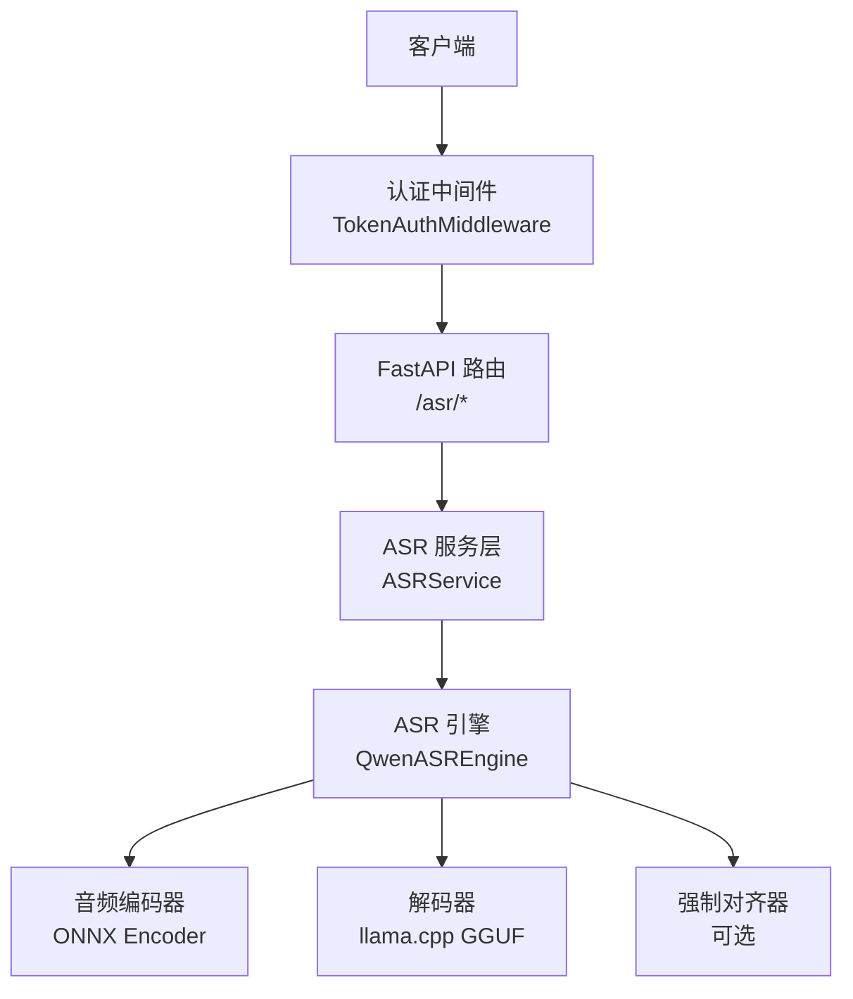
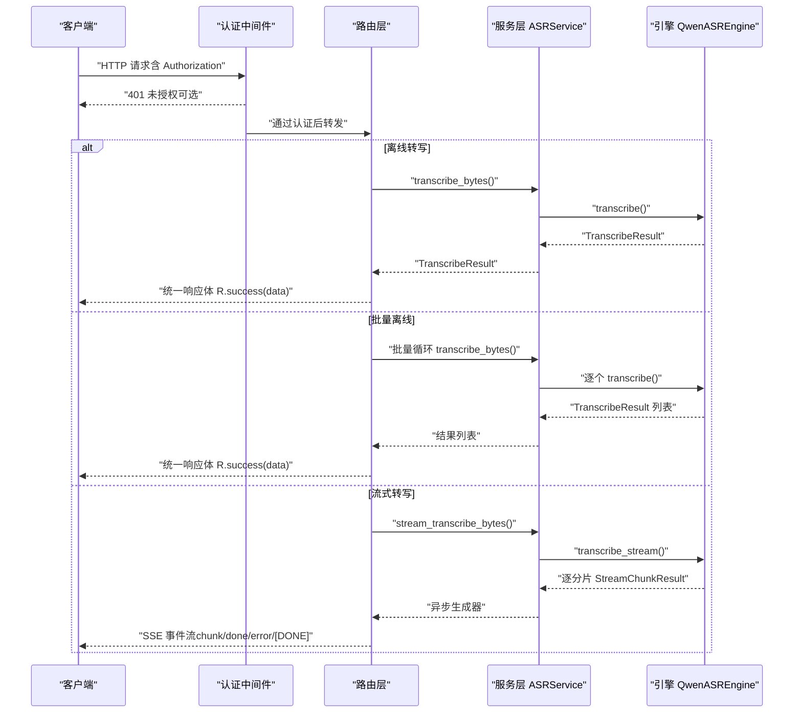
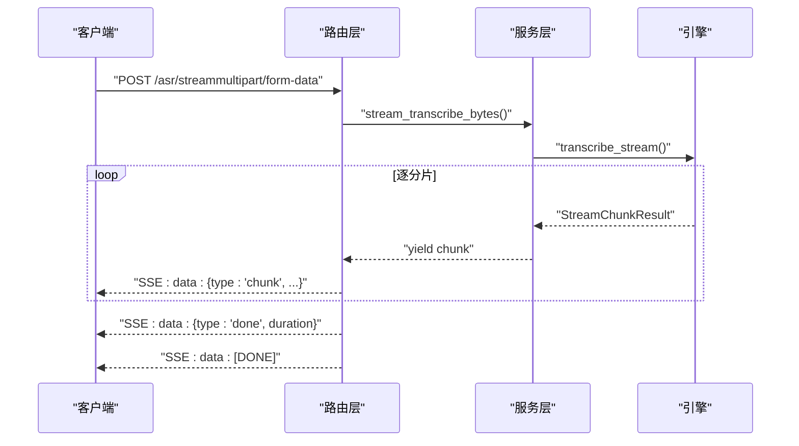
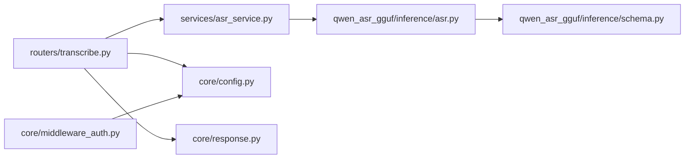

# API参考

<cite>
**本文引用的文件**
- [routers/transcribe.py](file://routers/transcribe.py)
- [services/asr_service.py](file://services/asr_service.py)
- [core/config.py](file://core/config.py)
- [core/response.py](file://core/response.py)
- [core/middleware_auth.py](file://core/middleware_auth.py)
- [qwen_asr_gguf/inference/schema.py](file://qwen_asr_gguf/inference/schema.py)
- [qwen_asr_gguf/inference/asr.py](file://qwen_asr_gguf/inference/asr.py)
- [README.md](file://README.md)
</cite>

## 目录
1. [简介](#简介)
2. [项目结构](#项目结构)
3. [核心组件](#核心组件)
4. [架构总览](#架构总览)
5. [详细组件分析](#详细组件分析)
6. [依赖分析](#依赖分析)
7. [性能考虑](#性能考虑)
8. [故障排查指南](#故障排查指南)
9. [结论](#结论)
10. [附录](#附录)

## 简介
本文件为 Qwen3-ASR GGUF 的完整 API 参考，覆盖以下 RESTful 接口：
- 离线转写接口：POST /asr/offline
- 批量离线转写接口：POST /asr/offline/batch
- 流式转写接口（SSE）：POST /asr/stream
- 健康检查接口：GET /asr/health

文档内容包括：
- HTTP 方法、URL 模式、请求参数 schema、响应格式
- 错误代码说明与认证方法
- 流式传输的 SSE 实现细节（事件类型、心跳机制、完成/错误事件）
- 请求/响应示例、参数验证规则、速率限制与版本控制信息
- 客户端实现指南与性能优化建议

## 项目结构
本项目基于 FastAPI 构建 Web 服务，路由通过自动扫描注册，统一返回体使用统一响应包装器，认证通过中间件实现。

图表来源
- [routers/transcribe.py](file://routers/transcribe.py)
- [services/asr_service.py](file://services/asr_service.py)
- [qwen_asr_gguf/inference/asr.py](file://qwen_asr_gguf/inference/asr.py)

章节来源
- [routers/transcribe.py](file://routers/transcribe.py)
- [core/middleware_auth.py](file://core/middleware_auth.py)
- [README.md](file://README.md)

## 核心组件
- 路由与控制器：位于 routers/transcribe.py，定义了 /asr/offline、/asr/offline/batch、/asr/stream、/asr/health 四个端点，并负责参数校验、文件大小限制、SSE 响应构建。
- 服务层：位于 services/asr_service.py，提供线程安全的 ASR 调用封装，支持离线与流式两种模式，内部通过 asyncio.Lock 串行化引擎访问，使用线程池执行阻塞推理。
- 引擎与数据结构：位于 qwen_asr_gguf/inference/asr.py 与 qwen_asr_gguf/inference/schema.py，定义了 ASR 引擎、分片结果、对齐结果等核心数据结构与推理流程。
- 配置与统一响应：core/config.py 提供服务端配置（主机、端口、基础路径、文件大小限制、默认语言等）；core/response.py 提供统一返回体 R。

章节来源
- [services/asr_service.py](file://services/asr_service.py)
- [qwen_asr_gguf/inference/asr.py](file://qwen_asr_gguf/inference/asr.py)
- [qwen_asr_gguf/inference/schema.py](file://qwen_asr_gguf/inference/schema.py)
- [core/config.py](file://core/config.py)
- [core/response.py](file://core/response.py)

## 架构总览
下图展示了从客户端请求到引擎推理再到响应返回的整体流程，涵盖离线、批量与流式三种模式。

图表来源
- [routers/transcribe.py](file://routers/transcribe.py)
- [services/asr_service.py](file://services/asr_service.py)
- [qwen_asr_gguf/inference/asr.py](file://qwen_asr_gguf/inference/asr.py)

## 详细组件分析

### 离线转写接口（POST /asr/offline）
- 描述：上传单个音频文件，等待转写完成后一次性返回完整结果。适合短音频或对延迟不敏感的批量任务。
- 认证：需要 Authorization 头，值为 Bearer {web_secret_key}，web_secret_key 来源于配置项。
- 请求参数（multipart/form-data）
  - file: 必填，音频文件（支持 wav、mp3、flac、m4a、ogg 等常见格式）
  - context: 可选，上下文提示词（如场景描述）
  - language: 可选，语言（如 Chinese/English 等）
  - temperature: 可选，默认 0.0，解码温度（0 为贪婪解码）
  - enable_srt: 可选，默认 false，是否在响应中附带 SRT 字幕
  - enable_aligner: 可选，默认 false，是否启用对齐模型进行词级对齐
- 响应格式
  - 成功：R.success(data: TranscribeData)
    - text: 原始转写文本
    - text_itn: ITN 数字归一化后的文本
    - srt: SRT 字幕内容（当 enable_srt 为真且存在对齐数据时）
    - alignment: 逐词对齐时间戳列表（当 enable_aligner 为真且存在对齐数据时）
    - duration: 音频时长（秒）
  - 失败：R.fail，包含错误码与消息
- 错误与限制
  - 413：文件过大（超过 MAX_FILE_SIZE_MB）
  - 500：引擎未初始化或推理异常
- 速率限制：未内置速率限制，建议在网关或反向代理层实施
- 版本控制：基础路径由配置项 base_url 决定，默认 /qwen3-asr/api/v1

章节来源
- [routers/transcribe.py](file://routers/transcribe.py)
- [core/config.py](file://core/config.py)
- [core/response.py](file://core/response.py)

### 批量离线转写接口（POST /asr/offline/batch）
- 描述：上传多个音频文件，依次转写并返回结果列表。对过大文件会跳过并记录警告。
- 认证：同上
- 请求参数
  - files: 必填，音频文件数组
  - context/language/temperature/enable_srt/enable_aligner: 同离线接口
- 响应格式
  - 成功：R.success(data: List[TranscribeData])
  - 失败：R.fail
- 错误与限制
  - 单文件过大：跳过并返回包含“文件过大”提示的结果项
  - 空结果：跳过 text 为空的结果项
  - 异常：捕获异常并返回包含错误信息的结果项
- 适用场景：短音频、批量任务

章节来源
- [routers/transcribe.py](file://routers/transcribe.py)
- [core/config.py](file://core/config.py)
- [core/response.py](file://core/response.py)

### 流式转写接口（POST /asr/stream，SSE）
- 描述：上传音频文件后，以 Server-Sent Events 格式实时推送转写结果。每处理完一个音频分片（默认 30 秒），立即推送一条事件。
- 认证：同上
- 请求参数
  - file: 必填，音频文件
  - context/language/temperature/enable_srt/enable_aligner: 同离线接口
- SSE 事件类型
  - chunk：单个分片的转写文本，包含分片时间轴与是否被 VAD 判定为静音
    - 字段：type、segment、text、start、end、alignment（可选）、srt（可选）
  - done：转写结束，包含完整文本、SRT、对齐时间戳及耗时统计
    - 字段：type、duration
  - error：发生异常时的错误事件
    - 字段：type、message
  - [DONE]：流结束标志（兼容 OpenAI 风格客户端）
- 心跳机制
  - 每 15 秒发送 SSE 注释心跳 “: keepalive”，防止代理/客户端超时断开
- 错误与限制
  - 413：文件过大
  - 500：引擎未初始化或推理异常
- 适用场景：长音频转写、需要实时展示进度的 Web/App 应用
- 客户端实现要点
  - 使用浏览器原生 EventSource 或支持 SSE 的 HTTP 客户端
  - 处理 chunk 事件，拼接 text 得到实时文本
  - 监听 done 事件，获取最终文本与统计信息
  - 监听 error 事件，进行错误处理
  - 监听 [DONE] 事件，关闭连接
- 性能与优化
  - 服务端配置：VAD 动态分片由音频时长自动触发（超过阈值时自动启用），默认阈值与分片长度可在服务端配置
  - 建议：长音频场景启用 VAD，减少静音段推理与幻觉

图表来源
- [routers/transcribe.py](file://routers/transcribe.py)
- [services/asr_service.py](file://services/asr_service.py)
- [qwen_asr_gguf/inference/asr.py](file://qwen_asr_gguf/inference/asr.py)

章节来源
- [routers/transcribe.py](file://routers/transcribe.py)
- [services/asr_service.py](file://services/asr_service.py)
- [qwen_asr_gguf/inference/asr.py](file://qwen_asr_gguf/inference/asr.py)

### 健康检查接口（GET /asr/health）
- 描述：返回 ASR 引擎运行状态
- 认证：无需认证
- 响应格式
  - R.success(data: HealthData)
    - status: ok 或 unavailable
    - engine_ready: 引擎是否就绪
    - gpu_enabled: 是否启用 GPU
- 适用场景：服务监控、容器探针

章节来源
- [routers/transcribe.py](file://routers/transcribe.py)
- [core/response.py](file://core/response.py)

### 统一响应与错误码
- 统一响应体 R
  - code: 整数，业务状态码
  - msg: 字符串，消息
  - data: 可选，具体数据
- 常见错误码
  - 401：未授权（Authorization 头缺失或不正确）
  - 413：请求实体过大（文件大小超过限制）
  - 500：服务器内部错误（引擎未初始化、推理异常等）

章节来源
- [core/response.py](file://core/response.py)
- [core/middleware_auth.py](file://core/middleware_auth.py)
- [core/config.py](file://core/config.py)

### 数据模型与结构
- TranscribeData：离线转写完整结果
  - text、text_itn、srt、alignment、duration
- AlignmentItem：逐词对齐项
  - text、start（秒）、end（秒）
- HealthData：健康检查数据
  - status、engine_ready、gpu_enabled
- StreamChunkResult：流式转录单分片结果
  - segment_idx、text、start_sec、end_sec、is_last、skipped_by_vad、full_text、性能统计字段
- TranscribeResult：转录结果（含可选对齐）
  - text、alignment、performance

章节来源
- [routers/transcribe.py](file://routers/transcribe.py)
- [qwen_asr_gguf/inference/schema.py](file://qwen_asr_gguf/inference/schema.py)

## 依赖分析
- 路由层依赖服务层与配置，服务层依赖引擎与配置，引擎依赖音频编码器与解码器。
- 认证中间件依赖配置中的 web_secret_key，用于校验 Authorization 头。

图表来源
- [routers/transcribe.py](file://routers/transcribe.py)
- [services/asr_service.py](file://services/asr_service.py)
- [core/config.py](file://core/config.py)
- [core/response.py](file://core/response.py)
- [core/middleware_auth.py](file://core/middleware_auth.py)
- [qwen_asr_gguf/inference/asr.py](file://qwen_asr_gguf/inference/asr.py)
- [qwen_asr_gguf/inference/schema.py](file://qwen_asr_gguf/inference/schema.py)

章节来源
- [routers/transcribe.py](file://routers/transcribe.py)
- [services/asr_service.py](file://services/asr_service.py)
- [core/config.py](file://core/config.py)
- [core/response.py](file://core/response.py)
- [core/middleware_auth.py](file://core/middleware_auth.py)
- [qwen_asr_gguf/inference/asr.py](file://qwen_asr_gguf/inference/asr.py)
- [qwen_asr_gguf/inference/schema.py](file://qwen_asr_gguf/inference/schema.py)

## 性能考虑
- 分片与 VAD：默认分片长度为 30 秒，超过阈值时自动启用 VAD 动态分片，跳过静音段以降低 RTF 并减少幻觉。
- 对齐：启用对齐会带来额外的对齐耗时，仅在需要时间戳时开启。
- 温度与解码：temperature=0 为贪婪解码，通常更快更稳定；提高温度可能提升多样性但会增加耗时。
- GPU 加速：可通过配置启用 GPU，显著提升推理速度。
- 批量与流式：长音频建议使用流式接口以获得更好的实时性；批量接口适合短音频与离线任务。

章节来源
- [README.md](file://README.md)
- [services/asr_service.py](file://services/asr_service.py)
- [qwen_asr_gguf/inference/asr.py](file://qwen_asr_gguf/inference/asr.py)

## 故障排查指南
- 401 未授权
  - 检查 Authorization 头是否为 Bearer {web_secret_key}
  - 确认 web_secret_key 与服务端一致
- 413 文件过大
  - 减小上传文件大小或调整 MAX_FILE_SIZE_MB
- 500 服务器内部错误
  - 检查引擎是否初始化成功
  - 查看服务端日志定位异常
- SSE 连接断开
  - 确认客户端正确处理心跳事件（每 15 秒）
  - 确认代理/网关未缓存或截断 SSE 流（服务端已设置相关头以禁用缓冲）
- VAD 未生效
  - 确认音频时长超过动态分片阈值
  - 检查 VAD 模型路径与可用性

章节来源
- [core/middleware_auth.py](file://core/middleware_auth.py)
- [core/config.py](file://core/config.py)
- [routers/transcribe.py](file://routers/transcribe.py)
- [services/asr_service.py](file://services/asr_service.py)

## 结论
本文档提供了 Qwen3-ASR GGUF 的完整 API 参考，覆盖离线、批量与流式三种转写模式，明确了认证、参数、响应、错误与性能优化要点。建议在生产环境中结合网关/反向代理实施速率限制与 TLS 加密，并根据业务场景合理选择分片长度与对齐策略以平衡实时性与准确性。

## 附录

### 认证方法
- 头部字段：Authorization: Bearer {web_secret_key}
- web_secret_key 来源于配置项 web_secret_key，默认值为 qwen3-asr-token

章节来源
- [core/middleware_auth.py](file://core/middleware_auth.py)
- [core/config.py](file://core/config.py)

### 版本控制与基础路径
- 基础路径由配置项 base_url 决定，默认 /qwen3-asr/api/v1
- 本项目未提供显式的 API 版本号，建议客户端通过基础路径区分版本

章节来源
- [core/config.py](file://core/config.py)
- [README.md](file://README.md)

### 参数验证规则
- 文件大小：超过 MAX_FILE_SIZE_MB 将返回 413
- 语言：会进行语言名称归一化与有效性校验
- 温度：建议在 [0.0, 1.0] 范围内使用
- enable_srt/enable_aligner：仅在存在对齐数据时输出相应字段

章节来源
- [routers/transcribe.py](file://routers/transcribe.py)
- [qwen_asr_gguf/inference/asr.py](file://qwen_asr_gguf/inference/asr.py)

### 客户端实现建议
- 离线/批量：使用 multipart/form-data 上传文件，解析统一响应体 R
- 流式（SSE）：使用 EventSource 或支持 SSE 的 HTTP 客户端，处理 chunk/done/error/[DONE] 事件
- 错误处理：针对 401/413/500 做相应提示与重试策略
- 性能优化：长音频启用 VAD，合理设置分片长度与对齐开关

章节来源
- [routers/transcribe.py](file://routers/transcribe.py)
- [services/asr_service.py](file://services/asr_service.py)