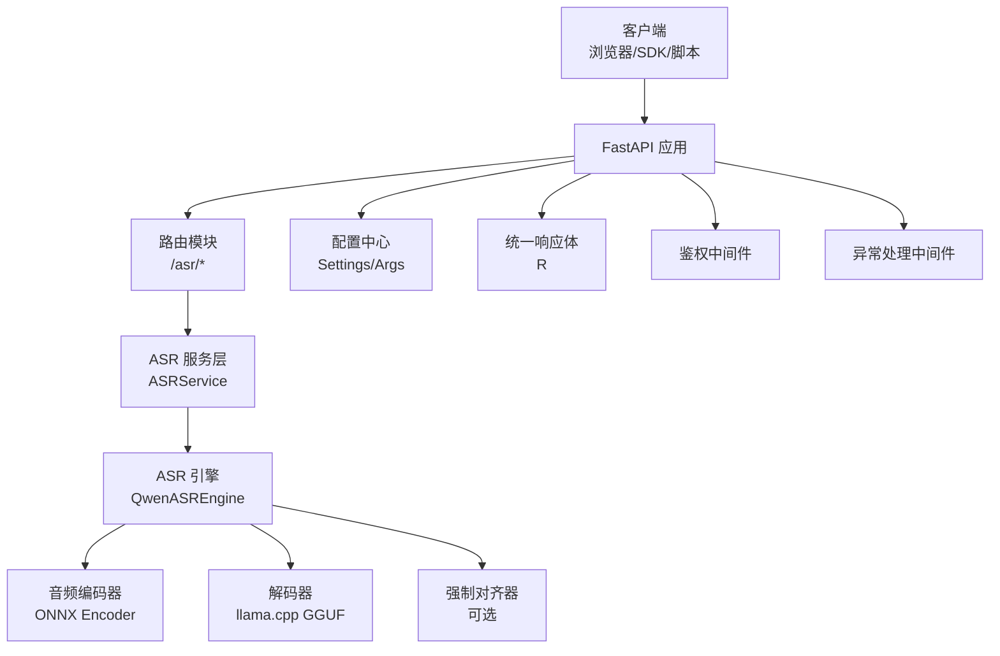
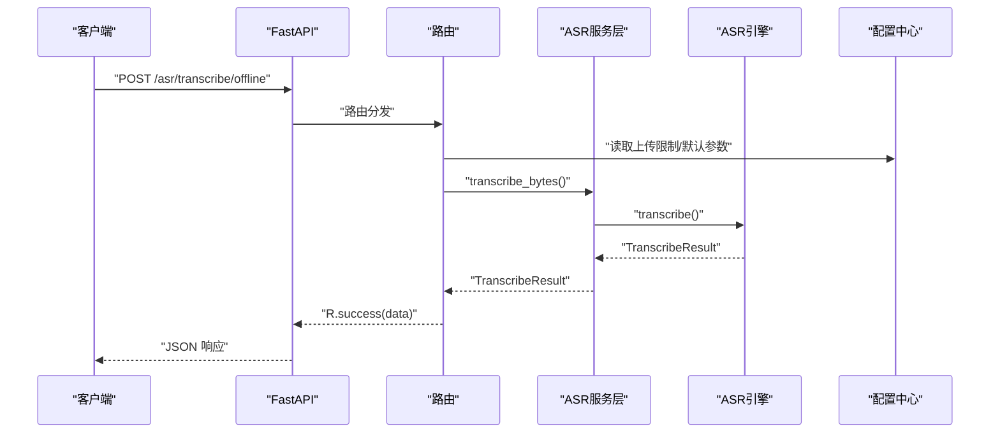
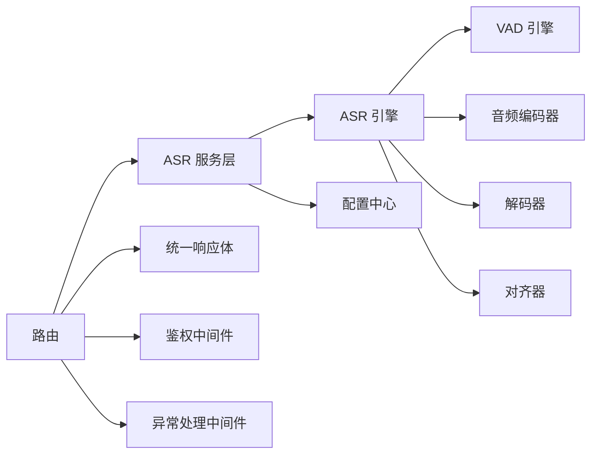

# RESTful API接口

<cite>
**本文引用的文件**
- [routers/transcribe.py](file://routers/transcribe.py)
- [services/asr_service.py](file://services/asr_service.py)
- [core/config.py](file://core/config.py)
- [core/response.py](file://core/response.py)
- [core/middleware_auth.py](file://core/middleware_auth.py)
- [core/gobal_exception.py](file://core/gobal_exception.py)
- [qwen_asr_gguf/inference/schema.py](file://qwen_asr_gguf/inference/schema.py)
- [qwen_asr_gguf/inference/exporters.py](file://qwen_asr_gguf/inference/exporters.py)
- [infer.py](file://infer.py)
- [README.md](file://README.md)
</cite>

## 目录
1. [简介](#简介)
2. [项目结构](#项目结构)
3. [核心组件](#核心组件)
4. [架构总览](#架构总览)
5. [详细组件分析](#详细组件分析)
6. [依赖分析](#依赖分析)
7. [性能考虑](#性能考虑)
8. [故障排查指南](#故障排查指南)
9. [结论](#结论)
10. [附录](#附录)

## 简介
本文件面向 Qwen3-ASR GGUF 的 Web 服务，系统性梳理并规范 RESTful API 接口，覆盖单文件离线转写、批量离线转写、流式实时转写（SSE）与健康检查等能力。文档提供每个接口的 HTTP 方法、URL 路径、请求参数 schema、响应格式、错误代码说明、参数校验规则、文件格式支持、并发限制、性能考量与最佳实践，并给出 curl 与 Python requests 示例。

## 项目结构
- Web 应用基于 FastAPI 构建，路由通过自动扫描注册，基础路径由配置决定。
- ASR 服务层封装了线程安全的推理执行，支持离线与流式两种模式。
- 配置集中于 Settings，包含上传限制、默认语言、分片策略、VAD 参数等。
- 统一响应体 R，全局异常处理与鉴权中间件保障稳定性与安全性。

图表来源
- [infer.py:85-102](file://infer.py#L85-L102)
- [routers/transcribe.py:40-40](file://routers/transcribe.py#L40-L40)
- [services/asr_service.py:34-115](file://services/asr_service.py#L34-L115)
- [core/config.py:52-109](file://core/config.py#L52-L109)
- [core/response.py:7-23](file://core/response.py#L7-L23)

章节来源
- [infer.py:85-110](file://infer.py#L85-L110)
- [README.md:228-262](file://README.md#L228-L262)

## 核心组件
- 路由与接口
  - 单文件离线转写：POST /asr/transcribe/offline
  - 批量文件离线转写：POST /asr/transcribe/offline/batch
  - 流式实时转写（SSE）：POST /asr/transcribe/stream
  - 健康检查：GET /asr/health
- 服务层
  - ASRService：线程安全封装，串行执行，离线/流式统一入口。
- 配置中心
  - Settings：包含上传限制、默认语言、分片长度、VAD 阈值、对齐器开关等。
- 统一响应体
  - R：统一返回结构 code/msg/data。
- 鉴权与异常
  - TokenAuthMiddleware：基于 Authorization 头的 Bearer 令牌校验。
  - 全局异常处理器：规范化错误响应。

章节来源
- [routers/transcribe.py:120-385](file://routers/transcribe.py#L120-L385)
- [services/asr_service.py:34-322](file://services/asr_service.py#L34-L322)
- [core/config.py:52-109](file://core/config.py#L52-L109)
- [core/response.py:7-23](file://core/response.py#L7-L23)
- [core/middleware_auth.py:10-26](file://core/middleware_auth.py#L10-L26)
- [core/gobal_exception.py:9-40](file://core/gobal_exception.py#L9-L40)

## 架构总览
- 请求进入 FastAPI，经中间件与路由分发到具体接口。
- 接口调用 ASRService，服务层通过 asyncio.Lock 串行化引擎调用，避免并发冲突。
- 引擎内部集成 VAD 动态分片、编码器与解码器流水线，必要时启用对齐器。
- 响应统一包装为 R.success/R.fail，异常统一捕获并返回。

图表来源
- [routers/transcribe.py:134-161](file://routers/transcribe.py#L134-L161)
- [services/asr_service.py:158-181](file://services/asr_service.py#L158-L181)
- [core/config.py:92-94](file://core/config.py#L92-L94)

章节来源
- [routers/transcribe.py:119-161](file://routers/transcribe.py#L119-L161)
- [services/asr_service.py:118-181](file://services/asr_service.py#L118-L181)

## 详细组件分析

### 接口：POST /asr/transcribe/offline（单文件离线转写）
- 描述
  - 上传单个音频文件，一次性返回完整转写结果。适合短音频与对延迟不敏感的批量任务。
- 请求方式
  - POST
- 路径
  - /asr/transcribe/offline
- 表单字段（multipart/form-data）
  - file: UploadFile（必填）
  - context: string（可选，上下文提示词）
  - language: string（可选，语言）
  - temperature: number（可选，默认 0.0，贪婪解码）
  - enable_srt: boolean（可选，默认 false）
  - enable_aligner: boolean（可选，默认 false）
- 文件上传限制
  - MAX_FILE_SIZE_MB：由配置项控制，默认 120MB。
- 响应数据结构
  - TranscribeData
    - text: string（原始文本）
    - text_itn: string（ITN 数字归一化后文本）
    - srt: string（SRT 字幕内容，启用时返回）
    - alignment: array（对齐项列表，启用时返回）
      - text: string
      - start: number（秒）
      - end: number（秒）
    - duration: number（秒）
- 错误与状态码
  - 413：文件过大
  - 500：内部异常（统一异常处理）
- 参数校验规则
  - file 为必填；其余字段可空，空值由服务端默认值覆盖。
- 并发与性能
  - 服务层使用 asyncio.Lock 串行执行，避免并发冲突；推理在独立线程池执行，不阻塞事件循环。
- curl 示例
  - curl -X POST "{BASE_URL}/asr/transcribe/offline" -H "Authorization: Bearer {TOKEN}" -F "file=@audio.wav" -F "language=Chinese" -F "enable_srt=true" -F "enable_aligner=true"
- Python requests 示例
  - files = {"file": open("audio.wav", "rb")}
  - data = {"language": "Chinese", "enable_srt": "true", "enable_aligner": "true"}
  - rsp = requests.post("{BASE_URL}/asr/transcribe/offline", headers={"Authorization": "Bearer {TOKEN}"}, files=files, data=data)
- 最佳实践
  - 长音频建议使用流式接口；短音频（< 1 分钟）可优先使用离线接口。
  - 如需字幕与词级对齐，启用相应开关；对齐会增加推理耗时。

章节来源
- [routers/transcribe.py:120-161](file://routers/transcribe.py#L120-L161)
- [services/asr_service.py:158-181](file://services/asr_service.py#L158-L181)
- [core/config.py:92-94](file://core/config.py#L92-L94)
- [core/response.py:16-18](file://core/response.py#L16-L18)
- [core/middleware_auth.py:18-24](file://core/middleware_auth.py#L18-L24)
- [core/gobal_exception.py:12-18](file://core/gobal_exception.py#L12-L18)

### 接口：POST /asr/transcribe/offline/batch（批量文件离线转写）
- 描述
  - 上传多个音频文件，依次转写并返回结果列表。文件过大将被跳过并记录警告日志。
- 请求方式
  - POST
- 路径
  - /asr/transcribe/offline/batch
- 表单字段
  - files: array[UploadFile]（必填，文件数组）
  - context/language/temperature/enable_srt/enable_aligner：同上
- 响应数据结构
  - R.success(data: array[TranscribeData | 错误/跳过说明])
- 错误与状态码
  - 413：单文件过大时跳过并返回说明
  - 500：内部异常
- 参数校验规则
  - files 为必填；其余字段可空。
- 并发与性能
  - 串行处理，逐个文件转写；空结果将被跳过。
- curl 示例
  - curl -X POST "{BASE_URL}/asr/transcribe/offline/batch" -H "Authorization: Bearer {TOKEN}" -F "files=@a.wav" -F "files=@b.mp3" -F "language=Chinese"
- Python requests 示例
  - files = [("files", open("a.wav", "rb")), ("files", open("b.mp3", "rb"))]
  - data = {"language": "Chinese"}
  - rsp = requests.post("{BASE_URL}/asr/transcribe/offline/batch", headers={"Authorization": "Bearer {TOKEN}"}, files=files, data=data)
- 最佳实践
  - 批量任务建议控制文件数量与大小；对大文件可先预检再提交。

章节来源
- [routers/transcribe.py:164-222](file://routers/transcribe.py#L164-L222)
- [services/asr_service.py:158-181](file://services/asr_service.py#L158-L181)
- [core/config.py:92-94](file://core/config.py#L92-L94)

### 接口：POST /asr/transcribe/stream（流式实时转写，SSE）
- 描述
  - 上传音频文件后，以 Server-Sent Events 实时推送转写结果。适合长音频与需要实时展示进度的场景。
- 请求方式
  - POST
- 路径
  - /asr/transcribe/stream
- 表单字段
  - file: UploadFile（必填）
  - context/language/temperature/enable_srt/enable_aligner：同上
- 响应格式
  - Content-Type: text/event-stream
  - 事件类型
    - chunk：单个分片的文本与时间轴；当启用对齐或字幕时，携带 srt/alignment。
    - done：转写结束，包含完整文本、SRT、对齐时间戳与音频时长。
    - [DONE]：流结束标志。
- 心跳机制
  - 每 15 秒发送注释行 : keepalive，防止代理/客户端超时断开。
- 错误与状态码
  - 413：文件过大
  - 500：内部异常
- 参数校验规则
  - file 为必填；其余可空。
- 并发与性能
  - 服务层串行执行；流式接口通过队列桥接线程与事件循环，具备背压控制。
- curl 示例
  - curl -N -X POST "{BASE_URL}/asr/transcribe/stream" -H "Authorization: Bearer {TOKEN}" -F "file=@audio.wav" -F "enable_aligner=true"
- Python requests 示例
  - requests.post("{BASE_URL}/asr/transcribe/stream", headers={"Authorization": "Bearer {TOKEN}"}, files={"file": open("audio.wav", "rb")}, stream=True)
- 最佳实践
  - 建议使用前端 EventSource 或支持 SSE 的客户端；不要在 Swagger UI 中直接测试。

章节来源
- [routers/transcribe.py:228-370](file://routers/transcribe.py#L228-L370)
- [services/asr_service.py:186-288](file://services/asr_service.py#L186-L288)
- [core/config.py:92-94](file://core/config.py#L92-L94)

### 接口：GET /asr/health（健康检查）
- 描述
  - 返回 ASR 引擎运行状态与 GPU 状态。
- 请求方式
  - GET
- 路径
  - /asr/health
- 响应数据结构
  - HealthData
    - status: string（ok/unavailable）
    - engine_ready: boolean
    - gpu_enabled: boolean
- 错误与状态码
  - 500：内部异常
- 参数
  - 无
- 最佳实践
  - 健康检查可用于探活与运维监控。

章节来源
- [routers/transcribe.py:375-384](file://routers/transcribe.py#L375-L384)
- [services/asr_service.py:112-114](file://services/asr_service.py#L112-L114)
- [core/config.py:27-31](file://core/config.py#L27-L31)

### 数据模型与工具
- TranscribeData
  - 字段：text/text_itn/srt/alignment/duration
- AlignmentItem
  - 字段：text/start/end
- HealthData
  - 字段：status/engine_ready/gpu_enabled
- exporters.alignment_to_srt
  - 将对齐结果转换为 SRT 字符串
- Schema
  - TranscribeResult/StreamChunkResult/ForcedAlignResult 等

章节来源
- [routers/transcribe.py:46-114](file://routers/transcribe.py#L46-L114)
- [qwen_asr_gguf/inference/exporters.py:10-71](file://qwen_asr_gguf/inference/exporters.py#L10-L71)
- [qwen_asr_gguf/inference/schema.py:212-235](file://qwen_asr_gguf/inference/schema.py#L212-L235)

## 依赖分析
- 路由依赖服务层，服务层依赖引擎与配置；统一响应体与中间件贯穿请求链路。
- 引擎内部集成 VAD、编码器、解码器与对齐器，形成完整的转录流水线。

图表来源
- [routers/transcribe.py:34-38](file://routers/transcribe.py#L34-L38)
- [services/asr_service.py:34-115](file://services/asr_service.py#L34-L115)
- [core/response.py:7-23](file://core/response.py#L7-L23)
- [core/middleware_auth.py:10-26](file://core/middleware_auth.py#L10-L26)
- [core/gobal_exception.py:9-40](file://core/gobal_exception.py#L9-L40)

章节来源
- [routers/transcribe.py:34-38](file://routers/transcribe.py#L34-L38)
- [services/asr_service.py:34-115](file://services/asr_service.py#L34-L115)

## 性能考虑
- 并发限制
  - 服务层使用 asyncio.Lock 串行化引擎调用，引擎不支持并发，避免资源争用与崩溃。
- 分片与 VAD
  - 长音频自动启用 VAD 动态分片，跳过静音段，降低 RTF 并减少幻觉。
- 对齐器
  - 对齐会增加推理耗时，建议仅在需要时间戳时启用。
- 上传限制
  - MAX_FILE_SIZE_MB 默认 120MB，避免内存压力与超时。
- 推荐配置
  - 长音频建议启用 VAD、合理设置分片长度与记忆片段数；对齐器按需开启。

章节来源
- [services/asr_service.py:36-40](file://services/asr_service.py#L36-L40)
- [core/config.py:92-94](file://core/config.py#L92-L94)
- [README.md:228-262](file://README.md#L228-L262)

## 故障排查指南
- 401 未授权
  - 检查 Authorization 头是否为 Bearer {web_secret_key}。
- 413 文件过大
  - 降低文件大小或提高 MAX_FILE_SIZE_MB（需重启服务）。
- 500 服务器内部错误
  - 查看服务端日志，确认引擎初始化与模型路径正确。
- 流式接口无法接收事件
  - 确认使用 SSE 客户端；Swagger UI 不支持直接测试。
- 响应为空或跳过
  - 检查文件格式与内容；确认未被 VAD 跳过（静音段）。

章节来源
- [core/middleware_auth.py:18-24](file://core/middleware_auth.py#L18-L24)
- [routers/transcribe.py:77-88](file://routers/transcribe.py#L77-L88)
- [core/gobal_exception.py:34-37](file://core/gobal_exception.py#L34-L37)

## 结论
本文档系统化梳理了 Qwen3-ASR GGUF 的 RESTful API，明确了各接口的请求参数、响应格式、错误处理与最佳实践。通过统一的配置中心、服务层封装与中间件体系，实现了稳定、可扩展的语音识别服务。建议在生产环境中结合 VAD、对齐器与合理的并发策略，获得更优的性能与体验。

## 附录
- 基础路径与鉴权
  - 基础路径由配置决定；接口均需 Authorization: Bearer {web_secret_key}。
- 配置项摘要
  - HOST/PORT、MODEL_DIR/DATA_DIR、UPLOAD_DIR、MAX_FILE_SIZE_MB、DEFAULT_LANGUAGE、ASR_*、VAD_*、ALIGNER_* 等。
- 参考
  - 项目 README 提供了部署、模型导出与性能数据等背景信息。

章节来源
- [infer.py:85-110](file://infer.py#L85-L110)
- [core/config.py:52-109](file://core/config.py#L52-L109)
- [README.md:228-262](file://README.md#L228-L262)