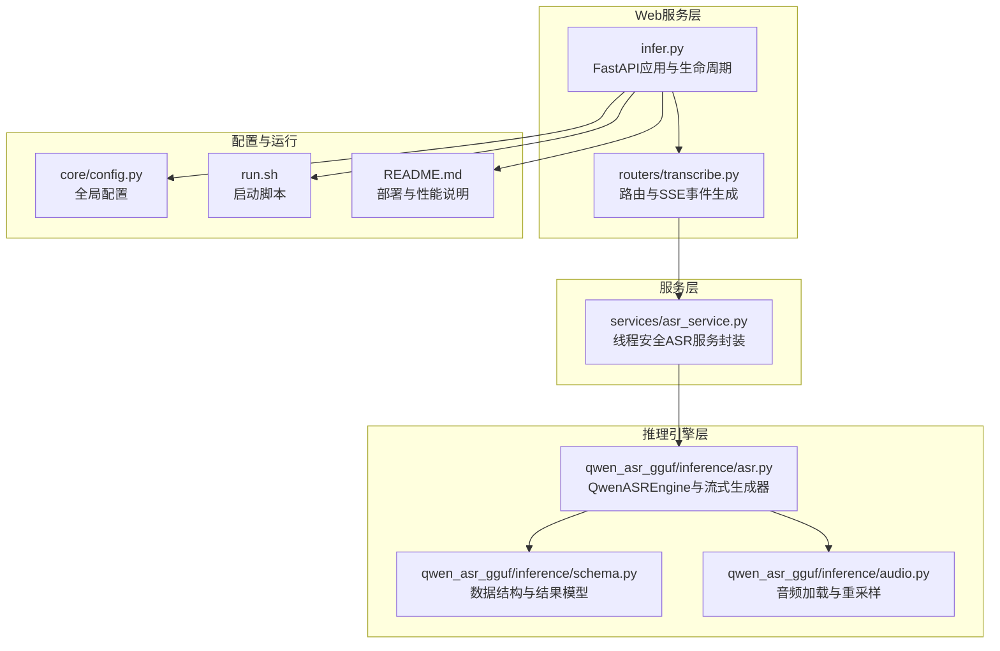
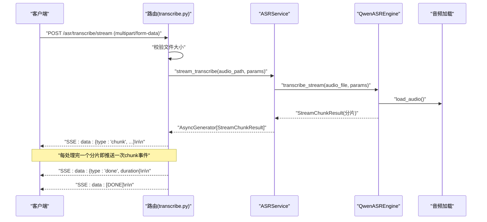
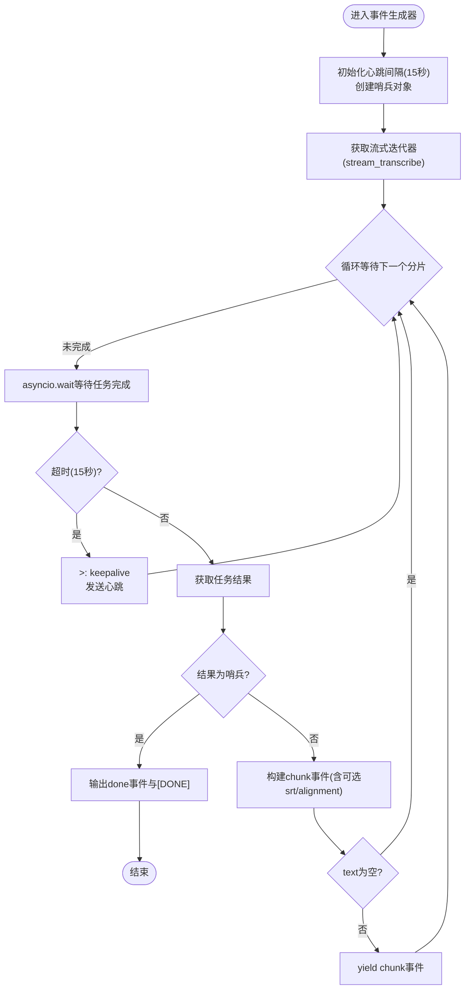
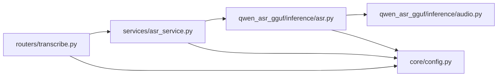

# 流式API接口

<cite>
**本文引用的文件**
- [routers/transcribe.py](file://routers/transcribe.py)
- [services/asr_service.py](file://services/asr_service.py)
- [qwen_asr_gguf/inference/asr.py](file://qwen_asr_gguf/inference/asr.py)
- [qwen_asr_gguf/inference/schema.py](file://qwen_asr_gguf/inference/schema.py)
- [qwen_asr_gguf/inference/audio.py](file://qwen_asr_gguf/inference/audio.py)
- [core/config.py](file://core/config.py)
- [infer.py](file://infer.py)
- [run.sh](file://run.sh)
- [README.md](file://README.md)
</cite>

## 目录
1. [简介](#简介)
2. [项目结构](#项目结构)
3. [核心组件](#核心组件)
4. [架构总览](#架构总览)
5. [详细组件分析](#详细组件分析)
6. [依赖关系分析](#依赖关系分析)
7. [性能考量](#性能考量)
8. [故障排查指南](#故障排查指南)
9. [结论](#结论)
10. [附录](#附录)

## 简介
本文件面向POST /asr/transcribe/stream（流式实时转写）接口，系统性阐述基于Server-Sent Events (SSE)的实现细节与最佳实践。重点覆盖：
- SSE事件格式与事件类型（chunk、done、[DONE]）
- 事件生成机制、心跳保持机制（15秒keepalive）
- 异步迭代器与线程桥接的实现
- 适用场景、性能优势、内存管理策略与错误恢复机制
- 调试技巧、网络代理配置与生产部署注意事项
- 客户端实现参考（JavaScript EventSource、Node.js、Python aiohttp）

## 项目结构
本项目采用FastAPI + ASGI（Uvicorn）提供Web服务，路由集中在routers目录，业务逻辑位于services与inference目录，核心ASR引擎位于qwen_asr_gguf/inference。

**图表来源**
- [infer.py:55-123](file://infer.py#L55-L123)
- [routers/transcribe.py:1-383](file://routers/transcribe.py#L1-L383)
- [services/asr_service.py:1-322](file://services/asr_service.py#L1-L322)
- [qwen_asr_gguf/inference/asr.py:1-893](file://qwen_asr_gguf/inference/asr.py#L1-L893)
- [qwen_asr_gguf/inference/schema.py:1-235](file://qwen_asr_gguf/inference/schema.py#L1-L235)
- [qwen_asr_gguf/inference/audio.py:1-149](file://qwen_asr_gguf/inference/audio.py#L1-L149)
- [core/config.py:1-109](file://core/config.py#L1-L109)
- [run.sh:1-63](file://run.sh#L1-L63)
- [README.md:1-389](file://README.md#L1-L389)

**章节来源**
- [infer.py:55-123](file://infer.py#L55-L123)
- [routers/transcribe.py:1-383](file://routers/transcribe.py#L1-L383)
- [services/asr_service.py:1-322](file://services/asr_service.py#L1-L322)
- [qwen_asr_gguf/inference/asr.py:1-893](file://qwen_asr_gguf/inference/asr.py#L1-L893)
- [qwen_asr_gguf/inference/schema.py:1-235](file://qwen_asr_gguf/inference/schema.py#L1-L235)
- [qwen_asr_gguf/inference/audio.py:1-149](file://qwen_asr_gguf/inference/audio.py#L1-L149)
- [core/config.py:1-109](file://core/config.py#L1-L109)
- [run.sh:1-63](file://run.sh#L1-L63)
- [README.md:1-389](file://README.md#L1-L389)

## 核心组件
- 路由与SSE事件生成：负责接收音频文件、校验大小、调用服务层流式转写，并以text/event-stream格式实时推送chunk/done/[DONE]事件。
- 服务层ASRService：提供线程安全的转写接口，内部使用锁保证引擎串行访问；流式接口通过队列与线程桥接同步生成器与异步消费者。
- 引擎QwenASREngine：实现统一的转录流水线，支持固定分片与VAD动态分片两种模式，生成StreamChunkResult供上层消费。
- 音频加载：支持多种格式，自动重采样至目标采样率，确保推理一致性。
- 配置与生命周期：全局配置控制分片长度、记忆片段数、VAD阈值、对齐开关等；应用启动时初始化引擎，关闭时优雅释放。

**章节来源**
- [routers/transcribe.py:225-383](file://routers/transcribe.py#L225-L383)
- [services/asr_service.py:34-322](file://services/asr_service.py#L34-L322)
- [qwen_asr_gguf/inference/asr.py:40-893](file://qwen_asr_gguf/inference/asr.py#L40-L893)
- [qwen_asr_gguf/inference/audio.py:66-149](file://qwen_asr_gguf/inference/audio.py#L66-L149)
- [core/config.py:52-109](file://core/config.py#L52-L109)

## 架构总览
POST /asr/transcribe/stream的端到端流程如下：

**图表来源**
- [routers/transcribe.py:247-369](file://routers/transcribe.py#L247-L369)
- [services/asr_service.py:186-288](file://services/asr_service.py#L186-L288)
- [qwen_asr_gguf/inference/asr.py:468-514](file://qwen_asr_gguf/inference/asr.py#L468-L514)
- [qwen_asr_gguf/inference/audio.py:129-149](file://qwen_asr_gguf/inference/audio.py#L129-L149)

## 详细组件分析

### SSE事件格式与事件类型
- chunk事件（type: 'chunk'）
  - 字段：segment（分片索引）、text（转写文本）、start（开始时间，秒）、end（结束时间，秒）
  - 可选字段：srt（仅在enable_srt为真且有对齐数据时）、alignment（仅在enable_aligner为真且有对齐数据时）
  - 空文本分片会被跳过，不输出
- done事件（type: 'done'）
  - 字段：duration（音频总时长，秒）
  - 仅在最后一个分片输出
- [DONE]结束标志
  - 流结束信号，兼容OpenAI风格客户端

事件生成与输出位置：
- 事件构建与条件输出：见路由中对chunk事件的组装与srt/alignment条件输出
- done事件：在流结束时输出
- 错误事件：异常时输出type为error的事件
- [DONE]：最终输出流结束标志

**章节来源**
- [routers/transcribe.py:16-22](file://routers/transcribe.py#L16-L22)
- [routers/transcribe.py:325-359](file://routers/transcribe.py#L325-L359)

### 事件生成机制与心跳保持
- 异步事件生成器
  - 使用async def _event_generator()生成SSE事件字符串
  - 通过asyncio.wait配合15秒心跳，确保在推理未完成时持续发送“注释心跳”以维持连接
  - 使用哨兵对象替代StopAsyncIteration，避免底层协程被超时取消导致并发崩溃
- 流式消费与线程桥接
  - ASRService.stream_transcribe在独立线程中运行同步生成器，将结果投递到asyncio.Queue
  - 异步消费者await queue.get()后立即yield给SSE调用方
  - 线程结束时放入哨兵通知消费端退出
- 临时文件管理
  - 上传的音频二进制写入uploads目录，服务层负责生命周期管理与清理

**图表来源**
- [routers/transcribe.py:268-359](file://routers/transcribe.py#L268-L359)
- [services/asr_service.py:186-256](file://services/asr_service.py#L186-L256)

**章节来源**
- [routers/transcribe.py:268-359](file://routers/transcribe.py#L268-L359)
- [services/asr_service.py:186-256](file://services/asr_service.py#L186-L256)

### 引擎分片策略与对齐
- 分片策略
  - 短音频（≤ dynamic_chunk_threshold）：单一分片直接处理
  - 长音频（> threshold且VAD可用）：VAD自适应动态分片，按语音边界组合，避免静音段推理
  - VAD不可用降级：固定等长分片
- 对齐与SRT
  - 可选启用强制对齐，生成字级时间戳与SRT
  - SSE事件中按需输出srt与alignment字段
- 文本稳定性
  - 引擎内置重复熔断与去重算法，减少幻觉与重复

**章节来源**
- [qwen_asr_gguf/inference/asr.py:602-721](file://qwen_asr_gguf/inference/asr.py#L602-L721)
- [qwen_asr_gguf/inference/schema.py:220-235](file://qwen_asr_gguf/inference/schema.py#L220-L235)

### 数据模型与响应结构
- StreamChunkResult：流式分片结果，包含segment_idx、text、start_sec、end_sec、is_last、skipped_by_vad、full_text等
- TranscribeData：离线转写完整结果，包含text、text_itn、srt、alignment、duration
- AlignmentItem：单个词/字的对齐项，包含text、start、end

**章节来源**
- [qwen_asr_gguf/inference/schema.py:220-115](file://qwen_asr_gguf/inference/schema.py#L220-L115)

### 客户端实现参考

- JavaScript (EventSource)
  - 使用浏览器原生EventSource监听SSE事件
  - 事件类型：message（包含chunk/done/error），注释心跳为“keepalive”
  - 参考路径：[routers/transcribe.py:16-22](file://routers/transcribe.py#L16-L22)

- Node.js (fetch + ReadableStream)
  - 使用node-fetch或原生fetch，结合ReadableStream逐行解析SSE
  - 注意处理“注释行”与“data行”，解析JSON并区分事件类型
  - 参考路径：[routers/transcribe.py:325-359](file://routers/transcribe.py#L325-L359)

- Python (aiohttp)
  - 使用aiohttp.ClientSession发起请求，逐行读取响应流
  - 解析SSE：以“data: ”开头的行承载JSON负载；注释行以“:”开头为心跳
  - 参考路径：[routers/transcribe.py:325-359](file://routers/transcribe.py#L325-L359)

**章节来源**
- [routers/transcribe.py:16-22](file://routers/transcribe.py#L16-L22)
- [routers/transcribe.py:325-359](file://routers/transcribe.py#L325-L359)

## 依赖关系分析
- 路由依赖服务层：transcribe_stream路由调用ASRService.stream_transcribe
- 服务层依赖引擎：ASRService在独立线程中调用QwenASREngine.transcribe_stream
- 引擎依赖音频加载：ASR引擎通过audio.load_audio加载与重采样音频
- 配置贯穿全局：core.config.settings控制分片、记忆、VAD、对齐等行为

**图表来源**
- [routers/transcribe.py:247-369](file://routers/transcribe.py#L247-L369)
- [services/asr_service.py:186-288](file://services/asr_service.py#L186-L288)
- [qwen_asr_gguf/inference/asr.py:468-514](file://qwen_asr_gguf/inference/asr.py#L468-L514)
- [qwen_asr_gguf/inference/audio.py:129-149](file://qwen_asr_gguf/inference/audio.py#L129-L149)
- [core/config.py:52-109](file://core/config.py#L52-L109)

**章节来源**
- [routers/transcribe.py:247-369](file://routers/transcribe.py#L247-L369)
- [services/asr_service.py:186-288](file://services/asr_service.py#L186-L288)
- [qwen_asr_gguf/inference/asr.py:468-514](file://qwen_asr_gguf/inference/asr.py#L468-L514)
- [qwen_asr_gguf/inference/audio.py:129-149](file://qwen_asr_gguf/inference/audio.py#L129-L149)
- [core/config.py:52-109](file://core/config.py#L52-L109)

## 性能考量
- 分片与VAD
  - 长音频启用VAD动态分片，跳过静音段，显著降低推理成本与幻觉风险
  - 固定分片模式下，边界缓冲提升结尾词完整性
- 对齐与SRT
  - 对齐模型可选启用，启用后SSE事件包含srt与alignment，但会增加额外计算
- 并发与锁
  - 引擎不支持并发，服务层使用asyncio.Lock与线程池隔离阻塞推理，避免事件循环阻塞
- 缓冲与背压
  - 流式队列设置合理容量，避免长音频时内存暴涨
- GPU与量化
  - 模型量化与GPU加速显著提升吞吐，部署时建议开启GPU并选择合适量化精度

**章节来源**
- [qwen_asr_gguf/inference/asr.py:602-721](file://qwen_asr_gguf/inference/asr.py#L602-L721)
- [services/asr_service.py:186-256](file://services/asr_service.py#L186-L256)
- [README.md:19-116](file://README.md#L19-L116)

## 故障排查指南
- 常见错误与恢复
  - 文件过大：路由层对上传文件大小进行校验，超限时返回HTTP 413
  - 引擎未初始化：服务层在未初始化时抛出RuntimeError，需检查应用生命周期
  - 异常传播：服务层将线程中的异常通过队列传递到异步侧，路由层捕获并输出type为error的SSE事件
  - 临时文件清理：无论成功与否，路由层在finally中清理临时文件
- 调试技巧
  - 启用详细日志：观察分片处理、VAD跳过、对齐耗时等统计
  - 使用curl验证SSE：避免Swagger UI直连，改用curl或EventSource
  - 心跳检测：确认代理/网关未移除注释心跳，必要时调整代理配置
- 网络代理配置
  - 代理需允许SSE长连接与注释行（: keepalive）
  - 设置合理的超时与缓冲策略，避免上游截断
- 生产部署注意事项
  - 启动脚本设置timeout-keep-alive，满足长音频流式需求
  - Docker部署时注意共享内存与模型挂载
  - GPU驱动与库路径正确配置，避免推理失败

**章节来源**
- [routers/transcribe.py:77-88](file://routers/transcribe.py#L77-L88)
- [services/asr_service.py:218-256](file://services/asr_service.py#L218-L256)
- [routers/transcribe.py:353-359](file://routers/transcribe.py#L353-L359)
- [infer.py:114-123](file://infer.py#L114-L123)
- [run.sh:9-29](file://run.sh#L9-L29)

## 结论
POST /asr/transcribe/stream通过SSE实现了低延迟、高实时性的音频转写体验。其核心在于：
- 基于VAD的动态分片与静音跳过，显著降低推理成本
- 异步事件生成器与线程桥接，保障事件流的实时性与稳定性
- 可选的对齐与SRT输出，满足字幕与时间戳需求
- 完善的心跳、异常处理与临时文件管理，确保生产可用性

## 附录

### 接口定义与参数
- 路径：POST /asr/transcribe/stream
- 请求体：multipart/form-data
  - file: 音频文件（wav/mp3/flac/m4a/ogg等）
  - context: 可选，上下文提示词
  - language: 可选，语言
  - temperature: 可选，解码温度
  - enable_srt: 可选，是否在chunk事件中附带SRT
  - enable_aligner: 可选，是否启用对齐模型
- 响应：text/event-stream
  - chunk事件：type='chunk'，包含segment、text、start、end，可选srt与alignment
  - done事件：type='done'，包含duration
  - [DONE]：流结束标志

**章节来源**
- [routers/transcribe.py:225-383](file://routers/transcribe.py#L225-L383)

### 事件格式规范
- chunk事件
  - 必填：type、segment、text、start、end
  - 可选：srt、alignment
- done事件
  - 必填：type、duration
- [DONE]
  - 必填：data为[DONE]

**章节来源**
- [routers/transcribe.py:16-22](file://routers/transcribe.py#L16-L22)

### 配置与部署要点
- 全局配置项（环境变量前缀ASR_）
  - ASR_ASR_CHUNK_SIZE：分片长度（秒）
  - ASR_ASR_MEMORY_NUM：上下文记忆片段数
  - ASR_ASR_DYNAMIC_CHUNK_THRESHOLD：VAD动态分片阈值（秒）
  - ASR_ENABLE_ALIGNER：是否启用对齐
  - ASR_DEFAULT_LANGUAGE：默认语言
- 启动与运行
  - 使用run.sh启动服务，设置host/port与keep-alive超时
  - Docker部署时挂载模型目录与共享内存

**章节来源**
- [core/config.py:52-109](file://core/config.py#L52-L109)
- [run.sh:9-29](file://run.sh#L9-L29)
- [README.md:228-262](file://README.md#L228-L262)