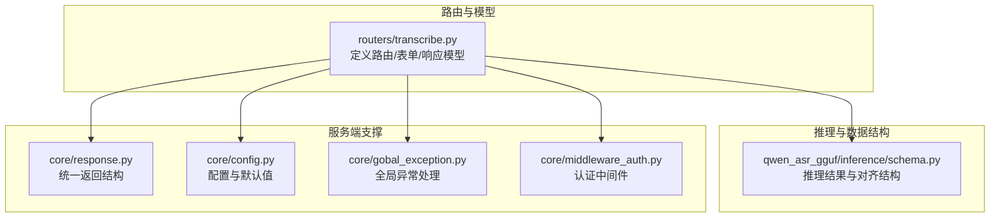
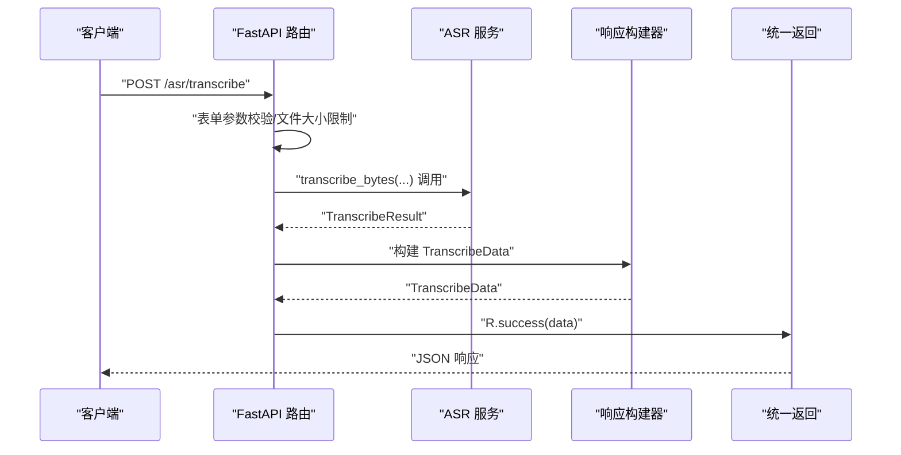
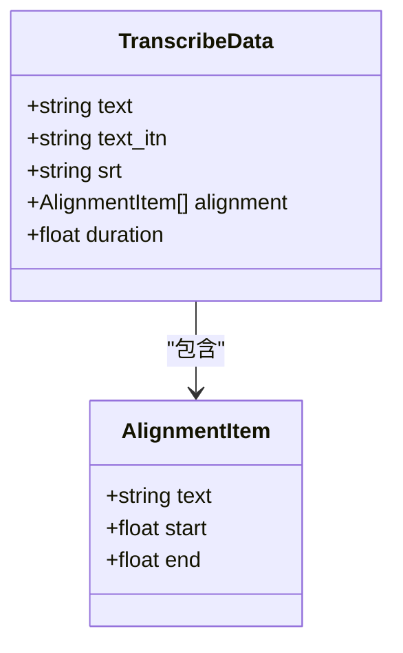
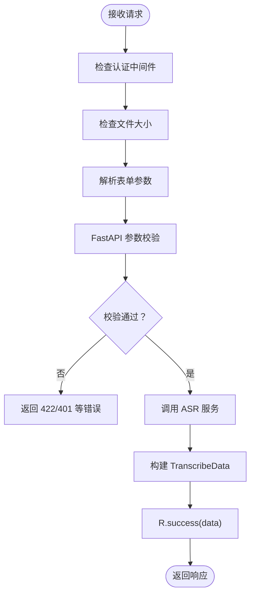
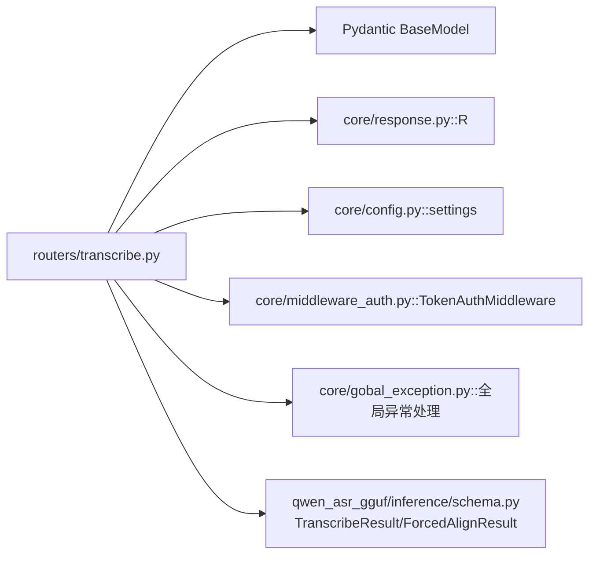

# 请求响应Schema

<cite>
**本文引用的文件**
- [routers/transcribe.py](file://routers/transcribe.py)
- [qwen_asr_gguf/inference/schema.py](file://qwen_asr_gguf/inference/schema.py)
- [core/response.py](file://core/response.py)
- [core/config.py](file://core/config.py)
- [core/gobal_exception.py](file://core/gobal_exception.py)
- [core/middleware_auth.py](file://core/middleware_auth.py)
</cite>

## 目录
1. [简介](#简介)
2. [项目结构](#项目结构)
3. [核心组件](#核心组件)
4. [架构总览](#架构总览)
5. [详细组件分析](#详细组件分析)
6. [依赖分析](#依赖分析)
7. [性能考量](#性能考量)
8. [故障排查指南](#故障排查指南)
9. [结论](#结论)
10. [附录](#附录)

## 简介
本文件系统性梳理 Qwen3-ASR GGUF 的请求与响应 Schema，聚焦以下 Pydantic 模型：
- TranscribeData：离线转写完整结果，包含原始文本、ITN 归一化文本、SRT 字幕、逐词对齐时间戳、音频总时长
- AlignmentItem：对齐项，包含词/字文本及其起止时间
- HealthData：健康检查数据，包含服务状态、引擎就绪状态、GPU 启用状态

文档覆盖字段类型、验证规则、默认值、业务含义、JSON Schema 示例、字段约束、格式要求、请求参数验证机制、类型转换、序列化与反序列化流程，并给出变更历史、向后兼容性与扩展方法、使用示例与常见错误解决方案。

## 项目结构
围绕 Schema 的关键模块与职责如下：
- 路由与响应模型：定义 API 路由、请求表单参数、响应模型（TranscribeData、AlignmentItem、HealthData）以及统一返回包装
- 推理与数据结构：提供底层推理结果结构（如 TranscribeResult、ForcedAlignResult），用于构建 API 响应
- 统一返回与异常：统一响应体结构与全局异常处理
- 配置与中间件：服务端配置、认证中间件、文件大小限制等

**图表来源**
- [routers/transcribe.py:1-383](file://routers/transcribe.py#L1-L383)
- [qwen_asr_gguf/inference/schema.py:1-235](file://qwen_asr_gguf/inference/schema.py#L1-L235)
- [core/response.py:1-23](file://core/response.py#L1-L23)
- [core/config.py:1-109](file://core/config.py#L1-L109)
- [core/gobal_exception.py:1-39](file://core/gobal_exception.py#L1-L39)
- [core/middleware_auth.py:1-26](file://core/middleware_auth.py#L1-L26)

**章节来源**
- [routers/transcribe.py:1-383](file://routers/transcribe.py#L1-L383)
- [qwen_asr_gguf/inference/schema.py:1-235](file://qwen_asr_gguf/inference/schema.py#L1-L235)
- [core/response.py:1-23](file://core/response.py#L1-L23)
- [core/config.py:1-109](file://core/config.py#L1-L109)
- [core/gobal_exception.py:1-39](file://core/gobal_exception.py#L1-L39)
- [core/middleware_auth.py:1-26](file://core/middleware_auth.py#L1-L26)

## 核心组件
本节对三个核心 Schema 进行逐字段说明，涵盖类型、默认值、验证规则与业务含义。

- TranscribeData（离线转写完整结果）
  - text: str
    - 类型：字符串
    - 默认值：无（必填）
    - 验证规则：必填字段
    - 业务含义：原始转写文本
  - text_itn: str
    - 类型：字符串
    - 默认值：空字符串
    - 验证规则：可选
    - 业务含义：经过 ITN（数字归一化）后的文本
  - srt: str
    - 类型：字符串
    - 默认值：空字符串
    - 验证规则：可选
    - 业务含义：SRT 字幕内容（按需启用）
  - alignment: List[AlignmentItem]
    - 类型：数组，元素为 AlignmentItem
    - 默认值：空数组
    - 验证规则：可选
    - 业务含义：逐词/逐字对齐时间戳列表
  - duration: float
    - 类型：浮点数
    - 默认值：0
    - 验证规则：非负数
    - 业务含义：音频总时长（秒）

- AlignmentItem（对齐项）
  - text: str
    - 类型：字符串
    - 默认值：无（必填）
    - 验证规则：必填
    - 业务含义：词/字文本
  - start: float
    - 类型：浮点数
    - 默认值：无（必填）
    - 验证规则：必填
    - 业务含义：开始时间（秒），保留毫秒精度
  - end: float
    - 类型：浮点数
    - 默认值：无（必填）
    - 验证规则：必填
    - 业务含义：结束时间（秒），保留毫秒精度

- HealthData（健康检查数据）
  - status: str
    - 类型：字符串
    - 默认值：无（必填）
    - 验证规则：必填
    - 业务含义：服务状态字符串（如 ok/unavailable）
  - engine_ready: bool
    - 类型：布尔
    - 默认值：无（必填）
    - 验证规则：必填
    - 业务含义：引擎是否就绪
  - gpu_enabled: bool
    - 类型：布尔
    - 默认值：无（必填）
    - 验证规则：必填
    - 业务含义：是否启用 GPU

字段约束与格式要求
- 时间字段（start/end/duration）均为秒级浮点数，其中 start ≤ end，duration ≥ 0
- alignment 为空数组表示未启用对齐或无对齐结果
- srt 为空字符串表示未启用 SRT 输出
- text/text_itn 均为文本字符串，不允许为 null

序列化与反序列化
- Pydantic 模型在 FastAPI 中自动进行 JSON 序列化与反序列化
- 路由层通过表单参数（如 enable_srt、enable_aligner）控制是否输出对齐与 SRT
- 服务端在构建响应时进行数值舍入（如对齐时间保留毫秒、时长保留两位小数）

**章节来源**
- [routers/transcribe.py:46-72](file://routers/transcribe.py#L46-L72)
- [routers/transcribe.py:91-114](file://routers/transcribe.py#L91-L114)

## 架构总览
下图展示从请求到响应的关键流程，包括参数校验、服务调用、结果构建与统一返回封装。

**图表来源**
- [routers/transcribe.py:120-161](file://routers/transcribe.py#L120-L161)
- [routers/transcribe.py:91-114](file://routers/transcribe.py#L91-L114)
- [core/response.py:7-22](file://core/response.py#L7-L22)

**章节来源**
- [routers/transcribe.py:120-161](file://routers/transcribe.py#L120-L161)
- [core/response.py:7-22](file://core/response.py#L7-L22)

## 详细组件分析

### TranscribeData 模型
- 数据结构与复杂度
  - 字段数量固定，序列化/反序列化为 O(n)（n 为 alignment 元素数量）
  - alignment 列表长度通常与词/字数量线性相关
- 关键实现要点
  - 文本 ITN 归一化在构建时按需执行
  - SRT 输出仅在 enable_srt 且存在对齐结果时生成
  - 对齐时间与总时长进行数值舍入，确保输出稳定

**图表来源**
- [routers/transcribe.py:46-72](file://routers/transcribe.py#L46-L72)

**章节来源**
- [routers/transcribe.py:46-72](file://routers/transcribe.py#L46-L72)
- [routers/transcribe.py:91-114](file://routers/transcribe.py#L91-L114)

### AlignmentItem 模型
- 字段约束
  - text 非空
  - start 与 end 为非负浮点数，start ≤ end
- 业务含义
  - 表示单个词/字的文本与其在音频中的起止时间（秒）

**章节来源**
- [routers/transcribe.py:46-52](file://routers/transcribe.py#L46-L52)

### HealthData 模型
- 字段约束
  - status 为字符串，engine_ready 与 gpu_enabled 为布尔
- 业务含义
  - 提供服务健康状态、引擎就绪状态与 GPU 启用状态

**章节来源**
- [routers/transcribe.py:66-72](file://routers/transcribe.py#L66-L72)

### 请求参数与验证机制
- 表单参数（离线转写）
  - file: UploadFile（必填）
  - context: str（可选）
  - language: str（可选）
  - temperature: float（可选，默认 0）
  - enable_srt: bool（可选，默认 False）
  - enable_aligner: bool（可选，默认 False）
- 参数验证与类型转换
  - FastAPI 自动进行类型转换与校验
  - 文件大小限制：超过配置阈值将触发 413
  - 认证中间件：除特定路径外，需携带 Bearer Token
- 错误处理
  - 全局异常处理器捕获 HTTP 与验证异常，统一返回 R.fail

**图表来源**
- [routers/transcribe.py:77-88](file://routers/transcribe.py#L77-L88)
- [core/middleware_auth.py:10-26](file://core/middleware_auth.py#L10-L26)
- [core/gobal_exception.py:9-39](file://core/gobal_exception.py#L9-L39)

**章节来源**
- [routers/transcribe.py:134-161](file://routers/transcribe.py#L134-L161)
- [routers/transcribe.py:77-88](file://routers/transcribe.py#L77-L88)
- [core/middleware_auth.py:10-26](file://core/middleware_auth.py#L10-L26)
- [core/gobal_exception.py:9-39](file://core/gobal_exception.py#L9-L39)

### 健康检查接口
- 路径：GET /asr/health
- 返回：HealthData
- 业务含义：报告服务状态、引擎就绪与 GPU 启用情况

**章节来源**
- [routers/transcribe.py:372-382](file://routers/transcribe.py#L372-L382)

## 依赖分析
- 路由层依赖
  - Pydantic BaseModel 定义响应模型
  - 统一返回 R 包装响应体
  - 配置 settings 控制文件大小限制
  - 中间件 TokenAuthMiddleware 提供认证
  - 全局异常处理器统一错误响应
- 推理层依赖
  - 推理结果结构（TranscribeResult、ForcedAlignResult）用于构建 API 响应
  - ITN 与 SRT 导出器用于文本归一化与字幕生成

**图表来源**
- [routers/transcribe.py:1-383](file://routers/transcribe.py#L1-L383)
- [core/response.py:1-23](file://core/response.py#L1-L23)
- [core/config.py:1-109](file://core/config.py#L1-L109)
- [core/middleware_auth.py:1-26](file://core/middleware_auth.py#L1-L26)
- [core/gobal_exception.py:1-39](file://core/gobal_exception.py#L1-L39)
- [qwen_asr_gguf/inference/schema.py:211-234](file://qwen_asr_gguf/inference/schema.py#L211-L234)

**章节来源**
- [routers/transcribe.py:1-383](file://routers/transcribe.py#L1-L383)
- [core/response.py:1-23](file://core/response.py#L1-L23)
- [core/config.py:1-109](file://core/config.py#L1-L109)
- [core/middleware_auth.py:1-26](file://core/middleware_auth.py#L1-L26)
- [core/gobal_exception.py:1-39](file://core/gobal_exception.py#L1-L39)
- [qwen_asr_gguf/inference/schema.py:211-234](file://qwen_asr_gguf/inference/schema.py#L211-L234)

## 性能考量
- 数值舍入策略
  - 对齐时间与总时长进行舍入，减少响应体积与前端计算负担
- 流式接口优化
  - SSE 流式推送，分片处理，降低端到端延迟
- 文件大小限制
  - 通过配置项控制上传上限，避免内存压力与拒绝服务

[本节为通用指导，不涉及具体文件分析]

## 故障排查指南
- 参数验证失败（422）
  - 现象：请求参数类型不符或缺失
  - 处理：检查必填字段与类型，参考模型定义
- 文件过大（413）
  - 现象：上传文件超过 MAX_FILE_SIZE_MB
  - 处理：减小文件或调整配置
- 认证失败（401）
  - 现象：缺少或错误的 Authorization 头
  - 处理：携带正确的 Bearer Token
- 服务器内部错误（500）
  - 现象：未捕获异常
  - 处理：查看日志，定位异常并修复

**章节来源**
- [routers/transcribe.py:77-88](file://routers/transcribe.py#L77-L88)
- [core/middleware_auth.py:10-26](file://core/middleware_auth.py#L10-L26)
- [core/gobal_exception.py:9-39](file://core/gobal_exception.py#L9-L39)

## 结论
本文档系统化梳理了 Qwen3-ASR GGUF 的请求与响应 Schema，明确了 TranscribeData、AlignmentItem、HealthData 的字段定义、验证规则与业务含义，并结合路由层实现展示了请求参数验证、类型转换、序列化与统一返回封装。同时提供了性能考量、故障排查与扩展建议，便于在实际工程中正确使用与演进。

[本节为总结性内容，不涉及具体文件分析]

## 附录

### JSON Schema 示例（基于模型定义）
- TranscribeData
  - 字段：text（字符串，必填）、text_itn（字符串，可选，缺省空串）、srt（字符串，可选，缺省空串）、alignment（数组，元素为 AlignmentItem，可选，缺省空数组）、duration（浮点数，可选，缺省 0）
  - 约束：alignment 为空数组表示无对齐；duration≥0；alignment 中每个元素的 start≤end
- AlignmentItem
  - 字段：text（字符串，必填）、start（浮点数，必填，≥0）、end（浮点数，必填，≥0 且 ≥start）
- HealthData
  - 字段：status（字符串，必填）、engine_ready（布尔，必填）、gpu_enabled（布尔，必填）

### 字段约束与格式要求清单
- 文本类：text、text_itn、srt 为 UTF-8 文本
- 时间类：start、end、duration 为秒级浮点数，单位统一
- 数组类：alignment 为对象数组，元素为 AlignmentItem
- 布尔类：enable_srt、enable_aligner、engine_ready、gpu_enabled

### 向后兼容性与扩展建议
- 向后兼容性
  - 新增可选字段时保持默认值，避免破坏现有客户端解析
  - 不改变已有必填字段与字段类型
- 自定义扩展
  - 通过继承或组合方式扩展响应模型，但需确保序列化兼容
  - 如需新增枚举值，建议在上游推理层统一定义后再映射到响应模型

### 使用示例（路径指引）
- 离线转写（单文件）
  - 路由：POST /asr/transcribe
  - 表单参数：file、context、language、temperature、enable_srt、enable_aligner
  - 响应：R.success(data=TranscribeData)
  - 参考实现路径：[routers/transcribe.py:134-161](file://routers/transcribe.py#L134-L161)
- 离线转写（批量）
  - 路由：POST /asr/transcribe/batch
  - 表单参数：files、context、language、temperature、enable_srt、enable_aligner
  - 响应：R.success(data=List[TranscribeData])
  - 参考实现路径：[routers/transcribe.py:174-222](file://routers/transcribe.py#L174-L222)
- 流式转写（SSE）
  - 路由：POST /asr/transcribe/stream
  - 表单参数：file、context、language、temperature、enable_srt、enable_aligner
  - 响应：text/event-stream，事件类型 chunk/done/error
  - 参考实现路径：[routers/transcribe.py:247-369](file://routers/transcribe.py#L247-L369)
- 健康检查
  - 路由：GET /asr/health
  - 响应：R.success(data=HealthData)
  - 参考实现路径：[routers/transcribe.py:372-382](file://routers/transcribe.py#L372-L382)

### 常见验证错误与解决方案
- 缺少必填字段
  - 现象：422 参数验证失败
  - 解决：补齐 file、text、start、end 等必填字段
- 时间字段非法
  - 现象：start > end 或 duration < 0
  - 解决：修正时间戳顺序与总时长
- 文件过大
  - 现象：413
  - 解决：压缩音频或调整 MAX_FILE_SIZE_MB

**章节来源**
- [routers/transcribe.py:134-161](file://routers/transcribe.py#L134-L161)
- [routers/transcribe.py:174-222](file://routers/transcribe.py#L174-L222)
- [routers/transcribe.py:247-369](file://routers/transcribe.py#L247-L369)
- [routers/transcribe.py:372-382](file://routers/transcribe.py#L372-L382)