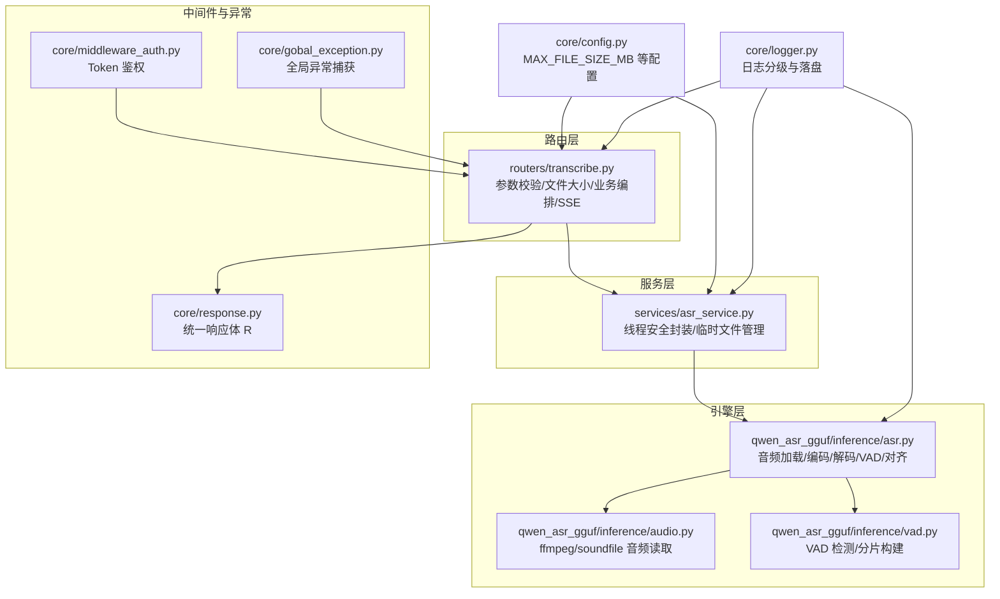
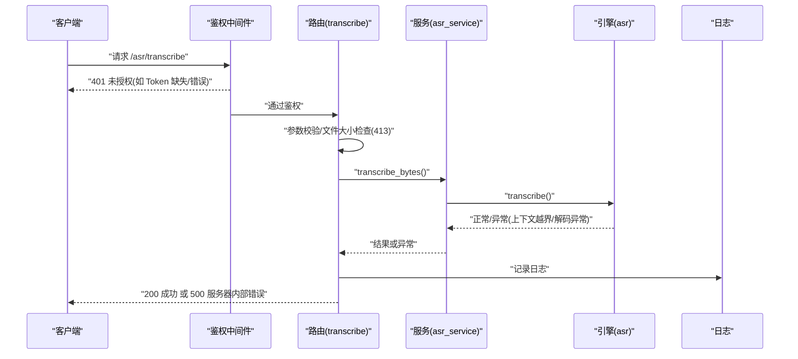
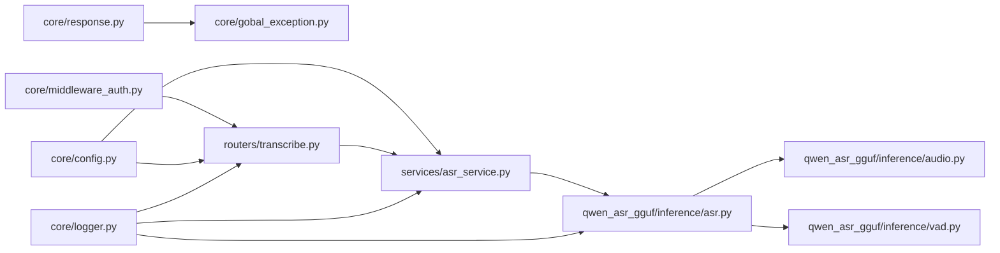

# 错误处理与状态码

<cite>
**本文引用的文件**
- [core/response.py](file://core/response.py)
- [core/gobal_exception.py](file://core/gobal_exception.py)
- [core/config.py](file://core/config.py)
- [core/middleware_auth.py](file://core/middleware_auth.py)
- [core/logger.py](file://core/logger.py)
- [routers/transcribe.py](file://routers/transcribe.py)
- [services/asr_service.py](file://services/asr_service.py)
- [qwen_asr_gguf/inference/asr.py](file://qwen_asr_gguf/inference/asr.py)
- [qwen_asr_gguf/inference/audio.py](file://qwen_asr_gguf/inference/audio.py)
- [qwen_asr_gguf/inference/vad.py](file://qwen_asr_gguf/inference/vad.py)
</cite>

## 目录
1. [简介](#简介)
2. [项目结构](#项目结构)
3. [核心组件](#核心组件)
4. [架构总览](#架构总览)
5. [详细组件分析](#详细组件分析)
6. [依赖分析](#依赖分析)
7. [性能考量](#性能考量)
8. [故障排查指南](#故障排查指南)
9. [结论](#结论)
10. [附录](#附录)

## 简介
本文件聚焦于 Qwen3-ASR GGUF 的错误处理与 HTTP 状态码体系，系统性说明：
- 统一的错误响应格式与 R.success()/R.fail() 机制
- 全局异常捕获与中间件鉴权
- 常见错误场景与对应状态码：200 成功、400 参数错误、401 未授权、404 未找到、413 文件过大、500 服务器内部错误等
- 错误码对照表、错误消息模板、重试策略与故障恢复机制
- 客户端错误处理最佳实践、日志记录策略与监控告警配置
- 异常捕获机制、错误传播链与调试信息收集方法

## 项目结构
围绕错误处理与状态码的关键模块如下：
- 路由层：负责参数校验、文件大小限制、业务编排与 SSE 流式输出
- 服务层：封装 ASR 引擎，提供线程安全的离线/流式转写能力
- 引擎层：实现音频加载、VAD、编码、解码、对齐与流式生成
- 中间件与异常：鉴权中间件、全局异常捕获、统一响应体
- 配置与日志：全局配置（含 MAX_FILE_SIZE_MB）、日志分级与落盘

图表来源
- [routers/transcribe.py](file://routers/transcribe.py)
- [services/asr_service.py](file://services/asr_service.py)
- [qwen_asr_gguf/inference/asr.py](file://qwen_asr_gguf/inference/asr.py)
- [qwen_asr_gguf/inference/audio.py](file://qwen_asr_gguf/inference/audio.py)
- [qwen_asr_gguf/inference/vad.py](file://qwen_asr_gguf/inference/vad.py)
- [core/middleware_auth.py](file://core/middleware_auth.py)
- [core/gobal_exception.py](file://core/gobal_exception.py)
- [core/response.py](file://core/response.py)
- [core/config.py](file://core/config.py)
- [core/logger.py](file://core/logger.py)

章节来源
- [routers/transcribe.py](file://routers/transcribe.py)
- [services/asr_service.py](file://services/asr_service.py)
- [qwen_asr_gguf/inference/asr.py](file://qwen_asr_gguf/inference/asr.py)
- [qwen_asr_gguf/inference/audio.py](file://qwen_asr_gguf/inference/audio.py)
- [qwen_asr_gguf/inference/vad.py](file://qwen_asr_gguf/inference/vad.py)
- [core/middleware_auth.py](file://core/middleware_auth.py)
- [core/gobal_exception.py](file://core/gobal_exception.py)
- [core/response.py](file://core/response.py)
- [core/config.py](file://core/config.py)
- [core/logger.py](file://core/logger.py)

## 核心组件
- 统一响应体 R
  - R.success(data, msg)：返回 code=200 的成功响应
  - R.fail(msg, code, data)：返回自定义 code 的失败响应
- 全局异常处理
  - 捕获 HTTPException、RequestValidationError、AssertionError 与通用 Exception，并统一包装为 R.fail()
- 鉴权中间件
  - 对非公开路径进行 Bearer Token 校验，失败返回 401
- 文件大小限制
  - 上传前校验文件大小，超过 MAX_FILE_SIZE_MB 抛出 413
- SSE 流式错误
  - 流式过程中异常通过事件推送 error，并在 finally 输出 [DONE]

章节来源
- [core/response.py](file://core/response.py)
- [core/gobal_exception.py](file://core/gobal_exception.py)
- [core/middleware_auth.py](file://core/middleware_auth.py)
- [routers/transcribe.py](file://routers/transcribe.py)
- [core/config.py](file://core/config.py)

## 架构总览
以下序列图展示一次离线转写请求的错误处理与状态码流转：

图表来源
- [core/middleware_auth.py](file://core/middleware_auth.py)
- [routers/transcribe.py](file://routers/transcribe.py)
- [services/asr_service.py](file://services/asr_service.py)
- [qwen_asr_gguf/inference/asr.py](file://qwen_asr_gguf/inference/asr.py)
- [core/logger.py](file://core/logger.py)

## 详细组件分析

### 统一响应体与错误包装
- R.success(data, msg)：固定返回 code=200
- R.fail(msg, code=-1, data=None)：通用失败包装，配合全局异常处理器转换为 JSONResponse
- 全局异常处理器
  - StarletteHTTPException：直接使用 status_code 与 detail
  - RequestValidationError：参数校验失败，返回 errors 列表
  - AssertionError：参数断言失败
  - Exception：未捕获异常，统一返回“服务器内部错误”

章节来源
- [core/response.py](file://core/response.py)
- [core/gobal_exception.py](file://core/gobal_exception.py)

### 鉴权中间件与 401
- 除根路径、OpenAPI 文档、静态资源等外，其余路径均需 Authorization: Bearer {web_secret_key}
- 校验失败返回 401，错误体为 {code: 401, msg: "Invalid or missing token", data: null}

章节来源
- [core/middleware_auth.py](file://core/middleware_auth.py)
- [core/config.py](file://core/config.py)

### 文件大小限制与 413
- 路由层在读取文件后调用 _check_file_size(content, filename)
- 超过 settings.MAX_FILE_SIZE_MB 时抛出 HTTPException(status_code=413)
- 批量接口对单个文件过大进行跳过并记录警告日志，返回包含错误信息的结果项

章节来源
- [routers/transcribe.py](file://routers/transcribe.py)
- [core/config.py](file://core/config.py)

### SSE 流式错误与 200/500
- 流式接口 transcribe_stream 使用 StreamingResponse，事件类型包括 chunk/done/error
- 异常时推送 {"type":"error","message": "..."}，并在 finally 输出 "data: [DONE]"
- 服务端异常通过全局异常处理器转换为 JSON 响应（非 SSE），返回 500

章节来源
- [routers/transcribe.py](file://routers/transcribe.py)
- [core/gobal_exception.py](file://core/gobal_exception.py)

### 音频解码失败与 500
- 音频加载采用 soundfile 与 ffmpeg 双通道
- ffmpeg 不存在或处理失败会抛出 RuntimeError，被全局异常捕获为 500
- 文件不存在、格式不受支持等也会触发 500

章节来源
- [qwen_asr_gguf/inference/audio.py](file://qwen_asr_gguf/inference/audio.py)
- [core/gobal_exception.py](file://core/gobal_exception.py)

### VAD 处理错误与降级
- VAD 延迟加载失败时记录警告并降级为固定分片
- VAD 自适应阈值计算异常时回退到首次结果
- VAD 分片构建失败不影响整体流程，仍可继续

章节来源
- [qwen_asr_gguf/inference/asr.py](file://qwen_asr_gguf/inference/asr.py)
- [qwen_asr_gguf/inference/vad.py](file://qwen_asr_gguf/inference/vad.py)

### 模型推理异常与 500
- 引擎内部对 n_ctx 越界进行保护，避免 GGML_ASSERT 导致进程崩溃，返回空文本并标记中止
- 解码过程出现重复/幻觉时触发重试与温度提升，最终仍失败则返回空文本或部分结果
- 未捕获异常统一转换为 500

章节来源
- [qwen_asr_gguf/inference/asr.py](file://qwen_asr_gguf/inference/asr.py)
- [core/gobal_exception.py](file://core/gobal_exception.py)

### 流式传输中断与恢复
- SSE 心跳：每 15 秒发送注释行，避免代理/客户端超时断开
- 异常时推送 error 事件，finally 输出 [DONE]，客户端据此判断流结束
- 服务端通过队列与线程桥接同步生成器，异常在队列中透传并终止

章节来源
- [routers/transcribe.py](file://routers/transcribe.py)
- [services/asr_service.py](file://services/asr_service.py)

## 依赖分析
- 路由层依赖服务层与配置，服务层依赖引擎层与配置
- 全局异常处理器依赖统一响应体
- 鉴权中间件依赖配置中的 web_secret_key
- 日志模块贯穿各层，提供统一的请求 ID 注入与多文件落盘

图表来源
- [core/response.py](file://core/response.py)
- [core/gobal_exception.py](file://core/gobal_exception.py)
- [core/middleware_auth.py](file://core/middleware_auth.py)
- [core/config.py](file://core/config.py)
- [routers/transcribe.py](file://routers/transcribe.py)
- [services/asr_service.py](file://services/asr_service.py)
- [qwen_asr_gguf/inference/asr.py](file://qwen_asr_gguf/inference/asr.py)
- [qwen_asr_gguf/inference/audio.py](file://qwen_asr_gguf/inference/audio.py)
- [qwen_asr_gguf/inference/vad.py](file://qwen_asr_gguf/inference/vad.py)
- [core/logger.py](file://core/logger.py)

章节来源
- [core/response.py](file://core/response.py)
- [core/gobal_exception.py](file://core/gobal_exception.py)
- [core/middleware_auth.py](file://core/middleware_auth.py)
- [core/config.py](file://core/config.py)
- [routers/transcribe.py](file://routers/transcribe.py)
- [services/asr_service.py](file://services/asr_service.py)
- [qwen_asr_gguf/inference/asr.py](file://qwen_asr_gguf/inference/asr.py)
- [qwen_asr_gguf/inference/audio.py](file://qwen_asr_gguf/inference/audio.py)
- [qwen_asr_gguf/inference/vad.py](file://qwen_asr_gguf/inference/vad.py)
- [core/logger.py](file://core/logger.py)

## 性能考量
- VAD 动态分片与静音跳过显著降低 RTF 与幻觉风险
- 固定分片模式下的边界缓冲提升词句完整性
- 解码内核的重复熔断与温度重试在保证稳定性的同时控制性能损耗
- SSE 心跳与队列背压避免长音频场景下的内存与 CPU 峰值

章节来源
- [qwen_asr_gguf/inference/asr.py](file://qwen_asr_gguf/inference/asr.py)
- [services/asr_service.py](file://services/asr_service.py)
- [routers/transcribe.py](file://routers/transcribe.py)

## 故障排查指南

### 常见错误场景与处理
- 文件格式不支持
  - 现象：ffmpeg 不存在或处理失败，抛出 RuntimeError
  - 处理：安装 ffmpeg 并确保在 PATH 中；检查输入格式
  - 状态码：500（由全局异常处理器转换）
- 文件过大（超过 MAX_FILE_SIZE_MB）
  - 现象：路由层抛出 413；批量接口跳过并记录警告
  - 处理：压缩音频、降低采样率或改用流式接口
  - 状态码：413（离线接口）；批量接口返回包含错误信息的结果项
- 音频解码失败
  - 现象：文件不存在、格式不受支持、ffmpeg 失败
  - 处理：确认文件路径与权限；检查 ffmpeg 安装与版本
  - 状态码：500
- VAD 处理错误
  - 现象：VAD 模型加载失败或自适应阈值异常
  - 处理：检查模型路径与依赖；必要时降级为固定分片
  - 状态码：500（异常被捕获并转换）
- 模型推理异常
  - 现象：n_ctx 越界保护、解码重复/幻觉、温度重试
  - 处理：降低温度、缩短上下文或调整分片策略
  - 状态码：500（异常被捕获并转换）
- 流式传输中断
  - 现象：网络波动导致连接断开
  - 处理：客户端重连；服务端心跳与 [DONE] 标识
  - 状态码：SSE 事件类型 error（客户端感知）

章节来源
- [routers/transcribe.py](file://routers/transcribe.py)
- [services/asr_service.py](file://services/asr_service.py)
- [qwen_asr_gguf/inference/audio.py](file://qwen_asr_gguf/inference/audio.py)
- [qwen_asr_gguf/inference/asr.py](file://qwen_asr_gguf/inference/asr.py)
- [qwen_asr_gguf/inference/vad.py](file://qwen_asr_gguf/inference/vad.py)
- [core/gobal_exception.py](file://core/gobal_exception.py)

### 错误码对照表
- 200 成功：R.success(data, msg)
- 400 参数错误：RequestValidationError（参数校验失败）
- 401 未授权：鉴权中间件校验失败
- 404 未找到：FastAPI 默认 404（如路径不存在）
- 413 请求实体过大：路由层 _check_file_size(content) 抛出
- 500 服务器内部错误：未捕获异常统一转换

章节来源
- [core/gobal_exception.py](file://core/gobal_exception.py)
- [core/middleware_auth.py](file://core/middleware_auth.py)
- [routers/transcribe.py](file://routers/transcribe.py)

### 错误消息模板
- 统一响应体字段：code、msg、data
- 全局异常响应：R.fail(msg, code, data)
- SSE 错误事件：{"type":"error","message": "..."}
- 日志记录：包含请求 ID 与详细堆栈（开发环境 DEBUG）

章节来源
- [core/response.py](file://core/response.py)
- [routers/transcribe.py](file://routers/transcribe.py)
- [core/logger.py](file://core/logger.py)

### 重试策略与故障恢复
- 解码内核：重复/幻觉触发温度逐步提升与最多 3 次重试
- VAD：加载失败降级为固定分片；自适应阈值失败回退首次结果
- SSE：心跳维持连接；finally 输出 [DONE] 标识流结束
- 临时文件：服务层在 finally 删除，避免磁盘泄漏

章节来源
- [qwen_asr_gguf/inference/asr.py](file://qwen_asr_gguf/inference/asr.py)
- [services/asr_service.py](file://services/asr_service.py)
- [routers/transcribe.py](file://routers/transcribe.py)

### 客户端错误处理最佳实践
- 鉴权：始终携带 Authorization: Bearer {web_secret_key}
- 参数校验：遵循路由文档与表单参数要求，避免 400
- 文件大小：上传前自行校验，避免 413
- SSE 客户端：监听 error 事件与 [DONE] 标识，实现断线重连与进度恢复
- 日志采集：记录服务端日志文件与错误事件，定位问题

章节来源
- [core/middleware_auth.py](file://core/middleware_auth.py)
- [routers/transcribe.py](file://routers/transcribe.py)
- [core/logger.py](file://core/logger.py)

### 日志记录策略与监控告警
- 日志分级：控制台生产环境 WARNING+，文件 INFO+；开发环境 DEBUG+
- 日志落盘：应用日志、错误日志、调试日志（开发环境）分别落盘，轮转与压缩
- 请求追踪：自动注入 request_id，跨模块串联请求链路
- 监控建议：采集错误日志与性能统计（RTF、VAD 跳过率、解码耗时），设置告警阈值

章节来源
- [core/logger.py](file://core/logger.py)

### 异常捕获机制、错误传播链与调试信息
- 异常捕获：全局异常处理器捕获 HTTPException、验证错误、断言错误与通用异常
- 错误传播：路由层抛出异常，服务层/引擎层异常通过全局处理器转换为 JSON 响应
- 调试信息：日志包含请求 ID、异常堆栈、性能统计与 VAD/解码耗时

章节来源
- [core/gobal_exception.py](file://core/gobal_exception.py)
- [core/logger.py](file://core/logger.py)
- [qwen_asr_gguf/inference/asr.py](file://qwen_asr_gguf/inference/asr.py)

## 结论
本项目通过统一响应体、全局异常处理、鉴权中间件与完善的日志体系，实现了清晰的错误处理与状态码规范。结合 VAD 动态分片、解码重试与 SSE 心跳机制，既保障了服务稳定性，也为客户端提供了可靠的错误感知与恢复路径。

## 附录

### 状态码使用清单
- 200：成功响应（R.success）
- 400：参数校验失败（RequestValidationError）
- 401：鉴权失败（Token 缺失/错误）
- 404：路径/资源不存在（FastAPI 默认）
- 413：文件过大（路由层检查）
- 500：服务器内部错误（未捕获异常统一转换）

章节来源
- [core/response.py](file://core/response.py)
- [core/gobal_exception.py](file://core/gobal_exception.py)
- [core/middleware_auth.py](file://core/middleware_auth.py)
- [routers/transcribe.py](file://routers/transcribe.py)