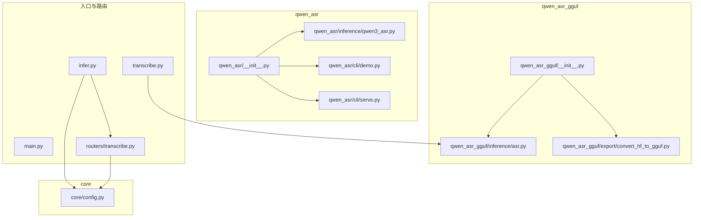
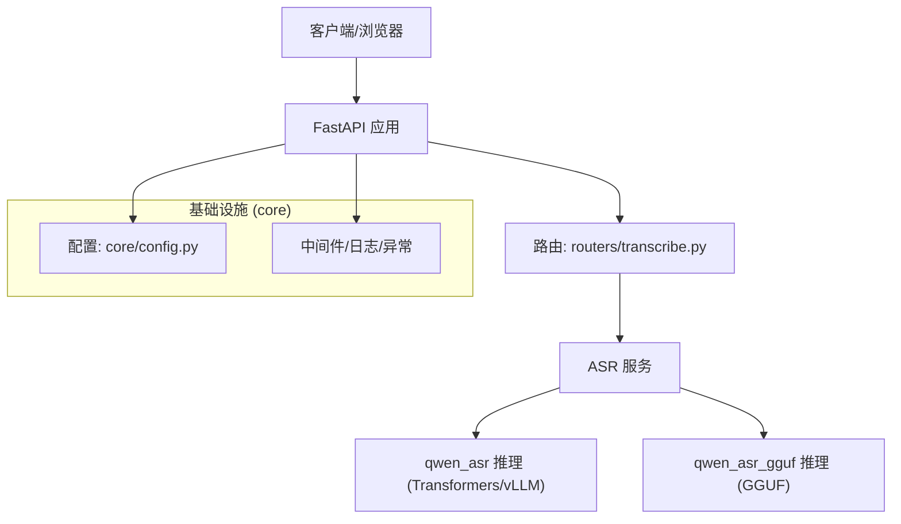
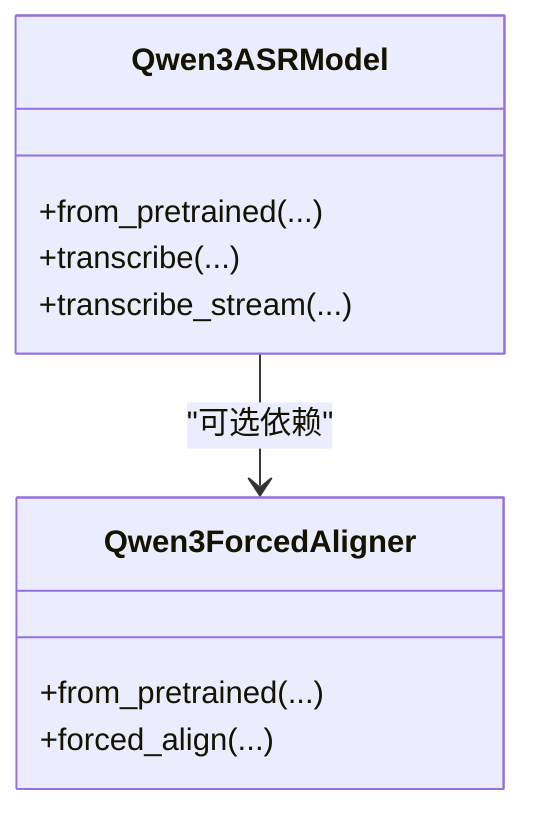
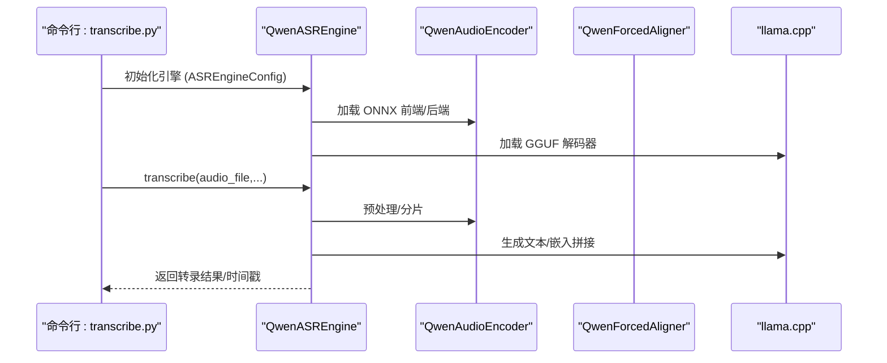
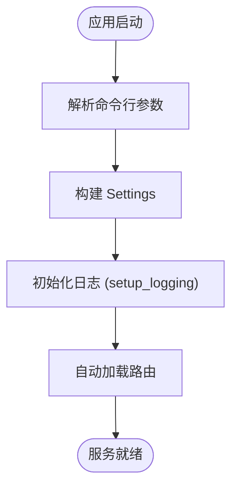
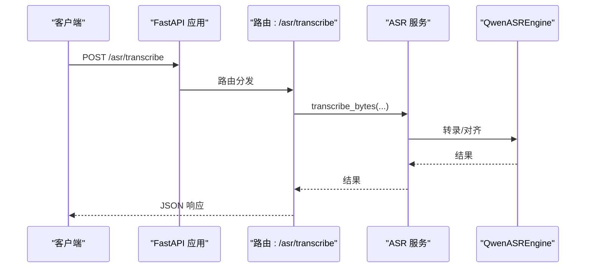
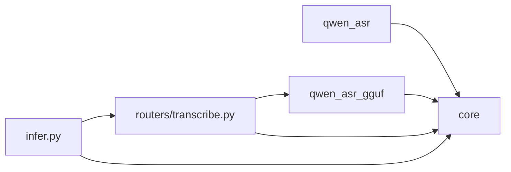

# 代码结构与模块组织

<cite>
**本文档引用的文件**
- [qwen_asr/__init__.py](file://qwen_asr/__init__.py)
- [qwen_asr/__main__.py](file://qwen_asr/__main__.py)
- [qwen_asr_gguf/__init__.py](file://qwen_asr_gguf/__init__.py)
- [qwen_asr/inference/qwen3_asr.py](file://qwen_asr/inference/qwen3_asr.py)
- [qwen_asr_gguf/inference/asr.py](file://qwen_asr_gguf/inference/asr.py)
- [core/config.py](file://core/config.py)
- [main.py](file://main.py)
- [transcribe.py](file://transcribe.py)
- [qwen_asr/cli/demo.py](file://qwen_asr/cli/demo.py)
- [qwen_asr/cli/serve.py](file://qwen_asr/cli/serve.py)
- [qwen_asr_gguf/export/convert_hf_to_gguf.py](file://qwen_asr_gguf/export/convert_hf_to_gguf.py)
- [routers/transcribe.py](file://routers/transcribe.py)
- [infer.py](file://infer.py)
- [pyproject.toml](file://pyproject.toml)
</cite>

## 目录
1. [引言](#引言)
2. [项目结构](#项目结构)
3. [核心组件](#核心组件)
4. [架构总览](#架构总览)
5. [详细组件分析](#详细组件分析)
6. [依赖分析](#依赖分析)
7. [性能考虑](#性能考虑)
8. [故障排查指南](#故障排查指南)
9. [结论](#结论)
10. [附录](#附录)

## 引言
本文件面向开发者系统性梳理 Qwen3-ASR GGUF 项目的代码结构与模块组织，重点说明：
- 目录组织与模块划分
- 核心包职责边界（qwen_asr、qwen_asr_gguf、core 等）
- 模块间依赖关系与导入路径
- Python 包初始化与公共接口暴露
- 代码导航指南与模块化设计原则

## 项目结构
项目采用“多包并行”的模块化布局，围绕三条主线展开：
- qwen_asr：传统 Transformers/vLLM 后端推理封装，提供统一的 ASR 模型包装与 CLI/服务集成能力
- qwen_asr_gguf：GGUF 后端推理引擎，结合 ONNX 编码器与 llama.cpp 解码器，提供高性能推理与导出工具链
- core：通用基础设施（配置、日志、中间件、响应体、异常处理等），为 Web 服务与 CLI 提供一致的运行时支撑

图表来源
- [qwen_asr/__init__.py:19-25](file://qwen_asr/__init__.py#L19-L25)
- [qwen_asr_gguf/__init__.py:1-63](file://qwen_asr_gguf/__init__.py#L1-L63)
- [core/config.py:1-109](file://core/config.py#L1-L109)
- [infer.py:100-102](file://infer.py#L100-L102)
- [routers/transcribe.py:40-40](file://routers/transcribe.py#L40-L40)
- [transcribe.py:24-24](file://transcribe.py#L24-L24)

章节来源
- [pyproject.toml:1-102](file://pyproject.toml#L1-L102)

## 核心组件
- qwen_asr 包
  - 负责对外暴露 Qwen3ASRModel 与 Qwen3ForcedAligner，提供 Transformers/vLLM 双后端统一推理接口
  - 提供 CLI 入口（demo、serve），便于本地演示与服务部署
- qwen_asr_gguf 包
  - 提供基于 GGUF 的 ASR 引擎（QwenASREngine），集成 ONNX 编码器与 llama.cpp 解码器
  - 提供模型导出工具链（HF→GGUF），支持多种量化与元数据处理
- core 包
  - 提供配置解析、日志、中间件、响应体与异常处理等通用能力
  - 通过 settings 对外暴露统一的运行时配置

章节来源
- [qwen_asr/__init__.py:19-25](file://qwen_asr/__init__.py#L19-L25)
- [qwen_asr_gguf/__init__.py:1-63](file://qwen_asr_gguf/__init__.py#L1-L63)
- [core/config.py:52-109](file://core/config.py#L52-L109)

## 架构总览
整体架构分为三层：
- 表现层：FastAPI 路由与服务（routers/transcribe.py）、Web 入口（infer.py）
- 业务层：ASR 服务（services.asr_service，由路由调用）、配置与中间件（core）
- 推理层：qwen_asr（Transformers/vLLM 后端）与 qwen_asr_gguf（GGUF 后端）

图表来源
- [infer.py:84-102](file://infer.py#L84-L102)
- [routers/transcribe.py:40-40](file://routers/transcribe.py#L40-L40)
- [core/config.py:52-109](file://core/config.py#L52-L109)

## 详细组件分析

### qwen_asr 包
- 暴露接口
  - Qwen3ASRModel：统一的 ASR 推理包装，支持 Transformers 与 vLLM 后端
  - Qwen3ForcedAligner：强制对齐器，用于生成词级时间戳
  - 工具函数：parse_asr_output 等
- CLI
  - demo：Gradio 演示，支持 Transformers/vLLM 后端切换
  - serve：基于 vLLM 的服务入口（需安装 vLLM 依赖）

图表来源
- [qwen_asr/inference/qwen3_asr.py:131-200](file://qwen_asr/inference/qwen3_asr.py#L131-L200)
- [qwen_asr/inference/qwen3_asr.py:32-47](file://qwen_asr/inference/qwen3_asr.py#L32-L47)

章节来源
- [qwen_asr/__init__.py:19-25](file://qwen_asr/__init__.py#L19-L25)
- [qwen_asr/cli/demo.py:124-200](file://qwen_asr/cli/demo.py#L124-L200)
- [qwen_asr/cli/serve.py:16-46](file://qwen_asr/cli/serve.py#L16-L46)

### qwen_asr_gguf 包
- 推理引擎
  - QwenASREngine：集成 ONNX 编码器（前端/后端）与 llama.cpp 解码器，支持 VAD 动态分片、流式与非流式转录
  - 支持强制对齐（Aligner）与 VAD 延迟初始化
- 导出工具
  - convert_hf_to_gguf：将 HuggingFace 模型转换为 GGUF，支持多种量化与元数据处理

图表来源
- [transcribe.py:145-160](file://transcribe.py#L145-L160)
- [qwen_asr_gguf/inference/asr.py:40-103](file://qwen_asr_gguf/inference/asr.py#L40-L103)
- [qwen_asr_gguf/inference/asr.py:108-136](file://qwen_asr_gguf/inference/asr.py#L108-L136)

章节来源
- [qwen_asr_gguf/inference/asr.py:40-103](file://qwen_asr_gguf/inference/asr.py#L40-L103)
- [qwen_asr_gguf/inference/asr.py:108-136](file://qwen_asr_gguf/inference/asr.py#L108-L136)
- [qwen_asr_gguf/export/convert_hf_to_gguf.py:1-200](file://qwen_asr_gguf/export/convert_hf_to_gguf.py#L1-L200)

### core 包
- 配置与设置
  - Settings：集中管理服务端配置（主机、端口、模型路径、上传限制、VAD 参数等）
  - args：命令行参数解析（布尔兼容、默认值）
- 中间件与日志
  - 访问日志、鉴权、请求 ID 等中间件
  - 全局日志初始化与文件落盘

图表来源
- [core/config.py:19-109](file://core/config.py#L19-L109)
- [qwen_asr_gguf/__init__.py:23-63](file://qwen_asr_gguf/__init__.py#L23-L63)
- [infer.py:100-102](file://infer.py#L100-L102)

章节来源
- [core/config.py:52-109](file://core/config.py#L52-L109)
- [qwen_asr_gguf/__init__.py:23-63](file://qwen_asr_gguf/__init__.py#L23-L63)

### Web 服务与路由
- infer.py：FastAPI 应用入口，注册中间件、全局异常处理与路由，生命周期内初始化/关闭 ASR 服务
- routers/transcribe.py：提供离线/批量/流式转写接口，统一响应体与文件大小校验

图表来源
- [infer.py:84-102](file://infer.py#L84-L102)
- [routers/transcribe.py:134-161](file://routers/transcribe.py#L134-L161)

章节来源
- [infer.py:55-82](file://infer.py#L55-L82)
- [routers/transcribe.py:120-161](file://routers/transcribe.py#L120-L161)

## 依赖分析
- 包依赖
  - qwen_asr 依赖 core 的配置与日志，同时暴露推理类供上层使用
  - qwen_asr_gguf 依赖 core 的日志与 schema，内部封装 llama.cpp 与 ONNX 编码器
  - Web 服务依赖 core 的配置与中间件，路由依赖 qwen_asr_gguf 的推理引擎
- 外部依赖
  - FastAPI、uvicorn、pydantic、gguf、librosa、soundfile、srt、typer 等

图表来源
- [infer.py:13-21](file://infer.py#L13-L21)
- [routers/transcribe.py:33-38](file://routers/transcribe.py#L33-L38)
- [qwen_asr/__init__.py:19-25](file://qwen_asr/__init__.py#L19-L25)

章节来源
- [pyproject.toml:7-23](file://pyproject.toml#L7-L23)

## 性能考虑
- 动态分片与 VAD：长音频自动启用 VAD 动态分片，减少无效计算，提升 RTF
- 编码器精度选择：支持 fp32/fp16/int8/int4，按硬件能力与精度需求选择
- GPU/Vulkan 加速：优先使用 GPU，必要时可关闭 Vulkan 以规避驱动问题
- 流式与批处理：长音频推荐流式接口，批量任务使用离线批量接口

## 故障排查指南
- 模型文件缺失：命令行工具会检查模型文件完整性，缺失时给出提示与下载链接
- 初始化失败：查看日志文件，尝试关闭 GPU/Vulkan 加速
- 文件过大：路由层对上传文件大小进行校验，超限返回 413

章节来源
- [transcribe.py:37-67](file://transcribe.py#L37-L67)
- [transcribe.py:145-159](file://transcribe.py#L145-L159)
- [routers/transcribe.py:77-89](file://routers/transcribe.py#L77-L89)

## 结论
本项目通过清晰的包边界与模块化设计，实现了从 CLI 到 Web 服务的全栈 ASR 能力：
- qwen_asr 提供统一的双后端推理封装与 CLI
- qwen_asr_gguf 提供高性能 GGUF 推理与导出工具链
- core 提供一致的配置、日志与中间件基础设施
建议在新增功能时遵循“职责单一、边界清晰、低耦合高内聚”的原则，确保模块化设计的一致性。

## 附录
- 代码导航指南
  - 推理入口：qwen_asr/inference/qwen3_asr.py、qwen_asr_gguf/inference/asr.py
  - Web 入口：infer.py、routers/transcribe.py
  - CLI：qwen_asr/cli/demo.py、qwen_asr/cli/serve.py、transcribe.py
  - 配置：core/config.py
  - 导出：qwen_asr_gguf/export/convert_hf_to_gguf.py