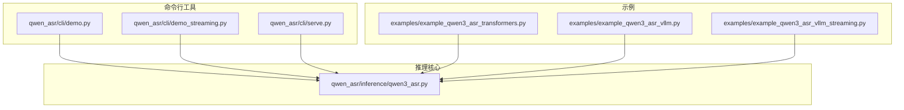
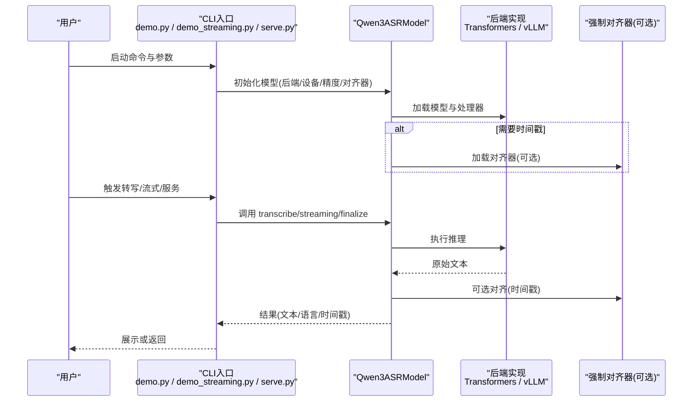
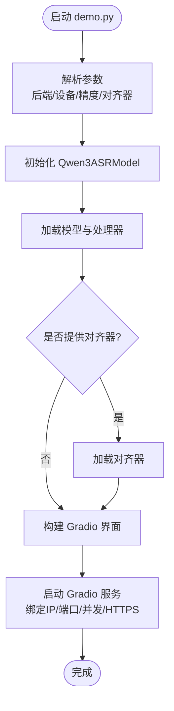
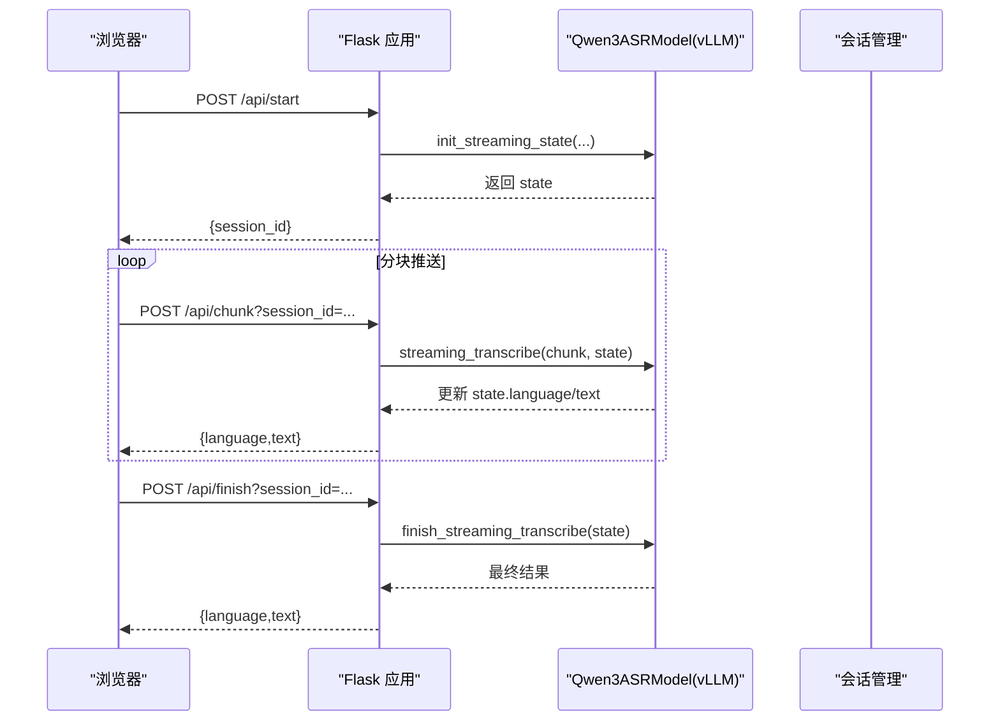
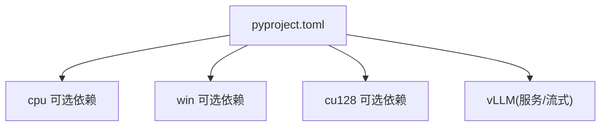

# 命令行工具使用

<cite>
**本文引用的文件**
- [qwen_asr/cli/demo.py](file://qwen_asr/cli/demo.py)
- [qwen_asr/cli/demo_streaming.py](file://qwen_asr/cli/demo_streaming.py)
- [qwen_asr/cli/serve.py](file://qwen_asr/cli/serve.py)
- [qwen_asr/__main__.py](file://qwen_asr/__main__.py)
- [qwen_asr/inference/qwen3_asr.py](file://qwen_asr/inference/qwen3_asr.py)
- [examples/example_qwen3_asr_transformers.py](file://examples/example_qwen3_asr_transformers.py)
- [examples/example_qwen3_asr_vllm.py](file://examples/example_qwen3_asr_vllm.py)
- [examples/example_qwen3_asr_vllm_streaming.py](file://examples/example_qwen3_asr_vllm_streaming.py)
- [pyproject.toml](file://pyproject.toml)
</cite>

## 目录
1. [简介](#简介)
2. [项目结构](#项目结构)
3. [核心组件](#核心组件)
4. [架构总览](#架构总览)
5. [详细组件分析](#详细组件分析)
6. [依赖分析](#依赖分析)
7. [性能考虑](#性能考虑)
8. [故障排除指南](#故障排除指南)
9. [结论](#结论)
10. [附录](#附录)

## 简介
本指南面向使用 Qwen3-ASR GGUF 项目的命令行工具与示例程序的用户，系统讲解以下 CLI 工具的用途、参数与使用方式：
- qwen-asr-demo：基于 Gradio 的离线/流式转写演示界面，支持 Transformers 与 vLLM 后端。
- qwen-asr-demo-streaming：基于 Flask 的最小化流式 Web 演示，仅支持 vLLM 后端。
- qwen-asr-serve：通过 vLLM 提供的 serve 子命令启动模型服务。

同时覆盖：
- 后端选择与设备配置
- 性能调优参数
- 离线转写、流式处理、批量处理的典型用法
- Gradio 界面的配置与定制
- Web 服务启动与配置流程
- 故障排除与性能监控建议

## 项目结构
本项目围绕 qwen_asr 包提供统一推理封装与 CLI 入口，核心文件分布如下：
- qwen_asr/cli：命令行入口与演示脚本
- qwen_asr/inference：统一的 Qwen3ASRModel 推理接口
- examples：不同后端与模式的示例脚本
- pyproject.toml：项目依赖与可选后端（如 vLLM）

图表来源
- [qwen_asr/cli/demo.py:124-205](file://qwen_asr/cli/demo.py#L124-L205)
- [qwen_asr/cli/demo_streaming.py:472-483](file://qwen_asr/cli/demo_streaming.py#L472-L483)
- [qwen_asr/cli/serve.py:40-43](file://qwen_asr/cli/serve.py#L40-L43)
- [qwen_asr/inference/qwen3_asr.py:131-288](file://qwen_asr/inference/qwen3_asr.py#L131-L288)
- [examples/example_qwen3_asr_transformers.py:127-148](file://examples/example_qwen3_asr_transformers.py#L127-L148)
- [examples/example_qwen3_asr_vllm.py:131-148](file://examples/example_qwen3_asr_vllm.py#L131-L148)
- [examples/example_qwen3_asr_vllm_streaming.py:88-101](file://examples/example_qwen3_asr_vllm_streaming.py#L88-L101)

章节来源
- [qwen_asr/__main__.py:16-23](file://qwen_asr/__main__.py#L16-L23)

## 核心组件
- Qwen3ASRModel：统一的推理封装，支持 Transformers 与 vLLM 两种后端；可选强制对齐器以输出时间戳。
- CLI 工具：
  - demo.py：构建 Gradio 界面，支持后端选择、设备与精度配置、HTTPS、并发队列等。
  - demo_streaming.py：提供最小化流式 Web 演示，基于 Flask，仅 vLLM 后端。
  - serve.py：包装 vLLM 的 serve 子命令，便于通过 CLI 启动服务。

章节来源
- [qwen_asr/inference/qwen3_asr.py:131-288](file://qwen_asr/inference/qwen3_asr.py#L131-L288)
- [qwen_asr/cli/demo.py:124-205](file://qwen_asr/cli/demo.py#L124-L205)
- [qwen_asr/cli/demo_streaming.py:472-483](file://qwen_asr/cli/demo_streaming.py#L472-L483)
- [qwen_asr/cli/serve.py:40-43](file://qwen_asr/cli/serve.py#L40-L43)

## 架构总览
下图展示了 CLI 工具如何与推理核心交互，以及后端差异：

图表来源
- [qwen_asr/cli/demo.py:480-532](file://qwen_asr/cli/demo.py#L480-L532)
- [qwen_asr/cli/demo_streaming.py:485-503](file://qwen_asr/cli/demo_streaming.py#L485-L503)
- [qwen_asr/cli/serve.py:40-43](file://qwen_asr/cli/serve.py#L40-L43)
- [qwen_asr/inference/qwen3_asr.py:176-288](file://qwen_asr/inference/qwen3_asr.py#L176-L288)

## 详细组件分析

### 组件一：qwen-asr-demo（离线/流式演示）
- 功能特性
  - 支持 Transformers 与 vLLM 后端切换
  - 可选强制对齐器以输出时间戳
  - 支持设置 CUDA 设备可见性、并发队列、HTTPS 参数
  - 提供 Gradio 界面，支持语言选择、音频上传、时间戳可视化
- 关键参数
  - --asr-checkpoint：ASR 模型路径或 HuggingFace 仓库 ID
  - --aligner-checkpoint：强制对齐器路径或仓库 ID（可选）
  - --backend：transformers 或 vllm
  - --cuda-visible-devices：设置 CUDA_VISIBLE_DEVICES
  - --backend-kwargs：后端特定参数（如 dtype、device_map、max_inference_batch_size、gpu_memory_utilization 等）
  - --aligner-kwargs：对齐器参数（如 dtype、device_map）
  - --ip/--port/--share/--concurrency：Gradio 服务器绑定、分享与并发
  - --ssl-certfile/--ssl-keyfile/--ssl-verify：HTTPS 配置
- 使用示例
  - 离线转写（Transformers）：指定 --backend transformers 与 --backend-kwargs
  - 流式处理（vLLM）：结合 demo_streaming.py
  - 批量处理：在 Gradio 界面中上传多个音频或通过脚本批量调用
- 时间戳可视化
  - 当启用对齐器时，可在界面中生成每个词的时间戳切片并播放

图表来源
- [qwen_asr/cli/demo.py:124-205](file://qwen_asr/cli/demo.py#L124-L205)
- [qwen_asr/cli/demo.py:480-532](file://qwen_asr/cli/demo.py#L480-L532)

章节来源
- [qwen_asr/cli/demo.py:124-205](file://qwen_asr/cli/demo.py#L124-L205)
- [qwen_asr/cli/demo.py:345-477](file://qwen_asr/cli/demo.py#L345-L477)
- [qwen_asr/cli/demo.py:480-532](file://qwen_asr/cli/demo.py#L480-L532)

### 组件二：qwen-asr-demo-streaming（流式 Web 演示）
- 功能特性
  - 最小化前端页面，基于 Flask 提供 /api/start、/api/chunk、/api/finish 接口
  - 仅支持 vLLM 后端
  - 支持会话管理与超时回收
- 关键参数
  - --asr-model-path：ASR 模型路径或仓库 ID
  - --host/--port：Flask 绑定地址与端口
  - --gpu-memory-utilization：vLLM GPU 内存利用率
  - --unfixed-chunk-num/--unfixed-token-num/--chunk-size-sec：流式参数（见下方“流式处理”）
- 使用示例
  - 启动服务后，在浏览器打开首页，点击“开始”，麦克风采集音频按固定时长分块推送，实时显示语言与文本

图表来源
- [qwen_asr/cli/demo_streaming.py:417-470](file://qwen_asr/cli/demo_streaming.py#L417-L470)
- [qwen_asr/cli/demo_streaming.py:485-503](file://qwen_asr/cli/demo_streaming.py#L485-L503)
- [qwen_asr/inference/qwen3_asr.py:584-765](file://qwen_asr/inference/qwen3_asr.py#L584-L765)

章节来源
- [qwen_asr/cli/demo_streaming.py:472-483](file://qwen_asr/cli/demo_streaming.py#L472-L483)
- [qwen_asr/cli/demo_streaming.py:417-470](file://qwen_asr/cli/demo_streaming.py#L417-L470)
- [qwen_asr/cli/demo_streaming.py:485-503](file://qwen_asr/cli/demo_streaming.py#L485-L503)

### 组件三：qwen-asr-serve（vLLM 服务）
- 功能特性
  - 通过包装 vLLM 的 serve 子命令启动服务，便于直接使用 vLLM 的服务能力
- 使用注意
  - 需安装带 vLLM 可选依赖的包（参见“依赖分析”）

章节来源
- [qwen_asr/cli/serve.py:40-43](file://qwen_asr/cli/serve.py#L40-L43)

## 依赖分析
- Python 版本要求：>=3.11
- 必需依赖：FastAPI、GGUF、Librosa、Loguru、Nagisa、NumPy、ONNXScript、Pydantic、Pydantic Settings、Python-Multipart、SentencePiece、SoundFile、SRT、Typer、Uvicorn 等
- 可选后端依赖：
  - cpu/win/cu128：分别对应 CPU、Windows DirectML、CUDA 12.8 的 PyTorch 与 ONNXRuntime 变体
  - vLLM：用于流式与服务模式（qwen-asr-serve）

图表来源
- [pyproject.toml:1-102](file://pyproject.toml#L1-L102)

章节来源
- [pyproject.toml:1-102](file://pyproject.toml#L1-L102)

## 性能考虑
- 后端选择
  - Transformers：适合中小规模部署与调试，支持多参数微调（dtype、device_map、max_inference_batch_size）
  - vLLM：适合高吞吐与流式场景，支持 gpu_memory_utilization、max_inference_batch_size 等参数
- 设备与精度
  - 通过 --cuda-visible-devices 控制可见 GPU
  - 通过 --backend-kwargs 的 dtype（如 bfloat16/float16/float32）与 device_map（如 cuda:0）优化显存占用与速度
- 批处理与分块
  - 通过 max_inference_batch_size 控制批大小，避免 OOM
  - 对于长音频，自动分块并在必要时进行强制对齐（时间戳）
- 流式参数
  - demo_streaming.py 中的 unfixed-chunk-num、unfixed-token-num、chunk-size-sec 影响边界抖动与延迟
- 日志与监控
  - 可结合 Loguru/Uvicorn 日志输出进行性能观测
  - 通过并发队列与会话 TTL 控制资源占用

章节来源
- [qwen_asr/cli/demo.py:227-263](file://qwen_asr/cli/demo.py#L227-L263)
- [qwen_asr/cli/demo_streaming.py:479-481](file://qwen_asr/cli/demo_streaming.py#L479-L481)
- [qwen_asr/inference/qwen3_asr.py:490-537](file://qwen_asr/inference/qwen3_asr.py#L490-L537)

## 故障排除指南
- 无法找到 qwen-asr-demo/qwen-asr-demo-streaming/qwen-asr-serve 命令
  - 确认已安装项目并正确注册 CLI 入口（参见 qwen_asr/__main__.py 的提示）
- ImportError: vLLM is not available
  - 安装带 vLLM 可选依赖的包（例如 pip install qwen-asr[vllm]），或使用 Transformers 后端
- CUDA 设备不可见或显存不足
  - 设置 --cuda-visible-devices；调整 --backend-kwargs 的 dtype 与 device_map；降低 max_inference_batch_size
- 时间戳不可用
  - 需在初始化时提供 --aligner-checkpoint；否则返回时间戳时报错
- 流式处理报错
  - 仅 vLLM 后端支持流式；确保使用 demo_streaming.py 并正确传入流式参数
- HTTPS 证书问题
  - 检查 --ssl-certfile 与 --ssl-keyfile 路径；必要时关闭 --ssl-verify（不推荐生产环境）

章节来源
- [qwen_asr/cli/demo.py:264-267](file://qwen_asr/cli/demo.py#L264-L267)
- [qwen_asr/cli/demo.py:335-336](file://qwen_asr/cli/demo.py#L335-L336)
- [qwen_asr/cli/demo_streaming.py:497-501](file://qwen_asr/cli/demo_streaming.py#L497-L501)
- [qwen_asr/cli/serve.py:33-36](file://qwen_asr/cli/serve.py#L33-L36)

## 结论
本指南提供了 Qwen3-ASR GGUF 项目命令行工具的完整使用说明，涵盖离线转写、流式处理与服务启动的多种场景。通过合理选择后端、配置设备与精度、控制批大小与流式参数，可在不同硬件与部署环境下获得稳定且高性能的语音转写体验。遇到问题时，可依据“故障排除指南”快速定位并解决。

## 附录

### A. 常见使用场景与示例路径
- 离线转写（Transformers）
  - 示例脚本：[examples/example_qwen3_asr_transformers.py:127-148](file://examples/example_qwen3_asr_transformers.py#L127-L148)
- 离线转写（vLLM）
  - 示例脚本：[examples/example_qwen3_asr_vllm.py:131-148](file://examples/example_qwen3_asr_vllm.py#L131-L148)
- 流式处理（vLLM）
  - 示例脚本：[examples/example_qwen3_asr_vllm_streaming.py:88-101](file://examples/example_qwen3_asr_vllm_streaming.py#L88-L101)
  - Web 演示：[qwen_asr/cli/demo_streaming.py:485-503](file://qwen_asr/cli/demo_streaming.py#L485-L503)

### B. 参数速查表
- demo.py（节选）
  - --asr-checkpoint：ASR 模型路径或仓库 ID
  - --aligner-checkpoint：对齐器路径或仓库 ID（可选）
  - --backend：transformers / vllm
  - --cuda-visible-devices：CUDA 设备可见性
  - --backend-kwargs：后端参数（dtype/device_map/gpu_memory_utilization/max_inference_batch_size 等）
  - --aligner-kwargs：对齐器参数（dtype/device_map 等）
  - --ip/--port/--share/--concurrency：Gradio 服务器参数
  - --ssl-certfile/--ssl-keyfile/--ssl-verify：HTTPS 参数
- demo_streaming.py（节选）
  - --asr-model-path：ASR 模型路径或仓库 ID
  - --host/--port：Flask 绑定地址与端口
  - --gpu-memory-utilization：vLLM GPU 内存利用率
  - --unfixed-chunk-num/--unfixed-token-num/--chunk-size-sec：流式参数
- serve.py
  - 通过 vLLM serve 子命令启动服务（需安装 vLLM 可选依赖）

章节来源
- [qwen_asr/cli/demo.py:124-205](file://qwen_asr/cli/demo.py#L124-L205)
- [qwen_asr/cli/demo_streaming.py:472-483](file://qwen_asr/cli/demo_streaming.py#L472-L483)
- [qwen_asr/cli/serve.py:40-43](file://qwen_asr/cli/serve.py#L40-L43)