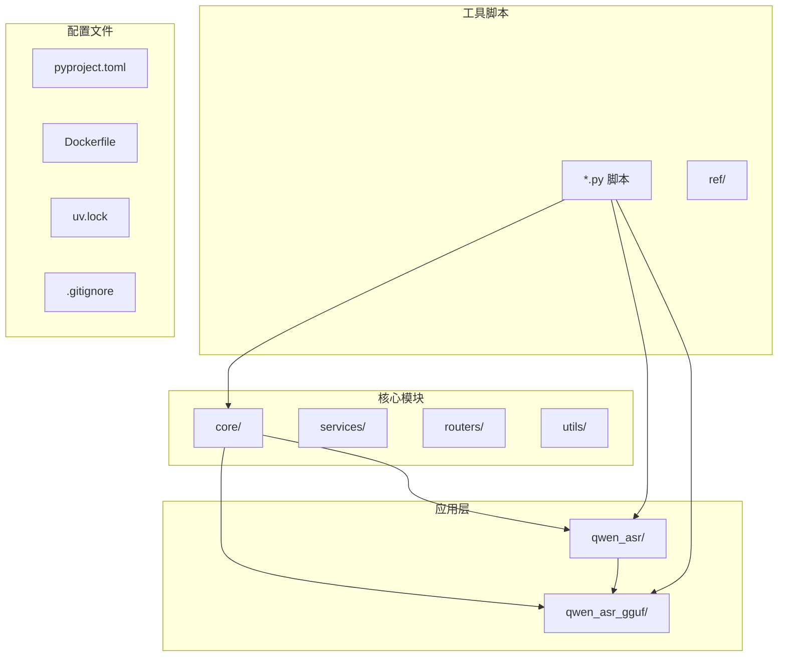
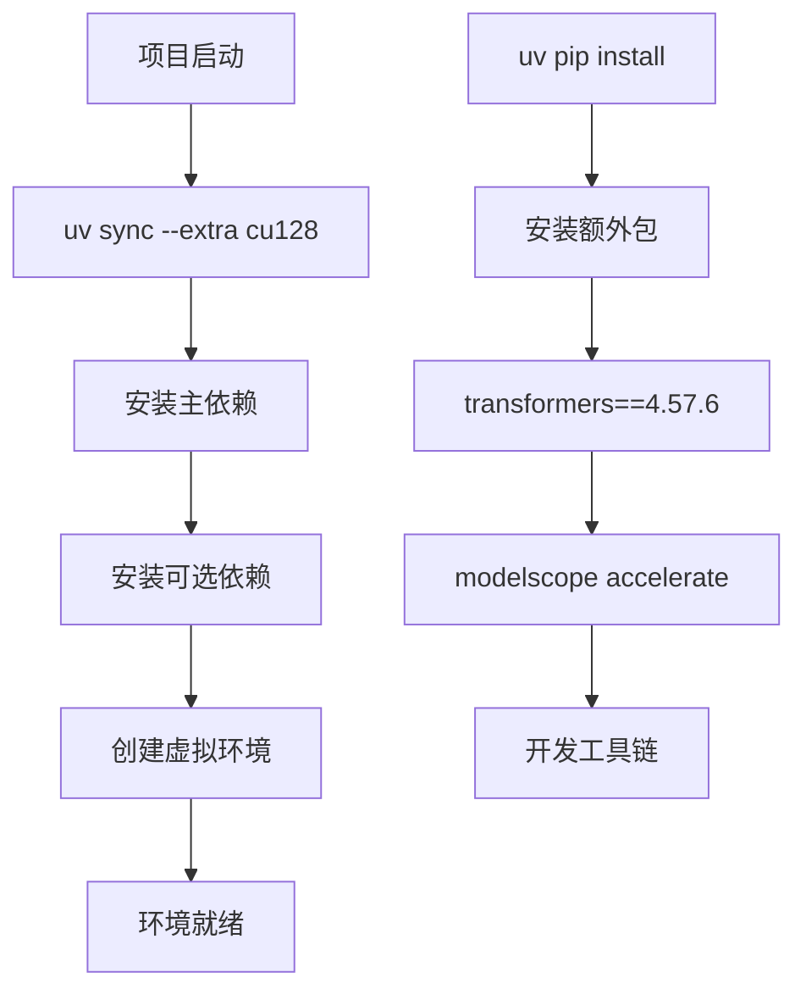
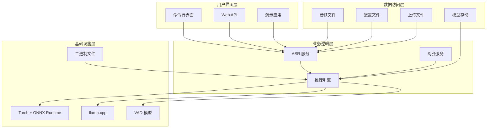
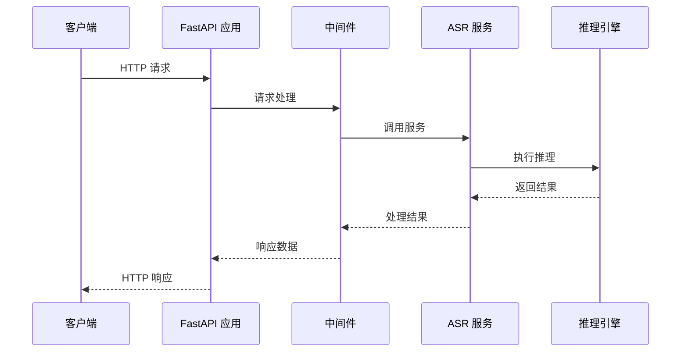
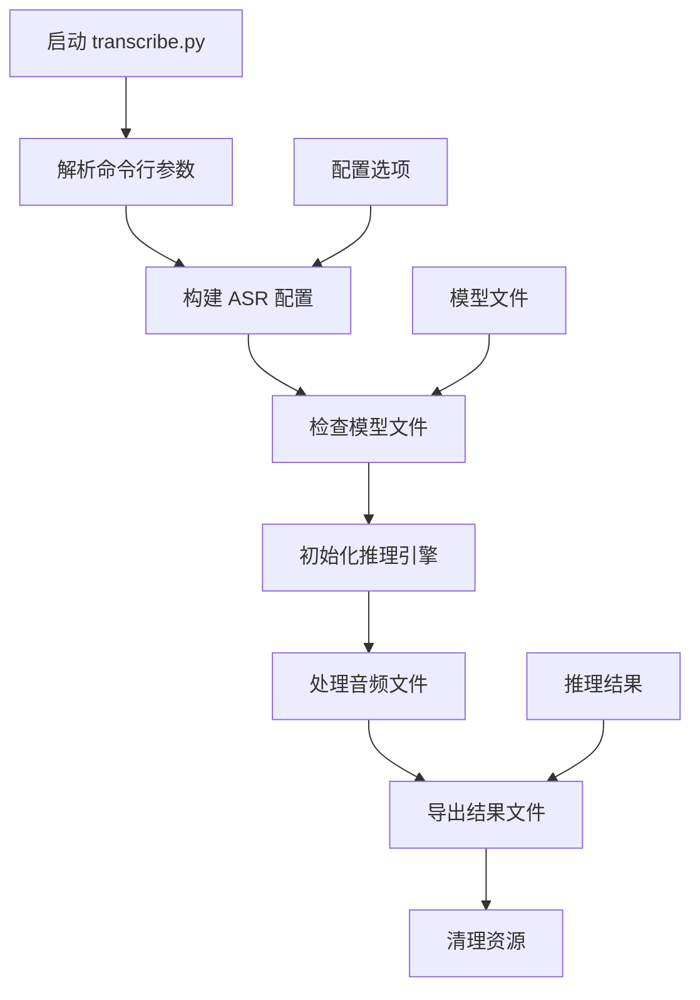
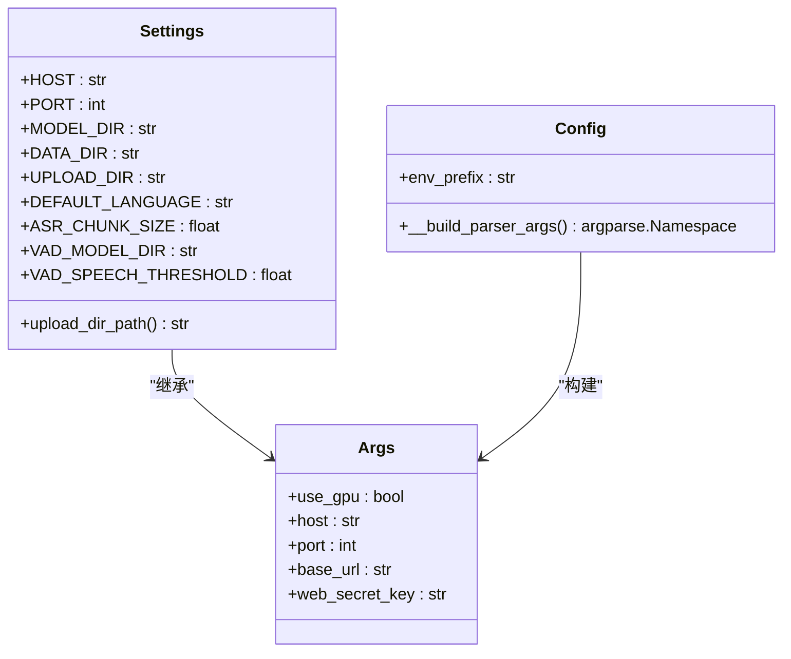
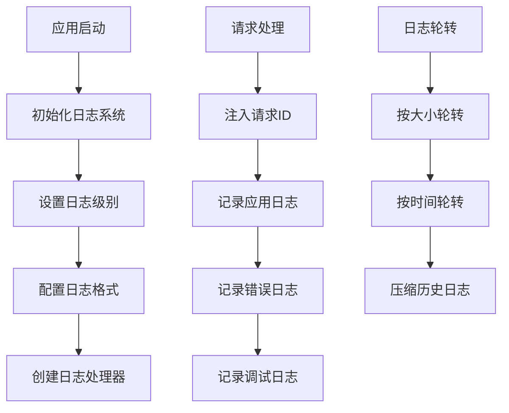
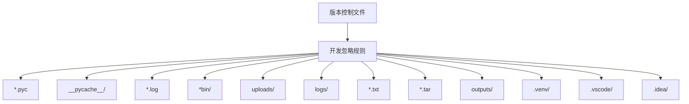
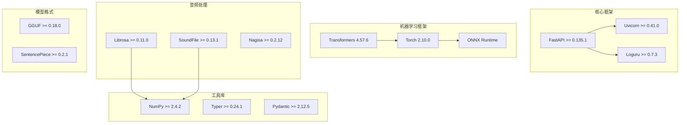
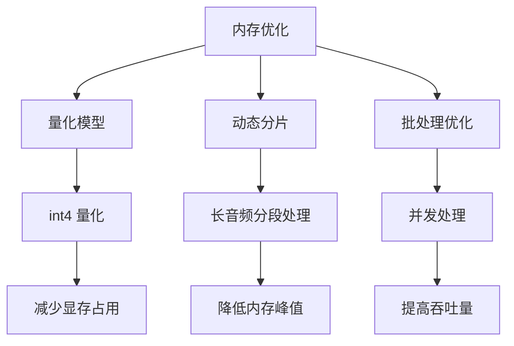

# 开发环境搭建

<cite>
**本文档引用的文件**
- [pyproject.toml](file://pyproject.toml)
- [Dockerfile](file://Dockerfile)
- [README.md](file://README.md)
- [uv.lock](file://uv.lock)
- [run.sh](file://run.sh)
- [export_config.py](file://export_config.py)
- [infer.py](file://infer.py)
- [transcribe.py](file://transcribe.py)
- [core/config.py](file://core/config.py)
- [core/logger.py](file://core/logger.py)
- [.gitignore](file://.gitignore)
- [qwen_asr/__main__.py](file://qwen_asr/__main__.py)
</cite>

## 更新摘要
**变更内容**
- 更新了文件忽略配置，新增了 `*bin/` 和 `uploads/` 条目
- 增强了开发环境的文件管理配置
- 完善了环境变量和目录结构说明

## 目录
1. [简介](#简介)
2. [项目结构](#项目结构)
3. [核心组件](#核心组件)
4. [架构概览](#架构概览)
5. [详细组件分析](#详细组件分析)
6. [依赖分析](#依赖分析)
7. [性能考虑](#性能考虑)
8. [故障排除指南](#故障排除指南)
9. [结论](#结论)
10. [附录](#附录)

## 简介

Qwen3-ASR GGUF 是一个将 Qwen3-ASR 模型转换为可本地高效运行的混合格式的项目，实现快速、准确的离线语音识别。该项目基于 llama.cpp 进行 LLM Decoder 加速，支持纯本地运行、GPU 加速（Vulkan/CUDA/ROCm/DirectML）、流式输出、字幕输出等功能。

## 项目结构

项目采用模块化的组织结构，主要包含以下几个核心模块：



**图表来源**
- [pyproject.toml:1-102](file://pyproject.toml#L1-L102)
- [Dockerfile:1-66](file://Dockerfile#L1-L66)
- [.gitignore:1-22](file://.gitignore#L1-L22)

**章节来源**
- [pyproject.toml:1-102](file://pyproject.toml#L1-L102)
- [Dockerfile:1-66](file://Dockerfile#L1-L66)
- [.gitignore:1-22](file://.gitignore#L1-L22)

## 核心组件

### 系统要求

项目对系统环境有明确的要求：

- **Python 版本**: >= 3.11
- **操作系统**: Linux、Windows、macOS（通过 uv.lock 文件验证支持多平台）
- **内存**: 至少 8GB RAM（推荐 16GB+）
- **存储**: 至少 20GB 可用空间（模型文件较大）

### 依赖管理

项目使用现代的依赖管理工具：



**图表来源**
- [pyproject.toml:28-57](file://pyproject.toml#L28-L57)
- [README.md:120-134](file://README.md#L120-L134)

**章节来源**
- [pyproject.toml:6-23](file://pyproject.toml#L6-L23)
- [uv.lock:1-14](file://uv.lock#L1-L14)
- [README.md:120-134](file://README.md#L120-L134)

## 架构概览

项目采用分层架构设计，结合了 Web 服务、推理引擎和模型管理：



**图表来源**
- [infer.py:84-102](file://infer.py#L84-L102)
- [core/config.py:52-108](file://core/config.py#L52-L108)

## 详细组件分析

### Web 服务组件

Web 服务基于 FastAPI 构建，提供了完整的 RESTful API：



**图表来源**
- [infer.py:55-81](file://infer.py#L55-L81)
- [infer.py:84-102](file://infer.py#L84-L102)

**章节来源**
- [infer.py:1-123](file://infer.py#L1-L123)

### 命令行工具组件

命令行工具提供了灵活的音频转录功能：



**图表来源**
- [transcribe.py:68-130](file://transcribe.py#L68-L130)
- [transcribe.py:145-198](file://transcribe.py#L145-L198)

**章节来源**
- [transcribe.py:1-205](file://transcribe.py#L1-L205)

### 配置管理系统

配置系统支持多种配置方式：



**图表来源**
- [core/config.py:52-108](file://core/config.py#L52-L108)
- [core/config.py:19-44](file://core/config.py#L19-L44)

**章节来源**
- [core/config.py:1-109](file://core/config.py#L1-L109)

### 日志记录系统

日志系统提供了多层次的日志记录能力：



**图表来源**
- [core/logger.py:14-72](file://core/logger.py#L14-L72)

**章节来源**
- [core/logger.py:1-73](file://core/logger.py#L1-L73)

### 文件忽略配置

**更新** 新增了 `*bin/` 和 `uploads/` 条目，改善了开发环境的文件忽略配置

项目使用 `.gitignore` 文件来管理不需要版本控制的文件和目录：



**图表来源**
- [.gitignore:1-22](file://.gitignore#L1-L22)

**章节来源**
- [.gitignore:1-22](file://.gitignore#L1-L22)

## 依赖分析

### 主要依赖关系

项目的核心依赖关系如下：



**图表来源**
- [pyproject.toml:7-23](file://pyproject.toml#L7-L23)

**章节来源**
- [pyproject.toml:1-102](file://pyproject.toml#L1-L102)

### 可选依赖配置

项目提供了针对不同平台的可选依赖配置：

| 平台 | 可选依赖 | 用途 |
|------|----------|------|
| CPU | torch==2.10.0+cpu<br/>torchvision==0.25.0+cpu<br/>torchaudio==2.10.0+cpu<br/>onnxruntime | CPU 推理 |
| CUDA 12.8 | torch==2.10.0+cu128<br/>torchvision==0.25.0+cu128<br/>torchaudio==2.10.0+cu128<br/>onnxruntime-gpu | NVIDIA GPU 推理 |
| Windows | torch==2.10.0+cpu<br/>torchvision==0.25.0+cpu<br/>torchaudio==2.10.0+cpu<br/>onnxruntime-directml | DirectML 推理 |

**章节来源**
- [pyproject.toml:28-48](file://pyproject.toml#L28-L48)

## 性能考虑

### GPU 加速配置

项目支持多种 GPU 加速方案：

- **CUDA**: 适用于 NVIDIA GPU，提供最佳性能
- **Vulkan**: 跨平台图形 API，支持 AMD、Intel 和部分 NVIDIA GPU
- **ROCm**: 适用于 AMD GPU
- **DirectML**: 适用于 Windows 平台的 DirectX GPU

### 内存优化策略



**章节来源**
- [README.md:101-115](file://README.md#L101-L115)

## 故障排除指南

### 常见问题及解决方案

#### 1. 模型文件缺失

**问题**: 运行时提示找不到模型文件
**解决方案**: 
- 下载官方模型文件到 models 目录
- 确认模型文件完整性
- 检查模型精度设置是否正确

#### 2. GPU 推理失败

**问题**: 使用 GPU 推理时报错
**解决方案**:
- 尝试禁用 GPU: `--no-gpu`
- 检查 CUDA 驱动版本
- 确认 GPU 显存充足

#### 3. Vulkan 相关问题

**问题**: Vulkan 推理性能异常
**解决方案**:
- 设置环境变量 `GGML_VK_DISABLE_F16=1`
- 检查 Vulkan 驱动安装
- 尝试禁用 Vulkan: `--no-vulkan`

#### 4. 内存不足

**问题**: 推理过程中内存溢出
**解决方案**:
- 降低音频分段大小
- 减少上下文窗口大小
- 使用更低精度的量化模型

#### 5. 文件忽略问题

**问题**: 开发环境中出现意外的文件提交
**解决方案**:
- 检查 `.gitignore` 文件中的 `*bin/` 和 `uploads/` 条目
- 确保二进制文件和上传文件被正确忽略
- 使用 `git status` 查看被跟踪的文件

**章节来源**
- [transcribe.py:37-66](file://transcribe.py#L37-L66)
- [README.md:373-382](file://README.md#L373-L382)
- [.gitignore:20-21](file://.gitignore#L20-L21)

## 结论

Qwen3-ASR GGUF 项目提供了一个完整、高效的本地语音识别解决方案。通过合理的依赖管理和多平台支持，用户可以在不同的硬件环境下获得最佳的推理性能。项目的设计充分考虑了易用性和可维护性，为开发者提供了清晰的架构和完善的工具链。

## 附录

### 环境变量配置

| 环境变量 | 默认值 | 说明 |
|----------|--------|------|
| ENVIRONMENT | production | 运行环境 (production/development) |
| ASR_MODEL_DIR | ./models | 模型文件目录 |
| ASR_ENABLE_VAD | true | 是否启用 VAD |
| ASR_VAD_MODEL_DIR | ./models/FireRedVAD/VAD | VAD 模型目录 |
| ASR_VAD_SPEECH_THRESHOLD | 0.3 | VAD 语音阈值 |
| ASR_ASR_CHUNK_SIZE | 30 | ASR 分段大小 |
| ASR_ASR_MEMORY_NUM | 1 | 内存片段数量 |
| ASR_UPLOAD_DIR | ./uploads | 上传文件目录 |

### 开发工具配置

#### VS Code 配置

```json
{
    "python.defaultInterpreterPath": "./.venv/bin/python",
    "python.linting.enabled": true,
    "python.linting.pylintEnabled": false,
    "python.linting.flake8Enabled": true,
    "python.formatting.provider": "black",
    "editor.formatOnSave": true,
    "files.exclude": {
        "**/__pycache__": true,
        "**/*.pyc": true,
        "**/*bin/": true,
        "**/uploads/": true
    }
}
```

#### PyCharm 配置

- Python 解释器: 使用项目虚拟环境
- 代码风格: PEP 8
- Linting: Flake8
- 编码: UTF-8

### Docker 开发环境

```bash
# 构建开发镜像
docker build -t qwen3-asr-gguf-dev .

# 启动开发容器
docker run -it --rm \
    -p 8002:8002 \
    -v $(pwd):/workspace \
    -v ~/.cache:/root/.cache \
    qwen3-asr-gguf-dev bash
```

### 文件忽略配置详解

**更新** 新增的忽略规则说明：

- `*bin/`: 忽略所有二进制文件目录，防止编译产物被提交
- `uploads/`: 忽略上传文件目录，保护开发环境中的临时文件

这些规则确保了开发环境的整洁性和安全性，避免不必要的文件进入版本控制系统。