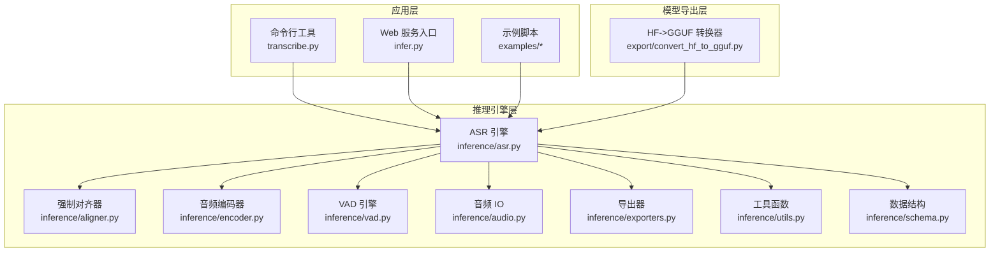
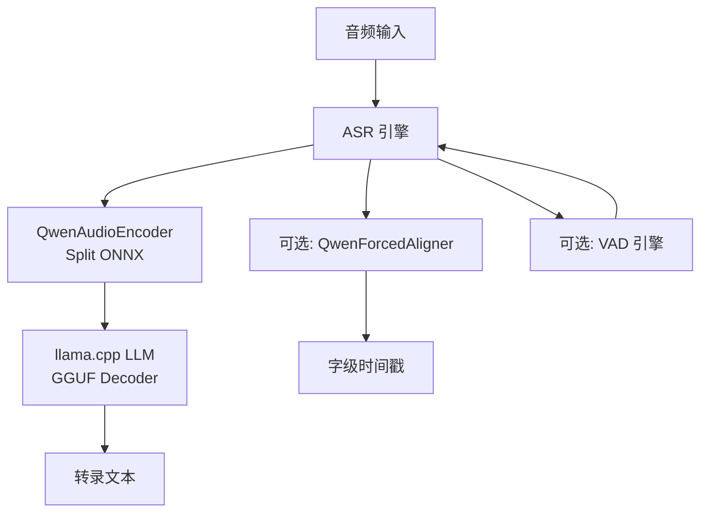
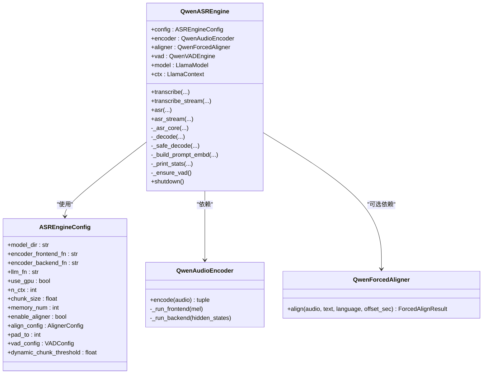
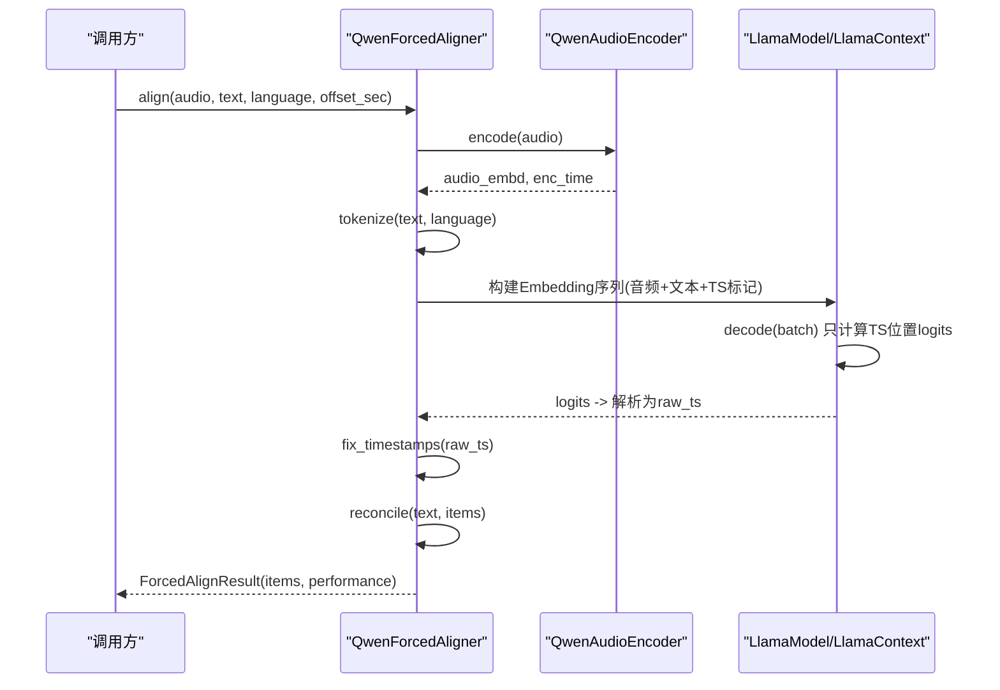
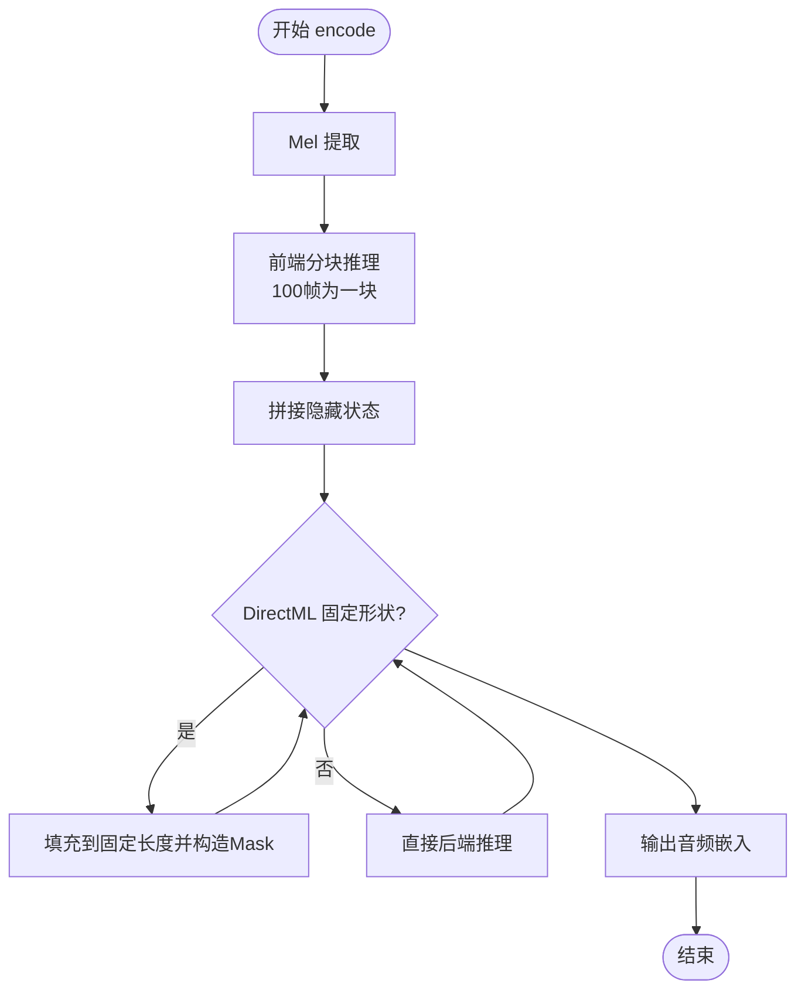
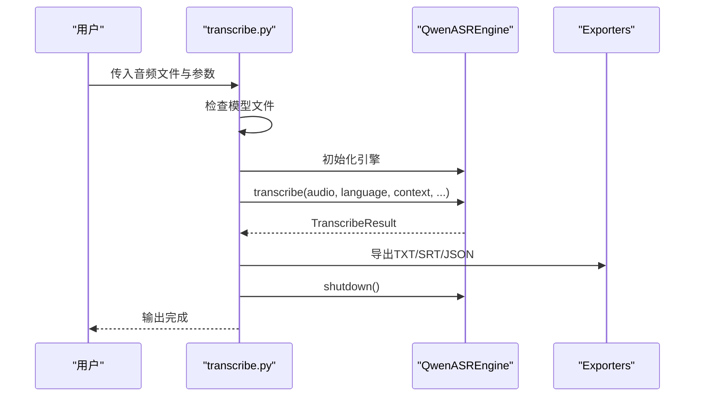
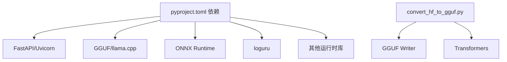

# 开发者指南

<cite>
**本文引用的文件**
- [README.md](file://README.md)
- [pyproject.toml](file://pyproject.toml)
- [qwen_asr/__main__.py](file://qwen_asr/__main__.py)
- [qwen_asr_gguf/__init__.py](file://qwen_asr_gguf/__init__.py)
- [qwen_asr_gguf/inference/asr.py](file://qwen_asr_gguf/inference/asr.py)
- [qwen_asr_gguf/inference/aligner.py](file://qwen_asr_gguf/inference/aligner.py)
- [qwen_asr_gguf/inference/encoder.py](file://qwen_asr_gguf/inference/encoder.py)
- [qwen_asr_gguf/inference/schema.py](file://qwen_asr_gguf/inference/schema.py)
- [qwen_asr_gguf/inference/utils.py](file://qwen_asr_gguf/inference/utils.py)
- [qwen_asr_gguf/inference/exporters.py](file://qwen_asr_gguf/inference/exporters.py)
- [qwen_asr_gguf/inference/audio.py](file://qwen_asr_gguf/inference/audio.py)
- [qwen_asr_gguf/inference/chinese_itn.py](file://qwen_asr_gguf/inference/chinese_itn.py)
- [qwen_asr_gguf/inference/vad.py](file://qwen_asr_gguf/inference/vad.py)
- [qwen_asr_gguf/export/convert_hf_to_gguf.py](file://qwen_asr_gguf/export/convert_hf_to_gguf.py)
- [examples/example_qwen3_asr_transformers.py](file://examples/example_qwen3_asr_transformers.py)
- [transcribe.py](file://transcribe.py)
- [infer.py](file://infer.py)
- [run.sh](file://run.sh)
</cite>

## 目录
1. [简介](#简介)
2. [项目结构](#项目结构)
3. [核心组件](#核心组件)
4. [架构总览](#架构总览)
5. [详细组件分析](#详细组件分析)
6. [依赖关系分析](#依赖关系分析)
7. [性能考量](#性能考量)
8. [故障排查指南](#故障排查指南)
9. [结论](#结论)
10. [附录](#附录)

## 简介
本指南面向希望参与 Qwen3-ASR GGUF 项目的开发者，系统阐述项目代码结构、模块组织与设计模式，解释核心组件职责、接口定义与扩展点，提供开发环境搭建、IDE 配置、调试设置与测试框架建议，详述如何扩展现有功能、添加新的推理后端与集成自定义模型，给出代码贡献流程、编码规范与测试策略，并通过 CLI 工具、Web 服务与 Python API 的实际示例帮助快速上手。最后总结性能分析方法、内存管理与并发处理最佳实践，并提供常见问题的解决方案与调试技巧。

## 项目结构
项目采用“功能域+层次”混合组织方式：
- 核心推理引擎位于 qwen_asr_gguf/inference，包含 ASR 引擎、强制对齐器、音频编码器、VAD、导出器与工具函数。
- CLI 工具位于根目录，提供命令行转录与示例脚本。
- Web 服务入口位于 infer.py，结合 FastAPI 与中间件体系。
- 模型导出工具位于 qwen_asr_gguf/export，包含从 Hugging Face 权重到 GGUF 的转换器。
- 示例位于 examples，涵盖 Transformers 与 vLLM 后端的使用范式。

图表来源
- [transcribe.py:1-205](file://transcribe.py#L1-L205)
- [infer.py:1-123](file://infer.py#L1-L123)
- [qwen_asr_gguf/inference/asr.py:1-800](file://qwen_asr_gguf/inference/asr.py#L1-L800)
- [qwen_asr_gguf/inference/encoder.py:1-280](file://qwen_asr_gguf/inference/encoder.py#L1-L280)
- [qwen_asr_gguf/inference/aligner.py:1-350](file://qwen_asr_gguf/inference/aligner.py#L1-L350)
- [qwen_asr_gguf/export/convert_hf_to_gguf.py:1-800](file://qwen_asr_gguf/export/convert_hf_to_gguf.py#L1-L800)

章节来源
- [README.md:316-344](file://README.md#L316-L344)
- [pyproject.toml:1-102](file://pyproject.toml#L1-L102)

## 核心组件
- ASR 引擎：负责音频分片、编码、LLM 解码、VAD 跳过、对齐与结果聚合，提供一次性与流式两种入口。
- 强制对齐器：基于统一编码器与 LLM，将文本与音频对齐，输出字级时间戳。
- 音频编码器：Split 前端/后端 ONNX 模型，支持动态/固定形状，自动选择 GPU Provider。
- VAD 引擎：基于 FireRedVAD 的非流式检测，长音频自动延迟加载，动态分片。
- 导出器：将转录结果导出为 TXT/SRT/JSON。
- 工具与数据结构：语言规范化、重复检测、配置与消息协议等。

章节来源
- [qwen_asr_gguf/inference/asr.py:40-800](file://qwen_asr_gguf/inference/asr.py#L40-L800)
- [qwen_asr_gguf/inference/aligner.py:229-350](file://qwen_asr_gguf/inference/aligner.py#L229-L350)
- [qwen_asr_gguf/inference/encoder.py:119-280](file://qwen_asr_gguf/inference/encoder.py#L119-L280)
- [qwen_asr_gguf/inference/schema.py:162-235](file://qwen_asr_gguf/inference/schema.py#L162-L235)
- [qwen_asr_gguf/inference/utils.py:1-134](file://qwen_asr_gguf/inference/utils.py#L1-L134)

## 架构总览
整体采用“编码器 + 解码器”的混合架构：ONNX 编码器负责声学特征提取，GGUF 解码器（llama.cpp）负责文本生成与对齐。项目提供 CLI、Web 服务与 Python API 三种使用入口，统一通过 ASR 引擎协调。

图表来源
- [qwen_asr_gguf/inference/asr.py:40-800](file://qwen_asr_gguf/inference/asr.py#L40-L800)
- [qwen_asr_gguf/inference/encoder.py:119-280](file://qwen_asr_gguf/inference/encoder.py#L119-L280)
- [qwen_asr_gguf/inference/aligner.py:229-350](file://qwen_asr_gguf/inference/aligner.py#L229-L350)

## 详细组件分析

### ASR 引擎（QwenASREngine）
- 职责：统一调度编码、解码、对齐与 VAD；支持一次性与流式转录；内置抗幻觉与重复修复机制。
- 关键接口：
  - transcribe / transcribe_stream：离线与流式入口
  - asr / asr_stream：核心处理管线
  - _asr_core：统一流水线，支持动态/固定分片与 VAD 跳过
- 设计要点：
  - 统一 Prompt 构建：遵循官方 Chat Template，拼接 system/user/assistant 与音频标记。
  - 解码内核：prefill + generation loop，带超时/重复熔断与重试。
  - 上下文记忆：基于分片文本与音频嵌入的滑动窗口。
  - 性能统计：编码、预填充、生成、对齐等阶段耗时汇总。

图表来源
- [qwen_asr_gguf/inference/asr.py:40-800](file://qwen_asr_gguf/inference/asr.py#L40-L800)
- [qwen_asr_gguf/inference/encoder.py:119-280](file://qwen_asr_gguf/inference/encoder.py#L119-L280)
- [qwen_asr_gguf/inference/aligner.py:229-350](file://qwen_asr_gguf/inference/aligner.py#L229-L350)
- [qwen_asr_gguf/inference/schema.py:162-235](file://qwen_asr_gguf/inference/schema.py#L162-L235)

章节来源
- [qwen_asr_gguf/inference/asr.py:40-800](file://qwen_asr_gguf/inference/asr.py#L40-L800)
- [qwen_asr_gguf/inference/schema.py:162-235](file://qwen_asr_gguf/inference/schema.py#L162-L235)

### 强制对齐器（QwenForcedAligner）
- 职责：将文本与音频对齐，输出字级时间戳；支持起始偏移叠加与标点恢复。
- 关键流程：编码（统一编码器）→ 构建 Prompt（插入音频与词/token 与时间戳标记）→ 推理 logits → 解析时间戳 → 修正与对齐 → 合并标点。
- 处理策略：仅对时间戳位置计算 logits 以加速；对齐后通过 reconcile 将缺失标点与空格补回。

图表来源
- [qwen_asr_gguf/inference/aligner.py:229-350](file://qwen_asr_gguf/inference/aligner.py#L229-L350)

章节来源
- [qwen_asr_gguf/inference/aligner.py:1-350](file://qwen_asr_gguf/inference/aligner.py#L1-L350)

### 音频编码器（QwenAudioEncoder）
- 职责：Split 前端/后端 ONNX 模型，Mel 提取与特征拼接，支持动态/固定形状与 GPU Provider 自动选择。
- 关键流程：Mel 提取 → 前端分块推理 → 拼接隐藏状态 → 后端 Transformer（可选 Attention Mask）→ 输出音频嵌入。
- 优化点：DirectML 固定形状预热；动态形状模式下避免冗余填充。

图表来源
- [qwen_asr_gguf/inference/encoder.py:119-280](file://qwen_asr_gguf/inference/encoder.py#L119-L280)

章节来源
- [qwen_asr_gguf/inference/encoder.py:1-280](file://qwen_asr_gguf/inference/encoder.py#L1-L280)

### VAD 引擎（QwenVADEngine）
- 职责：长音频自动延迟加载，基于 FireRedVAD 的非流式检测，动态分片与静音跳过。
- 关键流程：adaptive_detect → build_chunks → 生成 VADChunk → 主循环按语音段处理。

章节来源
- [qwen_asr_gguf/inference/asr.py:108-136](file://qwen_asr_gguf/inference/asr.py#L108-L136)
- [qwen_asr_gguf/inference/schema.py:88-160](file://qwen_asr_gguf/inference/schema.py#L88-L160)

### CLI 工具（transcribe.py）
- 职责：命令行转录工具，支持模型文件完整性检查、配置面板、批量处理与导出。
- 关键流程：解析参数 → 构造 ASREngineConfig → 初始化引擎 → 处理文件 → 导出 TXT/SRT/JSON → 关闭引擎。

图表来源
- [transcribe.py:68-205](file://transcribe.py#L68-L205)
- [qwen_asr_gguf/inference/asr.py:432-466](file://qwen_asr_gguf/inference/asr.py#L432-L466)
- [qwen_asr_gguf/inference/exporters.py](file://qwen_asr_gguf/inference/exporters.py)

章节来源
- [transcribe.py:1-205](file://transcribe.py#L1-L205)

### Web 服务入口（infer.py）
- 职责：FastAPI 应用生命周期管理、中间件注册、路由自动加载与全局异常处理。
- 关键流程：启动时初始化 ASR 服务单例 → 提供 API → 关闭时优雅释放资源。

章节来源
- [infer.py:1-123](file://infer.py#L1-L123)

## 依赖关系分析
- 依赖管理：使用 pyproject.toml 管理依赖与可选 extras（cpu/win/cu128），并配置 PyPI 镜像源。
- 运行时环境：llama.cpp GGUF 推理、ONNX Runtime（GPU/CPU/DirectML）、FastAPI/Uvicorn、loguru 等。
- 导出工具：convert_hf_to_gguf.py 提供从 Hugging Face 权重到 GGUF 的转换能力。

图表来源
- [pyproject.toml:1-102](file://pyproject.toml#L1-L102)
- [qwen_asr_gguf/export/convert_hf_to_gguf.py:1-800](file://qwen_asr_gguf/export/convert_hf_to_gguf.py#L1-L800)

章节来源
- [pyproject.toml:1-102](file://pyproject.toml#L1-L102)

## 性能考量
- 编码器性能：ONNX GPU Provider（CUDA/ROCm/DirectML）显著提升编码速度；DirectML 固定形状可减少显存抖动。
- 解码器性能：llama.cpp GGUF Decoder，上下文窗口 n_ctx 与 max_new_tokens 控制推理成本。
- 抗幻觉策略：token/短语级重复熔断、max_new_tokens 上限、滚动窗口记忆与 VAD 跳过。
- 流式与批处理：CLI 与 Web 服务分别面向离线与在线场景，注意 keep-alive 超时与长音频处理。

章节来源
- [README.md:19-116](file://README.md#L19-L116)
- [qwen_asr_gguf/inference/asr.py:212-345](file://qwen_asr_gguf/inference/asr.py#L212-L345)

## 故障排查指南
- 输出乱码或“!!!!”：Intel 集显 FP16 计算溢出，设置环境变量禁用。
- 模型文件缺失：CLI 提供模型文件完整性检查与提示。
- GPU/DirectML 初始化失败：尝试关闭 GPU/Vulkan 或切换 Provider。
- 日志定位：默认日志文件路径与级别可在初始化时配置。

章节来源
- [README.md:373-382](file://README.md#L373-L382)
- [transcribe.py:37-67](file://transcribe.py#L37-L67)
- [qwen_asr_gguf/__init__.py:23-54](file://qwen_asr_gguf/__init__.py#L23-L54)

## 结论
本项目通过“ONNX 编码器 + GGUF 解码器”的混合架构实现了高性能、低延迟的本地语音识别，并提供 CLI、Web 服务与 Python API 三种使用方式。核心在于统一的 ASR 引擎、可插拔的对齐与 VAD、以及完善的导出与工具链。开发者可在此基础上扩展新的推理后端、集成自定义模型，并通过 CLI 与 Web 服务快速验证与部署。

## 附录

### 开发环境搭建与 IDE 配置
- 依赖安装：使用 uv 同步依赖，按平台选择 extras（cpu/win/cu128）。
- 模型准备：从发布页下载已转换模型，放置于 models 目录。
- llama.cpp：从 Releases 下载预编译二进制，放入 qwen_asr_gguf/bin/。
- IDE 建议：启用 Python 类型检查与格式化（如 pyright/mypy/black/isort），在项目根目录配置工作区。

章节来源
- [README.md:120-141](file://README.md#L120-L141)
- [pyproject.toml:28-57](file://pyproject.toml#L28-L57)

### 调试设置与测试框架
- 日志：使用 loguru，默认日志文件路径与级别可配置。
- Web 服务：infer.py 提供生命周期钩子与中间件，便于接入访问日志与鉴权。
- CLI：transcribe.py 提供进度条与配置面板，便于快速验证。
- 测试：可参考示例脚本与导出工具，编写单元/集成测试覆盖关键路径。

章节来源
- [qwen_asr_gguf/__init__.py:23-54](file://qwen_asr_gguf/__init__.py#L23-L54)
- [infer.py:1-123](file://infer.py#L1-L123)
- [transcribe.py:1-205](file://transcribe.py#L1-L205)

### 扩展与集成指南
- 新的推理后端：在 ASR 引擎中抽象“编码器”接口，新增后端实现并注册 Provider。
- 自定义模型：使用 convert_hf_to_gguf.py 将 Hugging Face 权重转换为 GGUF，替换相应模型文件。
- 新增导出格式：在 exporters 中扩展导出器，统一输出格式与性能统计。

章节来源
- [qwen_asr_gguf/inference/asr.py:40-800](file://qwen_asr_gguf/inference/asr.py#L40-L800)
- [qwen_asr_gguf/export/convert_hf_to_gguf.py:1-800](file://qwen_asr_gguf/export/convert_hf_to_gguf.py#L1-L800)
- [qwen_asr_gguf/inference/exporters.py](file://qwen_asr_gguf/inference/exporters.py)

### 代码贡献流程与编码规范
- 提交流程：Fork → 分支开发 → 提交 PR → CI 检查 → 审阅合并。
- 编码规范：类型注解、清晰的类/函数命名、模块内聚与低耦合、异常处理与日志记录。
- 测试策略：覆盖 CLI、Web 服务、推理核心与导出器的关键路径，关注性能回归与边界条件。

章节来源
- [README.md:346-371](file://README.md#L346-L371)

### 实际开发示例
- CLI 使用：参考 transcribe.py 的参数与流程，快速转录音频并导出结果。
- Web 服务：使用 infer.py 启动服务，结合 run.sh 管理进程。
- Python API：参考 examples 中的 Transformers 与 vLLM 示例，了解不同后端的使用方式。

章节来源
- [transcribe.py:68-205](file://transcribe.py#L68-L205)
- [infer.py:114-123](file://infer.py#L114-L123)
- [run.sh:1-63](file://run.sh#L1-L63)
- [examples/example_qwen3_asr_transformers.py:1-151](file://examples/example_qwen3_asr_transformers.py#L1-L151)