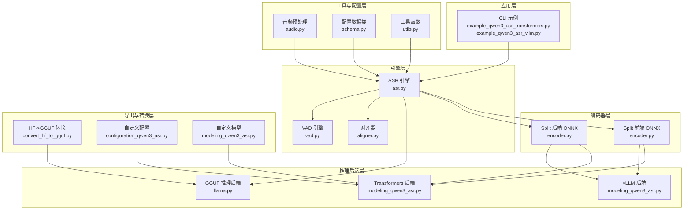
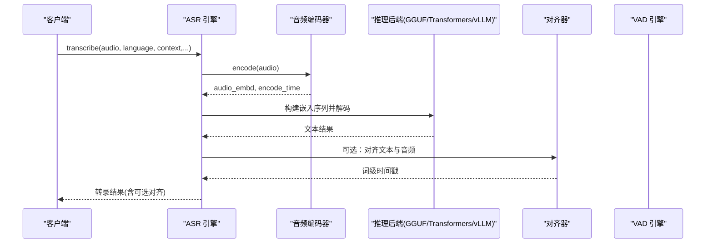
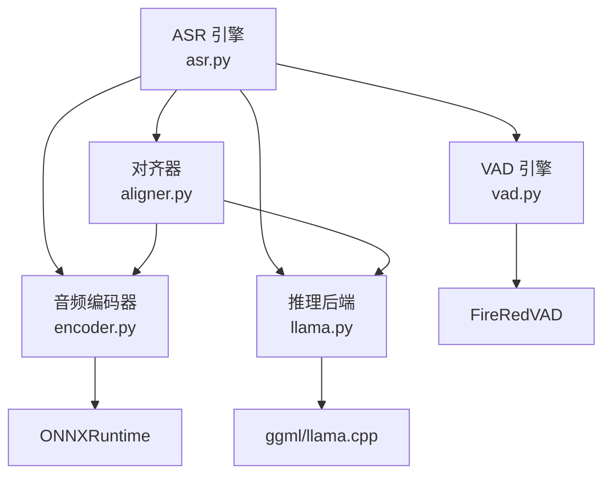

# 扩展开发指南

<cite>
**本文档引用的文件**
- [qwen_asr_gguf/inference/asr.py](file://qwen_asr_gguf/inference/asr.py)
- [qwen_asr_gguf/inference/encoder.py](file://qwen_asr_gguf/inference/encoder.py)
- [qwen_asr_gguf/inference/schema.py](file://qwen_asr_gguf/inference/schema.py)
- [qwen_asr_gguf/inference/utils.py](file://qwen_asr_gguf/inference/utils.py)
- [qwen_asr_gguf/inference/llama.py](file://qwen_asr_gguf/inference/llama.py)
- [qwen_asr_gguf/inference/aligner.py](file://qwen_asr_gguf/inference/aligner.py)
- [qwen_asr_gguf/inference/vad.py](file://qwen_asr_gguf/inference/vad.py)
- [qwen_asr_gguf/inference/audio.py](file://qwen_asr_gguf/inference/audio.py)
- [qwen_asr_gguf/export/convert_hf_to_gguf.py](file://qwen_asr_gguf/export/convert_hf_to_gguf.py)
- [qwen_asr_gguf/export/qwen3_asr_custom/configuration_qwen3_asr.py](file://qwen_asr_gguf/export/qwen3_asr_custom/configuration_qwen3_asr.py)
- [qwen_asr_gguf/export/qwen3_asr_custom/modeling_qwen3_asr.py](file://qwen_asr_gguf/export/qwen3_asr_custom/modeling_qwen3_asr.py)
- [examples/example_qwen3_asr_transformers.py](file://examples/example_qwen3_asr_transformers.py)
- [examples/example_qwen3_asr_vllm.py](file://examples/example_qwen3_asr_vllm.py)
</cite>

## 目录
1. [简介](#简介)
2. [项目结构](#项目结构)
3. [核心组件](#核心组件)
4. [架构概览](#架构概览)
5. [详细组件分析](#详细组件分析)
6. [依赖分析](#依赖分析)
7. [性能考虑](#性能考虑)
8. [故障排除指南](#故障排除指南)
9. [结论](#结论)
10. [附录](#附录)

## 简介
本指南面向希望扩展现有 Qwen3-ASR GGUF 项目的开发者，提供系统性的扩展开发方法论与实践指导。重点涵盖以下方面：
- 如何添加新的推理后端（如 Transformers、vLLM 等）
- 如何集成自定义模型（ONNX/FP32/INT4 等）
- 如何实现新特性（如新的对齐器、VAD 策略、流式解码器）
- 核心接口设计模式与扩展点（ASR 引擎接口、音频编码器接口等）
- 配置系统的扩展方法（新增配置参数与验证规则）
- 插件化架构的设计原则与实现策略
- 单元测试与集成测试的编写指南
- 性能优化与内存管理最佳实践

## 项目结构
该项目采用模块化分层设计，主要分为以下层次：
- 推理后端层：GGUF（llama.cpp）、Transformers、vLLM
- 编码器层：Split 前端 + 后端（ONNXRuntime）
- 引擎层：ASR 引擎、对齐器、VAD 引擎
- 工具与配置层：音频预处理、语言规范化、配置数据类
- 导出与转换层：HF 模型到 GGUF 的转换脚本与自定义配置/模型

**图表来源**
- [qwen_asr_gguf/inference/asr.py:40-103](file://qwen_asr_gguf/inference/asr.py#L40-L103)
- [qwen_asr_gguf/inference/encoder.py:119-196](file://qwen_asr_gguf/inference/encoder.py#L119-L196)
- [qwen_asr_gguf/inference/llama.py:443-548](file://qwen_asr_gguf/inference/llama.py#L443-L548)
- [qwen_asr_gguf/inference/aligner.py:229-258](file://qwen_asr_gguf/inference/aligner.py#L229-L258)
- [qwen_asr_gguf/inference/vad.py:29-81](file://qwen_asr_gguf/inference/vad.py#L29-L81)
- [qwen_asr_gguf/inference/audio.py:129-149](file://qwen_asr_gguf/inference/audio.py#L129-L149)
- [qwen_asr_gguf/export/convert_hf_to_gguf.py:79-177](file://qwen_asr_gguf/export/convert_hf_to_gguf.py#L79-L177)
- [qwen_asr_gguf/export/qwen3_asr_custom/configuration_qwen3_asr.py:358-426](file://qwen_asr_gguf/export/qwen3_asr_custom/configuration_qwen3_asr.py#L358-L426)
- [qwen_asr_gguf/export/qwen3_asr_custom/modeling_qwen3_asr.py:603-741](file://qwen_asr_gguf/export/qwen3_asr_custom/modeling_qwen3_asr.py#L603-L741)

**章节来源**
- [qwen_asr_gguf/inference/asr.py:40-103](file://qwen_asr_gguf/inference/asr.py#L40-L103)
- [qwen_asr_gguf/inference/encoder.py:119-196](file://qwen_asr_gguf/inference/encoder.py#L119-L196)
- [qwen_asr_gguf/inference/llama.py:443-548](file://qwen_asr_gguf/inference/llama.py#L443-L548)
- [qwen_asr_gguf/inference/aligner.py:229-258](file://qwen_asr_gguf/inference/aligner.py#L229-L258)
- [qwen_asr_gguf/inference/vad.py:29-81](file://qwen_asr_gguf/inference/vad.py#L29-L81)
- [qwen_asr_gguf/inference/audio.py:129-149](file://qwen_asr_gguf/inference/audio.py#L129-L149)
- [qwen_asr_gguf/export/convert_hf_to_gguf.py:79-177](file://qwen_asr_gguf/export/convert_hf_to_gguf.py#L79-L177)
- [qwen_asr_gguf/export/qwen3_asr_custom/configuration_qwen3_asr.py:358-426](file://qwen_asr_gguf/export/qwen3_asr_custom/configuration_qwen3_asr.py#L358-L426)
- [qwen_asr_gguf/export/qwen3_asr_custom/modeling_qwen3_asr.py:603-741](file://qwen_asr_gguf/export/qwen3_asr_custom/modeling_qwen3_asr.py#L603-L741)

## 核心组件
本节深入分析核心组件及其职责、接口与扩展点。

- ASR 引擎（QwenASREngine）
  - 职责：统一的转录流水线，支持一次性与流式处理；集成 VAD、对齐器、编码器与 GGUF 解码器。
  - 关键接口：transcribe、transcribe_stream、asr、asr_stream、_asr_core。
  - 扩展点：可替换编码器（ONNX/Split）、解码器（GGUF/Transformers/vLLM）、对齐器（可选）。
  - 参考路径：[qwen_asr_gguf/inference/asr.py:40-103](file://qwen_asr_gguf/inference/asr.py#L40-L103)

- 音频编码器（QwenAudioEncoder）
  - 职责：Split 前端 + 后端的 ONNX 推理，Mel 提取与特征拼接。
  - 关键接口：encode、_run_frontend、_run_backend。
  - 扩展点：支持不同 Provider（CUDA/ROCm/TensorRT/DML/CPU）、动态/固定形状模式。
  - 参考路径：[qwen_asr_gguf/inference/encoder.py:119-196](file://qwen_asr_gguf/inference/encoder.py#L119-L196)

- GGUF 推理后端（llama.py）
  - 职责：llama.cpp 的 Python 绑定封装，提供 LlamaModel、LlamaContext、LlamaBatch、LlamaSampler。
  - 关键接口：LlamaModel.tokenize/detokenize/token_to_bytes、LlamaContext.decode/clear_kv_cache、LlamaBatch.set_embd。
  - 扩展点：采样器链路、批处理优化、上下文参数调优。
  - 参考路径：[qwen_asr_gguf/inference/llama.py:443-548](file://qwen_asr_gguf/inference/llama.py#L443-L548)

- 对齐器（QwenForcedAligner）
  - 职责：基于文本与音频的强制对齐，生成词级时间戳。
  - 关键接口：align、AlignerProcessor.tokenize/reconcile。
  - 扩展点：支持更多语言分词、时间戳修复策略。
  - 参考路径：[qwen_asr_gguf/inference/aligner.py:229-258](file://qwen_asr_gguf/inference/aligner.py#L229-L258)

- VAD 引擎（QwenVADEngine）
  - 职责：语音活动检测，支持自适应阈值与分片构建。
  - 关键接口：detect、adaptive_detect、build_chunks。
  - 扩展点：更换底层 VAD 实现、调整阈值策略。
  - 参考路径：[qwen_asr_gguf/inference/vad.py:29-81](file://qwen_asr_gguf/inference/vad.py#L29-L81)

- 配置系统（schema.py）
  - 职责：集中定义 ASR/Aligner/VAD 配置数据类，提供默认值与后处理逻辑。
  - 关键数据类：ASREngineConfig、AlignerConfig、VADConfig、VADResult、VADChunk、TranscribeResult、StreamChunkResult。
  - 扩展点：新增字段、默认值策略、校验规则。
  - 参考路径：[qwen_asr_gguf/inference/schema.py:162-210](file://qwen_asr_gguf/inference/schema.py#L162-L210)

- 工具与辅助（utils.py、audio.py）
  - 职责：语言规范化、重复检测、音频重采样与加载。
  - 扩展点：新增语言支持、音频处理算法。
  - 参考路径：[qwen_asr_gguf/inference/utils.py:38-56](file://qwen_asr_gguf/inference/utils.py#L38-L56)、[qwen_asr_gguf/inference/audio.py:129-149](file://qwen_asr_gguf/inference/audio.py#L129-L149)

**章节来源**
- [qwen_asr_gguf/inference/asr.py:40-103](file://qwen_asr_gguf/inference/asr.py#L40-L103)
- [qwen_asr_gguf/inference/encoder.py:119-196](file://qwen_asr_gguf/inference/encoder.py#L119-L196)
- [qwen_asr_gguf/inference/llama.py:443-548](file://qwen_asr_gguf/inference/llama.py#L443-L548)
- [qwen_asr_gguf/inference/aligner.py:229-258](file://qwen_asr_gguf/inference/aligner.py#L229-L258)
- [qwen_asr_gguf/inference/vad.py:29-81](file://qwen_asr_gguf/inference/vad.py#L29-L81)
- [qwen_asr_gguf/inference/schema.py:162-210](file://qwen_asr_gguf/inference/schema.py#L162-L210)
- [qwen_asr_gguf/inference/utils.py:38-56](file://qwen_asr_gguf/inference/utils.py#L38-L56)
- [qwen_asr_gguf/inference/audio.py:129-149](file://qwen_asr_gguf/inference/audio.py#L129-L149)

## 架构概览
整体架构采用“引擎 + 插件”的设计，核心引擎负责编排，各组件通过统一接口进行替换与扩展。

**图表来源**
- [qwen_asr_gguf/inference/asr.py:432-514](file://qwen_asr_gguf/inference/asr.py#L432-L514)
- [qwen_asr_gguf/inference/encoder.py:260-280](file://qwen_asr_gguf/inference/encoder.py#L260-L280)
- [qwen_asr_gguf/inference/llama.py:550-625](file://qwen_asr_gguf/inference/llama.py#L550-L625)
- [qwen_asr_gguf/inference/aligner.py:260-348](file://qwen_asr_gguf/inference/aligner.py#L260-L348)

## 详细组件分析

### ASR 引擎扩展点与实现策略
- 扩展点
  - 编码器替换：实现新的编码器接口，满足 encode(audio) -> (embedding, time) 签名。
  - 推理后端替换：实现新的解码器接口，满足嵌入注入与采样生成。
  - 对齐器替换：实现新的对齐器接口，满足 align(audio, text, language) -> ForcedAlignResult。
  - VAD 替换：实现新的 VAD 接口，满足 detect(audio, sr) -> VADResult。
- 实现建议
  - 保持与现有数据类（TranscribeResult、StreamChunkResult、ForcedAlignResult）的兼容。
  - 提供统一的生命周期管理（初始化、预热、shutdown）。
  - 在配置系统中新增可选参数，并提供合理的默认值与校验。

**章节来源**
- [qwen_asr_gguf/inference/asr.py:40-103](file://qwen_asr_gguf/inference/asr.py#L40-L103)
- [qwen_asr_gguf/inference/schema.py:162-210](file://qwen_asr_gguf/inference/schema.py#L162-L210)

### 音频编码器扩展点与实现策略
- 扩展点
  - Provider 选择：支持更多硬件后端（如 TensorRT、MUSA、OpenCL 等）。
  - 形状模式：动态形状与固定形状的切换策略。
  - 前端/后端流水线：可替换前端/后端模型或优化推理路径。
- 实现建议
  - 在初始化阶段根据 use_gpu 与可用 Provider 自动选择最优配置。
  - 提供预热机制，避免首次调用的冷启动开销。
  - 保持与 GGUF 解码器的嵌入维度一致性。

**章节来源**
- [qwen_asr_gguf/inference/encoder.py:119-196](file://qwen_asr_gguf/inference/encoder.py#L119-L196)

### GGUF 推理后端扩展点与实现策略
- 扩展点
  - 采样器链路：温度、Top-K、Top-P、Min-P、重复惩罚等参数组合。
  - 批处理优化：LlamaBatch 的 set_embd 与位置编码策略。
  - 上下文参数：n_ctx、n_batch、n_threads、flash-attn 等。
- 实现建议
  - 通过 LlamaSampler 组合多种采样策略，提升稳定性与多样性。
  - 合理设置 KV Cache 与 offload 参数，平衡吞吐与延迟。
  - 在 decode 前清理 KV Cache，避免历史干扰。

**章节来源**
- [qwen_asr_gguf/inference/llama.py:443-548](file://qwen_asr_gguf/inference/llama.py#L443-L548)
- [qwen_asr_gguf/inference/llama.py:635-738](file://qwen_asr_gguf/inference/llama.py#L635-L738)

### 对齐器扩展点与实现策略
- 扩展点
  - 分词策略：针对不同语言的分词器（如韩语、日语、中文）。
  - 时间戳修复：基于 DP/LIS 的时间戳修正算法。
  - 重建时间戳：将对齐结果映射回原文本的标点与空格。
- 实现建议
  - 保持与 ASR 文本的字符级对齐，避免跨词断句。
  - 提供可配置的步进单位（如 80ms），并与 STEP_MS 保持一致。

**章节来源**
- [qwen_asr_gguf/inference/aligner.py:229-258](file://qwen_asr_gguf/inference/aligner.py#L229-L258)
- [qwen_asr_gguf/inference/aligner.py:138-198](file://qwen_asr_gguf/inference/aligner.py#L138-L198)

### VAD 引擎扩展点与实现策略
- 扩展点
  - 阈值策略：自适应阈值与固定阈值的切换。
  - 分片构建：基于语音段的贪心打包与静音分片插入。
  - 语音段提取：按时间戳提取音频片段。
- 实现建议
  - 在长音频场景下启用自适应阈值，提升鲁棒性。
  - 合理设置最小语音段与静音段阈值，避免过度分割。

**章节来源**
- [qwen_asr_gguf/inference/vad.py:160-223](file://qwen_asr_gguf/inference/vad.py#L160-L223)
- [qwen_asr_gguf/inference/vad.py:299-406](file://qwen_asr_gguf/inference/vad.py#L299-L406)

### 配置系统扩展方法
- 新增配置参数
  - 在 ASREngineConfig/AlignerConfig/VADConfig 中添加字段，并在 __post_init__ 中设置默认值。
  - 提供 validate_language 与 normalize_language_name 等校验与归一化函数。
- 验证规则
  - 支持的语言列表与校验函数，确保输入合法性。
  - VADConfig 的阈值范围与默认值约束。
- 参考路径
  - [qwen_asr_gguf/inference/schema.py:162-210](file://qwen_asr_gguf/inference/schema.py#L162-L210)
  - [qwen_asr_gguf/inference/utils.py:38-56](file://qwen_asr_gguf/inference/utils.py#L38-L56)

**章节来源**
- [qwen_asr_gguf/inference/schema.py:162-210](file://qwen_asr_gguf/inference/schema.py#L162-L210)
- [qwen_asr_gguf/inference/utils.py:38-56](file://qwen_asr_gguf/inference/utils.py#L38-L56)

### 插件化架构设计原则与实现策略
- 设计原则
  - 接口契约：所有插件需实现统一的接口签名，保证替换透明。
  - 生命周期管理：提供初始化、预热、运行、关闭的完整生命周期。
  - 配置驱动：通过配置数据类控制插件行为，避免硬编码。
- 实现策略
  - 使用工厂模式或注册表管理插件实例。
  - 在 ASR 引擎中通过配置选择具体插件实现。
  - 提供默认实现与可选实现，确保向后兼容。

**章节来源**
- [qwen_asr_gguf/inference/asr.py:40-103](file://qwen_asr_gguf/inference/asr.py#L40-L103)
- [qwen_asr_gguf/inference/schema.py:162-210](file://qwen_asr_gguf/inference/schema.py#L162-L210)

### 单元测试与集成测试编写指南
- 单元测试
  - 针对工具函数（如 detect_and_fix_repetitions、normalize_language_name）编写边界条件测试。
  - 针对编码器（encode）编写输入形状、Provider 选择、动态/固定形状的测试。
  - 针对 VAD（detect/adaptive_detect）编写阈值变化、分片构建的测试。
- 集成测试
  - 使用示例脚本（example_qwen3_asr_transformers.py、example_qwen3_asr_vllm.py）验证端到端流程。
  - 比较不同后端（GGUF/Transformers/vLLM）的输出一致性与性能差异。
- 参考路径
  - [examples/example_qwen3_asr_transformers.py:127-151](file://examples/example_qwen3_asr_transformers.py#L127-L151)
  - [examples/example_qwen3_asr_vllm.py:131-153](file://examples/example_qwen3_asr_vllm.py#L131-L153)

**章节来源**
- [examples/example_qwen3_asr_transformers.py:127-151](file://examples/example_qwen3_asr_transformers.py#L127-L151)
- [examples/example_qwen3_asr_vllm.py:131-153](file://examples/example_qwen3_asr_vllm.py#L131-L153)

### 性能优化与内存管理最佳实践
- 编码器优化
  - 合理设置 pad_to 与动态形状，减少冗余计算。
  - 在 DML/CPU 模式下进行预热，避免首次调用开销。
- 解码器优化
  - 合理设置 n_ctx、n_batch、n_threads，平衡吞吐与延迟。
  - 使用 KV Cache 与 offload 参数，减少显存占用。
- VAD 优化
  - 长音频启用自适应阈值，减少误检与漏检。
  - 合理设置最小语音段与静音段阈值，避免过度分割。
- 内存管理
  - 及时释放 LlamaBatch、LlamaSampler 等资源，避免内存泄漏。
  - 使用队列与滑动窗口管理历史上下文，控制内存峰值。

**章节来源**
- [qwen_asr_gguf/inference/encoder.py:186-196](file://qwen_asr_gguf/inference/encoder.py#L186-L196)
- [qwen_asr_gguf/inference/llama.py:541-548](file://qwen_asr_gguf/inference/llama.py#L541-L548)
- [qwen_asr_gguf/inference/vad.py:160-223](file://qwen_asr_gguf/inference/vad.py#L160-L223)

## 依赖分析
本节分析组件间的依赖关系与耦合度，帮助识别潜在的循环依赖与扩展风险。

**图表来源**
- [qwen_asr_gguf/inference/asr.py:40-103](file://qwen_asr_gguf/inference/asr.py#L40-L103)
- [qwen_asr_gguf/inference/encoder.py:119-196](file://qwen_asr_gguf/inference/encoder.py#L119-L196)
- [qwen_asr_gguf/inference/llama.py:159-218](file://qwen_asr_gguf/inference/llama.py#L159-L218)
- [qwen_asr_gguf/inference/aligner.py:229-258](file://qwen_asr_gguf/inference/aligner.py#L229-L258)
- [qwen_asr_gguf/inference/vad.py:51-81](file://qwen_asr_gguf/inference/vad.py#L51-L81)

**章节来源**
- [qwen_asr_gguf/inference/asr.py:40-103](file://qwen_asr_gguf/inference/asr.py#L40-L103)
- [qwen_asr_gguf/inference/encoder.py:119-196](file://qwen_asr_gguf/inference/encoder.py#L119-L196)
- [qwen_asr_gguf/inference/llama.py:159-218](file://qwen_asr_gguf/inference/llama.py#L159-L218)
- [qwen_asr_gguf/inference/aligner.py:229-258](file://qwen_asr_gguf/inference/aligner.py#L229-L258)
- [qwen_asr_gguf/inference/vad.py:51-81](file://qwen_asr_gguf/inference/vad.py#L51-L81)

## 性能考虑
- 编码器性能
  - 动态形状模式下，避免固定长度 Padding，减少冗余计算。
  - Provider 选择优先级：CUDA > ROCm > TensorRT > DML > CPU。
- 解码器性能
  - n_ctx 与 n_batch 的合理设置可显著影响吞吐与延迟。
  - 线程数设置为 CPU 核心数的一半左右，兼顾吞吐与延迟。
- VAD 性能
  - 自适应阈值在长音频场景下提升准确性，但增加一次概率分析开销。
  - 合理设置最小语音段与静音段阈值，避免过度分割导致的额外开销。

## 故障排除指南
- 常见问题
  - 模型加载失败：检查模型路径与 ggml/llama.cpp 库的可访问性。
  - VAD 未安装：安装 fireredvad 并确保路径正确。
  - ONNX Provider 不可用：检查 CUDA/ROCm/TensorRT/DML 的安装与版本。
- 排查步骤
  - 查看日志输出，定位具体失败环节。
  - 使用示例脚本验证端到端流程。
  - 在配置中启用 verbose，获取更详细的调试信息。

**章节来源**
- [qwen_asr_gguf/inference/llama.py:378-418](file://qwen_asr_gguf/inference/llama.py#L378-L418)
- [qwen_asr_gguf/inference/vad.py:51-81](file://qwen_asr_gguf/inference/vad.py#L51-L81)
- [qwen_asr_gguf/inference/encoder.py:137-164](file://qwen_asr_gguf/inference/encoder.py#L137-L164)

## 结论
本指南提供了 Qwen3-ASR GGUF 项目的扩展开发方法论与实践路径。通过明确的扩展点、插件化架构与完善的配置系统，开发者可以安全地添加新的推理后端、集成自定义模型并实现新特性。配合单元测试与集成测试，以及性能优化与内存管理的最佳实践，能够确保扩展功能的质量与稳定性。

## 附录
- 示例脚本
  - Transformers 后端示例：[examples/example_qwen3_asr_transformers.py:127-151](file://examples/example_qwen3_asr_transformers.py#L127-L151)
  - vLLM 后端示例：[examples/example_qwen3_asr_vllm.py:131-153](file://examples/example_qwen3_asr_vllm.py#L131-L153)
- 模型导出与转换
  - HF->GGUF 转换脚本：[qwen_asr_gguf/export/convert_hf_to_gguf.py:79-177](file://qwen_asr_gguf/export/convert_hf_to_gguf.py#L79-L177)
  - 自定义配置与模型：[qwen_asr_gguf/export/qwen3_asr_custom/configuration_qwen3_asr.py:358-426](file://qwen_asr_gguf/export/qwen3_asr_custom/configuration_qwen3_asr.py#L358-L426)、[qwen_asr_gguf/export/qwen3_asr_custom/modeling_qwen3_asr.py:603-741](file://qwen_asr_gguf/export/qwen3_asr_custom/modeling_qwen3_asr.py#L603-L741)