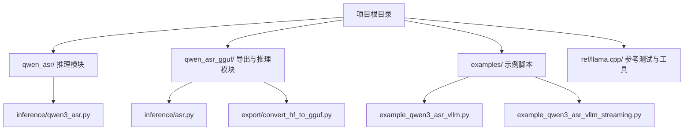
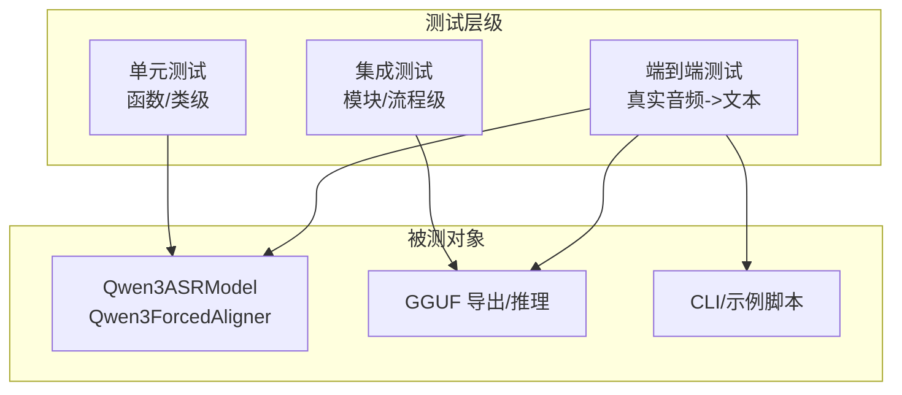
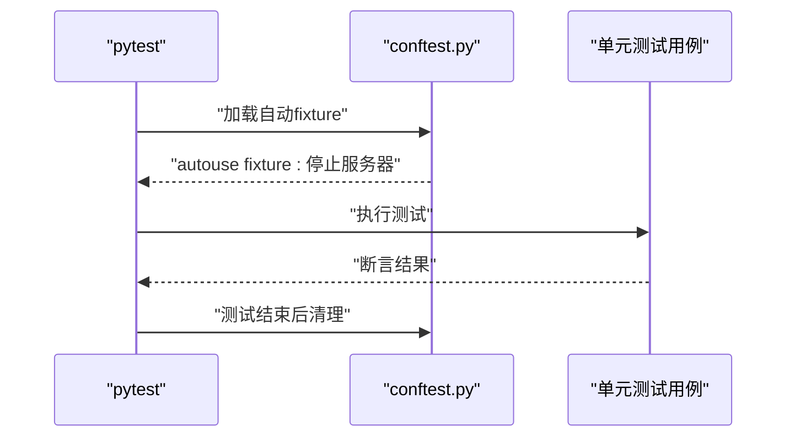
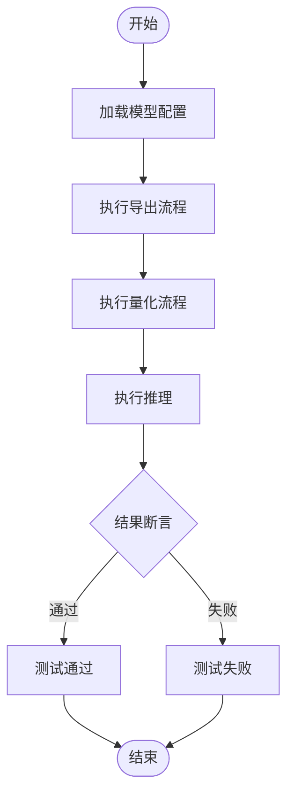
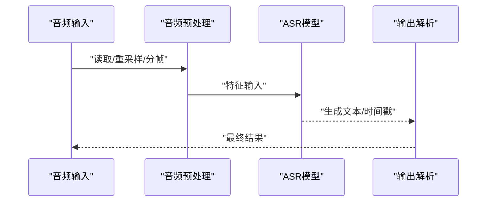
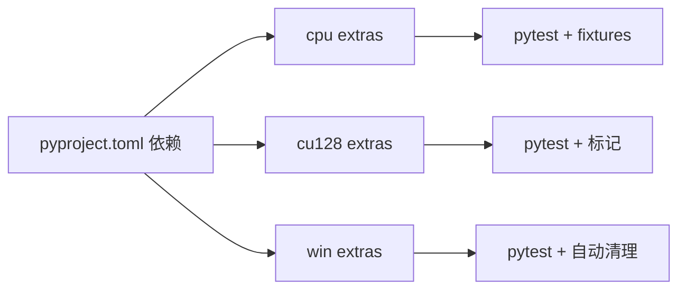

# 测试策略与实践

<cite>
**本文引用的文件**   
- [pyproject.toml](file://pyproject.toml)
- [main.py](file://main.py)
- [qwen_asr/__init__.py](file://qwen_asr/__init__.py)
- [qwen_asr_gguf/__init__.py](file://qwen_asr_gguf/__init__.py)
- [qwen_asr/inference/qwen3_asr.py](file://qwen_asr/inference/qwen3_asr.py)
- [examples/example_qwen3_asr_vllm.py](file://examples/example_qwen3_asr_vllm.py)
- [examples/example_qwen3_asr_vllm_streaming.py](file://examples/example_qwen3_asr_vllm_streaming.py)
- [ref/llama.cpp/tools/server/tests/conftest.py](file://ref/llama.cpp/tools/server/tests/conftest.py)
- [ref/llama.cpp/tools/server/tests/pytest.ini](file://ref/llama.cpp/tools/server/tests/pytest.ini)
- [ref/llama.cpp/gguf-py/tests/test_metadata.py](file://ref/llama.cpp/gguf-py/tests/test_metadata.py)
- [ref/llama.cpp/gguf-py/tests/test_quants.py](file://ref/llama.cpp/gguf-py/tests/test_quants.py)
</cite>

## 目录
1. [引言](#引言)
2. [项目结构](#项目结构)
3. [核心组件](#核心组件)
4. [架构总览](#架构总览)
5. [详细组件分析](#详细组件分析)
6. [依赖分析](#依赖分析)
7. [性能考虑](#性能考虑)
8. [故障排查指南](#故障排查指南)
9. [结论](#结论)
10. [附录](#附录)

## 引言
本文件为 Qwen3-ASR GGUF 项目的测试策略与实践文档，目标是建立覆盖单元测试、集成测试与端到端测试的完整测试体系，明确测试框架选择与配置（以 pytest 为核心），给出测试用例设计原则与编写指南，规范测试数据准备与管理，提供 CI/CD 自动化集成思路，以及性能与压力测试方法论、测试覆盖率度量与改进策略，并总结测试环境搭建与维护要点。

## 项目结构
该项目采用多模块分层组织方式：
- 核心推理与导出工具位于 qwen_asr 与 qwen_asr_gguf 两个子包中，分别提供基于 Transformers 的推理与 GGUF 导出/推理能力。
- 示例脚本 examples 提供典型调用方式，便于集成测试与端到端验证。
- 参考实现 ref/llama.cpp 展示了成熟的测试基础设施（pytest、fixtures、标记等），可作为本项目测试工程化的参考模板。

**图示来源**
- [qwen_asr/inference/qwen3_asr.py](file://qwen_asr/inference/qwen3_asr.py)
- [qwen_asr_gguf/inference/asr.py](file://qwen_asr_gguf/inference/asr.py)
- [examples/example_qwen3_asr_vllm.py](file://examples/example_qwen3_asr_vllm.py)
- [examples/example_qwen3_asr_vllm_streaming.py](file://examples/example_qwen3_asr_vllm_streaming.py)

**章节来源**
- [pyproject.toml](file://pyproject.toml)
- [main.py](file://main.py)
- [qwen_asr/__init__.py](file://qwen_asr/__init__.py)
- [qwen_asr_gguf/__init__.py](file://qwen_asr_gguf/__init__.py)

## 核心组件
- 推理模型封装：提供统一的 ASR 推理接口，支持批处理、流式推理与强制对齐等能力。
- 导出与量化：提供从 HuggingFace 模型到 GGUF 的转换流程，包含编码器前端、后端、解码器导出与量化步骤。
- 示例与 CLI：提供命令行服务与演示脚本，便于快速验证与回归测试。
- 日志与初始化：模块级日志初始化与根路径解析，确保测试与运行时日志一致性。

**章节来源**
- [qwen_asr/inference/qwen3_asr.py](file://qwen_asr/inference/qwen3_asr.py)
- [qwen_asr_gguf/__init__.py](file://qwen_asr_gguf/__init__.py)
- [examples/example_qwen3_asr_vllm.py](file://examples/example_qwen3_asr_vllm.py)
- [examples/example_qwen3_asr_vllm_streaming.py](file://examples/example_qwen3_asr_vllm_streaming.py)

## 架构总览
下图展示了测试金字塔在本项目中的落地：单元测试聚焦于函数与类；集成测试覆盖模块间交互（如导出流程）；端到端测试覆盖真实音频输入到文本输出的完整链路。

[此图为概念性架构示意，不直接映射具体源码文件，故不附“图示来源”]

## 详细组件分析

### 单元测试设计与实施
- 测试框架：以 pytest 为核心，结合 fixtures、marks 与 conftest 组织测试生命周期与标记。
- 覆盖范围：针对核心函数（如量化/反量化、元数据解析、音频预处理等）进行断言测试。
- 参考实现：
  - 使用 autouse fixture 在每个测试后清理服务器实例，避免资源泄漏。
  - 通过 pytest.ini 定义标记（如 slow、serial），便于选择性执行。
  - 参考 gguf-py 的单元测试，覆盖元数据解析与量化/反量化一致性校验。

**图示来源**
- [ref/llama.cpp/tools/server/tests/conftest.py](file://ref/llama.cpp/tools/server/tests/conftest.py)

**章节来源**
- [ref/llama.cpp/tools/server/tests/conftest.py](file://ref/llama.cpp/tools/server/tests/conftest.py)
- [ref/llama.cpp/tools/server/tests/pytest.ini](file://ref/llama.cpp/tools/server/tests/pytest.ini)
- [ref/llama.cpp/gguf-py/tests/test_metadata.py](file://ref/llama.cpp/gguf-py/tests/test_metadata.py)
- [ref/llama.cpp/gguf-py/tests/test_quants.py](file://ref/llama.cpp/gguf-py/tests/test_quants.py)

### 集成测试设计与实施
- 目标：验证模块间协作与流程完整性，如从 HuggingFace 模型到 GGUF 的导出与推理链路。
- 关键点：
  - 使用示例脚本作为集成入口，模拟真实调用路径。
  - 对导出脚本与推理脚本进行组合测试，覆盖不同量化类型与设备配置。
  - 利用 pytest 标记控制耗时流程的执行时机。

**图示来源**
- [examples/example_qwen3_asr_vllm.py](file://examples/example_qwen3_asr_vllm.py)
- [qwen_asr_gguf/export/convert_hf_to_gguf.py](file://qwen_asr_gguf/export/convert_hf_to_gguf.py)

**章节来源**
- [examples/example_qwen3_asr_vllm.py](file://examples/example_qwen3_asr_vllm.py)
- [qwen_asr_gguf/export/convert_hf_to_gguf.py](file://qwen_asr_gguf/export/convert_hf_to_gguf.py)

### 端到端测试设计与实施
- 目标：验证从音频输入到文本输出的完整链路，覆盖不同采样率、语言、批次大小与流式场景。
- 关键点：
  - 使用示例脚本中的音频处理逻辑（重采样、分片）构造流式推理场景。
  - 对比单样本与批量样本的输出一致性，检查时间戳与语言检测的正确性。
  - 结合日志与状态对象验证中间状态（如流式状态）。

**图示来源**
- [examples/example_qwen3_asr_vllm_streaming.py](file://examples/example_qwen3_asr_vllm_streaming.py)
- [qwen_asr/inference/qwen3_asr.py](file://qwen_asr/inference/qwen3_asr.py)

**章节来源**
- [examples/example_qwen3_asr_vllm_streaming.py](file://examples/example_qwen3_asr_vllm_streaming.py)
- [qwen_asr/inference/qwen3_asr.py](file://qwen_asr/inference/qwen3_asr.py)

### 测试用例编写指南
- 核心功能
  - 推理一致性：对比不同后端（Transformers/vLLM）的输出文本与时间戳。
  - 导出与量化：断言导出产物可被推理模块加载，量化前后精度损失在可接受范围。
- 边缘情况
  - 短音频/空音频：验证预处理与错误返回。
  - 多语言混合：验证语言检测与切换。
  - 批量大小边界：验证 batch_size=1、超大批次等场景。
- 异常处理
  - 设备不可用（CPU/GPU/DML）：捕获并断言合理错误信息。
  - 模型路径/权重缺失：断言抛出预期异常。
- 断言策略
  - 使用 pytest 的参数化与 marks，提高用例复用与可维护性。
  - 对日志输出进行断言，确保关键路径有足够可观测性。

[本节为通用指导，不直接分析具体文件，故不附“章节来源”]

## 依赖分析
- 项目依赖与可选后端（CPU/CUDA/DirectML）通过工具链进行隔离，测试时应按需启用对应 extras，保证测试环境与生产一致。
- 参考测试工程化实践（fixtures、标记、自动清理）可直接迁移至本项目，提升测试稳定性与可重复性。

**图示来源**
- [pyproject.toml](file://pyproject.toml)
- [ref/llama.cpp/tools/server/tests/conftest.py](file://ref/llama.cpp/tools/server/tests/conftest.py)
- [ref/llama.cpp/tools/server/tests/pytest.ini](file://ref/llama.cpp/tools/server/tests/pytest.ini)

**章节来源**
- [pyproject.toml](file://pyproject.toml)
- [ref/llama.cpp/tools/server/tests/conftest.py](file://ref/llama.cpp/tools/server/tests/conftest.py)
- [ref/llama.cpp/tools/server/tests/pytest.ini](file://ref/llama.cpp/tools/server/tests/pytest.ini)

## 性能考虑
- 性能测试
  - 使用示例脚本构造不同长度与数量的音频批次，测量吞吐与延迟。
  - 对比不同后端（CPU/GPU/DML）与量化类型下的性能差异。
- 压力测试
  - 逐步增大并发与批大小，观察内存占用与稳定性。
  - 引入随机噪声与极端长度音频，评估鲁棒性。
- 指标采集
  - 记录每轮测试的平均/中位延迟、吞吐、P95/P99 延迟与错误率。

[本节为通用指导，不直接分析具体文件，故不附“章节来源”]

## 故障排查指南
- 常见问题
  - 依赖冲突：核对可选后端互斥配置，避免同时启用多个 GPU 后端。
  - 设备驱动：确认 CUDA/DML 可用性，必要时回退到 CPU。
  - 模型加载：检查模型路径与权重完整性，关注日志中的加载失败提示。
- 日志与诊断
  - 利用模块级日志初始化，定位推理与导出阶段的关键错误。
  - 在端到端测试中，结合状态对象与中间输出进行回溯。

**章节来源**
- [qwen_asr_gguf/__init__.py](file://qwen_asr_gguf/__init__.py)
- [pyproject.toml](file://pyproject.toml)

## 结论
通过引入 pytest 为核心的测试体系，结合参考实现的最佳实践，本项目可在单元、集成与端到端三个层面构建稳定可靠的测试保障。建议尽快补齐核心推理与导出流程的单元测试，完善示例脚本的集成与端到端用例，并在 CI 中加入性能与压力测试基线，持续提升质量与交付效率。

## 附录

### 测试数据准备与管理
- 音频资源：准备多语言、多采样率、长短不一的音频样本，覆盖流式与批量场景。
- 配置文件：提供不同后端与量化配置的基准配置，便于参数化测试。
- 资源管理：使用临时目录存放中间产物，测试结束后统一清理。

[本节为通用指导，不直接分析具体文件，故不附“章节来源”]

### CI/CD 集成方案
- 触发策略：主分支保护与 PR 触发，区分快速检查与全量矩阵。
- 测试矩阵：按操作系统、Python 版本、后端 extras（cpu/cu128/win）拆分任务。
- 缓存与加速：缓存依赖安装与模型下载，减少重复工作。
- 报告与归档：上传测试报告与覆盖率，保留日志与失败快照。

[本节为通用指导，不直接分析具体文件，故不附“章节来源”]

### 测试覆盖率度量与改进
- 度量：使用覆盖率工具统计语句、分支与函数覆盖率，设定阈值基线。
- 改进：优先补齐高风险路径与异常分支，定期回顾未覆盖区域。

[本节为通用指导，不直接分析具体文件，故不附“章节来源”]

### 测试环境搭建与维护
- 环境隔离：使用虚拟环境或容器，确保依赖与系统库版本可控。
- 维护策略：定期同步依赖版本，更新示例与测试用例，修复回归问题。

[本节为通用指导，不直接分析具体文件，故不附“章节来源”]