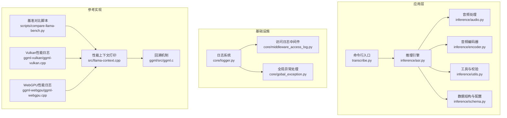
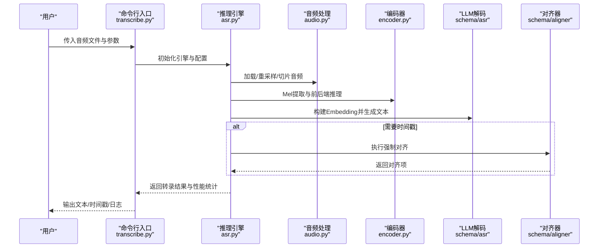
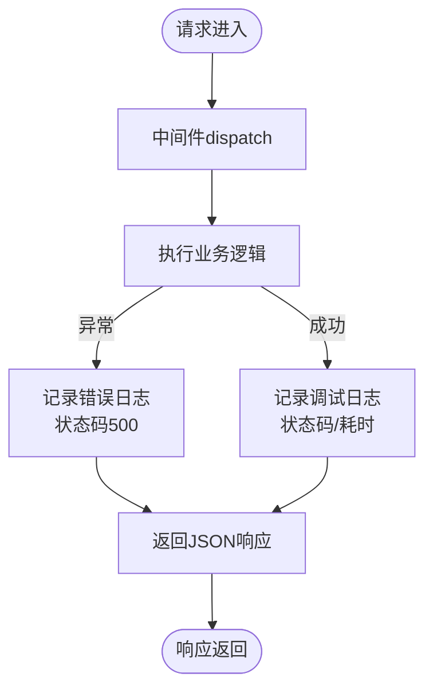
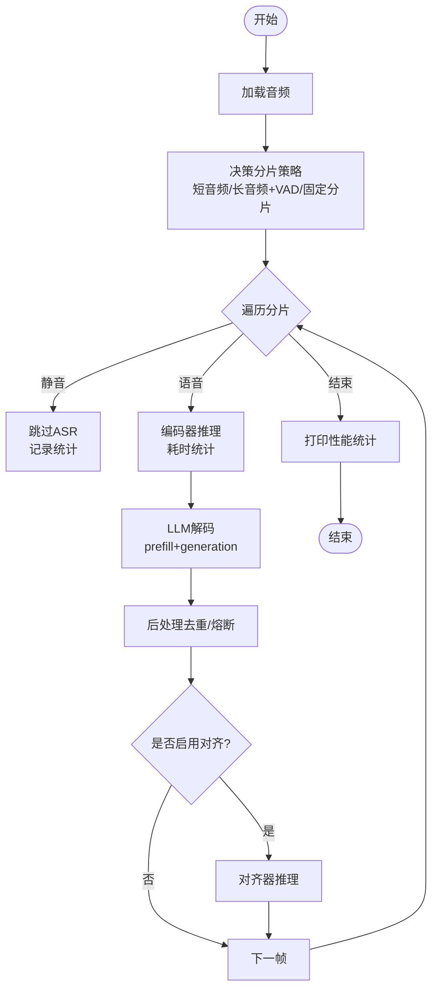
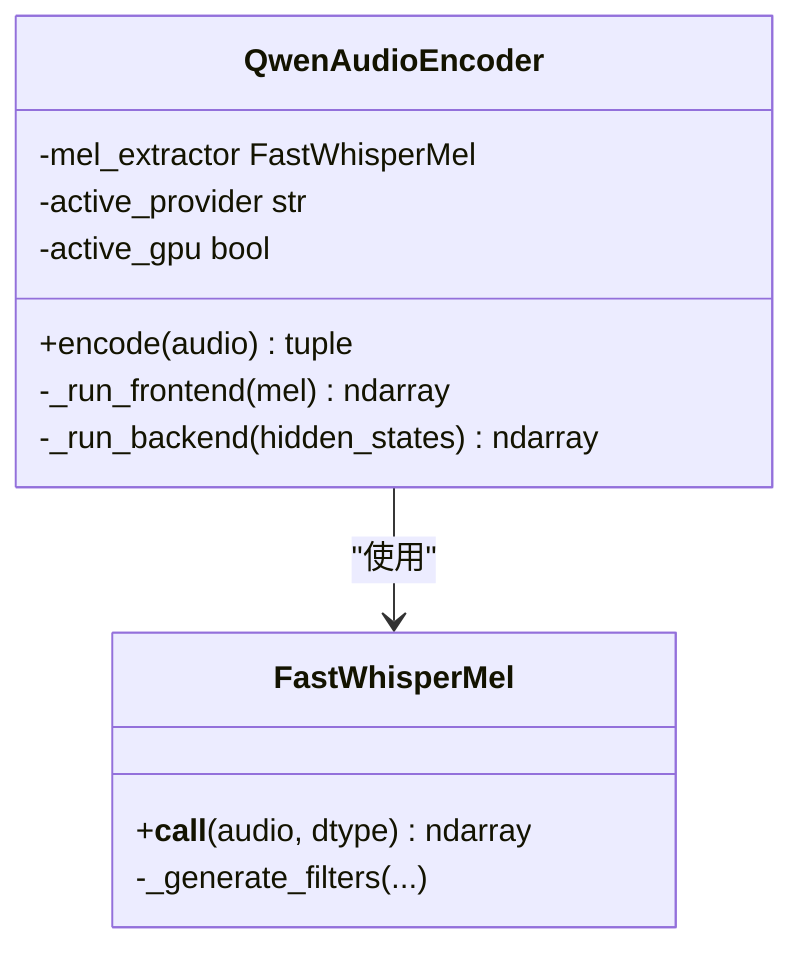
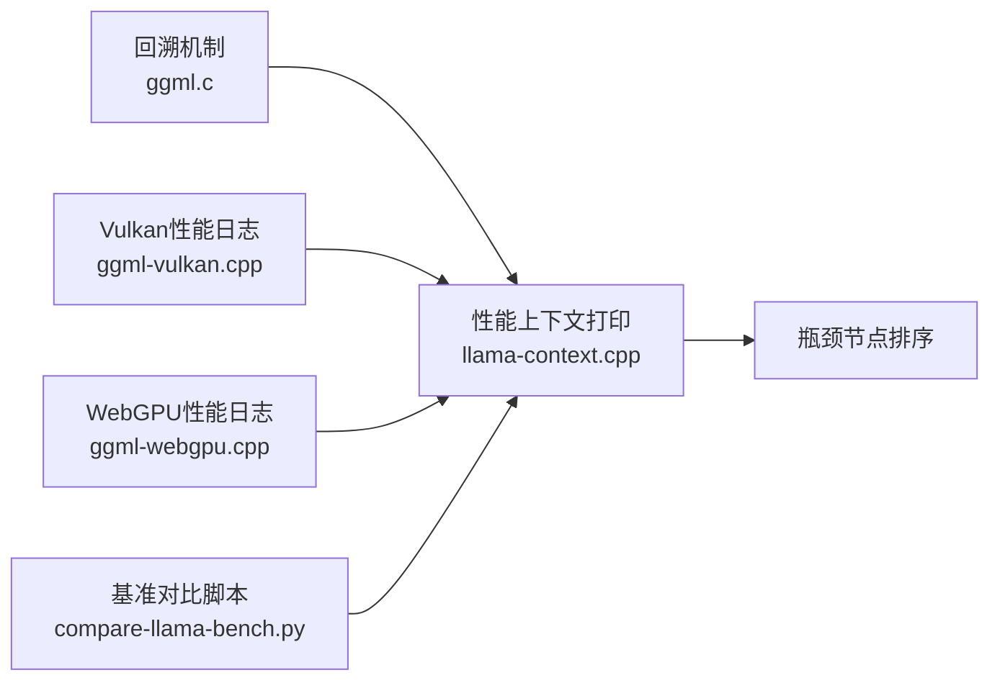
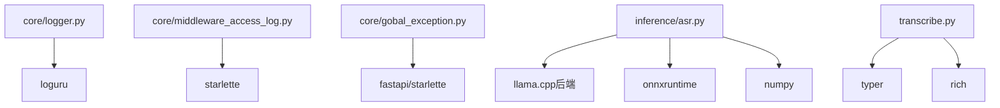

# 调试与性能分析

<cite>
**本文引用的文件**
- [core/logger.py](file://core/logger.py)
- [core/middleware_access_log.py](file://core/middleware_access_log.py)
- [core/gobal_exception.py](file://core/gobal_exception.py)
- [transcribe.py](file://transcribe.py)
- [qwen_asr_gguf/inference/asr.py](file://qwen_asr_gguf/inference/asr.py)
- [qwen_asr_gguf/inference/audio.py](file://qwen_asr_gguf/inference/audio.py)
- [qwen_asr_gguf/inference/utils.py](file://qwen_asr_gguf/inference/utils.py)
- [qwen_asr_gguf/inference/schema.py](file://qwen_asr_gguf/inference/schema.py)
- [qwen_asr_gguf/inference/encoder.py](file://qwen_asr_gguf/inference/encoder.py)
- [examples/example_qwen3_asr_transformers.py](file://examples/example_qwen3_asr_transformers.py)
- [ref/llama.cpp/src/llama-context.cpp](file://ref/llama.cpp/src/llama-context.cpp)
- [ref/llama.cpp/ggml/src/ggml.c](file://ref/llama.cpp/ggml/src/ggml.c)
- [ref/llama.cpp/ggml/src/ggml-vulkan/ggml-vulkan.cpp](file://ref/llama.cpp/ggml/src/ggml-vulkan/ggml-vulkan.cpp)
- [ref/llama.cpp/ggml/src/ggml-webgpu/ggml-webgpu.cpp](file://ref/llama.cpp/ggml/src/ggml-webgpu/ggml-webgpu.cpp)
- [ref/llama.cpp/scripts/compare-llama-bench.py](file://ref/llama.cpp/scripts/compare-llama-bench.py)
- [uv.lock](file://uv.lock)
</cite>

## 目录
1. [简介](#简介)
2. [项目结构](#项目结构)
3. [核心组件](#核心组件)
4. [架构总览](#架构总览)
5. [详细组件分析](#详细组件分析)
6. [依赖分析](#依赖分析)
7. [性能考量](#性能考量)
8. [故障排查指南](#故障排查指南)
9. [结论](#结论)
10. [附录](#附录)

## 简介
本指南面向Qwen3-ASR GGUF项目，聚焦“调试与性能分析”。内容涵盖：
- 调试工具与方法：Python调试器、日志分析、错误追踪
- 日志系统架构与日志级别配置
- 性能分析：内存使用、CPU性能、I/O瓶颈识别
- 热点函数定位与内存泄漏检测思路
- 常见性能问题诊断与优化策略
- 生产环境监控与告警配置建议
- 分布式追踪与链路分析思路
- 调试技巧与最佳实践

## 项目结构
该项目采用模块化组织，核心路径如下：
- 核心日志与中间件：core/logger.py、core/middleware_access_log.py、core/gobal_exception.py
- 命令行入口与转录流程：transcribe.py
- 推理引擎与音频处理：qwen_asr_gguf/inference/asr.py、qwen_asr_gguf/inference/audio.py、qwen_asr_gguf/inference/encoder.py、qwen_asr_gguf/inference/utils.py、qwen_asr_gguf/inference/schema.py
- 示例与参考实现：examples/example_qwen3_asr_transformers.py
- 参考性能与调试能力（llama.cpp）：src/llama-context.cpp、ggml/src/ggml.c、ggml-vulkan/ggml-vulkan.cpp、ggml-webgpu/ggml-webgpu.cpp、scripts/compare-llama-bench.py
- 依赖与第三方库：uv.lock

**图表来源**
- [transcribe.py:1-205](file://transcribe.py#L1-L205)
- [qwen_asr_gguf/inference/asr.py:1-800](file://qwen_asr_gguf/inference/asr.py#L1-L800)
- [qwen_asr_gguf/inference/audio.py:1-149](file://qwen_asr_gguf/inference/audio.py#L1-L149)
- [qwen_asr_gguf/inference/encoder.py:1-280](file://qwen_asr_gguf/inference/encoder.py#L1-L280)
- [qwen_asr_gguf/inference/utils.py:1-134](file://qwen_asr_gguf/inference/utils.py#L1-L134)
- [qwen_asr_gguf/inference/schema.py:1-235](file://qwen_asr_gguf/inference/schema.py#L1-L235)
- [core/logger.py:1-73](file://core/logger.py#L1-L73)
- [core/middleware_access_log.py:1-39](file://core/middleware_access_log.py#L1-L39)
- [core/gobal_exception.py:1-40](file://core/gobal_exception.py#L1-L40)
- [ref/llama.cpp/scripts/compare-llama-bench.py:781-862](file://ref/llama.cpp/scripts/compare-llama-bench.py#L781-L862)
- [ref/llama.cpp/src/llama-context.cpp:1244-3705](file://ref/llama.cpp/src/llama-context.cpp#L1244-L3705)
- [ref/llama.cpp/ggml/src/ggml.c:142-226](file://ref/llama.cpp/ggml/src/ggml.c#L142-L226)
- [ref/llama.cpp/ggml/src/ggml-vulkan/ggml-vulkan.cpp:1571-1653](file://ref/llama.cpp/ggml/src/ggml-vulkan/ggml-vulkan.cpp#L1571-L1653)
- [ref/llama.cpp/ggml/src/ggml-webgpu/ggml-webgpu.cpp:45-64](file://ref/llama.cpp/ggml/src/ggml-webgpu/ggml-webgpu.cpp#L45-L64)

**章节来源**
- [transcribe.py:1-205](file://transcribe.py#L1-L205)
- [qwen_asr_gguf/inference/asr.py:1-800](file://qwen_asr_gguf/inference/asr.py#L1-L800)
- [qwen_asr_gguf/inference/audio.py:1-149](file://qwen_asr_gguf/inference/audio.py#L1-L149)
- [qwen_asr_gguf/inference/encoder.py:1-280](file://qwen_asr_gguf/inference/encoder.py#L1-L280)
- [qwen_asr_gguf/inference/utils.py:1-134](file://qwen_asr_gguf/inference/utils.py#L1-L134)
- [qwen_asr_gguf/inference/schema.py:1-235](file://qwen_asr_gguf/inference/schema.py#L1-L235)
- [core/logger.py:1-73](file://core/logger.py#L1-L73)
- [core/middleware_access_log.py:1-39](file://core/middleware_access_log.py#L1-L39)
- [core/gobal_exception.py:1-40](file://core/gobal_exception.py#L1-L40)

## 核心组件
- 日志系统：基于loguru，按环境变量控制级别，输出到控制台、应用日志、错误日志、开发环境调试日志，并自动注入请求ID。
- 访问日志中间件：记录请求耗时、状态码、客户端IP，异常时统一记录。
- 全局异常处理：捕获HTTP异常、参数校验失败、断言失败与通用异常，统一返回结构化响应并记录日志。
- 推理引擎：封装音频加载、VAD动态分片、编码器、LLM解码、对齐器、统计打印与生命周期管理。
- 音频处理：支持多种格式，优先soundfile，否则回退ffmpeg；提供重采样与切片。
- 编码器：Split Frontend/Backend ONNX推理，支持GPU/CPU Provider自动选择与预热。
- 命令行工具：提供模型精度、硬件加速、分片与性能参数配置，打印初始化耗时与建议。

**章节来源**
- [core/logger.py:1-73](file://core/logger.py#L1-L73)
- [core/middleware_access_log.py:1-39](file://core/middleware_access_log.py#L1-L39)
- [core/gobal_exception.py:1-40](file://core/gobal_exception.py#L1-L40)
- [qwen_asr_gguf/inference/asr.py:1-800](file://qwen_asr_gguf/inference/asr.py#L1-L800)
- [qwen_asr_gguf/inference/audio.py:1-149](file://qwen_asr_gguf/inference/audio.py#L1-L149)
- [qwen_asr_gguf/inference/encoder.py:1-280](file://qwen_asr_gguf/inference/encoder.py#L1-L280)
- [transcribe.py:1-205](file://transcribe.py#L1-L205)

## 架构总览
整体流程从命令行入口开始，加载配置与模型，执行音频转录，期间通过日志与中间件记录访问与异常，推理引擎内部完成VAD、编码、解码与对齐，最终输出文本与可选的时间戳。

**图表来源**
- [transcribe.py:68-200](file://transcribe.py#L68-L200)
- [qwen_asr_gguf/inference/asr.py:432-596](file://qwen_asr_gguf/inference/asr.py#L432-L596)
- [qwen_asr_gguf/inference/audio.py:129-149](file://qwen_asr_gguf/inference/audio.py#L129-L149)
- [qwen_asr_gguf/inference/encoder.py:260-280](file://qwen_asr_gguf/inference/encoder.py#L260-L280)
- [qwen_asr_gguf/inference/schema.py:162-235](file://qwen_asr_gguf/inference/schema.py#L162-L235)

## 详细组件分析

### 日志系统与中间件
- 环境变量控制：ENVIRONMENT=production或development，生产环境控制台仅输出WARNING及以上，开发环境DEBUG及以上。
- 多通道输出：控制台、应用日志、错误日志、开发调试日志，均包含时间、级别、请求ID与消息。
- 访问日志中间件：记录请求耗时、状态码、客户端IP；异常时记录500与耗时。
- 全局异常处理：HTTP异常、参数校验失败、断言失败、通用异常，统一JSON响应与日志记录。

**图表来源**
- [core/middleware_access_log.py:11-38](file://core/middleware_access_log.py#L11-L38)
- [core/gobal_exception.py:12-37](file://core/gobal_exception.py#L12-L37)
- [core/logger.py:14-63](file://core/logger.py#L14-L63)

**章节来源**
- [core/logger.py:1-73](file://core/logger.py#L1-L73)
- [core/middleware_access_log.py:1-39](file://core/middleware_access_log.py#L1-L39)
- [core/gobal_exception.py:1-40](file://core/gobal_exception.py#L1-L40)

### 推理引擎与性能统计
- 统一流水线：_asr_core生成器，支持一次性与流式两种模式；VAD动态分片与固定分片双策略。
- 性能统计：prefill/decode/encode/align/vad耗时、token数、RTF、VAD跳过的分片数。
- 抗幻觉：token级与短语级重复熔断、max_new_tokens上限、记忆窗口限制。
- 生命周期：延迟加载VAD、shutdown释放资源、verbose模式打印统计。

**图表来源**
- [qwen_asr_gguf/inference/asr.py:602-774](file://qwen_asr_gguf/inference/asr.py#L602-L774)
- [qwen_asr_gguf/inference/asr.py:351-388](file://qwen_asr_gguf/inference/asr.py#L351-L388)

**章节来源**
- [qwen_asr_gguf/inference/asr.py:40-142](file://qwen_asr_gguf/inference/asr.py#L40-L142)
- [qwen_asr_gguf/inference/asr.py:351-388](file://qwen_asr_gguf/inference/asr.py#L351-L388)
- [qwen_asr_gguf/inference/asr.py:602-774](file://qwen_asr_gguf/inference/asr.py#L602-L774)

### 音频处理与编码器
- 音频加载：优先soundfile，否则ffmpeg；支持切片与重采样；错误时抛出异常。
- 编码器：Split Frontend/Backend ONNX，自动选择GPU Provider（CUDA/ROCM/TensorRT/DML/CPU），预热策略区分DML与动态形状。
- 性能：记录编码耗时，动态形状减少冗余计算，固定形状时按pad_to填充。

**图表来源**
- [qwen_asr_gguf/inference/encoder.py:119-280](file://qwen_asr_gguf/inference/encoder.py#L119-L280)
- [qwen_asr_gguf/inference/encoder.py:8-108](file://qwen_asr_gguf/inference/encoder.py#L8-L108)

**章节来源**
- [qwen_asr_gguf/inference/audio.py:129-149](file://qwen_asr_gguf/inference/audio.py#L129-L149)
- [qwen_asr_gguf/inference/encoder.py:119-280](file://qwen_asr_gguf/inference/encoder.py#L119-L280)

### 命令行工具与配置
- 提供模型目录、精度、GPU/Vulkan开关、上下文、温度、分片大小、记忆窗口、verbose、覆盖输出等选项。
- 初始化阶段打印耗时，失败时给出关闭GPU/Vulkan与查看日志的建议。
- 支持批量处理与导出TXT/SRT/JSON。

**章节来源**
- [transcribe.py:68-200](file://transcribe.py#L68-L200)

### 参考：llama.cpp性能与调试能力
- 性能上下文：打印prompt/eval耗时、tokens/s、重用图数等；支持瓶颈节点排序。
- 回溯机制：跨平台打印回溯，Linux/Apple特定行为。
- Vulkan/WebGPU性能日志：记录算子耗时、FLOPS/s、总耗时。
- 基准对比：比较不同配置下的性能指标与速度提升。

**图表来源**
- [ref/llama.cpp/src/llama-context.cpp:1244-3705](file://ref/llama.cpp/src/llama-context.cpp#L1244-L3705)
- [ref/llama.cpp/ggml/src/ggml.c:142-226](file://ref/llama.cpp/ggml/src/ggml.c#L142-L226)
- [ref/llama.cpp/ggml/src/ggml-vulkan/ggml-vulkan.cpp:1571-1653](file://ref/llama.cpp/ggml/src/ggml-vulkan/ggml-vulkan.cpp#L1571-L1653)
- [ref/llama.cpp/ggml/src/ggml-webgpu/ggml-webgpu.cpp:45-64](file://ref/llama.cpp/ggml/src/ggml-webgpu/ggml-webgpu.cpp#L45-L64)
- [ref/llama.cpp/scripts/compare-llama-bench.py:818-862](file://ref/llama.cpp/scripts/compare-llama-bench.py#L818-L862)

**章节来源**
- [ref/llama.cpp/src/llama-context.cpp:1244-3705](file://ref/llama.cpp/src/llama-context.cpp#L1244-L3705)
- [ref/llama.cpp/ggml/src/ggml.c:142-226](file://ref/llama.cpp/ggml/src/ggml.c#L142-L226)
- [ref/llama.cpp/ggml/src/ggml-vulkan/ggml-vulkan.cpp:1571-1653](file://ref/llama.cpp/ggml/src/ggml-vulkan/ggml-vulkan.cpp#L1571-L1653)
- [ref/llama.cpp/ggml/src/ggml-webgpu/ggml-webgpu.cpp:45-64](file://ref/llama.cpp/ggml/src/ggml-webgpu/ggml-webgpu.cpp#L45-L64)
- [ref/llama.cpp/scripts/compare-llama-bench.py:818-862](file://ref/llama.cpp/scripts/compare-llama-bench.py#L818-L862)

## 依赖分析
- 日志系统依赖loguru，使用上下文变量注入请求ID，按环境变量动态配置输出级别与文件轮转。
- 中间件依赖Starlette BaseHTTPMiddleware，异常时记录500与耗时。
- 全局异常处理依赖FastAPI/Starlette响应与JSONResponse，统一结构化返回。
- 推理引擎依赖llama.cpp后端（通过qwen_asr_gguf.inference.llama模块）、ONNXRuntime、numpy等。
- 命令行工具依赖Typer、Rich，提供交互式配置面板与进度条。

**图表来源**
- [core/logger.py:1-73](file://core/logger.py#L1-L73)
- [core/middleware_access_log.py:1-39](file://core/middleware_access_log.py#L1-L39)
- [core/gobal_exception.py:1-40](file://core/gobal_exception.py#L1-L40)
- [qwen_asr_gguf/inference/asr.py:49-102](file://qwen_asr_gguf/inference/asr.py#L49-L102)
- [qwen_asr_gguf/inference/encoder.py:1-7](file://qwen_asr_gguf/inference/encoder.py#L1-L7)
- [transcribe.py:17-27](file://transcribe.py#L17-L27)

**章节来源**
- [core/logger.py:1-73](file://core/logger.py#L1-L73)
- [core/middleware_access_log.py:1-39](file://core/middleware_access_log.py#L1-L39)
- [core/gobal_exception.py:1-40](file://core/gobal_exception.py#L1-L40)
- [qwen_asr_gguf/inference/asr.py:49-102](file://qwen_asr_gguf/inference/asr.py#L49-L102)
- [qwen_asr_gguf/inference/encoder.py:1-7](file://qwen_asr_gguf/inference/encoder.py#L1-L7)
- [transcribe.py:17-27](file://transcribe.py#L17-L27)

## 性能考量
- 编码器性能
  - 动态形状：长音频VAD动态分片，仅编码实际语音帧，减少无效计算。
  - Provider选择：优先CUDA/ROCM/TensorRT/DML，回退CPU；DML需固定形状时预热。
  - 预热策略：固定形状模式预热pad_to秒，动态形状模式预热短音频。
- LLM解码性能
  - 预填充与生成分离计时；max_new_tokens按语音时长缩放；token级/短语级重复熔断。
  - 记忆窗口限制：避免非连续音频拼接导致的模型混乱。
- I/O与音频处理
  - 优先soundfile，否则ffmpeg；支持切片与重采样；错误快速失败。
- 参考性能工具
  - llama.cpp性能上下文打印、瓶颈节点排序、回溯机制、Vulkan/WebGPU性能日志、基准对比脚本。

**章节来源**
- [qwen_asr_gguf/inference/asr.py:602-774](file://qwen_asr_gguf/inference/asr.py#L602-L774)
- [qwen_asr_gguf/inference/encoder.py:119-280](file://qwen_asr_gguf/inference/encoder.py#L119-L280)
- [qwen_asr_gguf/inference/audio.py:129-149](file://qwen_asr_gguf/inference/audio.py#L129-L149)
- [ref/llama.cpp/src/llama-context.cpp:1244-3705](file://ref/llama.cpp/src/llama-context.cpp#L1244-L3705)
- [ref/llama.cpp/ggml/src/ggml-vulkan/ggml-vulkan.cpp:1571-1653](file://ref/llama.cpp/ggml/src/ggml-vulkan/ggml-vulkan.cpp#L1571-L1653)
- [ref/llama.cpp/ggml/src/ggml-webgpu/ggml-webgpu.cpp:45-64](file://ref/llama.cpp/ggml/src/ggml-webgpu/ggml-webgpu.cpp#L45-L64)
- [ref/llama.cpp/scripts/compare-llama-bench.py:818-862](file://ref/llama.cpp/scripts/compare-llama-bench.py#L818-L862)

## 故障排查指南
- 日志定位
  - 生产环境：关注ERROR与应用日志；开发环境：关注DEBUG与应用日志。
  - 访问日志中间件：异常时记录500与耗时，便于快速定位慢请求。
  - 全局异常处理：统一返回结构化错误，便于前端与监控系统消费。
- 初始化失败
  - 命令行工具在引擎初始化失败时，建议关闭GPU/Vulkan或查看最新日志文件。
- 音频加载失败
  - ffmpeg缺失或处理失败会抛出异常；检查PATH与输入格式。
- 性能异常
  - 查看性能统计：prefill/decode/encode/align/vad耗时与RTF；结合VAD跳过的分片数评估收益。
- 回溯与调试
  - 参考llama.cpp回溯机制，跨平台打印回溯信息，辅助定位崩溃点。

**章节来源**
- [core/logger.py:14-63](file://core/logger.py#L14-L63)
- [core/middleware_access_log.py:11-38](file://core/middleware_access_log.py#L11-L38)
- [core/gobal_exception.py:12-37](file://core/gobal_exception.py#L12-L37)
- [transcribe.py:146-159](file://transcribe.py#L146-L159)
- [qwen_asr_gguf/inference/audio.py:88-125](file://qwen_asr_gguf/inference/audio.py#L88-L125)
- [qwen_asr_gguf/inference/asr.py:351-388](file://qwen_asr_gguf/inference/asr.py#L351-L388)
- [ref/llama.cpp/ggml/src/ggml.c:142-226](file://ref/llama.cpp/ggml/src/ggml.c#L142-L226)

## 结论
本指南提供了Qwen3-ASR GGUF项目的调试与性能分析方法论：以日志系统为核心观测入口，结合中间件与全局异常处理形成闭环；以推理引擎的性能统计为依据，配合编码器与LLM解码的优化策略，实现端到端的可观测与可优化；参考llama.cpp的性能与调试能力，构建生产级的性能分析与问题定位体系。

## 附录
- 生产环境监控与告警建议
  - 日志采集：集中化收集应用日志与错误日志，按级别与请求ID聚合。
  - 指标上报：RTF、prefill/decode/encode/align/vad耗时、VAD跳过的分片数、token/s。
  - 告警规则：RTF异常升高、decode耗时突增、VAD跳过比例异常、ERROR日志峰值。
  - 追踪关联：请求ID贯穿日志、中间件、异常处理器，便于链路回溯。
- 分布式追踪与链路分析
  - 在中间件与异常处理器中注入trace_id/request_id，串联请求生命周期。
  - 结合Sentry等平台（仓库包含sentry-sdk依赖）进行错误与性能聚合。
- 调试技巧与最佳实践
  - 开发环境开启DEBUG日志，生产环境仅保留ERROR与应用日志。
  - 使用命令行工具的verbose与初始化耗时，快速定位初始化瓶颈。
  - 长音频优先启用VAD动态分片，短音频可考虑固定分片以简化流程。
  - 编码器GPU Provider优先级与预热策略需结合硬件与模型形状选择。

**章节来源**
- [core/logger.py:14-63](file://core/logger.py#L14-L63)
- [core/middleware_access_log.py:11-38](file://core/middleware_access_log.py#L11-L38)
- [core/gobal_exception.py:12-37](file://core/gobal_exception.py#L12-L37)
- [transcribe.py:146-159](file://transcribe.py#L146-L159)
- [qwen_asr_gguf/inference/asr.py:602-774](file://qwen_asr_gguf/inference/asr.py#L602-L774)
- [uv.lock:2245-2265](file://uv.lock#L2245-L2265)