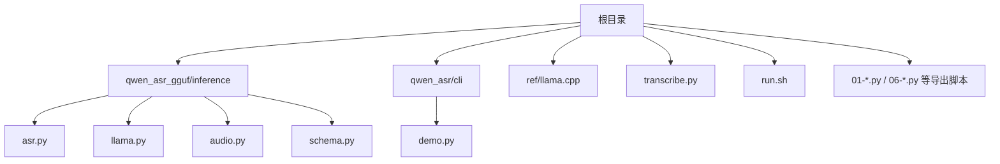
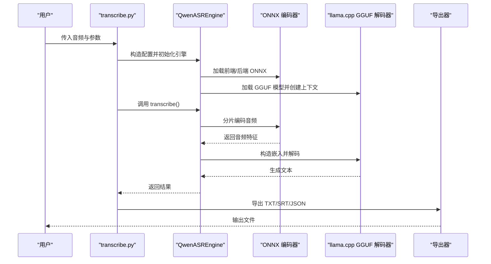
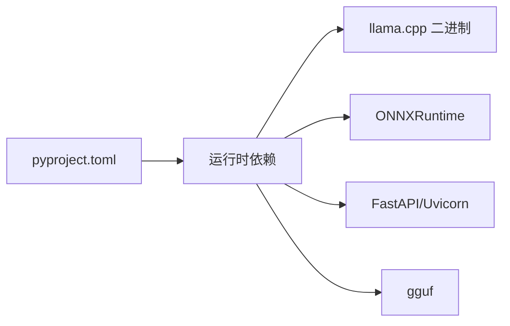

# 快速开始

<cite>
**本文引用的文件**
- [README.md](file://README.md)
- [pyproject.toml](file://pyproject.toml)
- [transcribe.py](file://transcribe.py)
- [run.sh](file://run.sh)
- [export_config.py](file://export_config.py)
- [01-Export-ASR-Encoder-Frontend.py](file://01-Export-ASR-Encoder-Frontend.py)
- [06-Convert-ASR-Decoder-GGUF.py](file://06-Convert-ASR-Decoder-GGUF.py)
- [qwen_asr_gguf/inference/asr.py](file://qwen_asr_gguf/inference/asr.py)
- [qwen_asr_gguf/inference/llama.py](file://qwen_asr_gguf/inference/llama.py)
- [qwen_asr_gguf/inference/audio.py](file://qwen_asr_gguf/inference/audio.py)
- [qwen_asr_gguf/inference/schema.py](file://qwen_asr_gguf/inference/schema.py)
- [qwen_asr/cli/demo.py](file://qwen_asr/cli/demo.py)
</cite>

## 目录
1. [简介](#简介)
2. [项目结构](#项目结构)
3. [核心组件](#核心组件)
4. [架构总览](#架构总览)
5. [详细组件分析](#详细组件分析)
6. [依赖关系分析](#依赖关系分析)
7. [性能考虑](#性能考虑)
8. [故障排查指南](#故障排查指南)
9. [结论](#结论)
10. [附录](#附录)

## 简介
本指南面向新手用户，帮助你在30分钟内完成 Qwen3-ASR GGUF 项目的环境搭建、模型准备与首次转录测试。你将学会：
- 安装 Python 与依赖（uv 同步）
- 下载并放置 llama.cpp 二进制文件
- 获取官方预编译模型或手动导出模型
- 使用命令行工具进行转录与验证
- 在 Windows/Linux 平台上完成常见问题排查

## 项目结构
该项目采用“Python 应用 + GGUF 推理引擎 + ONNX 编码器”的混合架构，核心目录与文件如下：
- 根目录包含命令行工具、Web 服务脚本、模型导出脚本与推理核心
- qwen_asr_gguf/inference 提供 ASR 引擎、llama.cpp 绑定、音频处理与导出工具
- qwen_asr/cli 提供 Gradio 演示入口
- 参考 llama.cpp 仓库位于 ref/llama.cpp，用于下载二进制与构建参考

图表来源
- [README.md](file://README.md)
- [transcribe.py](file://transcribe.py)
- [run.sh](file://run.sh)
- [qwen_asr_gguf/inference/asr.py](file://qwen_asr_gguf/inference/asr.py)
- [qwen_asr_gguf/inference/llama.py](file://qwen_asr_gguf/inference/llama.py)
- [qwen_asr_gguf/inference/audio.py](file://qwen_asr_gguf/inference/audio.py)
- [qwen_asr_gguf/inference/schema.py](file://qwen_asr_gguf/inference/schema.py)
- [qwen_asr/cli/demo.py](file://qwen_asr/cli/demo.py)

章节来源
- [README.md](file://README.md)
- [transcribe.py](file://transcribe.py)
- [run.sh](file://run.sh)

## 核心组件
- 命令行工具：提供丰富的参数控制，支持 GPU/Vulkan 选择、上下文窗口、分片大小、温度、上下文提示等
- ASR 引擎：封装 ONNX 编码器、GGUF 解码器（llama.cpp）、VAD、对齐器与流式/一次性转录
- llama.cpp 绑定：动态加载各平台二进制，提供模型/上下文/批处理/采样器等封装
- 音频处理：统一加载与重采样，兼容多种格式
- 导出脚本：将 HuggingFace 权重转换为 ONNX/FP16/GGUF，并支持量化

章节来源
- [transcribe.py](file://transcribe.py)
- [qwen_asr_gguf/inference/asr.py](file://qwen_asr_gguf/inference/asr.py)
- [qwen_asr_gguf/inference/llama.py](file://qwen_asr_gguf/inference/llama.py)
- [qwen_asr_gguf/inference/audio.py](file://qwen_asr_gguf/inference/audio.py)
- [qwen_asr_gguf/inference/schema.py](file://qwen_asr_gguf/inference/schema.py)

## 架构总览
整体工作流：命令行工具接收参数，初始化 ASR 引擎，加载 ONNX 编码器与 GGUF 解码器，按分片处理音频，必要时进行 VAD 跳过静音，最后导出文本/字幕/时间戳。

图表来源
- [transcribe.py](file://transcribe.py)
- [qwen_asr_gguf/inference/asr.py](file://qwen_asr_gguf/inference/asr.py)
- [qwen_asr_gguf/inference/llama.py](file://qwen_asr_gguf/inference/llama.py)
- [qwen_asr_gguf/inference/audio.py](file://qwen_asr_gguf/inference/audio.py)

## 详细组件分析

### 环境准备与依赖安装
- Python 版本要求：项目要求 Python 3.11+
- 依赖安装：使用 uv 同步 extras，按平台选择 cu128（CUDA）、win（DirectML）或 cpu（CPU）
- 可选依赖：transformers、modelscope、accelerate、fireredvad 等

步骤要点
- 使用 uv 同步命令安装依赖（包含 extras）
- 如需生产环境，使用 run.sh 启动服务
- 如需开发环境，设置环境变量后运行 infer.py

章节来源
- [pyproject.toml](file://pyproject.toml)
- [README.md](file://README.md)
- [run.sh](file://run.sh)

### llama.cpp 二进制文件下载与配置
- 从 llama.cpp Releases 下载对应平台的预编译二进制
- 将动态库文件放入 qwen_asr_gguf/inference/bin 目录
- Windows 使用 Vulkan 版本，Linux 使用 Ubuntu Vulkan 版本

章节来源
- [README.md](file://README.md)

### 模型下载与安装
- 方案一：下载官方预编译模型压缩包，解压到 models 目录
- 方案二：手动导出（下载 HuggingFace 模型，配置 export_config.py，依次运行导出脚本）

手动导出流程（按顺序执行）
- 导出 ASR 编码器前端（ONNX）
- 导出 ASR 编码器后端（ONNX）
- 优化与量化（FP16/INT8/INT4）
- 导出 ASR 解码器权重（HF）
- 转换为 GGUF（FP16）
- GGUF 二次量化（Q4_K）
- 对齐器同流程（ASR 流程前半段 + Aligner 流程后半段）

章节来源
- [README.md](file://README.md)
- [export_config.py](file://export_config.py)
- [01-Export-ASR-Encoder-Frontend.py](file://01-Export-ASR-Encoder-Frontend.py)
- [06-Convert-ASR-Decoder-GGUF.py](file://06-Convert-ASR-Decoder-GGUF.py)

### 安装验证与首次转录
- 使用命令行工具进行转录
- 基本用法：uv run transcribe.py test.mp3
- 常用参数：禁用 GPU、设置上下文窗口、温度、分片大小、是否启用对齐等
- 输出文件：TXT、SRT、JSON（启用对齐时）

章节来源
- [README.md](file://README.md)
- [transcribe.py](file://transcribe.py)

### Web 服务与演示
- 使用 run.sh 启动 FastAPI 服务
- 可选：使用 Gradio 演示（qwen_asr/cli/demo.py），支持 Transformers 与 vLLM 后端

章节来源
- [run.sh](file://run.sh)
- [qwen_asr/cli/demo.py](file://qwen_asr/cli/demo.py)

## 依赖关系分析
- Python 与包管理：pyproject.toml 定义了项目依赖与 extras（cu128/win/cpu），并配置镜像源
- 运行时依赖：FastAPI、Uvicorn、ONNXRuntime（GPU/CPU/DirectML）、gguf、librosa、soundfile 等
- llama.cpp：通过 ctypes 动态绑定各平台二进制，提供模型加载、上下文、批处理与采样器

图表来源
- [pyproject.toml](file://pyproject.toml)
- [qwen_asr_gguf/inference/llama.py](file://qwen_asr_gguf/inference/llama.py)

章节来源
- [pyproject.toml](file://pyproject.toml)
- [qwen_asr_gguf/inference/llama.py](file://qwen_asr_gguf/inference/llama.py)

## 性能考虑
- 编码器量化：int4 量化在数值相似度与体积上取得良好平衡
- 解码器量化：q4_k 量化对困惑度影响较小
- VAD：长音频自动启用 VAD，跳过静音分片，显著降低 RTF
- 分片策略：短音频单片处理，长音频自适应分片，避免非连续音频拼接导致的模型混乱
- 上下文窗口：合理设置 n_ctx，避免越界导致崩溃

章节来源
- [README.md](file://README.md)
- [qwen_asr_gguf/inference/asr.py](file://qwen_asr_gguf/inference/asr.py)
- [qwen_asr_gguf/inference/schema.py](file://qwen_asr_gguf/inference/schema.py)

## 故障排查指南
常见问题与解决思路
- 输出乱码或“!!!!”
  - Intel 集显的 FP16 计算可能溢出，设置环境变量禁用
- 模型文件缺失
  - 使用命令行工具检查模型文件，确保解压到正确目录
- 引擎初始化失败
  - 关闭 GPU/Vulkan，或查看日志文件定位问题
- ffmpeg 未安装
  - 安装 ffmpeg 并加入 PATH，或改用 soundfile 支持的格式
- Windows DirectML 形状固定优化
  - 需要固定形状推理，避免频繁显存分配导致性能抖动

章节来源
- [README.md](file://README.md)
- [transcribe.py](file://transcribe.py)
- [qwen_asr_gguf/inference/audio.py](file://qwen_asr_gguf/inference/audio.py)
- [qwen_asr_gguf/inference/llama.py](file://qwen_asr_gguf/inference/llama.py)

## 结论
通过本指南，你可以在30分钟内完成环境准备、模型获取与首次转录验证。建议优先使用官方预编译模型以缩短上手时间；如需定制精度或平台，可参考手动导出脚本逐步完成。遇到问题时，优先尝试关闭 GPU/Vulkan、检查模型文件与 ffmpeg 安装状态。

## 附录

### 快速清单（Windows/Linux）
- 安装 Python 3.11+ 与 uv
- 执行 uv 同步（按平台选择 extras）
- 下载 llama.cpp 二进制并放入 qwen_asr_gguf/inference/bin
- 下载官方模型压缩包并解压到 models 目录
- 使用 uv run transcribe.py test.mp3 完成首次转录
- 如需服务化，使用 bash run.sh start 启动 Web 服务

章节来源
- [README.md](file://README.md)
- [pyproject.toml](file://pyproject.toml)
- [transcribe.py](file://transcribe.py)
- [run.sh](file://run.sh)