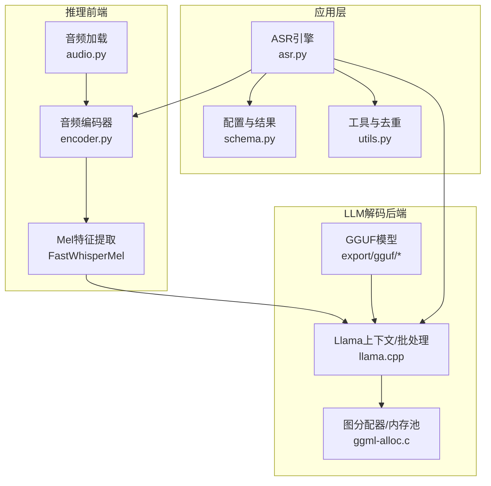
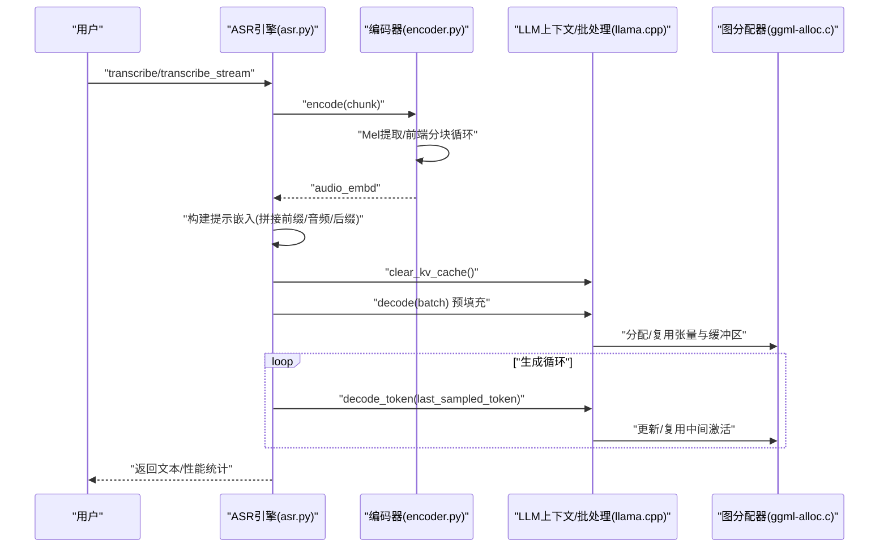
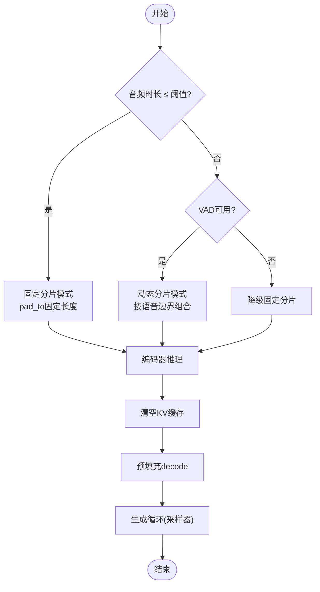
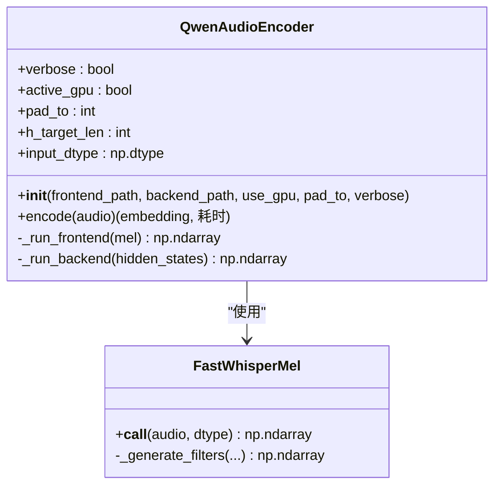
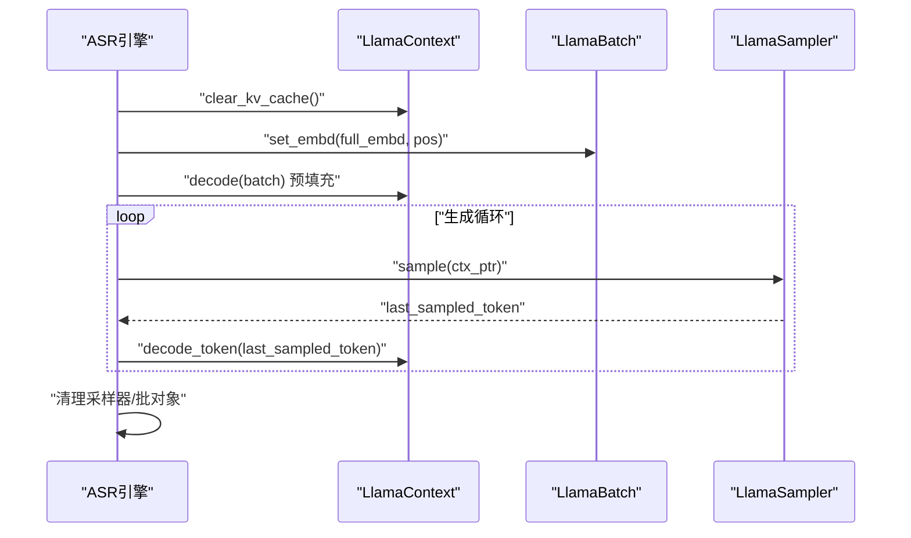
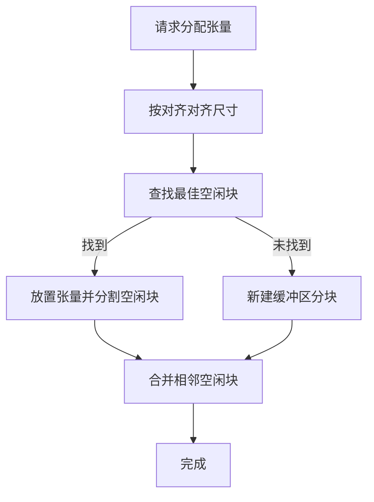
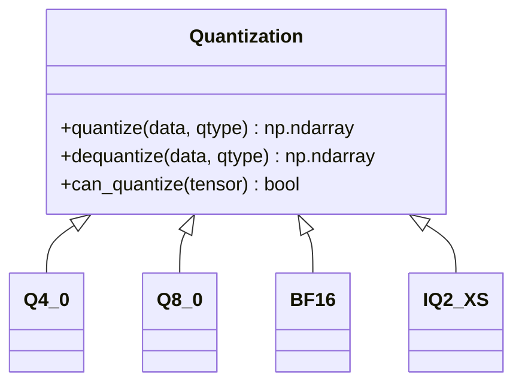
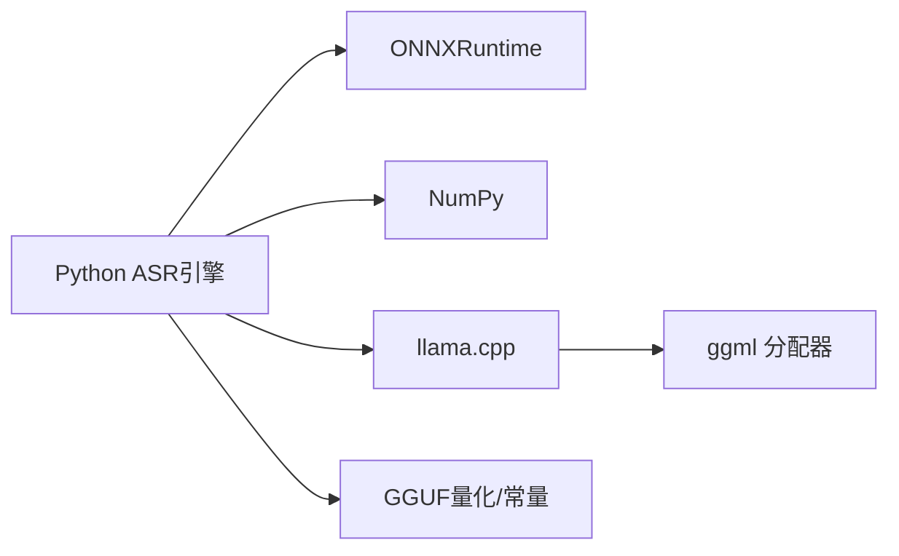

# 内存管理优化

<cite>
**本文引用的文件**
- [qwen_asr_gguf/inference/asr.py](file://qwen_asr_gguf/inference/asr.py)
- [qwen_asr_gguf/inference/encoder.py](file://qwen_asr_gguf/inference/encoder.py)
- [qwen_asr_gguf/inference/audio.py](file://qwen_asr_gguf/inference/audio.py)
- [qwen_asr_gguf/inference/utils.py](file://qwen_asr_gguf/inference/utils.py)
- [qwen_asr_gguf/inference/schema.py](file://qwen_asr_gguf/inference/schema.py)
- [qwen_asr_gguf/export/gguf/quants.py](file://qwen_asr_gguf/export/gguf/quants.py)
- [qwen_asr_gguf/export/gguf/constants.py](file://qwen_asr_gguf/export/gguf/constants.py)
- [ref/llama.cpp/src/llama.cpp](file://ref/llama.cpp/src/llama.cpp)
- [ref/llama.cpp/ggml/src/ggml-alloc.c](file://ref/llama.cpp/ggml/src/ggml-alloc.c)
- [ref/llama.cpp/ggml/include/ggml-alloc.h](file://ref/llama.cpp/ggml/include/ggml-alloc.h)
</cite>

## 目录
1. [引言](#引言)
2. [项目结构](#项目结构)
3. [核心组件](#核心组件)
4. [架构总览](#架构总览)
5. [详细组件分析](#详细组件分析)
6. [依赖关系分析](#依赖关系分析)
7. [性能考量](#性能考量)
8. [故障排查指南](#故障排查指南)
9. [结论](#结论)
10. [附录](#附录)

## 引言
本指南聚焦于 Qwen3-ASR 的内存管理优化，结合 Python 推理管线与 llama.cpp 后端，系统阐述模型权重与激活值的内存布局、KV 缓存与上下文窗口的内存约束、量化格式对内存占用的影响、以及内存池化、动态分配与碎片化治理策略。文档同时提供内存泄漏检测与预防建议、监控与性能分析方法，并给出可落地的优化案例。

## 项目结构
该项目采用“前端特征提取 + LLM 解码”的双阶段架构，其中：
- 前端（音频编码器）负责将波形转换为声学嵌入，支持 ONNX 推理与 GPU/CPU Provider 切换。
- LLM 解码器基于 GGUF 模型与 llama.cpp 后端，提供上下文窗口控制、批处理与采样器管理。
- 推理引擎整合 VAD、分片策略、上下文记忆与对齐模块，形成端到端的转录流水线。

图表来源
- [qwen_asr_gguf/inference/audio.py:129-149](file://qwen_asr_gguf/inference/audio.py#L129-L149)
- [qwen_asr_gguf/inference/encoder.py:119-280](file://qwen_asr_gguf/inference/encoder.py#L119-L280)
- [qwen_asr_gguf/inference/asr.py:40-103](file://qwen_asr_gguf/inference/asr.py#L40-L103)
- [ref/llama.cpp/src/llama.cpp:1-143](file://ref/llama.cpp/src/llama.cpp#L1-L143)
- [ref/llama.cpp/ggml/src/ggml-alloc.c:501-583](file://ref/llama.cpp/ggml/src/ggml-alloc.c#L501-L583)

章节来源
- [qwen_asr_gguf/inference/asr.py:40-103](file://qwen_asr_gguf/inference/asr.py#L40-L103)
- [qwen_asr_gguf/inference/encoder.py:119-280](file://qwen_asr_gguf/inference/encoder.py#L119-L280)
- [qwen_asr_gguf/inference/audio.py:129-149](file://qwen_asr_gguf/inference/audio.py#L129-L149)
- [qwen_asr_gguf/inference/schema.py:162-210](file://qwen_asr_gguf/inference/schema.py#L162-L210)
- [ref/llama.cpp/src/llama.cpp:1-143](file://ref/llama.cpp/src/llama.cpp#L1-L143)
- [ref/llama.cpp/ggml/src/ggml-alloc.c:501-583](file://ref/llama.cpp/ggml/src/ggml-alloc.c#L501-L583)

## 核心组件
- ASR 引擎：负责分片策略、VAD 集成、上下文记忆、提示构建与解码循环，提供一次性与流式两种入口。
- 音频编码器：拆分前端与后端，前端按 100 帧分块循环推理，后端按需填充注意力掩码，支持固定形状与动态形状模式。
- LLM 上下文与批处理：通过 LlamaContext/LlamaBatch 管理 KV 缓存、位置编码与采样器，受 n_ctx 严格约束。
- 图分配器与内存池：基于 ggml 的动态张量分配器，支持多缓冲区、最佳适配与碎片合并，避免频繁重分配。
- 量化系统：GGUF 量化常量与多种量化类型实现，覆盖 FP32/FP16/BF16、Q 系列、IQ 系列与自定义格式，显著降低权重与激活内存占用。

章节来源
- [qwen_asr_gguf/inference/asr.py:40-103](file://qwen_asr_gguf/inference/asr.py#L40-L103)
- [qwen_asr_gguf/inference/encoder.py:119-280](file://qwen_asr_gguf/inference/encoder.py#L119-L280)
- [ref/llama.cpp/ggml/src/ggml-alloc.c:124-181](file://ref/llama.cpp/ggml/src/ggml-alloc.c#L124-L181)
- [qwen_asr_gguf/export/gguf/quants.py:14-76](file://qwen_asr_gguf/export/gguf/quants.py#L14-L76)

## 架构总览
下图展示从音频到转录结果的关键内存路径：音频读取与重采样、Mel 特征提取、编码器分块推理、提示拼接、LLM 预填充与生成循环、KV 缓存与采样器生命周期。

图表来源
- [qwen_asr_gguf/inference/asr.py:212-318](file://qwen_asr_gguf/inference/asr.py#L212-L318)
- [qwen_asr_gguf/inference/encoder.py:260-280](file://qwen_asr_gguf/inference/encoder.py#L260-L280)
- [ref/llama.cpp/ggml/src/ggml-alloc.c:626-692](file://ref/llama.cpp/ggml/src/ggml-alloc.c#L626-L692)

## 详细组件分析

### 组件A：ASR 引擎与分片策略
- 动态分片与固定分片：长音频启用 VAD 自适应分片，短音频或 VAD 不可用时采用固定等长分片；边界处追加 1 秒缓冲提升词边界完整性。
- 上下文记忆：使用双端队列保留最近 N 片文本作为 LLM 上下文，避免非连续音频拼接导致的模型混乱。
- 预填充与生成：预填充阶段构建完整嵌入序列，生成阶段按温度与采样器迭代，支持回滚与稳定性输出队列。
- 越界保护：在 n_ctx 临界点拦截序列长度，避免 ggml 断言触发进程崩溃。

图表来源
- [qwen_asr_gguf/inference/asr.py:602-724](file://qwen_asr_gguf/inference/asr.py#L602-L724)

章节来源
- [qwen_asr_gguf/inference/asr.py:602-724](file://qwen_asr_gguf/inference/asr.py#L602-L724)
- [qwen_asr_gguf/inference/schema.py:162-210](file://qwen_asr_gguf/inference/schema.py#L162-L210)

### 组件B：音频编码器（前端+后端）
- 前端：按 100 帧分块循环推理，拼接后按有效帧切片，避免填充帧污染输出。
- 后端：按需填充注意力掩码（DML 下固定长度），支持固定形状与动态形状模式；输入精度由前端类型决定。
- 预热：根据 Provider 与模式进行预热，减少首次推理抖动。

图表来源
- [qwen_asr_gguf/inference/encoder.py:119-280](file://qwen_asr_gguf/inference/encoder.py#L119-L280)

章节来源
- [qwen_asr_gguf/inference/encoder.py:119-280](file://qwen_asr_gguf/inference/encoder.py#L119-L280)

### 组件C：LLM 解码与 KV 缓存
- 上下文窗口 n_ctx：严格限制序列长度，超限即熔断，避免断言与崩溃。
- 批处理与位置编码：构建 LlamaBatch，设置嵌入与位置数组，预填充后进入生成循环。
- 采样器与回滚：采样器按温度采样，显示队列与回滚参数控制增量输出稳定性。
- 清理：生成结束后释放采样器与批对象，避免悬挂引用。

图表来源
- [qwen_asr_gguf/inference/asr.py:212-318](file://qwen_asr_gguf/inference/asr.py#L212-L318)

章节来源
- [qwen_asr_gguf/inference/asr.py:212-318](file://qwen_asr_gguf/inference/asr.py#L212-L318)

### 组件D：图分配器与内存池化
- 动态张量分配器：按对齐要求分配，支持多缓冲区与最佳适配；空闲块合并，避免碎片化。
- 图分配器：基于拓扑遍历，优先复用父节点输出，减少中间张量分配；支持多缓冲区与节点/叶节点缓冲区 ID。
- 缓冲区类型：按后端缓冲区类型对齐与大小限制，必要时自动扩容或报错。

图表来源
- [ref/llama.cpp/ggml/src/ggml-alloc.c:205-353](file://ref/llama.cpp/ggml/src/ggml-alloc.c#L205-L353)

章节来源
- [ref/llama.cpp/ggml/src/ggml-alloc.c:124-181](file://ref/llama.cpp/ggml/src/ggml-alloc.c#L124-L181)
- [ref/llama.cpp/ggml/src/ggml-alloc.c:501-583](file://ref/llama.cpp/ggml/src/ggml-alloc.c#L501-L583)
- [ref/llama.cpp/ggml/include/ggml-alloc.h:46-82](file://ref/llama.cpp/ggml/include/ggml-alloc.h#L46-L82)

### 组件E：量化系统与内存开销
- 量化类型与块大小：不同量化类型具有不同的块大小与类型字节数，直接影响权重存储与推理内存占用。
- 量化/反量化实现：按行分块处理，支持向量化加速与懒加载张量包装，降低内存峰值。
- GGUF 常量：包含魔数、版本、对齐、量化版本等元数据，确保跨平台一致性。

图表来源
- [qwen_asr_gguf/export/gguf/quants.py:56-76](file://qwen_asr_gguf/export/gguf/quants.py#L56-L76)
- [qwen_asr_gguf/export/gguf/quants.py:220-252](file://qwen_asr_gguf/export/gguf/quants.py#L220-L252)
- [qwen_asr_gguf/export/gguf/quants.py:378-402](file://qwen_asr_gguf/export/gguf/quants.py#L378-L402)
- [qwen_asr_gguf/export/gguf/quants.py:707-741](file://qwen_asr_gguf/export/gguf/quants.py#L707-L741)

章节来源
- [qwen_asr_gguf/export/gguf/quants.py:14-76](file://qwen_asr_gguf/export/gguf/quants.py#L14-L76)
- [qwen_asr_gguf/export/gguf/quants.py:220-252](file://qwen_asr_gguf/export/gguf/quants.py#L220-L252)
- [qwen_asr_gguf/export/gguf/quants.py:378-402](file://qwen_asr_gguf/export/gguf/quants.py#L378-L402)
- [qwen_asr_gguf/export/gguf/quants.py:707-741](file://qwen_asr_gguf/export/gguf/quants.py#L707-L741)
- [qwen_asr_gguf/export/gguf/constants.py:10-14](file://qwen_asr_gguf/export/gguf/constants.py#L10-L14)

## 依赖关系分析
- Python 层依赖：onnxruntime、numpy、soundfile/ffmpeg 用于音频读取与编码器推理。
- llama.cpp 后端：提供模型加载、上下文管理、批处理与图计算后端；与 ggml 分配器协同工作。
- 量化与 GGUF：量化实现与常量定义位于 export/gguf，供模型导出与加载使用。

图表来源
- [qwen_asr_gguf/inference/encoder.py:130-176](file://qwen_asr_gguf/inference/encoder.py#L130-L176)
- [ref/llama.cpp/src/llama.cpp:1-143](file://ref/llama.cpp/src/llama.cpp#L1-L143)
- [ref/llama.cpp/ggml/src/ggml-alloc.c:501-583](file://ref/llama.cpp/ggml/src/ggml-alloc.c#L501-L583)
- [qwen_asr_gguf/export/gguf/quants.py:56-76](file://qwen_asr_gguf/export/gguf/quants.py#L56-L76)

章节来源
- [qwen_asr_gguf/inference/encoder.py:130-176](file://qwen_asr_gguf/inference/encoder.py#L130-L176)
- [ref/llama.cpp/src/llama.cpp:1-143](file://ref/llama.cpp/src/llama.cpp#L1-L143)
- [ref/llama.cpp/ggml/src/ggml-alloc.c:501-583](file://ref/llama.cpp/ggml/src/ggml-alloc.c#L501-L583)
- [qwen_asr_gguf/export/gguf/quants.py:56-76](file://qwen_asr_gguf/export/gguf/quants.py#L56-L76)

## 性能考量
- 上下文窗口 n_ctx：n_ctx 过小影响长文本连贯性，过大增加 KV 缓存与激活内存压力；需结合硬件显存与批大小权衡。
- 批大小与批处理：批大小越大吞吐越高，但内存占用与峰值延迟上升；需在吞吐与延迟间折中。
- 量化选择：INT4/INT8 显著降低权重与激活内存，但可能引入精度损失；FP16/BF16 在精度与内存间取得平衡。
- 分片策略：动态分片减少无效静音处理，提升 RTF；固定分片简单稳定，适合短音频或 VAD 不可用场景。
- 图分配器：合理复用父节点输出、减少临时张量分配，有助于降低峰值内存与碎片化。

## 故障排查指南
- 进程崩溃（n_ctx 越界）：检查 total_len 与 n_ctx 的比较逻辑，确保在越界时熔断并返回空结果，避免断言触发。
- 内存不足：通过图分配器日志与 ggml 设备内存查询接口定位瓶颈；必要时降低 n_ctx、批大小或启用更高量化级别。
- 量化错误：确认张量维度满足量化块大小对齐要求，否则抛出 QuantError；检查量化类型与实现是否匹配。
- VAD 加载失败：延迟加载 VAD 时捕获异常并降级为固定分片；检查模型路径与依赖。

章节来源
- [qwen_asr_gguf/inference/asr.py:226-238](file://qwen_asr_gguf/inference/asr.py#L226-L238)
- [ref/llama.cpp/src/llama.cpp:52-143](file://ref/llama.cpp/src/llama.cpp#L52-L143)
- [qwen_asr_gguf/export/gguf/quants.py:16-26](file://qwen_asr_gguf/export/gguf/quants.py#L16-L26)

## 结论
Qwen3-ASR 的内存管理优化围绕“分片策略 + KV 缓存控制 + 量化 + 图分配器”展开。通过动态分片与 VAD 过滤减少无效计算，通过 n_ctx 与批大小约束激活内存，通过量化降低权重与激活内存，通过图分配器实现高效内存池化与碎片治理，可在保证精度的同时显著提升内存效率与推理稳定性。

## 附录

### 不同量化级别的内存开销对比（示例）
- FP32：每个权重/激活占用 4 字节
- FP16/BF16：每个权重/激活占用 2 字节
- INT8：每个权重/激活占用 1 字节（按块压缩）
- INT4：每个权重/激活占用 0.5 字节（按块压缩）

说明：具体内存占用取决于量化类型、块大小与对齐要求。建议在相同硬件与批大小下进行基准测试，以获得准确数值。

章节来源
- [qwen_asr_gguf/export/gguf/quants.py:14-76](file://qwen_asr_gguf/export/gguf/quants.py#L14-L76)
- [qwen_asr_gguf/export/gguf/constants.py:10-14](file://qwen_asr_gguf/export/gguf/constants.py#L10-L14)

### 内存使用监控与性能分析方法
- llama.cpp 设备内存查询：通过设备内存数据结构与内存分解接口获取模型、上下文与计算内存占用。
- ggml 分配器调试：开启调试宏查看分配/释放轨迹，定位碎片化与过度分配。
- Python 垃圾回收：定期观察对象生命周期，避免闭包持有与循环引用；在推理完成后及时 del 临时对象。

章节来源
- [ref/llama.cpp/src/llama.cpp:52-143](file://ref/llama.cpp/src/llama.cpp#L52-L143)
- [ref/llama.cpp/ggml/src/ggml-alloc.c:183-203](file://ref/llama.cpp/ggml/src/ggml-alloc.c#L183-L203)

### 实际优化案例
- 案例1：长音频转录
  - 启用动态分片与 VAD 过滤，跳过静音片段，显著降低 RTF 与 KV 缓存压力。
  - 适当降低 n_ctx 或启用更高量化级别，缓解显存不足。
- 案例2：低资源环境
  - 使用 INT8/INT4 量化与 FP16 权重，降低内存峰值；减小批大小与分片长度。
  - 启用图分配器预分配，避免运行时重分配带来的抖动。
- 案例3：稳定性优化
  - 通过回滚参数与采样器温度调节，减少重复与幻觉，提高输出稳定性；在解码循环中及时清理采样器与批对象，避免悬挂引用。

章节来源
- [qwen_asr_gguf/inference/asr.py:602-724](file://qwen_asr_gguf/inference/asr.py#L602-L724)
- [qwen_asr_gguf/inference/asr.py:212-318](file://qwen_asr_gguf/inference/asr.py#L212-L318)
- [qwen_asr_gguf/inference/utils.py:58-134](file://qwen_asr_gguf/inference/utils.py#L58-L134)