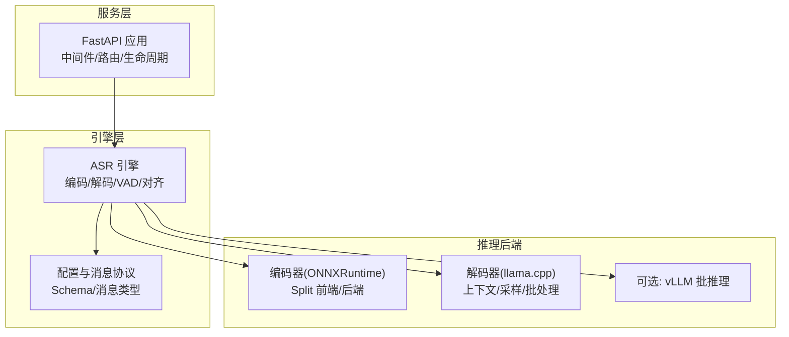
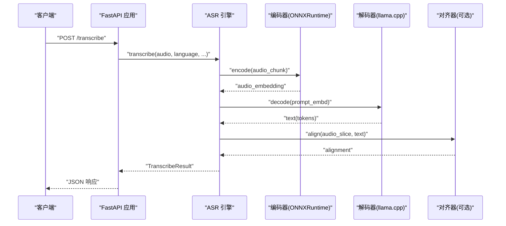
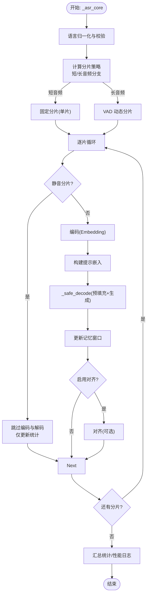
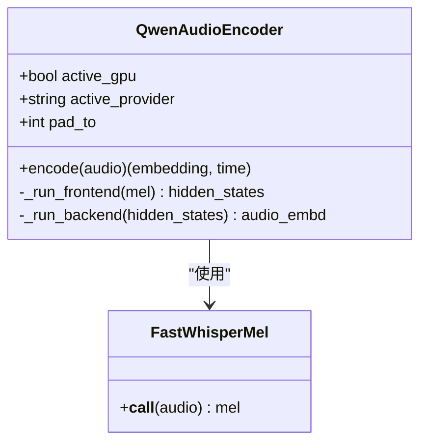
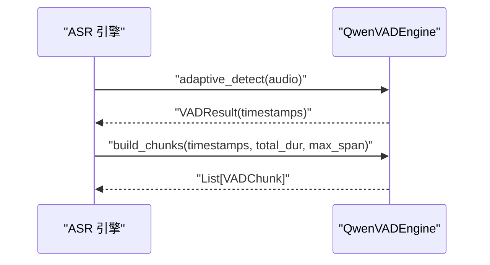
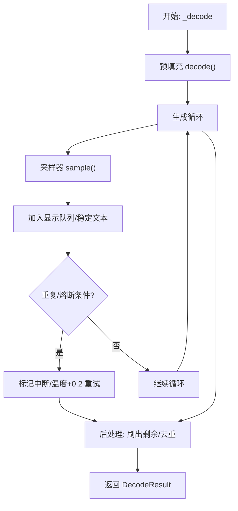
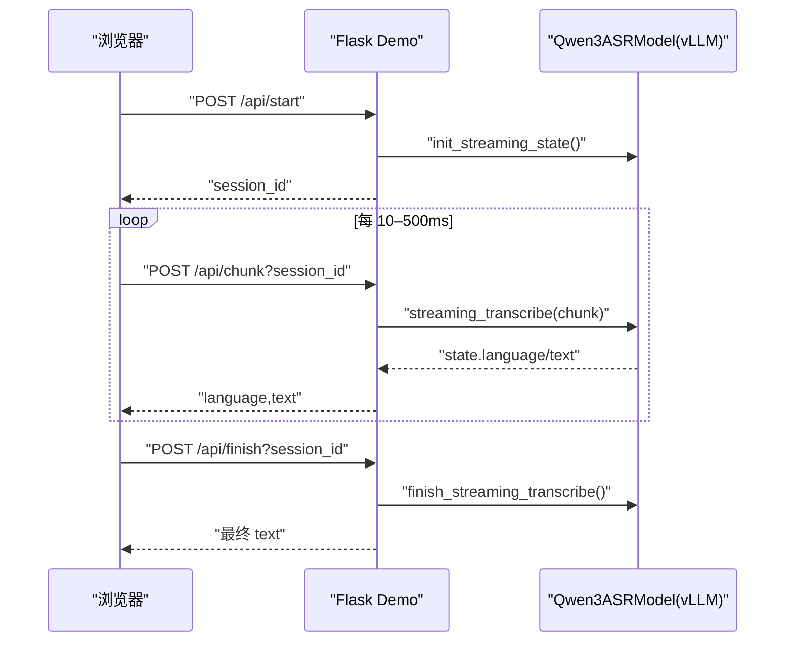
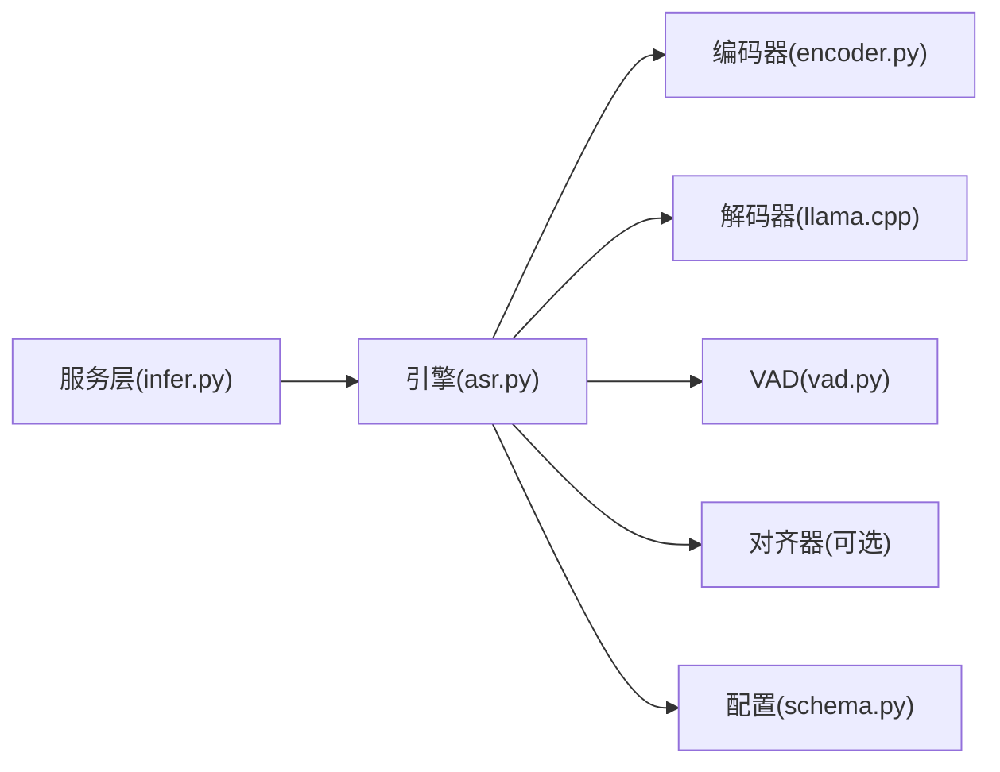

# 并发处理优化

<cite>
**本文引用的文件**
- [main.py](file://main.py)
- [infer.py](file://infer.py)
- [qwen_asr/cli/serve.py](file://qwen_asr/cli/serve.py)
- [examples/example_qwen3_asr_vllm.py](file://examples/example_qwen3_asr_vllm.py)
- [qwen_asr_gguf/inference/asr.py](file://qwen_asr_gguf/inference/asr.py)
- [qwen_asr_gguf/inference/schema.py](file://qwen_asr_gguf/inference/schema.py)
- [qwen_asr_gguf/inference/audio.py](file://qwen_asr_gguf/inference/audio.py)
- [qwen_asr_gguf/inference/encoder.py](file://qwen_asr_gguf/inference/encoder.py)
- [qwen_asr_gguf/inference/vad.py](file://qwen_asr_gguf/inference/vad.py)
- [qwen_asr_gguf/inference/utils.py](file://qwen_asr_gguf/inference/utils.py)
- [qwen_asr/cli/demo_streaming.py](file://qwen_asr/cli/demo_streaming.py)
</cite>

## 目录
1. [引言](#引言)
2. [项目结构](#项目结构)
3. [核心组件](#核心组件)
4. [架构总览](#架构总览)
5. [详细组件分析](#详细组件分析)
6. [依赖分析](#依赖分析)
7. [性能考量](#性能考量)
8. [故障排查指南](#故障排查指南)
9. [结论](#结论)
10. [附录](#附录)

## 引言
本指南聚焦于 Qwen3-ASR 在音频并发处理上的优化策略，涵盖多线程、多进程与异步 I/O 的应用边界与落地方式，系统阐述从预处理、推理到后处理的流水线并行化思路，并给出请求队列管理、负载均衡与资源调度的实践建议。文档同时提供不同并发模型的性能对比与 GIL、锁竞争、上下文切换等开销分析，以及面向流式处理的并发控制与背压机制。

## 项目结构
该项目采用“服务层 + 引擎层 + 推理后端”的分层组织：
- 服务层：FastAPI 应用与路由加载、中间件、生命周期管理
- 引擎层：ASR 核心引擎（编码、VAD、解码、对齐）、配置与消息协议
- 推理后端：ONNXRuntime（编码器）、llama.cpp（解码）、可选 vLLM（批推理）

图表来源
- [infer.py:85-122](file://infer.py#L85-L122)
- [qwen_asr_gguf/inference/asr.py:40-103](file://qwen_asr_gguf/inference/asr.py#L40-L103)
- [qwen_asr_gguf/inference/encoder.py:119-196](file://qwen_asr_gguf/inference/encoder.py#L119-L196)
- [qwen_asr_gguf/inference/schema.py:162-210](file://qwen_asr_gguf/inference/schema.py#L162-L210)

章节来源
- [infer.py:85-122](file://infer.py#L85-L122)
- [qwen_asr_gguf/inference/asr.py:40-103](file://qwen_asr_gguf/inference/asr.py#L40-L103)
- [qwen_asr_gguf/inference/encoder.py:119-196](file://qwen_asr_gguf/inference/encoder.py#L119-L196)
- [qwen_asr_gguf/inference/schema.py:162-210](file://qwen_asr_gguf/inference/schema.py#L162-L210)

## 核心组件
- ASR 引擎：统一的转录流水线，支持离线与流式，内置 VAD 动态分片与记忆窗口，集成对齐器
- 编码器：Split 前端/后端 ONNX 模型，支持 GPU/CPU Provider 与预热
- VAD：FireRedVAD 封装，提供自适应阈值与分片构建
- 解码器：llama.cpp 上下文与采样，支持预填充与生成循环
- 服务：FastAPI + 中间件 + 生命周期管理，提供 REST API 与流式 Web Demo

章节来源
- [qwen_asr_gguf/inference/asr.py:40-103](file://qwen_asr_gguf/inference/asr.py#L40-L103)
- [qwen_asr_gguf/inference/encoder.py:119-196](file://qwen_asr_gguf/inference/encoder.py#L119-L196)
- [qwen_asr_gguf/inference/vad.py:29-81](file://qwen_asr_gguf/inference/vad.py#L29-L81)
- [infer.py:55-81](file://infer.py#L55-L81)

## 架构总览
整体架构围绕“请求进入 -> 预处理 -> 编码 -> 解码 -> 对齐 -> 结果返回”的流水线展开，其中：
- 预处理：音频加载与重采样
- 编码：Split ONNX 前端/后端
- 解码：llama.cpp 生成循环，支持温度与最大生成长度
- 对齐：可选，强制对齐器
- 流式：基于 vLLM 的增量生成与会话状态管理

图表来源
- [infer.py:104-110](file://infer.py#L104-L110)
- [qwen_asr_gguf/inference/asr.py:432-514](file://qwen_asr_gguf/inference/asr.py#L432-L514)
- [qwen_asr_gguf/inference/encoder.py:260-280](file://qwen_asr_gguf/inference/encoder.py#L260-L280)
- [qwen_asr_gguf/inference/asr.py:847-870](file://qwen_asr_gguf/inference/asr.py#L847-L870)

## 详细组件分析

### 组件A：ASR 引擎与流水线
- 统一流水线：_asr_core 生成器，支持固定/动态分片、VAD 跳过、记忆窗口、对齐
- 解码内核：_decode + _safe_decode，预填充 + 生成循环，带熔断与去重
- 性能统计：编码/解码/对齐/预填充耗时与 RTF 输出
- 动态分片：长音频自适应 VAD，按语音边界构建分片，避免静音与句中截断

图表来源
- [qwen_asr_gguf/inference/asr.py:602-893](file://qwen_asr_gguf/inference/asr.py#L602-L893)

章节来源
- [qwen_asr_gguf/inference/asr.py:602-893](file://qwen_asr_gguf/inference/asr.py#L602-L893)

### 组件B：编码器（Split ONNXRuntime）
- Split 前端/后端：前端按 100 帧切片循环推理，后端 Transformer 支持固定形状 Padding
- Provider 选择：CUDA/ROCM/TensorRT/DML/CPU，按可用性回退
- 预热策略：固定形状模式预热 pad_to 秒，动态形状模式预热短音频
- 输出：(T, D) 嵌入向量，去除 batch 维

图表来源
- [qwen_asr_gguf/inference/encoder.py:119-196](file://qwen_asr_gguf/inference/encoder.py#L119-L196)
- [qwen_asr_gguf/inference/encoder.py:198-280](file://qwen_asr_gguf/inference/encoder.py#L198-L280)

章节来源
- [qwen_asr_gguf/inference/encoder.py:119-196](file://qwen_asr_gguf/inference/encoder.py#L119-L196)
- [qwen_asr_gguf/inference/encoder.py:198-280](file://qwen_asr_gguf/inference/encoder.py#L198-L280)

### 组件C：VAD（语音活动检测）
- FireRedVAD 封装：detect/adaptive_detect/build_chunks
- 自适应阈值：基于帧级概率 30% 分位数，避免阈值漂移
- 分片构建：合并近邻语音段、贪心打包、插入静音分片

图表来源
- [qwen_asr_gguf/inference/vad.py:160-223](file://qwen_asr_gguf/inference/vad.py#L160-L223)
- [qwen_asr_gguf/inference/vad.py:299-406](file://qwen_asr_gguf/inference/vad.py#L299-L406)

章节来源
- [qwen_asr_gguf/inference/vad.py:160-223](file://qwen_asr_gguf/inference/vad.py#L160-L223)
- [qwen_asr_gguf/inference/vad.py:299-406](file://qwen_asr_gguf/inference/vad.py#L299-L406)

### 组件D：解码器（llama.cpp）
- 预填充：构建 Batch 与位置编码，清空 KV 缓存
- 生成循环：采样器采样，UTF-8 增量解码器，滚动窗口去重
- 熔断与重试：重复 token 窗口检测、温度递增重试、去重后处理

图表来源
- [qwen_asr_gguf/inference/asr.py:212-345](file://qwen_asr_gguf/inference/asr.py#L212-L345)

章节来源
- [qwen_asr_gguf/inference/asr.py:212-345](file://qwen_asr_gguf/inference/asr.py#L212-L345)

### 组件E：流式处理（vLLM 后端）
- 会话状态：unfixed_chunk_num/unfixed_token_num/chunk_size_sec
- 增量解码：每次累积音频，重建提示，滚动回滚前缀
- Web Demo：Flask 会话管理、定时泵送、finish 收尾

图表来源
- [qwen_asr/cli/demo_streaming.py:417-470](file://qwen_asr/cli/demo_streaming.py#L417-L470)
- [qwen_asr_gguf/inference/qwen3_asr.py:584-765](file://qwen_asr_gguf/inference/qwen3_asr.py#L584-L765)

章节来源
- [qwen_asr/cli/demo_streaming.py:417-470](file://qwen_asr/cli/demo_streaming.py#L417-L470)
- [qwen_asr_gguf/inference/qwen3_asr.py:584-765](file://qwen_asr_gguf/inference/qwen3_asr.py#L584-L765)

## 依赖分析
- 服务层依赖引擎层与推理后端，FastAPI 生命周期负责初始化与关闭
- 引擎层内部耦合：编码器、VAD、解码器、对齐器，通过配置与消息协议解耦
- 推理后端：ONNXRuntime（CPU/GPU Provider）、llama.cpp、可选 vLLM

图表来源
- [infer.py:70-81](file://infer.py#L70-L81)
- [qwen_asr_gguf/inference/asr.py:40-103](file://qwen_asr_gguf/inference/asr.py#L40-L103)
- [qwen_asr_gguf/inference/encoder.py:119-196](file://qwen_asr_gguf/inference/encoder.py#L119-L196)
- [qwen_asr_gguf/inference/vad.py:29-81](file://qwen_asr_gguf/inference/vad.py#L29-L81)
- [qwen_asr_gguf/inference/schema.py:162-210](file://qwen_asr_gguf/inference/schema.py#L162-L210)

章节来源
- [infer.py:70-81](file://infer.py#L70-L81)
- [qwen_asr_gguf/inference/asr.py:40-103](file://qwen_asr_gguf/inference/asr.py#L40-L103)

## 性能考量
- 多线程与 GIL：Python 为主的服务入口与业务逻辑受 GIL 限制；编码/解码主要由 C/C++/ONNXRuntime/vLLM 执行，GIL 影响有限
- 锁竞争：引擎内部使用轻量级队列与内存结构，无显式全局锁；VAD/对齐器为独立模块，可通过进程隔离降低竞争
- 上下文切换：I/O 密集（音频加载/FFmpeg）与 CPU 密集（编码/解码）混合；建议使用异步 I/O 与进程池分离 I/O 与计算
- 批处理与并行：vLLM 提供批推理能力；编码器可并行多个音频分片（注意 Provider 资源争用）
- 资源调度：GPU/CPU Provider 自动选择与回退；固定形状模式可提升 ONNXRuntime 推理效率；动态形状模式降低内存浪费

[本节为通用性能讨论，不直接分析具体文件]

## 故障排查指南
- 编码器 Provider 问题：检查可用 Provider 列表与回退逻辑，确认 GPU 可用性
- VAD 依赖缺失：安装 fireredvad，或在配置中禁用 VAD
- 音频加载失败：确认 ffmpeg 安装与路径，或改用 soundfile 支持格式
- 解码熔断：观察重复检测与温度重试，适当提高 max_new_tokens 或降低温度
- 流式会话异常：检查 session_id 有效性、chunk 大小与采样率一致性

章节来源
- [qwen_asr_gguf/inference/encoder.py:137-165](file://qwen_asr_gguf/inference/encoder.py#L137-L165)
- [qwen_asr_gguf/inference/vad.py:54-60](file://qwen_asr_gguf/inference/vad.py#L54-L60)
- [qwen_asr_gguf/inference/audio.py:88-97](file://qwen_asr_gguf/inference/audio.py#L88-L97)
- [qwen_asr_gguf/inference/asr.py:319-345](file://qwen_asr_gguf/inference/asr.py#L319-L345)
- [qwen_asr/cli/demo_streaming.py:417-470](file://qwen_asr/cli/demo_streaming.py#L417-L470)

## 结论
Qwen3-ASR 的并发优化以“流水线并行 + 后端并行”为核心：预处理与编码可并行化，解码与对齐按分片串行推进并在必要时并行；服务层通过异步 I/O 与进程池实现高吞吐；流式处理通过会话状态与增量解码实现低延迟。针对不同并发模型，应结合硬件资源与任务特性选择合适的批大小、分片策略与 Provider，以获得最佳吞吐与延迟平衡。

[本节为总结性内容，不直接分析具体文件]

## 附录

### 并发模型与对比
- Python 多线程：受限于 GIL，适合 I/O 密集（音频加载/网络）；计算密集任务效果有限
- Python 多进程：绕过 GIL，适合 CPU 密集（编码/解码）；需注意进程间通信与共享状态
- 异步 I/O：提升并发连接数与吞吐，适合高并发短请求；需避免阻塞操作
- vLLM 批推理：在 GPU 上实现高吞吐批处理，适合批量转录与流式会话

[本节为概念性对比，不直接分析具体文件]

### 请求队列管理与负载均衡
- 队列策略：先进先出，按分片大小与资源占用分配
- 负载均衡：多进程实例间轮询或基于队列长度的动态分配
- 背压控制：当解码/对齐积压时，暂停新请求或降低批大小

[本节为通用实践建议，不直接分析具体文件]

### 实际并发配置示例
- 服务端：FastAPI + uvicorn，合理设置 workers 与 keep-alive 超时
- 编码器：GPU Provider 优先，固定形状模式提升吞吐，动态形状模式降低内存
- vLLM：设置 gpu_memory_utilization 与 max_inference_batch_size
- 流式：调整 chunk_size_sec 与 unfixed_token_num 平衡延迟与稳定性

章节来源
- [infer.py:114-122](file://infer.py#L114-L122)
- [examples/example_qwen3_asr_vllm.py:132-143](file://examples/example_qwen3_asr_vllm.py#L132-L143)
- [qwen_asr_gguf/inference/qwen3_asr.py:584-655](file://qwen_asr_gguf/inference/qwen3_asr.py#L584-L655)

### 性能测试方法
- 基准指标：RTF、吞吐（样本/秒）、P50/P95 延迟、GPU/CPU 利用率
- 测试场景：短音频（单片）、长音频（动态分片）、批量转录、流式会话
- 方法：使用不同 Provider、批大小、分片策略与并发配置进行对照实验

[本节为通用测试建议，不直接分析具体文件]

### 扩展性优化建议
- 水平扩展：多进程/多实例部署，结合反向代理与健康检查
- 垂直扩展：GPU 内存优化、模型量化、批大小自适应
- 异步化：I/O 与计算分离，引入消息队列与工作进程池

[本节为通用优化建议，不直接分析具体文件]