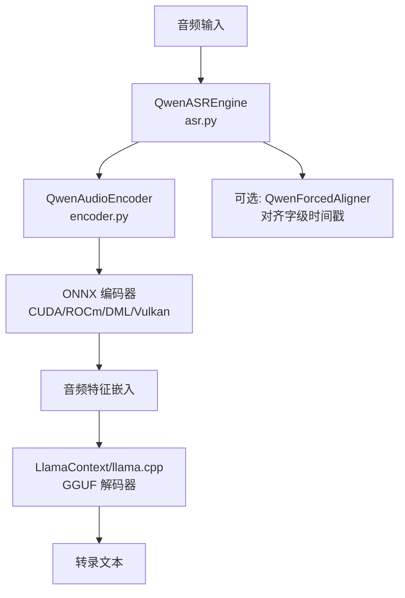
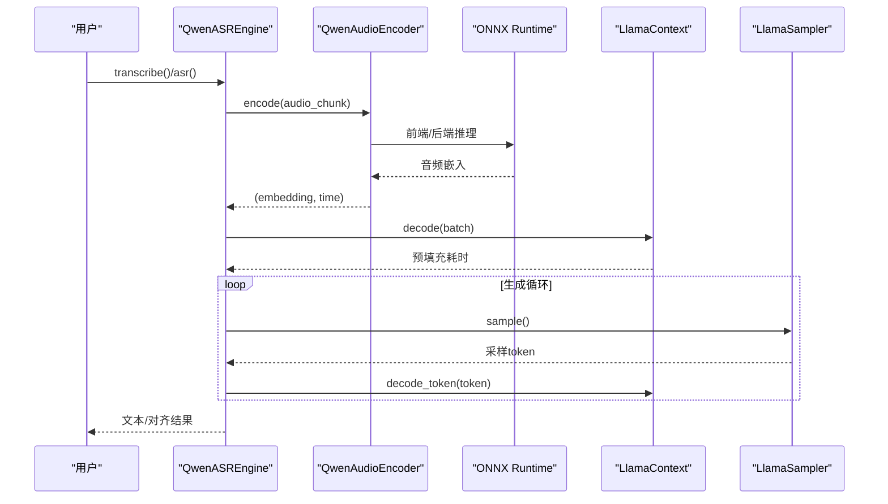
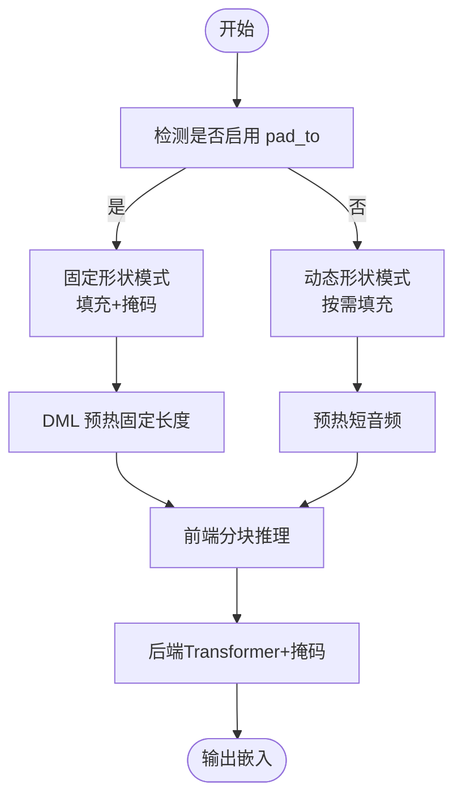
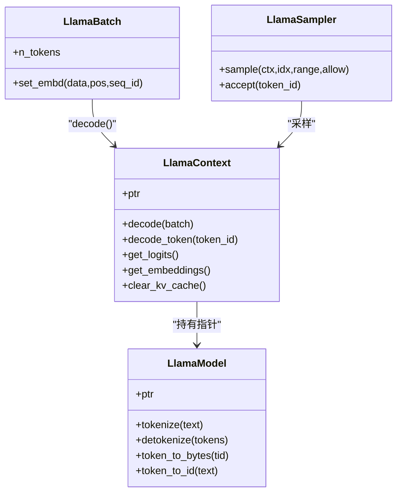
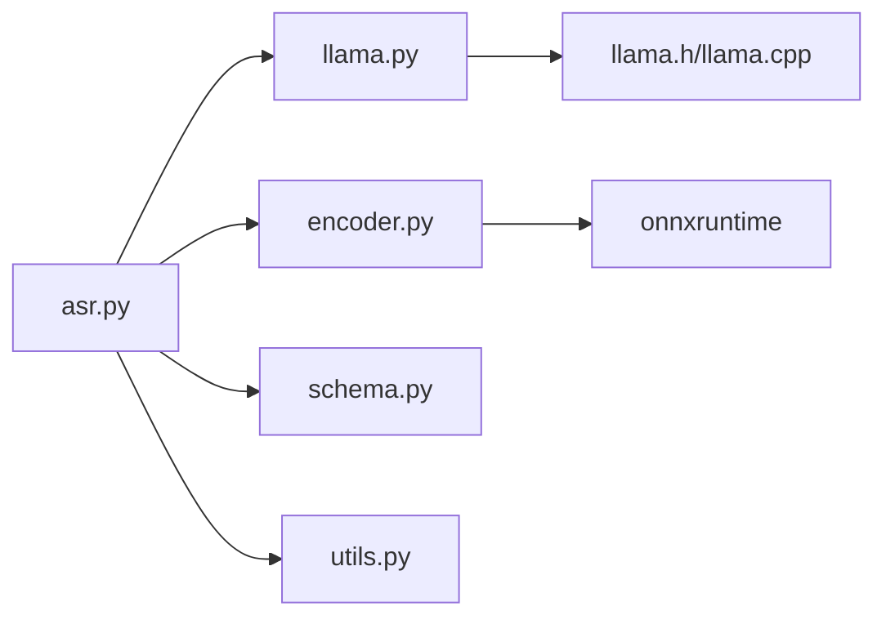

# 性能优化

<cite>
**本文档引用的文件**
- [README.md](file://README.md)
- [asr.py](file://qwen_asr_gguf/inference/asr.py)
- [llama.py](file://qwen_asr_gguf/inference/llama.py)
- [encoder.py](file://qwen_asr_gguf/inference/encoder.py)
- [schema.py](file://qwen_asr_gguf/inference/schema.py)
- [utils.py](file://qwen_asr_gguf/inference/utils.py)
- [audio.py](file://qwen_asr_gguf/inference/audio.py)
- [llama.cpp 源码](file://ref/llama.cpp/src/llama.cpp)
- [llama.h 头文件](file://ref/llama.cpp/include/llama.h)
- [token_generation_performance_tips.md](file://ref/llama.cpp/docs/development/token_generation_performance_tips.md)
- [convert_hf_to_gguf.py](file://qwen_asr_gguf/export/convert_hf_to_gguf.py)
</cite>

## 目录
1. [简介](#简介)
2. [项目结构](#项目结构)
3. [核心组件](#核心组件)
4. [架构总览](#架构总览)
5. [详细组件分析](#详细组件分析)
6. [依赖关系分析](#依赖关系分析)
7. [性能考量](#性能考量)
8. [故障排查指南](#故障排查指南)
9. [结论](#结论)
10. [附录](#附录)

## 简介
本指南聚焦于 Qwen3-ASR GGUF 的推理性能优化，围绕以下关键主题展开：
- DirectML 形状固定优化与 ONNX GPU Provider 配置
- llama.cpp 参数调优与内存管理策略
- 不同硬件平台（CPU、GPU、Vulkan）的性能特点与优化方法
- 性能基准测试、瓶颈分析与监控指标
- 量化策略对性能与精度的影响及选择建议
- 并发处理、缓存与资源池化实现原理
- 实际调优案例、参数调整示例与效果对比
- 性能问题诊断与解决方案

## 项目结构
该项目采用“ONNX 编码器 + GGUF 解码器”的混合架构，结合 VAD 动态分片与上下文记忆，实现低 RTF 与高吞吐的本地语音识别。

图表来源
- [asr.py:40-103](file://qwen_asr_gguf/inference/asr.py#L40-L103)
- [encoder.py:119-196](file://qwen_asr_gguf/inference/encoder.py#L119-L196)
- [llama.py:487-549](file://qwen_asr_gguf/inference/llama.py#L487-L549)

章节来源
- [README.md:296-314](file://README.md#L296-L314)
- [asr.py:40-103](file://qwen_asr_gguf/inference/asr.py#L40-L103)
- [encoder.py:119-196](file://qwen_asr_gguf/inference/encoder.py#L119-L196)
- [llama.py:487-549](file://qwen_asr_gguf/inference/llama.py#L487-L549)

## 核心组件
- QwenASREngine：统一的转录引擎，负责分片、VAD、编码、解码与后处理。
- QwenAudioEncoder：拆分的 ONNX 编码器（前端 CNN + 后端 Transformer），支持多 Provider。
- LlamaModel/LlamaContext/LlamaBatch/LlamaSampler：llama.cpp 的 Python 绑定与推理上下文。
- VAD/对齐器：可选的前置过滤与字级时间戳对齐。
- 配置体系：ASREngineConfig/VADConfig/AlignerConfig 等，集中控制性能参数。

章节来源
- [asr.py:40-103](file://qwen_asr_gguf/inference/asr.py#L40-L103)
- [encoder.py:119-196](file://qwen_asr_gguf/inference/encoder.py#L119-L196)
- [llama.py:443-549](file://qwen_asr_gguf/inference/llama.py#L443-L549)
- [schema.py:162-210](file://qwen_asr_gguf/inference/schema.py#L162-L210)

## 架构总览
整体流程强调“固定形状优化 + 动态分片 + 上下文记忆”，在保证精度的同时最大化吞吐与稳定性。

图表来源
- [asr.py:212-317](file://qwen_asr_gguf/inference/asr.py#L212-L317)
- [llama.py:520-543](file://qwen_asr_gguf/inference/llama.py#L520-L543)
- [encoder.py:260-279](file://qwen_asr_gguf/inference/encoder.py#L260-L279)

## 详细组件分析

### DirectML 形状固定优化
- 目标：解决 DirectML 在动态形状时频繁显存分配导致的抖动，提升稳定性与吞吐。
- 实现要点：
  - 固定形状模式：将音频填充到 pad_to（秒），后端配合注意力掩码，避免无效区域参与计算。
  - 预热：在 DML 模式下进行固定长度预热，确保内核缓存与显存布局稳定。
  - 动态形状模式：未启用 pad_to 时，编码器走动态路径，减少冗余填充。

图表来源
- [encoder.py:187-196](file://qwen_asr_gguf/inference/encoder.py#L187-L196)
- [encoder.py:234-257](file://qwen_asr_gguf/inference/encoder.py#L234-L257)

章节来源
- [README.md:312-314](file://README.md#L312-L314)
- [encoder.py:187-196](file://qwen_asr_gguf/inference/encoder.py#L187-L196)
- [encoder.py:234-257](file://qwen_asr_gguf/inference/encoder.py#L234-L257)

### ONNX GPU Provider 配置
- Provider 优先级：CUDAExecutionProvider > ROCmExecutionProvider > TensorRTExecutionProvider > DmlExecutionProvider > CPUExecutionProvider。
- Graph 优化：启用 ORT_ENABLE_ALL，关闭 spinning，降低调度开销。
- 精度检测：根据前端输入类型选择 float16/float32，兼顾性能与稳定性。

章节来源
- [encoder.py:130-165](file://qwen_asr_gguf/inference/encoder.py#L130-L165)
- [encoder.py:179-185](file://qwen_asr_gguf/inference/encoder.py#L179-L185)

### llama.cpp 参数调优与内存管理
- 上下文与批处理：
  - n_ctx：上下文窗口，影响 KV 缓存大小与预填充成本。
  - n_batch/n_ubatch：逻辑与物理批大小，影响吞吐与内存占用。
  - n_threads/n_threads_batch：线程数，需避免 CPU 过载。
- 采样器链：温度、Top-K、Top-P、最小 P、重复惩罚等组合影响生成稳定性与速度。
- 内存清理：decode 前清理 KV 缓存，避免跨分片污染。
- Flash-Attention 与 Offload：根据硬件能力选择启用/禁用，平衡吞吐与显存。

图表来源
- [llama.py:443-549](file://qwen_asr_gguf/inference/llama.py#L443-L549)
- [llama.py:550-625](file://qwen_asr_gguf/inference/llama.py#L550-L625)
- [llama.py:635-738](file://qwen_asr_gguf/inference/llama.py#L635-L738)

章节来源
- [llama.py:487-549](file://qwen_asr_gguf/inference/llama.py#L487-L549)
- [llama.py:550-625](file://qwen_asr_gguf/inference/llama.py#L550-L625)
- [llama.py:635-738](file://qwen_asr_gguf/inference/llama.py#L635-L738)
- [llama.h 头文件:327-379](file://ref/llama.cpp/include/llama.h#L327-L379)
- [llama.cpp 源码:737-756](file://ref/llama.cpp/src/llama.cpp#L737-L756)

### 并发处理、缓存与资源池化
- 并发：项目采用同步顺序执行，简化了多线程/多进程复杂度，但在高并发场景可通过外部服务层引入队列与并发控制。
- 缓存：KV 缓存按分片记忆（memory_num）控制，避免跨片段幻觉；decode 前清理 KV。
- 资源池化：ONNX SessionOptions 中的 graph 优化与 Provider 选择属于隐式资源池化；显式池化可在上层服务中引入连接池与模型实例池。

章节来源
- [asr.py:643-656](file://qwen_asr_gguf/inference/asr.py#L643-L656)
- [asr.py:249-252](file://qwen_asr_gguf/inference/asr.py#L249-L252)
- [encoder.py:130-136](file://qwen_asr_gguf/inference/encoder.py#L130-L136)

### VAD 动态分片与抗幻觉策略
- 动态分片：长音频超过阈值时启用 VAD，按语音边界切分，跳过静音段，显著降低 RTF。
- 抗幻觉：token 级重复熔断、n-gram 短语级重复熔断、max_new_tokens 上限、温度重试。

章节来源
- [asr.py:602-632](file://qwen_asr_gguf/inference/asr.py#L602-L632)
- [asr.py:319-345](file://qwen_asr_gguf/inference/asr.py#L319-L345)
- [schema.py:87-113](file://qwen_asr_gguf/inference/schema.py#L87-L113)

## 依赖关系分析

图表来源
- [asr.py:49-95](file://qwen_asr_gguf/inference/asr.py#L49-L95)
- [llama.py:159-218](file://qwen_asr_gguf/inference/llama.py#L159-L218)
- [encoder.py:1-6](file://qwen_asr_gguf/inference/encoder.py#L1-L6)
- [llama.h 头文件:423-432](file://ref/llama.cpp/include/llama.h#L423-L432)

章节来源
- [asr.py:49-95](file://qwen_asr_gguf/inference/asr.py#L49-L95)
- [llama.py:159-218](file://qwen_asr_gguf/inference/llama.py#L159-L218)
- [encoder.py:1-6](file://qwen_asr_gguf/inference/encoder.py#L1-L6)
- [llama.h 头文件:423-432](file://ref/llama.cpp/include/llama.h#L423-L432)

## 性能考量

### 不同硬件平台的性能特点与优化方法
- CPU：线程数需谨慎设置，避免过载；适合低延迟、低并发场景。
- CUDA/ROCm：吞吐高，注意显存与算子 offload；启用 ORT CUDA Provider。
- DirectML（Windows）：固定形状 + 掩码显著降低抖动；预热至关重要。
- Vulkan：跨平台 GPU 加速，显存占用与 RTF 介于 CUDA 与 CPU 之间。

章节来源
- [README.md:101-116](file://README.md#L101-L116)
- [README.md:312-314](file://README.md#L312-L314)
- [encoder.py:137-165](file://qwen_asr_gguf/inference/encoder.py#L137-L165)

### 性能基准测试与监控指标
- 指标体系：RTF（实时率）、预填充耗时、生成耗时、吞吐（tokens/s）、显存占用。
- 基准建议：固定音频长度与语言，关闭对齐，分别测试 GPU 与 CPU；记录预热后稳定值。

章节来源
- [asr.py:351-388](file://qwen_asr_gguf/inference/asr.py#L351-L388)
- [README.md:19-99](file://README.md#L19-L99)

### 量化策略对性能与精度的影响
- 编码器（ONNX）：int4 量化在数值相似度与速度间取得平衡；fp16 保持更高精度。
- 解码器（GGUF）：q4_k 量化带来较小困惑度增加，显著降低显存与提升吞吐。
- 选择建议：追求吞吐优先 int4/fp16 编码器 + q4_k 解码器；对精度敏感场景可考虑更高精度。

章节来源
- [README.md:153-158](file://README.md#L153-L158)
- [convert_hf_to_gguf.py:613-646](file://qwen_asr_gguf/export/convert_hf_to_gguf.py#L613-L646)

### 并发处理、缓存与资源池化
- 并发：通过外部服务层引入队列与并发控制；避免在同一 LlamaContext 上并发 decode。
- 缓存：合理设置 memory_num 与 n_ctx，避免 KV 缓存过大导致显存压力。
- 资源池化：Provider 与 SessionOptions 属于隐式池化；可扩展为显式模型实例池。

章节来源
- [asr.py:643-656](file://qwen_asr_gguf/inference/asr.py#L643-L656)
- [llama.py:487-549](file://qwen_asr_gguf/inference/llama.py#L487-L549)

### 实际调优案例与参数示例
- 案例 1：Windows DirectML 固定形状
  - 配置：use_gpu=True，pad_to=40，启用 VAD，memory_num=1。
  - 效果：减少显存抖动，提升 RTF。
- 案例 2：GPU（CUDA/ROCm）+ 优化线程
  - 配置：n_threads=物理核数，n_batch=较大值，n_ctx=适中。
  - 效果：提升吞吐，避免 CPU 过载。
- 案例 3：VAD 动态分片
  - 配置：dynamic_chunk_threshold=10s，chunk_size=30s。
  - 效果：长音频 RTF 显著下降，幻觉减少。

章节来源
- [README.md:242-261](file://README.md#L242-L261)
- [schema.py:162-210](file://qwen_asr_gguf/inference/schema.py#L162-L210)
- [asr.py:602-632](file://qwen_asr_gguf/inference/asr.py#L602-L632)

## 故障排查指南
- 症状：GPU 未生效
  - 排查：确认编译与 Provider 可用；查看 llama 日志中 offload 信息。
- 症状：吞吐低/RTF 高
  - 排查：降低 n_threads，增大 n_batch；检查 KV 缓存是否及时清理；评估是否启用 VAD。
- 症状：DirectML 显存抖动
  - 排查：启用固定形状 + 掩码；进行预热；避免频繁切换 pad_to。
- 症状：乱码/“!!!!”
  - 排查：禁用 Intel 集显 fp16 计算（环境变量）。

章节来源
- [token_generation_performance_tips.md:1-41](file://ref/llama.cpp/docs/development/token_generation_performance_tips.md#L1-L41)
- [README.md:375-381](file://README.md#L375-L381)
- [llama.cpp 源码:792-800](file://ref/llama.cpp/src/llama.cpp#L792-L800)

## 结论
通过 DirectML 形状固定、ONNX GPU Provider 优化、llama.cpp 参数与内存管理调优，以及合理的量化策略与 VAD 动态分片，Qwen3-ASR GGUF 能在多硬件平台上实现低 RTF 与高吞吐。实践中应以基准测试与监控指标为核心，结合具体场景选择最优配置组合。

## 附录
- 常用参数建议
  - n_ctx：根据音频时长与语言密度设置，避免过大导致显存压力。
  - n_batch：尽可能大以提升吞吐，但受显存与 CPU 线程限制。
  - n_threads：从物理核数出发，逐步增加至瓶颈点。
  - memory_num：1~2 片分片足以维持上下文连贯。
  - temperature/top_k/top_p：温度优先，再微调 Top-K/Top-P 与最小 P。

章节来源
- [llama.h 头文件:327-379](file://ref/llama.cpp/include/llama.h#L327-L379)
- [token_generation_performance_tips.md:22-41](file://ref/llama.cpp/docs/development/token_generation_performance_tips.md#L22-L41)