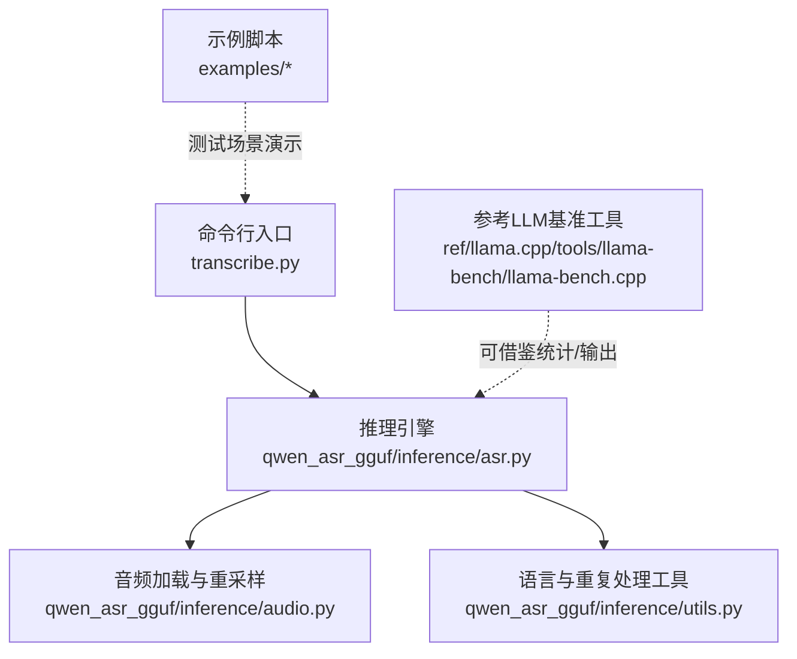
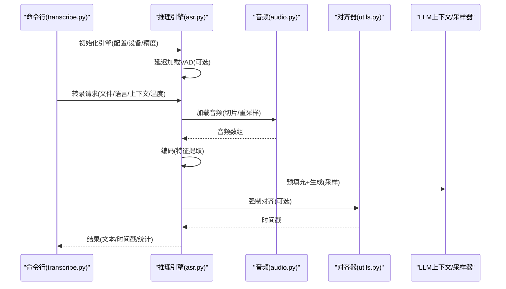
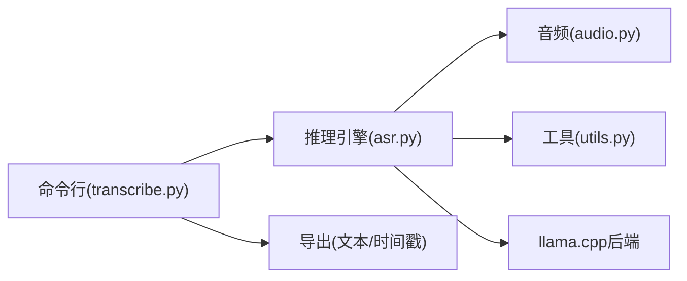

# 性能基准测试

<cite>
**本文引用的文件**   
- [main.py](file://main.py)
- [transcribe.py](file://transcribe.py)
- [qwen_asr_gguf/inference/asr.py](file://qwen_asr_gguf/inference/asr.py)
- [qwen_asr_gguf/inference/audio.py](file://qwen_asr_gguf/inference/audio.py)
- [qwen_asr_gguf/inference/utils.py](file://qwen_asr_gguf/inference/utils.py)
- [ref/llama.cpp/tools/llama-bench/llama-bench.cpp](file://ref/llama.cpp/tools/llama-bench/llama-bench.cpp)
- [examples/example_qwen3_asr_transformers.py](file://examples/example_qwen3_asr_transformers.py)
- [examples/example_qwen3_asr_vllm.py](file://examples/example_qwen3_asr_vllm.py)
- [examples/example_qwen3_asr_vllm_streaming.py](file://examples/example_qwen3_asr_vllm_streaming.py)
</cite>

## 目录
1. [引言](#引言)
2. [项目结构](#项目结构)
3. [核心组件](#核心组件)
4. [架构总览](#架构总览)
5. [详细组件分析](#详细组件分析)
6. [依赖分析](#依赖分析)
7. [性能考虑](#性能考虑)
8. [故障排查指南](#故障排查指南)
9. [结论](#结论)
10. [附录](#附录)

## 引言
本指南面向Qwen3-ASR的性能基准测试，目标是建立一套可重复、可量化的评估体系，覆盖延迟测试、吞吐量测试与资源利用率测试，并针对单音频、批量与流式三种典型场景设计测试策略。文档将定义关键性能指标（如P50/P95/P99延迟、RTF、每秒处理音频数量等），给出测试环境搭建、数据集准备、测试脚本使用方法，以及结果分析与性能回归检测机制。同时提供自动化性能测试与持续集成中的性能监控策略，帮助团队在不同硬件与配置下稳定评估模型表现。

## 项目结构
本仓库包含命令行工具、推理引擎、音频处理、示例脚本与参考基准工具等模块。与性能基准测试直接相关的核心路径如下：
- 命令行入口与转录流程：transcribe.py
- 推理引擎与统计打印：qwen_asr_gguf/inference/asr.py
- 音频加载与重采样：qwen_asr_gguf/inference/audio.py
- 语言与重复处理工具：qwen_asr_gguf/inference/utils.py
- 参考LLM基准工具：ref/llama.cpp/tools/llama-bench/llama-bench.cpp
- 示例脚本（批量/流式）：examples/...

**图示来源**
- [transcribe.py:1-205](file://transcribe.py#L1-L205)
- [qwen_asr_gguf/inference/asr.py:1-800](file://qwen_asr_gguf/inference/asr.py#L1-L800)
- [qwen_asr_gguf/inference/audio.py:1-149](file://qwen_asr_gguf/inference/audio.py#L1-L149)
- [qwen_asr_gguf/inference/utils.py:1-134](file://qwen_asr_gguf/inference/utils.py#L1-L134)
- [ref/llama.cpp/tools/llama-bench/llama-bench.cpp:1-800](file://ref/llama.cpp/tools/llama-bench/llama-bench.cpp#L1-L800)

**章节来源**
- [transcribe.py:1-205](file://transcribe.py#L1-L205)
- [qwen_asr_gguf/inference/asr.py:1-800](file://qwen_asr_gguf/inference/asr.py#L1-L800)
- [qwen_asr_gguf/inference/audio.py:1-149](file://qwen_asr_gguf/inference/audio.py#L1-L149)
- [qwen_asr_gguf/inference/utils.py:1-134](file://qwen_asr_gguf/inference/utils.py#L1-L134)
- [ref/llama.cpp/tools/llama-bench/llama-bench.cpp:1-800](file://ref/llama.cpp/tools/llama-bench/llama-bench.cpp#L1-L800)

## 核心组件
- 命令行工具：提供模型目录、精度、GPU/Vulkan加速、时间戳对齐、语言/上下文提示、分段参数等选项，负责初始化引擎、校验模型文件、逐文件转录并导出结果。
- 推理引擎：封装编码器、对齐器、VAD、LLM上下文与采样器，提供一次性转录与流式转录接口，并内置统计打印（含RTF、各阶段耗时与速度）。
- 音频处理：支持多种格式的音频读取与重采样，保证统一采样率与单声道输入。
- 工具函数：语言标准化与重复文本修复，保障输出质量。
- 参考基准：llama-bench提供多维度统计与输出格式，可借鉴其统计方法与输出规范。

**章节来源**
- [transcribe.py:68-205](file://transcribe.py#L68-L205)
- [qwen_asr_gguf/inference/asr.py:40-142](file://qwen_asr_gguf/inference/asr.py#L40-L142)
- [qwen_asr_gguf/inference/audio.py:88-149](file://qwen_asr_gguf/inference/audio.py#L88-L149)
- [qwen_asr_gguf/inference/utils.py:38-134](file://qwen_asr_gguf/inference/utils.py#L38-L134)
- [ref/llama.cpp/tools/llama-bench/llama-bench.cpp:391-470](file://ref/llama.cpp/tools/llama-bench/llama-bench.cpp#L391-L470)

## 架构总览
下图展示从命令行到推理引擎、再到音频处理与LLM解码的整体流程，以及关键统计点（初始化、编码、预填充、生成、对齐、VAD）。

**图示来源**
- [transcribe.py:146-199](file://transcribe.py#L146-L199)
- [qwen_asr_gguf/inference/asr.py:49-142](file://qwen_asr_gguf/inference/asr.py#L49-L142)
- [qwen_asr_gguf/inference/audio.py:129-149](file://qwen_asr_gguf/inference/audio.py#L129-L149)
- [qwen_asr_gguf/inference/utils.py:58-134](file://qwen_asr_gguf/inference/utils.py#L58-L134)

## 详细组件分析

### 单音频测试策略
- 目标：测量单条音频的端到端延迟与资源占用，验证初始化与推理稳定性。
- 关键步骤：
  - 准备单条音频样本（建议覆盖不同长度与语言）。
  - 设置固定温度、禁用对齐器以减少额外开销，或启用对齐器对比差异。
  - 记录初始化耗时、编码耗时、预填充耗时、生成耗时、对齐耗时（如有）、总耗时。
  - 输出RTF（实时率）与各阶段速度（tokens/s）。
- 指标定义与计算：
  - P50/P95/P99延迟：对多次独立运行的总耗时排序取分位数。
  - RTF：总耗时 / 音频时长。
  - 每秒处理音频数量：并发场景下的吞吐量（见“吞吐量测试”）。
- 注意事项：
  - 首次运行包含模型加载与VAD初始化，建议至少执行一次“预热”运行后再采集数据。
  - 若启用VAD，需记录VAD耗时与跳过的静音分片数。

**章节来源**
- [transcribe.py:146-199](file://transcribe.py#L146-L199)
- [qwen_asr_gguf/inference/asr.py:351-388](file://qwen_asr_gguf/inference/asr.py#L351-L388)

### 批量测试策略
- 目标：评估在固定并发与批大小下的吞吐能力与资源利用效率。
- 关键步骤：
  - 准备一批同质或异质音频样本（长度分布尽量覆盖短/中/长）。
  - 控制并发数（线程/进程/队列深度），记录每批次的总耗时与成功/失败数。
  - 记录每条音频的端到端延迟，汇总P50/P95/P99延迟。
  - 统计每秒处理音频数量（吞吐量）与资源占用（CPU/GPU内存/显存）。
- 指标定义与计算：
  - 吞吐量：总处理音频数 / 总耗时。
  - 批内延迟：单条音频的端到端耗时。
  - 批间延迟：批次级的首尾音频延迟差。
- 优化建议：
  - 合理设置批大小与并发，避免过载导致抖动。
  - 对长音频启用VAD动态分片，减少无效计算。

**章节来源**
- [transcribe.py:161-199](file://transcribe.py#L161-L199)
- [qwen_asr_gguf/inference/asr.py:602-721](file://qwen_asr_gguf/inference/asr.py#L602-L721)

### 流式测试策略
- 目标：评估实时/准实时场景下的延迟与稳定性，关注首包延迟与持续输出速率。
- 关键步骤：
  - 使用流式接口（如transcribe_stream）逐分片处理音频。
  - 记录首个非空分片的延迟（首包延迟）、后续分片的平均延迟与输出速率。
  - 统计VAD跳过的分片数与总耗时，评估静音过滤效果。
- 指标定义与计算：
  - 首包延迟：第一个非空分片的处理耗时。
  - 分片延迟：每片处理耗时的P50/P95/P99。
  - 实时输出速率：累计输出字符/字节随时间的变化曲线。
- 适用场景：
  - SSE/WS等需要逐步推送结果的场景。
  - 对延迟敏感的应用（如会议转写、客服热线）。

**章节来源**
- [transcribe.py:178-185](file://transcribe.py#L178-L185)
- [qwen_asr_gguf/inference/asr.py:468-514](file://qwen_asr_gguf/inference/asr.py#L468-L514)
- [qwen_asr_gguf/inference/asr.py:570-596](file://qwen_asr_gguf/inference/asr.py#L570-L596)

### 性能指标定义与计算
- 延迟类指标
  - P50/P95/P99延迟：对多次运行的端到端耗时取分位数。
  - 首包延迟：流式场景下首个非空分片的耗时。
  - RTF（实时率）：总耗时 / 音频时长。
- 吞吐量类指标
  - 吞吐量：单位时间内处理的音频数量（条/秒）。
  - 有效吞吐量：剔除失败/异常样本后的平均处理速率。
- 资源利用率类指标
  - CPU/GPU利用率、内存/显存占用峰值。
  - 各阶段耗时占比：编码、预填充、生成、对齐、VAD等。
- 计算方法
  - 使用多次独立运行取均值与标准差，剔除异常值后统计分位数。
  - 对于流式场景，记录时间戳序列，绘制延迟与速率曲线。

**章节来源**
- [qwen_asr_gguf/inference/asr.py:351-388](file://qwen_asr_gguf/inference/asr.py#L351-L388)
- [ref/llama.cpp/tools/llama-bench/llama-bench.cpp:97-113](file://ref/llama.cpp/tools/llama-bench/llama-bench.cpp#L97-L113)

### 测试环境搭建
- 硬件与驱动
  - CPU：多核/NUMA感知（可参考llama-bench的NUMA策略）。
  - GPU：CUDA/ROCm/Vulkan驱动与运行时，确保设备可见性。
  - 存储：SSD优先，避免I/O瓶颈。
- 软件依赖
  - Python环境与依赖包（见项目依赖声明）。
  - ffmpeg：用于读取多种音频格式（命令行工具会检测）。
  - 模型文件：按transcribe.py提示准备ASR与对齐器模型文件。
- 配置要点
  - 精度：fp32/fp16/int8/int4等，对比不同精度下的延迟与资源占用。
  - 加速：GPU/Vulkan开关，结合设备能力选择最优组合。
  - 上下文窗口：n_ctx影响LLM上下文长度与内存占用。
  - 分段参数：chunk_size与memory_num影响长音频处理策略与记忆成本。

**章节来源**
- [transcribe.py:73-96](file://transcribe.py#L73-L96)
- [transcribe.py:102-104](file://transcribe.py#L102-L104)
- [qwen_asr_gguf/inference/audio.py:88-91](file://qwen_asr_gguf/inference/audio.py#L88-L91)

### 数据集准备
- 单音频：准备若干条不同长度与语言的音频，覆盖静音、低/中/高等信噪比场景。
- 批量：构建同质/异质混合数据集，控制长度分布与语言分布，便于评估鲁棒性。
- 流式：以固定步长切分长音频，模拟实时流输入。
- 质量控制：确保音频格式受支持（见音频加载逻辑），必要时进行重采样与单声道转换。

**章节来源**
- [qwen_asr_gguf/inference/audio.py:129-149](file://qwen_asr_gguf/inference/audio.py#L129-L149)

### 测试脚本使用方法
- 命令行工具
  - 初始化引擎与转录：使用transcribe.py提供的选项配置模型、精度、加速与分段参数。
  - 模型文件检查：若缺失关键文件，工具会提示下载地址与路径。
  - 结果导出：支持TXT/SRT/JSON等多种导出格式。
- 示例脚本
  - Transformers后端：examples/example_qwen3_asr_transformers.py展示单/批量推理与时间戳输出。
  - vLLM后端：examples/example_qwen3_asr_vllm.py展示单/批量推理与时间戳输出。
  - 流式推理：examples/example_qwen3_asr_vllm_streaming.py展示分片流式推理。

**章节来源**
- [transcribe.py:68-205](file://transcribe.py#L68-L205)
- [examples/example_qwen3_asr_transformers.py:127-151](file://examples/example_qwen3_asr_transformers.py#L127-L151)
- [examples/example_qwen3_asr_vllm.py:131-153](file://examples/example_qwen3_asr_vllm.py#L131-L153)
- [examples/example_qwen3_asr_vllm_streaming.py:88-106](file://examples/example_qwen3_asr_vllm_streaming.py#L88-L106)

### 实际测试案例
- 案例A：单音频延迟测试
  - 目标：比较不同精度（int4 vs fp16）与加速（GPU/Vulkan）下的P95延迟。
  - 方法：固定温度与上下文，重复运行100次，剔除首跑预热，统计分位数。
- 案例B：批量吞吐测试
  - 目标：评估不同批大小与并发下的吞吐量与资源占用。
  - 方法：准备1000条音频，分别测试批大小1/4/8/16，记录总耗时与吞吐量。
- 案例C：流式延迟测试
  - 目标：评估不同分片步长（500ms/1000ms/2000ms）下的首包延迟与持续输出速率。
  - 方法：对同一长音频以不同步长切分，记录首个非空分片延迟与后续分片延迟。

**章节来源**
- [transcribe.py:146-199](file://transcribe.py#L146-L199)
- [qwen_asr_gguf/inference/asr.py:468-514](file://qwen_asr_gguf/inference/asr.py#L468-L514)

### 结果分析方法
- 统计描述：均值、标准差、P50/P95/P99、最小/最大值。
- 分布分析：延迟直方图、累积分布曲线，识别异常与尾部延迟。
- 资源分析：CPU/GPU利用率曲线、内存/显存峰值与趋势。
- 归因分析：分解总耗时到编码、预填充、生成、对齐、VAD等阶段，定位瓶颈。

**章节来源**
- [qwen_asr_gguf/inference/asr.py:351-388](file://qwen_asr_gguf/inference/asr.py#L351-L388)
- [ref/llama.cpp/tools/llama-bench/llama-bench.cpp:97-113](file://ref/llama.cpp/tools/llama-bench/llama-bench.cpp#L97-L113)

### 性能回归检测机制
- 基线建立：在稳定环境中采集基线数据（延迟、吞吐、资源占用）。
- 回归阈值：为P50/P95/P99延迟与吞吐量设定阈值，超出阈值即告警。
- 自动化：将测试脚本纳入CI，定期执行并生成报告。
- 可视化：生成趋势图与对比表，辅助决策。

**章节来源**
- [ref/llama.cpp/tools/llama-bench/llama-bench.cpp:391-470](file://ref/llama.cpp/tools/llama-bench/llama-bench.cpp#L391-L470)

### 自动化性能测试与持续集成
- CI集成要点
  - 作业编排：按硬件/精度/后端拆分作业，减少相互干扰。
  - 资源隔离：为不同作业分配独立GPU/内存池。
  - 报告聚合：统一输出CSV/JSON/Markdown，便于对比与归档。
- 性能监控策略
  - 实时监控：在CI中记录关键指标与资源曲线。
  - 告警机制：基于阈值触发邮件/消息通知。
  - 历史对比：与历史基线对比，识别回归。

**章节来源**
- [ref/llama.cpp/tools/llama-bench/llama-bench.cpp:214-252](file://ref/llama.cpp/tools/llama-bench/llama-bench.cpp#L214-L252)

## 依赖分析
- 组件耦合
  - 命令行工具依赖推理引擎与导出模块；推理引擎依赖音频处理与工具函数。
  - VAD与对齐器为可选组件，按配置启用，降低默认开销。
- 外部依赖
  - ffmpeg：音频读取与重采样。
  - llama.cpp后端：LLM推理与上下文管理。
- 潜在风险
  - 上下文窗口过大可能导致越界中断，需在配置中合理设置。
  - VAD不可用时降级为固定分片，可能增加无效计算。

**图示来源**
- [transcribe.py:146-199](file://transcribe.py#L146-L199)
- [qwen_asr_gguf/inference/asr.py:49-142](file://qwen_asr_gguf/inference/asr.py#L49-L142)
- [qwen_asr_gguf/inference/audio.py:129-149](file://qwen_asr_gguf/inference/audio.py#L129-L149)
- [qwen_asr_gguf/inference/utils.py:58-134](file://qwen_asr_gguf/inference/utils.py#L58-L134)

**章节来源**
- [transcribe.py:146-199](file://transcribe.py#L146-L199)
- [qwen_asr_gguf/inference/asr.py:49-142](file://qwen_asr_gguf/inference/asr.py#L49-L142)
- [qwen_asr_gguf/inference/audio.py:129-149](file://qwen_asr_gguf/inference/audio.py#L129-L149)
- [qwen_asr_gguf/inference/utils.py:58-134](file://qwen_asr_gguf/inference/utils.py#L58-L134)

## 性能考虑
- 分片策略
  - 短音频：单一分片，避免额外开销。
  - 长音频：优先启用VAD动态分片，跳过静音，减少无效计算。
- 温度与采样
  - 降低温度可提升稳定性，但可能增加生成耗时。
- 上下文窗口
  - 合理设置n_ctx，避免越界与内存压力。
- 资源调度
  - NUMA感知与线程亲和（参考llama-bench的NUMA策略）有助于降低跨NUMA访问开销。

**章节来源**
- [qwen_asr_gguf/inference/asr.py:602-721](file://qwen_asr_gguf/inference/asr.py#L602-L721)
- [ref/llama.cpp/tools/llama-bench/llama-bench.cpp:750-765](file://ref/llama.cpp/tools/llama-bench/llama-bench.cpp#L750-L765)

## 故障排查指南
- 模型文件缺失
  - 现象：启动时报错，提示缺少模型文件。
  - 处理：根据提示下载并放置到指定目录。
- 初始化失败
  - 现象：引擎初始化耗时异常或报错。
  - 处理：尝试关闭GPU/Vulkan加速，查看日志文件定位问题。
- 上下文越界
  - 现象：推理过程中触发越界保护，返回空结果。
  - 处理：减小上下文窗口或缩短输入长度。
- VAD不可用
  - 现象：长音频无法动态分片，退化为固定分片。
  - 处理：检查VAD依赖与配置，或接受固定分片策略。

**章节来源**
- [transcribe.py:37-67](file://transcribe.py#L37-L67)
- [transcribe.py:152-159](file://transcribe.py#L152-L159)
- [qwen_asr_gguf/inference/asr.py:229-238](file://qwen_asr_gguf/inference/asr.py#L229-L238)
- [qwen_asr_gguf/inference/asr.py:684-721](file://qwen_asr_gguf/inference/asr.py#L684-L721)

## 结论
通过本指南，团队可以系统地开展Qwen3-ASR的性能基准测试，覆盖单音频、批量与流式三大场景，并建立完善的指标体系与回归检测机制。建议在CI中常态化执行关键测试，持续跟踪性能变化，结合分片策略与资源调度优化，获得稳定且高效的推理体验。

## 附录
- 参考基准工具：llama-bench提供了丰富的统计与输出格式，可作为性能报告模板与对比基准。
- 示例脚本：Transformers与vLLM后端的示例展示了不同后端的使用方式与时间戳输出，便于扩展到批量与流式测试。

**章节来源**
- [ref/llama.cpp/tools/llama-bench/llama-bench.cpp:391-470](file://ref/llama.cpp/tools/llama-bench/llama-bench.cpp#L391-L470)
- [examples/example_qwen3_asr_transformers.py:127-151](file://examples/example_qwen3_asr_transformers.py#L127-L151)
- [examples/example_qwen3_asr_vllm.py:131-153](file://examples/example_qwen3_asr_vllm.py#L131-L153)
- [examples/example_qwen3_asr_vllm_streaming.py:88-106](file://examples/example_qwen3_asr_vllm_streaming.py#L88-L106)