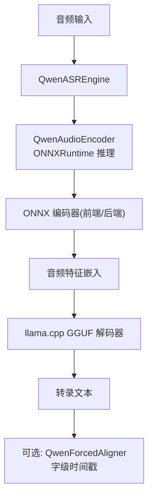
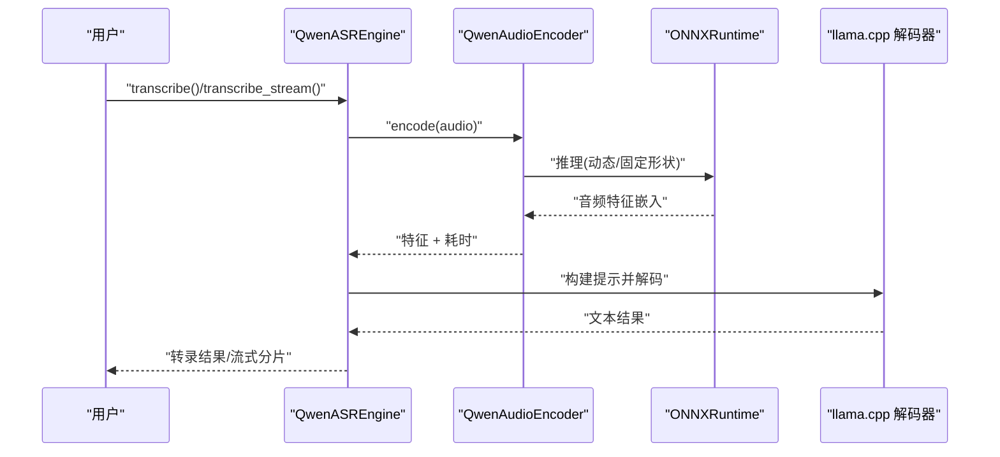
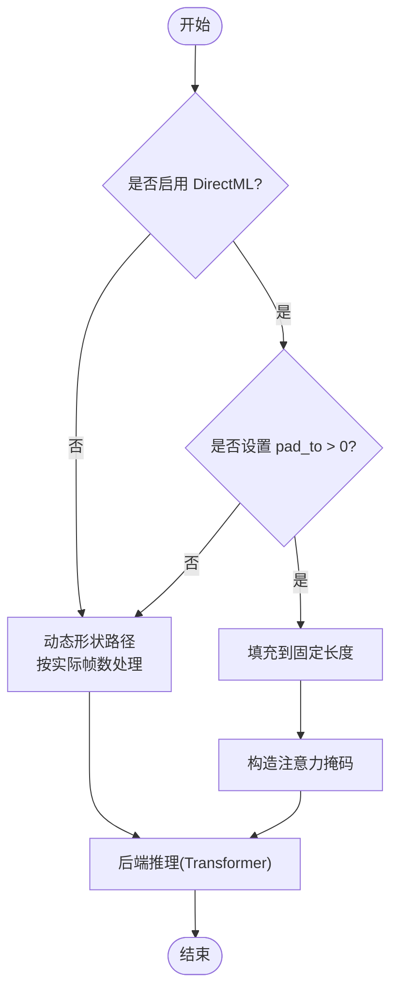
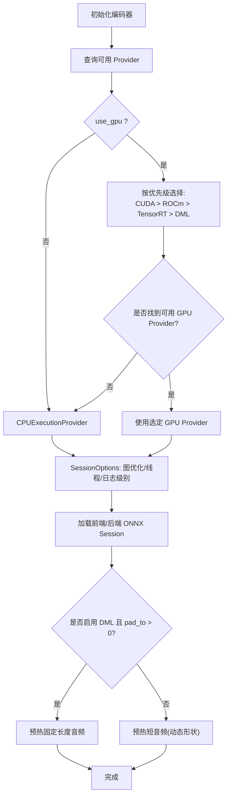
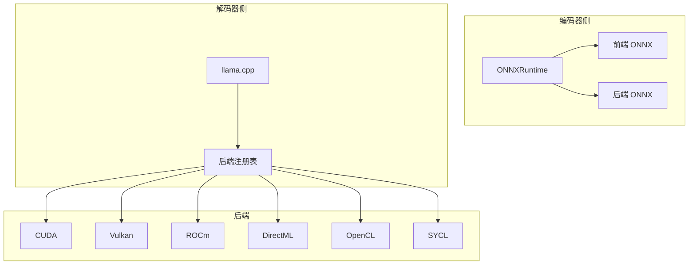

# 硬件性能优化

<cite>
**本文引用的文件**
- [README.md](file://README.md)
- [qwen_asr_gguf/inference/encoder.py](file://qwen_asr_gguf/inference/encoder.py)
- [qwen_asr_gguf/inference/asr.py](file://qwen_asr_gguf/inference/asr.py)
- [qwen_asr_gguf/inference/audio.py](file://qwen_asr_gguf/inference/audio.py)
- [qwen_asr_gguf/inference/utils.py](file://qwen_asr_gguf/inference/utils.py)
- [qwen_asr_gguf/inference/schema.py](file://qwen_asr_gguf/inference/schema.py)
- [qwen_asr_gguf/export/qwen3_asr_custom/modeling_qwen3_asr_onnx.py](file://qwen_asr_gguf/export/qwen3_asr_custom/modeling_qwen3_asr_onnx.py)
- [ref/llama.cpp/docs/build.md](file://ref/llama.cpp/docs/build.md)
- [ref/llama.cpp/ggml/src/ggml-backend-reg.cpp](file://ref/llama.cpp/ggml/src/ggml-backend-reg.cpp)
- [ref/llama.cpp/ggml/src/ggml-vulkan/ggml-vulkan.cpp](file://ref/llama.cpp/ggml/src/ggml-vulkan/ggml-vulkan.cpp)
- [ref/llama.cpp/tools/llama-bench/llama-bench.cpp](file://ref/llama.cpp/tools/llama-bench/llama-bench.cpp)
- [ref/llama.cpp/tests/testing.h](file://ref/llama.cpp/tests/testing.h)
</cite>

## 目录
1. [简介](#简介)
2. [项目结构](#项目结构)
3. [核心组件](#核心组件)
4. [架构总览](#架构总览)
5. [详细组件分析](#详细组件分析)
6. [依赖分析](#依赖分析)
7. [性能考量](#性能考量)
8. [故障排除指南](#故障排除指南)
9. [结论](#结论)
10. [附录](#附录)

## 简介
本指南聚焦于硬件性能优化，围绕 CPU、GPU、Vulkan 等不同硬件平台，系统阐述以下主题：
- DirectML 形状固定优化的技术原理与实现要点（通过固定输入形状与注意力掩码，降低显存分配抖动，提升推理稳定性与吞吐）。
- ONNX GPU Provider 的配置选项与性能影响（CUDA、ROCm、TensorRT、DirectML 的选择策略与回退机制）。
- 不同硬件配置下的性能基准测试方法与参数调优建议（结合项目内置统计与 llama-bench 的评测框架）。
- 实际硬件配置示例、性能对比数据与常见问题排查。

## 项目结构
本项目采用“ONNX 编码器 + GGUF 解码器”的混合推理架构，编码阶段可利用 ONNXRuntime 的多后端加速（CUDA/ROCm/TensorRT/DirectML），解码阶段由 llama.cpp 的多后端（CUDA/Vulkan/Metal/SYCL/OpenCL 等）提供高性能推理。

图表来源
- [README.md:298-314](file://README.md#L298-L314)
- [qwen_asr_gguf/inference/asr.py:40-103](file://qwen_asr_gguf/inference/asr.py#L40-L103)
- [qwen_asr_gguf/inference/encoder.py:119-196](file://qwen_asr_gguf/inference/encoder.py#L119-L196)

章节来源
- [README.md:118-161](file://README.md#L118-L161)
- [qwen_asr_gguf/inference/asr.py:40-103](file://qwen_asr_gguf/inference/asr.py#L40-L103)
- [qwen_asr_gguf/inference/encoder.py:119-196](file://qwen_asr_gguf/inference/encoder.py#L119-L196)

## 核心组件
- QwenASREngine：统一的转录引擎，集成 VAD、编码器、强制对齐器与 LLM 解码器，支持一次性与流式两种模式。
- QwenAudioEncoder：基于 ONNXRuntime 的音频编码器，支持动态/固定形状模式，自动选择 GPU Provider（CUDA/ROCm/TensorRT/DirectML）。
- llama.cpp 集成：通过 Python 绑定调用 GGUF 解码器，支持多后端（CUDA/Vulkan/Metal/SYCL/OpenCL 等）。
- DirectML 形状固定优化：在 Windows 上通过固定输入长度与注意力掩码，缓解动态形状导致的显存分配抖动。

章节来源
- [qwen_asr_gguf/inference/asr.py:40-103](file://qwen_asr_gguf/inference/asr.py#L40-L103)
- [qwen_asr_gguf/inference/encoder.py:119-196](file://qwen_asr_gguf/inference/encoder.py#L119-L196)
- [README.md:312-314](file://README.md#L312-L314)

## 架构总览
混合推理链路在编码阶段利用 ONNXRuntime 的 GPU Provider，解码阶段由 llama.cpp 的后端驱动。DirectML 在 Windows 上通过“形状固定 + 掩码”策略提升稳定性与吞吐。

图表来源
- [qwen_asr_gguf/inference/asr.py:432-514](file://qwen_asr_gguf/inference/asr.py#L432-L514)
- [qwen_asr_gguf/inference/encoder.py:260-280](file://qwen_asr_gguf/inference/encoder.py#L260-L280)

章节来源
- [qwen_asr_gguf/inference/asr.py:432-514](file://qwen_asr_gguf/inference/asr.py#L432-L514)
- [qwen_asr_gguf/inference/encoder.py:260-280](file://qwen_asr_gguf/inference/encoder.py#L260-L280)

## 详细组件分析

### DirectML 形状固定优化（Windows）
- 技术原理
  - 在固定形状模式下，将音频特征填充到固定长度（如 pad_to 秒），并通过注意力掩码屏蔽填充区域，避免动态形状带来的显存频繁分配与碎片化。
  - 该策略显著降低 DirectML 在处理变长序列时的性能抖动，提升吞吐与稳定性。
- 实现要点
  - 编码器在 active_dml 且 pad_to > 0 时，预热固定长度音频，确保首次推理即进入稳定态。
  - 后端在 DML 模式下，若序列长度不足目标长度，进行零填充，并构造广播掩码。
- 适用场景
  - Windows 平台使用 DirectML 后端；Linux 平台默认走动态形状路径。

图表来源
- [qwen_asr_gguf/inference/encoder.py:187-196](file://qwen_asr_gguf/inference/encoder.py#L187-L196)
- [qwen_asr_gguf/inference/encoder.py:234-258](file://qwen_asr_gguf/inference/encoder.py#L234-L258)

章节来源
- [qwen_asr_gguf/inference/encoder.py:187-196](file://qwen_asr_gguf/inference/encoder.py#L187-L196)
- [qwen_asr_gguf/inference/encoder.py:234-258](file://qwen_asr_gguf/inference/encoder.py#L234-L258)
- [README.md:312-314](file://README.md#L312-L314)

### ONNX GPU Provider 选择策略与配置
- Provider 优先级（Linux 常见后端）
  - CUDAExecutionProvider > ROCMExecutionProvider > TensorrtExecutionProvider > DmlExecutionProvider
  - 若无 CPU Provider，兜底选择其他可用 Provider。
- 选择逻辑
  - 自动探测可用 Provider，按优先级选择；若未启用 GPU，则回退到 CPU。
- 性能影响
  - CUDA/ROCm/TensorRT 在 Linux 上通常具备最佳吞吐；DirectML 在 Windows 上通过形状固定优化获得稳定性能。
- 固定/动态形状
  - 固定形状：在 DML 下启用，提升稳定性；Linux 下默认动态形状。
  - 动态形状：按实际帧数处理，减少无效填充，适合长音频与 VAD 动态分片。

图表来源
- [qwen_asr_gguf/inference/encoder.py:137-164](file://qwen_asr_gguf/inference/encoder.py#L137-L164)
- [qwen_asr_gguf/inference/encoder.py:173-196](file://qwen_asr_gguf/inference/encoder.py#L173-L196)

章节来源
- [qwen_asr_gguf/inference/encoder.py:137-164](file://qwen_asr_gguf/inference/encoder.py#L137-L164)
- [qwen_asr_gguf/inference/encoder.py:173-196](file://qwen_asr_gguf/inference/encoder.py#L173-L196)

### ONNX 模型导出与 DML 友好设计
- 原子前端模块（固定 100 帧/Chunk，无状态，便于循环推理）。
- 注意力层修复：使用加法掩码替代昂贵的 masked_fill，提升 DML 融合效果。
- 后端模块：保持层结构与激活，适配 DML 的符号追踪与融合。

章节来源
- [qwen_asr_gguf/export/qwen3_asr_custom/modeling_qwen3_asr_onnx.py:7-127](file://qwen_asr_gguf/export/qwen3_asr_custom/modeling_qwen3_asr_onnx.py#L7-L127)

### VAD 与动态分片（降低 RTF 与幻觉）
- 短音频（≤ dynamic_threshold）：单一分片直接处理。
- 长音频（> threshold）：启用 VAD，按语音边界动态分片，仅对含语音片段送入 ASR，静音片段跳过。
- 记忆窗口：仅保留最近 N 片文本作为上下文，避免跨段音频拼接导致的模型混乱。
- 抗幻觉：token/短语重复熔断、max_new_tokens 上限、rollback_num 控制。

章节来源
- [qwen_asr_gguf/inference/asr.py:666-632](file://qwen_asr_gguf/inference/asr.py#L666-L632)

### LLM 解码与性能统计
- 预填充与生成阶段分离统计，输出 prefill_time、decode_time、prefill_tokens、decode_tokens。
- RTF（实时率）= 总耗时 / 音频时长；越小越快。
- 熔断与重试：温度递增重试，避免极端重复/幻觉。

章节来源
- [qwen_asr_gguf/inference/asr.py:351-388](file://qwen_asr_gguf/inference/asr.py#L351-L388)
- [qwen_asr_gguf/inference/asr.py:319-345](file://qwen_asr_gguf/inference/asr.py#L319-L345)

## 依赖分析
- 编码器依赖 ONNXRuntime，自动选择 GPU Provider 并加载前后端 ONNX 模型。
- 解码器依赖 llama.cpp，支持多后端注册（CUDA/Vulkan/Metal/SYCL/OpenCL 等）。
- Vulkan 后端提供细粒度性能日志与 GFLOPS 统计，便于定位瓶颈。

图表来源
- [qwen_asr_gguf/inference/encoder.py:137-164](file://qwen_asr_gguf/inference/encoder.py#L137-L164)
- [ref/llama.cpp/ggml/src/ggml-backend-reg.cpp:188-227](file://ref/llama.cpp/ggml/src/ggml-backend-reg.cpp#L188-L227)
- [ref/llama.cpp/ggml/src/ggml-vulkan/ggml-vulkan.cpp:1608-1653](file://ref/llama.cpp/ggml/src/ggml-vulkan/ggml-vulkan.cpp#L1608-L1653)

章节来源
- [ref/llama.cpp/ggml/src/ggml-backend-reg.cpp:188-227](file://ref/llama.cpp/ggml/src/ggml-backend-reg.cpp#L188-L227)
- [ref/llama.cpp/ggml/src/ggml-vulkan/ggml-vulkan.cpp:1608-1653](file://ref/llama.cpp/ggml/src/ggml-vulkan/ggml-vulkan.cpp#L1608-L1653)

## 性能考量
- 编码阶段（ONNXRuntime）
  - 固定形状模式（DML）：通过填充与掩码减少动态分配开销，适合 Windows DirectML。
  - 动态形状模式：Linux 下默认，按实际帧数处理，减少无效填充。
  - Provider 选择：优先 CUDA/ROCm/TensorRT；无 GPU 时回退 CPU。
- 解码阶段（llama.cpp）
  - 后端选择：CUDA/Vulkan/Metal/SYCL/OpenCL 等，按硬件能力自动注册。
  - Vulkan 性能日志：可输出各算子耗时与 GFLOPS，辅助优化。
- 基准测试
  - 使用项目内置统计（RTF、prefill/decode 耗时）与 llama-bench 工具进行对比实验。
  - 参考项目提供的实测数据（RTX 5050 上 1.7B 模型 RTF≈0.052，CPU RTF≈0.390）。

章节来源
- [README.md:19-116](file://README.md#L19-L116)
- [ref/llama.cpp/tools/llama-bench/llama-bench.cpp:1-200](file://ref/llama.cpp/tools/llama-bench/llama-bench.cpp#L1-L200)
- [ref/llama.cpp/ggml/src/ggml-vulkan/ggml-vulkan.cpp:1608-1653](file://ref/llama.cpp/ggml/src/ggml-vulkan/ggml-vulkan.cpp#L1608-L1653)

## 故障排除指南
- Intel 集成显卡 FP16 溢出
  - 现象：输出乱码或异常。
  - 处理：在 Vulkan 后端禁用 FP16（设置环境变量）。
- DirectML 形状固定
  - 现象：动态形状导致显存抖动或吞吐不稳定。
  - 处理：在 Windows 上启用 pad_to 固定长度，并配合注意力掩码。
- Provider 选择失败
  - 现象：未检测到可用 GPU Provider。
  - 处理：确认驱动/SDK 安装正确，或回退到 CPUExecutionProvider。
- Vulkan 性能异常
  - 现象：吞吐低或延迟高。
  - 处理：查看 Vulkan 性能日志，定位热点算子；调整批大小、量化精度或后端参数。

章节来源
- [README.md:373-382](file://README.md#L373-L382)
- [qwen_asr_gguf/inference/encoder.py:137-164](file://qwen_asr_gguf/inference/encoder.py#L137-L164)
- [ref/llama.cpp/ggml/src/ggml-vulkan/ggml-vulkan.cpp:1608-1653](file://ref/llama.cpp/ggml/src/ggml-vulkan/ggml-vulkan.cpp#L1608-L1653)

## 结论
- DirectML 形状固定优化是 Windows 平台的关键性能手段，通过固定输入长度与注意力掩码，显著降低显存分配抖动。
- ONNX GPU Provider 的合理选择（CUDA/ROCm/TensorRT/DML）与固定/动态形状策略，是提升编码阶段吞吐的核心。
- llama.cpp 的多后端注册与 Vulkan 性能日志，为解码阶段的优化提供了强大支撑。
- 结合项目内置统计与 llama-bench，可建立系统性的性能基准测试与参数调优流程。

## 附录

### 不同硬件配置下的性能基准测试方法
- 指标采集
  - 使用项目内置统计：RTF、编码耗时、LLM 预填充/生成耗时、对齐耗时。
  - 使用 llama-bench：设备枚举、多次迭代平均与标准差统计。
- 实施步骤
  - 准备统一测试集（如 50 秒中文音频）。
  - 固定模型量化（如 int4/FP16/Q4_K）与 Provider 设置。
  - 多轮运行取均值，记录 RTF 与各阶段耗时。
- 参数调优建议
  - 编码器：Windows 启用 pad_to 固定长度；Linux 保持动态形状。
  - 解码器：优先 CUDA/Vulkan；必要时降低 n_ctx 或温度以控制生成长度。
  - VAD：长音频启用动态分片，短音频可关闭以减少预处理开销。

章节来源
- [README.md:19-116](file://README.md#L19-L116)
- [ref/llama.cpp/tools/llama-bench/llama-bench.cpp:1-200](file://ref/llama.cpp/tools/llama-bench/llama-bench.cpp#L1-L200)
- [ref/llama.cpp/tests/testing.h:155-195](file://ref/llama.cpp/tests/testing.h#L155-L195)