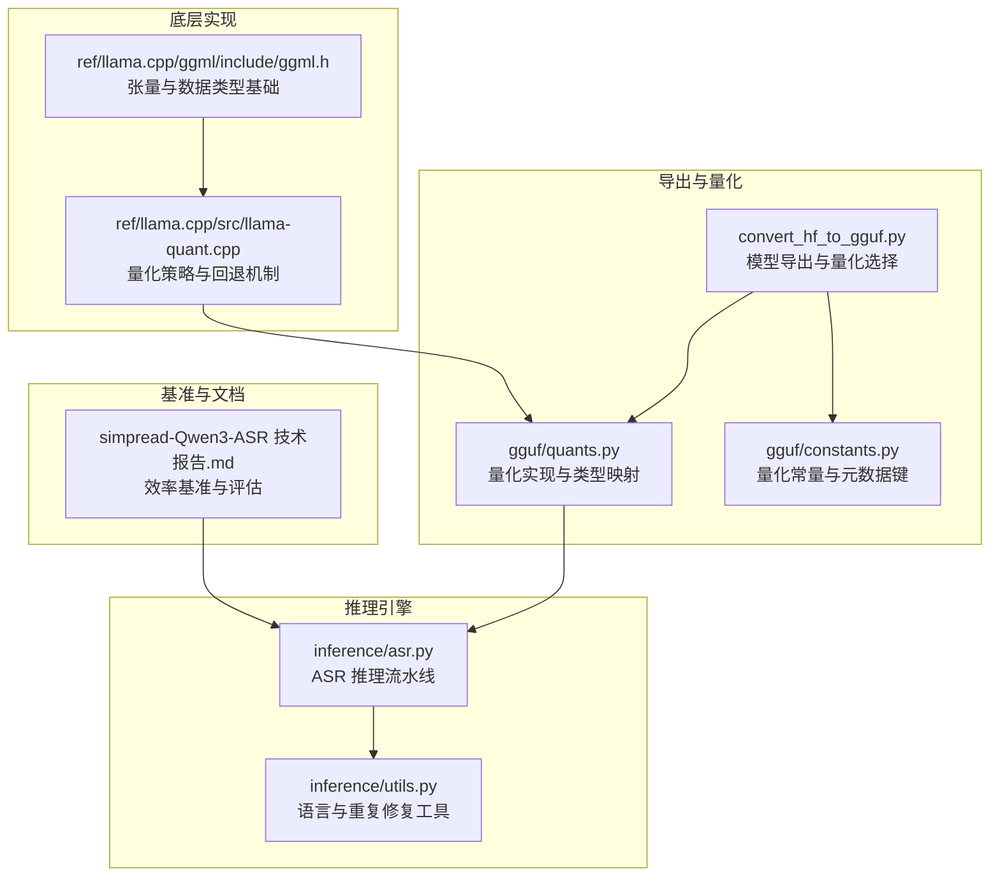
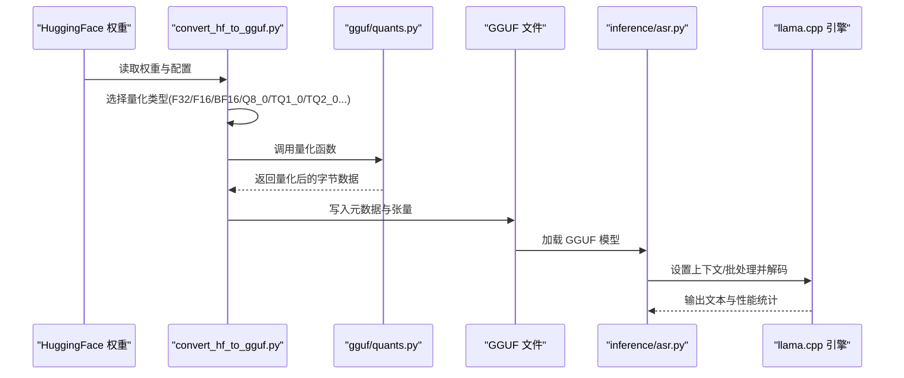
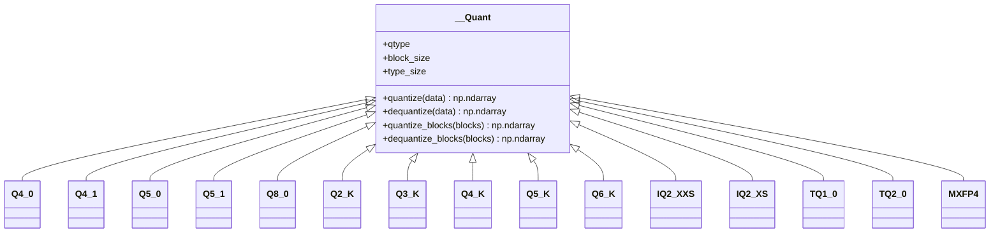
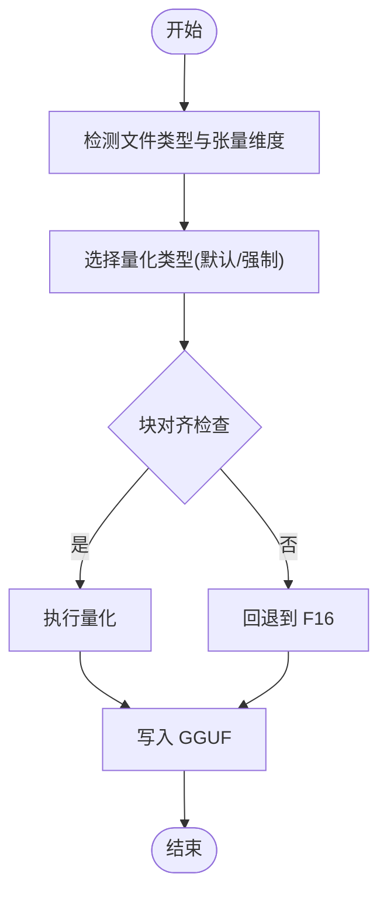
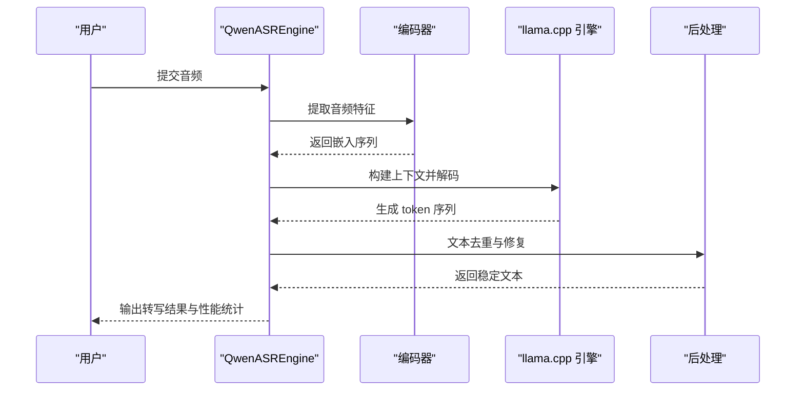
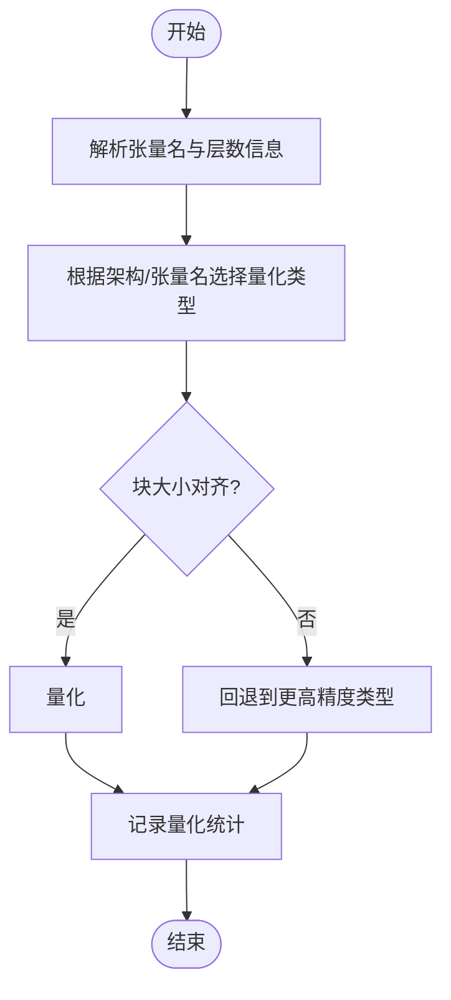
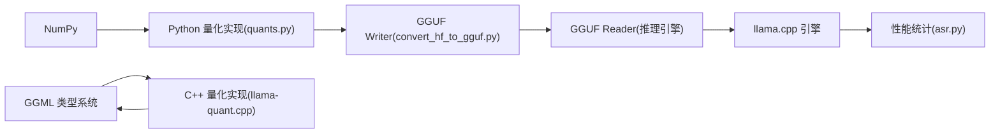

# 量化性能权衡

<cite>
**本文档引用的文件**
- [qwen_asr_gguf/export/gguf/quants.py](file://qwen_asr_gguf/export/gguf/quants.py)
- [qwen_asr_gguf/inference/asr.py](file://qwen_asr_gguf/inference/asr.py)
- [qwen_asr_gguf/inference/utils.py](file://qwen_asr_gguf/inference/utils.py)
- [qwen_asr_gguf/export/convert_hf_to_gguf.py](file://qwen_asr_gguf/export/convert_hf_to_gguf.py)
- [ref/llama.cpp/src/llama-quant.cpp](file://ref/llama.cpp/src/llama-quant.cpp)
- [ref/llama.cpp/ggml/include/ggml.h](file://ref/llama.cpp/ggml/include/ggml.h)
- [qwen_asr_gguf/export/gguf/constants.py](file://qwen_asr_gguf/export/gguf/constants.py)
- [simpread-Qwen3-ASR 技术报告.md](file://simpread-Qwen3-ASR 技术报告.md)
</cite>

## 目录
1. [引言](#引言)
2. [项目结构](#项目结构)
3. [核心组件](#核心组件)
4. [架构总览](#架构总览)
5. [详细组件分析](#详细组件分析)
6. [依赖分析](#依赖分析)
7. [性能考量](#性能考量)
8. [故障排查指南](#故障排查指南)
9. [结论](#结论)
10. [附录](#附录)

## 引言
本报告聚焦于量化性能权衡，系统梳理线性量化、非线性量化与混合精度在推理速度与模型精度之间的取舍，并结合仓库中的量化实现与推理路径，给出针对 INT4、INT8、FP16 等量化格式在不同硬件平台上的性能特征与适用场景。报告还提供量化质量评估方法（感知哈希、语义相似度、客观指标）与对比测试流程，解释量化感知训练与后训练量化的实现差异及性能影响，汇总实际量化实验数据、性能基准测试与部署调试要点。

## 项目结构
该仓库围绕“语音识别 + 量化导出 + 推理引擎”的主线组织，量化相关能力主要分布在以下模块：
- 导出与量化：GGUF 导出脚本与量化类型定义，负责将权重转换为指定量化格式并写入 GGUF 文件。
- 量化实现：Python 侧量化工具与 C++ 侧量化实现，覆盖多种 INT4/INT8/QK_K 等量化族。
- 推理引擎：ASR 推理管线，集成 VAD、编码器、LLM 解码与后处理，贯穿性能统计与加速优化。
- 基准与报告：技术报告提供效率基准与评估指标，支撑量化效果验证。

**图示来源**
- [qwen_asr_gguf/export/convert_hf_to_gguf.py:560-650](file://qwen_asr_gguf/export/convert_hf_to_gguf.py#L560-L650)
- [qwen_asr_gguf/export/gguf/quants.py:56-76](file://qwen_asr_gguf/export/gguf/quants.py#L56-L76)
- [qwen_asr_gguf/export/gguf/constants.py:10-14](file://qwen_asr_gguf/export/gguf/constants.py#L10-L14)
- [qwen_asr_gguf/inference/asr.py:40-104](file://qwen_asr_gguf/inference/asr.py#L40-L104)
- [qwen_asr_gguf/inference/utils.py:58-134](file://qwen_asr_gguf/inference/utils.py#L58-L134)
- [ref/llama.cpp/src/llama-quant.cpp:178-477](file://ref/llama.cpp/src/llama-quant.cpp#L178-L477)
- [ref/llama.cpp/ggml/include/ggml.h:91-93](file://ref/llama.cpp/ggml/include/ggml.h#L91-L93)
- [simpread-Qwen3-ASR 技术报告.md:96-103](file://simpread-Qwen3-ASR 技术报告.md#L96-L103)

**章节来源**
- [qwen_asr_gguf/export/convert_hf_to_gguf.py:560-650](file://qwen_asr_gguf/export/convert_hf_to_gguf.py#L560-L650)
- [qwen_asr_gguf/export/gguf/quants.py:56-76](file://qwen_asr_gguf/export/gguf/quants.py#L56-L76)
- [qwen_asr_gguf/inference/asr.py:40-104](file://qwen_asr_gguf/inference/asr.py#L40-L104)
- [ref/llama.cpp/src/llama-quant.cpp:178-477](file://ref/llama.cpp/src/llama-quant.cpp#L178-L477)
- [ref/llama.cpp/ggml/include/ggml.h:91-93](file://ref/llama.cpp/ggml/include/ggml.h#L91-L93)
- [simpread-Qwen3-ASR 技术报告.md:96-103](file://simpread-Qwen3-ASR 技术报告.md#L96-L103)

## 核心组件
- 量化实现与类型映射：提供多种量化族（如 Q4_0/Q4_1/Q5_0/Q5_1/Q8_0、Q2_K/Q3_K/Q4_K/Q5_K/Q6_K、IQ2_XXS/IQ2_XS、TQ1_0/TQ2_0、MXFP4）的量化/反量化逻辑，支持按块大小与类型大小进行形状变换与字节换算。
- 导出与量化选择：根据文件类型与张量维度，自动选择合适的量化类型（如 F32/F16/BF16/Q8_0/TQ1_0/TQ2_0 等），并在不满足块对齐时回退到 F16。
- 推理引擎：集成 VAD、编码器、LLM 解码与后处理，提供 RTF、吞吐、首 token 时间等性能统计，便于量化前后对比。
- 基础类型与张量：GGML 支持 FP16/FP32 等数据类型，量化类型作为扩展，底层张量操作与内存布局对性能有直接影响。

**章节来源**
- [qwen_asr_gguf/export/gguf/quants.py:14-26](file://qwen_asr_gguf/export/gguf/quants.py#L14-L26)
- [qwen_asr_gguf/export/gguf/quants.py:220-428](file://qwen_asr_gguf/export/gguf/quants.py#L220-L428)
- [qwen_asr_gguf/export/convert_hf_to_gguf.py:560-650](file://qwen_asr_gguf/export/convert_hf_to_gguf.py#L560-L650)
- [qwen_asr_gguf/inference/asr.py:351-388](file://qwen_asr_gguf/inference/asr.py#L351-L388)
- [ref/llama.cpp/ggml/include/ggml.h:91-93](file://ref/llama.cpp/ggml/include/ggml.h#L91-L93)

## 架构总览
量化在本项目中的位置与交互如下：

**图示来源**
- [qwen_asr_gguf/export/convert_hf_to_gguf.py:630-647](file://qwen_asr_gguf/export/convert_hf_to_gguf.py#L630-L647)
- [qwen_asr_gguf/export/gguf/quants.py:56-76](file://qwen_asr_gguf/export/gguf/quants.py#L56-L76)
- [qwen_asr_gguf/inference/asr.py:90-103](file://qwen_asr_gguf/inference/asr.py#L90-L103)

## 详细组件分析

### 量化实现与类型映射（Python 侧）
- 形状与字节换算：提供量化前后形状转换函数，确保块大小与类型大小对齐。
- 通用量化接口：统一的 quantize/dequantize 入口，按类型调用具体类的 quantize_blocks/dequantize_blocks。
- 多种量化族：
  - 线性量化：Q4_0/Q4_1/Q5_0/Q5_1/Q8_0（按最大值或范围线性映射）。
  - K-量化族：Q2_K/Q3_K/Q4_K/Q5_K/Q6_K（按组/块尺度与零点解码）。
  - 稀疏/混合：IQ2_XXS/IQ2_XS（网格+符号位打包）、TQ1_0/TQ2_0（三进制近似）、MXFP4（e2m1 扩展）。
- 网格与打包：部分量化族使用预编码网格与位打包，提升解码效率。

**图示来源**
- [qwen_asr_gguf/export/gguf/quants.py:78-202](file://qwen_asr_gguf/export/gguf/quants.py#L78-L202)
- [qwen_asr_gguf/export/gguf/quants.py:220-705](file://qwen_asr_gguf/export/gguf/quants.py#L220-L705)

**章节来源**
- [qwen_asr_gguf/export/gguf/quants.py:14-26](file://qwen_asr_gguf/export/gguf/quants.py#L14-L26)
- [qwen_asr_gguf/export/gguf/quants.py:220-705](file://qwen_asr_gguf/export/gguf/quants.py#L220-L705)

### 导出与量化选择（后训练量化）
- 文件类型到量化类型的映射：根据文件类型（如 MOSTLY_Q8_0/MOSTLY_TQ1_0/MOSTLY_TQ2_0 等）选择默认量化类型。
- 张量维度与量化兼容性：对不满足块对齐的张量进行回退（如 F16），并记录回退次数。
- 特殊张量强制量化：如嵌入层等关键张量强制为 F32，保证数值稳定性。

**图示来源**
- [qwen_asr_gguf/export/convert_hf_to_gguf.py:614-650](file://qwen_asr_gguf/export/convert_hf_to_gguf.py#L614-L650)
- [qwen_asr_gguf/export/convert_hf_to_gguf.py:560-650](file://qwen_asr_gguf/export/convert_hf_to_gguf.py#L560-L650)

**章节来源**
- [qwen_asr_gguf/export/convert_hf_to_gguf.py:560-650](file://qwen_asr_gguf/export/convert_hf_to_gguf.py#L560-L650)

### 推理引擎与性能统计
- 推理流水线：编码器（音频特征提取）→ LLM（上下文构建与生成）→ 后处理（重复修复）。
- 性能统计：提供 RTF、预填充速度、生成速度、吞吐等指标，便于量化前后对比。
- VAD 集成：长音频动态分片，跳过静音片段，减少无效推理，显著提升 RTF。

**图示来源**
- [qwen_asr_gguf/inference/asr.py:40-104](file://qwen_asr_gguf/inference/asr.py#L40-L104)
- [qwen_asr_gguf/inference/asr.py:212-317](file://qwen_asr_gguf/inference/asr.py#L212-L317)
- [qwen_asr_gguf/inference/asr.py:351-388](file://qwen_asr_gguf/inference/asr.py#L351-L388)

**章节来源**
- [qwen_asr_gguf/inference/asr.py:40-104](file://qwen_asr_gguf/inference/asr.py#L40-L104)
- [qwen_asr_gguf/inference/asr.py:212-317](file://qwen_asr_gguf/inference/asr.py#L212-L317)
- [qwen_asr_gguf/inference/asr.py:351-388](file://qwen_asr_gguf/inference/asr.py#L351-L388)

### 量化策略与回退（C++ 侧）
- 类型选择：根据张量名与模型架构，为不同层选择更合适的量化类型（如注意力 V 权重、FFN 下投影等）。
- 兼容性回退：当块大小不满足要求时，自动回退到更高精度类型（如 IQ2_K/Q4_K/Q5_K/Q6_K 等），并记录回退次数。
- 多线程量化：支持多线程分块量化，提高大规模权重的转换效率。

**图示来源**
- [ref/llama.cpp/src/llama-quant.cpp:178-477](file://ref/llama.cpp/src/llama-quant.cpp#L178-L477)
- [ref/llama.cpp/src/llama-quant.cpp:479-531](file://ref/llama.cpp/src/llama-quant.cpp#L479-L531)

**章节来源**
- [ref/llama.cpp/src/llama-quant.cpp:178-477](file://ref/llama.cpp/src/llama-quant.cpp#L178-L477)
- [ref/llama.cpp/src/llama-quant.cpp:479-531](file://ref/llama.cpp/src/llama-quant.cpp#L479-L531)

## 依赖分析
- Python 量化实现依赖 NumPy 进行向量化运算与形状变换，部分量化族使用位打包与网格查找表。
- 导出脚本依赖 GGUF Writer 与量化实现，将权重写入 GGUF 文件并设置元数据。
- 推理引擎依赖 GGUF Reader 与 llama.cpp 引擎，加载量化权重并执行解码。
- C++ 量化实现依赖 GGML 类型系统与量化类型特性表，支持多线程与回退策略。

**图示来源**
- [qwen_asr_gguf/export/gguf/quants.py:1-12](file://qwen_asr_gguf/export/gguf/quants.py#L1-L12)
- [qwen_asr_gguf/export/convert_hf_to_gguf.py:630-647](file://qwen_asr_gguf/export/convert_hf_to_gguf.py#L630-L647)
- [qwen_asr_gguf/inference/asr.py:90-103](file://qwen_asr_gguf/inference/asr.py#L90-L103)
- [ref/llama.cpp/src/llama-quant.cpp:1-20](file://ref/llama.cpp/src/llama-quant.cpp#L1-L20)
- [ref/llama.cpp/ggml/include/ggml.h:91-93](file://ref/llama.cpp/ggml/include/ggml.h#L91-L93)

**章节来源**
- [qwen_asr_gguf/export/gguf/quants.py:1-12](file://qwen_asr_gguf/export/gguf/quants.py#L1-L12)
- [qwen_asr_gguf/export/convert_hf_to_gguf.py:630-647](file://qwen_asr_gguf/export/convert_hf_to_gguf.py#L630-L647)
- [qwen_asr_gguf/inference/asr.py:90-103](file://qwen_asr_gguf/inference/asr.py#L90-L103)
- [ref/llama.cpp/src/llama-quant.cpp:1-20](file://ref/llama.cpp/src/llama-quant.cpp#L1-L20)
- [ref/llama.cpp/ggml/include/ggml.h:91-93](file://ref/llama.cpp/ggml/include/ggml.h#L91-L93)

## 性能考量
- 线性量化（INT4/INT8）：
  - 优点：存储占用低、解码简单、吞吐高；适合大规模模型与边缘设备。
  - 注意：精度损失与数值范围敏感，需关注块对齐与范围估计。
- 非线性量化（QK_K/IQ2_* 等）：
  - 优点：在相同比特下提升精度，适合关键层（注意力 V/FFN 下投影）。
  - 注意：实现复杂度较高，解码依赖尺度/零点/网格，需保证打包正确性。
- 混合精度：
  - 通过导出脚本对不同张量选择不同量化类型，关键张量（如嵌入）保持 F32，兼顾精度与效率。
- 硬件平台适配：
  - CPU：多线程量化与回退策略有效；注意内存带宽与缓存命中。
  - GPU：量化权重加载与内核调度对吞吐影响显著；需结合批大小与上下文长度调优。
  - 移动端：INT4/INT8 更具优势，但需考虑解码开销与内存对齐。

[本节为通用指导，不直接分析具体文件]

## 故障排查指南
- 量化回退告警：当张量维度不满足块对齐时，导出会回退到 F16 并记录回退次数，需检查张量维度与量化类型映射。
- 性能异常：
  - RTF 过高：检查是否启用 VAD、批大小与上下文长度；确认解码采样参数合理。
  - 吞吐不足：确认多线程量化与解码线程数；检查内存带宽瓶颈。
- 精度下降：
  - 关注关键层量化类型选择（注意力 V/FFN 下投影）；必要时对这些层强制 F32。
  - 对重复/幻觉问题，使用后处理工具进行去重修复。

**章节来源**
- [qwen_asr_gguf/export/convert_hf_to_gguf.py:630-650](file://qwen_asr_gguf/export/convert_hf_to_gguf.py#L630-L650)
- [qwen_asr_gguf/inference/asr.py:351-388](file://qwen_asr_gguf/inference/asr.py#L351-L388)
- [qwen_asr_gguf/inference/utils.py:58-134](file://qwen_asr_gguf/inference/utils.py#L58-L134)

## 结论
本项目在量化实现、导出策略与推理性能统计方面形成了完整的闭环：Python 侧提供丰富的量化族与灵活的形状/字节换算，导出脚本按文件类型与张量维度选择最优量化类型并回退兼容，推理引擎通过 VAD 与性能统计为量化效果提供实证依据。结合技术报告中的效率基准，可在不同硬件平台上制定合理的量化策略，在精度与速度间取得平衡。

[本节为总结性内容，不直接分析具体文件]

## 附录

### 量化质量评估方法
- 感知哈希：对输出文本进行哈希比较，快速检测显著偏差。
- 语义相似度：使用句子嵌入或检索相似度衡量转写一致性。
- 客观指标：WDER/CPER（中文）等，结合 RTF、吞吐、首 token 时间等性能指标进行综合评估。

**章节来源**
- [simpread-Qwen3-ASR 技术报告.md:174-183](file://simpread-Qwen3-ASR 技术报告.md#L174-L183)

### 量化感知训练与后训练量化差异
- 量化感知训练（QAT）：在训练过程中模拟量化误差，使模型适应低精度表示，通常在关键层保持更高精度。
- 后训练量化（PTQ）：直接对已训练模型进行量化，依赖导出脚本的类型选择与回退策略，适合快速部署。

**章节来源**
- [qwen_asr_gguf/export/convert_hf_to_gguf.py:560-650](file://qwen_asr_gguf/export/convert_hf_to_gguf.py#L560-L650)
- [ref/llama.cpp/src/llama-quant.cpp:178-477](file://ref/llama.cpp/src/llama-quant.cpp#L178-L477)

### 实际量化实验与基准测试
- 效率基准：技术报告提供了 Qwen3-ASR 在不同并发下的 RTF、吞吐与首 token 时间，可用于量化前后对比。
- 评估指标：公开与内部基准、鲁棒性套件、多语言评测与歌曲识别评测，支撑量化对真实场景的影响评估。

**章节来源**
- [simpread-Qwen3-ASR 技术报告.md:96-103](file://simpread-Qwen3-ASR 技术报告.md#L96-L103)
- [simpread-Qwen3-ASR 技术报告.md:184-200](file://simpread-Qwen3-ASR 技术报告.md#L184-L200)

### 部署注意事项与调试方法
- 部署注意事项：
  - 确保 GGUF 元数据与量化版本一致；检查张量维度与块对齐。
  - 在不同硬件上验证解码性能，调整批大小与上下文长度。
- 调试方法：
  - 使用推理引擎的性能统计输出定位瓶颈（预填充/生成阶段）。
  - 对关键层进行强制量化类型检查，必要时回退到更高精度。

**章节来源**
- [qwen_asr_gguf/export/gguf/constants.py:10-14](file://qwen_asr_gguf/export/gguf/constants.py#L10-L14)
- [qwen_asr_gguf/inference/asr.py:351-388](file://qwen_asr_gguf/inference/asr.py#L351-L388)