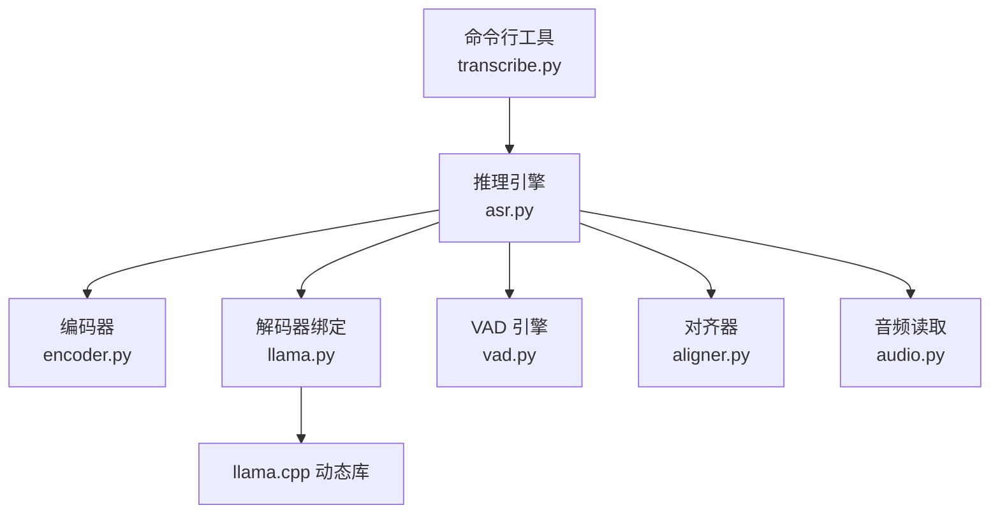
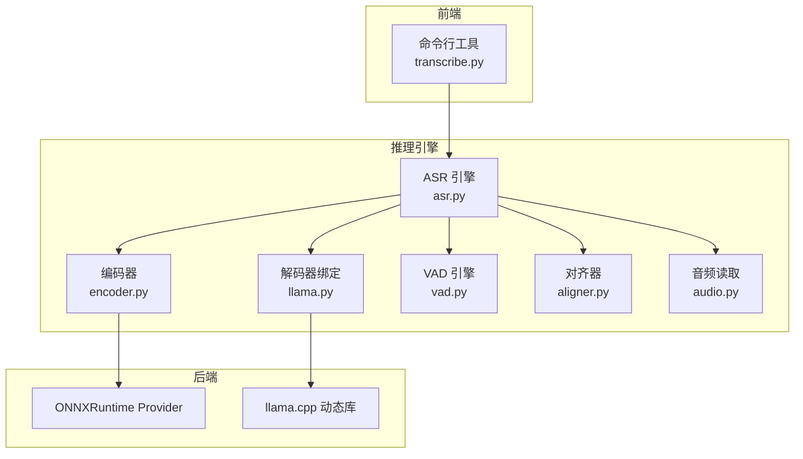
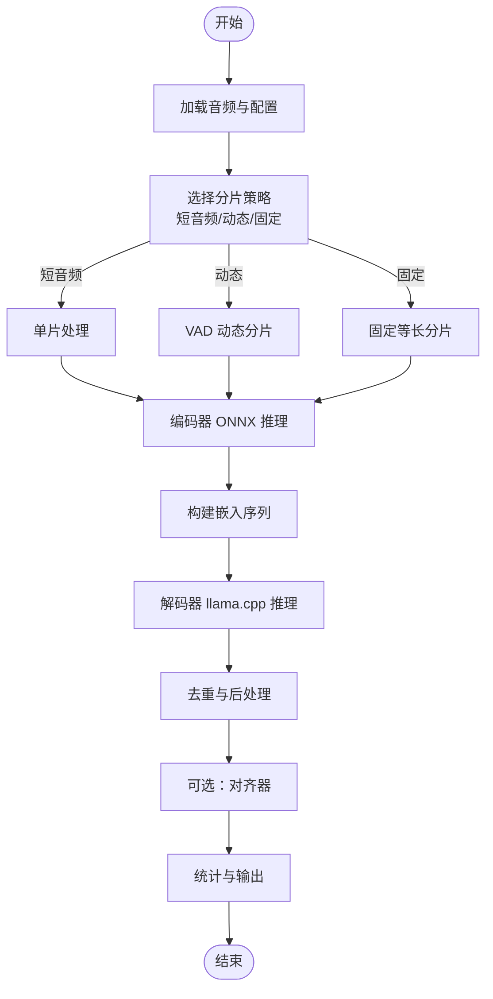
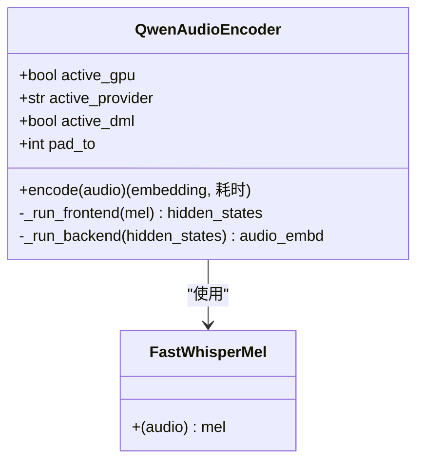
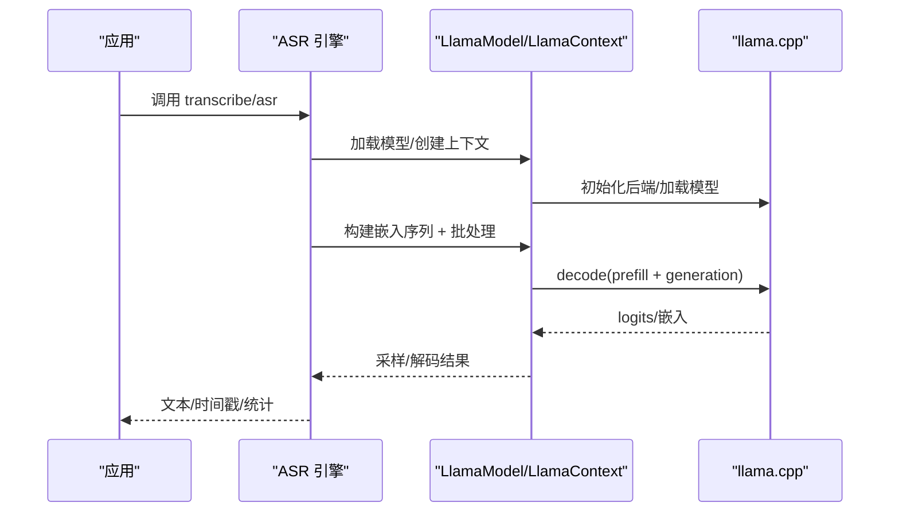
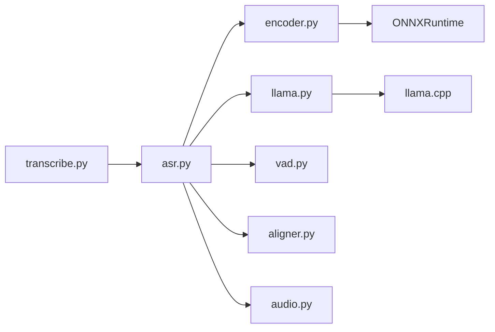
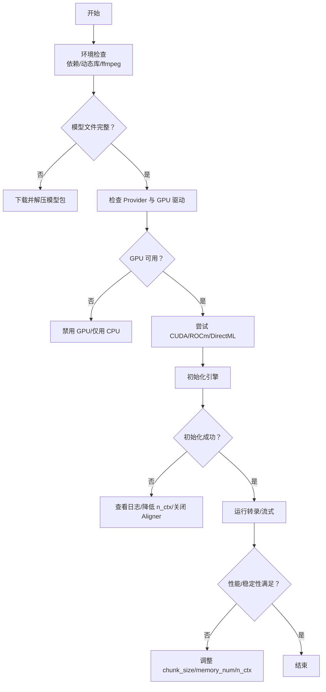

# 故障排除

<cite>
**本文引用的文件**   
- [README.md](file://README.md)
- [transcribe.py](file://transcribe.py)
- [run.sh](file://run.sh)
- [qwen_asr_gguf/inference/asr.py](file://qwen_asr_gguf/inference/asr.py)
- [qwen_asr_gguf/inference/encoder.py](file://qwen_asr_gguf/inference/encoder.py)
- [qwen_asr_gguf/inference/llama.py](file://qwen_asr_gguf/inference/llama.py)
- [qwen_asr_gguf/inference/audio.py](file://qwen_asr_gguf/inference/audio.py)
- [qwen_asr_gguf/inference/aligner.py](file://qwen_asr_gguf/inference/aligner.py)
- [qwen_asr_gguf/inference/vad.py](file://qwen_asr_gguf/inference/vad.py)
- [qwen_asr_gguf/inference/utils.py](file://qwen_asr_gguf/inference/utils.py)
- [qwen_asr_gguf/inference/schema.py](file://qwen_asr_gguf/inference/schema.py)
- [export_config.py](file://export_config.py)
</cite>

## 目录
1. [简介](#简介)
2. [项目结构](#项目结构)
3. [核心组件](#核心组件)
4. [架构总览](#架构总览)
5. [详细组件分析](#详细组件分析)
6. [依赖分析](#依赖分析)
7. [性能注意事项](#性能注意事项)
8. [故障排除指南](#故障排除指南)
9. [结论](#结论)
10. [附录](#附录)

## 简介
本指南面向使用 Qwen3-ASR GGUF 的用户与运维人员，系统性梳理安装、运行时、性能与配置相关问题，提供错误代码与日志解读、调试技巧、平台特有问题（Windows DirectML、Linux CUDA/ROCm）、性能异常排查、日志收集与问题报告模板、以及预防性维护与监控建议。文档以仓库现有实现为依据，结合命令行工具与推理引擎源码，给出可操作的诊断流程与解决方案。

## 项目结构
项目采用“命令行工具 + 推理引擎 + 后端绑定”的分层组织：
- 命令行工具：transcribe.py 提供一键转录、参数校验与模型完整性检查。
- 推理引擎：asr.py 为核心流水线，封装 ONNX 编码器、llama.cpp 解码器、VAD、对齐器。
- 后端绑定：llama.py 提供 llama.cpp 的 ctypes 绑定与上下文/批处理封装。
- 编码器：encoder.py 封装 ONNXRuntime Provider 选择与 DirectML 固定形状优化。
- 音频处理：audio.py 提供 ffmpeg/soundfile 双通道音频读取与重采样。
- 对齐器：aligner.py 提供强制对齐与时间戳修正。
- VAD：vad.py 封装 FireRedVAD，提供自适应阈值与分片构建。
- 配置与数据结构：schema.py 定义配置、消息与结果数据结构。
- 运维脚本：run.sh 提供服务启动/停止/重启。

图表来源
- [transcribe.py:68-205](file://transcribe.py#L68-L205)
- [qwen_asr_gguf/inference/asr.py:40-142](file://qwen_asr_gguf/inference/asr.py#L40-L142)
- [qwen_asr_gguf/inference/encoder.py:119-197](file://qwen_asr_gguf/inference/encoder.py#L119-L197)
- [qwen_asr_gguf/inference/llama.py:159-418](file://qwen_asr_gguf/inference/llama.py#L159-L418)
- [qwen_asr_gguf/inference/audio.py:129-149](file://qwen_asr_gguf/inference/audio.py#L129-L149)
- [qwen_asr_gguf/inference/aligner.py:229-350](file://qwen_asr_gguf/inference/aligner.py#L229-L350)
- [qwen_asr_gguf/inference/vad.py:29-81](file://qwen_asr_gguf/inference/vad.py#L29-L81)

章节来源
- [README.md:316-344](file://README.md#L316-L344)
- [transcribe.py:68-205](file://transcribe.py#L68-L205)

## 核心组件
- 命令行工具：负责参数解析、模型文件完整性检查、引擎初始化与结果导出。
- ASR 引擎：统一的转录流水线，支持一次性与流式两种模式，内置 VAD 动态分片与对齐。
- 编码器：Split 前后端 ONNX 模型，支持 CUDA/ROCm/DirectML 等 Provider，DirectML 下采用固定形状优化。
- 解码器绑定：llama.cpp 的 ctypes 绑定，负责模型加载、上下文、批处理与采样器。
- 音频读取：优先 soundfile，否则回退 ffmpeg，确保多格式兼容。
- 对齐器：基于强制对齐的字级时间戳生成与文本重建。
- VAD：FireRedVAD 封装，提供自适应阈值与分片构建，减少静音段推理。

章节来源
- [transcribe.py:37-67](file://transcribe.py#L37-L67)
- [qwen_asr_gguf/inference/asr.py:40-142](file://qwen_asr_gguf/inference/asr.py#L40-L142)
- [qwen_asr_gguf/inference/encoder.py:119-197](file://qwen_asr_gguf/inference/encoder.py#L119-L197)
- [qwen_asr_gguf/inference/llama.py:159-418](file://qwen_asr_gguf/inference/llama.py#L159-L418)
- [qwen_asr_gguf/inference/audio.py:129-149](file://qwen_asr_gguf/inference/audio.py#L129-L149)
- [qwen_asr_gguf/inference/aligner.py:229-350](file://qwen_asr_gguf/inference/aligner.py#L229-L350)
- [qwen_asr_gguf/inference/vad.py:29-81](file://qwen_asr_gguf/inference/vad.py#L29-L81)

## 架构总览
整体架构为“编码器（ONNX）+ 解码器（GGUF/llama.cpp）+ 对齐器（可选）”，支持 VAD 动态分片与固定分片两种模式，流式与一次性两种调用方式。

图表来源
- [qwen_asr_gguf/inference/asr.py:29-106](file://qwen_asr_gguf/inference/asr.py#L29-L106)
- [qwen_asr_gguf/inference/encoder.py:130-176](file://qwen_asr_gguf/inference/encoder.py#L130-L176)
- [qwen_asr_gguf/inference/llama.py:159-418](file://qwen_asr_gguf/inference/llama.py#L159-L418)
- [qwen_asr_gguf/inference/vad.py:41-81](file://qwen_asr_gguf/inference/vad.py#L41-L81)
- [qwen_asr_gguf/inference/aligner.py:231-257](file://qwen_asr_gguf/inference/aligner.py#L231-L257)
- [qwen_asr_gguf/inference/audio.py:129-149](file://qwen_asr_gguf/inference/audio.py#L129-L149)

## 详细组件分析

### ASR 引擎（asr.py）
- 职责：统一的转录流水线，封装编码、解码、对齐、VAD、统计与流式输出。
- 关键点：
  - 上下文窗口保护：超过 n_ctx 时直接跳过推理，避免崩溃。
  - 重试与去重：解码失败时提高温度重试，最后做重复修复。
  - VAD 动态分片：长音频自动启用，短音频或 VAD 不可用时降级为固定分片。
  - 边界缓冲：固定分片模式在非末尾分片追加 1 秒，提升边界词完整性。

图表来源
- [qwen_asr_gguf/inference/asr.py:602-721](file://qwen_asr_gguf/inference/asr.py#L602-L721)
- [qwen_asr_gguf/inference/asr.py:212-345](file://qwen_asr_gguf/inference/asr.py#L212-L345)

章节来源
- [qwen_asr_gguf/inference/asr.py:40-142](file://qwen_asr_gguf/inference/asr.py#L40-L142)
- [qwen_asr_gguf/inference/asr.py:212-345](file://qwen_asr_gguf/inference/asr.py#L212-L345)
- [qwen_asr_gguf/inference/asr.py:602-721](file://qwen_asr_gguf/inference/asr.py#L602-L721)

### 编码器（encoder.py）
- 职责：Split 前后端 ONNX 模型，支持 Provider 优先级选择与 DirectML 固定形状优化。
- 关键点：
  - Provider 选择：优先 CUDA/ROCm/TensorRT，其次 DirectML，最后 CPU。
  - DirectML 固定形状：在预热阶段填充到 pad_to 秒，构造注意力掩码，减少显存抖动。
  - 前端循环分块：按 100 帧为单位循环推理，拼接后再切有效帧。
  - 后端 Transformer：支持固定形状 Padding 与注意力掩码。

图表来源
- [qwen_asr_gguf/inference/encoder.py:119-197](file://qwen_asr_gguf/inference/encoder.py#L119-L197)
- [qwen_asr_gguf/inference/encoder.py:198-279](file://qwen_asr_gguf/inference/encoder.py#L198-L279)

章节来源
- [qwen_asr_gguf/inference/encoder.py:119-197](file://qwen_asr_gguf/inference/encoder.py#L119-L197)
- [qwen_asr_gguf/inference/encoder.py:198-279](file://qwen_asr_gguf/inference/encoder.py#L198-L279)

### 解码器绑定（llama.py）
- 职责：llama.cpp 的 ctypes 绑定，提供模型/上下文/批处理/采样器封装。
- 关键点：
  - 跨平台加载：根据系统选择 ggml/llama 动态库。
  - 日志回调：将 llama.cpp 日志路由到 Python logger。
  - 批处理：set_embd 支持复杂位置编码与 contiguity 要求。
  - 上下文参数：线程数、Flash-Attn、KV Offload 等。

图表来源
- [qwen_asr_gguf/inference/llama.py:159-418](file://qwen_asr_gguf/inference/llama.py#L159-L418)
- [qwen_asr_gguf/inference/asr.py:212-345](file://qwen_asr_gguf/inference/asr.py#L212-L345)

章节来源
- [qwen_asr_gguf/inference/llama.py:159-418](file://qwen_asr_gguf/inference/llama.py#L159-L418)
- [qwen_asr_gguf/inference/llama.py:772-800](file://qwen_asr_gguf/inference/llama.py#L772-L800)

### 音频读取（audio.py）
- 职责：统一音频读取入口，优先 soundfile，否则回退 ffmpeg。
- 关键点：
  - soundfile 支持格式：.wav, .flac, .ogg, .mp3。
  - ffmpeg 回退：支持 .m4a, .mp4, .opus, .wmv 等。
  - 重采样：高质量 resample_poly 实现，支持目标采样率与单声道。

章节来源
- [qwen_asr_gguf/inference/audio.py:129-149](file://qwen_asr_gguf/inference/audio.py#L129-L149)

### 对齐器（aligner.py）
- 职责：强制对齐与时间戳修正，支持多语种分词与标点恢复。
- 关键点：
  - 分词：日语（nagisa）、韩语（soynlp）、通用（CJK逐字）。
  - 时间戳修正：DP + LIS 重构单调序列，修复异常波动。
  - 文本重建：将标点/空格回填到对齐结果。

章节来源
- [qwen_asr_gguf/inference/aligner.py:17-98](file://qwen_asr_gguf/inference/aligner.py#L17-L98)
- [qwen_asr_gguf/inference/aligner.py:229-350](file://qwen_asr_gguf/inference/aligner.py#L229-L350)

### VAD（vad.py）
- 职责：FireRedVAD 封装，提供自适应阈值与分片构建。
- 关键点：
  - 自适应阈值：基于帧级概率分位数动态调整，避免固定阈值不适应环境。
  - 分片构建：贪心打包 + 上下文缓冲，保证覆盖全时域。

章节来源
- [qwen_asr_gguf/inference/vad.py:160-294](file://qwen_asr_gguf/inference/vad.py#L160-L294)
- [qwen_asr_gguf/inference/vad.py:299-406](file://qwen_asr_gguf/inference/vad.py#L299-L406)

### 配置与数据结构（schema.py）
- 职责：定义配置、消息、结果的数据结构，统一接口契约。
- 关键点：
  - ASREngineConfig/AlignerConfig/VADConfig：集中配置项。
  - VADChunk/ForcedAlignItem：分片与对齐结果标准化。

章节来源
- [qwen_asr_gguf/inference/schema.py:162-210](file://qwen_asr_gguf/inference/schema.py#L162-L210)
- [qwen_asr_gguf/inference/schema.py:133-160](file://qwen_asr_gguf/inference/schema.py#L133-L160)
- [qwen_asr_gguf/inference/schema.py:46-85](file://qwen_asr_gguf/inference/schema.py#L46-L85)

## 依赖分析
- 命令行工具依赖推理引擎与导出器，负责参数校验与模型完整性检查。
- 推理引擎依赖编码器（ONNXRuntime）、解码器绑定（llama.cpp）、VAD、对齐器与音频读取。
- 编码器依赖 ONNXRuntime Provider（CUDA/ROCm/DirectML/CPU）。
- 解码器绑定依赖 llama.cpp 动态库与 ggml 后端。

图表来源
- [transcribe.py:24-26](file://transcribe.py#L24-L26)
- [qwen_asr_gguf/inference/asr.py:49-96](file://qwen_asr_gguf/inference/asr.py#L49-L96)
- [qwen_asr_gguf/inference/encoder.py:130-176](file://qwen_asr_gguf/inference/encoder.py#L130-L176)
- [qwen_asr_gguf/inference/llama.py:159-418](file://qwen_asr_gguf/inference/llama.py#L159-L418)

章节来源
- [transcribe.py:24-26](file://transcribe.py#L24-L26)
- [qwen_asr_gguf/inference/asr.py:49-96](file://qwen_asr_gguf/inference/asr.py#L49-L96)

## 性能注意事项
- 编码器性能：ONNX GPU Provider（CUDA/ROCm/DirectML）显著优于 CPU；DirectML 在固定形状下减少显存抖动。
- 解码器性能：llama.cpp 的上下文窗口、线程数、Flash-Attn、KV Offload 影响吞吐与延迟。
- VAD 性能：长音频启用 VAD 可显著减少静音段推理，降低 RTF。
- 量化策略：int4/int8 编码器与 q4_k 解码器在精度与性能间取得平衡。

章节来源
- [README.md:101-116](file://README.md#L101-L116)
- [qwen_asr_gguf/inference/llama.py:419-441](file://qwen_asr_gguf/inference/llama.py#L419-L441)
- [qwen_asr_gguf/inference/encoder.py:130-176](file://qwen_asr_gguf/inference/encoder.py#L130-L176)

## 故障排除指南

### 一、安装与环境问题
- 症状：命令行工具报错“找不到模型文件”或“引擎初始化失败”。
- 排查步骤：
  - 使用命令行工具的模型完整性检查，确认 ASR/Aligner 所需文件是否存在。
  - 检查模型目录与文件名是否与导出产物一致。
  - 确认 llama.cpp 动态库已放置在推理引擎的 bin 目录。
- 解决方案：
  - 从发布页下载模型压缩包并解压到模型目录。
  - 按 README 的依赖安装说明补齐依赖。
  - 确保 Windows/Linux/macOS 对应的预编译二进制已放置到 qwen_asr_gguf/inference/bin。

章节来源
- [transcribe.py:37-67](file://transcribe.py#L37-L67)
- [transcribe.py:142-160](file://transcribe.py#L142-L160)
- [README.md:135-141](file://README.md#L135-L141)

### 二、运行时错误
- 症状：初始化失败、模型加载失败、FFmpeg 未安装。
- 排查步骤：
  - 查看日志文件 logs/latest.log 或 run.sh 生成的 app.log。
  - 检查环境变量 VK_ICD_FILENAMES 是否被禁用 Vulkan。
  - 确认 ffmpeg 是否安装并加入 PATH。
- 解决方案：
  - 禁用 Vulkan：使用命令行参数 --no-vulkan 或设置 VK_ICD_FILENAMES=none。
  - 安装 ffmpeg 并重启工具。
  - 降低 n_ctx 或关闭 GPU/仅用 CPU 以规避上下文越界。

章节来源
- [transcribe.py:102-104](file://transcribe.py#L102-L104)
- [transcribe.py:152-159](file://transcribe.py#L152-L159)
- [qwen_asr_gguf/inference/audio.py:88-96](file://qwen_asr_gguf/inference/audio.py#L88-L96)
- [qwen_asr_gguf/inference/asr.py:226-237](file://qwen_asr_gguf/inference/asr.py#L226-L237)

### 三、平台特有问题

#### Windows DirectML
- 症状：DirectML 下推理不稳定、显存抖动或性能异常。
- 排查步骤：
  - 确认编码器处于固定形状模式（pad_to > 0）。
  - 检查预热阶段是否完成（固定形状预热）。
- 解决方案：
  - 保持固定形状（pad_to）以获得稳定性能。
  - Intel 集显可能出现 FP16 溢出，设置环境变量禁用 f16：GGML_VK_DISABLE_F16=1。

章节来源
- [qwen_asr_gguf/inference/encoder.py:187-196](file://qwen_asr_gguf/inference/encoder.py#L187-L196)
- [README.md:377-381](file://README.md#L377-L381)

#### Linux CUDA/ROCm
- 症状：GPU Provider 未被识别、显存不足、驱动版本不兼容。
- 排查步骤：
  - 检查 ONNXRuntime 可用 Provider 列表。
  - 确认 CUDA/ROCm 驱动与库版本匹配。
- 解决方案：
  - 优先使用 CUDAExecutionProvider；若不可用，尝试 ROCmExecutionProvider。
  - 降低分片大小或上下文窗口以缓解显存压力。

章节来源
- [qwen_asr_gguf/inference/encoder.py:137-160](file://qwen_asr_gguf/inference/encoder.py#L137-L160)

#### Vulkan（跨平台）
- 症状：Vulkan 设备不可用或性能不佳。
- 排查步骤：
  - 检查 VK_ICD_FILENAMES 是否被禁用。
  - 确认显卡驱动支持 Vulkan。
- 解决方案：
  - 启用 Vulkan（默认），或禁用以回退 CPU。

章节来源
- [transcribe.py:102-104](file://transcribe.py#L102-L104)
- [README.md:135-141](file://README.md#L135-L141)

### 四、性能问题

#### 内存不足（显存/内存）
- 症状：OOM、推理失败、性能骤降。
- 排查步骤：
  - 检查编码器/解码器显存占用与上下文窗口。
  - 观察日志中的 encode_time/prefill_time/decode_time。
- 解决方案：
  - 减少 n_ctx、memory_num、chunk_size。
  - 关闭 Aligner 或降低 Aligner 的 n_ctx。
  - 使用更低精度（int8/int4）的编码器与 q4_k 的解码器。

章节来源
- [README.md:101-116](file://README.md#L101-L116)
- [qwen_asr_gguf/inference/asr.py:351-388](file://qwen_asr_gguf/inference/asr.py#L351-L388)

#### GPU 驱动问题
- 症状：Provider 无法加载、崩溃或性能异常。
- 排查步骤：
  - 确认驱动版本与 CUDA/ROCm 匹配。
  - 检查 ONNXRuntime Provider 可用性。
- 解决方案：
  - 更新驱动或切换到兼容的 Provider。
  - 回退 CPU 以验证模型可用性。

章节来源
- [qwen_asr_gguf/inference/encoder.py:137-160](file://qwen_asr_gguf/inference/encoder.py#L137-L160)

#### 模型加载失败
- 症状：模型加载返回 None、路径不可访问。
- 排查步骤：
  - 检查模型文件是否存在与可读。
  - 确认 llama.cpp 动态库目录与 PATH 设置正确。
- 解决方案：
  - 将动态库放置到推理引擎 bin 目录。
  - 使用相对路径或绝对路径指向模型文件。

章节来源
- [qwen_asr_gguf/inference/llama.py:378-418](file://qwen_asr_gguf/inference/llama.py#L378-L418)

### 五、配置错误
- 症状：语言不支持、上下文越界、分片策略不当。
- 排查步骤：
  - 检查语言名称归一化与支持列表。
  - 确认 n_ctx 与分片长度的关系。
- 解决方案：
  - 使用支持的语言名称（如 Chinese/English）。
  - 调整 n_ctx、chunk_size、memory_num。

章节来源
- [qwen_asr_gguf/inference/utils.py:38-56](file://qwen_asr_gguf/inference/utils.py#L38-L56)
- [qwen_asr_gguf/inference/asr.py:226-237](file://qwen_asr_gguf/inference/asr.py#L226-L237)

### 六、日志分析与调试技巧
- 日志位置：
  - 命令行工具：logs/latest.log。
  - Web 服务：run.sh 启动的日志文件与 PID 文件。
- 日志要点：
  - 编码器 Provider 选择与预热信息。
  - llama.cpp 日志回调（ERROR/WARN/INFO/DEBUG）。
  - 性能统计（encode_time/prefill_time/decode_time）。
- 调试技巧：
  - 逐步降低复杂度：关闭 Aligner、禁用 VAD、仅用 CPU。
  - 使用较小的 n_ctx 与 chunk_size 验证稳定性。
  - 观察 VAD 分片构建与静音跳过效果。

章节来源
- [transcribe.py:152-159](file://transcribe.py#L152-L159)
- [run.sh:9-29](file://run.sh#L9-L29)
- [qwen_asr_gguf/inference/llama.py:772-800](file://qwen_asr_gguf/inference/llama.py#L772-L800)

### 七、系统性问题诊断流程

图表来源
- [transcribe.py:37-67](file://transcribe.py#L37-L67)
- [transcribe.py:142-160](file://transcribe.py#L142-L160)
- [qwen_asr_gguf/inference/encoder.py:137-160](file://qwen_asr_gguf/inference/encoder.py#L137-L160)
- [qwen_asr_gguf/inference/asr.py:226-237](file://qwen_asr_gguf/inference/asr.py#L226-L237)

### 八、日志收集与问题报告模板
- 日志收集：
  - 命令行工具：logs/latest.log。
  - Web 服务：run.sh 生成的 app.log 与 PID 文件。
- 问题报告模板（请按实际情况填写）：
  - 系统信息：操作系统、Python 版本、GPU 型号与驱动版本。
  - 依赖版本：ONNXRuntime、llama.cpp、ffmpeg。
  - 模型信息：编码器/解码器精度、是否启用 Aligner/VAD。
  - 配置参数：n_ctx、chunk_size、memory_num、use_gpu/use_vulkan。
  - 复现步骤：最小化复现脚本或命令行参数。
  - 日志附件：附上 logs/latest.log 或 run.sh 生成的日志文件。

章节来源
- [transcribe.py:152-159](file://transcribe.py#L152-L159)
- [run.sh:9-29](file://run.sh#L9-L29)

### 九、预防性维护与监控建议
- 预防性维护：
  - 定期更新驱动与依赖库。
  - 监控显存与内存使用，避免峰值过高。
  - 保持模型与动态库版本一致。
- 监控告警：
  - 监控推理耗时与 RTF 指标。
  - 监控日志 ERROR/WARN 级别条目。
  - 监控 VAD 分片跳过比例，异常升高可能意味着阈值不合适。

章节来源
- [qwen_asr_gguf/inference/asr.py:351-388](file://qwen_asr_gguf/inference/asr.py#L351-L388)

## 结论
本指南基于仓库现有实现，提供了从环境检查到具体问题定位的系统化流程，覆盖安装、运行时、平台特有问题与性能异常。建议在部署与运维中结合日志与性能统计持续监控，并按模板提交问题报告以便快速定位与修复。

## 附录

### A. 常见错误与含义（基于源码行为）
- 上下文越界保护：超过 n_ctx 时直接跳过推理，避免崩溃。
- VAD 初始化失败：缺少 FireRedVAD 依赖或模型路径错误。
- FFmpeg 未安装：音频读取失败，需安装并加入 PATH。
- Provider 不可用：ONNXRuntime 未检测到 CUDA/ROCm/DirectML，回退 CPU。
- 模型加载失败：llama.cpp 动态库路径或模型路径错误。

章节来源
- [qwen_asr_gguf/inference/asr.py:226-237](file://qwen_asr_gguf/inference/asr.py#L226-L237)
- [qwen_asr_gguf/inference/vad.py:51-59](file://qwen_asr_gguf/inference/vad.py#L51-L59)
- [qwen_asr_gguf/inference/audio.py:88-96](file://qwen_asr_gguf/inference/audio.py#L88-L96)
- [qwen_asr_gguf/inference/encoder.py:137-160](file://qwen_asr_gguf/inference/encoder.py#L137-L160)
- [qwen_asr_gguf/inference/llama.py:408-418](file://qwen_asr_gguf/inference/llama.py#L408-L418)

### B. 导出与配置参考
- 导出配置：export_config.py 定义源模型与导出目录。
- 导出流程：参考 README 的导出步骤，确保前后端模型与量化参数一致。

章节来源
- [export_config.py:1-12](file://export_config.py#L1-L12)
- [README.md:163-208](file://README.md#L163-L208)