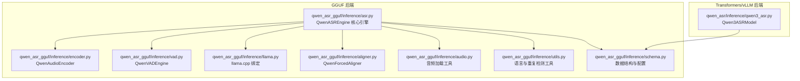
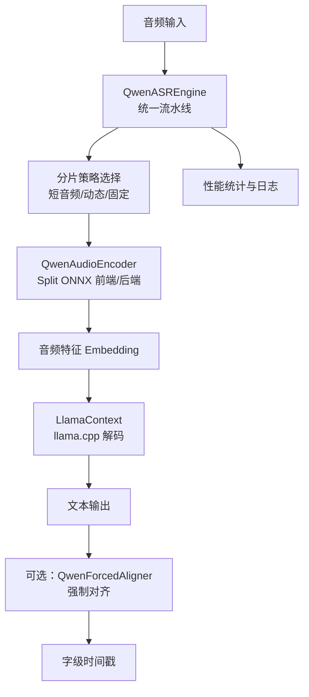
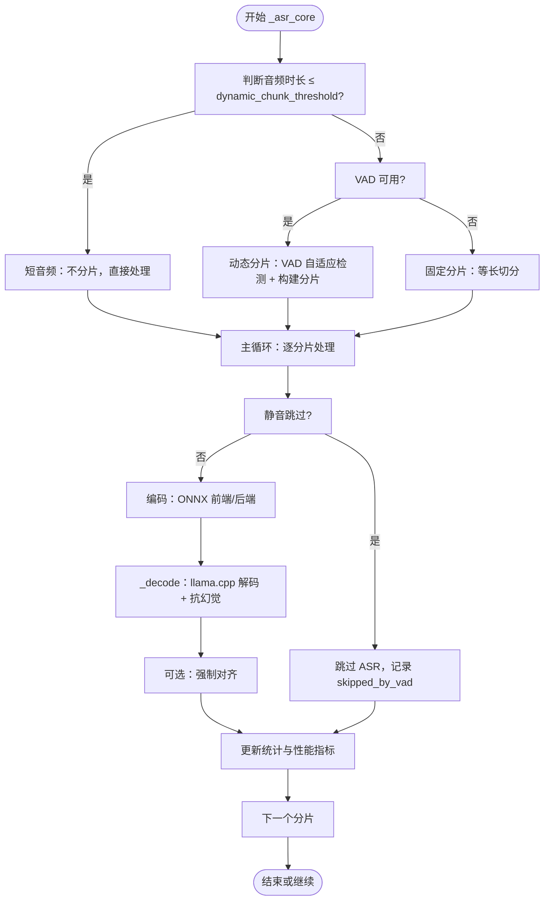
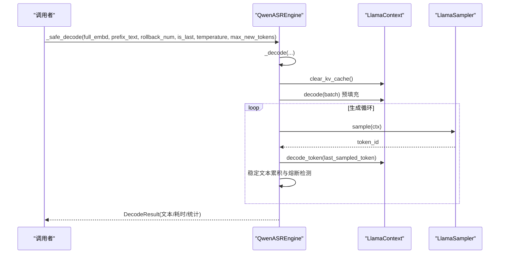
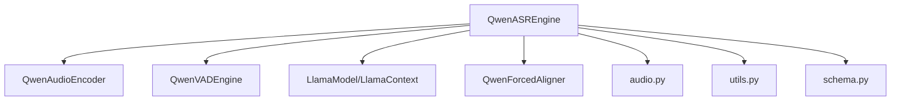

# ASR引擎核心

<cite>
**本文引用的文件**
- [README.md](file://README.md)
- [qwen_asr_gguf/inference/asr.py](file://qwen_asr_gguf/inference/asr.py)
- [qwen_asr_gguf/inference/schema.py](file://qwen_asr_gguf/inference/schema.py)
- [qwen_asr_gguf/inference/encoder.py](file://qwen_asr_gguf/inference/encoder.py)
- [qwen_asr_gguf/inference/vad.py](file://qwen_asr_gguf/inference/vad.py)
- [qwen_asr_gguf/inference/llama.py](file://qwen_asr_gguf/inference/llama.py)
- [qwen_asr_gguf/inference/aligner.py](file://qwen_asr_gguf/inference/aligner.py)
- [qwen_asr_gguf/inference/audio.py](file://qwen_asr_gguf/inference/audio.py)
- [qwen_asr_gguf/inference/utils.py](file://qwen_asr_gguf/inference/utils.py)
- [examples/example_qwen3_asr_vllm.py](file://examples/example_qwen3_asr_vllm.py)
- [qwen_asr/inference/qwen3_asr.py](file://qwen_asr/inference/qwen3_asr.py)
</cite>

## 目录
1. [简介](#简介)
2. [项目结构](#项目结构)
3. [核心组件](#核心组件)
4. [架构总览](#架构总览)
5. [详细组件分析](#详细组件分析)
6. [依赖关系分析](#依赖关系分析)
7. [性能考量](#性能考量)
8. [故障排查指南](#故障排查指南)
9. [结论](#结论)
10. [附录](#附录)

## 简介
本技术文档围绕 Qwen3-ASR 引擎（GGUF 后端）展开，重点阐述 QwenASREngine 类的架构设计、初始化流程与核心算法实现，深入解析统一流水线 _asr_core 的工作机制，包括动态分片策略、VAD 集成、内存管理、抗幻觉机制等关键技术。同时对比一次性转录（asr）与流式转录（asr_stream）的差异与适用场景，提供完整的 API 接口说明、参数配置选项、性能统计功能与错误处理机制，并给出具体示例以帮助开发者快速上手。

## 项目结构
本仓库包含两类 ASR 实现：
- GGUF 后端（本篇重点）：基于 llama.cpp 的 GGUF 解码器与 ONNX 编码器的混合架构，支持 VAD 动态分片、流式输出与可选的强制对齐。
- Transformers/vLLM 后端：位于 qwen_asr 包，提供统一推理包装器 Qwen3ASRModel，支持一次性与流式转录（vLLM 仅支持流式）。

图表来源
- [qwen_asr_gguf/inference/asr.py:40-142](file://qwen_asr_gguf/inference/asr.py#L40-L142)
- [qwen_asr_gguf/inference/encoder.py:119-196](file://qwen_asr_gguf/inference/encoder.py#L119-L196)
- [qwen_asr_gguf/inference/vad.py:29-81](file://qwen_asr_gguf/inference/vad.py#L29-L81)
- [qwen_asr_gguf/inference/llama.py:443-548](file://qwen_asr_gguf/inference/llama.py#L443-L548)
- [qwen_asr_gguf/inference/aligner.py:229-259](file://qwen_asr_gguf/inference/aligner.py#L229-L259)
- [qwen_asr_gguf/inference/audio.py:129-149](file://qwen_asr_gguf/inference/audio.py#L129-L149)
- [qwen_asr_gguf/inference/utils.py:5-56](file://qwen_asr_gguf/inference/utils.py#L5-L56)
- [qwen_asr_gguf/inference/schema.py:162-235](file://qwen_asr_gguf/inference/schema.py#L162-L235)
- [qwen_asr/inference/qwen3_asr.py:131-224](file://qwen_asr/inference/qwen3_asr.py#L131-L224)

章节来源
- [README.md:316-344](file://README.md#L316-L344)

## 核心组件
- QwenASREngine：统一流水线引擎，负责分片策略选择、VAD 集成、编码器调用、LLM 解码、对齐与统计输出。
- QwenAudioEncoder：Split 前端/后端 ONNX 编码器，支持动态/固定形状模式与 GPU Provider。
- QwenVADEngine：FireRedVAD 封装，提供自适应阈值检测与分片构建。
- LlamaModel/LlamaContext/LlamaBatch/LlamaSampler：llama.cpp Python 绑定，提供模型加载、上下文管理、批处理与采样器。
- QwenForcedAligner：强制对齐器，基于 ONNX 编码器与 GGUF 解码器的对齐流水线。
- ASREngineConfig/Schema：配置与数据结构定义，涵盖分片、上下文记忆、VAD、对齐等参数。

章节来源
- [qwen_asr_gguf/inference/asr.py:40-142](file://qwen_asr_gguf/inference/asr.py#L40-L142)
- [qwen_asr_gguf/inference/encoder.py:119-196](file://qwen_asr_gguf/inference/encoder.py#L119-L196)
- [qwen_asr_gguf/inference/vad.py:29-81](file://qwen_asr_gguf/inference/vad.py#L29-L81)
- [qwen_asr_gguf/inference/llama.py:443-548](file://qwen_asr_gguf/inference/llama.py#L443-L548)
- [qwen_asr_gguf/inference/aligner.py:229-259](file://qwen_asr_gguf/inference/aligner.py#L229-L259)
- [qwen_asr_gguf/inference/schema.py:162-235](file://qwen_asr_gguf/inference/schema.py#L162-L235)

## 架构总览
GGUF 后端采用“编码器（ONNX）+ 解码器（GGUF）”的混合架构，结合 VAD 动态分片与抗幻觉策略，实现高吞吐与低延迟的转录能力。

图表来源
- [qwen_asr_gguf/inference/asr.py:602-632](file://qwen_asr_gguf/inference/asr.py#L602-L632)
- [qwen_asr_gguf/inference/encoder.py:260-280](file://qwen_asr_gguf/inference/encoder.py#L260-L280)
- [qwen_asr_gguf/inference/llama.py:487-548](file://qwen_asr_gguf/inference/llama.py#L487-L548)
- [qwen_asr_gguf/inference/aligner.py:229-348](file://qwen_asr_gguf/inference/aligner.py#L229-L348)

## 详细组件分析

### QwenASREngine 类与初始化流程
- 初始化阶段：
  - 解析配置（ASREngineConfig），确定模型路径、分片大小、上下文记忆数、是否启用对齐与 VAD。
  - 加载 ONNX 编码器（前端/后端），按需选择动态/固定形状模式。
  - 可选加载强制对齐器（QwenForcedAligner）。
  - 延迟加载 VAD（QwenVADEngine），仅在长音频且阈值满足时启用。
  - 加载 GGUF 解码器（LlamaModel + LlamaContext），准备采样器与嵌入表。

- 生命周期与资源管理：
  - 提供 shutdown 方法释放 VAD 与日志记录。
  - 统一的日志输出与性能统计接口。

章节来源
- [qwen_asr_gguf/inference/asr.py:49-142](file://qwen_asr_gguf/inference/asr.py#L49-L142)
- [qwen_asr_gguf/inference/schema.py:162-210](file://qwen_asr_gguf/inference/schema.py#L162-L210)

### 统一流水线 _asr_core 的工作机制
- 分片策略三级选择：
  - 短音频（≤ dynamic_chunk_threshold）：不分片，直接处理。
  - 长音频 + VAD 可用：自适应阈值 VAD 动态分片，按语音边界组合，避免静音中间截断。
  - 长音频 + VAD 不可用：固定等长分片，作为降级方案。
- VAD 集成与静音跳过：
  - 对每个分片执行 VAD 判断，静音分片直接跳过 ASR 推理，减少 RTF 与幻觉风险。
- 编码与解码：
  - 动态模式：仅对实际语音长度编码，避免 pad 到固定长度。
  - 固定模式：补零至标准分片长度，保持编码器固定输入尺寸。
- 抗幻觉机制：
  - 解码内核：n_ctx 越界保护，token 级重复熔断（15-token 窗口，≤3 种 token），n-gram 短语级重复熔断，max_new_tokens 上限。
  - 后处理：detect_and_fix_repetitions 去重算法。
- 上下文记忆与前缀策略：
  - VAD 模式：仅用文本上下文，不重放前片段音频，限制前缀长度（末尾 100 字符），避免非连续音频拼接导致的模型混乱。
  - 固定模式：边界音频缓冲（仅固定分片模式），在 chunk 尾部额外附加 1 秒音频，提升边界词句完整性。
- 对齐与统计：
  - 可选对齐：对每个分片的文本执行强制对齐，合并时间戳。
  - 统计：编码耗时、预填充/生成耗时、对齐耗时、VAD 耗时与跳过的分片数。

图表来源
- [qwen_asr_gguf/inference/asr.py:602-721](file://qwen_asr_gguf/inference/asr.py#L602-L721)
- [qwen_asr_gguf/inference/asr.py:754-774](file://qwen_asr_gguf/inference/asr.py#L754-L774)
- [qwen_asr_gguf/inference/asr.py:790-806](file://qwen_asr_gguf/inference/asr.py#L790-L806)

章节来源
- [qwen_asr_gguf/inference/asr.py:602-806](file://qwen_asr_gguf/inference/asr.py#L602-L806)

### 解码内核 _decode 与 _safe_decode
- _decode：执行单次 LLM 生成循环，包含预填充与生成阶段，支持 n_ctx 越界保护与保守熔断。
- _safe_decode：带熔断加温重试的高层封装，最多重试 3 次，温度逐步提升，最后进行去重后处理。

图表来源
- [qwen_asr_gguf/inference/asr.py:212-317](file://qwen_asr_gguf/inference/asr.py#L212-L317)
- [qwen_asr_gguf/inference/asr.py:319-345](file://qwen_asr_gguf/inference/asr.py#L319-L345)
- [qwen_asr_gguf/inference/llama.py:487-548](file://qwen_asr_gguf/inference/llama.py#L487-L548)
- [qwen_asr_gguf/inference/llama.py:635-738](file://qwen_asr_gguf/inference/llama.py#L635-L738)

章节来源
- [qwen_asr_gguf/inference/asr.py:212-345](file://qwen_asr_gguf/inference/asr.py#L212-L345)
- [qwen_asr_gguf/inference/llama.py:487-738](file://qwen_asr_gguf/inference/llama.py#L487-L738)

### 编码器 QwenAudioEncoder
- Split 前端/后端：前端按 100 帧分块循环推理，后端 Transformer 支持固定形状 Padding 与 Attention Mask。
- 动态/固定形状：动态模式下预热短音频，固定模式下预热固定长度音频；DirectML 下建议固定形状以减少显存抖动。
- GPU Provider：优先 CUDA/ROCm/TensorRT/DirectML，回退 CPU。

章节来源
- [qwen_asr_gguf/inference/encoder.py:119-280](file://qwen_asr_gguf/inference/encoder.py#L119-L280)

### VAD 引擎 QwenVADEngine
- FireRedVAD 封装：支持 detect/adaptive_detect/build_chunks 等接口，提供自适应阈值与分片构建。
- 自适应阈值：基于帧级语音概率分布，取 30% 分位数作为新阈值，避免静音帧拉低阈值。
- 分片构建：合并近邻语音段、贪心打包、插入静音分片，保证覆盖全时域。

章节来源
- [qwen_asr_gguf/inference/vad.py:29-467](file://qwen_asr_gguf/inference/vad.py#L29-L467)

### 强制对齐器 QwenForcedAligner
- 编码器：复用 QwenAudioEncoder，统一编码路径。
- Prompt 构建：官方结构 <audio>+word+<TS>+<TS>+...，仅计算时间戳位置的 logits 以加速。
- 时间戳修复：DP+LIS 重建单调序列，修复异常波动。
- 重组：将缺失标点与空格找回，补全时间戳。

章节来源
- [qwen_asr_gguf/inference/aligner.py:229-348](file://qwen_asr_gguf/inference/aligner.py#L229-L348)

### 一次性转录（asr）与流式转录（asr_stream）对比
- asr（一次性）：
  - 输入为完整音频 numpy 数组，内部调用 _asr_core 生成器，收集所有分片结果后一次性返回。
  - 适合批量处理、API 离线接口等不需要实时推流的场景。
- asr_stream（生成器）：
  - 直接透传 _asr_core 的 yield 流，逐分片产出 StreamChunkResult，适合 SSE/WS 等需要实时推送的场景。
  - 每次 yield 代表一个 30s 分片处理完毕，skipped_by_vad=True 表示静音跳过，is_last=True 表示最后一个分片，full_text 含完整文本。

章节来源
- [qwen_asr_gguf/inference/asr.py:519-596](file://qwen_asr_gguf/inference/asr.py#L519-L596)

### API 接口说明与参数配置
- QwenASREngine(config: ASREngineConfig)
  - config.model_dir：模型根目录
  - config.use_gpu：是否启用 GPU
  - config.chunk_size：分片时长（秒）
  - config.memory_num：保留前 N 个分片的记忆作为上下文
  - config.enable_aligner：是否启用对齐
  - config.align_config：对齐器配置
  - config.pad_to：编码器填充时长（秒）
  - config.vad_config：VAD 配置
  - config.dynamic_chunk_threshold：启用 VAD 的动态分片阈值（秒）

- asr(audio, context, language, chunk_size_sec, memory_chunks, temperature, rollback_num, enable_aligner)
  - 返回 TranscribeResult，包含 text、alignment（可选）与 performance（可选）。

- asr_stream(audio, context, language, chunk_size_sec, memory_chunks, temperature, rollback_num, enable_aligner)
  - 返回 Generator[StreamChunkResult]，逐分片产出结果。

- transcribe(audio_file, language, context, start_second, duration, temperature, rollback_num, enable_aligner)
  - 离线转录入口，加载整段音频后返回完整 TranscribeResult。

- transcribe_stream(audio_file, language, context, start_second, duration, temperature, rollback_num, enable_aligner)
  - 流式转录入口，逐分片 yield，适合实时推送。

章节来源
- [qwen_asr_gguf/inference/asr.py:432-514](file://qwen_asr_gguf/inference/asr.py#L432-L514)
- [qwen_asr_gguf/inference/asr.py:519-596](file://qwen_asr_gguf/inference/asr.py#L519-L596)
- [qwen_asr_gguf/inference/schema.py:162-235](file://qwen_asr_gguf/inference/schema.py#L162-L235)

### 性能统计功能
- 统计字段：prefill_time、decode_time、prefill_tokens、decode_tokens、encode_time、align_time、vad_time、vad_skipped_chunks、audio_duration。
- 打印函数：_print_stats，输出 RTF、音频时长、总处理耗时、各阶段耗时与速率。

章节来源
- [qwen_asr_gguf/inference/asr.py:351-388](file://qwen_asr_gguf/inference/asr.py#L351-L388)

### 错误处理机制
- VAD 延迟加载失败：捕获异常并降级为固定分片。
- n_ctx 越界保护：超过上下文窗口时返回空结果并标记 is_aborted。
- 保守熔断：重复 token 窗口检测，极端死循环时熔断。
- 温度递增重试：_safe_decode 最多重试 3 次，温度逐步提升。
- 语言校验：normalize_language_name 与 validate_language。

章节来源
- [qwen_asr_gguf/inference/asr.py:108-136](file://qwen_asr_gguf/inference/asr.py#L108-L136)
- [qwen_asr_gguf/inference/asr.py:230-237](file://qwen_asr_gguf/inference/asr.py#L230-L237)
- [qwen_asr_gguf/inference/asr.py:319-345](file://qwen_asr_gguf/inference/asr.py#L319-L345)
- [qwen_asr_gguf/inference/utils.py:38-56](file://qwen_asr_gguf/inference/utils.py#L38-L56)

### 代码示例（Python）
- 实例化与调用（GGUF 后端）：
  - 参考 README 中的示例配置与调用方式，初始化 ASREngine，执行 transcribe 或 asr。
- Transformers/vLLM 后端示例：
  - 参考 examples/example_qwen3_asr_vllm.py，展示 Qwen3ASRModel 的 LLM 初始化、批量推理与强制语言与时间戳输出。

章节来源
- [README.md:263-294](file://README.md#L263-L294)
- [examples/example_qwen3_asr_vllm.py:131-153](file://examples/example_qwen3_asr_vllm.py#L131-L153)
- [qwen_asr/inference/qwen3_asr.py:131-224](file://qwen_asr/inference/qwen3_asr.py#L131-L224)

## 依赖关系分析
- 组件耦合与协作：
  - QwenASREngine 依赖 QwenAudioEncoder、QwenVADEngine、LlamaModel/LlamaContext、QwenForcedAligner、音频加载与工具模块。
  - 编码器与解码器通过嵌入表与 Token ID 对齐，Prompt 构建遵循官方模板。
  - VAD 与对齐器共享统一的数据结构（VADChunk、ForcedAlignItem 等）。

图表来源
- [qwen_asr_gguf/inference/asr.py:49-142](file://qwen_asr_gguf/inference/asr.py#L49-L142)
- [qwen_asr_gguf/inference/encoder.py:119-196](file://qwen_asr_gguf/inference/encoder.py#L119-L196)
- [qwen_asr_gguf/inference/vad.py:29-81](file://qwen_asr_gguf/inference/vad.py#L29-L81)
- [qwen_asr_gguf/inference/llama.py:443-548](file://qwen_asr_gguf/inference/llama.py#L443-L548)
- [qwen_asr_gguf/inference/aligner.py:229-259](file://qwen_asr_gguf/inference/aligner.py#L229-L259)
- [qwen_asr_gguf/inference/audio.py:129-149](file://qwen_asr_gguf/inference/audio.py#L129-L149)
- [qwen_asr_gguf/inference/utils.py:5-56](file://qwen_asr_gguf/inference/utils.py#L5-L56)
- [qwen_asr_gguf/inference/schema.py:162-235](file://qwen_asr_gguf/inference/schema.py#L162-L235)

## 性能考量
- 编码器性能：
  - ONNX GPU Provider（CUDA/ROCm/DirectML）显著提升编码速度；DirectML 下固定形状模式可减少显存抖动。
  - 动态分片模式仅对实际语音长度编码，避免 pad 到固定长度，降低无效计算。
- 解码器性能：
  - llama.cpp 通过上下文窗口与批处理优化，采样器链路支持温度、Top-K/Top-P、惩罚等策略。
  - 预填充与生成阶段分别统计耗时与速率，便于定位瓶颈。
- VAD 性能：
  - 自适应阈值减少误判，提高跳过效率；build_chunks 合并近邻语音段，减少分片数量。
- 抗幻觉：
  - 重复熔断与去重算法在解码阶段与后处理阶段协同工作，显著降低幻觉风险。

[本节为通用指导，无需特定文件引用]

## 故障排查指南
- VAD 延迟加载失败：
  - 现象：长音频自动启用 VAD 时失败，引擎降级为固定分片。
  - 处理：确认 fireredvad 安装与模型路径正确，或手动禁用 VAD。
- n_ctx 越界：
  - 现象：序列长度超过 n_ctx，触发熔断并返回空结果。
  - 处理：检查上下文与分片策略，适当缩短分片或增大 n_ctx。
- 温度递增重试：
  - 现象：解码过程中重复/幻觉，温度逐步提升后重试。
  - 处理：检查输入语言与上下文，必要时降低温度或调整提示词。
- DirectML 性能抖动：
  - 现象：动态形状导致显存频繁分配，性能不稳定。
  - 处理：启用固定形状模式（pad_to），配合 Attention Mask。

章节来源
- [qwen_asr_gguf/inference/asr.py:108-136](file://qwen_asr_gguf/inference/asr.py#L108-L136)
- [qwen_asr_gguf/inference/asr.py:230-237](file://qwen_asr_gguf/inference/asr.py#L230-L237)
- [qwen_asr_gguf/inference/asr.py:319-345](file://qwen_asr_gguf/inference/asr.py#L319-L345)
- [qwen_asr_gguf/inference/encoder.py:187-196](file://qwen_asr_gguf/inference/encoder.py#L187-L196)

## 结论
QwenASREngine 通过“编码器 + 解码器”的混合架构与 VAD 动态分片策略，实现了高吞吐、低延迟与强鲁棒性的语音转录能力。其统一流水线 _asr_core 将分片策略、静音跳过、抗幻觉与对齐整合为一致的处理流程，既适合离线批量处理，也能满足实时流式场景。配合完善的性能统计与错误处理机制，为生产环境提供了可靠的工程化保障。

[本节为总结性内容，无需特定文件引用]

## 附录
- 术语说明：
  - RTF：实时率，总处理耗时与音频时长之比，越小越好。
  - VAD：语音活动检测，用于识别语音段与静音段。
  - 对齐：强制对齐，将文本与音频时间戳对齐，输出字级时间戳。
- 相关文件：
  - README.md：项目概述、性能数据与快速开始。
  - schema.py：配置与数据结构定义。
  - audio.py：音频加载工具。
  - utils.py：语言归一化与重复检测工具。

章节来源
- [README.md:1-389](file://README.md#L1-L389)
- [qwen_asr_gguf/inference/schema.py:162-235](file://qwen_asr_gguf/inference/schema.py#L162-L235)
- [qwen_asr_gguf/inference/audio.py:129-149](file://qwen_asr_gguf/inference/audio.py#L129-L149)
- [qwen_asr_gguf/inference/utils.py:5-56](file://qwen_asr_gguf/inference/utils.py#L5-L56)