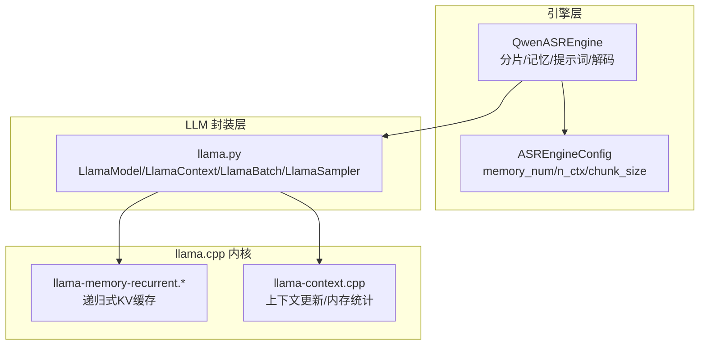
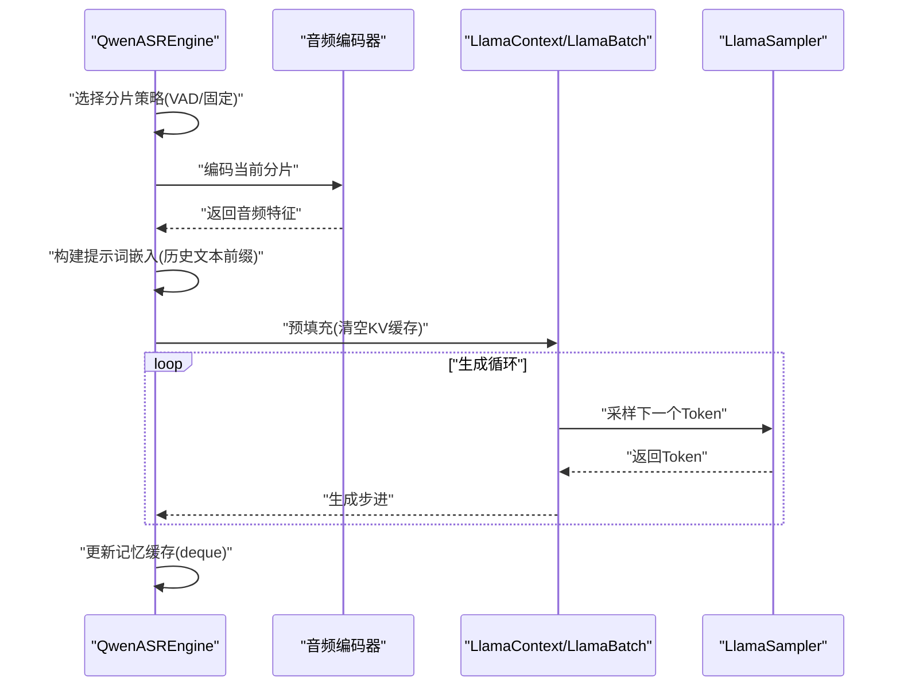
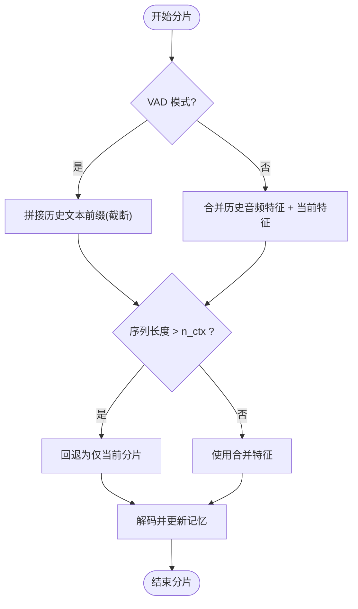
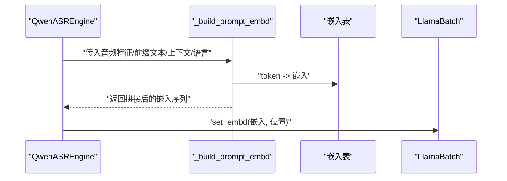
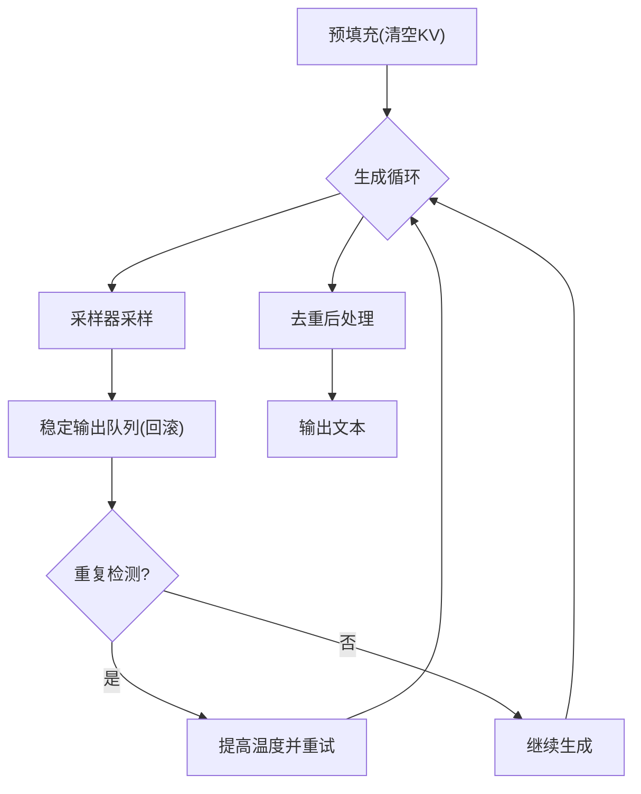
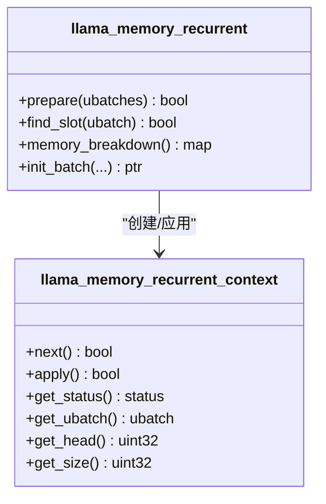
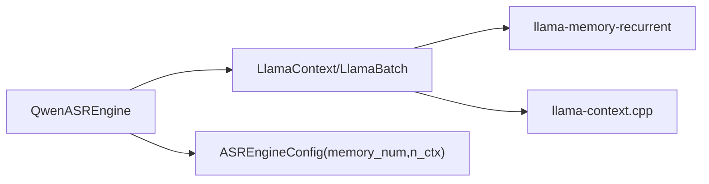

# 内存管理与上下文缓存

<cite>
**本文档引用的文件**
- [qwen_asr_gguf/inference/asr.py](file://qwen_asr_gguf/inference/asr.py)
- [qwen_asr_gguf/inference/schema.py](file://qwen_asr_gguf/inference/schema.py)
- [qwen_asr_gguf/inference/llama.py](file://qwen_asr_gguf/inference/llama.py)
- [ref/llama.cpp/src/llama-memory-recurrent.cpp](file://ref/llama.cpp/src/llama-memory-recurrent.cpp)
- [ref/llama.cpp/src/llama-memory-recurrent.h](file://ref/llama.cpp/src/llama-memory-recurrent.h)
- [ref/llama.cpp/src/llama-context.cpp](file://ref/llama.cpp/src/llama-context.cpp)
- [ref/llama.cpp/src/llama.cpp](file://ref/llama.cpp/src/llama.cpp)
- [ref/llama.cpp/tools/completion/completion.cpp](file://ref/llama.cpp/tools/completion/completion.cpp)
- [qwen_asr_gguf/inference/utils.py](file://qwen_asr_gguf/inference/utils.py)
</cite>

## 目录
1. [简介](#简介)
2. [项目结构](#项目结构)
3. [核心组件](#核心组件)
4. [架构总览](#架构总览)
5. [详细组件分析](#详细组件分析)
6. [依赖关系分析](#依赖关系分析)
7. [性能考量](#性能考量)
8. [故障排查指南](#故障排查指南)
9. [结论](#结论)
10. [附录](#附录)

## 简介
本技术文档聚焦于 QwenASR 引擎的“内存管理与上下文缓存”能力，系统阐述以下主题：
- ASR 记忆机制的实现原理：基于 deque 双向队列的上下文缓存、音频嵌入缓存策略、文本上下文记忆管理。
- memory_chunks 参数的作用机制：缓存容量控制、滚动窗口与淘汰策略、与 n_ctx 的协同约束。
- 文本上下文构建逻辑：前缀文本的截断处理、历史文本的压缩策略、上下文长度的动态调整。
- 内存使用统计、缓存命中率分析与性能影响评估。
- 面向性能优化专家的内存管理技术与最佳实践，覆盖大音频文件处理策略与内存泄漏防护。

## 项目结构
本项目采用“推理引擎 + GGUF 后端 + 编码器/对齐器”的分层设计。与内存管理密切相关的模块包括：
- 引擎层：负责分片策略、VAD 动态分片、记忆缓存、提示词构建与解码流程。
- LLM 封装层：提供 Batch/LlamaContext/LlamaSampler 等接口，支撑 KV 缓存清理与采样。
- llama.cpp 内核：提供递归式内存缓存（recurrent memory）、上下文切换与内存统计工具。

图示来源
- [qwen_asr_gguf/inference/asr.py:602-893](file://qwen_asr_gguf/inference/asr.py#L602-L893)
- [qwen_asr_gguf/inference/schema.py:162-210](file://qwen_asr_gguf/inference/schema.py#L162-L210)
- [qwen_asr_gguf/inference/llama.py:443-738](file://qwen_asr_gguf/inference/llama.py#L443-L738)
- [ref/llama.cpp/src/llama-memory-recurrent.cpp:342-1167](file://ref/llama.cpp/src/llama-memory-recurrent.cpp#L342-L1167)
- [ref/llama.cpp/src/llama-context.cpp:634-674](file://ref/llama.cpp/src/llama-context.cpp#L634-L674)

章节来源
- [qwen_asr_gguf/inference/asr.py:602-893](file://qwen_asr_gguf/inference/asr.py#L602-L893)
- [qwen_asr_gguf/inference/schema.py:162-210](file://qwen_asr_gguf/inference/schema.py#L162-L210)
- [qwen_asr_gguf/inference/llama.py:443-738](file://qwen_asr_gguf/inference/llama.py#L443-L738)

## 核心组件
- QwenASREngine：统一的 ASR 引擎，负责分片、VAD、记忆缓存、提示词构建、解码与对齐。
- ASREngineConfig：关键参数包括 n_ctx、chunk_size、memory_num（即 memory_chunks）。
- LlamaModel/LlamaContext/LlamaBatch/LlamaSampler：LLM 推理封装，提供 KV 清理、批处理与采样。
- llama.cpp 递归式内存缓存：提供 KV 缓存的准备、应用与状态读写接口，支撑上下文切换。

章节来源
- [qwen_asr_gguf/inference/asr.py:40-142](file://qwen_asr_gguf/inference/asr.py#L40-L142)
- [qwen_asr_gguf/inference/schema.py:162-210](file://qwen_asr_gguf/inference/schema.py#L162-L210)
- [qwen_asr_gguf/inference/llama.py:443-738](file://qwen_asr_gguf/inference/llama.py#L443-L738)
- [ref/llama.cpp/src/llama-memory-recurrent.h:115-160](file://ref/llama.cpp/src/llama-memory-recurrent.h#L115-L160)

## 架构总览
ASR 记忆机制围绕“分片 + 记忆缓存 + 提示词构建 + 解码”展开。核心流程如下：
- 分片策略：短音频直接处理；长音频启用 VAD 动态分片；否则固定分片。
- 记忆缓存：以 deque(maxlen=memory_chunks) 保存前 N 个分片的历史文本（VAD 模式不缓存音频特征）。
- 提示词构建：将系统头、用户音频占位、助手头+语言+ASR 文本前缀拼接为嵌入序列。
- 解码：预填充 + 生成循环，结合温度与采样器，使用稳定输出队列与回滚参数抑制幻觉。
- 上下文窗口保护：当序列长度超过 n_ctx 时，触发越界保护并回退策略。

图示来源
- [qwen_asr_gguf/inference/asr.py:602-893](file://qwen_asr_gguf/inference/asr.py#L602-L893)
- [qwen_asr_gguf/inference/llama.py:520-548](file://qwen_asr_gguf/inference/llama.py#L520-L548)
- [ref/llama.cpp/src/llama-context.cpp:634-674](file://ref/llama.cpp/src/llama-context.cpp#L634-L674)

## 详细组件分析

### 组件A：ASR 记忆与上下文缓存（deque + memory_chunks）
- deque(maxlen=memory_chunks) 作为滑动窗口缓存，存储历史分片的文本（VAD 模式不缓存音频特征）。
- VAD 模式：仅使用文本上下文，避免非连续音频拼接导致的模型混乱；文本前缀截断至合理长度。
- 固定分片模式：同时缓存音频特征与文本，提升边界稳定性；当合并后序列长度超 n_ctx 时，回退为仅当前分片。
- 记忆更新：每次解码完成后，将当前分片的音频特征与文本追加到缓存尾部。

图示来源
- [qwen_asr_gguf/inference/asr.py:643-840](file://qwen_asr_gguf/inference/asr.py#L643-L840)
- [qwen_asr_gguf/inference/schema.py:174-175](file://qwen_asr_gguf/inference/schema.py#L174-L175)

章节来源
- [qwen_asr_gguf/inference/asr.py:643-840](file://qwen_asr_gguf/inference/asr.py#L643-L840)
- [qwen_asr_gguf/inference/schema.py:174-175](file://qwen_asr_gguf/inference/schema.py#L174-L175)

### 组件B：提示词构建与嵌入拼接
- 提示词三段式：系统头 + 用户音频占位 + 助手头+语言+ASR 文本前缀。
- 嵌入拼接：将 token 序列映射到嵌入表，拼接音频特征与后缀，形成最终输入。
- 位置编码：通过 LlamaBatch.set_embd 注入位置数组，支持复杂位置编码需求。

图示来源
- [qwen_asr_gguf/inference/asr.py:147-206](file://qwen_asr_gguf/inference/asr.py#L147-L206)
- [qwen_asr_gguf/inference/llama.py:574-620](file://qwen_asr_gguf/inference/llama.py#L574-L620)

章节来源
- [qwen_asr_gguf/inference/asr.py:147-206](file://qwen_asr_gguf/inference/asr.py#L147-L206)
- [qwen_asr_gguf/inference/llama.py:574-620](file://qwen_asr_gguf/inference/llama.py#L574-L620)

### 组件C：解码内核与抗幻觉策略
- 预填充：清空 KV 缓存，执行一次 decode。
- 生成循环：采样器按温度/TopK/TopP/惩罚等策略采样，使用稳定输出队列与回滚参数。
- 熔断与重试：当生成陷入极少数 token 的重复模式时，触发重试并提高温度。
- 后处理：使用去重算法修复残留重复。

图示来源
- [qwen_asr_gguf/inference/asr.py:212-345](file://qwen_asr_gguf/inference/asr.py#L212-L345)
- [qwen_asr_gguf/inference/llama.py:635-738](file://qwen_asr_gguf/inference/llama.py#L635-L738)
- [qwen_asr_gguf/inference/utils.py:58-134](file://qwen_asr_gguf/inference/utils.py#L58-L134)

章节来源
- [qwen_asr_gguf/inference/asr.py:212-345](file://qwen_asr_gguf/inference/asr.py#L212-L345)
- [qwen_asr_gguf/inference/llama.py:635-738](file://qwen_asr_gguf/inference/llama.py#L635-L738)
- [qwen_asr_gguf/inference/utils.py:58-134](file://qwen_asr_gguf/inference/utils.py#L58-L134)

### 组件D：llama.cpp 递归式内存缓存与上下文切换
- 递归式内存缓存：为递归类状态模型（如 Mamba/RWKV）提供连续序列槽位管理，保证每个序列的状态存储连续。
- 上下文更新：在上下文更新阶段，先初始化更新上下文，再应用，最后初始化完整上下文，确保调度器正确预留最坏情况图。
- 上下文越界保护：当 n_past+n_embd 达到 n_ctx 时，执行上下文交换（删除旧片段 + 重新分配），或 Self-Extend 扩展策略。

图示来源
- [ref/llama.cpp/src/llama-memory-recurrent.h:115-160](file://ref/llama.cpp/src/llama-memory-recurrent.h#L115-L160)
- [ref/llama.cpp/src/llama-memory-recurrent.cpp:342-1167](file://ref/llama.cpp/src/llama-memory-recurrent.cpp#L342-L1167)

章节来源
- [ref/llama.cpp/src/llama-memory-recurrent.cpp:342-1167](file://ref/llama.cpp/src/llama-memory-recurrent.cpp#L342-L1167)
- [ref/llama.cpp/src/llama-context.cpp:634-674](file://ref/llama.cpp/src/llama-context.cpp#L634-L674)

## 依赖关系分析
- QwenASREngine 依赖 LlamaModel/LlamaContext/LlamaBatch/LlamaSampler 进行推理与采样。
- LlamaContext 提供 KV 缓存清理接口，配合 ASR 记忆策略实现上下文窗口保护。
- llama.cpp 的递归式内存缓存为长序列状态管理提供底层支持。
- ASREngineConfig 的 memory_num 与 n_ctx 共同决定缓存容量与越界保护策略。

图示来源
- [qwen_asr_gguf/inference/asr.py:602-893](file://qwen_asr_gguf/inference/asr.py#L602-L893)
- [qwen_asr_gguf/inference/schema.py:162-210](file://qwen_asr_gguf/inference/schema.py#L162-L210)
- [qwen_asr_gguf/inference/llama.py:487-548](file://qwen_asr_gguf/inference/llama.py#L487-L548)
- [ref/llama.cpp/src/llama-memory-recurrent.cpp:342-1167](file://ref/llama.cpp/src/llama-memory-recurrent.cpp#L342-L1167)

章节来源
- [qwen_asr_gguf/inference/asr.py:602-893](file://qwen_asr_gguf/inference/asr.py#L602-L893)
- [qwen_asr_gguf/inference/schema.py:162-210](file://qwen_asr_gguf/inference/schema.py#L162-L210)
- [qwen_asr_gguf/inference/llama.py:487-548](file://qwen_asr_gguf/inference/llama.py#L487-L548)

## 性能考量
- 内存使用统计
  - llama.cpp 提供内存分解统计接口，可按设备/主机/缓冲类型汇总模型、上下文、计算占用。
  - ASR 引擎在性能统计中记录编码、预填充、生成各阶段耗时与吞吐。
- 缓存命中率分析
  - memory_chunks 越大，文本上下文越丰富，但内存占用越高；需在准确性与内存之间权衡。
  - VAD 模式下仅缓存文本，显著降低内存峰值；固定分片模式兼顾边界稳定性但增加内存压力。
- 性能影响评估
  - n_ctx 越大，上下文窗口越宽，但内存与计算开销上升；越界保护会触发回退策略，影响吞吐。
  - 采样器参数（温度、TopK、TopP、惩罚）直接影响生成质量与稳定性，需结合任务调优。

章节来源
- [ref/llama.cpp/src/llama-context.cpp:3675-3840](file://ref/llama.cpp/src/llama-context.cpp#L3675-L3840)
- [qwen_asr_gguf/inference/asr.py:351-388](file://qwen_asr_gguf/inference/asr.py#L351-L388)

## 故障排查指南
- 上下文越界崩溃
  - 现象：序列长度超过 n_ctx 导致断言失败并崩溃。
  - 处理：ASR 引擎在进入解码前进行越界检查，超限时返回空结果并记录警告；必要时降低 memory_chunks 或增大 n_ctx。
- 生成重复/幻觉
  - 现象：生成陷入极少数 token 的重复模式或长重复短语。
  - 处理：启用重试机制提高温度；使用去重算法后处理；缩短文本前缀长度；限制 max_new_tokens。
- KV 缓存泄漏
  - 现象：多次推理后内存持续增长。
  - 处理：确保每次预填充前调用 KV 清理；检查 batch 空间是否正确释放；确认采样器资源释放。
- VAD 分片异常
  - 现象：静音分片过多或语音边界切割不当。
  - 处理：调整 VAD 阈值与合并窗口；确认分片构建逻辑与边界填充策略。

章节来源
- [qwen_asr_gguf/inference/asr.py:226-237](file://qwen_asr_gguf/inference/asr.py#L226-L237)
- [qwen_asr_gguf/inference/asr.py:319-345](file://qwen_asr_gguf/inference/asr.py#L319-L345)
- [qwen_asr_gguf/inference/llama.py:541-548](file://qwen_asr_gguf/inference/llama.py#L541-L548)
- [ref/llama.cpp/tools/completion/completion.cpp:596-643](file://ref/llama.cpp/tools/completion/completion.cpp#L596-L643)

## 结论
QwenASR 引擎通过“分片策略 + deque 记忆缓存 + 提示词拼接 + 抗幻觉解码”实现了高效稳定的 ASR 推理。memory_chunks 与 n_ctx 的协同设计在准确性和内存占用之间取得平衡；VAD 动态分片进一步降低了内存与计算压力。建议在生产环境中：
- 根据硬件条件合理设置 memory_num 与 n_ctx。
- 在长音频场景优先启用 VAD 模式，避免非连续音频拼接。
- 结合采样器参数与后处理算法，持续优化生成质量与稳定性。

## 附录
- 配置项参考
  - memory_num：记忆分片数量（即 memory_chunks）。
  - n_ctx：上下文窗口大小。
  - chunk_size：分片时长（秒）。
- 代码示例路径（请在对应文件中查看具体实现）
  - [ASR 记忆与分片主循环:602-893](file://qwen_asr_gguf/inference/asr.py#L602-L893)
  - [提示词构建与嵌入拼接:147-206](file://qwen_asr_gguf/inference/asr.py#L147-L206)
  - [解码内核与抗幻觉策略:212-345](file://qwen_asr_gguf/inference/asr.py#L212-L345)
  - [LLM 批处理与位置注入:574-620](file://qwen_asr_gguf/inference/llama.py#L574-L620)
  - [KV 清理与上下文更新:541-548](file://qwen_asr_gguf/inference/llama.py#L541-L548)
  - [递归式内存缓存接口:115-160](file://ref/llama.cpp/src/llama-memory-recurrent.h#L115-L160)
  - [上下文越界保护与切换:596-643](file://ref/llama.cpp/tools/completion/completion.cpp#L596-L643)