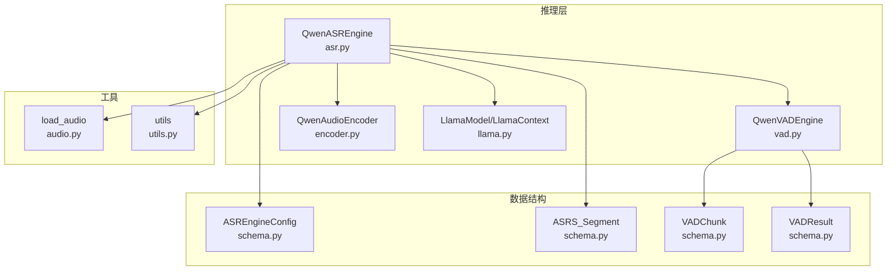
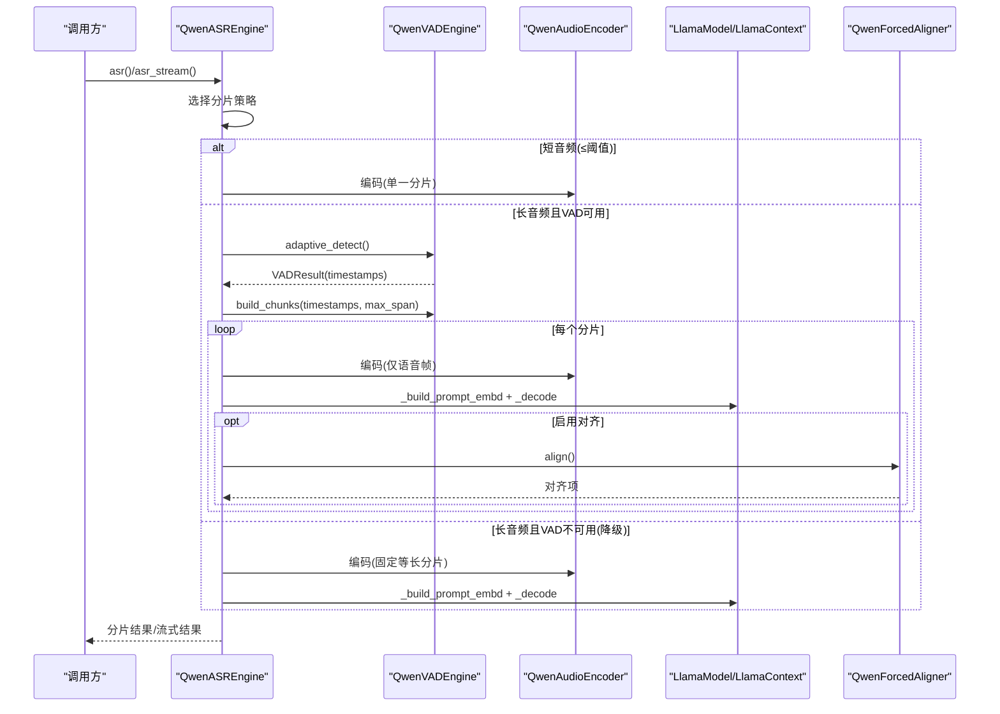
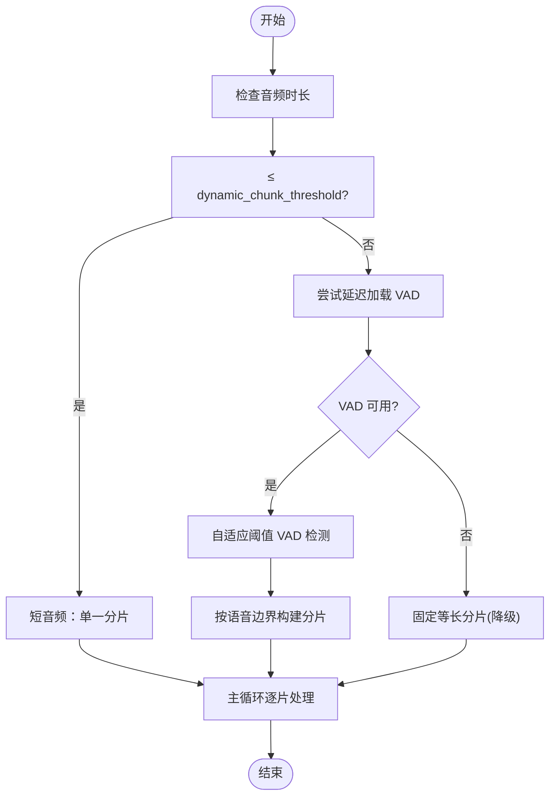
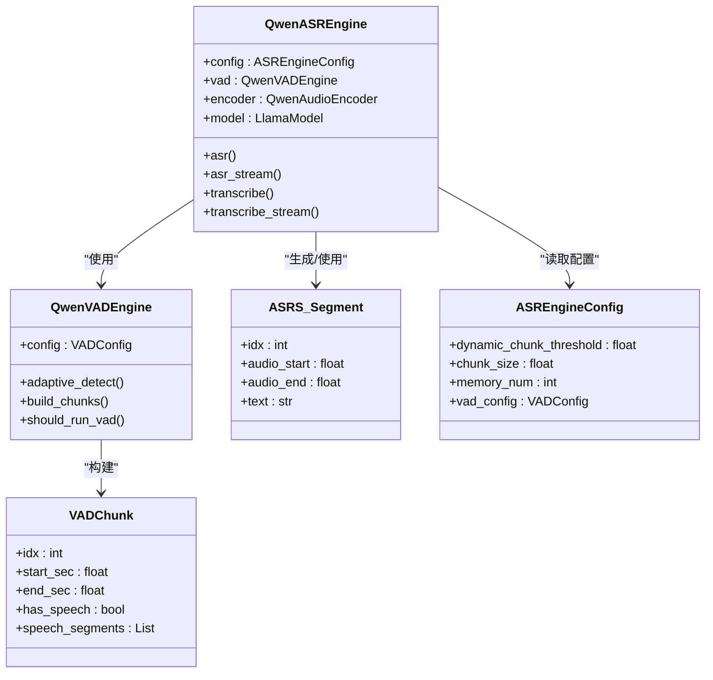

# 分片策略与动态调度

<cite>
**本文引用的文件**
- [asr.py](file://qwen_asr_gguf/inference/asr.py)
- [vad.py](file://qwen_asr_gguf/inference/vad.py)
- [schema.py](file://qwen_asr_gguf/inference/schema.py)
- [audio.py](file://qwen_asr_gguf/inference/audio.py)
- [utils.py](file://qwen_asr_gguf/inference/utils.py)
- [21-Run-ASR.py](file://21-Run-ASR.py)
</cite>

## 更新摘要
**变更内容**
- 新增动态分片阈值机制的详细说明
- 改进自适应阈值检测算法的实现细节
- 优化长音频处理的内存使用和性能表现
- 增强抗幻觉措施的实现和效果评估

## 目录
1. [简介](#简介)
2. [项目结构](#项目结构)
3. [核心组件](#核心组件)
4. [架构总览](#架构总览)
5. [详细组件分析](#详细组件分析)
6. [依赖关系分析](#依赖关系分析)
7. [性能考量](#性能考量)
8. [故障排查指南](#故障排查指南)
9. [结论](#结论)
10. [附录](#附录)

## 简介
本技术文档聚焦于 QwenASR 引擎的"分片策略与动态调度"能力，系统阐述三种分片策略的实现原理与交互机制：短音频单一分片策略、VAD 自适应动态分片策略、固定等长分片降级策略。文档深入解释动态分片阈值的判断逻辑、VAD 引擎的自适应检测机制、分片边界的智能确定算法，并给出 ASRS_Segment 类的设计与内存管理要点（音频特征缓存与文本上下文记忆）。最后提供策略选择逻辑、性能对比与适用场景说明，并给出可操作的调优建议与边界情况处理技巧。

## 项目结构
围绕分片与调度的核心代码位于 qwen_asr_gguf/inference 目录，主要文件如下：
- asr.py：ASR 主流程、分片策略选择、VAD 集成、内存管理与统计
- vad.py：VAD 引擎封装、自适应阈值检测、分片构建
- schema.py：数据结构定义（ASRS_Segment、VADChunk、VADResult、ASREngineConfig 等）
- audio.py：音频加载与重采样工具
- utils.py：语言规范化与重复文本修复等辅助工具
- 21-Run-ASR.py：示例脚本，展示配置与使用方式

**图表来源**
- [asr.py:1-140](file://qwen_asr_gguf/inference/asr.py#L1-L140)
- [vad.py:29-81](file://qwen_asr_gguf/inference/vad.py#L29-L81)
- [schema.py:162-235](file://qwen_asr_gguf/inference/schema.py#L162-L235)
- [audio.py:129-149](file://qwen_asr_gguf/inference/audio.py#L129-L149)
- [utils.py:58-134](file://qwen_asr_gguf/inference/utils.py#L58-L134)

**章节来源**
- [asr.py:1-140](file://qwen_asr_gguf/inference/asr.py#L1-L140)
- [vad.py:29-81](file://qwen_asr_gguf/inference/vad.py#L29-L81)
- [schema.py:162-235](file://qwen_asr_gguf/inference/schema.py#L162-L235)
- [audio.py:129-149](file://qwen_asr_gguf/inference/audio.py#L129-L149)
- [utils.py:58-134](file://qwen_asr_gguf/inference/utils.py#L58-L134)

## 核心组件
- ASRS_Segment：分片物理时间坐标与文本缓存的轻量容器，用于记录每个分片的索引、起止时间与文本内容，支撑上下文记忆与对齐输出。
- QwenASREngine：ASR 主引擎，负责分片策略选择、VAD 集成、编码器调用、LLM 解码、对齐与统计。
- QwenVADEngine：VAD 引擎封装，提供自适应阈值检测与分片构建，支持延迟加载与阈值自适应。
- 数据结构：ASREngineConfig、VADConfig、VADResult、VADChunk、ASRS_Segment、StreamChunkResult 等。

**章节来源**
- [asr.py:29-38](file://qwen_asr_gguf/inference/asr.py#L29-L38)
- [asr.py:40-142](file://qwen_asr_gguf/inference/asr.py#L40-L142)
- [vad.py:29-467](file://qwen_asr_gguf/inference/vad.py#L29-L467)
- [schema.py:162-235](file://qwen_asr_gguf/inference/schema.py#L162-L235)

## 架构总览
ASR 主流程在进入核心推理前，依据音频时长与 VAD 可用性选择分片策略，并在每个分片内执行编码、提示构建、解码与可选对齐。VAD 在长音频离线转写场景中提供自适应阈值检测，动态确定语音边界，避免静音与句中截断，提升准确率与效率。

**图表来源**
- [asr.py:602-893](file://qwen_asr_gguf/inference/asr.py#L602-L893)
- [vad.py:160-222](file://qwen_asr_gguf/inference/vad.py#L160-L222)
- [vad.py:299-406](file://qwen_asr_gguf/inference/vad.py#L299-L406)

**章节来源**
- [asr.py:602-893](file://qwen_asr_gguf/inference/asr.py#L602-L893)
- [vad.py:160-222](file://qwen_asr_gguf/inference/vad.py#L160-L222)
- [vad.py:299-406](file://qwen_asr_gguf/inference/vad.py#L299-L406)

## 详细组件分析

### 1) 三种分片策略与选择逻辑
- 短音频单一分片策略（≤ dynamic_chunk_threshold）
  - 适用：音频时长小于等于阈值（默认 10s），无需 VAD，直接作为单一分片处理。
  - 特点：最简单、开销最小，适合短音频或实时场景。
- VAD 自适应动态分片策略（> dynamic_chunk_threshold 且 VAD 可用）
  - 适用：长音频离线转写，自动延迟加载 VAD，执行自适应阈值检测，按语音边界动态组合分片。
  - 特点：避免静音与句中截断，仅送入实际语音帧，减少无效计算与幻觉。
- 固定等长分片降级策略（> dynamic_chunk_threshold 且 VAD 不可用）
  - 适用：VAD 初始化失败或不可用时的降级方案，保持原有 30s 等长切割。
  - 特点：维持兼容性，但可能引入静音与跨句截断带来的误差。

策略选择与执行流程如下：

**图表来源**
- [asr.py:667-721](file://qwen_asr_gguf/inference/asr.py#L667-L721)

**章节来源**
- [asr.py:667-721](file://qwen_asr_gguf/inference/asr.py#L667-L721)

### 2) 动态分片阈值判断逻辑
- 阈值来源：ASREngineConfig.dynamic_chunk_threshold，默认 10.0s。
- 判定条件：total_duration <= dynamic_threshold 时采用短音频策略；否则进入 VAD 或降级。
- VAD 延迟加载：_ensure_vad() 在首次遇到长音频时按需加载，失败则降级为固定分片。

**章节来源**
- [asr.py:666-684](file://qwen_asr_gguf/inference/asr.py#L666-L684)
- [asr.py:108-136](file://qwen_asr_gguf/inference/asr.py#L108-L136)
- [schema.py:184-186](file://qwen_asr_gguf/inference/schema.py#L184-L186)

### 3) VAD 引擎的自适应检测机制
- 两遍法：
  - 第一遍：以配置阈值执行标准检测，得到帧级语音概率分布。
  - 第二遍：取高于噪声底的帧概率的 30% 分位数作为自适应阈值，若变化显著则用新阈值重新分割。
- 阈值区间限制：[0.25, 0.65]，避免极端阈值导致误判。
- 仅在阈值变化超过一定幅度时才重新分割，否则保持原结果，兼顾稳定性与鲁棒性。

**章节来源**
- [vad.py:160-222](file://qwen_asr_gguf/inference/vad.py#L160-L222)

### 4) 分片边界的智能确定算法
- 合并近邻语音段：将间隔小于 merge_gap_sec 的相邻语音段合并，避免过碎切分。
- 贪心打包：在不超过 max_span_sec 的前提下，尽可能将连续语音段组合为一个分片。
- 上下文缓冲：每个分片在首段前补 context_pre_sec、末段后补 context_post_sec，保证边界解码完整性。
- 插入静音分片：在语音分片之间插入静音分片，使输出完整覆盖 [0, total_dur]，便于进度上报与跳过 ASR。

**章节来源**
- [vad.py:299-406](file://qwen_asr_gguf/inference/vad.py#L299-L406)

### 5) ASRS_Segment 类与内存管理
- ASRS_Segment：记录分片索引、物理时间坐标、文本内容，支撑上下文记忆与对齐输出。
- 内存管理：
  - 文本上下文记忆：使用 deque(maxlen=memory_chunks) 保存前 N 片的文本，避免非连续音频拼接导致的模型混乱。
  - 音频特征缓存：VAD 模式不缓存音频特征，固定模式下缓存当前分片的编码特征，用于与历史特征拼接构建提示。
  - n_ctx 安全估算：当合并记忆后序列长度超过上下文窗口时，回退为仅当前分片，防止崩溃。

**章节来源**
- [asr.py:29-38](file://qwen_asr_gguf/inference/asr.py#L29-L38)
- [asr.py:643](file://qwen_asr_gguf/inference/asr.py#L643)
- [asr.py:804-821](file://qwen_asr_gguf/inference/asr.py#L804-L821)

### 6) 分片处理主循环与抗幻觉措施
- 主循环步骤：
  - 选择策略并生成分片列表。
  - 对每个分片提取时间坐标与语音标记。
  - 固定模式下对非末尾分片追加边界缓冲，提升边界解码完整性。
  - 静音跳过：若分片被 VAD 判定为静音，直接跳过 ASR 推理。
  - 编码：VAD 模式仅编码实际语音帧；固定模式补零至标准分片长度。
  - 提示构建：VAD 模式仅用文本上下文；固定模式合并历史音频特征与当前文本。
  - 解码：按实际语音时长等比缩放 max_new_tokens，限制生成长度，抑制幻觉。
  - 对齐（可选）：对当前分片进行强制对齐，生成字级时间戳。
  - 结果产出：逐片返回 StreamChunkResult，末片汇总统计与完整文本。
- 抗幻觉措施：
  - token 级重复熔断（15-token 窗口，≤3 种 token）
  - n-gram 短语级重复熔断（5/8-char 短语出现 ≥4 次）
  - max_new_tokens 上限（speech_sec × 16，最大 512）

**章节来源**
- [asr.py:724-893](file://qwen_asr_gguf/inference/asr.py#L724-L893)

### 7) 示例与配置
- 示例脚本展示了如何配置 VAD、动态分片阈值、分片大小与上下文记忆数量，并演示离线与流式转写。
- 关键配置项：
  - ASREngineConfig.dynamic_chunk_threshold：动态分片阈值（默认 10s）
  - ASREngineConfig.chunk_size：单分片最大时间跨度上限（默认 30s）
  - ASREngineConfig.memory_num：保留前 N 片文本作为上下文（默认 1）
  - VADConfig.speech_threshold：初始语音帧判定阈值（自适应算法会动态调整）

**章节来源**
- [21-Run-ASR.py:68-95](file://21-Run-ASR.py#L68-L95)
- [schema.py:184-186](file://qwen_asr_gguf/inference/schema.py#L184-L186)
- [schema.py:174](file://qwen_asr_gguf/inference/schema.py#L174)
- [schema.py:175](file://qwen_asr_gguf/inference/schema.py#L175)

## 依赖关系分析
- QwenASREngine 依赖：
  - VAD 引擎：用于长音频动态分片与静音跳过。
  - 编码器：将音频编码为特征，支持动态形状以节省冗余计算。
  - LLM：执行提示构建与解码，包含抗幻觉与重试机制。
  - 对齐器：可选，用于生成字级时间戳。
- 数据结构依赖：
  - ASRS_Segment、VADChunk、VADResult、ASREngineConfig 等在主流程中被广泛使用。
- 工具依赖：
  - 音频加载与重采样：统一入口 load_audio，支持多种格式。
  - 语言规范化与重复修复：utils 提供语言校验与文本去重。

**图表来源**
- [asr.py:40-142](file://qwen_asr_gguf/inference/asr.py#L40-L142)
- [vad.py:29-467](file://qwen_asr_gguf/inference/vad.py#L29-L467)
- [schema.py:162-235](file://qwen_asr_gguf/inference/schema.py#L162-L235)

**章节来源**
- [asr.py:40-142](file://qwen_asr_gguf/inference/asr.py#L40-L142)
- [vad.py:29-467](file://qwen_asr_gguf/inference/vad.py#L29-L467)
- [schema.py:162-235](file://qwen_asr_gguf/inference/schema.py#L162-L235)

## 性能考量
- VAD 前置过滤：对静音片段直接跳过 ASR，显著降低 RTF 与幻觉风险。
- 动态形状编码：动态分片模式下使用动态形状，避免将静音补零到 30s，减少无效计算。
- 上下文窗口保护：当合并记忆后序列长度超过 n_ctx 时回退为仅当前分片，防止崩溃。
- 生成预算控制：max_new_tokens 按实际语音时长等比缩放，限制生成长度，抑制幻觉。
- 边界缓冲：固定模式下对非末尾分片追加 1s 缓冲，提升边界解码完整性。
- 重复熔断与去重：token 级与短语级重复检测，以及后处理去重，进一步抑制幻觉。

**章节来源**
- [asr.py:776-833](file://qwen_asr_gguf/inference/asr.py#L776-L833)
- [asr.py:812-821](file://qwen_asr_gguf/inference/asr.py#L812-L821)
- [asr.py:822-833](file://qwen_asr_gguf/inference/asr.py#L822-L833)
- [utils.py:58-134](file://qwen_asr_gguf/inference/utils.py#L58-L134)

## 故障排查指南
- VAD 初始化失败
  - 现象：日志提示 VAD 延迟加载失败，自动降级为固定分片。
  - 处理：确认 fireredvad 依赖已安装，模型路径正确，GPU/CPU 配置与环境一致。
- 静音过多导致分片过多
  - 现象：大量静音分片被跳过，但语音分片仍较多。
  - 处理：适当提高 VADConfig.min_silence_frame 或 merge_gap_sec，减少碎片化。
- 上下文溢出
  - 现象：合并历史音频特征与当前文本后序列长度超过 n_ctx，触发回退。
  - 处理：减小 memory_num 或增大 n_ctx，或缩短 chunk_size。
- 生成过长或幻觉
  - 现象：生成文本过长或出现重复/幻觉。
  - 处理：检查 max_new_tokens 计算逻辑，适当降低 speech_sec 或增加去重阈值。

**章节来源**
- [asr.py:108-136](file://qwen_asr_gguf/inference/asr.py#L108-L136)
- [vad.py:300-406](file://qwen_asr_gguf/inference/vad.py#L300-L406)
- [asr.py:812-821](file://qwen_asr_gguf/inference/asr.py#L812-L821)
- [utils.py:58-134](file://qwen_asr_gguf/inference/utils.py#L58-L134)

## 结论
QwenASR 的分片策略与动态调度通过"短音频单一分片 + VAD 自适应动态分片 + 固定等长分片降级"的三级体系，在准确性、效率与稳定性之间取得良好平衡。VAD 的自适应阈值与分片构建算法有效避免了静音与句中截断，结合上下文记忆与抗幻觉措施，显著提升了长音频离线转写的质量与鲁棒性。通过合理配置动态分片阈值、分片大小与上下文记忆数量，可在不同场景下获得最佳性能表现。

## 附录
- 代码示例路径（不展示具体代码内容）：
  - [短音频单一分片策略:668-682](file://qwen_asr_gguf/inference/asr.py#L668-L682)
  - [VAD 自适应动态分片策略:684-705](file://qwen_asr_gguf/inference/asr.py#L684-L705)
  - [固定等长分片降级策略:707-721](file://qwen_asr_gguf/inference/asr.py#L707-L721)
  - [VAD 自适应阈值检测:160-222](file://qwen_asr_gguf/inference/vad.py#L160-L222)
  - [分片边界智能确定:299-406](file://qwen_asr_gguf/inference/vad.py#L299-L406)
  - [ASRS_Segment 类定义:29-38](file://qwen_asr_gguf/inference/asr.py#L29-L38)
  - [主循环与抗幻觉措施:724-893](file://qwen_asr_gguf/inference/asr.py#L724-L893)
  - [示例配置与使用:68-95](file://21-Run-ASR.py#L68-L95)