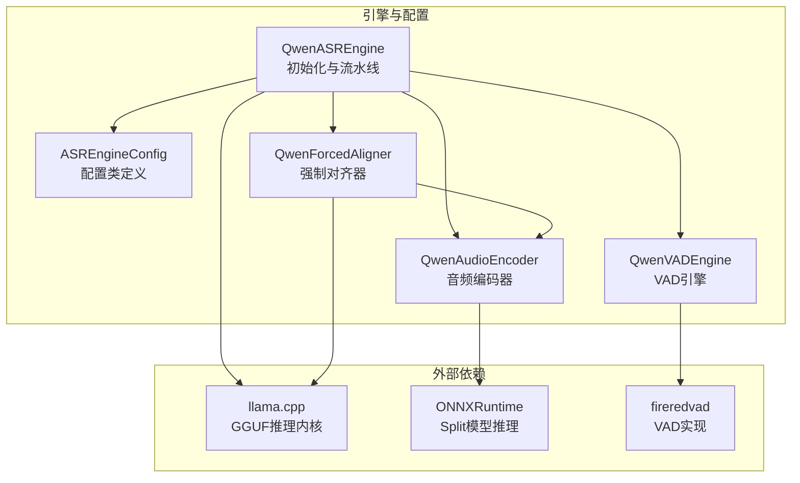
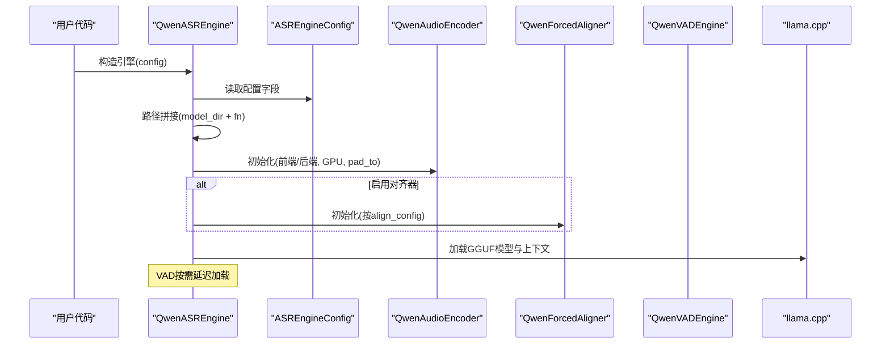
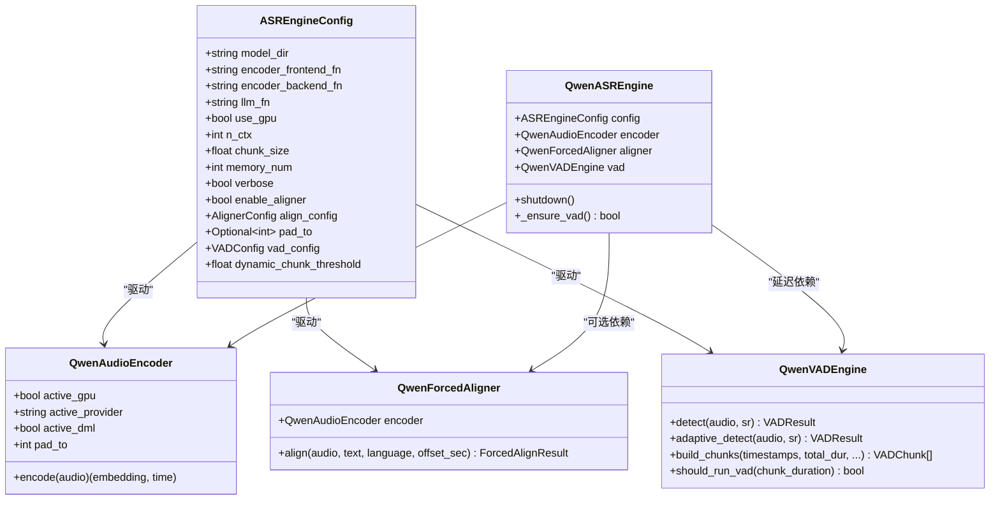
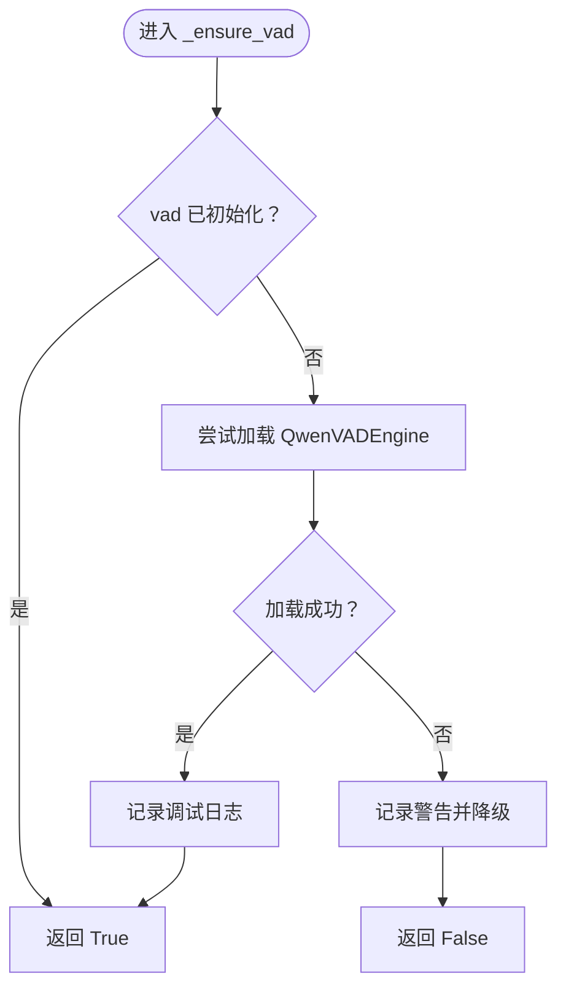
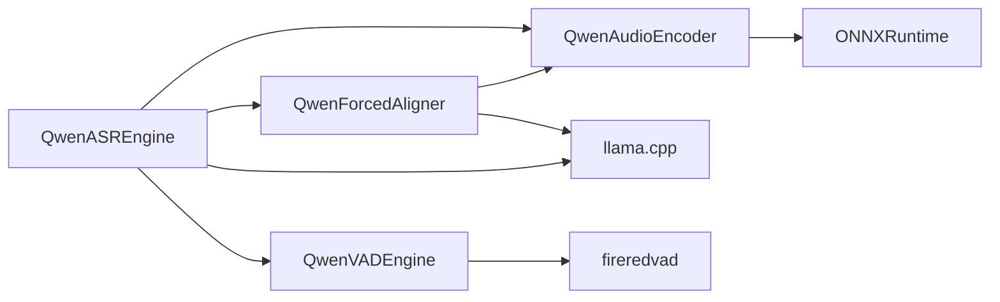

# 引擎初始化与配置

<cite>
**本文引用的文件**
- [qwen_asr_gguf/inference/asr.py](file://qwen_asr_gguf/inference/asr.py)
- [qwen_asr_gguf/inference/schema.py](file://qwen_asr_gguf/inference/schema.py)
- [qwen_asr_gguf/inference/encoder.py](file://qwen_asr_gguf/inference/encoder.py)
- [qwen_asr_gguf/inference/vad.py](file://qwen_asr_gguf/inference/vad.py)
- [qwen_asr_gguf/inference/aligner.py](file://qwen_asr_gguf/inference/aligner.py)
- [21-Run-ASR.py](file://21-Run-ASR.py)
</cite>

## 目录
1. [简介](#简介)
2. [项目结构](#项目结构)
3. [核心组件](#核心组件)
4. [架构总览](#架构总览)
5. [详细组件分析](#详细组件分析)
6. [依赖关系分析](#依赖关系分析)
7. [性能考量](#性能考量)
8. [故障排除指南](#故障排除指南)
9. [结论](#结论)
10. [附录](#附录)

## 简介
本文件聚焦于 QwenASR 引擎的初始化与配置，系统性阐述 QwenASREngine.__init__ 的完整初始化流程、配置参数解析、模型路径验证、组件依赖关系建立，以及引擎组件的初始化顺序与延迟加载机制。文档还提供配置类 ASREngineConfig 的参数详解、默认值、参数验证规则、错误处理策略，并给出不同配置场景下的最佳实践与故障排除建议，帮助开发者快速、稳定地部署与优化 QwenASR 引擎。

## 项目结构
本项目采用“按功能域分层”的组织方式，核心推理与配置位于 qwen_asr_gguf/inference 目录，包含引擎、配置、编码器、VAD、对齐器等模块；examples 目录提供示例脚本；根目录提供运行脚本与构建脚本。

图表来源
- [qwen_asr_gguf/inference/asr.py:40-142](file://qwen_asr_gguf/inference/asr.py#L40-L142)
- [qwen_asr_gguf/inference/schema.py:162-210](file://qwen_asr_gguf/inference/schema.py#L162-L210)
- [qwen_asr_gguf/inference/encoder.py:119-196](file://qwen_asr_gguf/inference/encoder.py#L119-L196)
- [qwen_asr_gguf/inference/vad.py:29-81](file://qwen_asr_gguf/inference/vad.py#L29-L81)
- [qwen_asr_gguf/inference/aligner.py:229-259](file://qwen_asr_gguf/inference/aligner.py#L229-L259)

章节来源
- [qwen_asr_gguf/inference/asr.py:40-142](file://qwen_asr_gguf/inference/asr.py#L40-L142)
- [qwen_asr_gguf/inference/schema.py:162-210](file://qwen_asr_gguf/inference/schema.py#L162-L210)

## 核心组件
- QwenASREngine：ASR 引擎主类，负责初始化与统一流水线调度。
- ASREngineConfig：引擎配置类，包含模型路径、分片参数、VAD 配置、对齐器配置等。
- QwenAudioEncoder：Split 前端+后端的 ONNX 推理编码器。
- QwenForcedAligner：强制对齐器，支持字级时间戳。
- QwenVADEngine：基于 FireRedVAD 的非流式 VAD 引擎，支持自适应阈值与分片构建。

章节来源
- [qwen_asr_gguf/inference/asr.py:40-142](file://qwen_asr_gguf/inference/asr.py#L40-L142)
- [qwen_asr_gguf/inference/schema.py:72-210](file://qwen_asr_gguf/inference/schema.py#L72-L210)
- [qwen_asr_gguf/inference/encoder.py:119-196](file://qwen_asr_gguf/inference/encoder.py#L119-L196)
- [qwen_asr_gguf/inference/vad.py:29-81](file://qwen_asr_gguf/inference/vad.py#L29-L81)
- [qwen_asr_gguf/inference/aligner.py:229-259](file://qwen_asr_gguf/inference/aligner.py#L229-L259)

## 架构总览
QwenASREngine 的初始化顺序与职责如下：
1) 路径解析与模型文件定位：根据配置拼接模型路径（LLM、编码器前后端）。
2) 初始化音频编码器：按动态/固定形状模式选择 pad_to，加载 ONNX Session。
3) 初始化对齐器（可选）：按配置启用，延迟加载。
4) VAD 延迟初始化：仅在长音频动态分片场景按需加载。
5) 加载 LLM（GGUF）与上下文：构建推理上下文与 Token ID 缓存。

图表来源
- [qwen_asr_gguf/inference/asr.py:49-142](file://qwen_asr_gguf/inference/asr.py#L49-L142)
- [qwen_asr_gguf/inference/schema.py:162-210](file://qwen_asr_gguf/inference/schema.py#L162-L210)

## 详细组件分析

### QwenASREngine.__init__ 初始化流程
- 配置接收与日志：保存 config，verbose 控制调试输出。
- 路径解析：拼接 LLM GGUF、编码器前端/后端模型路径。
- 初始化音频编码器：根据动态分片标志选择 pad_to，加载 ONNX Session，执行预热。
- 初始化对齐器（可选）：当 enable_aligner 且 align_config 存在时，按配置初始化。
- VAD 延迟初始化：初始化为 None，按需在 _ensure_vad() 中加载。
- 加载 LLM（GGUF）与上下文：构建 llama.cpp 的 LlamaModel 与 LlamaContext，缓存关键 Token ID。

章节来源
- [qwen_asr_gguf/inference/asr.py:49-142](file://qwen_asr_gguf/inference/asr.py#L49-L142)

### ASREngineConfig 配置类详解
- 基础字段
  - model_dir：模型根目录。
  - encoder_frontend_fn / encoder_backend_fn：编码器前后端模型文件名，默认 fp16 ONNX。
  - llm_fn：ASR LLM 模型文件名，默认 f16 GGUF。
  - use_gpu：是否启用 GPU 推理。
  - n_ctx：上下文窗口大小。
  - chunk_size：分片时长（秒），默认 30s。
  - memory_num：保留前 N 片文本作为上下文。
  - verbose：调试输出开关。
  - enable_aligner：是否启用对齐器。
  - align_config：对齐器配置对象，若为 None 则按主配置自动补齐。
  - pad_to：编码器填充时长（秒），未设置时默认与 chunk_size 对齐。
- VAD 与动态分片
  - vad_config：VAD 配置对象，未设置时使用默认值。
  - dynamic_chunk_threshold：动态分片阈值（秒），默认 10s。

__post_init__ 行为
- 若 pad_to 未设置，自动设为 int(chunk_size)。
- 若 align_config 为 None，按主配置自动创建 AlignerConfig，并继承 pad_to。
- 若 vad_config 为 None，按默认值创建 VADConfig。

章节来源
- [qwen_asr_gguf/inference/schema.py:162-210](file://qwen_asr_gguf/inference/schema.py#L162-L210)

### 对齐器配置 AlignerConfig
- model_dir：对齐器模型根目录。
- encoder_frontend_fn / encoder_backend_fn：对齐器编码器前后端模型文件名。
- llm_fn：对齐器 LLM 模型文件名。
- use_gpu：是否启用 GPU。
- n_ctx：对齐器上下文窗口大小。
- pad_to：编码器填充时长（秒）。

章节来源
- [qwen_asr_gguf/inference/schema.py:72-85](file://qwen_asr_gguf/inference/schema.py#L72-L85)

### VAD 配置 VADConfig
- model_dir：VAD 模型目录，默认 models/FireRedVAD/VAD。
- use_gpu：是否启用 GPU。
- smooth_window_size：帧级概率平滑窗口大小。
- speech_threshold：初始语音帧判定阈值。
- min_speech_frame / max_speech_frame：最小/最大语音段帧数。
- min_silence_frame：最小静音帧数。
- merge_silence_frame：合并近邻语音段的静音阈值。
- extend_speech_frame：语音边界扩展帧数。
- chunk_max_frame：单分片最大帧数。
- vad_min_duration：启用 VAD 的最小音频时长（秒）。

章节来源
- [qwen_asr_gguf/inference/schema.py:88-113](file://qwen_asr_gguf/inference/schema.py#L88-L113)

### 引擎组件初始化顺序与依赖关系
- 编码器初始化：ONNXRuntime 提供者选择（CUDA/ROCM/TensorRT/DML/CPU），按可用性回退；执行预热。
- 对齐器初始化：复用统一编码器（Split 模式），加载对齐 LLM。
- VAD 延迟初始化：首次遇到长音频且超过阈值时按需加载，失败时降级为固定分片。
- LLM 初始化：加载 GGUF 模型与上下文，缓存关键 Token ID。

图表来源
- [qwen_asr_gguf/inference/schema.py:72-210](file://qwen_asr_gguf/inference/schema.py#L72-L210)
- [qwen_asr_gguf/inference/encoder.py:119-196](file://qwen_asr_gguf/inference/encoder.py#L119-L196)
- [qwen_asr_gguf/inference/aligner.py:229-259](file://qwen_asr_gguf/inference/aligner.py#L229-L259)
- [qwen_asr_gguf/inference/vad.py:29-81](file://qwen_asr_gguf/inference/vad.py#L29-L81)
- [qwen_asr_gguf/inference/asr.py:49-142](file://qwen_asr_gguf/inference/asr.py#L49-L142)

### VAD 延迟加载机制
- _ensure_vad()：当 vad 为 None 时尝试加载 QwenVADEngine；失败时记录警告并返回 False，调用方降级为固定分片。
- should_run_vad()：根据分片时长与 vad_min_duration 判断是否启用 VAD。
- adaptive_detect()：两遍法自适应阈值，提升长音频离线场景的鲁棒性。

图表来源
- [qwen_asr_gguf/inference/asr.py:108-136](file://qwen_asr_gguf/inference/asr.py#L108-L136)
- [qwen_asr_gguf/inference/vad.py:41-81](file://qwen_asr_gguf/inference/vad.py#L41-L81)

章节来源
- [qwen_asr_gguf/inference/asr.py:108-136](file://qwen_asr_gguf/inference/asr.py#L108-L136)
- [qwen_asr_gguf/inference/vad.py:41-81](file://qwen_asr_gguf/inference/vad.py#L41-L81)

### 编码器初始化与预热
- 提供者选择：优先 CUDA/ROCM/Tensorrt/DML，否则回退 CPU。
- 预热策略：DML 固定形状模式下预热 pad_to 秒，否则动态模式预热约 2 秒。
- 前端/后端流水线：分块推理、拼接、切片，保证输出帧对齐。

章节来源
- [qwen_asr_gguf/inference/encoder.py:119-196](file://qwen_asr_gguf/inference/encoder.py#L119-L196)
- [qwen_asr_gguf/inference/encoder.py:198-280](file://qwen_asr_gguf/inference/encoder.py#L198-L280)

### 对齐器初始化与对齐流程
- 复用统一编码器，加载对齐 LLM。
- 构建 Prompt：音频嵌入 + 文本 + 时间戳占位符。
- 推理：仅计算时间戳位置 logits，加速对齐。
- 后处理：时间戳修复与文本重建，恢复标点与空格。

章节来源
- [qwen_asr_gguf/inference/aligner.py:229-350](file://qwen_asr_gguf/inference/aligner.py#L229-L350)

## 依赖关系分析
- 组件耦合
  - QwenASREngine 与 QwenAudioEncoder 强耦合（路径解析、预热、推理）。
  - QwenASREngine 与 QwenForcedAligner 松耦合（可选启用，按需延迟加载）。
  - QwenASREngine 与 QwenVADEngine 松耦合（延迟加载，失败可降级）。
- 外部依赖
  - ONNXRuntime：Split 模型推理。
  - llama.cpp：GGUF 模型加载与上下文管理。
  - fireredvad：VAD 模型加载与检测。

图表来源
- [qwen_asr_gguf/inference/asr.py:49-142](file://qwen_asr_gguf/inference/asr.py#L49-L142)
- [qwen_asr_gguf/inference/encoder.py:119-196](file://qwen_asr_gguf/inference/encoder.py#L119-L196)
- [qwen_asr_gguf/inference/aligner.py:229-259](file://qwen_asr_gguf/inference/aligner.py#L229-L259)
- [qwen_asr_gguf/inference/vad.py:29-81](file://qwen_asr_gguf/inference/vad.py#L29-L81)

章节来源
- [qwen_asr_gguf/inference/asr.py:49-142](file://qwen_asr_gguf/inference/asr.py#L49-L142)
- [qwen_asr_gguf/inference/encoder.py:119-196](file://qwen_asr_gguf/inference/encoder.py#L119-L196)
- [qwen_asr_gguf/inference/aligner.py:229-259](file://qwen_asr_gguf/inference/aligner.py#L229-L259)
- [qwen_asr_gguf/inference/vad.py:29-81](file://qwen_asr_gguf/inference/vad.py#L29-L81)

## 性能考量
- 动态分片与 VAD：长音频自动启用 VAD 动态分片，跳过静音片段，显著降低 RTF 并抑制幻觉。
- 编码器预热：固定形状模式下预热 pad_to 秒，动态模式预热约 2 秒，减少首帧延迟。
- 对齐器延迟加载：仅在启用对齐器且存在文本时按需加载，避免不必要的资源占用。
- 上下文窗口保护：_decode 中对 n_ctx 越界进行拦截，避免崩溃并返回空结果。
- 生成预算：max_new_tokens 按实际语音时长等比缩放，限制幻觉空间。

章节来源
- [qwen_asr_gguf/inference/asr.py:226-238](file://qwen_asr_gguf/inference/asr.py#L226-L238)
- [qwen_asr_gguf/inference/asr.py:822-824](file://qwen_asr_gguf/inference/asr.py#L822-L824)
- [qwen_asr_gguf/inference/encoder.py:186-196](file://qwen_asr_gguf/inference/encoder.py#L186-L196)

## 故障排除指南
- VAD 未安装或加载失败
  - 现象：延迟加载失败，记录警告并降级为固定分片。
  - 处理：安装 fireredvad 或在配置中禁用 VAD。
- ONNXRuntime 提供者不可用
  - 现象：未检测到可用 GPU Provider，回退到 CPU。
  - 处理：确认 CUDA/ROCM/TensorRT/DML 安装状态，或设置 use_gpu=False。
- GGUF 模型加载异常
  - 现象：llama.cpp 报错或崩溃。
  - 处理：检查模型路径与文件完整性，确认 n_ctx 设置合理。
- 上下文窗口溢出
  - 现象：序列长度超过 n_ctx 导致崩溃。
  - 处理：_decode 中已拦截并返回空结果，建议降低 memory_num 或 chunk_size。
- 对齐器初始化失败
  - 现象：对齐器不可用，返回空对齐结果。
  - 处理：检查对齐器模型路径与依赖，或关闭对齐器。

章节来源
- [qwen_asr_gguf/inference/vad.py:53-60](file://qwen_asr_gguf/inference/vad.py#L53-L60)
- [qwen_asr_gguf/inference/encoder.py:137-164](file://qwen_asr_gguf/inference/encoder.py#L137-L164)
- [qwen_asr_gguf/inference/asr.py:226-238](file://qwen_asr_gguf/inference/asr.py#L226-L238)
- [qwen_asr_gguf/inference/aligner.py:229-259](file://qwen_asr_gguf/inference/aligner.py#L229-L259)

## 结论
QwenASREngine 的初始化流程清晰、模块化程度高，通过配置驱动组件装配与延迟加载，兼顾性能与稳定性。ASREngineConfig 提供了完善的参数体系，结合 VAD 动态分片与对齐器延迟加载，能够适应多种部署场景。建议在生产环境中：
- 明确模型路径与 GPU 资源，合理设置 chunk_size 与 memory_num。
- 长音频场景启用 VAD 动态分片，短音频可使用固定分片。
- 对齐器按需启用，避免不必要的资源开销。
- 关注上下文窗口与预热策略，确保推理稳定性与性能。

## 附录

### 配置参数与默认值一览
- ASREngineConfig
  - model_dir：模型根目录
  - encoder_frontend_fn：qwen3_asr_encoder_frontend.fp16.onnx
  - encoder_backend_fn：qwen3_asr_encoder_backend.fp16.onnx
  - llm_fn：qwen3_asr_llm.f16.gguf
  - use_gpu：False
  - n_ctx：2048
  - chunk_size：30.0
  - memory_num：1
  - verbose：True
  - enable_aligner：False
  - align_config：None（自动补齐）
  - pad_to：None（自动设为 int(chunk_size)）
  - vad_config：None（自动补齐）
  - dynamic_chunk_threshold：10.0
- AlignerConfig
  - model_dir：同主配置
  - encoder_frontend_fn：qwen3_aligner_encoder_frontend.fp16.onnx
  - encoder_backend_fn：qwen3_aligner_encoder_backend.fp16.onnx
  - llm_fn：qwen3_aligner_llm.f16.gguf
  - use_gpu：False
  - n_ctx：2048
  - pad_to：None（自动设为 int(chunk_size)）
- VADConfig
  - model_dir：models/FireRedVAD/VAD
  - use_gpu：False
  - smooth_window_size：5
  - speech_threshold：0.35
  - min_speech_frame：15
  - max_speech_frame：3000
  - min_silence_frame：40
  - merge_silence_frame：30
  - extend_speech_frame：8
  - chunk_max_frame：30000
  - vad_min_duration：10.0

章节来源
- [qwen_asr_gguf/inference/schema.py:72-210](file://qwen_asr_gguf/inference/schema.py#L72-L210)

### 初始化示例与最佳实践
- 示例脚本
  - [21-Run-ASR.py:68-95](file://21-Run-ASR.py#L68-L95) 展示了如何构建 ASREngineConfig，包含 VAD 配置与对齐器配置。
- 最佳实践
  - 长音频（>10s）：启用 VAD 动态分片，合理设置 speech_threshold 与 min_silence_frame。
  - GPU 资源紧张：use_gpu=False，或降低 n_ctx 与 chunk_size。
  - 对齐器成本高：仅在需要字级时间戳时启用 enable_aligner。
  - 预热策略：DML 固定形状模式下预热 pad_to 秒，动态模式预热约 2 秒。

章节来源
- [21-Run-ASR.py:68-95](file://21-Run-ASR.py#L68-L95)