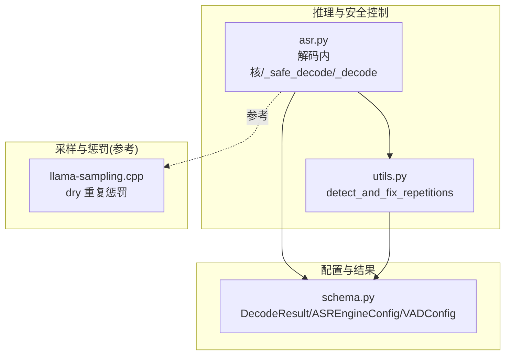
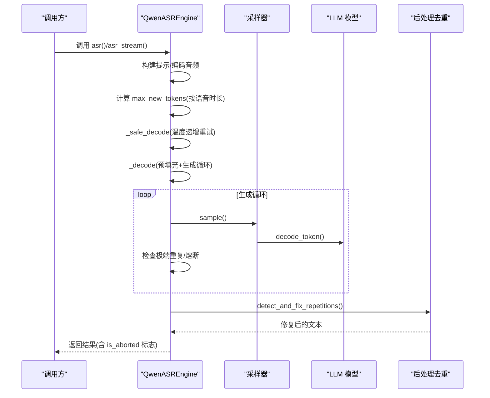
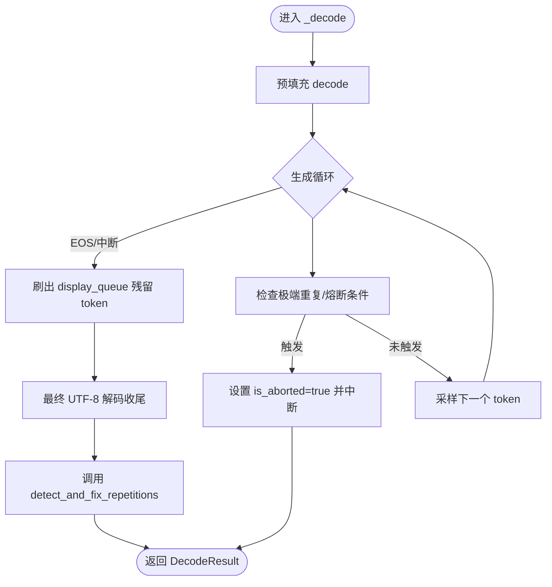
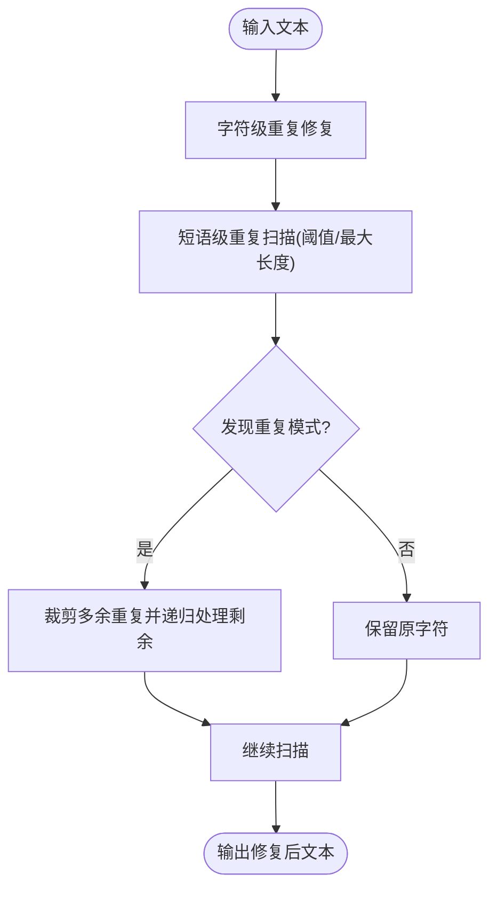
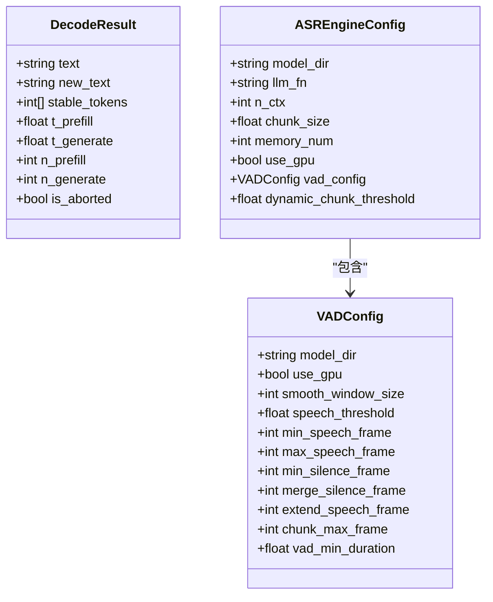
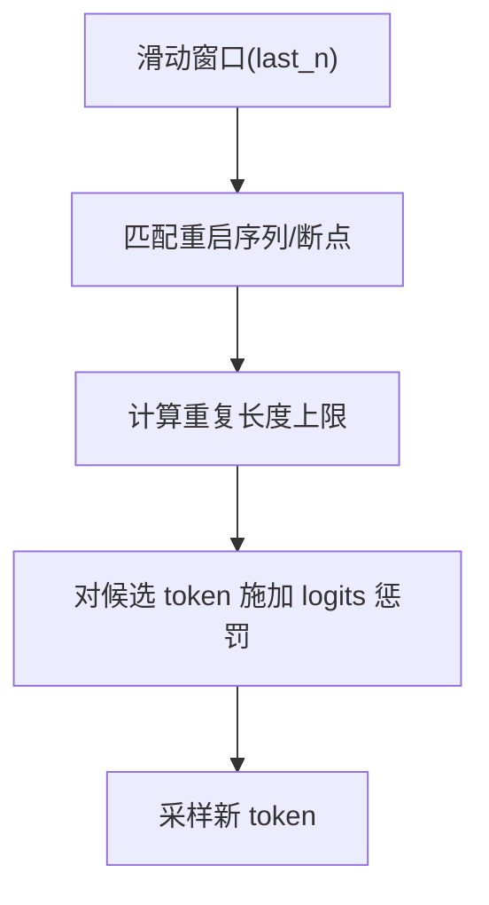
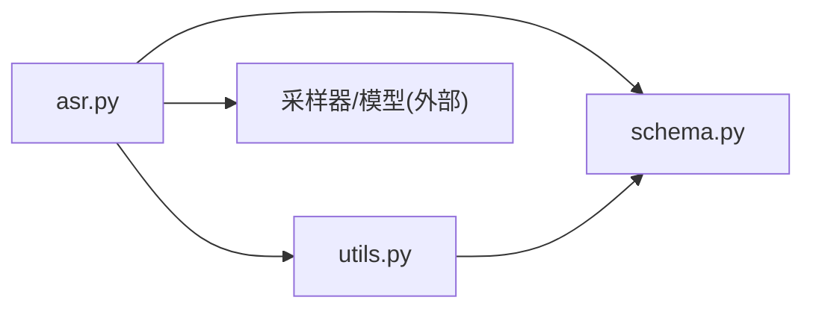

# 抗幻觉机制与安全控制

<cite>
**本文引用的文件**
- [qwen_asr_gguf/inference/asr.py](file://qwen_asr_gguf/inference/asr.py)
- [qwen_asr_gguf/inference/utils.py](file://qwen_asr_gguf/inference/utils.py)
- [qwen_asr/inference/utils.py](file://qwen_asr/inference/utils.py)
- [qwen_asr_gguf/inference/schema.py](file://qwen_asr_gguf/inference/schema.py)
- [ref/llama.cpp/src/llama-sampling.cpp](file://ref/llama.cpp/src/llama-sampling.cpp)
</cite>

## 目录
1. [简介](#简介)
2. [项目结构](#项目结构)
3. [核心组件](#核心组件)
4. [架构总览](#架构总览)
5. [详细组件分析](#详细组件分析)
6. [依赖关系分析](#依赖关系分析)
7. [性能考量](#性能考量)
8. [故障排查指南](#故障排查指南)
9. [结论](#结论)
10. [附录](#附录)

## 简介
本文件聚焦于 QwenASR 引擎的抗幻觉机制与安全控制能力，系统阐述以下多重保护机制：
- token 级重复熔断：基于滑动窗口的极端重复检测与熔断
- n-gram 短语级重复检测：对短文本模式的重复检测与修复
- max_new_tokens 上限控制：按语音时长动态缩放的生成预算
- 保守逃逸阀：极端重复场景下的自动熔断与温度调节重试
- 后处理去重算法：对解码后残留重复进行修复

文档还提供统计指标、效果评估方法、参数调优建议，并给出配置与监控示例路径，帮助质量保证工程师制定测试策略。

## 项目结构
围绕抗幻觉与安全控制的关键模块如下：
- 推理内核与安全控制：位于 GGUF 后端推理模块，负责解码循环、熔断与重试
- 后处理去重：位于 GGUF 与传统后端的 utils，提供字符与短语级重复修复
- 配置与结果结构：定义解码结果、VAD、ASR 引擎配置等

**图示来源**
- [qwen_asr_gguf/inference/asr.py:212-345](file://qwen_asr_gguf/inference/asr.py#L212-L345)
- [qwen_asr_gguf/inference/utils.py:58-134](file://qwen_asr_gguf/inference/utils.py#L58-L134)
- [qwen_asr_gguf/inference/schema.py:32-235](file://qwen_asr_gguf/inference/schema.py#L32-L235)
- [ref/llama.cpp/src/llama-sampling.cpp:2960-3148](file://ref/llama.cpp/src/llama-sampling.cpp#L2960-L3148)

**章节来源**
- [qwen_asr_gguf/inference/asr.py:1-893](file://qwen_asr_gguf/inference/asr.py#L1-L893)
- [qwen_asr_gguf/inference/utils.py:1-134](file://qwen_asr_gguf/inference/utils.py#L1-L134)
- [qwen_asr_gguf/inference/schema.py:1-235](file://qwen_asr_gguf/inference/schema.py#L1-L235)

## 核心组件
- 解码内核与安全控制
  - _decode：执行预填充与生成循环，内置多种抗幻觉保护
  - _safe_decode：带熔断与温度递增重试的安全封装
- 后处理去重算法
  - detect_and_fix_repetitions：字符级与短语级重复修复
- 配置与结果结构
  - DecodeResult：标准化解码输出，包含 is_aborted 熔断标志
  - ASREngineConfig/VADConfig：引擎与 VAD 配置

**章节来源**
- [qwen_asr_gguf/inference/asr.py:212-345](file://qwen_asr_gguf/inference/asr.py#L212-L345)
- [qwen_asr_gguf/inference/utils.py:58-134](file://qwen_asr_gguf/inference/utils.py#L58-L134)
- [qwen_asr_gguf/inference/schema.py:32-235](file://qwen_asr_gguf/inference/schema.py#L32-L235)

## 架构总览
抗幻觉与安全控制贯穿“预填充→生成循环→后处理”全流程，形成“预防+熔断+修复”的三层防护。

**图示来源**
- [qwen_asr_gguf/inference/asr.py:212-345](file://qwen_asr_gguf/inference/asr.py#L212-L345)
- [qwen_asr_gguf/inference/utils.py:58-134](file://qwen_asr_gguf/inference/utils.py#L58-L134)

## 详细组件分析

### 组件A：解码内核与安全控制（_decode/_safe_decode）
- 预填充与生成循环
  - 预填充阶段：构建批处理并执行 decode
  - 生成循环：按 max_new_tokens 限制迭代，逐步解码并拼接文本
- 多层抗幻觉保护
  - token 级重复熔断：当最近若干 token 中唯一值极少时熔断
  - 保守逃逸阀：当稳定输出窗口达到一定长度且唯一 token 极少时熔断
  - max_new_tokens 上限：按实际语音时长缩放，避免在稀疏音频上过度生成
  - 温度递增重试：熔断后提升温度并最多重试若干次
- 后处理去重
  - 生成结束后调用 detect_and_fix_repetitions 修复残留重复

**图示来源**
- [qwen_asr_gguf/inference/asr.py:212-317](file://qwen_asr_gguf/inference/asr.py#L212-L317)
- [qwen_asr_gguf/inference/asr.py:319-345](file://qwen_asr_gguf/inference/asr.py#L319-L345)

**章节来源**
- [qwen_asr_gguf/inference/asr.py:212-345](file://qwen_asr_gguf/inference/asr.py#L212-L345)

### 组件B：后处理去重算法（detect_and_fix_repetitions）
- 字符级重复修复
  - 连续相同字符超过阈值则压缩为单个字符
- 短语级重复修复
  - 按固定长度窗口扫描，检测重复短语并裁剪多余重复
  - 支持可配置阈值与最大模式长度
- 调用位置
  - GGUF 后端：_safe_decode 末尾调用
  - 传统后端：parse_asr_output 中调用

**图示来源**
- [qwen_asr_gguf/inference/utils.py:58-134](file://qwen_asr_gguf/inference/utils.py#L58-L134)
- [qwen_asr/inference/utils.py:335-401](file://qwen_asr/inference/utils.py#L335-L401)

**章节来源**
- [qwen_asr_gguf/inference/utils.py:58-134](file://qwen_asr_gguf/inference/utils.py#L58-L134)
- [qwen_asr/inference/utils.py:335-401](file://qwen_asr/inference/utils.py#L335-L401)

### 组件C：配置与结果结构
- DecodeResult
  - text/new_text/stable_tokens/t_prefill/t_generate/n_prefill/n_generate/is_aborted
- ASREngineConfig/VADConfig
  - n_ctx、chunk_size、memory_num、dynamic_chunk_threshold、vad_config 等
- max_new_tokens 计算
  - 基于实际语音时长按比例缩放，结合最小/最大限制

**图示来源**
- [qwen_asr_gguf/inference/schema.py:32-235](file://qwen_asr_gguf/inference/schema.py#L32-L235)

**章节来源**
- [qwen_asr_gguf/inference/schema.py:32-235](file://qwen_asr_gguf/inference/schema.py#L32-L235)

### 组件D：采样与重复惩罚（参考实现）
- llama.cpp 的 dry 重复惩罚机制
  - 基于 last_tokens 的滑动窗口，计算重复长度并施加 logits 惩罚
  - 支持重启序列 breaker 与指数惩罚上限控制
- 与本项目的关系
  - 本项目在解码循环内实现了类似的“极端重复熔断”，并在后处理阶段补充了短语级修复

**图示来源**
- [ref/llama.cpp/src/llama-sampling.cpp:2960-3148](file://ref/llama.cpp/src/llama-sampling.cpp#L2960-L3148)

**章节来源**
- [ref/llama.cpp/src/llama-sampling.cpp:2960-3148](file://ref/llama.cpp/src/llama-sampling.cpp#L2960-L3148)

## 依赖关系分析
- 解码内核依赖
  - 采样器与模型：在生成循环中采样与解码
  - 文本解码器：增量 UTF-8 解码
  - 后处理去重：在解码完成后调用
- 配置依赖
  - n_ctx、chunk_size、memory_num、dynamic_chunk_threshold、vad_config 影响分片策略与安全控制强度
- 后处理依赖
  - detect_and_fix_repetitions 依赖阈值与最大模式长度参数

**图示来源**
- [qwen_asr_gguf/inference/asr.py:212-345](file://qwen_asr_gguf/inference/asr.py#L212-L345)
- [qwen_asr_gguf/inference/utils.py:58-134](file://qwen_asr_gguf/inference/utils.py#L58-L134)
- [qwen_asr_gguf/inference/schema.py:32-235](file://qwen_asr_gguf/inference/schema.py#L32-L235)

**章节来源**
- [qwen_asr_gguf/inference/asr.py:212-345](file://qwen_asr_gguf/inference/asr.py#L212-L345)
- [qwen_asr_gguf/inference/utils.py:58-134](file://qwen_asr_gguf/inference/utils.py#L58-L134)
- [qwen_asr_gguf/inference/schema.py:32-235](file://qwen_asr_gguf/inference/schema.py#L32-L235)

## 性能考量
- 生成预算控制
  - max_new_tokens 按实际语音时长缩放，避免在短/稀疏音频上过度生成，降低幻觉风险与资源消耗
- VAD 动态分片
  - 长音频采用 VAD 自适应分片，仅对含语音片段进行 ASR，减少无效计算
- 熔断与重试
  - 保守逃逸阀在极端重复时快速熔断，避免长时间无效生成
  - 温度递增重试在有限次数内尝试恢复，兼顾稳定性与性能
- 后处理成本
  - detect_and_fix_repetitions 为 O(n) 级别扫描，阈值与最大模式长度影响复杂度

[本节为通用性能讨论，不直接分析具体文件]

## 故障排查指南
- 常见问题与定位
  - 生成陷入循环/重复：检查 is_aborted 标志；确认保守逃逸阀与 token 级重复熔断是否触发
  - 文本存在大量重复：确认后处理去重是否生效；检查阈值与最大模式长度
  - 生成过长/过短：检查 max_new_tokens 计算逻辑与上下文长度
- 调试与监控
  - 开启引擎 verbose 日志，观察分片、VAD、预填充与生成耗时
  - 关注 DecodeResult 中的 is_aborted、n_prefill、n_generate、t_prefill、t_generate
  - 使用阈值与模式长度参数进行 A/B 实验，评估去重效果与误杀率
- 重试策略
  - 若 _safe_decode 多次重试仍失败，建议提高阈值或放宽模式长度，或检查输入音频质量

**章节来源**
- [qwen_asr_gguf/inference/asr.py:319-345](file://qwen_asr_gguf/inference/asr.py#L319-L345)
- [qwen_asr_gguf/inference/schema.py:32-44](file://qwen_asr_gguf/inference/schema.py#L32-L44)

## 结论
QwenASR 引擎通过“预填充→生成循环→后处理”的闭环设计，结合 token 级重复熔断、短语级重复修复、max_new_tokens 上限控制与保守逃逸阀，形成了稳健的抗幻觉体系。配合 VAD 动态分片与温度递增重试，既提升了鲁棒性，又兼顾了性能与用户体验。建议在不同场景下依据音频特性与业务需求，合理调优阈值、模式长度与生成预算，持续评估去重效果与误杀率。

[本节为总结性内容，不直接分析具体文件]

## 附录

### 幻觉检测与评估指标
- 指标建议
  - 重复率：重复字符/短语数量 / 总字符数
  - 误杀率：正常文本被误删比例
  - 生成长度：平均/中位 max_new_tokens 使用率
  - 熔断率：触发 is_aborted 的比例
  - RTF：总处理时长 / 音频时长
- 评估方法
  - 对比实验：开启/关闭后处理去重、调整阈值与模式长度
  - 人工抽样：对高重复/误杀案例进行标注与分析
  - 回归测试：对典型音频集进行自动化评测

[本节为通用指导，不直接分析具体文件]

### 参数调优建议
- 保守逃逸阀
  - 稳定窗口长度与唯一 token 阈值：在极端重复场景下快速熔断
- 后处理去重
  - 阈值：默认较高阈值避免误伤，低阈值提升修复力度
  - 最大模式长度：根据语言特性与常见重复模式设定
- max_new_tokens
  - 按语音时长缩放：短音频可适当放宽，长音频严格限制
- 温度递增重试
  - 初始温度与递增值：在稳定性与多样性间折中
- VAD 动态分片
  - dynamic_chunk_threshold：根据音频分布设定，平衡性能与准确性

[本节为通用指导，不直接分析具体文件]

### 配置与监控示例（路径指引）
- 启用/配置后处理去重
  - GGUF 后端：在 _safe_decode 中调用 detect_and_fix_repetitions
    - 示例路径：[qwen_asr_gguf/inference/asr.py:343-345](file://qwen_asr_gguf/inference/asr.py#L343-L345)
  - 传统后端：在 parse_asr_output 中调用 detect_and_fix_repetitions
    - 示例路径：[qwen_asr/inference/utils.py:432-432](file://qwen_asr/inference/utils.py#L432-L432)
- 调整阈值与模式长度
  - 修改 detect_and_fix_repetitions 的 threshold 与最大模式长度
    - 示例路径：[qwen_asr_gguf/inference/utils.py:58-134](file://qwen_asr_gguf/inference/utils.py#L58-L134)
- 监控与调试
  - 查看 DecodeResult 的 is_aborted、n_prefill、n_generate、t_prefill、t_generate
    - 示例路径：[qwen_asr_gguf/inference/schema.py:32-44](file://qwen_asr_gguf/inference/schema.py#L32-L44)
  - 开启引擎 verbose 日志，观察分片与 VAD 行为
    - 示例路径：[qwen_asr_gguf/inference/asr.py:51-53](file://qwen_asr_gguf/inference/asr.py#L51-L53)

**章节来源**
- [qwen_asr_gguf/inference/asr.py:319-345](file://qwen_asr_gguf/inference/asr.py#L319-L345)
- [qwen_asr_gguf/inference/utils.py:58-134](file://qwen_asr_gguf/inference/utils.py#L58-L134)
- [qwen_asr_gguf/inference/schema.py:32-44](file://qwen_asr_gguf/inference/schema.py#L32-L44)
- [qwen_asr/inference/utils.py:432-432](file://qwen_asr/inference/utils.py#L432-L432)