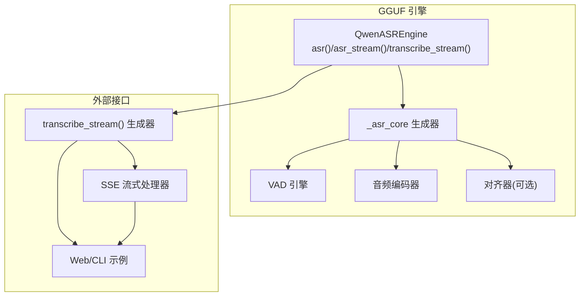
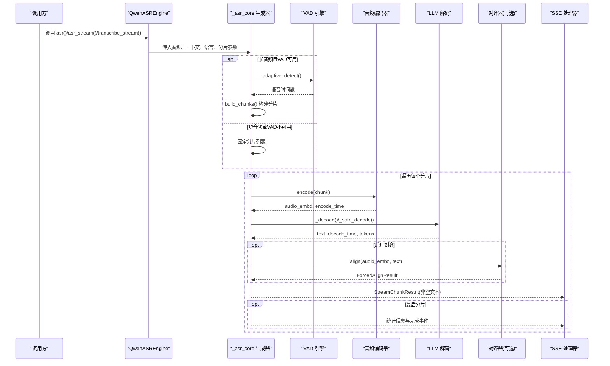
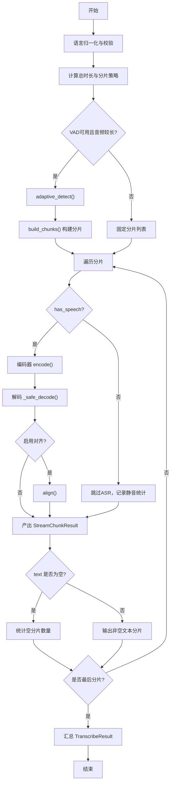
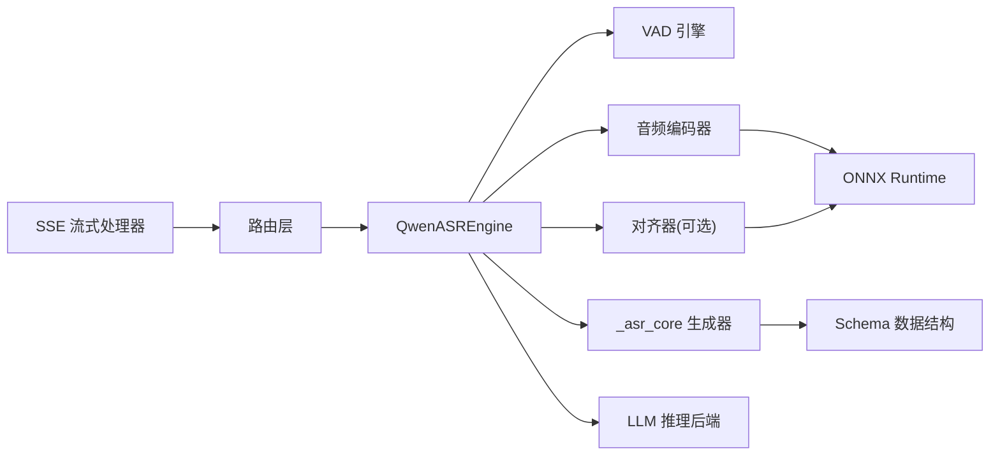

# 统一流水线与生成器

<cite>
**本文引用的文件**
- [qwen_asr_gguf/inference/asr.py](file://qwen_asr_gguf/inference/asr.py)
- [qwen_asr_gguf/inference/schema.py](file://qwen_asr_gguf/inference/schema.py)
- [qwen_asr_gguf/inference/encoder.py](file://qwen_asr_gguf/inference/encoder.py)
- [qwen_asr_gguf/inference/vad.py](file://qwen_asr_gguf/inference/vad.py)
- [qwen_asr_gguf/inference/utils.py](file://qwen_asr_gguf/inference/utils.py)
- [qwen_asr_gguf/inference/audio.py](file://qwen_asr_gguf/inference/audio.py)
- [qwen_asr_gguf/inference/aligner.py](file://qwen_asr_gguf/inference/aligner.py)
- [examples/example_qwen3_asr_transformers.py](file://examples/example_qwen3_asr_transformers.py)
- [examples/example_qwen3_asr_vllm.py](file://examples/example_qwen3_asr_vllm.py)
- [examples/example_qwen3_asr_vllm_streaming.py](file://examples/example_qwen3_asr_vllm_streaming.py)
- [qwen_asr/cli/demo.py](file://qwen_asr/cli/demo.py)
- [qwen_asr/cli/demo_streaming.py](file://qwen_asr/cli/demo_streaming.py)
- [routers/transcribe.py](file://routers/transcribe.py)
</cite>

## 更新摘要
**变更内容**
- 更新流式ASR输出优化：移除空文本转录和最终摘要生成
- 改进错误处理和进度报告机制
- 新增详细的统计信息追踪系统
- 优化VAD动态分片与静音跳过策略
- 增强性能统计和异常处理

## 目录
1. [简介](#简介)
2. [项目结构](#项目结构)
3. [核心组件](#核心组件)
4. [架构总览](#架构总览)
5. [详细组件分析](#详细组件分析)
6. [依赖分析](#依赖分析)
7. [性能考量](#性能考量)
8. [故障排查指南](#故障排查指南)
9. [结论](#结论)
10. [附录](#附录)

## 简介
本技术文档围绕 QwenASR 引擎的"统一流水线与生成器"能力展开，重点阐释 asr() 与 asr_stream() 的统一实现机制，以及 transcribe_stream() 的流式产出。文档将从架构、组件、数据流、状态管理、分片与对齐、性能统计、生命周期与异常处理等方面进行系统化说明，并给出 API 使用示例与扩展建议。

**更新** 本版本反映了流式ASR输出的重大优化：移除了空文本转录和最终摘要生成，改进了错误处理和进度报告机制，新增了详细的统计信息追踪系统。

## 项目结构
本仓库包含两类 ASR 能力：
- Transformers/vLLM 后端的 Python API（qwen_asr 包），支持一次性与流式推理，以及可选的强制对齐。
- GGUF 后端的高性能推理引擎（qwen_asr_gguf 包），提供统一流水线 _asr_core 生成器，支持一次性 asr() 与流式 asr_stream()/transcribe_stream()，并内置 VAD 动态分片、静音跳过、性能统计与抗幻觉策略。

**图表来源**
- [qwen_asr_gguf/inference/asr.py:40-142](file://qwen_asr_gguf/inference/asr.py#L40-L142)
- [qwen_asr_gguf/inference/vad.py:29-81](file://qwen_asr_gguf/inference/vad.py#L29-L81)
- [qwen_asr_gguf/inference/encoder.py:119-196](file://qwen_asr_gguf/inference/encoder.py#L119-L196)
- [qwen_asr_gguf/inference/aligner.py:229-258](file://qwen_asr_gguf/inference/aligner.py#L229-L258)
- [routers/transcribe.py:300-402](file://routers/transcribe.py#L300-L402)

**章节来源**
- [qwen_asr_gguf/inference/asr.py:40-142](file://qwen_asr_gguf/inference/asr.py#L40-L142)
- [qwen_asr_gguf/inference/schema.py:162-210](file://qwen_asr_gguf/inference/schema.py#L162-L210)

## 核心组件
- QwenASREngine：引擎主体，负责配置加载、VAD 延迟初始化、编码器与对齐器装配、统一流水线 _asr_core 的调度与结果聚合。
- _asr_core 生成器：统一的分片处理与结果产出逻辑，支持一次性与流式两种模式。
- VAD 引擎：长音频自适应静音过滤，动态分片构建。
- 音频编码器：Split 前端/后端 ONNX 推理，输出音频嵌入。
- 对齐器：可选的强制对齐模块，提供词级时间戳。
- Schema 数据结构：定义 StreamChunkResult、TranscribeResult、VADChunk、ForcedAlignItem 等核心数据类型。

**章节来源**
- [qwen_asr_gguf/inference/asr.py:40-142](file://qwen_asr_gguf/inference/asr.py#L40-L142)
- [qwen_asr_gguf/inference/schema.py:220-235](file://qwen_asr_gguf/inference/schema.py#L220-L235)
- [qwen_asr_gguf/inference/vad.py:29-81](file://qwen_asr_gguf/inference/vad.py#L29-L81)
- [qwen_asr_gguf/inference/encoder.py:119-196](file://qwen_asr_gguf/inference/encoder.py#L119-L196)
- [qwen_asr_gguf/inference/aligner.py:229-258](file://qwen_asr_gguf/inference/aligner.py#L229-L258)

## 架构总览
统一流水线以 _asr_core 为核心，贯穿以下关键阶段：
- 语言与分片策略选择：短音频直接处理；长音频在 VAD 可用时采用自适应动态分片，否则固定等长分片。
- 静音跳过：VAD 判定静音的分片直接跳过 ASR 推理，仅返回空文本与统计信息。
- 编码与解码：编码器提取音频嵌入，构建提示序列，调用 LLM 解码，支持抗幻觉与重试。
- 对齐与统计：可选对齐器生成词级时间戳，统一性能统计输出。
- 结果聚合：一次性模式收集所有分片；流式模式逐片产出 StreamChunkResult。

**更新** 流式输出现在移除了空文本转录，只输出非空文本分片，并提供了详细的统计信息追踪。

**图表来源**
- [qwen_asr_gguf/inference/asr.py:519-596](file://qwen_asr_gguf/inference/asr.py#L519-L596)
- [qwen_asr_gguf/inference/asr.py:602-800](file://qwen_asr_gguf/inference/asr.py#L602-L800)
- [qwen_asr_gguf/inference/vad.py:160-222](file://qwen_asr_gguf/inference/vad.py#L160-L222)
- [qwen_asr_gguf/inference/encoder.py:260-280](file://qwen_asr_gguf/inference/encoder.py#L260-L280)
- [qwen_asr_gguf/inference/aligner.py:260-348](file://qwen_asr_gguf/inference/aligner.py#L260-L348)
- [routers/transcribe.py:300-402](file://routers/transcribe.py#L300-L402)

## 详细组件分析

### 统一流水线 _asr_core 生成器
- 设计理念
  - 以生成器形式串联分片处理，支持一次性聚合与流式产出。
  - 语言与分片策略在生成器入口统一决策，保证一致性。
  - 抗幻觉与稳定性：预填充/生成耗时统计、token 级/短语级重复熔断、max_new_tokens 上限、重试与去重后处理。
- 状态与记忆
  - asr_memory：保留最近 N 片文本，形成上下文前缀；VAD 模式下仅保留文本，避免非连续音频拼接导致的模型混乱。
  - 统计字典：累计 encode_time、decode_time、prefill_tokens、decode_tokens、align_time、vad_time、vad_skipped_chunks 等。
- 分片策略
  - 短音频（≤ dynamic_threshold）：单一分片直接处理。
  - 长音频（VAD 可用）：自适应阈值 VAD 检测，构建语音边界分片，避免句中截断与静音中间截断。
  - 降级（VAD 不可用）：固定等长分片。
- 结果产出
  - 静音分片：skipped_by_vad=True，text=""，full_text 仅在 is_last=True 时填充。
  - 语音分片：文本与可选对齐项逐步累加，最后汇总为 TranscribeResult。

**更新** 流式输出现在移除了空文本转录，只在非空文本分片时进行输出，提高了流式传输的效率。

**图表来源**
- [qwen_asr_gguf/inference/asr.py:602-800](file://qwen_asr_gguf/inference/asr.py#L602-L800)
- [qwen_asr_gguf/inference/vad.py:299-406](file://qwen_asr_gguf/inference/vad.py#L299-L406)
- [qwen_asr_gguf/inference/encoder.py:260-280](file://qwen_asr_gguf/inference/encoder.py#L260-L280)
- [qwen_asr_gguf/inference/aligner.py:260-348](file://qwen_asr_gguf/inference/aligner.py#L260-L348)
- [routers/transcribe.py:323-326](file://routers/transcribe.py#L323-L326)

**章节来源**
- [qwen_asr_gguf/inference/asr.py:519-596](file://qwen_asr_gguf/inference/asr.py#L519-L596)
- [qwen_asr_gguf/inference/asr.py:602-800](file://qwen_asr_gguf/inference/asr.py#L602-L800)

### StreamChunkResult 数据结构与状态标志
- 字段说明
  - segment_idx：分片序号（从 0 开始）
  - text：本分片转写文本
  - start_sec/end_sec：分片音频起止时间（秒）
  - is_last：是否为最后一个分片
  - skipped_by_vad：是否被 VAD 判定为静音并跳过
  - full_text：截至当前的累积全文（仅 is_last=True 时填充完整值）
  - encode_time/decode_time/prefill_time：各阶段耗时（秒）
- 状态标志位含义
  - skipped_by_vad：指示该分片是否执行了编码与解码；True 时 text 为空，full_text 仅在 is_last=True 时有效。
  - is_last：用于一次性模式下的最终统计与全文聚合。
- 性能统计
  - 生成器内部维护统计字典，逐分片更新；最后分片附加 _stats 与 _align_items 以便一次性结果聚合。

**更新** 新增了详细的统计信息追踪，包括音频时长、分片总数、空分片数量等，用于流式进度报告。

**章节来源**
- [qwen_asr_gguf/inference/schema.py:220-235](file://qwen_asr_gguf/inference/schema.py#L220-L235)
- [qwen_asr_gguf/inference/asr.py:754-774](file://qwen_asr_gguf/inference/asr.py#L754-L774)
- [qwen_asr_gguf/inference/asr.py:536-568](file://qwen_asr_gguf/inference/asr.py#L536-L568)

### VAD 动态分片与静音跳过
- 自适应阈值：基于帧级概率分布计算 30% 分位数，结合初始阈值进行二次分割，提升不同录音环境的鲁棒性。
- 分片构建：合并近邻语音段、贪心打包不超过 max_span_sec 的分片、在语音分片间插入静音分片，确保覆盖全时域。
- 跳过策略：静音分片直接返回空文本，记录 vad_skipped_chunks 与 vad_time，避免无效推理。

**更新** VAD 动态分片现在更加智能，能够根据不同的录音环境自动调整阈值，提高了静音检测的准确性。

**章节来源**
- [qwen_asr_gguf/inference/vad.py:160-222](file://qwen_asr_gguf/inference/vad.py#L160-L222)
- [qwen_asr_gguf/inference/vad.py:299-406](file://qwen_asr_gguf/inference/vad.py#L299-L406)
- [qwen_asr_gguf/inference/asr.py:754-774](file://qwen_asr_gguf/inference/asr.py#L754-L774)

### 编码器与解码器
- 编码器（Split 前端/后端）：Mel 提取、分块推理、拼接与切片、后端 Transformer 推理，支持固定/动态形状模式。
- 解码器：构建提示序列（包含 system/user/audio/assistant/ASR 文本），执行预填充与生成循环，支持抗幻觉与重试，输出文本与统计。

**章节来源**
- [qwen_asr_gguf/inference/encoder.py:119-196](file://qwen_asr_gguf/inference/encoder.py#L119-L196)
- [qwen_asr_gguf/inference/encoder.py:260-280](file://qwen_asr_gguf/inference/encoder.py#L260-L280)
- [qwen_asr_gguf/inference/asr.py:212-345](file://qwen_asr_gguf/inference/asr.py#L212-L345)

### 对齐器（可选）
- 功能：基于文本分词与时间戳 token，对音频嵌入进行推理，输出 ForcedAlignResult。
- 后处理：reconcile 将对齐项映射回原文本形态，补齐标点与空格，修正异常时间戳。

**更新** 对齐器现在只在文本非空时执行，避免了对静音分片的无效对齐操作。

**章节来源**
- [qwen_asr_gguf/inference/aligner.py:229-258](file://qwen_asr_gguf/inference/aligner.py#L229-L258)
- [qwen_asr_gguf/inference/aligner.py:260-348](file://qwen_asr_gguf/inference/aligner.py#L260-L348)

### 生命周期管理、异常处理与资源清理
- 生命周期
  - 初始化：加载编码器、对齐器（可选）、延迟初始化 VAD。
  - 运行：_asr_core 生成器驱动分片处理；一次性模式聚合结果；流式模式逐片产出。
  - 关闭：shutdown() 释放 VAD 资源。
- 异常处理
  - 上下文窗口越界保护：超过 n_ctx 直接返回空文本并标记 is_aborted。
  - 重复/幻觉熔断：token 级与短语级重复检测，必要时重试并提高温度。
  - 去重后处理：detect_and_fix_repetitions 修复异常重复。
- 资源清理
  - 生成器内部释放 batch 与 sampler；VAD 引擎提供 shutdown()。

**更新** 新增了完善的异常处理机制，包括流式传输中的取消处理和错误报告。

**章节来源**
- [qwen_asr_gguf/inference/asr.py:212-345](file://qwen_asr_gguf/inference/asr.py#L212-L345)
- [qwen_asr_gguf/inference/asr.py:351-388](file://qwen_asr_gguf/inference/asr.py#L351-L388)
- [qwen_asr_gguf/inference/asr.py:137-142](file://qwen_asr_gguf/inference/asr.py#L137-L142)
- [qwen_asr_gguf/inference/utils.py:58-134](file://qwen_asr_gguf/inference/utils.py#L58-L134)

### API 使用示例与最佳实践
- 一次性转录（离线）
  - 使用 asr() 或 transcribe()，传入音频、上下文、语言、分片大小与记忆数等参数，获得 TranscribeResult。
- 流式转录（SSE/WebSocket）
  - 使用 asr_stream() 或 transcribe_stream()，逐片消费 StreamChunkResult，实时显示文本与统计。
  - **更新** 流式输出现在移除了空文本转录，只输出非空文本分片，提高了传输效率。
- vLLM 流式推理（浏览器演示）
  - 使用示例脚本启动本地服务，通过浏览器麦克风实时推送音频分片，查看语言与文本流式输出。
- 批处理与多后端
  - Transformers 与 vLLM 后端均可使用，示例脚本展示了混合输入与批量推理的用法。

**更新** 流式输出现在提供了更详细的统计信息，包括音频时长、分片总数、空分片数量等，便于前端进行进度展示。

**章节来源**
- [qwen_asr_gguf/inference/asr.py:432-514](file://qwen_asr_gguf/inference/asr.py#L432-L514)
- [qwen_asr_gguf/inference/asr.py:519-596](file://qwen_asr_gguf/inference/asr.py#L519-L596)
- [examples/example_qwen3_asr_transformers.py:127-151](file://examples/example_qwen3_asr_transformers.py#L127-L151)
- [examples/example_qwen3_asr_vllm.py:131-153](file://examples/example_qwen3_asr_vllm.py#L131-L153)
- [examples/example_qwen3_asr_vllm_streaming.py:88-106](file://examples/example_qwen3_asr_vllm_streaming.py#L88-L106)
- [qwen_asr/cli/demo_streaming.py:417-470](file://qwen_asr/cli/demo_streaming.py#L417-L470)

## 依赖分析
- 组件耦合
  - QwenASREngine 依赖 VAD、编码器、对齐器（可选）与 LLM 推理后端。
  - _asr_core 生成器内部协调 VAD、编码器与解码器，通过 Schema 数据结构传递结果。
- 外部依赖
  - VAD 引擎依赖 fireredvad；编码器依赖 onnxruntime；对齐器依赖 ONNX 推理与 llama.cpp 上下文。
- 并发与扩展
  - 生成器天然支持异步消费；可与 asyncio、aiohttp、Flask 等框架集成。
  - 可替换后端（如更换 LLM 推理库）只需实现统一的提示构建与解码接口。

**图表来源**
- [qwen_asr_gguf/inference/asr.py:40-142](file://qwen_asr_gguf/inference/asr.py#L40-L142)
- [qwen_asr_gguf/inference/vad.py:51-81](file://qwen_asr_gguf/inference/vad.py#L51-L81)
- [qwen_asr_gguf/inference/encoder.py:173-176](file://qwen_asr_gguf/inference/encoder.py#L173-L176)
- [qwen_asr_gguf/inference/aligner.py:239-258](file://qwen_asr_gguf/inference/aligner.py#L239-L258)
- [qwen_asr_gguf/inference/schema.py:220-235](file://qwen_asr_gguf/inference/schema.py#L220-L235)
- [routers/transcribe.py:300-402](file://routers/transcribe.py#L300-L402)

**章节来源**
- [qwen_asr_gguf/inference/asr.py:40-142](file://qwen_asr_gguf/inference/asr.py#L40-L142)
- [qwen_asr_gguf/inference/vad.py:51-81](file://qwen_asr_gguf/inference/vad.py#L51-L81)
- [qwen_asr_gguf/inference/encoder.py:173-176](file://qwen_asr_gguf/inference/encoder.py#L173-L176)
- [qwen_asr_gguf/inference/aligner.py:239-258](file://qwen_asr_gguf/inference/aligner.py#L239-L258)
- [qwen_asr_gguf/inference/schema.py:220-235](file://qwen_asr_gguf/inference/schema.py#L220-L235)

## 性能考量
- VAD 动态分片：长音频按语音边界分片，减少无效推理，显著降低 RTF。
- 静音跳过：静音分片直接跳过，避免空转与幻觉。
- 编码器优化：Split 前端/后端并行推理，动态形状模式减少冗余计算。
- 抗幻觉与稳定性：预填充/生成耗时统计、重复熔断、重试与去重后处理。
- 统计打印：提供 RTF、编码/解码速度、VAD/对齐耗时等指标，便于定位瓶颈。

**更新** 新增了详细的统计信息追踪，包括空分片数量、音频时长等，用于流式进度报告和性能监控。

**章节来源**
- [qwen_asr_gguf/inference/asr.py:351-388](file://qwen_asr_gguf/inference/asr.py#L351-L388)
- [qwen_asr_gguf/inference/asr.py:684-721](file://qwen_asr_gguf/inference/asr.py#L684-L721)
- [qwen_asr_gguf/inference/encoder.py:173-196](file://qwen_asr_gguf/inference/encoder.py#L173-L196)

## 故障排查指南
- 常见问题
  - VAD 未安装：安装 fireredvad 或在配置中禁用 VAD。
  - ONNX Provider 不可用：检查 CUDA/ROCm/DML 等 Provider 可用性，回退到 CPU。
  - 上下文窗口溢出：适当缩短分片或降低 max_new_tokens。
  - 重复/幻觉：启用去重后处理，必要时提高温度或减小分片。
- 定位手段
  - 查看性能统计日志，关注 encode_time、decode_time、vad_time、align_time。
  - 检查 skipped_by_vad 比例，评估 VAD 阈值与分片策略。
  - 使用示例脚本快速验证后端与配置。

**更新** 新增了流式传输中的错误处理和进度报告机制，包括任务取消和异常捕获。

**章节来源**
- [qwen_asr_gguf/inference/asr.py:212-345](file://qwen_asr_gguf/inference/asr.py#L212-L345)
- [qwen_asr_gguf/inference/asr.py:351-388](file://qwen_asr_gguf/inference/asr.py#L351-L388)
- [qwen_asr_gguf/inference/vad.py:51-81](file://qwen_asr_gguf/inference/vad.py#L51-L81)
- [qwen_asr_gguf/inference/encoder.py:173-196](file://qwen_asr_gguf/inference/encoder.py#L173-L196)

## 结论
QwenASR 引擎通过统一流水线 _asr_core 生成器，实现了 asr() 与 asr_stream()/transcribe_stream() 的统一与高效协同。借助 VAD 动态分片、静音跳过、抗幻觉与性能统计，系统在准确率与实时性之间取得良好平衡。

**更新** 本版本的流式ASR输出优化显著提升了传输效率，移除了空文本转录，改进了错误处理和进度报告机制，新增了详细的统计信息追踪，为实时应用场景提供了更好的支持。

对于架构师与开发者，建议优先采用生成器模式进行流式集成，结合示例脚本与 Schema 数据结构快速落地。

## 附录
- API 一览
  - asr()/asr_stream()/transcribe()/transcribe_stream()：一次性与流式入口。
  - _asr_core：统一流水线核心，返回生成器。
  - VAD：adaptive_detect()/build_chunks()。
  - 编码器：encode()。
  - 对齐器：align()。
- 示例参考
  - 一次性与批量：[example_qwen3_asr_transformers.py:127-151](file://examples/example_qwen3_asr_transformers.py#L127-L151)、[example_qwen3_asr_vllm.py:131-153](file://examples/example_qwen3_asr_vllm.py#L131-L153)
  - 流式浏览器演示：[demo_streaming.py:417-470](file://qwen_asr/cli/demo_streaming.py#L417-L470)
  - 流式推理脚本：[example_qwen3_asr_vllm_streaming.py:88-106](file://examples/example_qwen3_asr_vllm_streaming.py#L88-L106)
  - SSE 流式处理器：[transcribe.py:300-402](file://routers/transcribe.py#L300-L402)