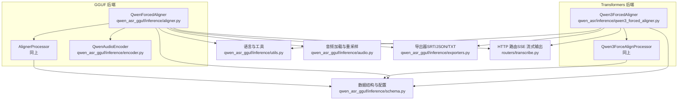
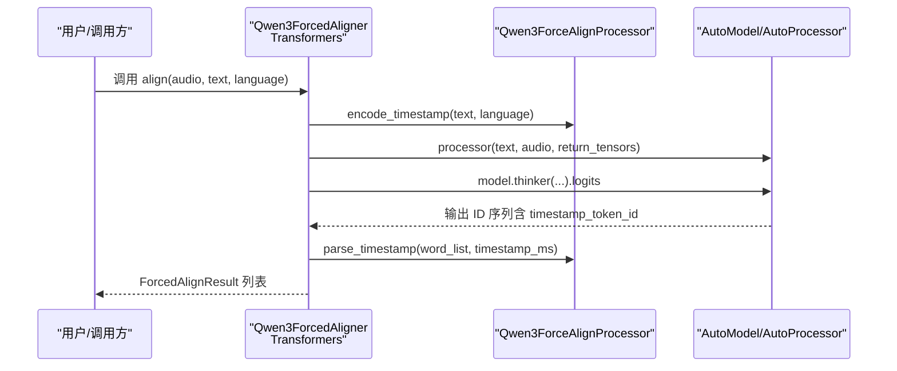
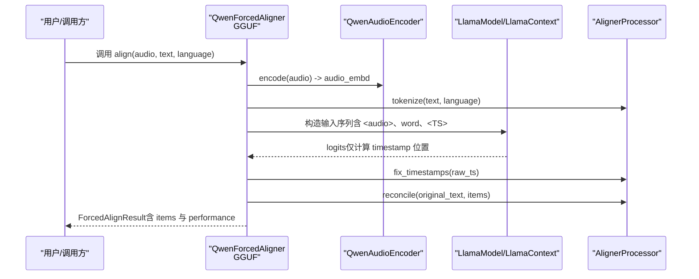
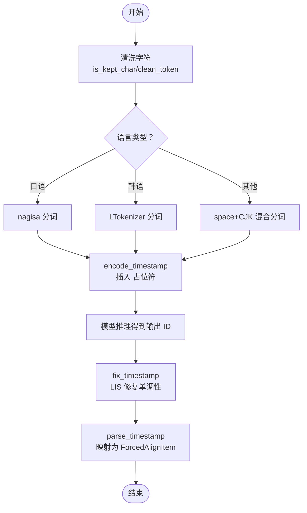
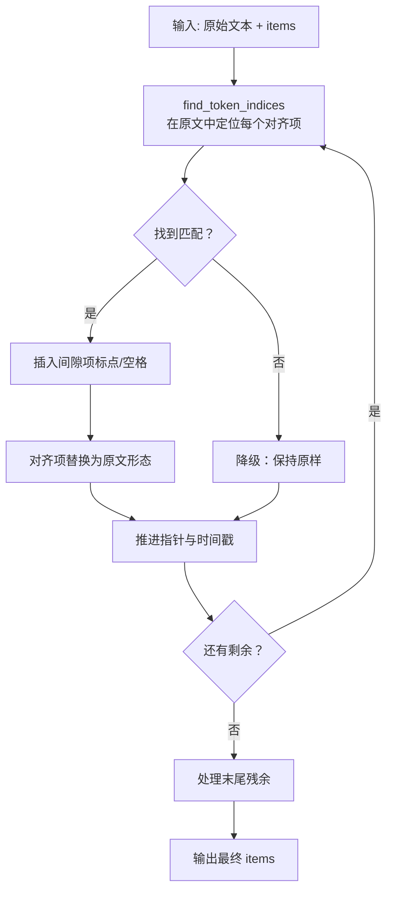
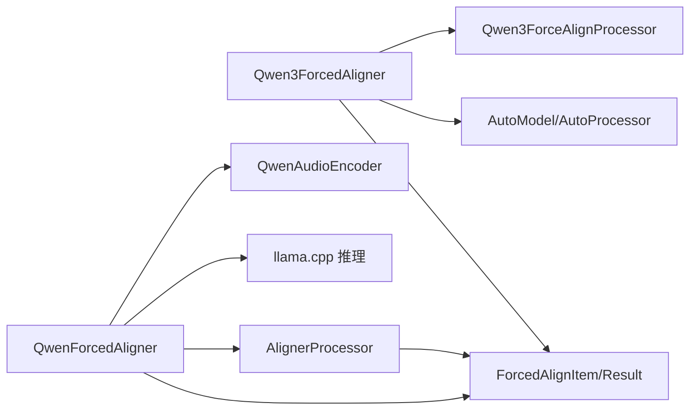

# 强制对齐功能

<cite>
**本文引用的文件**
- [qwen3_forced_aligner.py](file://qwen_asr/inference/qwen3_forced_aligner.py)
- [example_qwen3_forced_aligner.py](file://examples/example_qwen3_forced_aligner.py)
- [aligner.py](file://qwen_asr_gguf/inference/aligner.py)
- [schema.py](file://qwen_asr_gguf/inference/schema.py)
- [utils.py](file://qwen_asr_gguf/inference/utils.py)
- [audio.py](file://qwen_asr_gguf/inference/audio.py)
- [exporters.py](file://qwen_asr_gguf/inference/exporters.py)
- [encoder.py](file://qwen_asr_gguf/inference/encoder.py)
- [transcribe.py](file://routers/transcribe.py)
</cite>

## 目录
1. [简介](#简介)
2. [项目结构](#项目结构)
3. [核心组件](#核心组件)
4. [架构总览](#架构总览)
5. [详细组件分析](#详细组件分析)
6. [依赖关系分析](#依赖关系分析)
7. [性能考虑](#性能考虑)
8. [故障排查指南](#故障排查指南)
9. [结论](#结论)
10. [附录](#附录)

## 简介
本技术文档围绕“强制对齐”能力展开，系统阐述时间戳对齐算法的原理与实现，涵盖音频特征提取、文本分词与对齐、时间坐标映射、数据结构设计与使用、精度影响因素与优化策略、性能考量、配置参数与调优指南、输出格式规范，以及如何在工程中启用对齐功能、处理对齐结果并生成字幕文件。文档同时提供面向精确时间戳应用场景的实用配置建议与最佳实践。

## 项目结构
本仓库提供了两套对齐实现：
- Transformers 后端实现（HuggingFace 风格）：位于 qwen_asr/inference 下，适合快速集成与验证。
- GGUF 后端实现（ONNX + llama.cpp）：位于 qwen_asr_gguf/inference 下，适合高性能部署与推理。

二者共享统一的数据结构与导出接口，便于在不同后端之间切换与迁移。

图表来源
- [qwen3_forced_aligner.py:309-484](file://qwen_asr/inference/qwen3_forced_aligner.py#L309-L484)
- [aligner.py:229-350](file://qwen_asr_gguf/inference/aligner.py#L229-L350)
- [schema.py:46-85](file://qwen_asr_gguf/inference/schema.py#L46-L85)
- [utils.py:38-56](file://qwen_asr_gguf/inference/utils.py#L38-L56)
- [audio.py:66-149](file://qwen_asr_gguf/inference/audio.py#L66-L149)
- [exporters.py:10-119](file://qwen_asr_gguf/inference/exporters.py#L10-L119)
- [transcribe.py:333-359](file://routers/transcribe.py#L333-L359)

章节来源
- [qwen3_forced_aligner.py:1-484](file://qwen_asr/inference/qwen3_forced_aligner.py#L1-L484)
- [aligner.py:1-350](file://qwen_asr_gguf/inference/aligner.py#L1-L350)
- [schema.py:1-235](file://qwen_asr_gguf/inference/schema.py#L1-L235)
- [utils.py:1-134](file://qwen_asr_gguf/inference/utils.py#L1-L134)
- [audio.py:1-149](file://qwen_asr_gguf/inference/audio.py#L1-L149)
- [exporters.py:1-119](file://qwen_asr_gguf/inference/exporters.py#L1-L119)
- [transcribe.py:333-359](file://routers/transcribe.py#L333-L359)

## 核心组件
- 数据结构
  - ForcedAlignItem：单个对齐单元，包含文本、起始时间与结束时间。
  - ForcedAlignResult：对齐结果集合，支持迭代、长度与索引访问。
  - AlignerConfig：对齐引擎配置（模型目录、前后端模型文件名、上下文长度、是否使用GPU、填充时长等）。
- 文本处理器
  - Qwen3ForceAlignProcessor（Transformers 后端）：负责清洗字符、CJK混合分词、日/韩分词、时间戳占位符编码与时间戳解析。
  - AlignerProcessor（GGUF 后端）：负责分词、时间戳修复（最长递增子序列约束）、与原文对齐（reconcile）。
- 对齐器
  - Qwen3ForcedAligner（Transformers 后端）：提供 from_pretrained 初始化、批量/单样本对齐、设备与dtype管理。
  - QwenForcedAligner（GGUF 后端）：基于 Split ONNX 编码器 + LLM 解码器，支持时间戳预测、修复与后处理。
- 导出器
  - alignment_to_srt / alignment_to_json / export_to_srt / export_to_json / export_to_txt：将对齐结果导出为 SRT、JSON 或 TXT。
- 路由与服务
  - routers/transcribe.py：在流式转录中按标记输出 SRT 与对齐数据。

章节来源
- [qwen3_forced_aligner.py:270-318](file://qwen_asr/inference/qwen3_forced_aligner.py#L270-L318)
- [aligner.py:17-228](file://qwen_asr_gguf/inference/aligner.py#L17-L228)
- [schema.py:46-85](file://qwen_asr_gguf/inference/schema.py#L46-L85)
- [exporters.py:10-119](file://qwen_asr_gguf/inference/exporters.py#L10-L119)
- [transcribe.py:333-359](file://routers/transcribe.py#L333-L359)

## 架构总览
下图展示了两种后端的对齐流程：Transformers 后端通过 HuggingFace AutoModel/AutoProcessor 进行推理；GGUF 后端通过 Split ONNX 编码器与 llama.cpp 推理。

图表来源
- [qwen3_forced_aligner.py:394-460](file://qwen_asr/inference/qwen3_forced_aligner.py#L394-L460)

图表来源
- [aligner.py:260-348](file://qwen_asr_gguf/inference/aligner.py#L260-L348)
- [encoder.py:260-280](file://qwen_asr_gguf/inference/encoder.py#L260-L280)

## 详细组件分析

### 数据结构设计与使用
- ForcedAlignItem
  - 字段：text（对齐单元文本）、start_time（秒）、end_time（秒）。
  - 用途：作为 ForcedAlignResult 的元素，提供属性访问与序列化。
- ForcedAlignResult
  - 字段：items（ForcedAlignItem 列表），可选 performance（性能统计）。
  - 用途：承载一次样本的对齐输出，支持迭代、长度与索引访问。
- AlignerConfig
  - 字段：model_dir、encoder_frontend_fn、encoder_backend_fn、llm_fn、use_gpu、n_ctx、pad_to。
  - 用途：统一配置 GGUF 对齐引擎的模型路径与运行参数。

章节来源
- [schema.py:46-85](file://qwen_asr_gguf/inference/schema.py#L46-L85)

### 文本预处理与时间戳修复（Transformers 后端）
- 清洗与分词
  - is_kept_char/clean_token：仅保留字母与数字，剔除噪声字符。
  - tokenize_space_lang/tokenize_japanese/tokenize_korean：按语言选择分词策略。
  - split_segment_with_chinese：CJK 字符与拉丁字符混合处理。
- 时间戳占位符编码
  - encode_timestamp：为每个词插入时间戳占位符，构造模型输入文本。
- 时间戳解析与修复
  - fix_timestamp：基于最长递增子序列（LIS）约束，修复时间戳单调性问题。
  - parse_timestamp：将修复后的时间戳映射为 ForcedAlignItem 列表。

图表来源
- [qwen3_forced_aligner.py:147-267](file://qwen_asr/inference/qwen3_forced_aligner.py#L147-L267)

章节来源
- [qwen3_forced_aligner.py:37-267](file://qwen_asr/inference/qwen3_forced_aligner.py#L37-L267)

### 文本预处理与时间戳修复（GGUF 后端）
- 分词与 Prompt 构造
  - tokenize：根据语言选择分词策略，支持日/韩/通用。
  - 构造序列：<audio_start> + 音频嵌入 + <audio_end> + 词 + <TS> + <TS>...
- 时间戳修复
  - fix_timestamps：LIS 修复单调性，支持短异常区段内插与两侧外推。
- 与原文对齐（reconcile）
  - reconcile：将干净对齐项与原文对齐，恢复标点与空格，形成最终字幕级粒度。

图表来源
- [aligner.py:138-228](file://qwen_asr_gguf/inference/aligner.py#L138-L228)

章节来源
- [aligner.py:17-228](file://qwen_asr_gguf/inference/aligner.py#L17-L228)

### 对齐器（Transformers 后端）
- 初始化与设备管理
  - from_pretrained：注册 AutoConfig/AutoModel/AutoProcessor，加载模型与处理器。
  - 设备与 dtype：自动探测模型设备，支持 bfloat16 等。
- 批处理与输入归一化
  - align：支持单样本与批量；音频统一归一化为 mono 16k float32。
- 输出结构化
  - _to_structured_items：将字典列表转换为 ForcedAlignResult。

章节来源
- [qwen3_forced_aligner.py:340-460](file://qwen_asr/inference/qwen3_forced_aligner.py#L340-L460)

### 对齐器（GGUF 后端）
- Split ONNX 编码器
  - QwenAudioEncoder：前端 Mel 提取与分块推理，后端 Transformer 编码，输出音频嵌入。
- LLM 解码与时间戳预测
  - 构造输入序列，仅在时间戳位置计算 logits，加速解码。
  - fix_timestamps 与 reconcile 后处理。
- 性能统计
  - 返回 performance 字典，包含 encoder_time、decoder_time、total_time。

章节来源
- [aligner.py:229-348](file://qwen_asr_gguf/inference/aligner.py#L229-L348)
- [encoder.py:119-280](file://qwen_asr_gguf/inference/encoder.py#L119-L280)

### 导出与字幕生成
- alignment_to_srt：按中文/英文标点与换行规则切分，生成 SRT 字幕。
- alignment_to_json：导出为 JSON 列表，包含 text、start、end。
- export_to_srt/export_to_json/export_to_txt：将结果写入文件。
- 路由集成：在 SSE 流式输出中按标记返回 SRT 与 alignment 字段。

章节来源
- [exporters.py:10-119](file://qwen_asr_gguf/inference/exporters.py#L10-L119)
- [transcribe.py:333-359](file://routers/transcribe.py#L333-L359)

## 依赖关系分析
- 组件耦合
  - Transformers 后端：Qwen3ForcedAligner 依赖 AutoModel/AutoProcessor 与 Qwen3ForceAlignProcessor。
  - GGUF 后端：QwenForcedAligner 依赖 QwenAudioEncoder、llama.cpp 推理上下文与 AlignerProcessor。
- 外部依赖
  - Transformers 后端：nagisa（日语分词）、soynlp（韩语分词）、transformers。
  - GGUF 后端：onnxruntime（ONNX 推理）、llama.cpp（推理引擎）、numpy、soundfile/ffmpeg（音频读取）。
- 数据契约
  - 两者均使用 ForcedAlignItem/ForcedAlignResult 作为统一输出格式，便于跨后端迁移。

图表来源
- [qwen3_forced_aligner.py:309-484](file://qwen_asr/inference/qwen3_forced_aligner.py#L309-L484)
- [aligner.py:229-350](file://qwen_asr_gguf/inference/aligner.py#L229-L350)
- [schema.py:46-85](file://qwen_asr_gguf/inference/schema.py#L46-L85)

章节来源
- [qwen3_forced_aligner.py:20-35](file://qwen_asr/inference/qwen3_forced_aligner.py#L20-L35)
- [aligner.py:1-16](file://qwen_asr_gguf/inference/aligner.py#L1-L16)

## 性能考虑
- 推理加速
  - Transformers 后端：仅对 timestamp 位置计算 logits，减少无效计算。
  - GGUF 后端：仅在时间戳位置设置 logits 标志，加速解码。
- 编码器优化
  - Split ONNX：前端分块推理 + 后端 Transformer，支持固定形状填充与注意力掩码。
  - FastWhisperMel：纯 NumPy 实现，避免 JIT 启动开销。
- 设备与精度
  - Transformers 后端：支持 device_map 与 dtype（如 bfloat16）。
  - GGUF 后端：可选择 CUDA/ROCm/DML 等 Provider，动态/固定形状模式。
- I/O 与音频处理
  - audio.load_audio：优先使用 soundfile，否则回退 ffmpeg；支持起始偏移与时长裁剪。

章节来源
- [aligner.py:306-323](file://qwen_asr_gguf/inference/aligner.py#L306-L323)
- [encoder.py:198-258](file://qwen_asr_gguf/inference/encoder.py#L198-L258)
- [audio.py:66-149](file://qwen_asr_gguf/inference/audio.py#L66-L149)

## 故障排查指南
- 语言不支持
  - 使用 utils.validate_language 校验语言名称；Transformers 后端支持日/韩/通用分词。
- 输入格式问题
  - 音频支持路径/URL/base64/(np.ndarray, sr)，Transformers 后端会统一归一化。
  - GGUF 后端需保证采样率与通道正确（单声道、16kHz/24kHz）。
- 时间戳异常
  - 若出现时间戳倒序或跳跃，检查 fix_timestamps 逻辑是否生效；必要时调整模型或文本分词。
- 性能瓶颈
  - 检查设备与 Provider 选择；确认是否启用 GPU；评估 pad_to 与 n_ctx 设置。
- 导出问题
  - SRT/JSON/TXT 导出依赖 exporters；确保 ForcedAlignResult.items 不为空。

章节来源
- [utils.py:38-56](file://qwen_asr_gguf/inference/utils.py#L38-L56)
- [audio.py:66-149](file://qwen_asr_gguf/inference/audio.py#L66-L149)
- [exporters.py:10-119](file://qwen_asr_gguf/inference/exporters.py#L10-L119)

## 结论
强制对齐功能通过“文本分词 + 音频编码 + 时间戳预测 + 修复与对齐”的流水线，实现了高精度的时间戳对齐。Transformers 后端易于集成，GGUF 后端具备更强的推理性能与部署灵活性。统一的数据结构与导出接口使得两种后端可以平滑切换。在实际应用中，应结合音频质量、语言特性与性能需求选择合适的后端与配置参数。

## 附录

### 对齐配置参数说明
- Transformers 后端（Qwen3ForcedAligner）
  - from_pretrained：支持 device_map、dtype 等参数传递给 AutoModel。
  - align：支持 audio（路径/URL/base64/(np.ndarray, sr)）、text、language。
- GGUF 后端（QwenForcedAligner）
  - AlignerConfig：model_dir、encoder_frontend_fn、encoder_backend_fn、llm_fn、use_gpu、n_ctx、pad_to。
  - QwenForcedAligner.align：offset_sec（时间轴偏移叠加）。

章节来源
- [qwen3_forced_aligner.py:340-460](file://qwen_asr/inference/qwen3_forced_aligner.py#L340-L460)
- [aligner.py:229-348](file://qwen_asr_gguf/inference/aligner.py#L229-L348)
- [schema.py:72-85](file://qwen_asr_gguf/inference/schema.py#L72-L85)

### 算法参数调优指南
- 语言与分词
  - 日语：确保安装 nagisa；韩语：确保安装 soynlp；其他语言使用通用分词。
- 时间戳修复
  - 若出现短异常区段（≤2），采用左右值内插；长异常区段采用线性外推。
- 编码器填充
  - pad_to：控制固定形状填充时长，影响 ONNX 推理性能与内存占用。
- 上下文长度
  - n_ctx：根据音频时长与文本长度合理设置，避免过小导致上下文不足。

章节来源
- [aligner.py:99-136](file://qwen_asr_gguf/inference/aligner.py#L99-L136)
- [encoder.py:119-196](file://qwen_asr_gguf/inference/encoder.py#L119-L196)

### 输出格式规范
- ForcedAlignItem
  - 字段：text（字符串）、start_time（秒）、end_time（秒）。
- ForcedAlignResult
  - 字段：items（ForcedAlignItem 列表），可选 performance（字典）。
- SRT/JSON/TXT
  - SRT：按标点与换行切分，支持 ITN（中文数字转阿拉伯数字）。
  - JSON：列表，每项包含 text、start、end。
  - TXT：ITN + 标点换行。

章节来源
- [schema.py:46-85](file://qwen_asr_gguf/inference/schema.py#L46-L85)
- [exporters.py:10-119](file://qwen_asr_gguf/inference/exporters.py#L10-L119)

### 代码示例（启用对齐、处理结果、生成字幕）
- Transformers 后端示例
  - 参考：[example_qwen3_forced_aligner.py:198-214](file://examples/example_qwen3_forced_aligner.py#L198-L214)
  - 关键步骤：from_pretrained -> align -> 打印/保存结果。
- GGUF 后端示例
  - 参考：[aligner.py:260-348](file://qwen_asr_gguf/inference/aligner.py#L260-L348)
  - 关键步骤：初始化 AlignerConfig -> QwenForcedAligner -> align -> reconcile -> 导出。
- 导出字幕
  - 参考：[exporters.py:86-119](file://qwen_asr_gguf/inference/exporters.py#L86-L119)
  - 关键步骤：alignment_to_srt / alignment_to_json / export_to_srt / export_to_json / export_to_txt。

章节来源
- [example_qwen3_forced_aligner.py:198-214](file://examples/example_qwen3_forced_aligner.py#L198-L214)
- [aligner.py:260-348](file://qwen_asr_gguf/inference/aligner.py#L260-L348)
- [exporters.py:86-119](file://qwen_asr_gguf/inference/exporters.py#L86-L119)