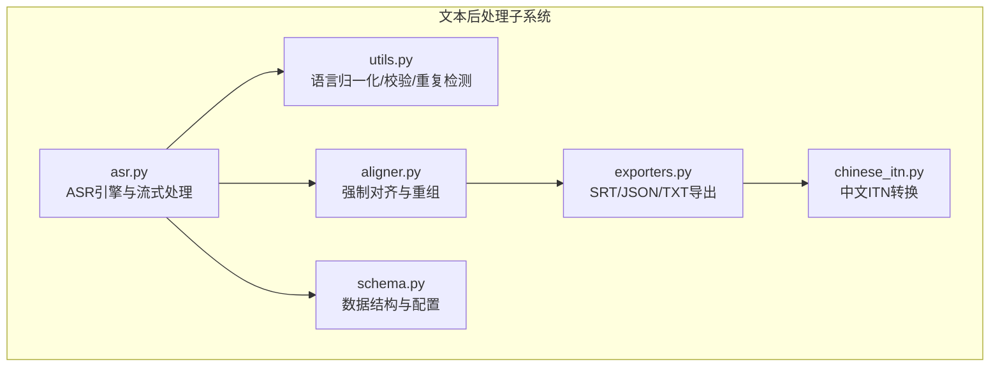
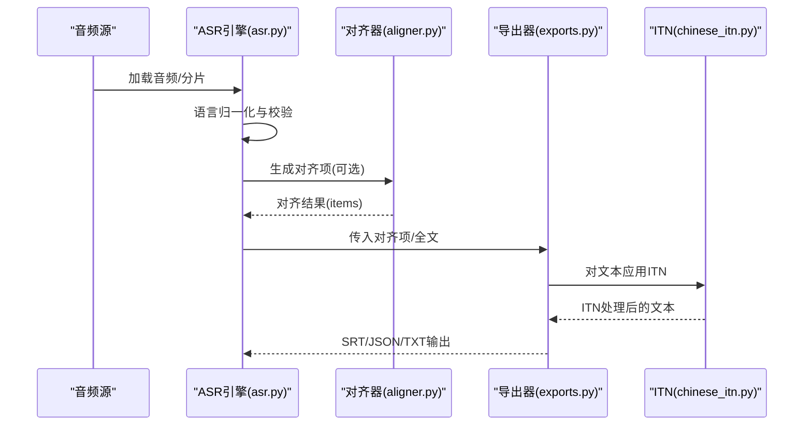
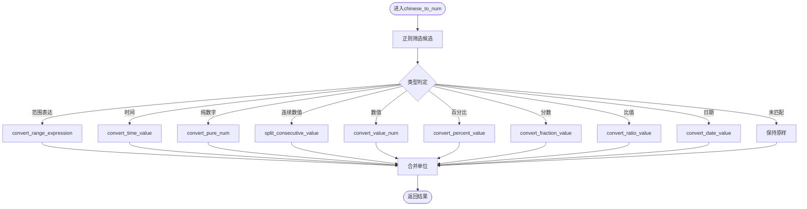
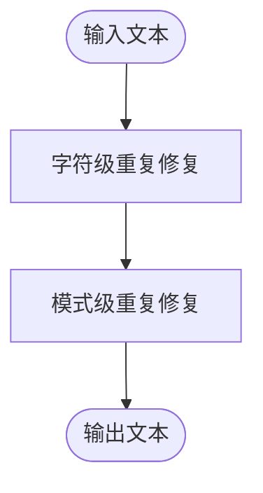
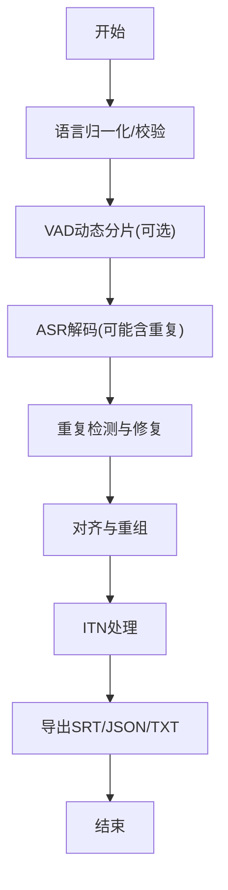
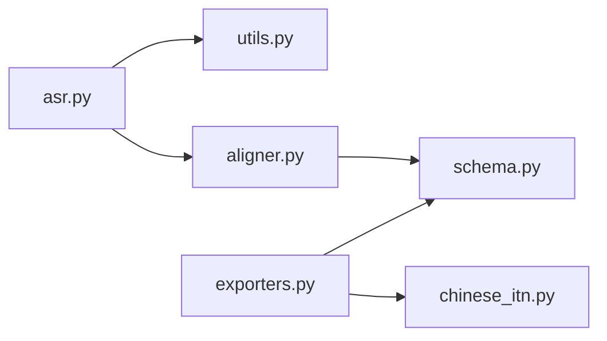

# 文本后处理

<cite>
**本文引用的文件**
- [chinese_itn.py](file://qwen_asr_gguf/inference/chinese_itn.py)
- [utils.py](file://qwen_asr_gguf/inference/utils.py)
- [exporters.py](file://qwen_asr_gguf/inference/exporters.py)
- [asr.py](file://qwen_asr_gguf/inference/asr.py)
- [aligner.py](file://qwen_asr_gguf/inference/aligner.py)
- [schema.py](file://qwen_asr_gguf/inference/schema.py)
- [tts.cpp](file://ref/llama.cpp/tools/tts/tts.cpp)
</cite>

## 目录
1. [简介](#简介)
2. [项目结构](#项目结构)
3. [核心组件](#核心组件)
4. [架构总览](#架构总览)
5. [详细组件分析](#详细组件分析)
6. [依赖分析](#依赖分析)
7. [性能考虑](#性能考虑)
8. [故障排查指南](#故障排查指南)
9. [结论](#结论)
10. [附录](#附录)

## 简介
本文件聚焦于文本后处理能力，系统性阐述以下内容：
- 文本清理与规范化：统一语言名、校验语言、去除异常重复、标点与换行处理。
- ITN（中文数字逆规范化）：中文数字、范围表达、分数、百分比、比值、时间、日期等的转换规则与实现。
- 导出与集成：将对齐结果转换为字幕与文本文件，贯穿 ITN 处理与标点换行。
- 文本处理流程：预处理、清洗、规范化、后处理的完整链路，以及在提升转录质量方面的策略与配置建议。

## 项目结构
与文本后处理相关的核心模块如下：
- 文本工具与语言校验：utils.py
- ITN（中文数字逆规范化）：chinese_itn.py
- 导出器（SRT/JSON/TXT）：exporters.py
- ASR 引擎与流式处理：asr.py
- 对齐与重组：aligner.py
- 数据结构与配置：schema.py
- 参考实现（英文数字转词）：tts.cpp

**图示来源**
- [asr.py:633-637](file://qwen_asr_gguf/inference/asr.py#L633-L637)
- [exporters.py:8](file://qwen_asr_gguf/inference/exporters.py#L8)
- [utils.py:38-56](file://qwen_asr_gguf/inference/utils.py#L38-L56)
- [aligner.py:138-198](file://qwen_asr_gguf/inference/aligner.py#L138-L198)
- [schema.py:212-235](file://qwen_asr_gguf/inference/schema.py#L212-L235)

**章节来源**
- [asr.py:633-637](file://qwen_asr_gguf/inference/asr.py#L633-L637)
- [exporters.py:8](file://qwen_asr_gguf/inference/exporters.py#L8)
- [utils.py:38-56](file://qwen_asr_gguf/inference/utils.py#L38-L56)
- [aligner.py:138-198](file://qwen_asr_gguf/inference/aligner.py#L138-L198)
- [schema.py:212-235](file://qwen_asr_gguf/inference/schema.py#L212-L235)

## 核心组件
- 语言归一化与校验
  - normalize_language_name：将输入语言名标准化为首字母大写、其余小写。
  - validate_language：校验语言是否在支持列表中。
- 重复检测与修复
  - detect_and_fix_repetitions：检测并修复异常重复（字符级与模式级），避免 ASR 幻觉导致的大量重复。
- ITN（中文数字逆规范化）
  - chinese_to_num：主函数，基于多种正则与规则，将中文数字、范围、分数、百分比、比值、时间、日期等转换为阿拉伯数字形式。
- 导出器
  - alignment_to_srt：将对齐结果按标点与长度切分为字幕条目，并应用 ITN。
  - alignment_to_json：导出带时间戳的 JSON。
  - export_to_txt：对全文应用 ITN，并按标点换行。
- 对齐与重组
  - reconcile：根据原始文本与对齐项，重组包含标点与空格的时间戳序列，保证输出与原文一致。

**章节来源**
- [utils.py:38-56](file://qwen_asr_gguf/inference/utils.py#L38-L56)
- [utils.py:58-134](file://qwen_asr_gguf/inference/utils.py#L58-L134)
- [chinese_itn.py:507-512](file://qwen_asr_gguf/inference/chinese_itn.py#L507-L512)
- [exporters.py:10-71](file://qwen_asr_gguf/inference/exporters.py#L10-L71)
- [exporters.py:73-120](file://qwen_asr_gguf/inference/exporters.py#L73-L120)
- [aligner.py:138-198](file://qwen_asr_gguf/inference/aligner.py#L138-L198)

## 架构总览
文本后处理在 ASR 流水线中的位置与交互如下：

**图示来源**
- [asr.py:633-637](file://qwen_asr_gguf/inference/asr.py#L633-L637)
- [aligner.py:138-198](file://qwen_asr_gguf/inference/aligner.py#L138-L198)
- [exporters.py:10-71](file://qwen_asr_gguf/inference/exporters.py#L10-L71)
- [chinese_itn.py:507-512](file://qwen_asr_gguf/inference/chinese_itn.py#L507-L512)

## 详细组件分析

### ITN（中文数字逆规范化）系统
- 设计目标
  - 将 ASR 输出中的中文数字表达（如“三五”、“十点五”、“百分之二十”、“三十分”等）转换为阿拉伯数字，便于后续处理与展示。
- 核心规则
  - 数字映射：零一二三四五六七八九 → 0123456789，点 → .
  - 数值计算：十、百、千、万、亿的进位与累加，支持“零”占位与省略。
  - 范围表达：如“三五”→“3~5”，“十五六”→“15~16”，“三四十万”→“30~40万”。
  - 分数：分之连接，如“三份之二”→“3/2”。
  - 百分比：百分之X → X%
  - 比值：X比Y → X:Y
  - 时间：点、分、秒 → HH:MM:SS(.fff)
  - 日期：年、月、日/号 → YYYY年MM月DD日/号
  - 单位映射：如“克/千克/米/千米/千米每小时”等。
- 实现要点
  - 正则筛选：先用总模式快速定位候选，再细分类型进行精确转换。
  - 单位剥离：strip_unit 去除末尾单位并映射。
  - 连续数值：十十、百百等结构的拆分与空格分隔。
  - 黑名单与模糊表达：成语/习语与“几”类模糊表达不转换。
- 处理流程

**图示来源**
- [chinese_itn.py:203-225](file://qwen_asr_gguf/inference/chinese_itn.py#L203-L225)
- [chinese_itn.py:414-500](file://qwen_asr_gguf/inference/chinese_itn.py#L414-L500)
- [chinese_itn.py:507-512](file://qwen_asr_gguf/inference/chinese_itn.py#L507-L512)

**章节来源**
- [chinese_itn.py:27-34](file://qwen_asr_gguf/inference/chinese_itn.py#L27-L34)
- [chinese_itn.py:40-52](file://qwen_asr_gguf/inference/chinese_itn.py#L40-L52)
- [chinese_itn.py:139-193](file://qwen_asr_gguf/inference/chinese_itn.py#L139-L193)
- [chinese_itn.py:227-251](file://qwen_asr_gguf/inference/chinese_itn.py#L227-L251)
- [chinese_itn.py:289-310](file://qwen_asr_gguf/inference/chinese_itn.py#L289-L310)
- [chinese_itn.py:316-361](file://qwen_asr_gguf/inference/chinese_itn.py#L316-L361)
- [chinese_itn.py:363-407](file://qwen_asr_gguf/inference/chinese_itn.py#L363-L407)
- [chinese_itn.py:414-500](file://qwen_asr_gguf/inference/chinese_itn.py#L414-L500)
- [chinese_itn.py:507-512](file://qwen_asr_gguf/inference/chinese_itn.py#L507-L512)

### detect_and_fix_repetitions 重复检测与修复
- 目标
  - 去除 ASR 解码后可能出现的异常重复（字符或短语），避免模型幻觉影响阅读体验。
- 策略
  - 字符级重复：连续相同字符超过阈值（默认≥20）时仅保留单个字符。
  - 模式级重复：在固定窗口内检测重复短语，按阈值合并，避免误伤正常文本。
- 参数
  - threshold：重复阈值，默认20；越大越保守，越小越激进。
  - max_len：模式最大长度，默认20；控制模式扫描窗口大小。
- 流程

**图示来源**
- [utils.py:58-134](file://qwen_asr_gguf/inference/utils.py#L58-L134)

**章节来源**
- [utils.py:58-134](file://qwen_asr_gguf/inference/utils.py#L58-L134)

### normalize_language_name 语言名称归一化与 validate_language 语言验证
- normalize_language_name
  - 将输入语言名去空白、首字母大写、其余小写，统一为标准格式。
- validate_language
  - 校验语言是否在支持列表中，不在则抛出异常。
- 支持的语言列表
  - 包括中文、英语、粤语、阿拉伯语、德语、法语、西班牙语、葡萄牙语、印尼语、意大利语、韩语、俄语、泰语、越南语、日语、土耳其语、印地语、马来语、荷兰语、瑞典语、丹麦语、芬兰语、波兰语、捷克语、菲律宾语、波斯语、希腊语、罗马尼亚语、匈牙利语、马其顿语等。

**章节来源**
- [utils.py:5-36](file://qwen_asr_gguf/inference/utils.py#L5-L36)
- [utils.py:38-56](file://qwen_asr_gguf/inference/utils.py#L38-L56)

### 导出器：alignment_to_srt、alignment_to_json、export_to_txt
- alignment_to_srt
  - 按中文全角标点、英文半角标点与换行进行分行；超过长度阈值也分行；去除末尾标点；对每行应用 ITN。
- alignment_to_json
  - 将对齐项序列化为包含文本与时间戳的字典列表。
- export_to_txt
  - 对全文应用 ITN；按中文标点换行；对英文逗号/句号后空格也换行，提升可读性。

**章节来源**
- [exporters.py:10-71](file://qwen_asr_gguf/inference/exporters.py#L10-L71)
- [exporters.py:73-120](file://qwen_asr_gguf/inference/exporters.py#L73-L120)

### 对齐与重组：reconcile
- 目标
  - 将对齐项与原始文本对齐，插入标点与空格间隙，保证最终输出与原文形态一致。
- 关键步骤
  - 预处理：记录原始对齐项与全文，便于调试与追踪。
  - 查找匹配：在原文中定位每个对齐项的区间，允许跳过非保留字符。
  - 插入间隙：若存在缺口，插入对应间隙文本（标点/空格）。
  - 重组输出：按原文形态重建对齐项序列。
- 注意
  - 若无法匹配，采用降级策略保持原样，并记录警告。

**章节来源**
- [aligner.py:138-198](file://qwen_asr_gguf/inference/aligner.py#L138-L198)
- [aligner.py:200-227](file://qwen_asr_gguf/inference/aligner.py#L200-L227)

### 文本处理流程（预处理→清洗→规范化→后处理）
- 预处理
  - 语言归一化与校验：确保语言名格式正确且受支持。
  - VAD 动态分片：长音频按语音边界切分，减少静音段对模型的影响。
- 清洗
  - detect_and_fix_repetitions：去除异常重复，降低幻觉影响。
- 规范化
  - normalize_language_name/validate_language：统一语言标识。
  - reconcile：对齐项与原文对齐，保证形态一致。
- 后处理
  - ITN：将中文数字表达转换为阿拉伯数字。
  - 导出：SRT/JSON/TXT，按标点换行与 ITN 处理。

**图示来源**
- [asr.py:633-637](file://qwen_asr_gguf/inference/asr.py#L633-L637)
- [utils.py:58-134](file://qwen_asr_gguf/inference/utils.py#L58-L134)
- [aligner.py:138-198](file://qwen_asr_gguf/inference/aligner.py#L138-L198)
- [exporters.py:10-71](file://qwen_asr_gguf/inference/exporters.py#L10-L71)

## 依赖分析
- 模块耦合
  - asr.py 依赖 utils.py（语言处理）、aligner.py（对齐）、exporters.py（导出）。
  - exporters.py 依赖 schema.py（数据结构）与 chinese_itn.py（ITN）。
  - aligner.py 依赖 schema.py（数据结构）。
- 外部依赖
  - srt：生成 SRT 字幕。
  - 正则表达式：ITN 与导出器中的文本匹配与替换。
- 潜在环依赖
  - 未发现直接环依赖；各模块职责清晰，接口稳定。

**图示来源**
- [asr.py:22-26](file://qwen_asr_gguf/inference/asr.py#L22-L26)
- [exporters.py:7-8](file://qwen_asr_gguf/inference/exporters.py#L7-L8)
- [aligner.py:12-21](file://qwen_asr_gguf/inference/aligner.py#L12-L21)
- [schema.py:46-70](file://qwen_asr_gguf/inference/schema.py#L46-L70)

**章节来源**
- [asr.py:22-26](file://qwen_asr_gguf/inference/asr.py#L22-L26)
- [exporters.py:7-8](file://qwen_asr_gguf/inference/exporters.py#L7-L8)
- [aligner.py:12-21](file://qwen_asr_gguf/inference/aligner.py#L12-L21)
- [schema.py:46-70](file://qwen_asr_gguf/inference/schema.py#L46-L70)

## 性能考虑
- 正则与字符串操作
  - ITN 使用多组正则进行筛选与匹配，建议在高频场景下缓存常用单位与映射表，减少重复编译开销。
- 重复检测
  - 字符级与模式级检测均为线性扫描，阈值与窗口大小直接影响复杂度；可根据业务需求调整 threshold 与 max_len。
- 导出器
  - SRT 生成涉及多次字符串拼接与正则替换，建议批量处理与流式写入，避免内存峰值过高。
- 对齐与重组
  - reconcile 需要在原文中查找对齐项区间，建议对长文本使用更高效的索引策略（如前缀树或滑动窗口优化）。

## 故障排查指南
- 语言校验失败
  - 现象：抛出不支持语言的异常。
  - 处理：检查 normalize_language_name 是否正确调用，确认语言名在支持列表中。
- ITN 转换异常
  - 现象：ITN 抛错或未转换。
  - 处理：检查输入文本是否包含非常规表达；查看 replace 中的异常捕获分支，定位具体类型。
- 重复检测误判
  - 现象：正常文本被过度去重。
  - 处理：增大 threshold；或在调用前对敏感文本进行保护。
- SRT 导出标点问题
  - 现象：字幕行过长或标点丢失。
  - 处理：调整 alignment_to_srt 的 max_chars；确认标点正则覆盖范围。
- 对齐项缺失
  - 现象：reconcile 无法匹配，降级为原样。
  - 处理：检查原文与对齐项是否一致；确认 is_kept_char 与 _find_token_indices 的匹配逻辑。

**章节来源**
- [utils.py:54-55](file://qwen_asr_gguf/inference/utils.py#L54-L55)
- [chinese_itn.py:493-498](file://qwen_asr_gguf/inference/chinese_itn.py#L493-L498)
- [exporters.py:24](file://qwen_asr_gguf/inference/exporters.py#L24)
- [aligner.py:184-187](file://qwen_asr_gguf/inference/aligner.py#L184-L187)

## 结论
本文档系统梳理了文本后处理的关键组件与流程，重点覆盖 ITN 的中文数字转换规则、重复检测与修复、语言归一化与校验、导出器与对齐重组。通过在 ASR 流水线中引入这些后处理步骤，能够显著提升转录文本的准确性与可读性，尤其在中文场景下的数字表达与标点换行方面效果明显。建议结合业务场景合理配置阈值与导出策略，持续优化性能与稳定性。

## 附录
- 多语言支持机制
  - 语言名归一化与校验确保输入一致性；对齐器提供通用分词逻辑，适配中、英、日、韩等多种语言的混合文本。
- 英文参考实现
  - 参考 tts.cpp 中的数字转词逻辑，可用于英文场景的文本预处理思路借鉴。

**章节来源**
- [utils.py:5-36](file://qwen_asr_gguf/inference/utils.py#L5-L36)
- [aligner.py:88-97](file://qwen_asr_gguf/inference/aligner.py#L88-L97)
- [tts.cpp:365-394](file://ref/llama.cpp/tools/tts/tts.cpp#L365-L394)