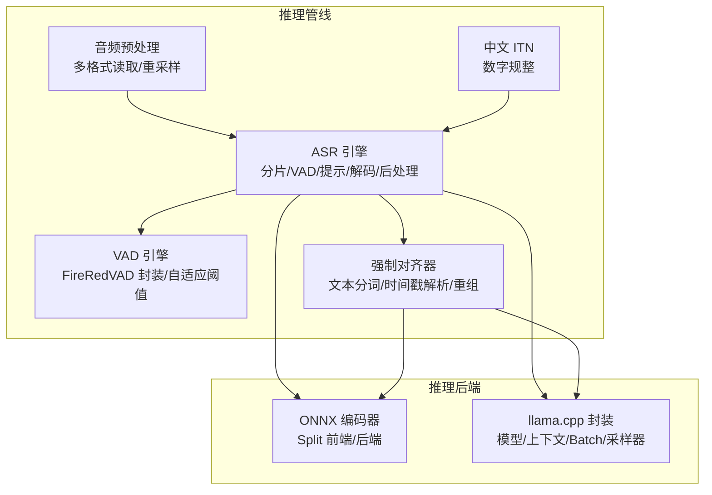
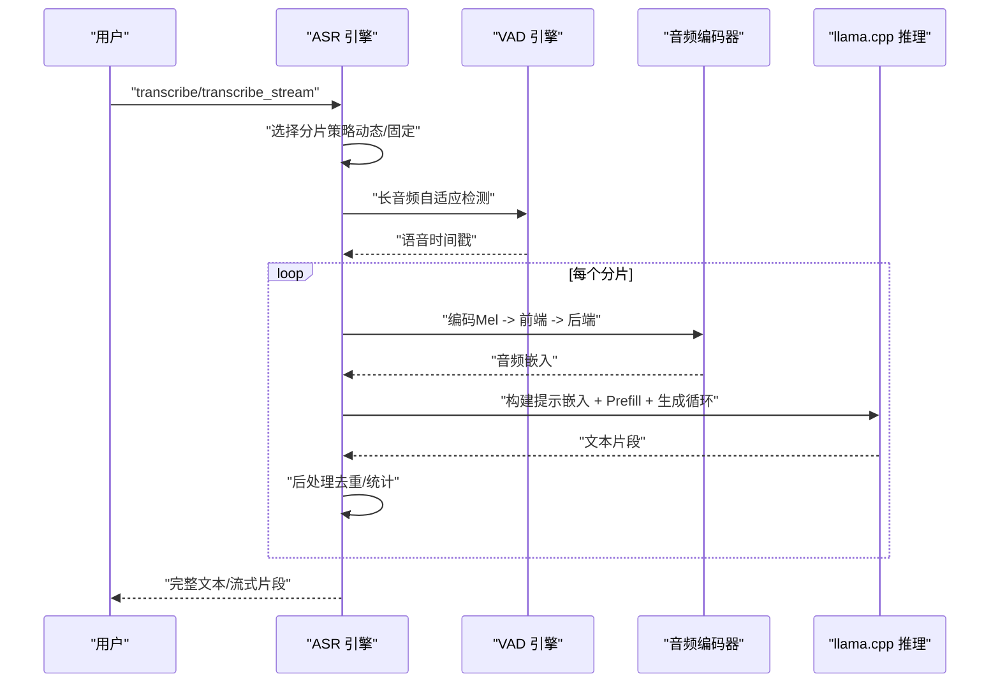
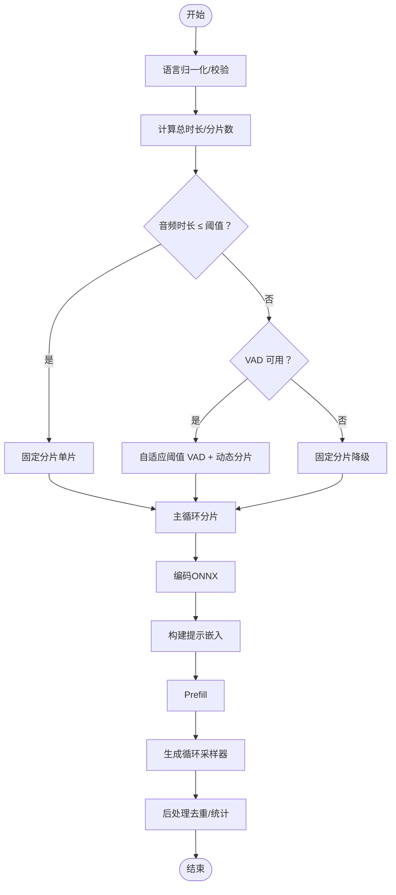
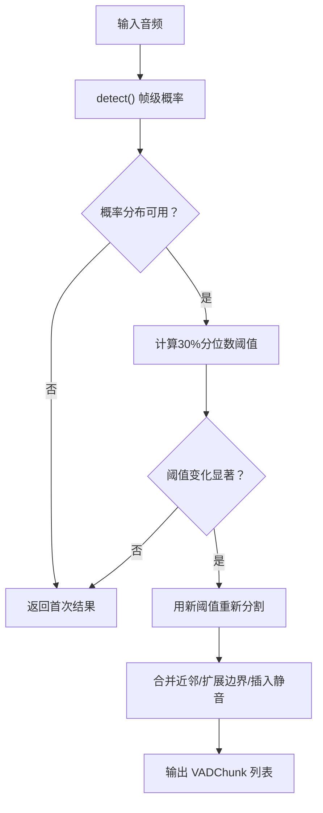
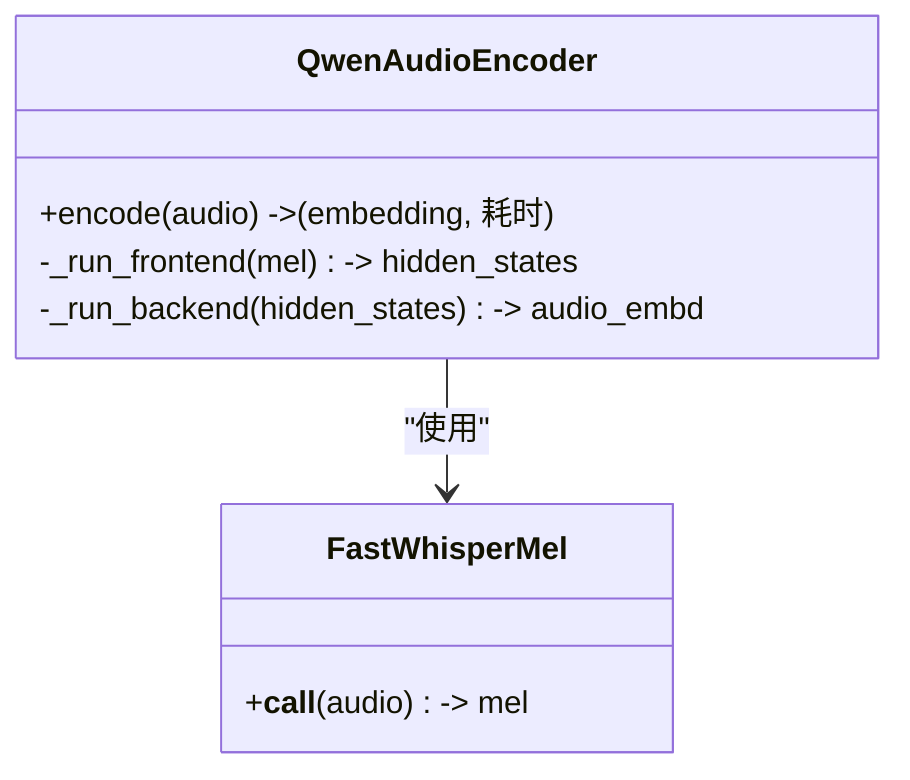
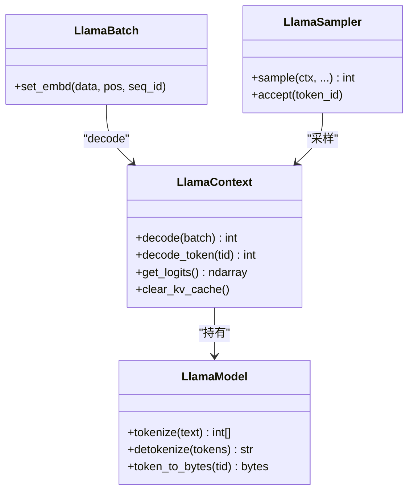
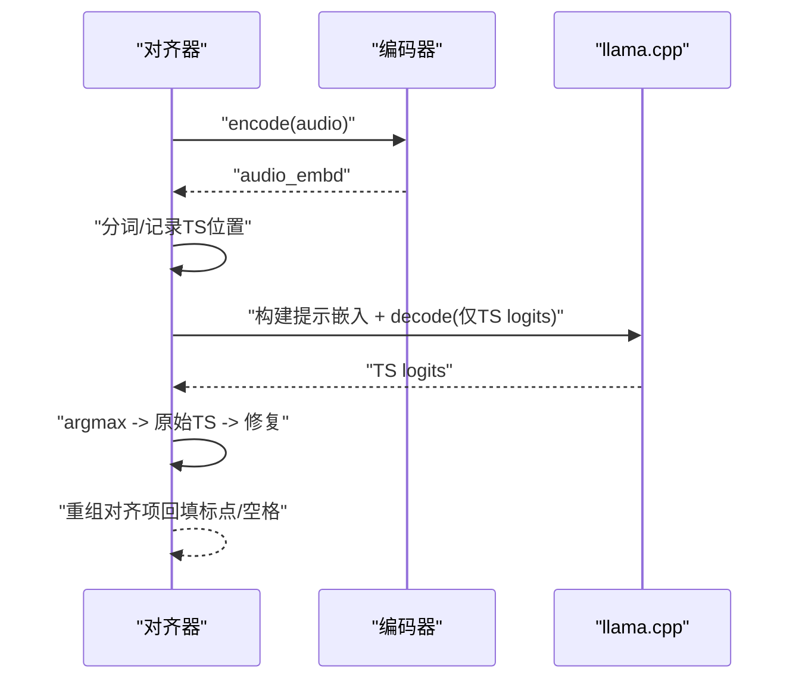
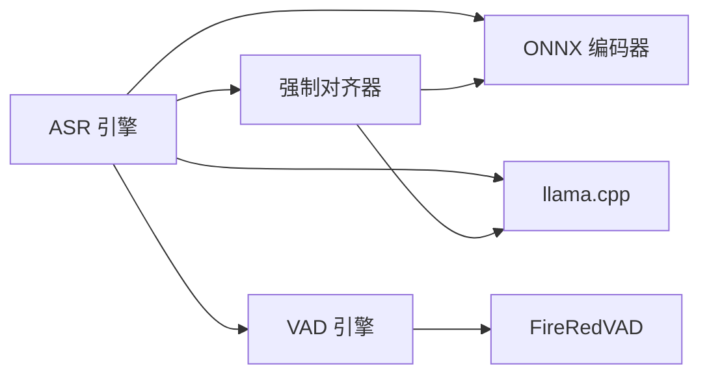

# 核心功能

<cite>
**本文档引用的文件**
- [qwen_asr_gguf/inference/asr.py](file://qwen_asr_gguf/inference/asr.py)
- [qwen_asr_gguf/inference/encoder.py](file://qwen_asr_gguf/inference/encoder.py)
- [qwen_asr_gguf/inference/vad.py](file://qwen_asr_gguf/inference/vad.py)
- [qwen_asr_gguf/inference/llama.py](file://qwen_asr_gguf/inference/llama.py)
- [qwen_asr_gguf/inference/aligner.py](file://qwen_asr_gguf/inference/aligner.py)
- [qwen_asr_gguf/inference/chinese_itn.py](file://qwen_asr_gguf/inference/chinese_itn.py)
- [qwen_asr_gguf/inference/audio.py](file://qwen_asr_gguf/inference/audio.py)
- [qwen_asr_gguf/inference/utils.py](file://qwen_asr_gguf/inference/utils.py)
- [qwen_asr_gguf/inference/schema.py](file://qwen_asr_gguf/inference/schema.py)
- [examples/example_qwen3_asr_transformers.py](file://examples/example_qwen3_asr_transformers.py)
- [examples/example_qwen3_asr_vllm.py](file://examples/example_qwen3_asr_vllm.py)
- [examples/example_qwen3_forced_aligner.py](file://examples/example_qwen3_forced_aligner.py)
- [export_config.py](file://export_config.py)
- [qwen_asr_gguf/export/convert_hf_to_gguf.py](file://qwen_asr_gguf/export/convert_hf_to_gguf.py)
</cite>

## 目录
1. [简介](#简介)
2. [项目结构](#项目结构)
3. [核心组件](#核心组件)
4. [架构总览](#架构总览)
5. [详细组件分析](#详细组件分析)
6. [依赖关系分析](#依赖关系分析)
7. [性能考量](#性能考量)
8. [故障排查指南](#故障排查指南)
9. [结论](#结论)
10. [附录](#附录)

## 简介
本文件聚焦 Qwen3-ASR GGUF 的核心功能，系统阐述以下能力：
- ASR 引擎工作原理与分片策略（含 VAD 动态分片与固定分片）
- 语音活动检测（VAD）的实现机制与自适应阈值
- 强制对齐（Forced Alignment）的时间戳生成算法
- 音频编码器（ONNX Split 前端/后端）的实现与性能优化
- llama.cpp 推理引擎的集成方式与批处理/采样策略
- 文本后处理与中文数字规整（ITN）功能
- 配置参数说明、性能优化技巧与使用最佳实践
- 各模块协作关系与数据流

## 项目结构
本项目采用“推理后端（GGUF + ONNX + llama.cpp）+ 推理管线（ASR/VAD/Aligner/ITN）”的分层组织：
- 推理后端
  - ONNX 编码器：Split 前端/后端（FastWhisperMel + 原生 ONNXRuntime）
  - llama.cpp 封装：模型/上下文/Batch/采样器
- 推理管线
  - ASR 引擎：分片策略、VAD、提示工程、解码与后处理
  - VAD：FireRedVAD 封装与自适应阈值
  - 强制对齐：文本分词、时间戳解析与对齐项重组
  - ITN：中文数字规整
  - 音频预处理：多格式读取与重采样
  - 工具与配置：语言规范化、重复检测、Schema 定义

图表来源
- [qwen_asr_gguf/inference/asr.py:40-103](file://qwen_asr_gguf/inference/asr.py#L40-L103)
- [qwen_asr_gguf/inference/encoder.py:119-196](file://qwen_asr_gguf/inference/encoder.py#L119-L196)
- [qwen_asr_gguf/inference/llama.py:443-549](file://qwen_asr_gguf/inference/llama.py#L443-L549)
- [qwen_asr_gguf/inference/vad.py:29-81](file://qwen_asr_gguf/inference/vad.py#L29-L81)
- [qwen_asr_gguf/inference/aligner.py:229-259](file://qwen_asr_gguf/inference/aligner.py#L229-L259)
- [qwen_asr_gguf/inference/chinese_itn.py:1-520](file://qwen_asr_gguf/inference/chinese_itn.py#L1-L520)
- [qwen_asr_gguf/inference/audio.py:129-149](file://qwen_asr_gguf/inference/audio.py#L129-L149)

章节来源
- [qwen_asr_gguf/inference/asr.py:40-103](file://qwen_asr_gguf/inference/asr.py#L40-L103)
- [qwen_asr_gguf/inference/encoder.py:119-196](file://qwen_asr_gguf/inference/encoder.py#L119-L196)
- [qwen_asr_gguf/inference/llama.py:443-549](file://qwen_asr_gguf/inference/llama.py#L443-L549)
- [qwen_asr_gguf/inference/vad.py:29-81](file://qwen_asr_gguf/inference/vad.py#L29-L81)
- [qwen_asr_gguf/inference/aligner.py:229-259](file://qwen_asr_gguf/inference/aligner.py#L229-L259)
- [qwen_asr_gguf/inference/chinese_itn.py:1-520](file://qwen_asr_gguf/inference/chinese_itn.py#L1-L520)
- [qwen_asr_gguf/inference/audio.py:129-149](file://qwen_asr_gguf/inference/audio.py#L129-L149)

## 核心组件
- ASR 引擎（QwenASREngine）
  - 统一流水线：_asr_core（一次性/流式）
  - VAD 集成：动态分片与静音跳过
  - 提示工程：构建嵌入序列（系统/用户/音频/助手）
  - 解码内核：prefill + 生成循环 + 采样器 + 熔断与重试
  - 后处理：重复检测修复、性能统计
- 音频编码器（QwenAudioEncoder）
  - Split 前端/后端：Mel -> 前端分块推理 -> 后端 Transformer
  - ONNXRuntime Provider 选择与预热
- VAD（QwenVADEngine）
  - FireRedVAD 封装：帧级概率、平滑、阈值分割、自适应阈值
  - 构建分片：贪心打包、静音插入、上下文缓冲
- llama.cpp 封装（LlamaModel/LlamaContext/LlamaBatch/LlamaSampler）
  - 模型/上下文生命周期管理
  - Batch 注入嵌入、位置编码、KV 缓存
  - 采样器链：温度/TopK/TopP/MinP/惩罚
- 强制对齐器（QwenForcedAligner）
  - 文本分词与时间戳位置记录
  - 仅计算时间戳 logits 以加速
  - 时间戳修复与标点/空格回填
- 中文 ITN（chinese_to_num）
  - 数字/范围/分数/百分比/时间/日期等多类型规整
- 音频预处理（load_audio）
  - 多格式读取（soundfile/ffmpeg）、重采样、单声道化

章节来源
- [qwen_asr_gguf/inference/asr.py:40-103](file://qwen_asr_gguf/inference/asr.py#L40-L103)
- [qwen_asr_gguf/inference/encoder.py:119-196](file://qwen_asr_gguf/inference/encoder.py#L119-L196)
- [qwen_asr_gguf/inference/vad.py:29-81](file://qwen_asr_gguf/inference/vad.py#L29-L81)
- [qwen_asr_gguf/inference/llama.py:443-549](file://qwen_asr_gguf/inference/llama.py#L443-L549)
- [qwen_asr_gguf/inference/aligner.py:229-259](file://qwen_asr_gguf/inference/aligner.py#L229-L259)
- [qwen_asr_gguf/inference/chinese_itn.py:1-520](file://qwen_asr_gguf/inference/chinese_itn.py#L1-L520)
- [qwen_asr_gguf/inference/audio.py:129-149](file://qwen_asr_gguf/inference/audio.py#L129-L149)

## 架构总览
ASR 引擎以“分片 + VAD + 编码 + LLM 解码 + 对齐/ITN”的流水线为核心，支持离线一次性与流式实时两种模式。

图表来源
- [qwen_asr_gguf/inference/asr.py:602-774](file://qwen_asr_gguf/inference/asr.py#L602-L774)
- [qwen_asr_gguf/inference/vad.py:160-222](file://qwen_asr_gguf/inference/vad.py#L160-L222)
- [qwen_asr_gguf/inference/encoder.py:260-280](file://qwen_asr_gguf/inference/encoder.py#L260-L280)
- [qwen_asr_gguf/inference/llama.py:520-543](file://qwen_asr_gguf/inference/llama.py#L520-L543)

## 详细组件分析

### ASR 引擎（QwenASREngine）
- 分片策略
  - 短音频（≤ 阈值）：单一分片，直接处理
  - 长音频 + VAD 可用：自适应阈值 VAD，按语音边界动态组合分片
  - VAD 不可用：固定等长分片
- VAD 集成
  - _ensure_vad 延迟加载，detect/adaptive_detect/should_run_vad
  - build_chunks 贪心打包、静音插入、上下文缓冲
- 提示工程
  - _build_prompt_embd：严格遵循官方 Chat Template，拼接系统/用户/音频/助手头
- 解码内核
  - _decode：prefill + 生成循环 + 采样器 + 熔断（重复/幻觉）
  - _safe_decode：重试与温度提升，后处理去重
- 后处理与统计
  - detect_and_fix_repetitions、性能统计打印

图表来源
- [qwen_asr_gguf/inference/asr.py:633-774](file://qwen_asr_gguf/inference/asr.py#L633-L774)
- [qwen_asr_gguf/inference/vad.py:299-406](file://qwen_asr_gguf/inference/vad.py#L299-L406)
- [qwen_asr_gguf/inference/encoder.py:260-280](file://qwen_asr_gguf/inference/encoder.py#L260-L280)
- [qwen_asr_gguf/inference/llama.py:520-543](file://qwen_asr_gguf/inference/llama.py#L520-L543)

章节来源
- [qwen_asr_gguf/inference/asr.py:432-596](file://qwen_asr_gguf/inference/asr.py#L432-L596)
- [qwen_asr_gguf/inference/asr.py:602-774](file://qwen_asr_gguf/inference/asr.py#L602-L774)
- [qwen_asr_gguf/inference/asr.py:147-206](file://qwen_asr_gguf/inference/asr.py#L147-L206)
- [qwen_asr_gguf/inference/asr.py:212-345](file://qwen_asr_gguf/inference/asr.py#L212-L345)
- [qwen_asr_gguf/inference/utils.py:58-134](file://qwen_asr_gguf/inference/utils.py#L58-L134)

### VAD（语音活动检测）
- FireRedVAD 封装
  - detect：帧级概率缓存、阈值判断、返回 VADResult
  - adaptive_detect：30% 分位数自适应阈值，必要时二次分割
  - build_chunks：贪心打包、合并近邻、扩展边界、插入静音分片
- 配置要点
  - smooth_window_size、speech_threshold、min/max_speech_frame、merge/min_silence_frame、extend_speech_frame、vad_min_duration

图表来源
- [qwen_asr_gguf/inference/vad.py:160-222](file://qwen_asr_gguf/inference/vad.py#L160-L222)
- [qwen_asr_gguf/inference/vad.py:299-406](file://qwen_asr_gguf/inference/vad.py#L299-L406)

章节来源
- [qwen_asr_gguf/inference/vad.py:29-81](file://qwen_asr_gguf/inference/vad.py#L29-L81)
- [qwen_asr_gguf/inference/vad.py:160-222](file://qwen_asr_gguf/inference/vad.py#L160-L222)
- [qwen_asr_gguf/inference/vad.py:299-406](file://qwen_asr_gguf/inference/vad.py#L299-L406)

### 音频编码器（ONNX Split 前端/后端）
- FastWhisperMel：纯 NumPy 实现的梅尔提取，避免 JIT 启动开销
- Split 前端（100 帧分块循环推理）
- Split 后端（Transformer + Attention Mask）
- Provider 选择与预热：CPU/GPU/DML，动态/固定形状模式

图表来源
- [qwen_asr_gguf/inference/encoder.py:119-196](file://qwen_asr_gguf/inference/encoder.py#L119-L196)
- [qwen_asr_gguf/inference/encoder.py:198-280](file://qwen_asr_gguf/inference/encoder.py#L198-L280)

章节来源
- [qwen_asr_gguf/inference/encoder.py:8-118](file://qwen_asr_gguf/inference/encoder.py#L8-L118)
- [qwen_asr_gguf/inference/encoder.py:119-196](file://qwen_asr_gguf/inference/encoder.py#L119-L196)
- [qwen_asr_gguf/inference/encoder.py:260-280](file://qwen_asr_gguf/inference/encoder.py#L260-L280)

### llama.cpp 推理引擎集成
- LlamaModel：模型封装、tokenize/detokenize、token_to_bytes
- LlamaContext：上下文封装、decode、clear_kv_cache
- LlamaBatch：嵌入注入、位置编码、logits 标记
- LlamaSampler：采样器链（温度/TopK/TopP/MinP/惩罚）

图表来源
- [qwen_asr_gguf/inference/llama.py:443-549](file://qwen_asr_gguf/inference/llama.py#L443-L549)
- [qwen_asr_gguf/inference/llama.py:550-625](file://qwen_asr_gguf/inference/llama.py#L550-L625)
- [qwen_asr_gguf/inference/llama.py:635-738](file://qwen_asr_gguf/inference/llama.py#L635-L738)

章节来源
- [qwen_asr_gguf/inference/llama.py:443-549](file://qwen_asr_gguf/inference/llama.py#L443-L549)
- [qwen_asr_gguf/inference/llama.py:550-625](file://qwen_asr_gguf/inference/llama.py#L550-L625)
- [qwen_asr_gguf/inference/llama.py:635-738](file://qwen_asr_gguf/inference/llama.py#L635-L738)

### 强制对齐（Forced Alignment）
- 文本预处理与时间戳修正
  - 分词：日语/韩语/通用（CJK 拆字）
  - 时间戳修复：最长递增子序列 + 异常区间插值/外推
  - 对齐项重组：与原文对齐，回填标点/空格
- 对齐流程
  - 编码（统一编码器）
  - 构建提示：音频开始/结束标记 + 文本 + 时间戳占位
  - 仅计算时间戳 logits 以加速
  - 解析 logits -> 原始时间戳 -> 修复 -> 生成 ForcedAlignItem

图表来源
- [qwen_asr_gguf/inference/aligner.py:229-348](file://qwen_asr_gguf/inference/aligner.py#L229-L348)
- [qwen_asr_gguf/inference/aligner.py:17-137](file://qwen_asr_gguf/inference/aligner.py#L17-L137)

章节来源
- [qwen_asr_gguf/inference/aligner.py:17-137](file://qwen_asr_gguf/inference/aligner.py#L17-L137)
- [qwen_asr_gguf/inference/aligner.py:229-348](file://qwen_asr_gguf/inference/aligner.py#L229-L348)

### 中文 ITN（Inverse Text Normalization）
- 多类型规整：范围表达式、数值、分数、百分比、时间、日期
- 正则驱动与规则匹配，支持成语/习语/模糊表达黑名单
- 主函数 chinese_to_num 返回规整后的文本

章节来源
- [qwen_asr_gguf/inference/chinese_itn.py:1-520](file://qwen_asr_gguf/inference/chinese_itn.py#L1-L520)

### 音频预处理
- load_audio：根据后缀选择 soundfile/ffmpeg，支持偏移与时长裁剪
- resample_audio：高质量重采样（poly）
- load_audio_numpy/load_audio_ffmpeg：具体实现

章节来源
- [qwen_asr_gguf/inference/audio.py:129-149](file://qwen_asr_gguf/inference/audio.py#L129-L149)
- [qwen_asr_gguf/inference/audio.py:65-85](file://qwen_asr_gguf/inference/audio.py#L65-L85)
- [qwen_asr_gguf/inference/audio.py:88-126](file://qwen_asr_gguf/inference/audio.py#L88-L126)

## 依赖关系分析
- 模块耦合
  - ASR 引擎依赖：编码器（ONNX）、llama.cpp、VAD、对齐器（可选）、工具与配置
  - 对齐器复用编码器与 llama.cpp，与处理器（AlignerProcessor）配合
  - VAD 与 ASR 解耦，通过分片接口对接
- 外部依赖
  - ONNXRuntime（Provider：CUDA/ROCM/TensorRT/DML/CPU）
  - llama.cpp（动态库绑定）
  - FireRedVAD（可选，按需安装）
  - Python 生态：numpy、soundfile、ffmpeg（命令行）

图表来源
- [qwen_asr_gguf/inference/asr.py:49-95](file://qwen_asr_gguf/inference/asr.py#L49-L95)
- [qwen_asr_gguf/inference/aligner.py:229-259](file://qwen_asr_gguf/inference/aligner.py#L229-L259)
- [qwen_asr_gguf/inference/vad.py:51-81](file://qwen_asr_gguf/inference/vad.py#L51-L81)

章节来源
- [qwen_asr_gguf/inference/asr.py:49-95](file://qwen_asr_gguf/inference/asr.py#L49-L95)
- [qwen_asr_gguf/inference/aligner.py:229-259](file://qwen_asr_gguf/inference/aligner.py#L229-L259)
- [qwen_asr_gguf/inference/vad.py:51-81](file://qwen_asr_gguf/inference/vad.py#L51-L81)

## 性能考量
- 编码器
  - Split 前端分块（100 帧）避免大张量一次性处理
  - Provider 选择：优先 CUDA/ROCM/TensorRT，DML 回退 CPU
  - 预热策略：固定形状（DML）与动态形状（CPU/GPU）分别预热
- ASR
  - VAD 动态分片：仅编码实际语音，减少无效推理
  - KV 缓存清理：每片前 clear_kv_cache，避免历史干扰
  - 采样器参数：温度/TopK/TopP/MinP/惩罚，平衡稳定性与多样性
  - 熔断与重试：重复/幻觉熔断 + 温度提升重试
- 对齐
  - 仅计算时间戳 logits，减少计算量
  - 分词与时间戳修复（DP LIS）保证时序一致性
- ITN
  - 正则匹配，常数时间复杂度，适合后处理阶段

[本节为通用性能建议，不直接分析具体文件]

## 故障排查指南
- VAD 未安装或不可用
  - 现象：长音频自动降级为固定分片
  - 处理：安装 fireredvad 或显式设置禁用 VAD
- Provider 不可用
  - 现象：编码器回退 CPU
  - 处理：确认 CUDA/ROCm/TensorRT/DML 可用性
- llama.cpp 动态库加载失败
  - 现象：模型加载报错
  - 处理：确认 bin 目录与 DLL 路径、环境变量 PATH
- 重复/幻觉文本
  - 现象：大量重复字符或短语
  - 处理：启用 _safe_decode 的重试与温度提升；后处理 detect_and_fix_repetitions
- 时间戳异常
  - 现象：时间戳倒序或跳跃
  - 处理：AlignerProcessor 的 LIS + 插值修复

章节来源
- [qwen_asr_gguf/inference/vad.py:51-81](file://qwen_asr_gguf/inference/vad.py#L51-L81)
- [qwen_asr_gguf/inference/encoder.py:137-165](file://qwen_asr_gguf/inference/encoder.py#L137-L165)
- [qwen_asr_gguf/inference/llama.py:378-418](file://qwen_asr_gguf/inference/llama.py#L378-L418)
- [qwen_asr_gguf/inference/asr.py:319-345](file://qwen_asr_gguf/inference/asr.py#L319-L345)
- [qwen_asr_gguf/inference/aligner.py:99-137](file://qwen_asr_gguf/inference/aligner.py#L99-L137)

## 结论
Qwen3-ASR GGUF 通过 ONNX Split 编码器与 llama.cpp 的高效集成，结合 VAD 动态分片与严格的提示工程，实现了高精度、低延迟的端到端语音转写与强制对齐。中文 ITN 为中文场景提供了强大的数字规整能力。整体架构清晰、模块解耦、易于扩展与优化。

[本节为总结性内容，不直接分析具体文件]

## 附录

### 配置参数说明（ASR 引擎）
- model_dir：模型目录
- encoder_frontend_fn / encoder_backend_fn：编码器 ONNX 文件名
- llm_fn：GGUF 模型文件名
- use_gpu：是否启用 GPU Provider
- n_ctx：上下文窗口大小
- chunk_size：分片时长（秒）
- memory_num：保留的历史分片数量
- enable_aligner / align_config：是否启用对齐器及对齐器配置
- pad_to：编码器填充时长（秒）
- vad_config / dynamic_chunk_threshold：VAD 配置与动态分片阈值

章节来源
- [qwen_asr_gguf/inference/schema.py:162-210](file://qwen_asr_gguf/inference/schema.py#L162-L210)

### 使用示例（调用方式）
- ASR（Transformers 后端示例）
  - 参考：[examples/example_qwen3_asr_transformers.py:74-125](file://examples/example_qwen3_asr_transformers.py#L74-L125)
- ASR（vLLM 后端示例）
  - 参考：[examples/example_qwen3_asr_vllm.py:78-128](file://examples/example_qwen3_asr_vllm.py#L78-L128)
- 强制对齐示例
  - 参考：[examples/example_qwen3_forced_aligner.py:116-195](file://examples/example_qwen3_forced_aligner.py#L116-L195)

章节来源
- [examples/example_qwen3_asr_transformers.py:74-125](file://examples/example_qwen3_asr_transformers.py#L74-L125)
- [examples/example_qwen3_asr_vllm.py:78-128](file://examples/example_qwen3_asr_vllm.py#L78-L128)
- [examples/example_qwen3_forced_aligner.py:116-195](file://examples/example_qwen3_forced_aligner.py#L116-L195)

### 导出与转换（HF -> GGUF）
- 模型导出路径配置
  - 参考：[export_config.py:1-12](file://export_config.py#L1-L12)
- 转换脚本（GGUF 写入、量化、元数据）
  - 参考：[qwen_asr_gguf/export/convert_hf_to_gguf.py:1-800](file://qwen_asr_gguf/export/convert_hf_to_gguf.py#L1-L800)

章节来源
- [export_config.py:1-12](file://export_config.py#L1-L12)
- [qwen_asr_gguf/export/convert_hf_to_gguf.py:1-800](file://qwen_asr_gguf/export/convert_hf_to_gguf.py#L1-L800)