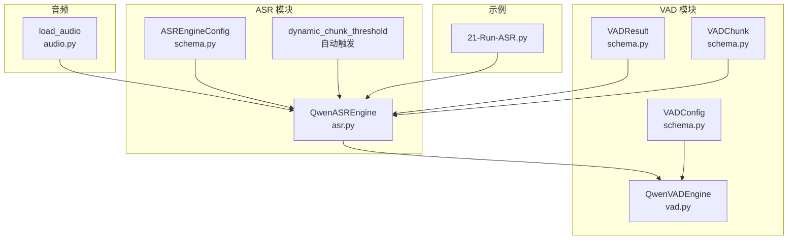
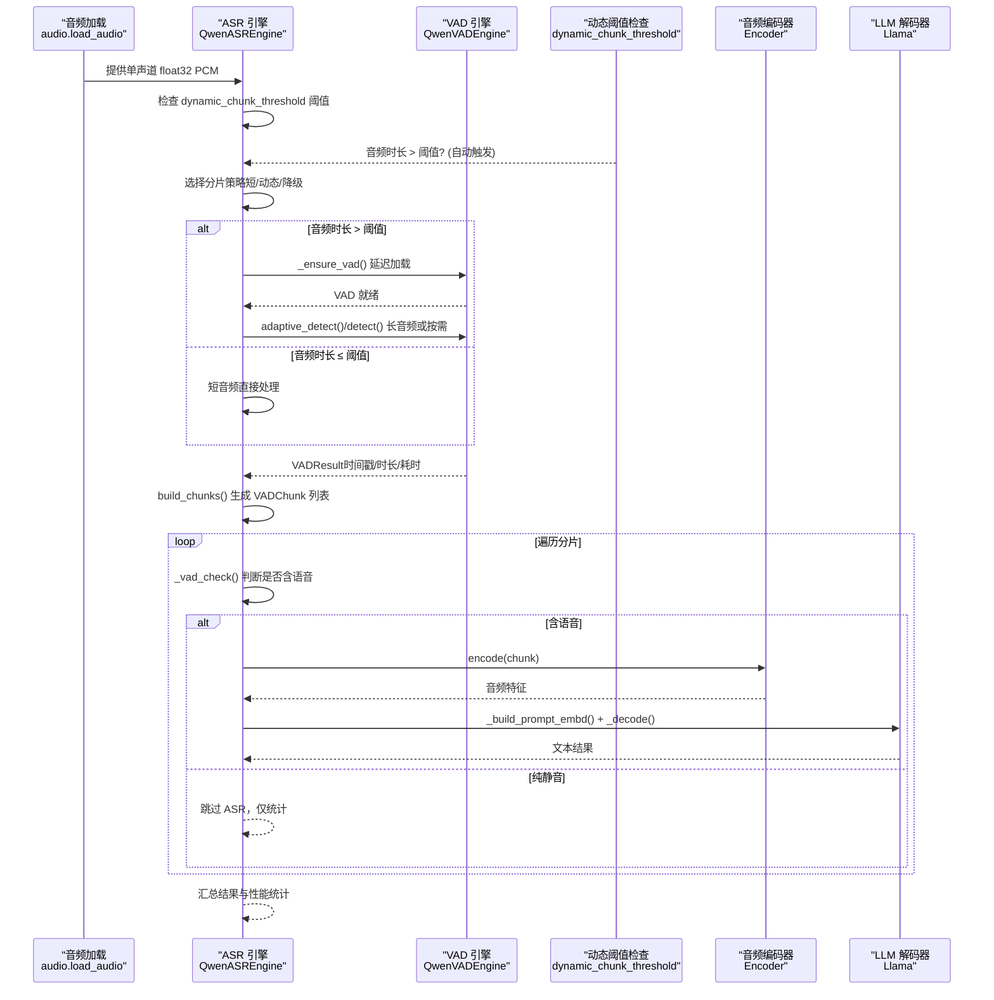
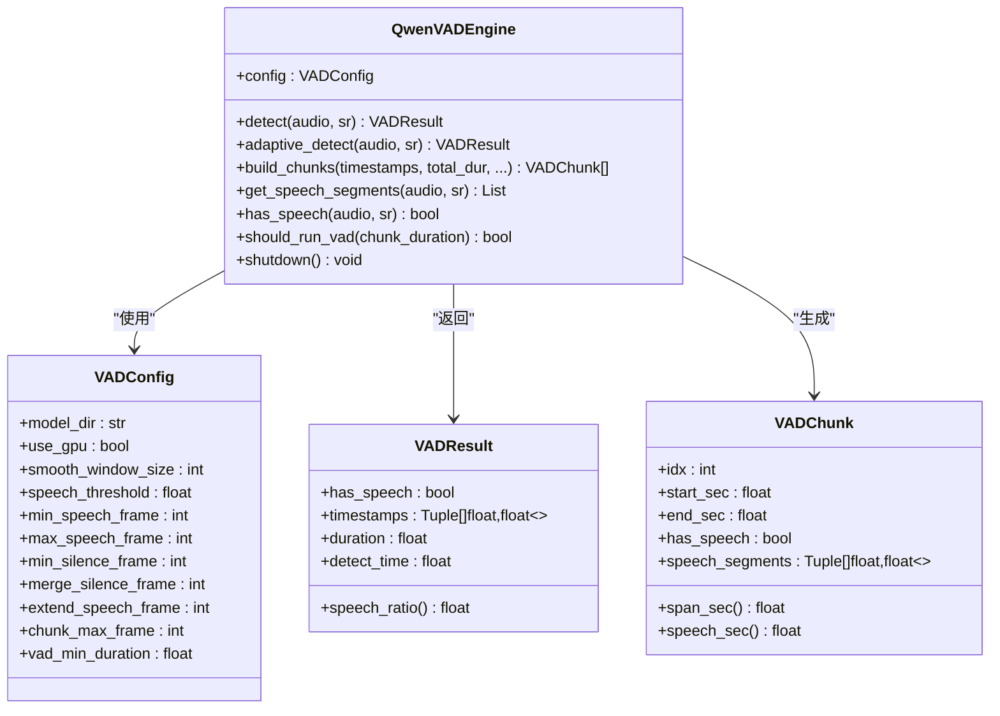
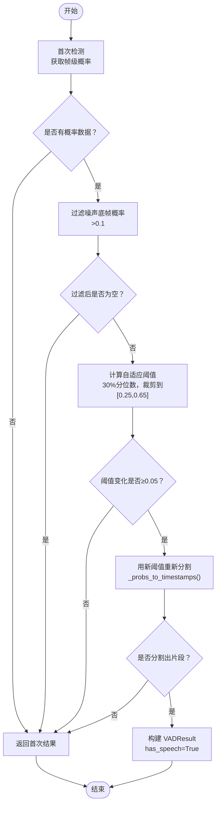
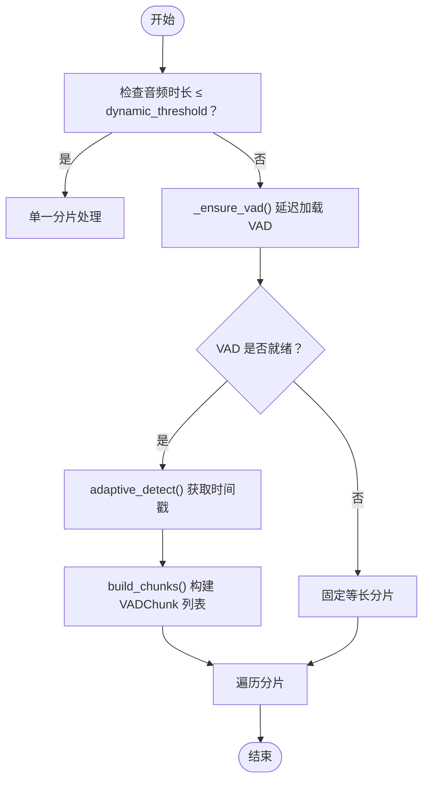
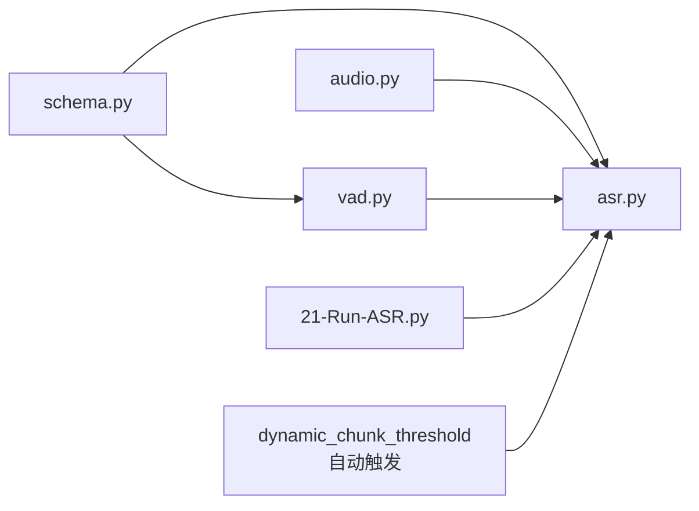

# 语音活动检测(VAD)

<cite>
**本文引用的文件**
- [qwen_asr_gguf/inference/vad.py](file://qwen_asr_gguf/inference/vad.py)
- [qwen_asr_gguf/inference/asr.py](file://qwen_asr_gguf/inference/asr.py)
- [qwen_asr_gguf/inference/schema.py](file://qwen_asr_gguf/inference/schema.py)
- [qwen_asr_gguf/inference/audio.py](file://qwen_asr_gguf/inference/audio.py)
- [21-Run-ASR.py](file://21-Run-ASR.py)
</cite>

## 更新摘要
**变更内容**
- 更新VAD系统从手动启用改为自动阈值触发的架构改进
- 新增`dynamic_chunk_threshold`参数说明和使用指南
- 改进自适应阈值检测算法的详细描述
- 增强静音跳过逻辑和分片构建策略的分析
- 更新VAD配置参数和使用示例

## 目录
1. [简介](#简介)
2. [项目结构](#项目结构)
3. [核心组件](#核心组件)
4. [架构总览](#架构总览)
5. [详细组件分析](#详细组件分析)
6. [依赖关系分析](#依赖关系分析)
7. [性能考量](#性能考量)
8. [故障排查指南](#故障排查指南)
9. [结论](#结论)
10. [附录](#附录)

## 简介
本文件面向语音活动检测（Voice Activity Detection, VAD）功能，系统性阐述其工作原理、算法实现、性能优化策略与工程实践。VAD引擎基于 FireRedVAD 非流式模式，为 ASR 流水线提供"分片级静音前置过滤"能力：对每个音频分片执行 VAD 检测，判断是否含有效语音；跳过纯静音片段，避免 ASR 模型在无语音输入时产生幻觉并浪费算力。文档涵盖：
- 自适应阈值检测机制与动态分片决策过程
- 静音片段跳过逻辑与分片构建算法
- VAD 配置参数说明与性能指标评估
- 与其他模块（ASR、对齐器、音频加载）的集成方式
- VAD 检测结果的数据结构定义与时间戳处理
- 使用示例与在长音频处理中的作用、不同场景下的性能表现与优化建议

**更新** VAD系统现已从手动启用改为基于`dynamic_chunk_threshold`参数的自动阈值触发机制，无需手动开关即可实现智能化的VAD动态分片。

## 项目结构
与 VAD 相关的核心文件与职责如下：
- qwen_asr_gguf/inference/vad.py：VAD 引擎封装，提供 detect、adaptive_detect、build_chunks 等接口
- qwen_asr_gguf/inference/asr.py：ASR 引擎，集成 VAD 前置过滤与动态分片策略
- qwen_asr_gguf/inference/schema.py：数据结构定义，包括 VADConfig、VADResult、VADChunk、ASREngineConfig 等
- qwen_asr_gguf/inference/audio.py：音频加载与重采样工具，为 VAD/ASR 提供统一的音频输入
- 21-Run-ASR.py：离线/流式转写示例脚本，展示 VAD 的启用与使用方式

**图表来源**
- [qwen_asr_gguf/inference/vad.py:1-467](file://qwen_asr_gguf/inference/vad.py#L1-L467)
- [qwen_asr_gguf/inference/asr.py:1-920](file://qwen_asr_gguf/inference/asr.py#L1-L920)
- [qwen_asr_gguf/inference/schema.py:1-235](file://qwen_asr_gguf/inference/schema.py#L1-L235)
- [qwen_asr_gguf/inference/audio.py:1-149](file://qwen_asr_gguf/inference/audio.py#L1-L149)
- [21-Run-ASR.py:1-196](file://21-Run-ASR.py#L1-L196)

## 核心组件
- QwenVADEngine：封装 FireRedVAD 模型，提供 detect、adaptive_detect、build_chunks、has_speech 等接口；支持自适应阈值与分片构建
- VADConfig：VAD 引擎配置，包含平滑窗口、阈值、最短语音/静音帧、合并静音帧、扩展语音边界、单分片最大帧数、最小启用时长等
- VADResult：单次检测结果，包含是否含语音、时间戳列表、总时长、检测耗时，并提供语音占比属性
- VADChunk：由 build_chunks 生成的逻辑分片，记录时间范围、是否含语音、语音段列表等
- QwenASREngine：ASR 引擎，集成 VAD 前置过滤与动态分片策略，支持短音频直通、长音频自适应 VAD 动态分片、降级固定分片三种模式

**更新** ASREngineConfig 现在包含 `dynamic_chunk_threshold` 参数，用于控制VAD的自动启用阈值。

## 架构总览
VAD 在 ASR 流水线中的位置与交互如下：
- 音频加载：统一通过 audio.load_audio 提供单声道 float32 PCM
- VAD 检测：对每个分片执行 detect 或 adaptive_detect，得到 VADResult
- 动态分片：基于 VADResult 构建 VADChunk 列表，按语音边界组合分片，避免在静音中截断
- 静音跳过：has_speech=False 的分片直接跳过 ASR 推理，仅记录统计
- ASR 推理：对含语音的分片进行编码与 LLM 解码，结合上下文与抗幻觉策略

**更新** VAD 现在通过 `_ensure_vad()` 方法实现按需延迟加载，当音频时长超过 `dynamic_chunk_threshold` 阈值时自动启用。

**图表来源**
- [qwen_asr_gguf/inference/asr.py:603-920](file://qwen_asr_gguf/inference/asr.py#L603-L920)
- [qwen_asr_gguf/inference/vad.py:86-146](file://qwen_asr_gguf/inference/vad.py#L86-L146)
- [qwen_asr_gguf/inference/audio.py:129-149](file://qwen_asr_gguf/inference/audio.py#L129-L149)

## 详细组件分析

### VAD 引擎（QwenVADEngine）
- 模型加载：延迟导入 FireRedVAD，按 VADConfig 映射参数创建 FireRedVadConfig 并加载模型
- 核心检测：detect 接收 (audio_float32, sr) 元组，内部转换为 int16 PCM，调用 FireRedVAD 检测，解析返回的 dur 与 timestamps，封装为 VADResult
- 自适应阈值：adaptive_detect 两遍法：先以配置阈值检测获取帧级概率，再取高于噪声底的帧概率的 30% 分位数作为新阈值，若变化显著则用新阈值重新分割，否则保留原结果
- 分片构建：build_chunks 基于 VAD 时间戳合并近邻语音段、贪心打包不超过 max_span_sec 的分片、在语音分片间插入静音分片，形成 VADChunk 列表
- 工具方法：get_speech_segments 提取语音子数组；should_run_vad 判断是否启用 VAD（基于 vad_min_duration）

**更新** VAD 引擎现在支持更智能的概率分析，使用 `np.percentile(speech_probs, 30)` 计算30%分位数阈值，并限制在 [0.25, 0.65] 安全区间。

**图表来源**
- [qwen_asr_gguf/inference/vad.py:29-467](file://qwen_asr_gguf/inference/vad.py#L29-L467)
- [qwen_asr_gguf/inference/schema.py:87-160](file://qwen_asr_gguf/inference/schema.py#L87-L160)

**章节来源**
- [qwen_asr_gguf/inference/vad.py:41-81](file://qwen_asr_gguf/inference/vad.py#L41-L81)
- [qwen_asr_gguf/inference/vad.py:86-146](file://qwen_asr_gguf/inference/vad.py#L86-L146)
- [qwen_asr_gguf/inference/vad.py:160-222](file://qwen_asr_gguf/inference/vad.py#L160-L222)
- [qwen_asr_gguf/inference/vad.py:224-294](file://qwen_asr_gguf/inference/vad.py#L224-L294)
- [qwen_asr_gguf/inference/vad.py:299-406](file://qwen_asr_gguf/inference/vad.py#L299-L406)
- [qwen_asr_gguf/inference/vad.py:437-448](file://qwen_asr_gguf/inference/vad.py#L437-L448)

### 自适应阈值检测机制
- 两遍法流程：
  1) 首次检测：以配置阈值执行 detect，缓存帧级概率
  2) 分析概率：仅考虑高于噪声底的帧概率，取 30% 分位数作为自适应阈值，并限制在 [0.25, 0.65]
  3) 判定变化：若与初始阈值差异小于 0.05，则保持原结果；否则用新阈值对概率进行重新分割
  4) 二次分割：调用 _probs_to_timestamps，平滑概率、应用阈值、合并连续帧、过滤短片段、合并近邻片段、扩展语音边界
- 适用场景：长音频离线转写，可更精确地适配不同录音环境的信噪比

**更新** 自适应阈值检测算法现在使用更精确的概率分析方法，通过 `np.percentile(speech_probs, 30)` 计算30%分位数阈值，提高了阈值调整的准确性和稳定性。

**图表来源**
- [qwen_asr_gguf/inference/vad.py:160-222](file://qwen_asr_gguf/inference/vad.py#L160-L222)
- [qwen_asr_gguf/inference/vad.py:224-294](file://qwen_asr_gguf/inference/vad.py#L224-L294)

**章节来源**
- [qwen_asr_gguf/inference/vad.py:160-222](file://qwen_asr_gguf/inference/vad.py#L160-L222)
- [qwen_asr_gguf/inference/vad.py:224-294](file://qwen_asr_gguf/inference/vad.py#L224-L294)

### 动态分片决策过程
- 策略选择：
  - 短音频（≤ dynamic_chunk_threshold）：不分片，直接处理
  - 长音频（> dynamic_chunk_threshold）且 VAD 可用：自适应阈值 VAD 动态分片
  - 长音频（> dynamic_chunk_threshold）但 VAD 不可用：降级为固定等长分片
- 分片构建：
  - 合并间隔 < merge_gap_sec 的相邻语音段
  - 贪心打包：在不超过 max_span_sec 的前提下组合连续语音段
  - 在语音分片之间插入静音分片，使输出完整覆盖 [0, total_dur]
  - 每个分片在首段前补 context_pre_sec、末段后补 context_post_sec

**更新** 动态分片决策现在完全基于 `dynamic_chunk_threshold` 参数自动触发，无需手动配置VAD开关。

**图表来源**
- [qwen_asr_gguf/inference/asr.py:603-920](file://qwen_asr_gguf/inference/asr.py#L603-L920)
- [qwen_asr_gguf/inference/vad.py:299-406](file://qwen_asr_gguf/inference/vad.py#L299-L406)

**章节来源**
- [qwen_asr_gguf/inference/asr.py:603-920](file://qwen_asr_gguf/inference/asr.py#L603-L920)
- [qwen_asr_gguf/inference/vad.py:299-406](file://qwen_asr_gguf/inference/vad.py#L299-L406)

### 静音片段跳过逻辑
- _vad_check：对单个分片执行 VAD 判断，若分片时长小于 vad_min_duration 或 has_speech=False，则跳过 ASR 推理
- _asr_core：对 has_speech=False 的分片直接产出 StreamChunkResult（skipped_by_vad=True），累计统计跳过的分片数量
- 性能收益：避免对静音区域进行编码与解码，显著降低 RTF 并减少幻觉

**更新** 静音跳过逻辑现在更加智能，通过 `should_run_vad()` 方法判断分片是否应该运行VAD检测，只有当分片时长超过 `vad_min_duration` 阈值时才会执行VAD检测。

**章节来源**
- [qwen_asr_gguf/inference/asr.py:394-427](file://qwen_asr_gguf/inference/asr.py#L394-L427)
- [qwen_asr_gguf/inference/asr.py:760-780](file://qwen_asr_gguf/inference/asr.py#L760-L780)

### VAD 配置参数说明
- 模型与设备：model_dir、use_gpu
- 平滑与阈值：smooth_window_size、speech_threshold（初始阈值，自适应算法会动态调整）
- 语音/静音约束：min_speech_frame、max_speech_frame、min_silence_frame、merge_silence_frame
- 边界扩展：extend_speech_frame
- 单分片上限：chunk_max_frame
- 启用阈值：vad_min_duration（仅对超过此时长的片段启用 VAD 前置过滤）
- **新增**：dynamic_chunk_threshold（控制VAD自动启用的音频时长阈值）

**更新** 新增 `dynamic_chunk_threshold` 参数，用于控制VAD的自动启用阈值。当音频时长超过此阈值时，ASR引擎会自动延迟加载VAD模型并启用动态分片。

**章节来源**
- [qwen_asr_gguf/inference/schema.py:87-113](file://qwen_asr_gguf/inference/schema.py#L87-L113)
- [qwen_asr_gguf/inference/schema.py:181-187](file://qwen_asr_gguf/inference/schema.py#L181-L187)

### VAD 检测结果的数据结构与时间戳处理
- VADResult：has_speech、timestamps、duration、detect_time；提供 speech_ratio 属性
- VADChunk：idx、start_sec、end_sec、has_speech、speech_segments；提供 span_sec、speech_sec 属性
- 时间戳处理：detect 返回的 timestamps 为 (start_sec, end_sec) 列表；build_chunks 将其合并为逻辑分片并插入静音分片

**章节来源**
- [qwen_asr_gguf/inference/schema.py:115-160](file://qwen_asr_gguf/inference/schema.py#L115-L160)
- [qwen_asr_gguf/inference/vad.py:120-131](file://qwen_asr_gguf/inference/vad.py#L120-L131)
- [qwen_asr_gguf/inference/vad.py:299-406](file://qwen_asr_gguf/inference/vad.py#L299-L406)

### 与其他模块的集成方式
- 与 ASR 的集成：ASR 引擎在 _asr_core 中按策略选择分片模式；长音频时调用 VAD.adaptive_detect 与 build_chunks；短音频或降级时走固定分片
- 与对齐器的集成：ASR 引擎可选启用对齐器，VAD 不直接影响对齐流程，但通过跳过静音提升整体效率
- 与音频加载的集成：统一通过 audio.load_audio 提供单声道 float32 PCM，保证采样率与通道一致性

**更新** VAD与ASR的集成现在更加智能化，通过 `_ensure_vad()` 方法实现按需延迟加载，当音频时长超过 `dynamic_chunk_threshold` 时自动启用VAD。

**章节来源**
- [qwen_asr_gguf/inference/asr.py:109-137](file://qwen_asr_gguf/inference/asr.py#L109-L137)
- [qwen_asr_gguf/inference/asr.py:603-920](file://qwen_asr_gguf/inference/asr.py#L603-L920)
- [qwen_asr_gguf/inference/audio.py:129-149](file://qwen_asr_gguf/inference/audio.py#L129-L149)

### 使用示例
- 示例脚本展示了如何启用 VAD、配置检测参数、处理检测结果：
  - 构造 ASREngineConfig，设置 vad_config、dynamic_chunk_threshold
  - 调用 engine.transcribe 或 engine.transcribe_stream
  - 在流式模式下可观察 skipped_by_vad 字段，统计 VAD 跳过的分片数量

**更新** 使用示例现在展示了如何通过 `dynamic_chunk_threshold` 参数控制VAD的自动启用，无需手动配置VAD开关。

**章节来源**
- [21-Run-ASR.py:68-95](file://21-Run-ASR.py#L68-L95)
- [21-Run-ASR.py:101-172](file://21-Run-ASR.py#L101-L172)

## 依赖关系分析
- QwenVADEngine 依赖 VADConfig、VADResult、VADChunk（schema.py）
- QwenASREngine 依赖 QwenVADEngine（按需延迟加载）、音频加载模块、编码器与 LLM
- VAD 与 ASR 通过 VADResult/VADChunk 解耦，便于独立演进与测试

**更新** ASREngineConfig 现在始终保留默认的 VADConfig，确保在长音频自动启用VAD时能够正确初始化。

**图表来源**
- [qwen_asr_gguf/inference/schema.py:1-235](file://qwen_asr_gguf/inference/schema.py#L1-L235)
- [qwen_asr_gguf/inference/vad.py:1-467](file://qwen_asr_gguf/inference/vad.py#L1-L467)
- [qwen_asr_gguf/inference/asr.py:1-920](file://qwen_asr_gguf/inference/asr.py#L1-L920)
- [qwen_asr_gguf/inference/audio.py:1-149](file://qwen_asr_gguf/inference/audio.py#L1-L149)
- [21-Run-ASR.py:1-196](file://21-Run-ASR.py#L1-L196)

**章节来源**
- [qwen_asr_gguf/inference/schema.py:1-235](file://qwen_asr_gguf/inference/schema.py#L1-L235)
- [qwen_asr_gguf/inference/vad.py:1-467](file://qwen_asr_gguf/inference/vad.py#L1-L467)
- [qwen_asr_gguf/inference/asr.py:1-920](file://qwen_asr_gguf/inference/asr.py#L1-L920)
- [qwen_asr_gguf/inference/audio.py:1-149](file://qwen_asr_gguf/inference/audio.py#L1-L149)
- [21-Run-ASR.py:1-196](file://21-Run-ASR.py#L1-L196)

## 性能考量
- VAD 检测耗时：VADResult.detect_time 记录单次检测耗时；在长音频离线转写中，adaptive_detect 会增加一次概率分析与分割的开销
- 静音跳过收益：通过 _vad_check 与 has_speech=False 的分片直接跳过 ASR 推理，显著降低 RTF；统计字段 vad_time 与 vad_skipped_chunks 反映 VAD 过滤效果
- 分片策略：动态分片按语音边界组合，避免在静音中截断，减少无效计算；固定分片模式在边界处追加缓冲以提升词句完整性
- 抗幻觉措施：ASR 解码阶段采用 token 级重复熔断、n-gram 短语级重复熔断、max_new_tokens 上限等策略，配合 VAD 跳过静音进一步抑制幻觉

**更新** 性能考量现在包括了动态分片的自动触发机制，通过 `dynamic_chunk_threshold` 参数优化VAD的启用时机，避免对短音频进行不必要的VAD检测。

**章节来源**
- [qwen_asr_gguf/inference/asr.py:352-389](file://qwen_asr_gguf/inference/asr.py#L352-L389)
- [qwen_asr_gguf/inference/asr.py:760-780](file://qwen_asr_gguf/inference/asr.py#L760-L780)
- [qwen_asr_gguf/inference/asr.py:212-317](file://qwen_asr_gguf/inference/asr.py#L212-L317)

## 故障排查指南
- 依赖缺失：若未安装 fireredvad，初始化会抛出 ImportError，提示安装方式与参考链接
- 模型路径：确保 model_dir 指向正确的 FireRedVAD 模型目录
- 采样率与通道：音频需为单声道 float32 PCM，采样率与 sr 参数一致；内部会进行 int16 转换与范围裁剪
- 阈值设置：speech_threshold 为初始阈值，自适应算法会动态调整；如环境噪声较大，可适当提高初始阈值
- 分片过短：当分片时长小于 vad_min_duration 时，VAD 不会被启用，直接放行；可根据场景调整该阈值
- **新增**：动态阈值问题：如果 `dynamic_chunk_threshold` 设置过小，可能导致VAD频繁加载；如果设置过大，可能导致长音频无法及时启用VAD

**更新** 新增了关于 `dynamic_chunk_threshold` 参数的故障排查指导。

**章节来源**
- [qwen_asr_gguf/inference/vad.py:51-80](file://qwen_asr_gguf/inference/vad.py#L51-L80)
- [qwen_asr_gguf/inference/vad.py:104-116](file://qwen_asr_gguf/inference/vad.py#L104-L116)
- [qwen_asr_gguf/inference/vad.py:437-448](file://qwen_asr_gguf/inference/vad.py#L437-L448)

## 结论
VAD 在本项目中承担"静音前置过滤"的关键角色，通过自适应阈值检测与动态分片策略，显著降低长音频处理的 RTF 并减少幻觉风险。其与 ASR 的深度集成体现在延迟加载、分片构建与静音跳过等环节，既保证了性能，又维持了结果的准确性与时序一致性。针对不同场景，可通过调整 VAD 配置参数与分片策略获得更优的吞吐与质量平衡。

**更新** VAD系统的自动阈值触发机制使其更加智能化，无需手动配置即可实现最佳的性能平衡。通过 `dynamic_chunk_threshold` 参数可以灵活控制VAD的启用时机，既避免了对短音频的不必要开销，又确保了长音频的高效处理。

## 附录
- 使用示例脚本路径：[21-Run-ASR.py:68-172](file://21-Run-ASR.py#L68-L172)
- VAD 配置参数定义：[VADConfig:87-113](file://qwen_asr_gguf/inference/schema.py#L87-L113)
- VAD 结果与分片定义：[VADResult:115-131](file://qwen_asr_gguf/inference/schema.py#L115-L131)、[VADChunk:133-160](file://qwen_asr_gguf/inference/schema.py#L133-L160)
- ASR 引擎与 VAD 集成：[QwenASREngine:40-142](file://qwen_asr_gguf/inference/asr.py#L40-L142)
- 动态分片阈值参数：[ASREngineConfig:181-187](file://qwen_asr_gguf/inference/schema.py#L181-L187)