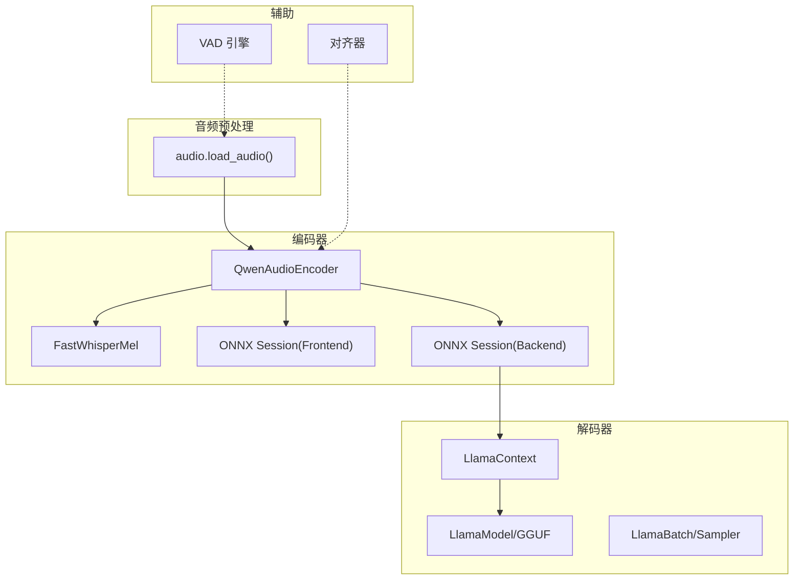
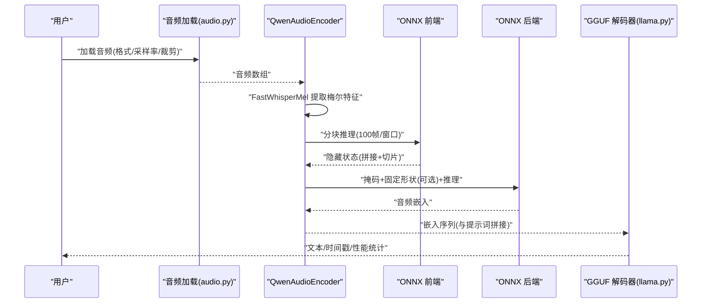
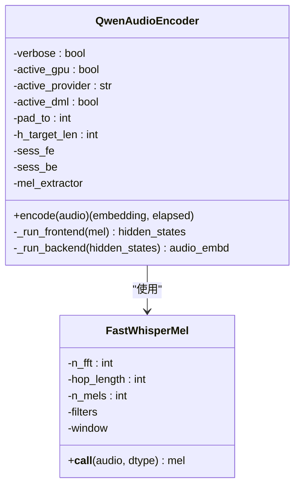
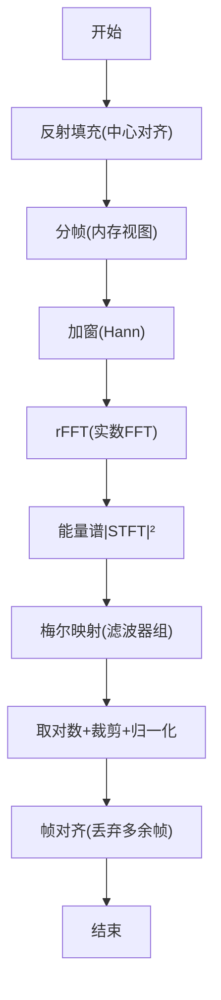
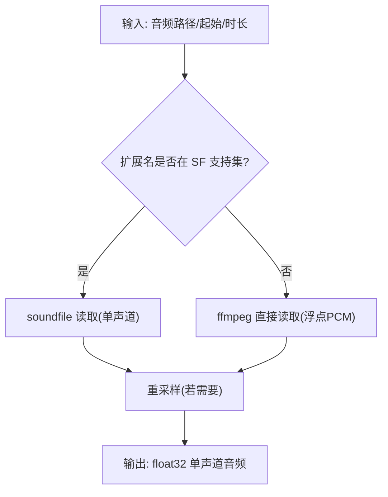
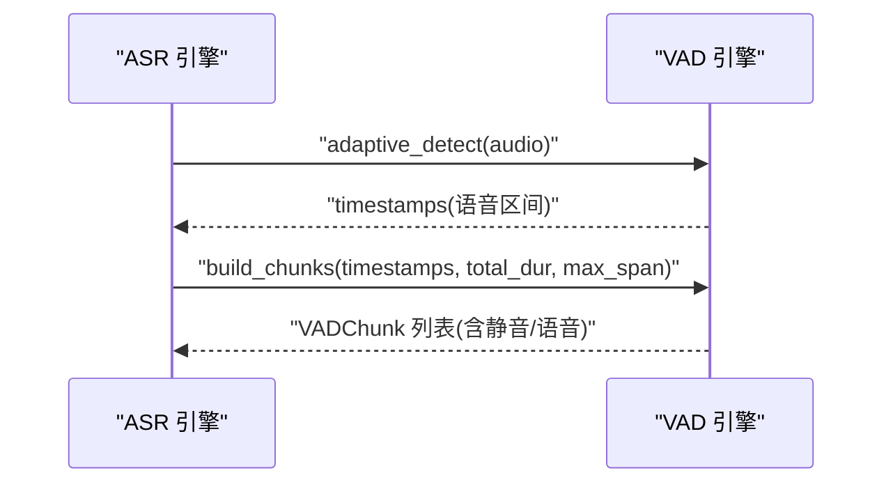
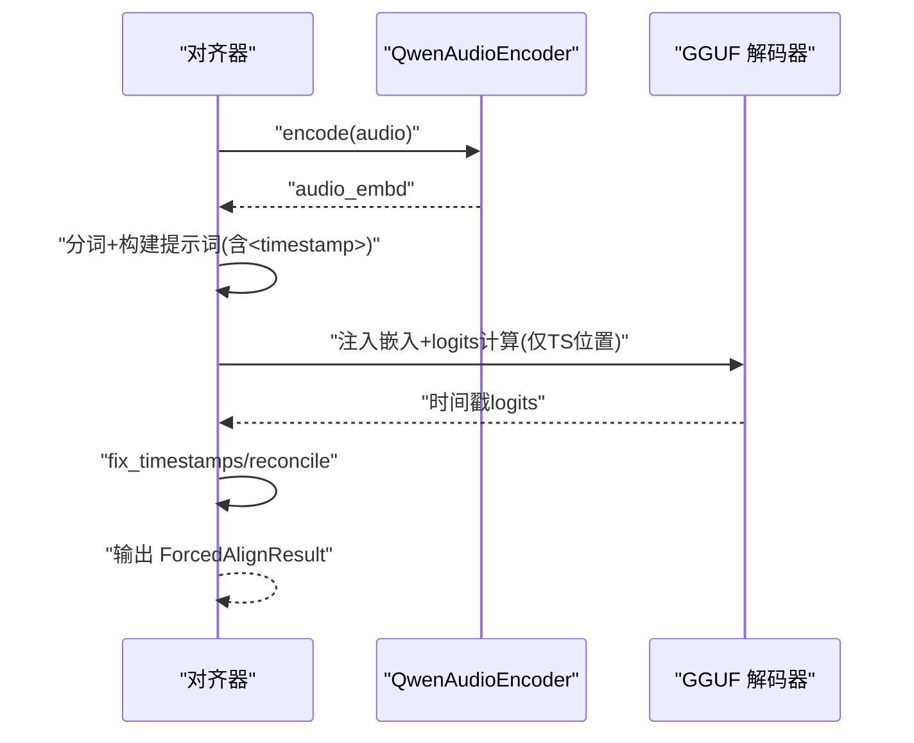
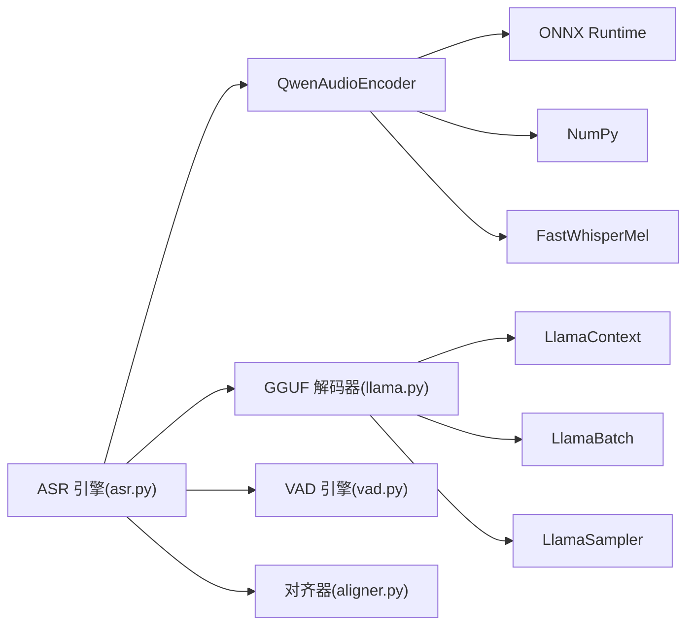

# 音频编码器

<cite>
**本文引用的文件**
- [encoder.py](file://qwen_asr_gguf/inference/encoder.py)
- [audio.py](file://qwen_asr_gguf/inference/audio.py)
- [asr.py](file://qwen_asr_gguf/inference/asr.py)
- [vad.py](file://qwen_asr_gguf/inference/vad.py)
- [aligner.py](file://qwen_asr_gguf/inference/aligner.py)
- [utils.py](file://qwen_asr_gguf/inference/utils.py)
- [schema.py](file://qwen_asr_gguf/inference/schema.py)
- [llama.py](file://qwen_asr_gguf/inference/llama.py)
- [infer.py](file://infer.py)
- [export_config.py](file://export_config.py)
</cite>

## 目录
1. [简介](#简介)
2. [项目结构](#项目结构)
3. [核心组件](#核心组件)
4. [架构总览](#架构总览)
5. [详细组件分析](#详细组件分析)
6. [依赖关系分析](#依赖关系分析)
7. [性能与优化](#性能与优化)
8. [故障排查指南](#故障排查指南)
9. [结论](#结论)
10. [附录](#附录)

## 简介
本技术文档围绕“音频编码器”展开，重点阐述 QwenAudioEncoder 的架构设计、ONNX 推理引擎集成、音频预处理流程，以及前端编码器（Frontend）与后端编码器（Backend）的分工与协作机制。文档还涵盖：
- 梅尔频谱提取、特征标准化、时序对齐等关键步骤
- 编码器配置参数、性能优化策略、内存使用优化、GPU 加速支持
- 音频加载、预处理、编码的完整流程，支持的音频格式、采样率要求、音频质量处理
- 在不同应用场景下的性能表现、配置建议与故障排除

## 项目结构
本项目采用“编码器 + 解码器（GGUF）”的混合架构，其中编码器由 ONNX Runtime 推理，解码器由 llama.cpp（GGUF）实现。核心模块如下：
- 音频预处理：统一的音频加载与重采样
- 编码器：Split 前端 + 后端（ONNX）
- VAD：语音活动检测，用于长音频动态分片
- 强制对齐：对齐器（ONNX 前端/后端 + GGUF 解码器）
- ASR 引擎：整合编码器、VAD、对齐器与 GGUF 解码器的流水线

图表来源
- [audio.py:129-149](file://qwen_asr_gguf/inference/audio.py#L129-L149)
- [encoder.py:119-280](file://qwen_asr_gguf/inference/encoder.py#L119-L280)
- [asr.py:40-96](file://qwen_asr_gguf/inference/asr.py#L40-L96)
- [vad.py:29-467](file://qwen_asr_gguf/inference/vad.py#L29-L467)
- [aligner.py:229-350](file://qwen_asr_gguf/inference/aligner.py#L229-L350)
- [llama.py:443-549](file://qwen_asr_gguf/inference/llama.py#L443-L549)

章节来源
- [audio.py:129-149](file://qwen_asr_gguf/inference/audio.py#L129-L149)
- [encoder.py:119-280](file://qwen_asr_gguf/inference/encoder.py#L119-L280)
- [asr.py:40-96](file://qwen_asr_gguf/inference/asr.py#L40-L96)
- [vad.py:29-467](file://qwen_asr_gguf/inference/vad.py#L29-L467)
- [aligner.py:229-350](file://qwen_asr_gguf/inference/aligner.py#L229-L350)
- [llama.py:443-549](file://qwen_asr_gguf/inference/llama.py#L443-L549)

## 核心组件
- QwenAudioEncoder：Split 前端 + 后端的 ONNX 编码器，负责梅尔特征提取、分块推理、掩码与固定形状填充、输出嵌入
- FastWhisperMel：纯 NumPy 实现的梅尔滤波器组，兼容 torchaudio 行为，提供稳定的 STFT、能量谱、对数归一化与帧对齐
- 音频预处理：统一的音频加载与重采样，支持多种格式与起始/时长裁剪
- VAD：FireRedVAD 封装，提供自适应阈值与分片构建能力
- 对齐器：对齐器编码器 + GGUF 解码器，支持强制对齐与时间戳修正
- ASR 引擎：整合编码器、VAD、对齐器与 GGUF 解码器的统一流水线

章节来源
- [encoder.py:119-280](file://qwen_asr_gguf/inference/encoder.py#L119-L280)
- [encoder.py:8-118](file://qwen_asr_gguf/inference/encoder.py#L8-L118)
- [audio.py:66-149](file://qwen_asr_gguf/inference/audio.py#L66-L149)
- [vad.py:29-467](file://qwen_asr_gguf/inference/vad.py#L29-L467)
- [aligner.py:229-350](file://qwen_asr_gguf/inference/aligner.py#L229-L350)
- [asr.py:40-96](file://qwen_asr_gguf/inference/asr.py#L40-L96)

## 架构总览
编码器采用“Split 模型”设计，将特征提取与序列建模分离：
- 前端（ONNX）：接收梅尔频谱，按 100 帧窗口分块推理，拼接后按官方公式切片去除填充带来的尾部无效帧
- 后端（ONNX）：接收隐藏状态，支持固定形状填充与注意力掩码，输出音频嵌入
- 解码器（GGUF）：通过 LlamaModel/LlamaContext/LlamaBatch/Sampler 执行生成式解码

图表来源
- [audio.py:66-149](file://qwen_asr_gguf/inference/audio.py#L66-L149)
- [encoder.py:198-279](file://qwen_asr_gguf/inference/encoder.py#L198-L279)
- [llama.py:443-549](file://qwen_asr_gguf/inference/llama.py#L443-L549)

## 详细组件分析

### QwenAudioEncoder：Split 前端 + 后端
- 初始化与 Provider 选择：自动探测可用 ONNX Provider（CUDA/ROCM/TensorRT/DML/CPU），并设置 SessionOptions（图优化、线程旋转禁用、日志级别）
- 预热：根据是否使用 DML 与 pad_to，执行固定形状或动态形状的预热
- 前端推理（_run_frontend）：将梅尔特征按 100 帧补齐到 100 的倍数，逐块推理，拼接后按官方公式切片去除填充帧
- 后端推理（_run_backend）：根据是否启用固定形状填充与 DML，构造注意力掩码，执行推理并截断输出
- 编码入口（encode）：执行梅尔提取 → 前端 → 后端，返回嵌入与耗时

图表来源
- [encoder.py:119-280](file://qwen_asr_gguf/inference/encoder.py#L119-L280)
- [encoder.py:8-118](file://qwen_asr_gguf/inference/encoder.py#L8-L118)

章节来源
- [encoder.py:119-280](file://qwen_asr_gguf/inference/encoder.py#L119-L280)

### FastWhisperMel：梅尔频谱提取与对齐
- 滤波器组生成：支持 Slaney/HTK 梅尔尺度，面积归一化
- 分帧与 STFT：反射填充、内存视图高效分帧、Hann 窗乘积、rFFT
- 能量谱与对数归一化：能量谱、对数、裁剪到最大值-8dB、归一化到[0,1]
- 帧对齐：丢弃多余帧，保证与原始采样点一一对应

图表来源
- [encoder.py:76-107](file://qwen_asr_gguf/inference/encoder.py#L76-L107)

章节来源
- [encoder.py:8-118](file://qwen_asr_gguf/inference/encoder.py#L8-L118)

### 音频预处理：加载与重采样
- 格式支持：soundfile 支持 .wav/.flac/.ogg/.mp3；其他格式通过 ffmpeg 直接读取
- 重采样：polyphase FIR（与 scipy 对齐度高），支持起始/时长裁剪
- 单声道化：多声道取平均

图表来源
- [audio.py:66-149](file://qwen_asr_gguf/inference/audio.py#L66-L149)

章节来源
- [audio.py:66-149](file://qwen_asr_gguf/inference/audio.py#L66-L149)

### VAD：语音活动检测与动态分片
- FireRedVAD 封装：延迟加载、阈值自适应、帧级概率平滑与分割
- 分片构建：合并近邻语音段、贪心打包、插入静音分片，覆盖全时域

图表来源
- [vad.py:160-406](file://qwen_asr_gguf/inference/vad.py#L160-L406)
- [asr.py:602-721](file://qwen_asr_gguf/inference/asr.py#L602-L721)

章节来源
- [vad.py:29-467](file://qwen_asr_gguf/inference/vad.py#L29-L467)
- [asr.py:602-721](file://qwen_asr_gguf/inference/asr.py#L602-L721)

### 对齐器：强制对齐与时间戳修正
- 编码器：复用 QwenAudioEncoder，统一编码流程
- 分词与提示词构建：按语言分词，构建包含时间戳占位符的序列
- 解码：仅计算时间戳位置的 logits，加速推理
- 时间戳修正：最长递增子序列与异常修复，重建标点与空格

图表来源
- [aligner.py:229-350](file://qwen_asr_gguf/inference/aligner.py#L229-L350)
- [encoder.py:119-280](file://qwen_asr_gguf/inference/encoder.py#L119-L280)
- [llama.py:443-549](file://qwen_asr_gguf/inference/llama.py#L443-L549)

章节来源
- [aligner.py:229-350](file://qwen_asr_gguf/inference/aligner.py#L229-L350)

### ASR 引擎：统一流水线
- 初始化：加载编码器（可动态分片）、对齐器（可选）、VAD（延迟加载）、GGUF 解码器
- 分片策略：短音频单片；长音频 VAD 动态分片；VAD 不可用时固定分片
- 抗幻觉：重复熔断、n-gram 熔断、max_new_tokens 上限、边界缓冲
- 性能统计：编码耗时、解码耗时、VAD 跳过统计

章节来源
- [asr.py:40-96](file://qwen_asr_gguf/inference/asr.py#L40-L96)
- [asr.py:602-800](file://qwen_asr_gguf/inference/asr.py#L602-L800)

## 依赖关系分析
- 编码器依赖 ONNX Runtime（前端/后端）、NumPy、FastWhisperMel
- 解码器依赖 llama.cpp（GGUF）与 ctypes 绑定，提供模型加载、上下文、批处理、采样器
- VAD 依赖 fireredvad（第三方库）
- 对齐器复用编码器与 GGUF 解码器
- ASR 引擎整合上述组件并提供统一流水线

图表来源
- [encoder.py:119-280](file://qwen_asr_gguf/inference/encoder.py#L119-L280)
- [llama.py:443-549](file://qwen_asr_gguf/inference/llama.py#L443-L549)
- [asr.py:40-96](file://qwen_asr_gguf/inference/asr.py#L40-L96)
- [vad.py:29-467](file://qwen_asr_gguf/inference/vad.py#L29-L467)
- [aligner.py:229-350](file://qwen_asr_gguf/inference/aligner.py#L229-L350)

章节来源
- [encoder.py:119-280](file://qwen_asr_gguf/inference/encoder.py#L119-L280)
- [llama.py:443-549](file://qwen_asr_gguf/inference/llama.py#L443-L549)
- [asr.py:40-96](file://qwen_asr_gguf/inference/asr.py#L40-L96)
- [vad.py:29-467](file://qwen_asr_gguf/inference/vad.py#L29-L467)
- [aligner.py:229-350](file://qwen_asr_gguf/inference/aligner.py#L229-L350)

## 性能与优化
- Provider 选择与回退：优先 CUDA/ROCM/TensorRT/DML，否则回退 CPU；DML 下启用固定形状填充与预热
- Session 优化：图优化级别开启、禁用线程旋转、日志级别控制
- 编码器优化：前端按 100 帧窗口分块推理，拼接后按官方公式切片；后端掩码仅对固定形状启用
- 解码器优化：仅计算时间戳位置 logits，减少 KV Cache 与采样开销；采样器链按需配置
- VAD 优化：自适应阈值、平滑窗口、合并近邻语音段、扩展边界，提升动态分片效率
- 抗幻觉：token 级重复熔断、n-gram 重复熔断、max_new_tokens 上限、边界缓冲

章节来源
- [encoder.py:130-196](file://qwen_asr_gguf/inference/encoder.py#L130-L196)
- [asr.py:212-345](file://qwen_asr_gguf/inference/asr.py#L212-L345)
- [vad.py:160-294](file://qwen_asr_gguf/inference/vad.py#L160-L294)
- [aligner.py:305-348](file://qwen_asr_gguf/inference/aligner.py#L305-L348)

## 故障排查指南
- 未检测到可用 GPU Provider：检查 ONNX Runtime 可用 Provider 列表，确认驱动与库安装正确
- ffmpeg 未安装：音频加载失败，需安装 ffmpeg 并加入 PATH
- VAD 未安装：fireredvad 未安装，需 pip 安装或手动安装
- 模型路径错误：确认模型目录与文件名正确，GGUF/ONNX 文件存在
- 预热失败：DML 固定形状模式下需确保 pad_to 与模型输入匹配
- 解码越界：n_ctx 超限时会触发保护，需调整上下文窗口或分片策略

章节来源
- [encoder.py:137-196](file://qwen_asr_gguf/inference/encoder.py#L137-L196)
- [audio.py:88-125](file://qwen_asr_gguf/inference/audio.py#L88-L125)
- [vad.py:51-80](file://qwen_asr_gguf/inference/vad.py#L51-L80)
- [asr.py:226-237](file://qwen_asr_gguf/inference/asr.py#L226-L237)

## 结论
本音频编码器通过 Split 模型设计，结合 ONNX Runtime 的高效推理与 GGUF 解码器的强大生成能力，实现了高性能、低延迟的语音识别与对齐。配合 VAD 的动态分片与抗幻觉策略，能够在长音频场景下显著降低 RTF 并提升稳定性。通过合理的 Provider 选择、Session 优化与固定形状填充策略，可在不同硬件环境下获得最佳性能。

## 附录

### 编码器配置参数
- use_gpu：是否启用 GPU Provider
- pad_to：固定形状填充时长（秒），DML 模式下启用
- n_ctx：解码器上下文窗口大小
- chunk_size：ASR 分片时长（秒）
- memory_num：保留前 N 个分片的记忆作为上下文
- dynamic_chunk_threshold：启用 VAD 动态分片的音频时长阈值
- enable_aligner：是否启用对齐器
- align_config：对齐器配置（包含前端/后端 ONNX 与 GGUF 解码器）

章节来源
- [schema.py:162-210](file://qwen_asr_gguf/inference/schema.py#L162-L210)

### 支持的音频格式与采样率
- 格式：.wav/.flac/.ogg/.mp3（soundfile）与 .m4a/.mp4/.opus/.wmv 等（ffmpeg）
- 采样率：默认 16kHz；编码器内部使用 16kHz；音频加载阶段可重采样
- 起始/时长裁剪：支持按秒级裁剪

章节来源
- [audio.py:66-149](file://qwen_asr_gguf/inference/audio.py#L66-L149)
- [asr.py:638-641](file://qwen_asr_gguf/inference/asr.py#L638-L641)

### 模型导出与路径
- 模型目录：export_config.py 中定义的模型根目录
- 编码器 ONNX：qwen3_asr_encoder_frontend.fp16.onnx、qwen3_asr_encoder_backend.fp16.onnx
- 对齐器 ONNX：qwen3_aligner_encoder_frontend.fp16.onnx、qwen3_aligner_encoder_backend.fp16.onnx
- 解码器 GGUF：qwen3_asr_llm.f16.gguf、qwen3_aligner_llm.f16.gguf

章节来源
- [export_config.py:1-12](file://export_config.py#L1-L12)

### Web 服务入口
- infer.py 提供 FastAPI 应用，注册中间件与路由，启动 uvicorn 服务
- 生命周期：启动时初始化 ASR 服务单例，关闭时优雅释放

章节来源
- [infer.py:55-123](file://infer.py#L55-L123)