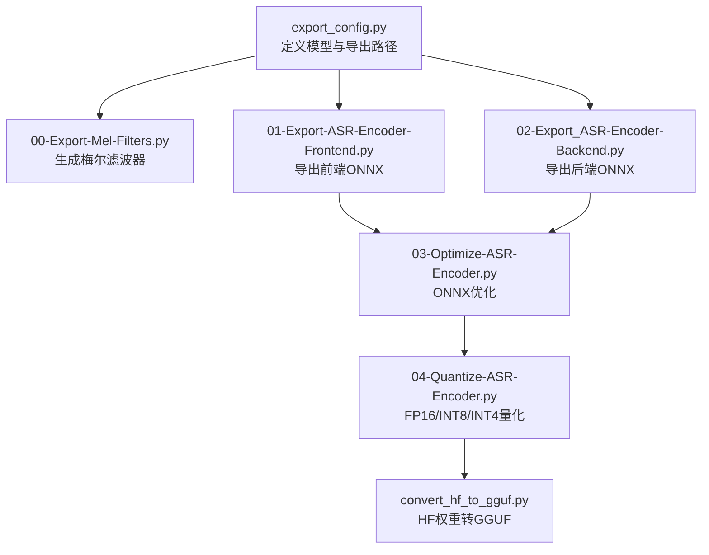
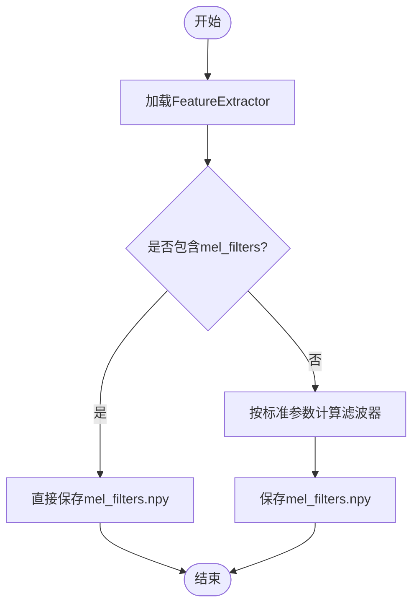
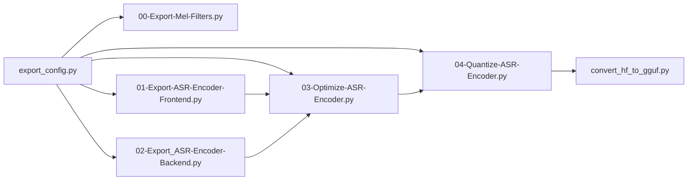

# 导出配置与参数

<cite>
**本文引用的文件**
- [export_config.py](file://export_config.py)
- [00-Export-Mel-Filters.py](file://00-Export-Mel-Filters.py)
- [01-Export-ASR-Encoder-Frontend.py](file://01-Export-ASR-Encoder-Frontend.py)
- [02-Export_ASR-Encoder-Backend.py](file://02-Export_ASR-Encoder-Backend.py)
- [03-Optimize-ASR-Encoder.py](file://03-Optimize-ASR-Encoder.py)
- [04-Quantize-ASR-Encoder.py](file://04-Quantize-ASR-Encoder.py)
- [convert_hf_to_gguf.py](file://qwen_asr_gguf/export/convert_hf_to_gguf.py)
- [encoder.py](file://qwen_asr_gguf/inference/encoder.py)
- [ggml-vulkan.cpp](file://ref/llama.cpp/ggml/src/ggml-vulkan/ggml-vulkan.cpp)
- [ggml-cuda.cu](file://ref/llama.cpp/ggml/src/ggml-cuda/ggml-cuda.cu)
- [ggml-cpu.cpp](file://ref/llama.cpp/ggml/src/ggml-cpu/ggml-cpu.cpp)
- [common.py](file://ref/llama.cpp/examples/model-conversion/scripts/utils/common.py)
</cite>

## 目录
1. [简介](#简介)
2. [项目结构](#项目结构)
3. [核心组件](#核心组件)
4. [架构总览](#架构总览)
5. [详细组件分析](#详细组件分析)
6. [依赖分析](#依赖分析)
7. [性能考虑](#性能考虑)
8. [故障排查指南](#故障排查指南)
9. [结论](#结论)
10. [附录](#附录)

## 简介
本文件面向Qwen3-ASR模型导出配置系统，围绕export_config.py中的配置参数与环境变量进行深入解析，并结合导出流水线脚本说明关键路径、音频处理参数、量化策略、版本兼容性与跨平台优化建议。文档同时提供内存与磁盘估算、并发参数建议以及配置验证与错误诊断方法，帮助用户在不同硬件平台（AMD GPU、Intel GPU、CPU）上稳定高效地完成模型导出。

## 项目结构
导出配置系统由“配置文件 + 导出脚本 + 推理/转换工具”构成，核心配置集中在export_config.py中，音频前端、后端与量化流程分别由独立脚本执行，最终通过GGUF转换器完成模型格式落地。



**图表来源**
- [export_config.py:1-12](file://export_config.py#L1-L12)
- [00-Export-Mel-Filters.py:1-46](file://00-Export-Mel-Filters.py#L1-L46)
- [01-Export-ASR-Encoder-Frontend.py:1-53](file://01-Export-ASR-Encoder-Frontend.py#L1-L53)
- [02-Export_ASR-Encoder-Backend.py:1-57](file://02-Export_ASR-Encoder-Backend.py#L1-L57)
- [03-Optimize-ASR-Encoder.py:1-70](file://03-Optimize-ASR-Encoder.py#L1-L70)
- [04-Quantize-ASR-Encoder.py:1-101](file://04-Quantize-ASR-Encoder.py#L1-L101)
- [convert_hf_to_gguf.py:1-800](file://qwen_asr_gguf/export/convert_hf_to_gguf.py#L1-L800)

**章节来源**
- [export_config.py:1-12](file://export_config.py#L1-L12)
- [00-Export-Mel-Filters.py:1-46](file://00-Export-Mel-Filters.py#L1-L46)
- [01-Export-ASR-Encoder-Frontend.py:1-53](file://01-Export-ASR-Encoder-Frontend.py#L1-L53)
- [02-Export_ASR-Encoder-Backend.py:1-57](file://02-Export_ASR-Encoder-Backend.py#L1-L57)
- [03-Optimize-ASR-Encoder.py:1-70](file://03-Optimize-ASR-Encoder.py#L1-L70)
- [04-Quantize-ASR-Encoder.py:1-101](file://04-Quantize-ASR-Encoder.py#L1-L101)
- [convert_hf_to_gguf.py:1-800](file://qwen_asr_gguf/export/convert_hf_to_gguf.py#L1-L800)

## 核心组件
- 配置参数与环境变量
  - ASR_MODEL_DIR：官方下载的SafeTensors模型目录，默认指向本地缓存下的Qwen3-ASR-1.7B模型路径。
  - ALIGNER_MODEL_DIR：Qwen3-ForcedAligner-0.6B模型路径。
  - EXPORT_DIR：导出目标目录，默认为当前工程根目录下的models文件夹。
  - 注意：仓库未定义环境变量读取逻辑，上述路径为硬编码默认值；若需覆盖，请在运行前修改export_config.py或通过外部脚本注入。

- 音频处理参数（来自导出脚本与推理实现）
  - 采样率：16000 Hz（Whisper系特征提取器标准）。
  - FFT大小：400（对应频谱bin数为201）。
  - 梅尔滤波器数量：128。
  - 窗口/步长：窗口长度与步长由Whisper特征提取器内部参数决定，导出脚本中显式使用了mel_filter_bank函数与上述参数组合。
  - 归一化与尺度：采用Slaney梅尔刻度（分段线性+对数），并支持面积归一化。

- 模型版本兼容性
  - GGUF转换器具备自动识别权重文件、加载配置与量化版本写入能力，可作为版本兼容性的基础保障。
  - 版本比较工具提供通用的语义化版本比较与警告提示，可用于检测模型版本与当前工具链的兼容性风险。

**章节来源**
- [export_config.py:1-12](file://export_config.py#L1-L12)
- [00-Export-Mel-Filters.py:11-36](file://00-Export-Mel-Filters.py#L11-L36)
- [encoder.py:23-42](file://qwen_asr_gguf/inference/encoder.py#L23-L42)
- [convert_hf_to_gguf.py:1-800](file://qwen_asr_gguf/export/convert_hf_to_gguf.py#L1-L800)
- [common.py:251-270](file://ref/llama.cpp/examples/model-conversion/scripts/utils/common.py#L251-L270)

## 架构总览
下图展示从配置到最终GGUF产物的完整导出链路，包括梅尔滤波器生成、前后端ONNX导出、ONNX优化与量化，以及最终的GGUF转换。

```mermaid
sequenceDiagram
participant Cfg as "配置文件<br/>export_config.py"
participant Mel as "梅尔滤波器导出<br/>00-Export-Mel-Filters.py"
participant FE as "前端导出<br/>01-Export-ASR-Encoder-Frontend.py"
participant BE as "后端导出<br/>02-Export_ASR-Encoder-Backend.py"
participant Opt as "ONNX优化<br/>03-Optimize-ASR-Encoder.py"
participant Q as "量化<br/>04-Quantize-ASR-Encoder.py"
participant GGUF as "GGUF转换<br/>convert_hf_to_gguf.py"
Cfg->>Mel : 读取ASR_MODEL_DIR/EXPORT_DIR
Mel-->>Cfg : 生成mel_filters.npy
Cfg->>FE : 读取ASR_MODEL_DIR/EXPORT_DIR
FE-->>Cfg : 导出前端ONNX
Cfg->>BE : 读取ASR_MODEL_DIR/EXPORT_DIR
BE-->>Cfg : 导出后端ONNX
Cfg->>Opt : 读取前端/后端ONNX
Opt-->>Cfg : 优化并保存
Cfg->>Q : 读取优化后的ONNX
Q-->>Cfg : FP16/INT8/INT4产物
Cfg->>GGUF : 读取权重与配置
GGUF-->>Cfg : 生成GGUF文件
```

**图表来源**
- [export_config.py:1-12](file://export_config.py#L1-L12)
- [00-Export-Mel-Filters.py:1-46](file://00-Export-Mel-Filters.py#L1-L46)
- [01-Export-ASR-Encoder-Frontend.py:1-53](file://01-Export-ASR-Encoder-Frontend.py#L1-L53)
- [02-Export_ASR-Encoder-Backend.py:1-57](file://02-Export_ASR-Encoder-Backend.py#L1-L57)
- [03-Optimize-ASR-Encoder.py:1-70](file://03-Optimize-ASR-Encoder.py#L1-L70)
- [04-Quantize-ASR-Encoder.py:1-101](file://04-Quantize-ASR-Encoder.py#L1-L101)
- [convert_hf_to_gguf.py:1-800](file://qwen_asr_gguf/export/convert_hf_to_gguf.py#L1-L800)

## 详细组件分析

### 配置文件export_config.py
- 作用：集中管理模型源路径与导出目标路径，避免各脚本重复硬编码。
- 关键点：
  - ASR_MODEL_DIR与ALIGNER_MODEL_DIR用于定位官方模型权重。
  - EXPORT_DIR用于统一存放中间与最终产物。
  - 默认路径为相对路径，便于在不同环境中复用。

**章节来源**
- [export_config.py:1-12](file://export_config.py#L1-L12)

### 梅尔滤波器导出（00-Export-Mel-Filters.py）
- 流程要点：
  - 从ASR_MODEL_DIR加载WhisperFeatureExtractor。
  - 若对象自带mel_filters则直接读取；否则按标准参数手动计算并保存为mel_filters.npy。
  - 标准参数：采样率16000、FFT=400、梅尔滤波器128、Slaney刻度。
- 输出：mel_filters.npy位于EXPORT_DIR。



**图表来源**
- [00-Export-Mel-Filters.py:11-46](file://00-Export-Mel-Filters.py#L11-L46)

**章节来源**
- [00-Export-Mel-Filters.py:1-46](file://00-Export-Mel-Filters.py#L1-L46)

### 前端编码器导出（01-Export-ASR-Encoder-Frontend.py）
- 目标：导出音频前端（梅尔频谱到隐藏表示）为静态形状的ONNX。
- 关键点：
  - 使用Qwen3ASRModel加载audio_tower。
  - 固定输入维度：Batch=1、Freq=128、Time=100（对应1秒、100帧）。
  - opset=19，禁用常量折叠，启用dynamo加速。
- 输出：qwen3_asr_encoder_frontend.fp32.onnx位于EXPORT_DIR。

**章节来源**
- [01-Export-ASR-Encoder-Frontend.py:1-53](file://01-Export-ASR-Encoder-Frontend.py#L1-L53)

### 后端编码器导出（02-Export_ASR-Encoder-Backend.py）
- 目标：导出Transformer后端（动态形状）为ONNX。
- 关键点：
  - 动态获取hidden_size（随模型规模变化）。
  - 动态轴定义：batch、time维度可变。
  - opset=19，开启常量折叠与dynamo。
- 输出：qwen3_asr_encoder_backend.fp32.onnx位于EXPORT_DIR。

**章节来源**
- [02-Export_ASR-Encoder-Backend.py:1-57](file://02-Export_ASR-Encoder-Backend.py#L1-L57)

### ONNX优化（03-Optimize-ASR-Encoder.py）
- 目标：对前端与后端ONNX进行算子融合与优化。
- 关键点：
  - 使用bert类型的优化器，触发常见Transformer融合（Gelu、LayerNorm、Attention等）。
  - 保持浮点模式保存，避免精度回退。
  - 输出Opset与算子分布诊断信息，便于问题定位。

**章节来源**
- [03-Optimize-ASR-Encoder.py:1-70](file://03-Optimize-ASR-Encoder.py#L1-L70)

### 量化（04-Quantize-ASR-Encoder.py）
- 目标：提供FP16、INT8、INT4三种量化路径，兼顾精度与体积。
- 关键点：
  - FP16：使用ONNXRuntime Transformers转换，保留LayerNorm与Softmax为FP32以维持稳定性。
  - INT8：动态量化，对MatMul/Attention/Conv等核心算子进行权重量化。
  - INT4：基于MatMulNBitsQuantizer的块级非对称量化。
- 输出：分别生成.fp16、.int8、.int4后缀的模型文件。

**章节来源**
- [04-Quantize-ASR-Encoder.py:1-101](file://04-Quantize-ASR-Encoder.py#L1-L101)

### GGUF转换（convert_hf_to_gguf.py）
- 目标：将HuggingFace权重与配置转换为GGUF格式，便于推理部署。
- 关键点：
  - 自动索引权重文件（支持safetensors与bin），校验权重映射完整性。
  - 支持多种量化反量化流程（BitNet、FP8、GPTQ等），并写入量化版本元数据。
  - 自动推断文件类型（F16/BF16/Q8_0等）并进行张量量化与写入。

**章节来源**
- [convert_hf_to_gguf.py:1-800](file://qwen_asr_gguf/export/convert_hf_to_gguf.py#L1-L800)

## 依赖分析
- 配置到脚本的依赖
  - 所有导出脚本均从export_config.py导入ASR_MODEL_DIR与EXPORT_DIR。
  - 前端/后端导出脚本依赖Qwen3ASRModel与自定义ONNX封装类。
  - 量化脚本依赖ONNXRuntime与MatMulNBitsQuantizer。
  - GGUF转换器依赖gguf库与权重索引机制。



**图表来源**
- [export_config.py:1-12](file://export_config.py#L1-L12)
- [00-Export-Mel-Filters.py:1-46](file://00-Export-Mel-Filters.py#L1-L46)
- [01-Export-ASR-Encoder-Frontend.py:1-53](file://01-Export-ASR-Encoder-Frontend.py#L1-L53)
- [02-Export_ASR-Encoder-Backend.py:1-57](file://02-Export_ASR-Encoder-Backend.py#L1-L57)
- [03-Optimize-ASR-Encoder.py:1-70](file://03-Optimize-ASR-Encoder.py#L1-L70)
- [04-Quantize-ASR-Encoder.py:1-101](file://04-Quantize-ASR-Encoder.py#L1-L101)
- [convert_hf_to_gguf.py:1-800](file://qwen_asr_gguf/export/convert_hf_to_gguf.py#L1-L800)

**章节来源**
- [export_config.py:1-12](file://export_config.py#L1-L12)
- [00-Export-Mel-Filters.py:1-46](file://00-Export-Mel-Filters.py#L1-L46)
- [01-Export-ASR-Encoder-Frontend.py:1-53](file://01-Export-ASR-Encoder-Frontend.py#L1-L53)
- [02-Export_ASR-Encoder-Backend.py:1-57](file://02-Export_ASR-Encoder-Backend.py#L1-L57)
- [03-Optimize-ASR-Encoder.py:1-70](file://03-Optimize-ASR-Encoder.py#L1-L70)
- [04-Quantize-ASR-Encoder.py:1-101](file://04-Quantize-ASR-Encoder.py#L1-L101)
- [convert_hf_to_gguf.py:1-800](file://qwen_asr_gguf/export/convert_hf_to_gguf.py#L1-L800)

## 性能考虑
- 硬件平台优化建议
  - AMD GPU（ROCm/CUDA）：优先使用FP16量化，关注卷积/矩阵乘算子的内核选择；必要时调整批大小与序列长度以适配显存。
  - Intel GPU（Level Zero/Vulkan）：启用Vulkan后端，合理设置系统内存回退与图优化开关；注意设备可见显存与UVA支持。
  - CPU：优先启用多线程与SIMD扩展（如NEON、AVX等），适当降低批大小与序列长度，避免内存峰值过高。
- 并发与资源
  - ONNX优化与量化阶段建议串行执行以减少IO争用；若机器具备足够内存，可在不同量化路径间并行处理不同模型。
  - GGUF转换阶段建议使用惰性加载与分片写入，避免一次性加载全部权重导致内存峰值过高。

[本节为通用指导，无需具体文件引用]

## 故障排查指南
- 配置与路径
  - 确认ASR_MODEL_DIR与EXPORT_DIR存在且可读写；若模型未下载，先完成官方权重下载与解压。
  - 若导出失败，检查各脚本是否正确导入export_config.py并使用相同路径。
- 梅尔滤波器缺失
  - 若FeatureExtractor不含mel_filters，脚本会按标准参数重新计算；请确认采样率、FFT与梅尔数量参数一致。
- ONNX优化失败
  - 检查Opset版本与算子域；根据诊断输出定位不支持的算子或形状问题。
- 量化异常
  - FP16转换需注意某些算子（如LayerNorm）的精度保留；INT8/INT4量化失败通常与权重形状或块大小有关。
- GGUF转换错误
  - 核对权重索引文件是否存在、权重映射是否完整；必要时重新下载或检查远程权重可用性。
- 版本兼容性
  - 使用版本比较工具检测当前工具链与模型版本差异，必要时升级或降级工具链以满足兼容要求。

**章节来源**
- [00-Export-Mel-Filters.py:11-46](file://00-Export-Mel-Filters.py#L11-L46)
- [03-Optimize-ASR-Encoder.py:32-53](file://03-Optimize-ASR-Encoder.py#L32-L53)
- [04-Quantize-ASR-Encoder.py:14-47](file://04-Quantize-ASR-Encoder.py#L14-L47)
- [convert_hf_to_gguf.py:200-270](file://qwen_asr_gguf/export/convert_hf_to_gguf.py#L200-L270)
- [common.py:251-270](file://ref/llama.cpp/examples/model-conversion/scripts/utils/common.py#L251-L270)

## 结论
通过export_config.py集中管理路径与参数，配合分阶段的导出脚本，Qwen3-ASR模型可稳定地完成从特征提取、前端/后端导出、ONNX优化与量化到GGUF格式的全流程转换。在不同硬件平台上，应依据算子支持与显存/内存限制选择合适的量化策略与并发参数，并利用内置诊断工具快速定位问题，确保导出质量与效率。

[本节为总结，无需具体文件引用]

## 附录

### 关键参数与默认值速览
- 路径配置
  - ASR_MODEL_DIR：Qwen3-ASR-1.7B模型目录（默认相对路径）。
  - ALIGNER_MODEL_DIR：Qwen3-ForcedAligner-0.6B模型目录（默认相对路径）。
  - EXPORT_DIR：导出目录（默认相对路径）。
- 音频处理参数
  - 采样率：16000 Hz。
  - FFT大小：400。
  - 梅尔滤波器数量：128。
  - 刻度：Slaney（分段线性+对数）。
- 量化策略
  - FP16：保留部分算子FP32以保证数值稳定。
  - INT8：对MatMul/Attention/Conv进行权重量化。
  - INT4：基于块的非对称量化。

**章节来源**
- [export_config.py:1-12](file://export_config.py#L1-L12)
- [00-Export-Mel-Filters.py:23-35](file://00-Export-Mel-Filters.py#L23-L35)
- [04-Quantize-ASR-Encoder.py:14-63](file://04-Quantize-ASR-Encoder.py#L14-L63)

### 跨平台环境变量参考（示例）
- Vulkan（Intel GPU）
  - GGML_VK_DISABLE_HOST_VISIBLE_VIDMEM：禁用设备可见显存。
  - GGML_VK_ALLOW_SYSMEM_FALLBACK：允许系统内存回退。
  - GGML_VK_DISABLE_GRAPH_OPTIMIZE：禁用图优化。
- CUDA（NVIDIA/AMD MUSA）
  - 设备能力探测与特性日志可用于判断算子支持与Warp/CC配置。

**章节来源**
- [ggml-vulkan.cpp:4491-4511](file://ref/llama.cpp/ggml/src/ggml-vulkan/ggml-vulkan.cpp#L4491-L4511)
- [ggml-cuda.cu:252-275](file://ref/llama.cpp/ggml/src/ggml-cuda/ggml-cuda.cu#L252-L275)