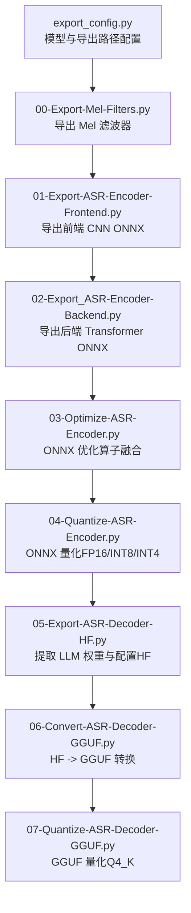
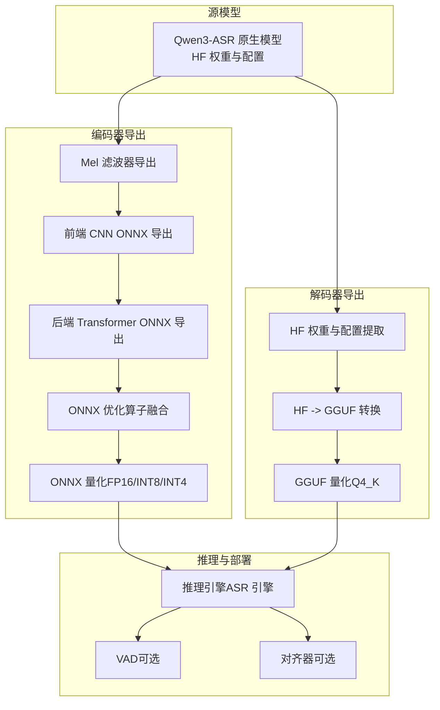
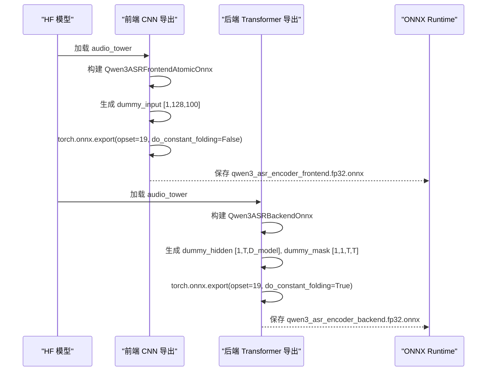
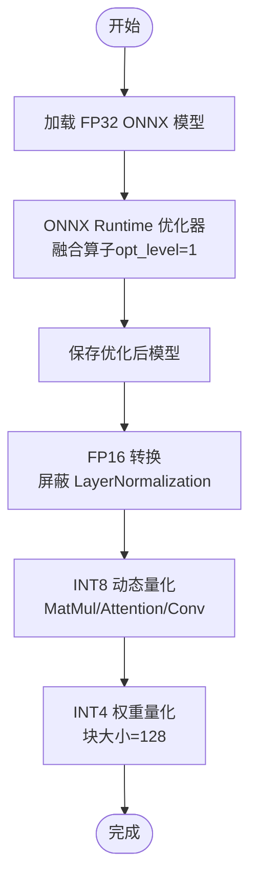
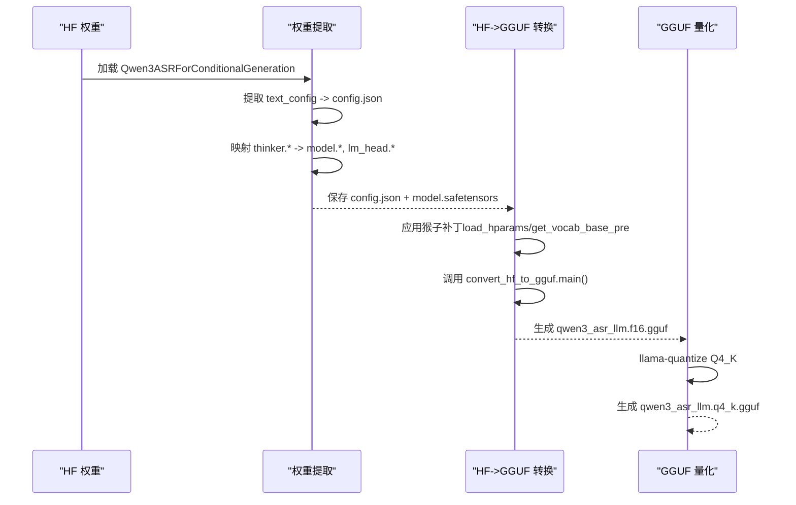
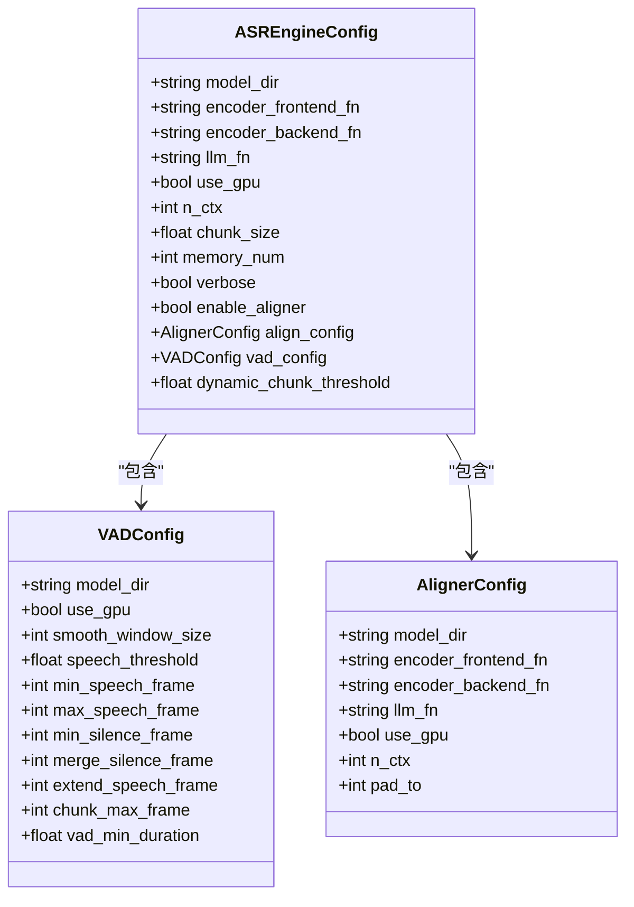
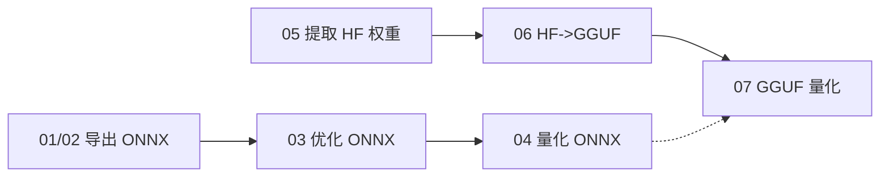

# 模型导出与转换

<cite>
**本文引用的文件**
- [export_config.py](file://export_config.py)
- [00-Export-Mel-Filters.py](file://00-Export-Mel-Filters.py)
- [01-Export-ASR-Encoder-Frontend.py](file://01-Export-ASR-Encoder-Frontend.py)
- [02-Export_ASR-Encoder-Backend.py](file://02-Export_ASR-Encoder-Backend.py)
- [03-Optimize-ASR-Encoder.py](file://03-Optimize-ASR-Encoder.py)
- [04-Quantize-ASR-Encoder.py](file://04-Quantize-ASR-Encoder.py)
- [05-Export-ASR-Decoder-HF.py](file://05-Export-ASR-Decoder-HF.py)
- [06-Convert-ASR-Decoder-GGUF.py](file://06-Convert-ASR-Decoder-GGUF.py)
- [07-Quantize-ASR-Decoder-GGUF.py](file://07-Quantize-ASR-Decoder-GGUF.py)
- [modeling_qwen3_asr_onnx.py](file://qwen_asr_gguf/export/qwen3_asr_custom/modeling_qwen3_asr_onnx.py)
- [convert_hf_to_gguf.py](file://qwen_asr_gguf/export/convert_hf_to_gguf.py)
- [asr.py](file://qwen_asr_gguf/inference/asr.py)
- [schema.py](file://qwen_asr_gguf/inference/schema.py)
- [run.sh](file://run.sh)
- [example_qwen3_asr_transformers.py](file://examples/example_qwen3_asr_transformers.py)
</cite>

## 目录
1. [简介](#简介)
2. [项目结构](#项目结构)
3. [核心组件](#核心组件)
4. [架构总览](#架构总览)
5. [详细组件分析](#详细组件分析)
6. [依赖关系分析](#依赖关系分析)
7. [性能考量](#性能考量)
8. [故障排除指南](#故障排除指南)
9. [结论](#结论)
10. [附录](#附录)

## 简介
本技术文档面向希望将 Qwen3-ASR 从 HuggingFace 原生模型完整导出并转换为 ONNX 与 GGUF 格式的工程师与研究者。文档覆盖从 Mel 滤波器导出、编码器（前端 CNN + 后端 Transformer）导出、ONNX 优化与量化（FP16、INT8、INT4）、到解码器（LLM）提取与 GGUF 转换、最终 GGUF 量化（如 Q4_K）的全流程。文档还解释了每个步骤的目的、技术原理、参数配置、量化策略与精度权衡、兼容性与格式规范、质量验证方法、故障排除与性能优化建议。

## 项目结构
该仓库采用“脚本驱动”的导出管线，按阶段组织为多个独立 Python 脚本，分别负责不同阶段的导出与转换任务。整体结构如下：

图表来源
- [export_config.py:1-12](file://export_config.py#L1-L12)
- [00-Export-Mel-Filters.py:1-46](file://00-Export-Mel-Filters.py#L1-L46)
- [01-Export-ASR-Encoder-Frontend.py:1-53](file://01-Export-ASR-Encoder-Frontend.py#L1-L53)
- [02-Export_ASR-Encoder-Backend.py:1-57](file://02-Export_ASR-Encoder-Backend.py#L1-L57)
- [03-Optimize-ASR-Encoder.py:1-70](file://03-Optimize-ASR-Encoder.py#L1-L70)
- [04-Quantize-ASR-Encoder.py:1-101](file://04-Quantize-ASR-Encoder.py#L1-L101)
- [05-Export-ASR-Decoder-HF.py:1-92](file://05-Export-ASR-Decoder-HF.py#L1-L92)
- [06-Convert-ASR-Decoder-GGUF.py:1-94](file://06-Convert-ASR-Decoder-GGUF.py#L1-L94)
- [07-Quantize-ASR-Decoder-GGUF.py:1-51](file://07-Quantize-ASR-Decoder-GGUF.py#L1-L51)

章节来源
- [export_config.py:1-12](file://export_config.py#L1-L12)

## 核心组件
- 导出配置模块：集中定义源模型路径与导出目标路径，便于统一管理。
- 编码器导出模块：分别导出前端 CNN（静态形状、原子块）与后端 Transformer（动态形状、注意力掩码）。
- ONNX 优化与量化模块：使用 ONNX Runtime Transformers 优化器进行算子融合，随后进行 FP16、INT8、INT4 量化。
- 解码器导出与转换模块：从原生模型中抽取 LLM 权重与配置，再通过转换器将 HF 模型转换为 GGUF。
- GGUF 量化模块：使用 llama.cpp 提供的量化工具对 GGUF 模型进行 INT4 等量化。
- 推理与配置模块：定义 ASR 引擎、VAD、对齐器等推理配置，支撑最终部署与性能评估。

章节来源
- [01-Export-ASR-Encoder-Frontend.py:1-53](file://01-Export-ASR-Encoder-Frontend.py#L1-L53)
- [02-Export_ASR-Encoder-Backend.py:1-57](file://02-Export_ASR-Encoder-Backend.py#L1-L57)
- [03-Optimize-ASR-Encoder.py:1-70](file://03-Optimize-ASR-Encoder.py#L1-L70)
- [04-Quantize-ASR-Encoder.py:1-101](file://04-Quantize-ASR-Encoder.py#L1-L101)
- [05-Export-ASR-Decoder-HF.py:1-92](file://05-Export-ASR-Decoder-HF.py#L1-L92)
- [06-Convert-ASR-Decoder-GGUF.py:1-94](file://06-Convert-ASR-Decoder-GGUF.py#L1-L94)
- [07-Quantize-ASR-Decoder-GGUF.py:1-51](file://07-Quantize-ASR-Decoder-GGUF.py#L1-L51)
- [asr.py:1-893](file://qwen_asr_gguf/inference/asr.py#L1-L893)
- [schema.py:1-235](file://qwen_asr_gguf/inference/schema.py#L1-L235)

## 架构总览
下图展示了从 HuggingFace 模型到 ONNX 再到 GGUF 的完整转换链路，以及量化与优化的关键节点。

图表来源
- [00-Export-Mel-Filters.py:1-46](file://00-Export-Mel-Filters.py#L1-L46)
- [01-Export-ASR-Encoder-Frontend.py:1-53](file://01-Export-ASR-Encoder-Frontend.py#L1-L53)
- [02-Export_ASR-Encoder-Backend.py:1-57](file://02-Export_ASR-Encoder-Backend.py#L1-L57)
- [03-Optimize-ASR-Encoder.py:1-70](file://03-Optimize-ASR-Encoder.py#L1-L70)
- [04-Quantize-ASR-Encoder.py:1-101](file://04-Quantize-ASR-Encoder.py#L1-L101)
- [05-Export-ASR-Decoder-HF.py:1-92](file://05-Export-ASR-Decoder-HF.py#L1-L92)
- [06-Convert-ASR-Decoder-GGUF.py:1-94](file://06-Convert-ASR-Decoder-GGUF.py#L1-L94)
- [07-Quantize-ASR-Decoder-GGUF.py:1-51](file://07-Quantize-ASR-Decoder-GGUF.py#L1-L51)
- [asr.py:1-893](file://qwen_asr_gguf/inference/asr.py#L1-L893)

## 详细组件分析

### 编码器导出（前端 CNN 与后端 Transformer）
- 目的：将 Qwen3-ASR 的音频编码器拆分为前端 CNN 与后端 Transformer 两部分，分别导出为 ONNX，便于后续优化与部署。
- 技术原理：
  - 前端 CNN：对单个 1s 音频块（128 频带、100 时间步）进行卷积与投影，输出固定长度的时间序列特征。
  - 后端 Transformer：接收前端输出的隐藏状态，结合注意力掩码进行自注意力与 FFN，输出最终编码特征。
- 参数配置与形状：
  - 前端：输入形状 [B=1, F=128, T=100]，输出形状 [B=1, T'=13, D_model]。
  - 后端：输入形状 [B=1, T, D_model]，掩码形状 [B=1, 1, T, T]，输出形状 [B=1, T, D_output]。
- 导出脚本要点：
  - 前端：静态形状、opset 19、禁用常量折叠、使用 Dynamo。
  - 后端：动态形状、opset 19、开启常量折叠、使用 Dynamo。
- 适配模块：提供 ONNX 友好的注意力实现，避免 DML 不友好操作，提升跨平台兼容性。

图表来源
- [01-Export-ASR-Encoder-Frontend.py:1-53](file://01-Export-ASR-Encoder-Frontend.py#L1-L53)
- [02-Export_ASR-Encoder-Backend.py:1-57](file://02-Export_ASR-Encoder-Backend.py#L1-L57)
- [modeling_qwen3_asr_onnx.py:1-127](file://qwen_asr_gguf/export/qwen3_asr_custom/modeling_qwen3_asr_onnx.py#L1-L127)

章节来源
- [01-Export-ASR-Encoder-Frontend.py:1-53](file://01-Export-ASR-Encoder-Frontend.py#L1-L53)
- [02-Export_ASR-Encoder-Backend.py:1-57](file://02-Export_ASR-Encoder-Backend.py#L1-L57)
- [modeling_qwen3_asr_onnx.py:1-127](file://qwen_asr_gguf/export/qwen3_asr_custom/modeling_qwen3_asr_onnx.py#L1-L127)

### ONNX 优化与量化
- 目的：通过算子融合与量化降低模型体积与推理开销，提升跨平台兼容性与运行效率。
- 技术原理：
  - 优化：使用 ONNX Runtime Transformers 优化器，基于 Bert 类型触发常见 Transformer 算子融合（Gelu、LayerNorm、Attention 等）。
  - 量化：
    - FP16：将浮点权重转换为 fp16，保留 IO 类型，屏蔽对精度敏感的算子（如 LayerNormalization）。
    - INT8：对 MatMul、Attention、Conv 等算子进行动态量化，通道级缩放。
    - INT4：使用 MatMul N-Bits Quantizer，支持对称/非对称、块大小 128。
- 参数配置与注意事项：
  - 优化级别：opt_level=1（基础融合）。
  - FP16：屏蔽 LayerNormalization 以维持数值稳定性。
  - INT8/INT4：关注权重块大小与对称性，确保与目标运行时兼容。

图表来源
- [03-Optimize-ASR-Encoder.py:1-70](file://03-Optimize-ASR-Encoder.py#L1-L70)
- [04-Quantize-ASR-Encoder.py:1-101](file://04-Quantize-ASR-Encoder.py#L1-L101)

章节来源
- [03-Optimize-ASR-Encoder.py:1-70](file://03-Optimize-ASR-Encoder.py#L1-L70)
- [04-Quantize-ASR-Encoder.py:1-101](file://04-Quantize-ASR-Encoder.py#L1-L101)

### 解码器导出与 GGUF 转换
- 目的：将 Qwen3-ASR 的 LLM（Thinker）权重与配置抽取为 HF 格式，再转换为 GGUF，以便在本地或边缘设备高效推理。
- 技术原理：
  - 权重映射：将 thinker.model.* 映射为 model.*，thinker.lm_head.* 映射为 lm_head.*，并处理嵌入权重共享。
  - 配置伪装：修改 architectures 与 model_type 以兼容下游推理框架。
  - GGUF 转换：通过转换器读取 config.json，应用猴子补丁绕过 AutoConfig 的“张冠李戴”，强制识别 qwen2 分词器基元。
- 参数配置与注意事项：
  - 猴子补丁：load_hparams 直接从 config.json 加载；get_vocab_base_pre 强制返回 qwen2。
  - 输出精度：f16（可扩展到 bf16/f32）。
  - 量化：使用 llama.cpp 的量化工具进行 Q4_K 等量化。

图表来源
- [05-Export-ASR-Decoder-HF.py:1-92](file://05-Export-ASR-Decoder-HF.py#L1-L92)
- [06-Convert-ASR-Decoder-GGUF.py:1-94](file://06-Convert-ASR-Decoder-GGUF.py#L1-L94)
- [convert_hf_to_gguf.py:1-11434](file://qwen_asr_gguf/export/convert_hf_to_gguf.py#L1-L11434)
- [07-Quantize-ASR-Decoder-GGUF.py:1-51](file://07-Quantize-ASR-Decoder-GGUF.py#L1-L51)

章节来源
- [05-Export-ASR-Decoder-HF.py:1-92](file://05-Export-ASR-Decoder-HF.py#L1-L92)
- [06-Convert-ASR-Decoder-GGUF.py:1-94](file://06-Convert-ASR-Decoder-GGUF.py#L1-L94)
- [convert_hf_to_gguf.py:1-11434](file://qwen_asr_gguf/export/convert_hf_to_gguf.py#L1-L11434)
- [07-Quantize-ASR-Decoder-GGUF.py:1-51](file://07-Quantize-ASR-Decoder-GGUF.py#L1-L51)

### 推理与部署（ASR 引擎、VAD、对齐器）
- 目的：在本地或边缘设备上以高性能运行导出的编码器与解码器，支持流式与批量推理、VAD 前置过滤、可选对齐器。
- 关键特性：
  - 动态分片：长音频自动启用 VAD，按语音边界构建分片，避免静音段推理。
  - 记忆窗口：保留前 N 片文本作为上下文，避免非连续音频拼接导致的模型混乱。
  - 抗幻觉：token 级与短语级重复熔断、按语音时长缩放 max_new_tokens。
- 配置要点：
  - ASR 引擎：n_ctx、chunk_size、memory_num、dynamic_chunk_threshold、vad_config。
  - 对齐器：可选启用，独立的前端/后端与 LLM 模型文件名。
  - VAD：平滑窗口、阈值、最短/最长语音段、静音合并与边界扩展等参数。

图表来源
- [schema.py:162-235](file://qwen_asr_gguf/inference/schema.py#L162-L235)

章节来源
- [asr.py:1-893](file://qwen_asr_gguf/inference/asr.py#L1-L893)
- [schema.py:1-235](file://qwen_asr_gguf/inference/schema.py#L1-L235)

## 依赖关系分析
- 脚本间依赖：导出管线按顺序执行，前一步产物为下一步输入；例如前端/后端 ONNX 是优化与量化的输入，HF 权重是 GGUF 转换的输入。
- 外部依赖：
  - ONNX Runtime Transformers：用于算子融合与 FP16 转换。
  - ONNX Runtime Quantization：用于 INT8/INT4 量化。
  - llama.cpp 工具链：用于 GGUF 量化。
  - Transformers 与 Safetensors：用于 HF 权重提取与保存。
- 潜在耦合与风险：
  - 猴子补丁依赖于转换器内部函数签名，升级转换器可能导致补丁失效。
  - ONNX 优化与量化对算子图敏感，模型结构变化需同步更新导出脚本。

图表来源
- [01-Export-ASR-Encoder-Frontend.py:1-53](file://01-Export-ASR-Encoder-Frontend.py#L1-L53)
- [02-Export_ASR-Encoder-Backend.py:1-57](file://02-Export_ASR-Encoder-Backend.py#L1-L57)
- [03-Optimize-ASR-Encoder.py:1-70](file://03-Optimize-ASR-Encoder.py#L1-L70)
- [04-Quantize-ASR-Encoder.py:1-101](file://04-Quantize-ASR-Encoder.py#L1-L101)
- [05-Export-ASR-Decoder-HF.py:1-92](file://05-Export-ASR-Decoder-HF.py#L1-L92)
- [06-Convert-ASR-Decoder-GGUF.py:1-94](file://06-Convert-ASR-Decoder-GGUF.py#L1-L94)
- [07-Quantize-ASR-Decoder-GGUF.py:1-51](file://07-Quantize-ASR-Decoder-GGUF.py#L1-L51)

## 性能考量
- 编码器：
  - 前端 CNN 采用静态形状，有利于固定硬件加速与内存布局；后端 Transformer 使用动态形状，兼顾灵活性。
  - 优化器融合常见算子，减少图节点数量与内存访问。
  - 量化（FP16/INT8/INT4）显著降低内存占用与带宽压力，提升吞吐。
- 解码器：
  - GGUF 格式更适合本地推理，量化（Q4_K）进一步降低显存与系统内存占用。
  - 推理引擎通过 VAD 跳过静音段、记忆窗口控制上下文长度、抗幻觉机制，有效提升 RTF 与稳定性。
- 实践建议：
  - 在 GPU 上优先使用 FP16；在资源受限设备上使用 INT4/Q4_K。
  - 合理设置 n_ctx 与 chunk_size，避免越界与过度缓存。
  - 启用 VAD 并根据场景调整阈值与窗口参数。

[本节为通用指导，无需列出具体文件来源]

## 故障排除指南
- 常见问题与对策：
  - 找不到模型或权重文件：确认 export_config.py 中路径正确，且模型已下载到指定目录。
  - ONNX 导出失败：检查 opset 版本与 do_constant_folding 设置；确保输入 dummy tensor 形状与脚本一致。
  - 优化器报错：确认模型类型与 opt_level 设置；必要时降低融合强度或禁用特定算子融合。
  - FP16 转换失败：屏蔽对精度敏感算子（如 LayerNormalization），调整 min_positive_val/max_finite_val。
  - INT8/INT4 量化失败：检查算子支持列表与块大小；确保权重维度满足量化要求。
  - HF->GGUF 转换失败：确认 config.json 存在；应用猴子补丁后重新运行转换脚本。
  - GGUF 量化失败：确认量化工具存在且可执行；检查输入 GGUF 文件完整性。
  - 推理崩溃或越界：检查 n_ctx 与输入序列长度，避免超过上下文窗口。
- 日志与调试：
  - 使用 verbose 输出查看各阶段日志。
  - 使用 run.sh 启动服务，查看 logs/app.log 获取运行期错误。
  - 示例脚本可帮助快速验证模型加载与推理流程。

章节来源
- [03-Optimize-ASR-Encoder.py:1-70](file://03-Optimize-ASR-Encoder.py#L1-L70)
- [04-Quantize-ASR-Encoder.py:1-101](file://04-Quantize-ASR-Encoder.py#L1-L101)
- [06-Convert-ASR-Decoder-GGUF.py:1-94](file://06-Convert-ASR-Decoder-GGUF.py#L1-L94)
- [07-Quantize-ASR-Decoder-GGUF.py:1-51](file://07-Quantize-ASR-Decoder-GGUF.py#L1-L51)
- [run.sh:1-63](file://run.sh#L1-L63)
- [example_qwen3_asr_transformers.py:1-151](file://examples/example_qwen3_asr_transformers.py#L1-L151)

## 结论
本导出与转换流程将 Qwen3-ASR 的编码器与解码器完整地从 HuggingFace 原生格式迁移到 ONNX 与 GGUF，配合优化与量化策略，实现了在本地与边缘设备上的高效部署。通过分阶段的脚本化流程、清晰的参数配置与完善的故障排除指南，用户可以在保证精度的前提下灵活选择量化方案与部署形态。

[本节为总结性内容，无需列出具体文件来源]

## 附录

### 手动导出与转换流程指南
- 步骤清单：
  1) 配置路径：编辑 export_config.py，设置 ASR_MODEL_DIR 与 EXPORT_DIR。
  2) 导出 Mel 滤波器：运行 00-Export-Mel-Filters.py。
  3) 导出编码器：
     - 前端：运行 01-Export-ASR-Encoder-Frontend.py。
     - 后端：运行 02-Export_ASR-Encoder-Backend.py。
  4) 优化与量化：
     - 优化：运行 03-Optimize-ASR-Encoder.py。
     - 量化：运行 04-Quantize-ASR-Encoder.py（FP16/INT8/INT4）。
  5) 导出解码器（HF）：运行 05-Export-ASR-Decoder-HF.py。
  6) HF->GGUF：运行 06-Convert-ASR-Decoder-GGUF.py（应用猴子补丁）。
  7) GGUF 量化：运行 07-Quantize-ASR-Decoder-GGUF.py（Q4_K）。
- 参数调整建议：
  - ONNX 导出：根据目标硬件选择 opset 与 do_constant_folding。
  - 量化：优先 FP16，再按资源选择 INT8/INT4；注意屏蔽对精度敏感算子。
  - GGUF：根据推理设备选择 f16 或 bf16；最终使用 Q4_K 以降低内存占用。
- 质量验证方法：
  - 编码器：对比前端/后端 ONNX 输出与原模型输出的范数差异。
  - 解码器：比较 HF 与 GGUF 推理输出的相似度与生成稳定性。
  - 推理：使用 run.sh 启动服务，结合示例脚本验证端到端性能与 RTF。

章节来源
- [export_config.py:1-12](file://export_config.py#L1-L12)
- [00-Export-Mel-Filters.py:1-46](file://00-Export-Mel-Filters.py#L1-L46)
- [01-Export-ASR-Encoder-Frontend.py:1-53](file://01-Export-ASR-Encoder-Frontend.py#L1-L53)
- [02-Export_ASR-Encoder-Backend.py:1-57](file://02-Export_ASR-Encoder-Backend.py#L1-L57)
- [03-Optimize-ASR-Encoder.py:1-70](file://03-Optimize-ASR-Encoder.py#L1-L70)
- [04-Quantize-ASR-Encoder.py:1-101](file://04-Quantize-ASR-Encoder.py#L1-L101)
- [05-Export-ASR-Decoder-HF.py:1-92](file://05-Export-ASR-Decoder-HF.py#L1-L92)
- [06-Convert-ASR-Decoder-GGUF.py:1-94](file://06-Convert-ASR-Decoder-GGUF.py#L1-L94)
- [07-Quantize-ASR-Decoder-GGUF.py:1-51](file://07-Quantize-ASR-Decoder-GGUF.py#L1-L51)
- [run.sh:1-63](file://run.sh#L1-L63)
- [example_qwen3_asr_transformers.py:1-151](file://examples/example_qwen3_asr_transformers.py#L1-L151)