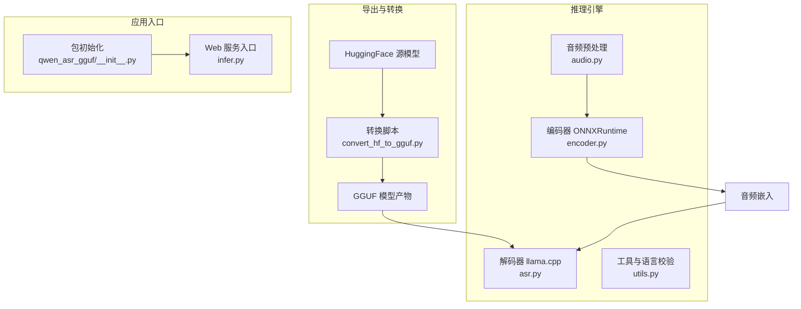
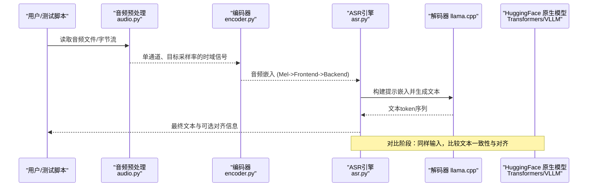
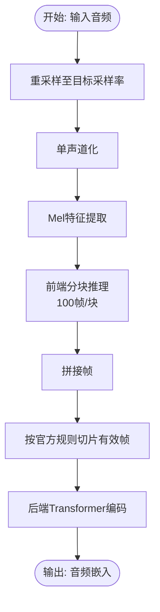
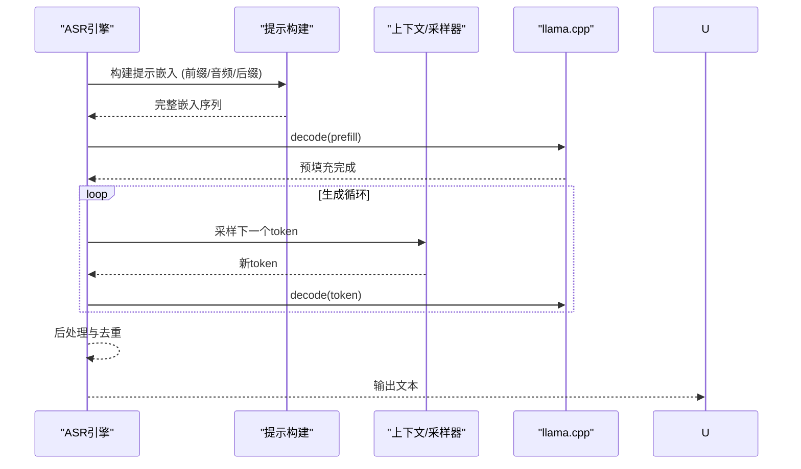
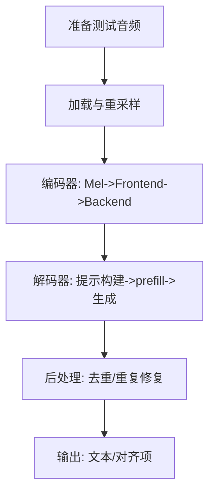
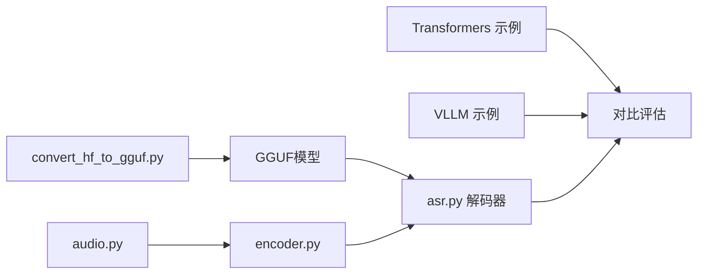

# 模型验证与测试

<cite>
**本文引用的文件**
- [export_config.py](file://export_config.py)
- [infer.py](file://infer.py)
- [qwen_asr_gguf/__init__.py](file://qwen_asr_gguf/__init__.py)
- [qwen_asr/__init__.py](file://qwen_asr/__init__.py)
- [qwen_asr_gguf/inference/asr.py](file://qwen_asr_gguf/inference/asr.py)
- [qwen_asr_gguf/inference/encoder.py](file://qwen_asr_gguf/inference/encoder.py)
- [qwen_asr_gguf/inference/audio.py](file://qwen_asr_gguf/inference/audio.py)
- [qwen_asr_gguf/inference/utils.py](file://qwen_asr_gguf/inference/utils.py)
- [examples/example_qwen3_asr_transformers.py](file://examples/example_qwen3_asr_transformers.py)
- [examples/example_qwen3_asr_vllm.py](file://examples/example_qwen3_asr_vllm.py)
- [qwen_asr_gguf/export/convert_hf_to_gguf.py](file://qwen_asr_gguf/export/convert_hf_to_gguf.py)
- [pyproject.toml](file://pyproject.toml)
</cite>

## 目录
1. [简介](#简介)
2. [项目结构](#项目结构)
3. [核心组件](#核心组件)
4. [架构总览](#架构总览)
5. [详细组件分析](#详细组件分析)
6. [依赖分析](#依赖分析)
7. [性能考虑](#性能考虑)
8. [故障排查指南](#故障排查指南)
9. [结论](#结论)
10. [附录](#附录)

## 简介
本指南面向Qwen3-ASR导出模型的验证与测试，覆盖以下关键目标：
- 验证导出模型的正确性与完整性（编码器/解码器端到端）
- 音频特征一致性测试（Mel频谱图对比、时域信号重建验证）
- 精度评估与与HuggingFace原生模型对比
- 性能基准测试（延迟、吞吐量）
- 自动化测试脚本与持续集成配置建议
- 常见验证失败原因与修复方案（形状不匹配、数值精度问题等）

## 项目结构
该项目采用“导出转换 + 推理引擎 + 示例与验证”的分层组织：
- 导出与转换：将HuggingFace模型转换为GGUF格式，便于本地部署与推理
- 推理引擎：ONNXRuntime编码器 + llama.cpp解码器的混合推理管线
- 示例与验证：提供与Transformers/VLLM后端的对比示例，便于回归与精度评估

图表来源
- [qwen_asr_gguf/export/convert_hf_to_gguf.py](file://qwen_asr_gguf/export/convert_hf_to_gguf.py)
- [qwen_asr_gguf/inference/encoder.py](file://qwen_asr_gguf/inference/encoder.py)
- [qwen_asr_gguf/inference/asr.py](file://qwen_asr_gguf/inference/asr.py)
- [qwen_asr_gguf/inference/audio.py](file://qwen_asr_gguf/inference/audio.py)
- [qwen_asr_gguf/inference/utils.py](file://qwen_asr_gguf/inference/utils.py)
- [infer.py](file://infer.py)
- [qwen_asr_gguf/__init__.py](file://qwen_asr_gguf/__init__.py)

章节来源
- [export_config.py](file://export_config.py)
- [pyproject.toml](file://pyproject.toml)

## 核心组件
- 导出配置与路径：集中管理源模型与导出目标路径，便于统一验证
- 推理引擎：封装编码器（ONNXRuntime）、解码器（llama.cpp）、VAD、对齐器与提示构建
- 编码器：Mel特征提取与前后端拆分推理，支持动态/固定分片
- 音频预处理：统一加载与重采样，兼容多种格式
- 工具与语言校验：语言标准化、重复文本修复
- 示例与对比：Transformers/VLLM后端示例，便于与原生模型对比

章节来源
- [export_config.py](file://export_config.py)
- [qwen_asr_gguf/inference/asr.py](file://qwen_asr_gguf/inference/asr.py)
- [qwen_asr_gguf/inference/encoder.py](file://qwen_asr_gguf/inference/encoder.py)
- [qwen_asr_gguf/inference/audio.py](file://qwen_asr_gguf/inference/audio.py)
- [qwen_asr_gguf/inference/utils.py](file://qwen_asr_gguf/inference/utils.py)
- [examples/example_qwen3_asr_transformers.py](file://examples/example_qwen3_asr_transformers.py)
- [examples/example_qwen3_asr_vllm.py](file://examples/example_qwen3_asr_vllm.py)

## 架构总览
下图展示从音频输入到文本输出的完整端到端流程，以及与HuggingFace原生模型的对比位置。

图表来源
- [qwen_asr_gguf/inference/audio.py](file://qwen_asr_gguf/inference/audio.py)
- [qwen_asr_gguf/inference/encoder.py](file://qwen_asr_gguf/inference/encoder.py)
- [qwen_asr_gguf/inference/asr.py](file://qwen_asr_gguf/inference/asr.py)
- [examples/example_qwen3_asr_transformers.py](file://examples/example_qwen3_asr_transformers.py)
- [examples/example_qwen3_asr_vllm.py](file://examples/example_qwen3_asr_vllm.py)

## 详细组件分析

### 编码器验证（ONNXRuntime）
- 功能要点
  - Mel特征提取：纯NumPy实现，避免外部依赖启动开销
  - 前端（Frontend）：按100帧分块推理，拼接后按官方规则切片有效帧
  - 后端（Backend）：Transformer编码，支持固定形状掩码（DirectML场景）
  - 动态/固定分片：根据配置选择动态形状或固定长度Padding
- 验证建议
  - 形状一致性：确认输出嵌入维度与期望一致（时间步×隐藏维）
  - 数值稳定性：对比不同Provider（CPU/GPU/DirectML）下的数值差异
  - 与Mel滤波器一致性：导出滤波器矩阵并与librosa/torchaudio行为对齐

图表来源
- [qwen_asr_gguf/inference/encoder.py](file://qwen_asr_gguf/inference/encoder.py)

章节来源
- [qwen_asr_gguf/inference/encoder.py](file://qwen_asr_gguf/inference/encoder.py)

### 解码器验证（llama.cpp）
- 功能要点
  - 提示构建：严格遵循官方Chat Template，拼接system/user/audio/assistant片段
  - 预填充与生成：prefill阶段解码，随后采样生成，支持温度与回滚策略
  - 抗幻觉机制：token级/短语级重复熔断、max_new_tokens上限、上下文窗口保护
  - 性能统计：RTF、预填充速度、生成速度等
- 验证建议
  - 提示构建一致性：确保特殊token与分隔符与官方模板一致
  - 采样一致性：相同温度与随机种子下的token序列应可复现
  - 性能指标：记录prefill与generate耗时，评估RTF

图表来源
- [qwen_asr_gguf/inference/asr.py](file://qwen_asr_gguf/inference/asr.py)

章节来源
- [qwen_asr_gguf/inference/asr.py](file://qwen_asr_gguf/inference/asr.py)

### 音频特征一致性测试
- Mel频谱图对比
  - 使用导出的Mel滤波器与编码器的FastWhisperMel实现进行对比
  - 对比范围：能量谱、对数幅度、归一化区间
- 时域信号重建验证
  - 通过反向STFT（或等价流程）验证编码器输入与输出的时域一致性
  - 关注点：窗函数、重叠、裁剪与填充策略
- 工具与脚本
  - 可参考项目中音频加载与重采样实现，确保测试样本一致

章节来源
- [qwen_asr_gguf/inference/encoder.py](file://qwen_asr_gguf/inference/encoder.py)
- [qwen_asr_gguf/inference/audio.py](file://qwen_asr_gguf/inference/audio.py)

### 端到端测试流程（编码器+解码器）
- 输入音频文件
  - 使用统一加载器读取并重采样
- 中间特征提取
  - 编码器输出音频嵌入，记录耗时与形状
- 最终文本输出
  - 解码器生成文本，记录RTF与生成速度
- 对齐与后处理
  - 可选对齐器输出时间戳，后处理去重与重复修复

图表来源
- [qwen_asr_gguf/inference/audio.py](file://qwen_asr_gguf/inference/audio.py)
- [qwen_asr_gguf/inference/encoder.py](file://qwen_asr_gguf/inference/encoder.py)
- [qwen_asr_gguf/inference/asr.py](file://qwen_asr_gguf/inference/asr.py)

章节来源
- [qwen_asr_gguf/inference/audio.py](file://qwen_asr_gguf/inference/audio.py)
- [qwen_asr_gguf/inference/encoder.py](file://qwen_asr_gguf/inference/encoder.py)
- [qwen_asr_gguf/inference/asr.py](file://qwen_asr_gguf/inference/asr.py)

### 与HuggingFace原生模型的对比
- Transformers后端
  - 使用示例脚本加载原生模型，执行相同输入与参数，记录文本与时间戳
- vLLM后端
  - 使用vLLM示例脚本，对比生成文本的一致性
- 对比维度
  - 文本相似度（编辑距离、BLEU/ROUGE近似）
  - 时间戳一致性（对齐误差）
  - 性能指标（RTF、吞吐量）

章节来源
- [examples/example_qwen3_asr_transformers.py](file://examples/example_qwen3_asr_transformers.py)
- [examples/example_qwen3_asr_vllm.py](file://examples/example_qwen3_asr_vllm.py)

### 性能基准测试
- 延迟与吞吐量
  - 延迟：单次推理耗时、首token延迟、平均token生成耗时
  - 吞吐量：单位时间内处理的音频时长（RTF）
- 基准工具与方法
  - 使用推理引擎内置统计打印，或在测试脚本中记录关键节点时间
  - 可参考项目中llama.cpp相关基准工具与脚本思路（如比较工具链）

章节来源
- [qwen_asr_gguf/inference/asr.py](file://qwen_asr_gguf/inference/asr.py)

### 自动化测试与CI配置
- 依赖与环境
  - 通过项目依赖声明与可选后端（CPU/GPU/DirectML）控制
- CI建议
  - 分阶段任务：单元测试（编码器/解码器）、端到端（音频→文本）、对比测试（HF vs GGUF）
  - 资源隔离：GPU/CPU/DML分别测试，记录RTF与数值差异
  - 结果归档：日志、性能指标、对比报告

章节来源
- [pyproject.toml](file://pyproject.toml)

## 依赖分析
- 导出转换
  - 依赖gguf、transformers、numpy等，负责权重映射与元数据写入
- 推理引擎
  - ONNXRuntime（CPU/GPU/DML）+ llama.cpp（解码器）
  - 音频处理依赖soundfile/ffmpeg
- 示例与对比
  - Transformers/VLLM示例脚本用于精度对比

图表来源
- [qwen_asr_gguf/export/convert_hf_to_gguf.py](file://qwen_asr_gguf/export/convert_hf_to_gguf.py)
- [qwen_asr_gguf/inference/asr.py](file://qwen_asr_gguf/inference/asr.py)
- [qwen_asr_gguf/inference/encoder.py](file://qwen_asr_gguf/inference/encoder.py)
- [qwen_asr_gguf/inference/audio.py](file://qwen_asr_gguf/inference/audio.py)
- [examples/example_qwen3_asr_transformers.py](file://examples/example_qwen3_asr_transformers.py)
- [examples/example_qwen3_asr_vllm.py](file://examples/example_qwen3_asr_vllm.py)

章节来源
- [qwen_asr_gguf/export/convert_hf_to_gguf.py](file://qwen_asr_gguf/export/convert_hf_to_gguf.py)
- [pyproject.toml](file://pyproject.toml)

## 性能考虑
- 编码器
  - Provider选择：GPU优先，DML需固定形状Padding
  - 动态分片：长音频按VAD自适应分片，减少无效计算
- 解码器
  - 上下文窗口保护：避免越界导致崩溃
  - 抗幻觉策略：重复熔断、max_new_tokens上限、温度重试
- 性能指标
  - RTF、预填充速度、生成速度、VAD过滤效率

章节来源
- [qwen_asr_gguf/inference/asr.py](file://qwen_asr_gguf/inference/asr.py)
- [qwen_asr_gguf/inference/encoder.py](file://qwen_asr_gguf/inference/encoder.py)

## 故障排查指南
- 张量形状不匹配
  - 编码器：确认Mel帧数与100对齐、有效帧切片逻辑
  - 解码器：检查提示构建中各片段长度与嵌入表维度
- 数值精度丢失
  - ONNXRuntime Provider差异（CPU/FPGA/DML）可能导致微小差异
  - 建议：固定随机种子、相同dtype与量化设置
- 上下文越界
  - 解码器对n_ctx有保护，超限时会熔断并返回空结果
- 语言与对齐
  - 语言名称需标准化，不支持的语言会报错
  - 对齐器输出需检查时间戳有效性

章节来源
- [qwen_asr_gguf/inference/encoder.py](file://qwen_asr_gguf/inference/encoder.py)
- [qwen_asr_gguf/inference/asr.py](file://qwen_asr_gguf/inference/asr.py)
- [qwen_asr_gguf/inference/utils.py](file://qwen_asr_gguf/inference/utils.py)

## 结论
通过上述验证与测试流程，可以系统性地保证Qwen3-ASR导出模型在功能、精度与性能上的正确性与稳定性。建议在持续集成中纳入端到端测试与与原生模型的对比，以确保回归可控。

## 附录
- Web服务入口与生命周期管理
  - 服务启动时初始化ASR引擎，关闭时优雅释放资源
- 包初始化与日志
  - 默认日志配置与根日志器设置，便于定位问题

章节来源
- [infer.py](file://infer.py)
- [qwen_asr_gguf/__init__.py](file://qwen_asr_gguf/__init__.py)