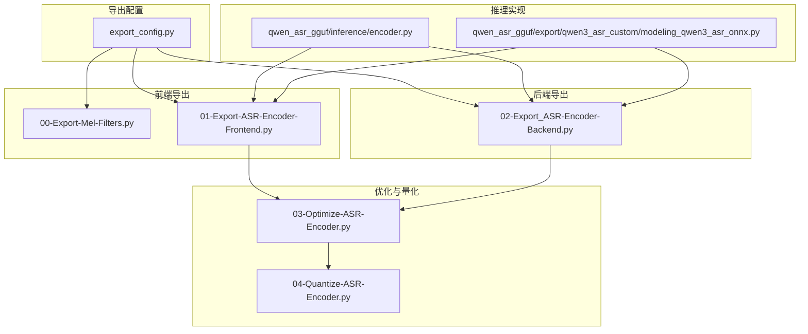
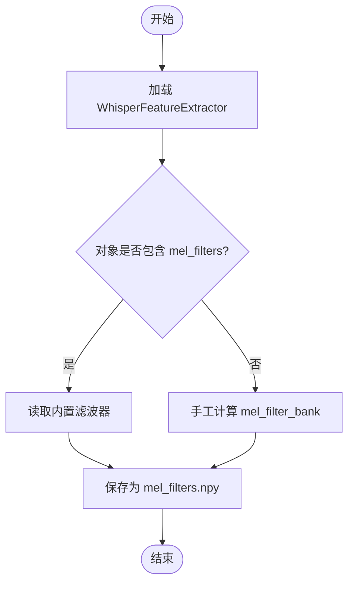
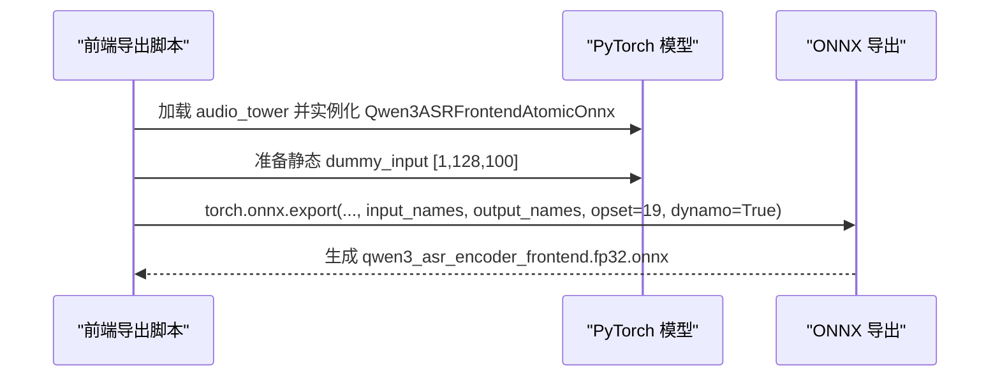
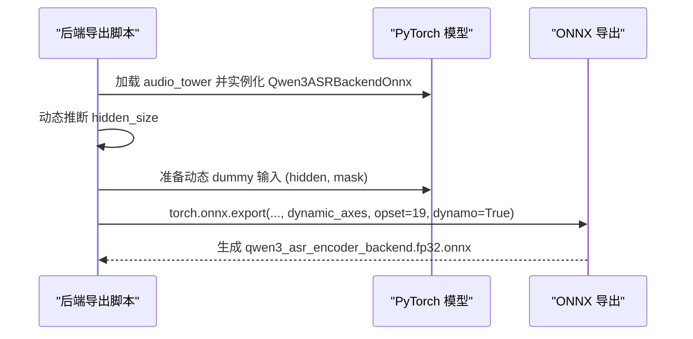
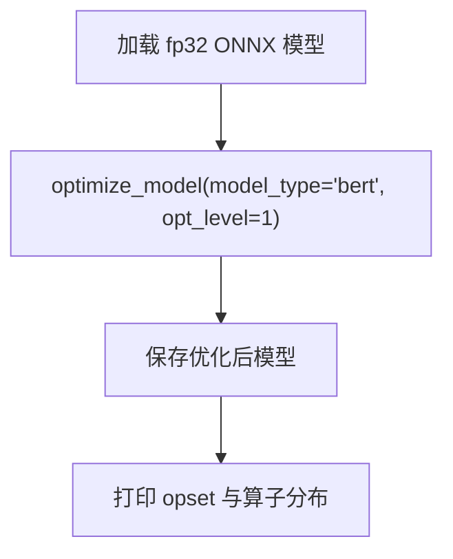
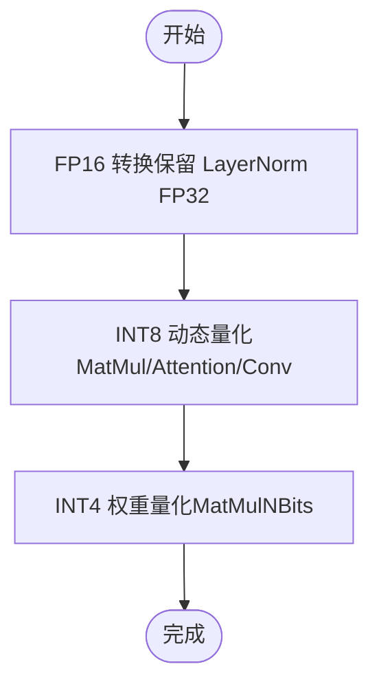
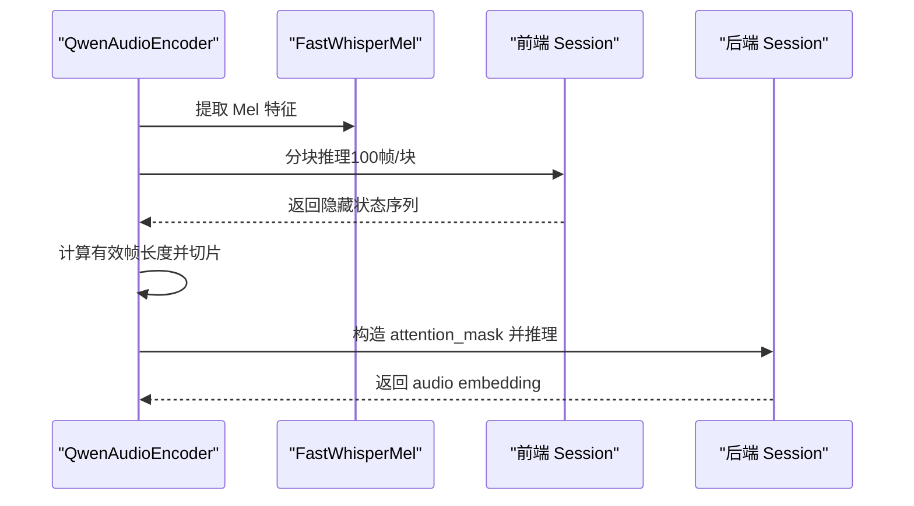
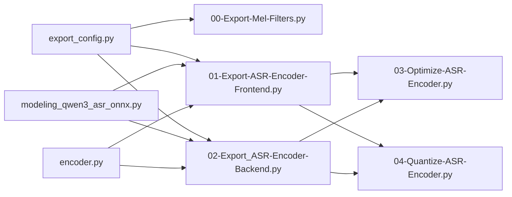

# 编码器导出流程

<cite>
**本文引用的文件**   
- [00-Export-Mel-Filters.py](file://00-Export-Mel-Filters.py)
- [01-Export-ASR-Encoder-Frontend.py](file://01-Export-ASR-Encoder-Frontend.py)
- [02-Export_ASR-Encoder-Backend.py](file://02-Export_ASR-Encoder-Backend.py)
- [03-Optimize-ASR-Encoder.py](file://03-Optimize-ASR-Encoder.py)
- [04-Quantize-ASR-Encoder.py](file://04-Quantize-ASR-Encoder.py)
- [export_config.py](file://export_config.py)
- [encoder.py](file://qwen_asr_gguf/inference/encoder.py)
- [modeling_qwen3_asr_onnx.py](file://qwen_asr_gguf/export/qwen3_asr_custom/modeling_qwen3_asr_onnx.py)
</cite>

## 目录
1. [简介](#简介)
2. [项目结构](#项目结构)
3. [核心组件](#核心组件)
4. [架构总览](#架构总览)
5. [详细组件分析](#详细组件分析)
6. [依赖分析](#依赖分析)
7. [性能考虑](#性能考虑)
8. [故障排查指南](#故障排查指南)
9. [结论](#结论)
10. [附录](#附录)

## 简介
本文件系统化梳理 Qwen3-ASR 编码器导出流程，覆盖前端 CNN 特征提取器与后端 Transformer 编码器的 ONNX 导出、图优化与量化策略。重点说明：
- Mel 滤波器导出（00-Export-Mel-Filters.py）：WhisperFeatureExtractor 的使用与 mel_filters 计算方法
- 前端 CNN 导出（01-Export-ASR-Encoder-Frontend.py）：ONNX 转换、输入输出节点与张量形状处理
- 后端 Transformer 导出（02-Export_ASR-Encoder-Backend.py）：动态批次与注意力掩码
- 图优化（03-Optimize-ASR-Encoder.py）：常量融合、算子折叠与图优化
- 量化（04-Quantize-ASR-Encoder.py）：FP16、INT8、INT4 等策略与参数配置
- 提供完整命令行执行示例与参数说明

## 项目结构
导出流程由一组独立脚本组成，配合导出配置与推理侧实现共同完成：
- 导出配置 export_config.py：定义源模型路径与导出目录
- Mel 滤波器导出：00-Export-Mel-Filters.py
- 前端 CNN 导出：01-Export-ASR-Encoder-Frontend.py
- 后端 Transformer 导出：02-Export_ASR-Encoder-Backend.py
- 图优化：03-Optimize-ASR-Encoder.py
- 量化：04-Quantize-ASR-Encoder.py
- 推理侧实现 encoder.py：ONNX 推理、Chunk 推理与掩码构造
- ONNX 包装模块 modeling_qwen3_asr_onnx.py：前后端 ONNX 封装类



图表来源
- [export_config.py:1-12](file://export_config.py#L1-L12)
- [00-Export-Mel-Filters.py:1-46](file://00-Export-Mel-Filters.py#L1-L46)
- [01-Export-ASR-Encoder-Frontend.py:1-53](file://01-Export-ASR-Encoder-Frontend.py#L1-L53)
- [02-Export_ASR-Encoder-Backend.py:1-57](file://02-Export_ASR-Encoder-Backend.py#L1-L57)
- [03-Optimize-ASR-Encoder.py:1-70](file://03-Optimize-ASR-Encoder.py#L1-L70)
- [04-Quantize-ASR-Encoder.py:1-101](file://04-Quantize-ASR-Encoder.py#L1-L101)
- [encoder.py:1-280](file://qwen_asr_gguf/inference/encoder.py#L1-L280)
- [modeling_qwen3_asr_onnx.py:87-126](file://qwen_asr_gguf/export/qwen3_asr_custom/modeling_qwen3_asr_onnx.py#L87-L126)

章节来源
- [export_config.py:1-12](file://export_config.py#L1-L12)
- [00-Export-Mel-Filters.py:1-46](file://00-Export-Mel-Filters.py#L1-L46)
- [01-Export-ASR-Encoder-Frontend.py:1-53](file://01-Export-ASR-Encoder-Frontend.py#L1-L53)
- [02-Export_ASR-Encoder-Backend.py:1-57](file://02-Export_ASR-Encoder-Backend.py#L1-L57)
- [03-Optimize-ASR-Encoder.py:1-70](file://03-Optimize-ASR-Encoder.py#L1-L70)
- [04-Quantize-ASR-Encoder.py:1-101](file://04-Quantize-ASR-Encoder.py#L1-L101)
- [encoder.py:1-280](file://qwen_asr_gguf/inference/encoder.py#L1-L280)
- [modeling_qwen3_asr_onnx.py:87-126](file://qwen_asr_gguf/export/qwen3_asr_custom/modeling_qwen3_asr_onnx.py#L87-L126)

## 核心组件
- 导出配置 export_config.py：统一管理 ASR 源模型路径与导出目录，便于跨脚本共享
- 前端 CNN ONNX 封装：Qwen3ASRFrontendAtomicOnnx，封装音频塔前端 CNN 子模块，支持静态形状推理
- 后端 Transformer ONNX 封装：Qwen3ASRBackendOnnx，封装多层自注意力与 FFN，支持动态形状与注意力掩码
- 推理侧 Split 编码器：QwenAudioEncoder，负责 Mel 提取、Chunk 推理、掩码构造与后端推理

章节来源
- [export_config.py:1-12](file://export_config.py#L1-L12)
- [modeling_qwen3_asr_onnx.py:87-126](file://qwen_asr_gguf/export/qwen3_asr_custom/modeling_qwen3_asr_onnx.py#L87-L126)
- [encoder.py:119-280](file://qwen_asr_gguf/inference/encoder.py#L119-L280)

## 架构总览
导出流程分为“特征准备 → 前端导出 → 后端导出 → 图优化 → 量化”五步，最终产出 fp32/fp16/int8/int4 的 ONNX 模型。

```mermaid
sequenceDiagram
participant U as "用户"
participant MEL as "Mel 导出脚本"
participant FE as "前端导出脚本"
participant BE as "后端导出脚本"
participant OPT as "图优化脚本"
participant Q as "量化脚本"
U->>MEL : 执行 Mel 滤波器导出
MEL-->>U : 生成 mel_filters.npy
U->>FE : 执行前端 CNN 导出
FE-->>U : 生成 qwen3_asr_encoder_frontend.fp32.onnx
U->>BE : 执行后端 Transformer 导出
BE-->>U : 生成 qwen3_asr_encoder_backend.fp32.onnx
U->>OPT : 执行图优化
OPT-->>U : 生成优化后的 fp32 模型
U->>Q : 执行量化FP16/INT8/INT4
Q-->>U : 生成 fp16/int8/int4 模型
```

图表来源
- [00-Export-Mel-Filters.py:11-46](file://00-Export-Mel-Filters.py#L11-L46)
- [01-Export-ASR-Encoder-Frontend.py:15-53](file://01-Export-ASR-Encoder-Frontend.py#L15-L53)
- [02-Export_ASR-Encoder-Backend.py:14-57](file://02-Export_ASR-Encoder-Backend.py#L14-L57)
- [03-Optimize-ASR-Encoder.py:8-70](file://03-Optimize-ASR-Encoder.py#L8-L70)
- [04-Quantize-ASR-Encoder.py:65-101](file://04-Quantize-ASR-Encoder.py#L65-L101)

## 详细组件分析

### 组件A：Mel 滤波器导出（00-Export-Mel-Filters.py）
- 技术原理
  - 使用 WhisperFeatureExtractor.from_pretrained 加载特征提取器
  - 优先读取对象内置 mel_filters；若不存在则调用 transformers.models.whisper.feature_extraction_whisper.mel_filter_bank 手工计算
  - 参数遵循 Qwen3-ASR 标准：采样率 16kHz、FFT 频 bins 400、Mel 维度 128、频率上限 8000Hz、mel_scale="slaney"
- 输出
  - 保存为 numpy 数组，文件名 mel_filters.npy，供前端 Mel 提取器使用



图表来源
- [00-Export-Mel-Filters.py:11-46](file://00-Export-Mel-Filters.py#L11-L46)

章节来源
- [00-Export-Mel-Filters.py:11-46](file://00-Export-Mel-Filters.py#L11-L46)

### 组件B：前端 CNN 导出（01-Export-ASR-Encoder-Frontend.py）
- ONNX 转换要点
  - 从官方模型加载 audio_tower，构建 Qwen3ASRFrontendAtomicOnnx
  - 固定输入张量形状：[Batch=1, Freq=128, Time=100]，对应单个 1 秒、100 帧的 Mel 片段
  - 输入输出命名：input_names=["chunk_mel"]，output_names=["chunk_out"]
  - opset_version=19，do_constant_folding=False，dynamo=True
- 推理形态
  - 前端采用“分块（Chunk）+ 循环推理”的方式，每 100 帧为一块，逐块推理后拼接，再按规则切片去除填充帧



图表来源
- [01-Export-ASR-Encoder-Frontend.py:15-53](file://01-Export-ASR-Encoder-Frontend.py#L15-L53)
- [modeling_qwen3_asr_onnx.py:117-126](file://qwen_asr_gguf/export/qwen3_asr_custom/modeling_qwen3_asr_onnx.py#L117-L126)

章节来源
- [01-Export-ASR-Encoder-Frontend.py:15-53](file://01-Export-ASR-Encoder-Frontend.py#L15-L53)
- [modeling_qwen3_asr_onnx.py:117-126](file://qwen_asr_gguf/export/qwen3_asr_custom/modeling_qwen3_asr_onnx.py#L117-L126)

### 组件C：后端 Transformer 导出（02-Export_ASR-Encoder-Backend.py）
- 动态形状与注意力掩码
  - 动态隐藏维度：通过 audio_tower.conv_out.out_features 获取 hidden_size
  - 动态轴定义：hidden_states 的 batch 与 time 维度可变；attention_mask 为 4D，支持 [batch, 1, time_q, time_k]
  - dummy 输入：(dummy_hidden, dummy_mask)，其中 dummy_hidden=[1, seq_len, hidden_size]，dummy_mask=[1, 1, seq_len, seq_len]
- ONNX 导出
  - input_names=["hidden_states", "attention_mask"]，output_names=["last_hidden_state"]
  - opset_version=19，do_constant_folding=True，dynamo=True



图表来源
- [02-Export_ASR-Encoder-Backend.py:14-57](file://02-Export_ASR-Encoder-Backend.py#L14-L57)
- [modeling_qwen3_asr_onnx.py:87-115](file://qwen_asr_gguf/export/qwen3_asr_custom/modeling_qwen3_asr_onnx.py#L87-L115)

章节来源
- [02-Export_ASR-Encoder-Backend.py:14-57](file://02-Export_ASR-Encoder-Backend.py#L14-L57)
- [modeling_qwen3_asr_onnx.py:87-115](file://qwen_asr_gguf/export/qwen3_asr_custom/modeling_qwen3_asr_onnx.py#L87-L115)

### 组件D：图优化（03-Optimize-ASR-Encoder.py）
- 优化器选择与参数
  - 使用 onnxruntime.transformers.optimizer.optimize_model，model_type='bert'，opt_level=1
  - 保持浮点类型，避免降级
- 诊断输出
  - 打印 opset domain 与版本
  - 统计各 domain 下的算子集合，辅助分析融合效果



图表来源
- [03-Optimize-ASR-Encoder.py:8-70](file://03-Optimize-ASR-Encoder.py#L8-L70)

章节来源
- [03-Optimize-ASR-Encoder.py:8-70](file://03-Optimize-ASR-Encoder.py#L8-L70)

### 组件E：量化（04-Quantize-ASR-Encoder.py）
- FP16（Float16）
  - 使用 onnxruntime.transformers.float16.convert_float_to_float16
  - 屏蔽对精度敏感的 LayerNormalization，保留 FP32 以保证数值稳定
- INT8（动态量化）
  - 使用 onnxruntime.quantization.quantize_dynamic
  - op_types_to_quantize 包含 MatMul、Attention、Conv
  - per_channel=True，reduce_range=False，weight_type=QUInt8
- INT4（权重量化）
  - 使用 MatMulNBitsQuantizer，block_size=128，is_symmetric=False
  - 适用于大矩阵乘法的高效压缩



图表来源
- [04-Quantize-ASR-Encoder.py:10-101](file://04-Quantize-ASR-Encoder.py#L10-L101)

章节来源
- [04-Quantize-ASR-Encoder.py:10-101](file://04-Quantize-ASR-Encoder.py#L10-L101)

### 推理侧实现（Split 编码器）
- FastWhisperMel：纯 NumPy 实现的 Mel 提取器，兼容 torchaudio 行为，支持 Slaney/HTK 规范
- QwenAudioEncoder：
  - 前端：按 100 帧分块循环推理，拼接后按规则切片去除填充帧
  - 后端：根据 Provider（GPU/CPU/DML）构造注意力掩码，支持固定形状 Padding（仅 DML）



图表来源
- [encoder.py:8-280](file://qwen_asr_gguf/inference/encoder.py#L8-L280)

章节来源
- [encoder.py:8-280](file://qwen_asr_gguf/inference/encoder.py#L8-L280)

## 依赖分析
- 脚本间依赖
  - 00-Export-Mel-Filters.py 与 01/02 导出脚本均依赖 export_config.py 中的 EXPORT_DIR
  - 03 与 04 依赖 01/02 生成的 fp32 ONNX 模型
- 模块间依赖
  - 导出脚本依赖 qwen_asr_gguf/export/qwen3_asr_custom.modeling_qwen3_asr_onnx 中的 ONNX 封装类
  - 推理脚本依赖 qwen_asr_gguf/inference/encoder.py 中的 Split 编码器实现



图表来源
- [export_config.py:1-12](file://export_config.py#L1-L12)
- [00-Export-Mel-Filters.py:1-46](file://00-Export-Mel-Filters.py#L1-L46)
- [01-Export-ASR-Encoder-Frontend.py:1-53](file://01-Export-ASR-Encoder-Frontend.py#L1-L53)
- [02-Export_ASR-Encoder-Backend.py:1-57](file://02-Export_ASR-Encoder-Backend.py#L1-L57)
- [03-Optimize-ASR-Encoder.py:1-70](file://03-Optimize-ASR-Encoder.py#L1-L70)
- [04-Quantize-ASR-Encoder.py:1-101](file://04-Quantize-ASR-Encoder.py#L1-L101)
- [modeling_qwen3_asr_onnx.py:87-126](file://qwen_asr_gguf/export/qwen3_asr_custom/modeling_qwen3_asr_onnx.py#L87-L126)
- [encoder.py:1-280](file://qwen_asr_gguf/inference/encoder.py#L1-L280)

章节来源
- [export_config.py:1-12](file://export_config.py#L1-L12)
- [modeling_qwen3_asr_onnx.py:87-126](file://qwen_asr_gguf/export/qwen3_asr_custom/modeling_qwen3_asr_onnx.py#L87-L126)
- [encoder.py:1-280](file://qwen_asr_gguf/inference/encoder.py#L1-L280)

## 性能考虑
- 前端分块推理：以 100 帧为单位，降低显存占用，提升吞吐
- 动态形状导出：后端支持 batch 与时间维动态变化，适配不同长度音频
- 图优化：BERT 类型优化器可触发常见注意力与 LayerNorm 融合，减少算子数量
- 量化策略：
  - FP16：显著减小体积，保留关键算子 FP32 保障稳定性
  - INT8：对 MatMul/Attention/Conv 进行 per-channel 量化，兼顾精度与效率
  - INT4：大矩阵乘法的高密度压缩，适合资源受限设备

## 故障排查指南
- Mel 滤波器缺失
  - 现象：对象不含 mel_filters
  - 处理：脚本会自动调用 mel_filter_bank 计算并保存
- ONNX 导出失败
  - 检查 opset 版本与 do_constant_folding 设置
  - 确认输入张量形状与命名与推理一致
- 量化报错
  - FP16：确认 LayerNormalization 未被错误降级
  - INT8：检查 op_types_to_quantize 是否包含所需算子
  - INT4：确认 MatMulNBitsQuantizer 参数（block_size、对称性等）
- 推理异常
  - 检查 attention_mask 维度与广播形状
  - 确认分块推理后切片逻辑与有效帧长度计算一致

章节来源
- [00-Export-Mel-Filters.py:11-46](file://00-Export-Mel-Filters.py#L11-L46)
- [03-Optimize-ASR-Encoder.py:8-70](file://03-Optimize-ASR-Encoder.py#L8-L70)
- [04-Quantize-ASR-Encoder.py:10-101](file://04-Quantize-ASR-Encoder.py#L10-L101)
- [encoder.py:198-280](file://qwen_asr_gguf/inference/encoder.py#L198-L280)

## 结论
本导出流程以模块化脚本实现，从前端 Mel 滤波器准备到后端 Transformer 导出，再到图优化与多粒度量化，形成完整的 ONNX 模型管线。通过静态形状前端与动态形状后端的组合，既满足离线批处理也支持在线流式推理；结合 FP16/INT8/INT4 等策略，可在精度与效率之间灵活权衡。

## 附录

### 命令行执行示例与参数说明
- 导出 Mel 滤波器
  - python 00-Export-Mel-Filters.py
  - 作用：生成 mel_filters.npy，供前端 Mel 提取器使用
- 导出前端 CNN
  - python 01-Export-ASR-Encoder-Frontend.py
  - 作用：导出 qwen3_asr_encoder_frontend.fp32.onnx，输入 [1,128,100]，输出 chunk_out
- 导出后端 Transformer
  - python 02-Export_ASR-Encoder-Backend.py
  - 作用：导出 qwen3_asr_encoder_backend.fp32.onnx，动态 axes 支持 batch 与 time
- 图优化
  - python 03-Optimize-ASR-Encoder.py
  - 作用：BERT 类型优化，基本算子融合，保持浮点类型
- 量化
  - python 04-Quantize-ASR-Encoder.py
  - 作用：依次生成 fp16、int8、int4 模型，参数详见脚本内部注释

章节来源
- [00-Export-Mel-Filters.py:11-46](file://00-Export-Mel-Filters.py#L11-L46)
- [01-Export-ASR-Encoder-Frontend.py:15-53](file://01-Export-ASR-Encoder-Frontend.py#L15-L53)
- [02-Export_ASR-Encoder-Backend.py:14-57](file://02-Export_ASR-Encoder-Backend.py#L14-L57)
- [03-Optimize-ASR-Encoder.py:8-70](file://03-Optimize-ASR-Encoder.py#L8-L70)
- [04-Quantize-ASR-Encoder.py:65-101](file://04-Quantize-ASR-Encoder.py#L65-L101)