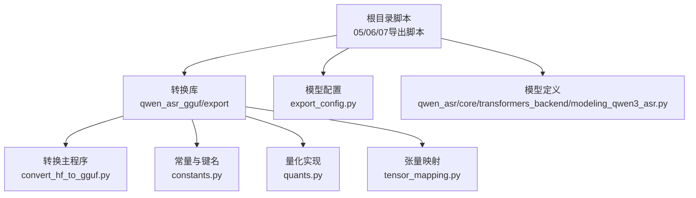
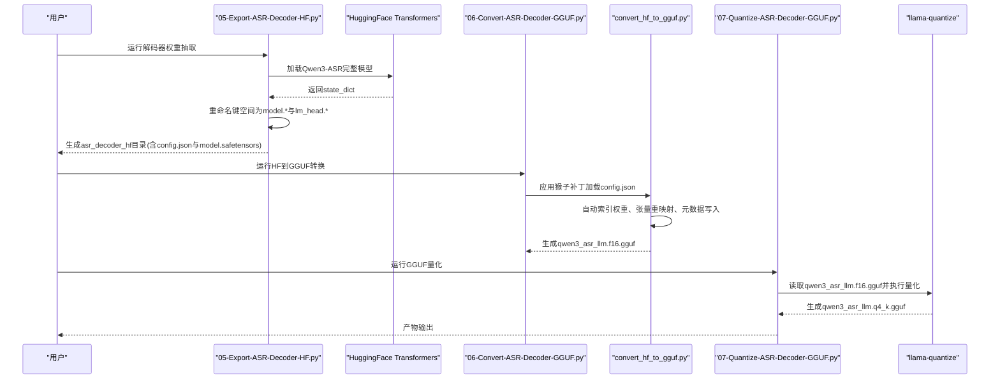
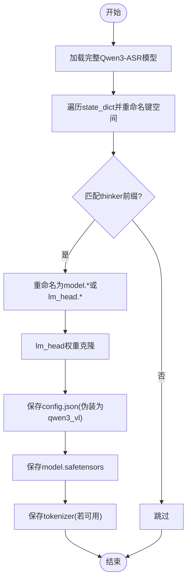
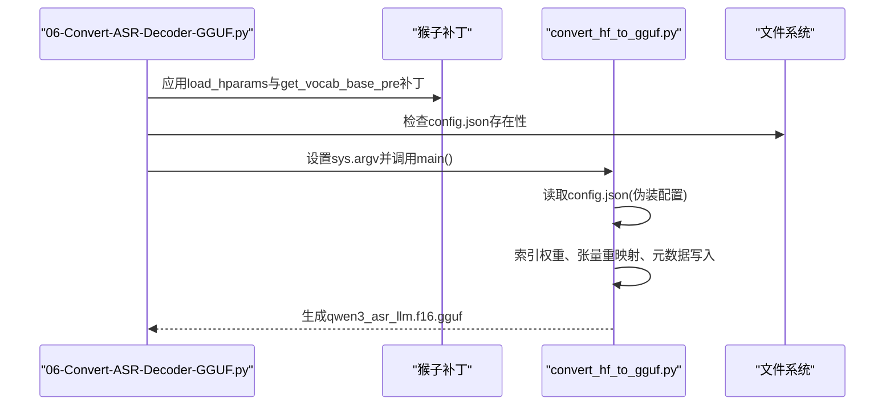
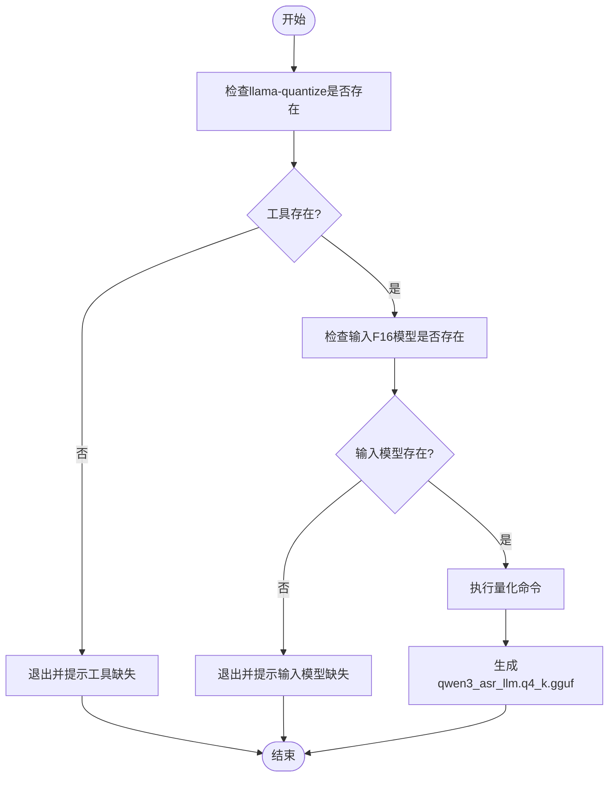
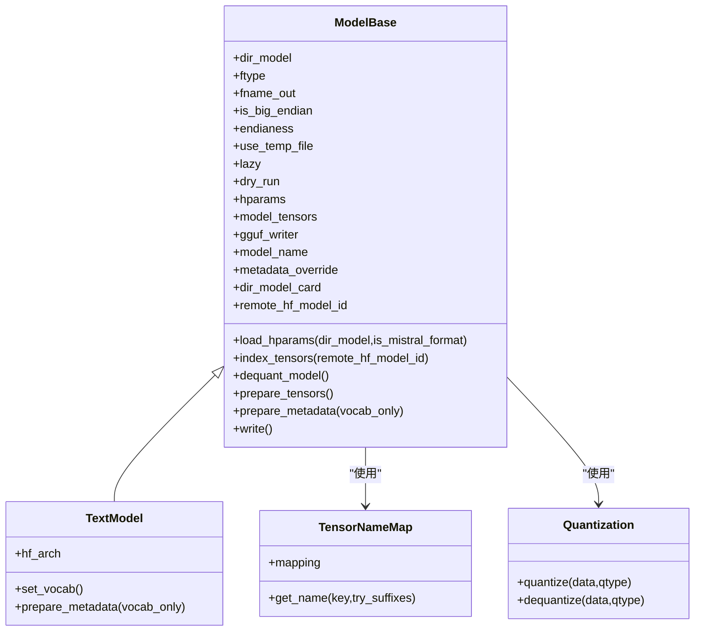
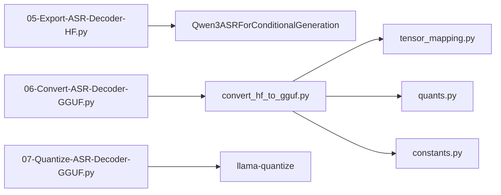

# 解码器导出流程

<cite>
**本文引用的文件**
- [05-Export-ASR-Decoder-HF.py](file://05-Export-ASR-Decoder-HF.py)
- [06-Convert-ASR-Decoder-GGUF.py](file://06-Convert-ASR-Decoder-GGUF.py)
- [07-Quantize-ASR-Decoder-GGUF.py](file://07-Quantize-ASR-Decoder-GGUF.py)
- [export_config.py](file://export_config.py)
- [qwen_asr_gguf/export/convert_hf_to_gguf.py](file://qwen_asr_gguf/export/convert_hf_to_gguf.py)
- [qwen_asr_gguf/export/gguf/constants.py](file://qwen_asr_gguf/export/gguf/constants.py)
- [qwen_asr_gguf/export/gguf/quants.py](file://qwen_asr_gguf/export/gguf/quants.py)
- [qwen_asr_gguf/export/gguf/tensor_mapping.py](file://qwen_asr_gguf/export/gguf/tensor_mapping.py)
- [qwen_asr/core/transformers_backend/modeling_qwen3_asr.py](file://qwen_asr/core/transformers_backend/modeling_qwen3_asr.py)
</cite>

## 目录
1. [简介](#简介)
2. [项目结构](#项目结构)
3. [核心组件](#核心组件)
4. [架构总览](#架构总览)
5. [详细组件分析](#详细组件分析)
6. [依赖分析](#依赖分析)
7. [性能考虑](#性能考虑)
8. [故障排查指南](#故障排查指南)
9. [结论](#结论)
10. [附录](#附录)

## 简介
本技术文档聚焦于Qwen3-ASR解码器（LLM部分）从HuggingFace Transformers到ONNX再到GGUF格式的完整导出流程。文档详细解释以下三个阶段：
- 阶段一：从官方Qwen3-ASR模型中抽取“思考器”（Thinker）文本解码器权重与配置，生成可被后续工具识别的HF风格目录（包含config.json、model.safetensors、tokenizer）。
- 阶段二：使用统一的HF到GGUF转换器，将上述HF风格目录转换为GGUF格式，支持多种输出精度类型（如F16）。
- 阶段三：对已生成的GGUF模型进行量化，支持INT4、Q4_K、Q5_K等量化方案，以降低模型体积并提升推理速度。

同时，文档提供模型兼容性检查方法、格式验证工具与质量评估指标，并给出常见问题排查与性能优化建议。

## 项目结构
该仓库采用模块化组织，导出脚本位于根目录，转换与量化逻辑集中在qwen_asr_gguf子包内，模型定义位于qwen_asr子包中。

图表来源
- [05-Export-ASR-Decoder-HF.py:1-92](file://05-Export-ASR-Decoder-HF.py#L1-L92)
- [06-Convert-ASR-Decoder-GGUF.py:1-94](file://06-Convert-ASR-Decoder-GGUF.py#L1-L94)
- [07-Quantize-ASR-Decoder-GGUF.py:1-51](file://07-Quantize-ASR-Decoder-GGUF.py#L1-L51)
- [qwen_asr_gguf/export/convert_hf_to_gguf.py:1-800](file://qwen_asr_gguf/export/convert_hf_to_gguf.py#L1-L800)
- [qwen_asr_gguf/export/gguf/constants.py:1-800](file://qwen_asr_gguf/export/gguf/constants.py#L1-L800)
- [qwen_asr_gguf/export/gguf/quants.py:1-800](file://qwen_asr_gguf/export/gguf/quants.py#L1-L800)
- [qwen_asr_gguf/export/gguf/tensor_mapping.py:1-800](file://qwen_asr_gguf/export/gguf/tensor_mapping.py#L1-L800)
- [export_config.py:1-12](file://export_config.py#L1-L12)
- [qwen_asr/core/transformers_backend/modeling_qwen3_asr.py:1-200](file://qwen_asr/core/transformers_backend/modeling_qwen3_asr.py#L1-L200)

章节来源
- [05-Export-ASR-Decoder-HF.py:1-92](file://05-Export-ASR-Decoder-HF.py#L1-L92)
- [06-Convert-ASR-Decoder-GGUF.py:1-94](file://06-Convert-ASR-Decoder-GGUF.py#L1-L94)
- [07-Quantize-ASR-Decoder-GGUF.py:1-51](file://07-Quantize-ASR-Decoder-GGUF.py#L1-L51)
- [export_config.py:1-12](file://export_config.py#L1-L12)

## 核心组件
- 阶段一：解码器权重抽取与配置伪装
  - 从完整Qwen3-ASR模型中加载，抽取“thinker”文本解码器权重，重命名键空间为“model.*”和“lm_head.*”，并保存为safetensors；同时将“thinker_config.text_config”伪装为“qwen3_vl”的配置，确保下游转换器能正确识别。
- 阶段二：HF到GGUF转换
  - 通过统一转换器加载config.json，应用猴子补丁绕过AutoConfig的默认行为；按指定精度类型（如F16）写入GGUF文件，自动完成张量重映射、元数据写入与量化。
- 阶段三：GGUF量化
  - 使用llama-quantize工具对F16 GGUF进行量化，支持Q4_K、Q5_K等方案；量化后模型体积显著下降，适合边缘部署。

章节来源
- [05-Export-ASR-Decoder-HF.py:16-88](file://05-Export-ASR-Decoder-HF.py#L16-L88)
- [06-Convert-ASR-Decoder-GGUF.py:23-91](file://06-Convert-ASR-Decoder-GGUF.py#L23-L91)
- [07-Quantize-ASR-Decoder-GGUF.py:19-47](file://07-Quantize-ASR-Decoder-GGUF.py#L19-L47)

## 架构总览
下图展示从模型加载到最终GGUF产物的端到端流程。

图表来源
- [05-Export-ASR-Decoder-HF.py:16-88](file://05-Export-ASR-Decoder-HF.py#L16-L88)
- [06-Convert-ASR-Decoder-GGUF.py:23-91](file://06-Convert-ASR-Decoder-GGUF.py#L23-L91)
- [qwen_asr_gguf/export/convert_hf_to_gguf.py:1-800](file://qwen_asr_gguf/export/convert_hf_to_gguf.py#L1-L800)
- [07-Quantize-ASR-Decoder-GGUF.py:19-47](file://07-Quantize-ASR-Decoder-GGUF.py#L19-L47)

## 详细组件分析

### 组件A：解码器权重抽取（05-Export-ASR-Decoder-HF）
- 功能概述
  - 从完整Qwen3-ASR模型加载权重，抽取“thinker”文本解码器部分，重命名为“model.*”和“lm_head.*”，并保存为safetensors。
  - 将“thinker_config.text_config”伪装为“qwen3_vl”配置，保证下游转换器能正确识别。
  - 保存分词器配置，便于后续推理或转换。
- 关键实现点
  - 使用Qwen3ASRForConditionalGeneration类直接加载模型，避免远程代码风险。
  - 通过state_dict遍历键空间，匹配以“thinker.model.”和“thinker.lm_head.”开头的键，重命名并克隆lm_head权重以避免共享内存问题。
  - 写入config.json、model.safetensors与tokenizer目录。
- 兼容性与注意事项
  - 若原模型未包含rope_scaling，保留现有配置；若需要显式mrope参数，可在转换前补充。
  - 若无法保存分词器，会打印警告但不影响权重导出。

图表来源
- [05-Export-ASR-Decoder-HF.py:16-88](file://05-Export-ASR-Decoder-HF.py#L16-L88)

章节来源
- [05-Export-ASR-Decoder-HF.py:16-88](file://05-Export-ASR-Decoder-HF.py#L16-L88)

### 组件B：HF到GGUF转换（06-Convert-ASR-Decoder-GGUF）
- 功能概述
  - 通过猴子补丁强制转换器从本地config.json加载参数，绕过AutoConfig的默认行为，确保与抽取的伪装配置一致。
  - 对分词器识别进行“强制qwen2”补丁，避免哈希校验报错。
  - 支持多任务转换（当前仅F16），逐个生成对应GGUF文件。
- 关键实现点
  - monkey patch：拦截ModelBase.load_hparams与TextModel.get_vocab_base_pre，确保读取本地config.json并返回“qwen2”分词器标识。
  - 参数传递：模拟命令行调用sys.argv，传入输入目录、输出文件名、输出精度类型与详细日志开关。
  - 调用convert_hf_to_gguf.main()执行转换。
- 转换细节
  - 自动索引权重文件（支持safetensors与bin），解析权重映射，完成张量重映射与元数据写入。
  - 量化策略由转换器根据文件类型自动选择，当前任务使用F16。

图表来源
- [06-Convert-ASR-Decoder-GGUF.py:23-91](file://06-Convert-ASR-Decoder-GGUF.py#L23-L91)
- [qwen_asr_gguf/export/convert_hf_to_gguf.py:702-730](file://qwen_asr_gguf/export/convert_hf_to_gguf.py#L702-L730)

章节来源
- [06-Convert-ASR-Decoder-GGUF.py:23-91](file://06-Convert-ASR-Decoder-GGUF.py#L23-L91)

### 组件C：GGUF量化（07-Quantize-ASR-Decoder-GGUF）
- 功能概述
  - 使用llama-quantize工具对F16 GGUF进行量化，当前脚本固定使用“q4_k”量化方案。
  - 支持跨平台（Windows/Linux），自动检测量化工具路径。
- 关键实现点
  - 校验量化工具与输入模型存在性。
  - 构造命令行参数，调用subprocess执行量化。
  - 输出量化后的GGUF文件，供推理或部署使用。
- 量化方案说明
  - INT4：整型4比特量化，压缩比高，适合资源受限设备。
  - Q4_K：K-quants族量化，通常在保持较高精度的同时显著减小体积。
  - Q5_K：5比特K-quants，精度略高于Q4_K，体积稍大。
  - 其他：如Q2_K、Q3_K、Q6_K等，适用于不同精度-体积权衡需求。

图表来源
- [07-Quantize-ASR-Decoder-GGUF.py:19-47](file://07-Quantize-ASR-Decoder-GGUF.py#L19-L47)

章节来源
- [07-Quantize-ASR-Decoder-GGUF.py:19-47](file://07-Quantize-ASR-Decoder-GGUF.py#L19-L47)

### 组件D：转换器核心（convert_hf_to_gguf.py）
- 功能概述
  - 提供通用的HF到GGUF转换框架，负责：
    - 加载配置（优先AutoConfig，失败则回退到config.json）
    - 索引权重文件（支持safetensors与bin）
    - 张量重映射（基于MODEL_TENSORS与TENSOR_NAMES）
    - 元数据写入（模型类型、参数规模、采样参数等）
    - 量化与写入（按文件类型选择量化方案）
- 关键实现点
  - ModelBase与TextModel基类：封装配置加载、权重索引、张量准备、元数据与量化写入。
  - TensorNameMap：将HF权重键映射到GGUF张量名称，支持多架构与多模型族。
  - quants.quantize：实现多种量化类型（F32/F16/BF16/Q4_0/Q4_1/Q5_0/Q5_1/Q8_0/Q2_K/Q3_K/Q4_K/Q5_K/Q6_K/TQ1_0/TQ2_0等）。
  - 常量与键名：GGUF魔数、版本、元数据键名、模型架构枚举、张量类型枚举等。

图表来源
- [qwen_asr_gguf/export/convert_hf_to_gguf.py:79-756](file://qwen_asr_gguf/export/convert_hf_to_gguf.py#L79-L756)
- [qwen_asr_gguf/export/gguf/tensor_mapping.py:8-160](file://qwen_asr_gguf/export/gguf/tensor_mapping.py#L8-L160)
- [qwen_asr_gguf/export/gguf/quants.py:56-76](file://qwen_asr_gguf/export/gguf/quants.py#L56-L76)

章节来源
- [qwen_asr_gguf/export/convert_hf_to_gguf.py:79-756](file://qwen_asr_gguf/export/convert_hf_to_gguf.py#L79-L756)
- [qwen_asr_gguf/export/gguf/tensor_mapping.py:8-160](file://qwen_asr_gguf/export/gguf/tensor_mapping.py#L8-L160)
- [qwen_asr_gguf/export/gguf/quants.py:56-76](file://qwen_asr_gguf/export/gguf/quants.py#L56-L76)

## 依赖分析
- 模块耦合
  - 05脚本依赖qwen_asr核心模型类加载完整模型并抽取权重。
  - 06脚本依赖转换器库，通过猴子补丁确保配置一致性。
  - 07脚本依赖llama-quantize工具，对GGUF进行二次量化。
- 外部依赖
  - HuggingFace Transformers：用于加载模型与分词器。
  - safetensors：用于高效保存权重。
  - numpy与torch：用于张量处理与量化计算。
- 可能的循环依赖
  - 当前脚本间无直接循环导入；转换器库作为独立模块被脚本间接调用。

图表来源
- [05-Export-ASR-Decoder-HF.py:11-22](file://05-Export-ASR-Decoder-HF.py#L11-L22)
- [06-Convert-ASR-Decoder-GGUF.py:16-21](file://06-Convert-ASR-Decoder-GGUF.py#L16-L21)
- [07-Quantize-ASR-Decoder-GGUF.py:11-16](file://07-Quantize-ASR-Decoder-GGUF.py#L11-L16)
- [qwen_asr_gguf/export/convert_hf_to_gguf.py:1-800](file://qwen_asr_gguf/export/convert_hf_to_gguf.py#L1-L800)
- [qwen_asr_gguf/export/gguf/tensor_mapping.py:1-800](file://qwen_asr_gguf/export/gguf/tensor_mapping.py#L1-L800)
- [qwen_asr_gguf/export/gguf/quants.py:1-800](file://qwen_asr_gguf/export/gguf/quants.py#L1-L800)
- [qwen_asr_gguf/export/gguf/constants.py:1-800](file://qwen_asr_gguf/export/gguf/constants.py#L1-L800)

章节来源
- [05-Export-ASR-Decoder-HF.py:11-22](file://05-Export-ASR-Decoder-HF.py#L11-L22)
- [06-Convert-ASR-Decoder-GGUF.py:16-21](file://06-Convert-ASR-Decoder-GGUF.py#L16-L21)
- [07-Quantize-ASR-Decoder-GGUF.py:11-16](file://07-Quantize-ASR-Decoder-GGUF.py#L11-L16)

## 性能考虑
- 权重抽取阶段
  - 使用state_dict遍历键空间，避免不必要的张量拷贝；lm_head权重克隆以避免共享内存导致的副作用。
- 转换阶段
  - 采用惰性加载（lazy）与分片写入（split_max_tensors/split_max_size）可降低内存峰值。
  - 自动推断文件类型（F16/BF16/Q8_0等）以减少手动配置。
- 量化阶段
  - Q4_K/Q5_K在保持较高精度的同时显著减小体积，适合移动端与边缘设备。
  - 若追求更高精度，可使用F16或BF16；若追求极致体积，可尝试INT4（需评估精度损失）。

## 故障排查指南
- 无法加载配置
  - 症状：转换器无法从HF加载配置。
  - 处理：确认05脚本已生成asr_decoder_hf目录下的config.json；06脚本通过猴子补丁强制读取本地config.json。
- 分词器识别失败
  - 症状：提示分词器哈希不匹配。
  - 处理：06脚本已对分词器识别进行“强制qwen2”补丁，确保兼容性。
- 量化工具缺失
  - 症状：提示找不到llama-quantize。
  - 处理：确认工具存在于qwen_asr_gguf/inference/bin目录；Windows使用llama-quantize.exe，Linux使用llama-quantize。
- 权重映射失败
  - 症状：转换时报错无法映射某些张量。
  - 处理：检查05脚本是否正确重命名键空间（model.*与lm_head.*）；确认config.json伪装配置与转换器期望一致。
- 精度与体积权衡
  - 症状：量化后精度明显下降。
  - 处理：尝试更高比特量化（如Q5_K）或使用更精细的校准数据（imatrix）；必要时回退到F16。

章节来源
- [06-Convert-ASR-Decoder-GGUF.py:23-51](file://06-Convert-ASR-Decoder-GGUF.py#L23-L51)
- [07-Quantize-ASR-Decoder-GGUF.py:24-30](file://07-Quantize-ASR-Decoder-GGUF.py#L24-L30)

## 结论
本流程实现了从Qwen3-ASR完整模型中抽取解码器权重，伪装配置并转换为GGUF格式，再进行量化以满足不同部署场景的需求。通过猴子补丁与统一转换器，确保了配置一致性与转换稳定性；通过多种量化方案，兼顾精度与体积。建议在实际部署前进行充分的精度与性能评估，并结合具体硬件条件选择合适的量化方案。

## 附录
- 模型兼容性检查清单
  - 确认config.json伪装配置与转换器期望一致（qwen3_vl）。
  - 确认model.safetensors包含所有必需张量且键空间正确（model.*与lm_head.*）。
  - 确认分词器保存成功，或使用“强制qwen2”补丁。
- 格式验证工具
  - 使用gguf工具链中的读取与校验工具检查GGUF头、元数据与张量完整性。
- 质量评估指标
  - 语言模型：困惑度（Perplexity）、KL散度（Kullback–Leibler Divergence）。
  - 推理性能：吞吐量（tokens/sec）、延迟（ms/token）、内存占用（MB）。