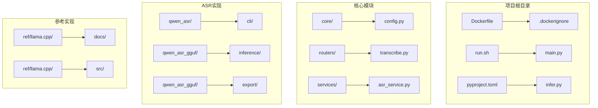
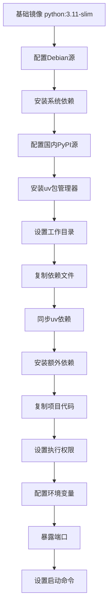
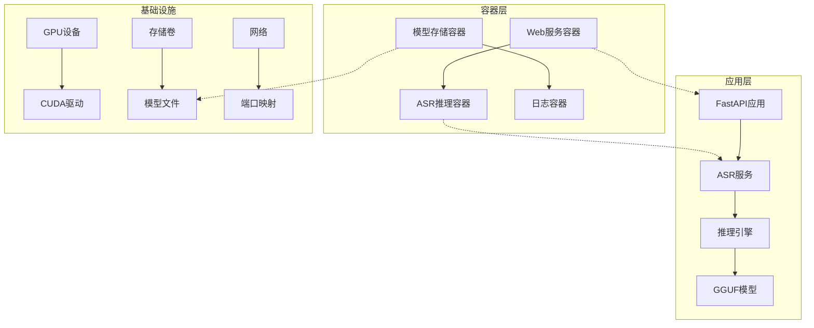
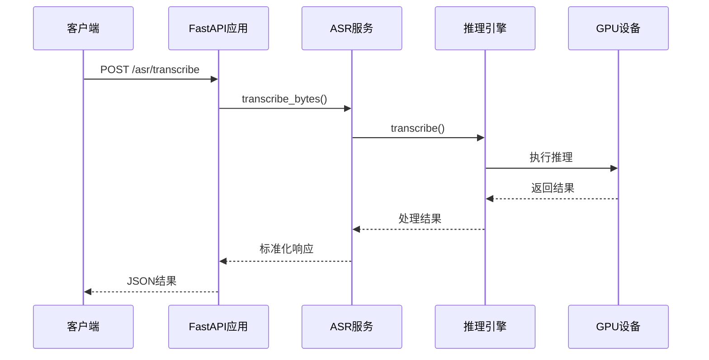
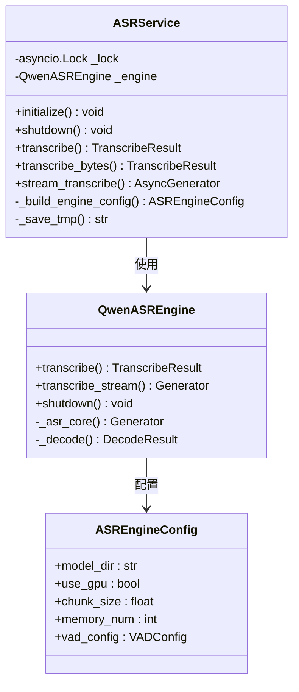
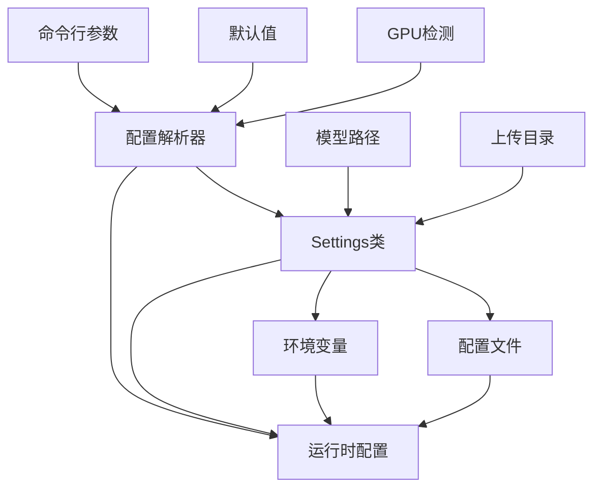
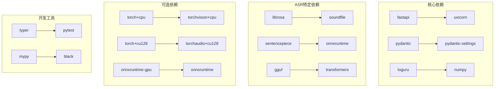
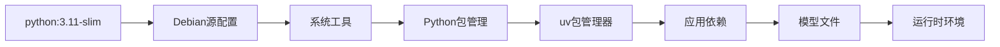
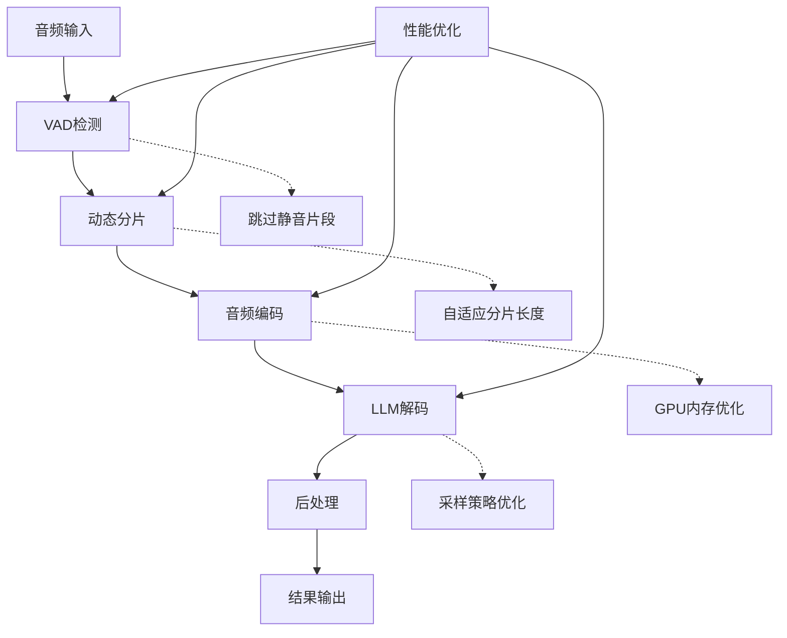
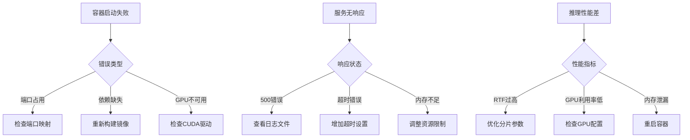

# Docker容器化部署

<cite>
**本文档引用的文件**
- [Dockerfile](file://Dockerfile)
- [.dockerignore](file://.dockerignore)
- [run.sh](file://run.sh)
- [pyproject.toml](file://pyproject.toml)
- [infer.py](file://infer.py)
- [main.py](file://main.py)
- [core/config.py](file://core/config.py)
- [routers/transcribe.py](file://routers/transcribe.py)
- [services/asr_service.py](file://services/asr_service.py)
- [qwen_asr_gguf/inference/asr.py](file://qwen_asr_gguf/inference/asr.py)
- [qwen_asr_gguf/inference/schema.py](file://qwen_asr_gguf/inference/schema.py)
- [ref/llama.cpp/docs/docker.md](file://ref/llama.cpp/docs/docker.md)
</cite>

## 目录
1. [简介](#简介)
2. [项目结构](#项目结构)
3. [核心组件](#核心组件)
4. [架构概览](#架构概览)
5. [详细组件分析](#详细组件分析)
6. [依赖关系分析](#依赖关系分析)
7. [性能考虑](#性能考虑)
8. [故障排除指南](#故障排除指南)
9. [结论](#结论)
10. [附录](#附录)

## 简介

本指南详细介绍Qwen3-ASR GGUF项目的Docker容器化部署方案。该项目基于FastAPI构建语音识别服务，采用GGUF格式的模型进行推理，支持CPU和GPU加速。文档涵盖了从Dockerfile构建到容器运行的完整流程，包括多阶段构建、依赖安装、环境配置、GPU支持配置、Docker Compose编排以及监控和故障诊断方法。

## 项目结构

Qwen3-ASR GGUF项目采用模块化的Python项目结构，主要包含以下关键目录：



**图表来源**
- [Dockerfile:1-66](file://Dockerfile#L1-L66)
- [pyproject.toml:1-102](file://pyproject.toml#L1-L102)

**章节来源**
- [Dockerfile:1-66](file://Dockerfile#L1-L66)
- [pyproject.toml:1-102](file://pyproject.toml#L1-L102)

## 核心组件

### Dockerfile多阶段构建

项目使用多阶段构建策略优化镜像体积和构建效率：



**图表来源**
- [Dockerfile:1-66](file://Dockerfile#L1-L66)

### 依赖管理系统

项目采用uv作为包管理器，支持多种Python发行版：

- **CPU版本**: `torch==2.10.0+cpu`
- **CUDA版本**: `torch==2.10.0+cu128`
- **Windows版本**: `torch==2.10.0+cpu`

**章节来源**
- [Dockerfile:33-51](file://Dockerfile#L33-L51)
- [pyproject.toml:28-48](file://pyproject.toml#L28-L48)

## 架构概览

Qwen3-ASR GGUF的容器化架构采用微服务设计理念：



**图表来源**
- [infer.py:84-123](file://infer.py#L84-L123)
- [services/asr_service.py:34-115](file://services/asr_service.py#L34-L115)

## 详细组件分析

### Web服务入口点

应用使用FastAPI框架提供RESTful API服务：



**图表来源**
- [infer.py:114-123](file://infer.py#L114-L123)
- [routers/transcribe.py:134-161](file://routers/transcribe.py#L134-L161)

### ASR服务架构

ASR服务采用线程安全的设计模式：



**图表来源**
- [services/asr_service.py:34-322](file://services/asr_service.py#L34-L322)
- [qwen_asr_gguf/inference/asr.py:40-142](file://qwen_asr_gguf/inference/asr.py#L40-L142)
- [qwen_asr_gguf/inference/schema.py:162-210](file://qwen_asr_gguf/inference/schema.py#L162-L210)

**章节来源**
- [services/asr_service.py:34-322](file://services/asr_service.py#L34-L322)
- [qwen_asr_gguf/inference/asr.py:40-800](file://qwen_asr_gguf/inference/asr.py#L40-L800)

### 配置管理系统

应用支持灵活的配置管理：



**图表来源**
- [core/config.py:19-109](file://core/config.py#L19-L109)

**章节来源**
- [core/config.py:19-109](file://core/config.py#L19-L109)

## 依赖关系分析

### Python依赖层次

项目采用分层依赖管理策略：



**图表来源**
- [pyproject.toml:7-23](file://pyproject.toml#L7-L23)
- [pyproject.toml:28-48](file://pyproject.toml#L28-L48)

**章节来源**
- [pyproject.toml:1-102](file://pyproject.toml#L1-L102)

### Docker构建依赖



**图表来源**
- [Dockerfile:8-51](file://Dockerfile#L8-L51)

**章节来源**
- [Dockerfile:8-51](file://Dockerfile#L8-L51)

## 性能考虑

### GPU加速配置

项目支持多种GPU后端：

| GPU后端 | Python发行版 | CUDA版本 | 适用场景 |
|---------|-------------|----------|----------|
| cu128 | torch==2.10.0+cu128 | CUDA 12.8 | NVIDIA GPU推理 |
| cpu | torch==2.10.0+cpu | 无 | CPU推理 |
| win | torch==2.10.0+cpu | DirectML | Windows GPU |

### 推理性能优化



**图表来源**
- [qwen_asr_gguf/inference/asr.py:602-800](file://qwen_asr_gguf/inference/asr.py#L602-L800)

**章节来源**
- [qwen_asr_gguf/inference/asr.py:40-800](file://qwen_asr_gguf/inference/asr.py#L40-L800)

## 故障排除指南

### 常见问题诊断



### 日志收集策略

应用提供多层次的日志记录机制：

- **应用日志**: `logs/app.log` - Uvicorn服务器日志
- **调试日志**: `logs/{date}/debug.log` - 详细调试信息
- **访问日志**: 自定义中间件记录请求信息
- **错误日志**: 标准错误输出

**章节来源**
- [run.sh:24-28](file://run.sh#L24-L28)
- [core/logger.py:54-72](file://core/logger.py#L54-L72)

## 结论

Qwen3-ASR GGUF的Docker容器化部署提供了完整的语音识别服务解决方案。通过多阶段构建、灵活的依赖管理和GPU加速支持，该容器化方案能够高效地部署和运行ASR服务。项目的设计充分考虑了生产环境的需求，包括性能优化、故障诊断和监控支持。

## 附录

### 容器构建命令

```bash
# 构建CPU版本镜像
docker build -t qwen3-asr-gguf:cpu .

# 构建GPU版本镜像
docker build -t qwen3-asr-gguf:gpu --build-arg GPU_TYPE=cu128 .

# 使用uv同步依赖
uv sync --extra cu128
```

### 容器运行示例

```bash
# 基础运行
docker run -d \
  --name qwen3-asr \
  -p 8001:8001 \
  -v ./models:/workspace/models \
  -v ./logs:/workspace/logs \
  qwen3-asr-gguf:cpu

# GPU运行
docker run -d \
  --name qwen3-asr-gpu \
  --gpus all \
  -p 8002:8002 \
  -v ./models:/workspace/models \
  -v ./logs:/workspace/logs \
  qwen3-asr-gguf:gpu
```

### 环境变量配置

| 环境变量 | 默认值 | 描述 |
|----------|--------|------|
| ASR_HOST | 0.0.0.0 | 服务绑定地址 |
| ASR_PORT | 8002 | 服务端口号 |
| ASR_MODEL_DIR | ./models | 模型文件目录 |
| ASR_UPLOAD_DIR | ./uploads | 上传文件目录 |
| ASR_WEB_SECRET_KEY | qwen3-asr-token | API访问密钥 |