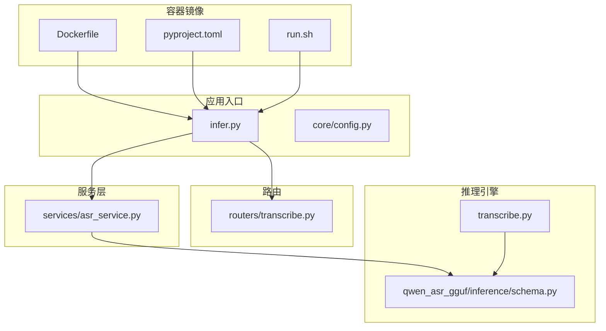
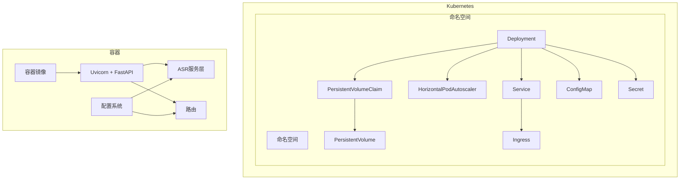
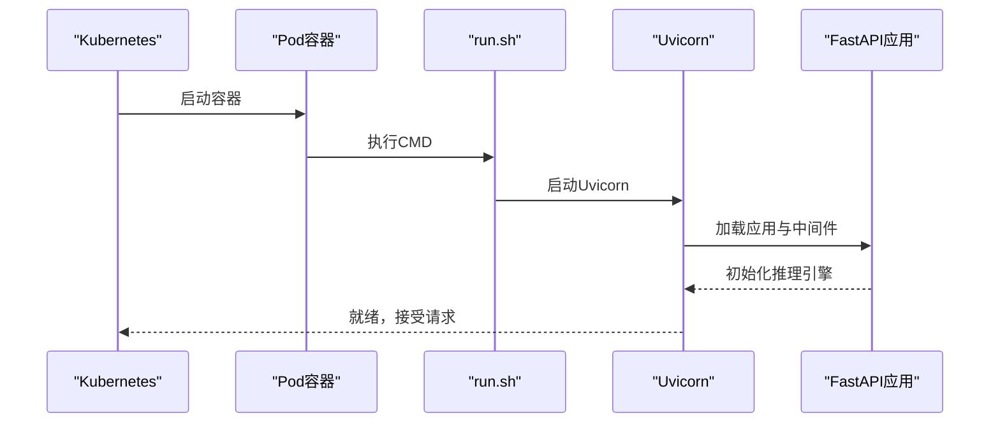
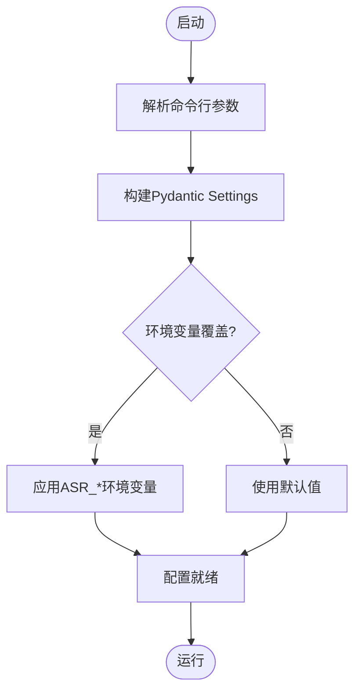
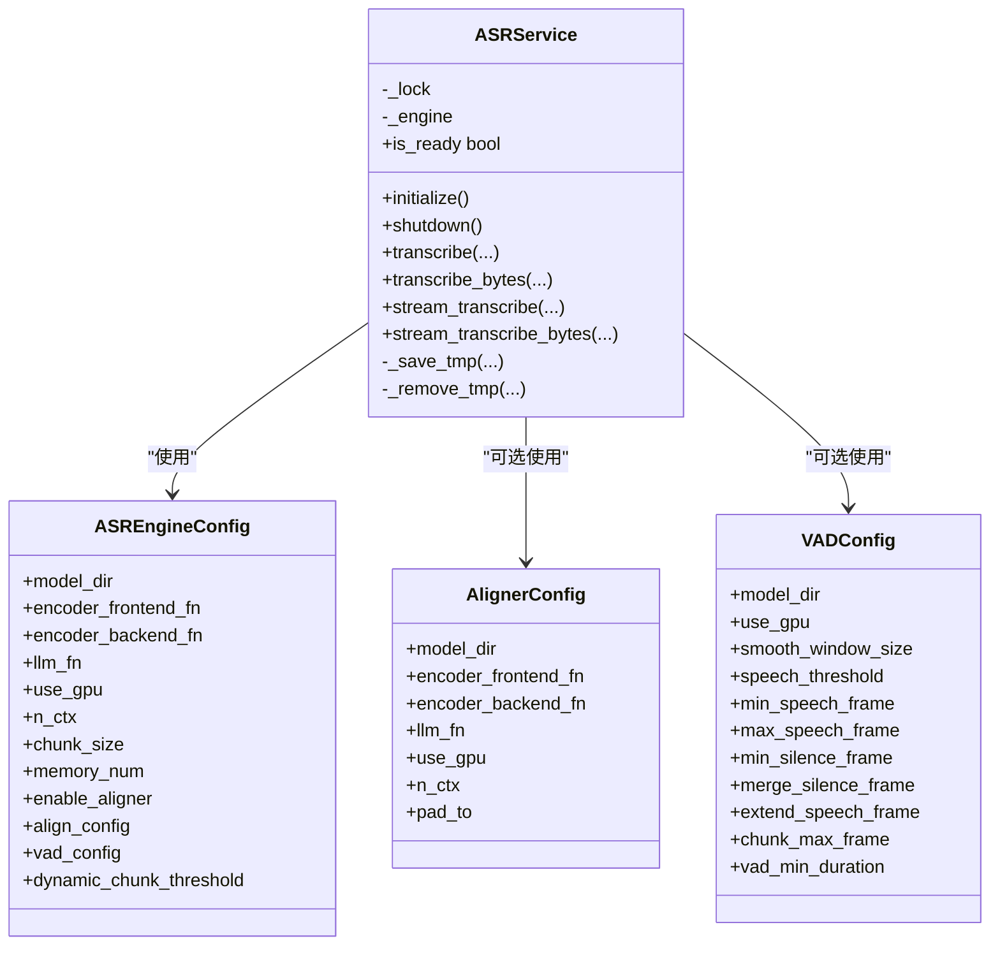
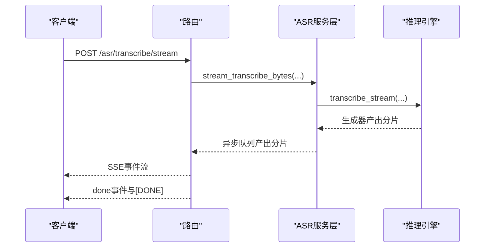
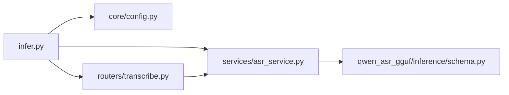

# Kubernetes集群部署

<cite>
**本文档引用的文件**
- [Dockerfile](file://Dockerfile)
- [run.sh](file://run.sh)
- [pyproject.toml](file://pyproject.toml)
- [infer.py](file://infer.py)
- [core/config.py](file://core/config.py)
- [services/asr_service.py](file://services/asr_service.py)
- [routers/transcribe.py](file://routers/transcribe.py)
- [qwen_asr_gguf/inference/schema.py](file://qwen_asr_gguf/inference/schema.py)
- [transcribe.py](file://transcribe.py)
</cite>

## 目录
1. [简介](#简介)
2. [项目结构](#项目结构)
3. [核心组件](#核心组件)
4. [架构概览](#架构概览)
5. [详细组件分析](#详细组件分析)
6. [依赖关系分析](#依赖关系分析)
7. [性能考虑](#性能考虑)
8. [故障排查指南](#故障排查指南)
9. [结论](#结论)
10. [附录](#附录)

## 简介
本指南面向在Kubernetes集群中部署Qwen3-ASR GGUF服务，提供从容器镜像构建、Helm Chart配置到Deployment、Service、Ingress、HPA、持久化存储、ConfigMap/Secret、滚动更新与灰度发布策略，以及监控与日志的完整方案。文档基于仓库中的FastAPI服务、推理引擎与配置模块，确保部署实践与代码实现保持一致。

## 项目结构
项目采用Python FastAPI应用结构，核心入口为Web服务，推理引擎封装在服务层，路由模块提供HTTP接口，配置模块集中管理运行参数与默认值。容器镜像基于Python Slim，内置FFmpeg与日志目录，服务通过Uvicorn在容器内启动。

**图表来源**
- [Dockerfile:1-66](file://Dockerfile#L1-L66)
- [pyproject.toml:1-102](file://pyproject.toml#L1-L102)
- [run.sh:1-63](file://run.sh#L1-L63)
- [infer.py:1-123](file://infer.py#L1-L123)
- [core/config.py:1-109](file://core/config.py#L1-L109)
- [services/asr_service.py:1-322](file://services/asr_service.py#L1-L322)
- [routers/transcribe.py:1-383](file://routers/transcribe.py#L1-L383)
- [qwen_asr_gguf/inference/schema.py:1-235](file://qwen_asr_gguf/inference/schema.py#L1-L235)
- [transcribe.py:1-205](file://transcribe.py#L1-L205)

**章节来源**
- [Dockerfile:1-66](file://Dockerfile#L1-L66)
- [pyproject.toml:1-102](file://pyproject.toml#L1-L102)
- [run.sh:1-63](file://run.sh#L1-L63)
- [infer.py:1-123](file://infer.py#L1-L123)
- [core/config.py:1-109](file://core/config.py#L1-L109)
- [services/asr_service.py:1-322](file://services/asr_service.py#L1-L322)
- [routers/transcribe.py:1-383](file://routers/transcribe.py#L1-L383)
- [qwen_asr_gguf/inference/schema.py:1-235](file://qwen_asr_gguf/inference/schema.py#L1-L235)
- [transcribe.py:1-205](file://transcribe.py#L1-L205)

## 核心组件
- 容器镜像与启动
  - 基础镜像与系统依赖：Debian 12源、FFmpeg、证书等。
  - Python依赖：uv同步、PyTorch GPU/CPU、ONNXRuntime、FastAPI等。
  - 容器启动：暴露端口、CMD启动脚本。
- Web服务入口
  - Uvicorn运行FastAPI应用，生命周期管理加载推理引擎，注册中间件与路由。
- 配置系统
  - 命令行参数与环境变量映射到Pydantic设置，统一管理模型路径、上传目录、VAD参数、默认语言等。
- 服务层
  - 线程安全的ASR服务封装，支持离线与流式转写，内部使用锁与线程池避免阻塞事件循环。
- 路由与接口
  - 提供离线转写、批量转写、流式转写（SSE）、健康检查等REST接口。
- 推理引擎
  - ASR/对齐/VAD配置数据类，定义模型文件名、分片大小、上下文、阈值等。

**章节来源**
- [Dockerfile:1-66](file://Dockerfile#L1-L66)
- [pyproject.toml:1-102](file://pyproject.toml#L1-L102)
- [infer.py:1-123](file://infer.py#L1-L123)
- [core/config.py:1-109](file://core/config.py#L1-L109)
- [services/asr_service.py:1-322](file://services/asr_service.py#L1-L322)
- [routers/transcribe.py:1-383](file://routers/transcribe.py#L1-L383)
- [qwen_asr_gguf/inference/schema.py:1-235](file://qwen_asr_gguf/inference/schema.py#L1-L235)

## 架构概览
下图展示了Kubernetes部署的整体架构：容器内运行Uvicorn+FastAPI，路由层对接业务接口，服务层封装推理引擎，配置模块提供参数与默认值，持久化卷用于模型与上传目录，Ingress提供外部访问，HPA根据CPU/内存指标自动扩缩容。

**图表来源**
- [Dockerfile:1-66](file://Dockerfile#L1-L66)
- [infer.py:1-123](file://infer.py#L1-L123)
- [services/asr_service.py:1-322](file://services/asr_service.py#L1-L322)
- [core/config.py:1-109](file://core/config.py#L1-L109)
- [routers/transcribe.py:1-383](file://routers/transcribe.py#L1-L383)

## 详细组件分析

### 容器镜像与启动流程
- 镜像构建要点
  - 使用Python 3.11 Slim，替换apt源为阿里云镜像，安装FFmpeg与系统依赖。
  - 使用uv同步依赖，按cu128选择GPU版本PyTorch与ONNXRuntime。
  - 创建/workspace/models、/workspace/logs、/workspace/datasets目录，便于挂载持久化。
  - 暴露8001端口（容器内），CMD通过run.sh启动Uvicorn。
- 启动脚本
  - run.sh负责前台启动Uvicorn，守护进程方式运行，记录PID与日志，支持start/stop/restart。
  - 默认监听0.0.0.0:8002（容器内端口映射至Service端口）。

**图表来源**
- [Dockerfile:1-66](file://Dockerfile#L1-L66)
- [run.sh:1-63](file://run.sh#L1-L63)
- [infer.py:1-123](file://infer.py#L1-L123)

**章节来源**
- [Dockerfile:1-66](file://Dockerfile#L1-L66)
- [run.sh:1-63](file://run.sh#L1-L63)
- [infer.py:1-123](file://infer.py#L1-L123)

### 配置系统与参数映射
- 命令行参数
  - 支持--use_gpu、--host、--port、--base_url、--web_secret_key等。
- 环境变量映射
  - 通过Pydantic Settings读取环境变量，前缀为ASR_，覆盖默认值。
- 默认配置
  - 模型目录、数据集目录、热词、上传目录、最大文件大小、默认语言、VAD参数等。
- 运行时参数
  - ASR分片大小、记忆片段数、动态分片阈值、对齐器GPU开关、VAD阈值等。

**图表来源**
- [core/config.py:1-109](file://core/config.py#L1-L109)

**章节来源**
- [core/config.py:1-109](file://core/config.py#L1-L109)

### 服务层与推理引擎
- 线程安全与并发控制
  - 使用asyncio.Lock保证引擎串行访问；使用asyncio.to_thread将阻塞推理放入线程池。
- 离线与流式接口
  - 离线转写一次性返回完整结果；流式转写通过队列与线程桥接生成器，异步yield分片结果。
- 引擎配置
  - ASR/对齐/VAD配置数据类，定义模型文件名、分片大小、上下文、阈值等。
- 生命周期
  - FastAPI lifespan在启动时初始化引擎，在关闭时优雅释放。

**图表来源**
- [services/asr_service.py:1-322](file://services/asr_service.py#L1-L322)
- [qwen_asr_gguf/inference/schema.py:1-235](file://qwen_asr_gguf/inference/schema.py#L1-L235)

**章节来源**
- [services/asr_service.py:1-322](file://services/asr_service.py#L1-L322)
- [qwen_asr_gguf/inference/schema.py:1-235](file://qwen_asr_gguf/inference/schema.py#L1-L235)

### 路由与接口
- 离线转写
  - 单文件与批量接口，支持上下文、语言、温度、SRT与对齐开关。
- 流式转写（SSE）
  - Server-Sent Events实时推送分片结果，支持心跳与错误事件。
- 健康检查
  - 返回引擎状态与GPU启用状态。

**图表来源**
- [routers/transcribe.py:1-383](file://routers/transcribe.py#L1-L383)
- [services/asr_service.py:1-322](file://services/asr_service.py#L1-L322)

**章节来源**
- [routers/transcribe.py:1-383](file://routers/transcribe.py#L1-L383)

### 资源请求与限制（CPU/内存/GPU）
- CPU与内存
  - 建议根据推理规模与并发量设置requests与limits，例如：
    - requests.cpu: 2-4核
    - limits.cpu: 4-8核
    - requests.memory: 8Gi
    - limits.memory: 16-32Gi
- GPU
  - 若使用GPU推理，需在Deployment中声明GPU资源：
    - requests.nvidia.com/gpu: 1
    - limits.nvidia.com/gpu: 1
  - 确保节点具备相应GPU驱动与Device Plugin。
- 端口
  - 容器端口8001映射至Service端口80或443（取决于Ingress），应用内监听0.0.0.0:8002。

**章节来源**
- [Dockerfile:62-66](file://Dockerfile#L62-L66)
- [run.sh:4-6](file://run.sh#L4-L6)
- [infer.py:114-122](file://infer.py#L114-L122)

### Service、Ingress与负载均衡
- Service
  - ClusterIP或NodePort均可，推荐ClusterIP配合Ingress。
  - 选择器匹配Pod标签，端口映射至容器8001。
- Ingress
  - 路径路由到Service，支持TLS终止与限流。
  - 建议设置超时（如proxy-read-timeout）以适配长连接SSE。
- 负载均衡
  - 多副本Pod自动分摊流量；结合HPA实现弹性扩缩容。

**章节来源**
- [routers/transcribe.py:372-383](file://routers/transcribe.py#L372-L383)

### 滚动更新、蓝绿与金丝雀发布
- 滚动更新
  - Deployment默认滚动更新策略，设置maxUnavailable与maxSurge以控制更新节奏。
- 蓝绿发布
  - 通过两套Deployment（蓝色/绿色）与Service切换实现零停机切换。
- 金丝雀发布
  - 通过多副本与Ingress规则将部分流量导入新版本，逐步扩大比例。

[本节为通用发布策略说明，不直接分析具体文件]

### 持久化存储（PV/PVC）
- 模型与上传目录
  - 模型目录：/workspace/models（或自定义MODEL_DIR）
  - 上传目录：/workspace/uploads（或自定义UPLOAD_DIR）
- PVC与PV
  - 使用ReadWriteMany（RWX）或ReadWriteOnce（RWO）根据集群能力选择。
  - 建议为模型目录与上传目录分别挂载独立PVC。
- 数据持久化策略
  - 模型文件与热词文件长期不变，可使用RWO；上传目录按需清理。

**章节来源**
- [Dockerfile:31-31](file://Dockerfile#L31-L31)
- [core/config.py:58-94](file://core/config.py#L58-L94)

### ConfigMap与Secret
- ConfigMap
  - 用于存放非敏感配置，如基础URL、默认语言、VAD参数、上传目录等。
  - 通过环境变量或挂载文件形式注入容器。
- Secret
  - 用于存放敏感信息，如web_secret_key、认证令牌等。
  - 建议通过环境变量注入，避免明文存储。

**章节来源**
- [core/config.py:33-39](file://core/config.py#L33-L39)
- [core/config.py:52-109](file://core/config.py#L52-L109)

### 水平自动扩缩容（HPA）
- 触发条件
  - CPU利用率：目标平均使用率60%-80%
  - 内存使用：目标平均使用量或百分比
  - 自定义指标：如每Pod请求速率、队列长度（需Prometheus Adapter）
- 配置要点
  - 最小副本数与最大副本数，避免过度扩缩容。
  - 基于CPU/内存的简单策略适合初学者；复杂场景可引入自定义指标。

**章节来源**
- [services/asr_service.py:120-156](file://services/asr_service.py#L120-L156)
- [routers/transcribe.py:228-246](file://routers/transcribe.py#L228-L246)

### 监控、日志聚合与告警
- 应用日志
  - 容器标准输出与日志文件（logs/app.log），可通过Sidecar或DaemonSet收集。
- 指标采集
  - Prometheus抓取Uvicorn/FastAPI指标（需自定义端点或集成中间件）。
- 告警
  - 基于Prometheus Alertmanager配置CPU/内存/HPA异常、健康检查失败等告警规则。

[本节为通用运维建议，不直接分析具体文件]

## 依赖关系分析
- 组件耦合
  - infer.py依赖core/config.py与services/asr_service.py，路由模块依赖服务层。
  - 服务层依赖推理引擎配置数据类，形成清晰的分层。
- 外部依赖
  - PyTorch GPU/CPU、ONNXRuntime、FastAPI、Uvicorn等。
- 可能的循环依赖
  - 代码结构未发现循环导入；路由与服务层通过依赖注入解耦。

**图表来源**
- [infer.py:1-123](file://infer.py#L1-L123)
- [core/config.py:1-109](file://core/config.py#L1-L109)
- [services/asr_service.py:1-322](file://services/asr_service.py#L1-L322)
- [routers/transcribe.py:1-383](file://routers/transcribe.py#L1-L383)
- [qwen_asr_gguf/inference/schema.py:1-235](file://qwen_asr_gguf/inference/schema.py#L1-L235)

**章节来源**
- [infer.py:1-123](file://infer.py#L1-L123)
- [core/config.py:1-109](file://core/config.py#L1-L109)
- [services/asr_service.py:1-322](file://services/asr_service.py#L1-L322)
- [routers/transcribe.py:1-383](file://routers/transcribe.py#L1-L383)
- [qwen_asr_gguf/inference/schema.py:1-235](file://qwen_asr_gguf/inference/schema.py#L1-L235)

## 性能考虑
- 推理性能
  - GPU推理优先；合理设置分片大小与上下文，避免过小分片导致频繁上下文切换。
  - VAD动态分片在长音频场景显著提升吞吐。
- 并发与阻塞
  - 服务层使用线程池与锁避免阻塞事件循环；SSE流式接口需注意心跳与背压。
- 资源规划
  - CPU/内存/磁盘I/O与GPU显存共同决定并发能力；HPA结合业务峰值合理扩容。

[本节提供通用性能指导，不直接分析具体文件]

## 故障排查指南
- 健康检查
  - 访问/health接口确认引擎状态与GPU启用状态。
- 日志定位
  - 查看容器日志与logs/app.log，关注初始化失败、模型文件缺失、CUDA/ONNX错误。
- 常见问题
  - 模型文件缺失：检查PVC挂载与MODEL_DIR路径。
  - GPU不可用：确认节点GPU驱动、nvidia-container-toolkit与Device Plugin。
  - SSE连接中断：检查Ingress/代理超时设置与心跳机制。

**章节来源**
- [routers/transcribe.py:372-383](file://routers/transcribe.py#L372-L383)
- [run.sh:9-29](file://run.sh#L9-L29)
- [infer.py:55-82](file://infer.py#L55-L82)

## 结论
本指南提供了Qwen3-ASR GGUF在Kubernetes中的完整部署蓝图：从容器镜像构建、资源配置、服务暴露、自动扩缩容到持久化与发布策略，并结合应用特性给出性能与故障排查建议。建议在预生产环境先行验证，再逐步推广至生产。

## 附录
- 命令行工具
  - CLI工具支持本地转录与模型文件检查，可用于离线验证与调试。

**章节来源**
- [transcribe.py:1-205](file://transcribe.py#L1-L205)