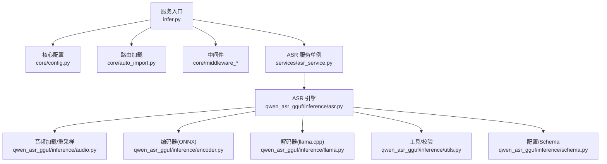
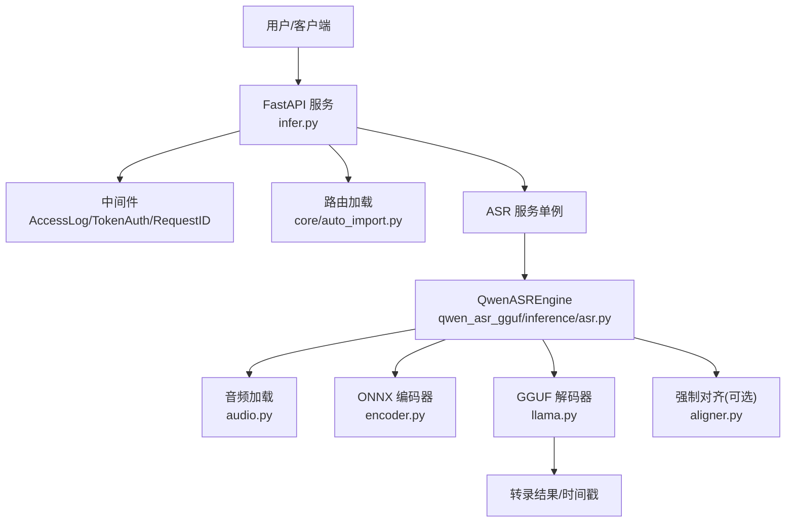
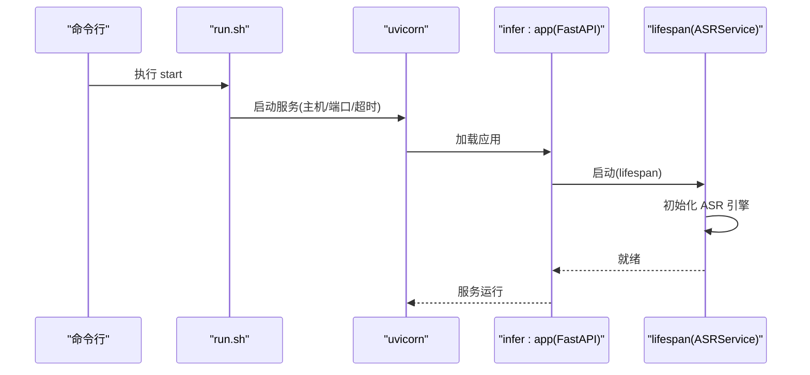
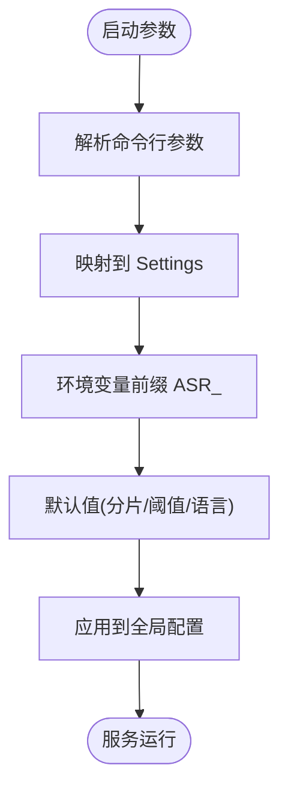
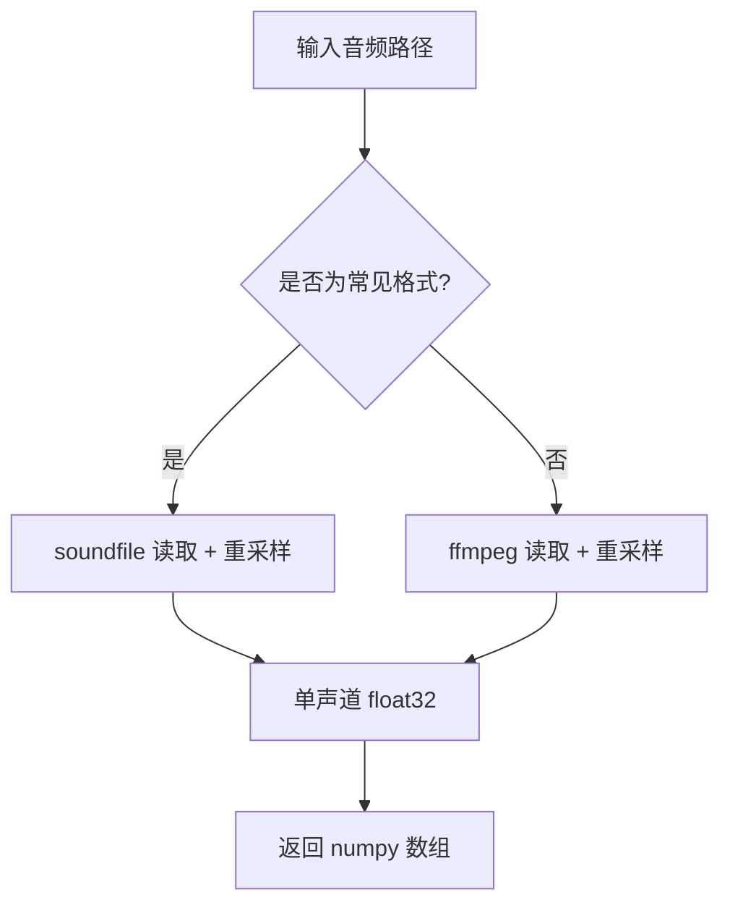
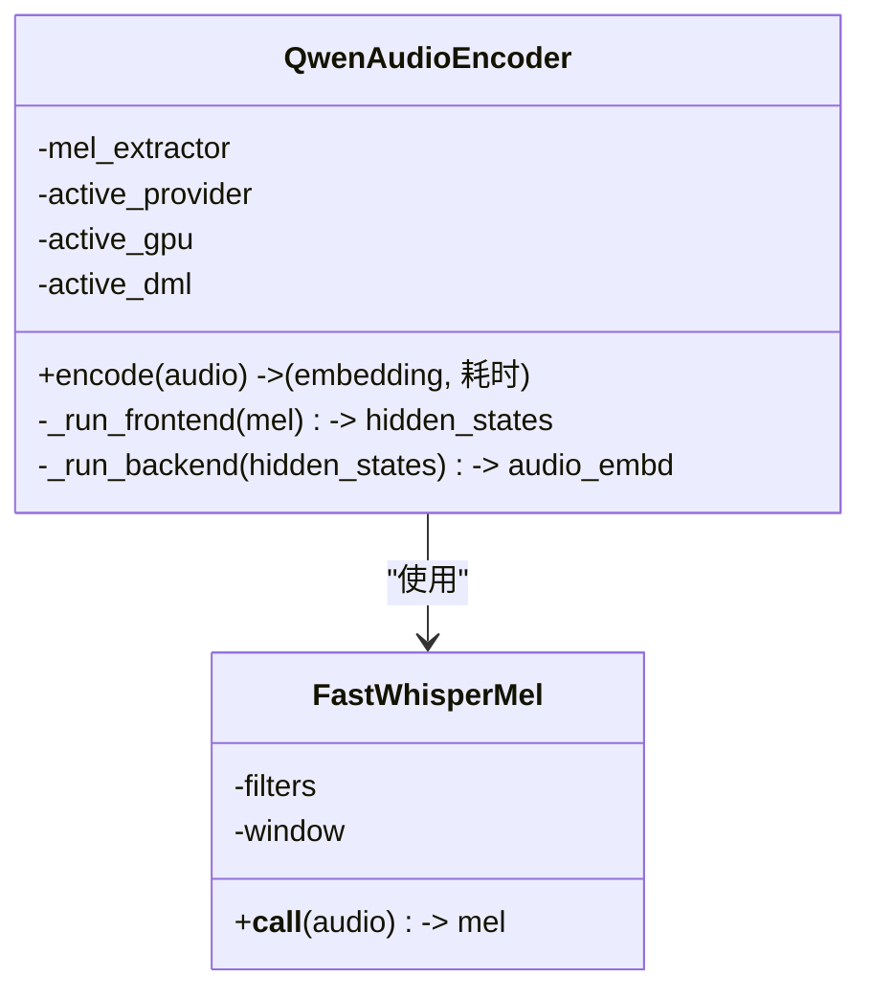
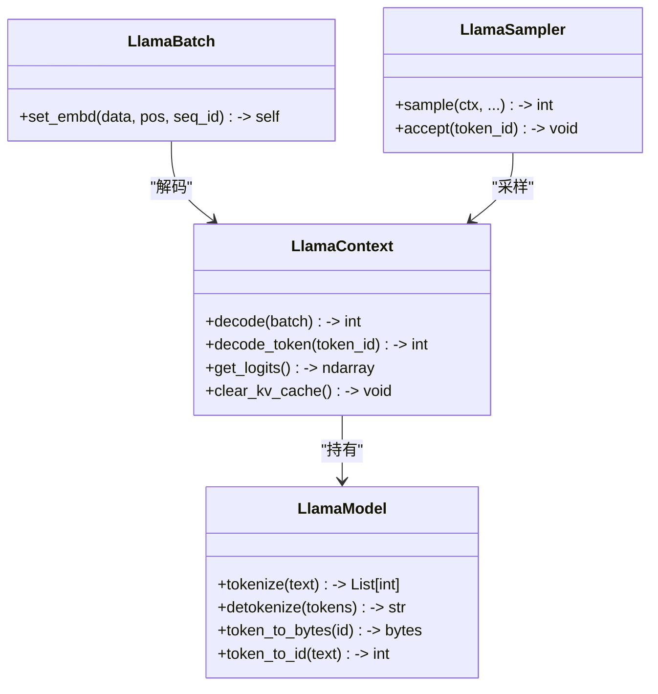
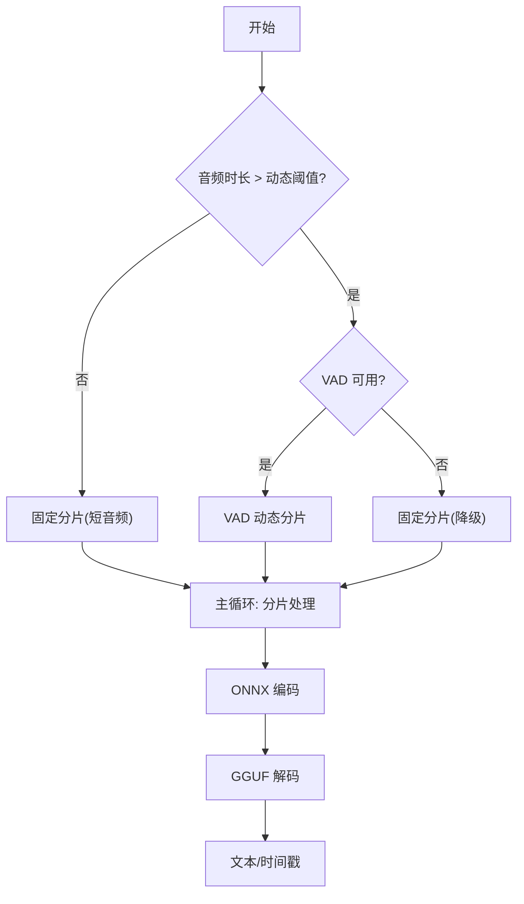
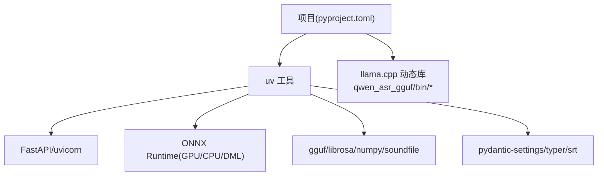

# 本地部署

<cite>
**本文档引用的文件**
- [run.sh](file://run.sh)
- [pyproject.toml](file://pyproject.toml)
- [infer.py](file://infer.py)
- [core/config.py](file://core/config.py)
- [qwen_asr_gguf/inference/asr.py](file://qwen_asr_gguf/inference/asr.py)
- [qwen_asr_gguf/inference/audio.py](file://qwen_asr_gguf/inference/audio.py)
- [qwen_asr_gguf/inference/encoder.py](file://qwen_asr_gguf/inference/encoder.py)
- [qwen_asr_gguf/inference/llama.py](file://qwen_asr_gguf/inference/llama.py)
- [qwen_asr_gguf/inference/utils.py](file://qwen_asr_gguf/inference/utils.py)
- [qwen_asr_gguf/inference/schema.py](file://qwen_asr_gguf/inference/schema.py)
- [README.md](file://README.md)
</cite>

## 目录
1. [简介](#简介)
2. [项目结构](#项目结构)
3. [核心组件](#核心组件)
4. [架构总览](#架构总览)
5. [详细组件分析](#详细组件分析)
6. [依赖分析](#依赖分析)
7. [性能考虑](#性能考虑)
8. [故障排除指南](#故障排除指南)
9. [结论](#结论)
10. [附录](#附录)

## 简介
本指南面向希望在本地部署 Qwen3-ASR GGUF 语音识别服务的用户，覆盖从环境准备、依赖安装、模型与库准备、服务启动、配置与参数、到验证与故障排除的全流程。项目采用“ONNX Encoder + llama.cpp GGUF Decoder”的混合推理架构，支持 GPU 加速（CUDA/Vulkan/ROCm/DirectML）与流式转录，适合长音频与实时场景。

## 项目结构
仓库采用按功能域划分的组织方式，核心目录与职责概览：
- 核心服务与路由：infer.py、core/（配置、中间件、响应、异常）
- 推理引擎：qwen_asr_gguf/inference/（ASR、对齐、音频、编码器、llama.cpp绑定、工具）
- 模型导出与量化脚本：01-07、11-17、21、18、export_config.py 等
- Web 服务入口与脚本：run.sh、Dockerfile、build.spec、build_hook.py、zip_release.py
- 示例与工具：examples/、transcribe.py、utils/file.py
- 参考与第三方：ref/llama.cpp/（构建文档、后端说明）

图表来源
- [infer.py:1-123](file://infer.py#L1-L123)
- [core/config.py:1-109](file://core/config.py#L1-L109)
- [qwen_asr_gguf/inference/asr.py:1-800](file://qwen_asr_gguf/inference/asr.py#L1-L800)
- [qwen_asr_gguf/inference/audio.py:1-149](file://qwen_asr_gguf/inference/audio.py#L1-L149)
- [qwen_asr_gguf/inference/encoder.py:1-280](file://qwen_asr_gguf/inference/encoder.py#L1-L280)
- [qwen_asr_gguf/inference/llama.py:1-800](file://qwen_asr_gguf/inference/llama.py#L1-L800)
- [qwen_asr_gguf/inference/utils.py:1-134](file://qwen_asr_gguf/inference/utils.py#L1-L134)
- [qwen_asr_gguf/inference/schema.py:1-235](file://qwen_asr_gguf/inference/schema.py#L1-L235)

章节来源
- [README.md:316-344](file://README.md#L316-L344)

## 核心组件
- 服务入口与生命周期：FastAPI 应用、中间件注册、全局异常处理、应用生命周期（启动/关闭）。
- 配置系统：命令行参数解析与环境变量映射，统一的 Settings 类。
- ASR 引擎：封装 ONNX Encoder、可选 VAD、可选 Forced Aligner、llama.cpp Decoder。
- 音频处理：ffmpeg/soundfile 双通道加载，重采样与单声道化。
- 编码器：Split Frontend/Backend ONNX 模型，支持 GPU Provider（CUDA/ROCm/TensorRT/Dml）。
- 解码器：llama.cpp Python 绑定，动态加载平台库，上下文/批处理/采样器封装。
- 工具与校验：语言归一化、重复文本修复、支持语言列表。

章节来源
- [infer.py:55-123](file://infer.py#L55-L123)
- [core/config.py:19-109](file://core/config.py#L19-L109)
- [qwen_asr_gguf/inference/asr.py:40-800](file://qwen_asr_gguf/inference/asr.py#L40-L800)
- [qwen_asr_gguf/inference/audio.py:88-149](file://qwen_asr_gguf/inference/audio.py#L88-L149)
- [qwen_asr_gguf/inference/encoder.py:119-280](file://qwen_asr_gguf/inference/encoder.py#L119-L280)
- [qwen_asr_gguf/inference/llama.py:159-800](file://qwen_asr_gguf/inference/llama.py#L159-L800)
- [qwen_asr_gguf/inference/utils.py:5-134](file://qwen_asr_gguf/inference/utils.py#L5-L134)
- [qwen_asr_gguf/inference/schema.py:162-235](file://qwen_asr_gguf/inference/schema.py#L162-L235)

## 架构总览
系统采用“同步顺序执行”架构，核心链路为：音频输入 → 分片/静音过滤 → ONNX Encoder → llama.cpp GGUF Decoder → 可选 Forced Aligner → 输出文本/时间戳。

图表来源
- [infer.py:84-123](file://infer.py#L84-L123)
- [qwen_asr_gguf/inference/asr.py:432-596](file://qwen_asr_gguf/inference/asr.py#L432-L596)
- [qwen_asr_gguf/inference/audio.py:129-149](file://qwen_asr_gguf/inference/audio.py#L129-L149)
- [qwen_asr_gguf/inference/encoder.py:119-280](file://qwen_asr_gguf/inference/encoder.py#L119-L280)
- [qwen_asr_gguf/inference/llama.py:443-549](file://qwen_asr_gguf/inference/llama.py#L443-L549)

## 详细组件分析

### 服务启动与生命周期
- 启动时：打印服务与 GPU 状态，初始化 ASR 服务单例并执行引擎初始化。
- 关闭时：优雅释放资源，关闭 VAD/对齐器等。
- 使用 run.sh 管理服务：支持 start/stop/restart，后台运行并记录 PID 与日志。

图表来源
- [run.sh:9-29](file://run.sh#L9-L29)
- [infer.py:55-82](file://infer.py#L55-L82)

章节来源
- [run.sh:1-63](file://run.sh#L1-L63)
- [infer.py:55-123](file://infer.py#L55-L123)

### 配置系统与参数
- 命令行参数：use_gpu、host、port、base_url、web_secret_key、configs 等。
- 环境变量映射：Settings 类将命令行映射为运行时配置，支持 ASR/VAD/Aligner 默认项。
- GPU 选择：use_gpu 默认基于 torch.cuda.is_available()，可覆盖。

图表来源
- [core/config.py:19-109](file://core/config.py#L19-L109)

章节来源
- [core/config.py:19-109](file://core/config.py#L19-L109)

### 音频加载与重采样
- 优先使用 soundfile 处理常见格式（wav/flac/ogg/mp3）。
- 其他格式（m4a/mp4/opus/wmv 等）通过 ffmpeg 直接读取，支持起止与时长裁剪。
- 统一重采样到目标采样率并转为单声道浮点数组。

图表来源
- [qwen_asr_gguf/inference/audio.py:129-149](file://qwen_asr_gguf/inference/audio.py#L129-L149)
- [qwen_asr_gguf/inference/audio.py:88-126](file://qwen_asr_gguf/inference/audio.py#L88-L126)

章节来源
- [qwen_asr_gguf/inference/audio.py:88-149](file://qwen_asr_gguf/inference/audio.py#L88-L149)

### 编码器（ONNX）
- Split Frontend/Backend：前端循环分块推理，后端 Transformer 支持固定形状与注意力掩码。
- Provider 选择：优先 CUDAExecutionProvider，其次 ROCM/TensorRT，最后 DmlExecutionProvider。
- DirectML 固定形状优化：在 Windows 上填充到固定长度并掩码，减少显存抖动。
- 预热：根据模式预热，动态/固定形状分别处理。

图表来源
- [qwen_asr_gguf/inference/encoder.py:119-280](file://qwen_asr_gguf/inference/encoder.py#L119-L280)

章节来源
- [qwen_asr_gguf/inference/encoder.py:119-280](file://qwen_asr_gguf/inference/encoder.py#L119-L280)

### 解码器（llama.cpp）
- 动态加载平台库：Windows/Linux/macOS 分别加载对应动态库。
- 上下文/批处理/采样器：封装 LlamaModel/LlamaContext/LlamaBatch/LlamaSampler。
- 日志回调：将 llama.cpp 日志路由到 Python logger。

图表来源
- [qwen_asr_gguf/inference/llama.py:443-738](file://qwen_asr_gguf/inference/llama.py#L443-L738)

章节来源
- [qwen_asr_gguf/inference/llama.py:159-800](file://qwen_asr_gguf/inference/llama.py#L159-L800)

### ASR 引擎与流式管线
- 分片策略：短音频单片；长音频启用 VAD 动态分片；VAD 不可用则固定分片。
- 抗幻觉：token 级/短语级重复熔断、max_new_tokens 上限、边界缓冲。
- 统一流水线：_asr_core 生成器，支持一次性与流式两种调用。
- 对齐：可选 Forced Aligner，输出字级时间戳。

图表来源
- [qwen_asr_gguf/inference/asr.py:602-722](file://qwen_asr_gguf/inference/asr.py#L602-L722)

章节来源
- [qwen_asr_gguf/inference/asr.py:432-596](file://qwen_asr_gguf/inference/asr.py#L432-L596)
- [qwen_asr_gguf/inference/asr.py:602-800](file://qwen_asr_gguf/inference/asr.py#L602-L800)

## 依赖分析
- Python 与包管理：使用 uv 管理依赖，支持 extras（cpu/win/cu128），冲突与索引配置明确。
- 运行时依赖：FastAPI、uvicorn、gguf、onnxruntime/onnxruntime-gpu/DirectML、librosa、numpy、soundfile、srt、typer、pydantic/pydantic-settings 等。
- GPU 加速：ONNX Runtime Provider（CUDA/ROCm/TensorRT/Dml），llama.cpp 后端（CUDA/Vulkan/ROCm/Dml）。
- 系统依赖：ffmpeg（音频解码）、CUDA 驱动（可选）。

图表来源
- [pyproject.toml:1-102](file://pyproject.toml#L1-L102)

章节来源
- [pyproject.toml:1-102](file://pyproject.toml#L1-L102)
- [README.md:120-134](file://README.md#L120-L134)

## 性能考虑
- 编码器 GPU Provider：启用 CUDA/ROCm/TensorRT/Dml 可显著降低编码耗时。
- DirectML 固定形状优化：Windows 下固定填充长度并掩码，减少显存抖动。
- VAD 动态分片：长音频自动跳过静音段，减少推理与幻觉。
- 上下文窗口与温度：合理设置 n_ctx、temperature、max_new_tokens。
- 线程与批大小：llama.cpp 上下文线程数与批大小可根据 CPU/GPU 资源调整。

章节来源
- [qwen_asr_gguf/inference/encoder.py:137-196](file://qwen_asr_gguf/inference/encoder.py#L137-L196)
- [qwen_asr_gguf/inference/llama.py:419-441](file://qwen_asr_gguf/inference/llama.py#L419-L441)
- [qwen_asr_gguf/inference/asr.py:351-388](file://qwen_asr_gguf/inference/asr.py#L351-L388)

## 故障排除指南
- ffmpeg 未安装：音频加载会报错，需安装并加入 PATH。
- NVIDIA 动态库路径：启动时自动处理 nvidia-* 路径并重启进程以生效。
- Intel 集显 FP16 溢出：设置环境变量禁用 Vulkan F16。
- CUDA/驱动问题：确认驱动与 CUDA 版本匹配，ONNX Runtime Provider 可回退。
- llama.cpp 库加载失败：确保 qwen_asr_gguf/bin/ 下包含对应平台动态库。
- 服务无法启动：查看 run.sh 生成的日志文件与 PID 文件，确认端口占用。

章节来源
- [qwen_asr_gguf/inference/audio.py:88-96](file://qwen_asr_gguf/inference/audio.py#L88-L96)
- [infer.py:27-52](file://infer.py#L27-L52)
- [README.md:373-382](file://README.md#L373-L382)
- [run.sh:9-29](file://run.sh#L9-L29)

## 结论
本指南提供了 Qwen3-ASR GGUF 本地部署的完整路径：从环境准备、依赖安装、模型与库准备，到服务启动、配置与参数、验证与故障排除。建议优先使用 uv 管理依赖与 extras，结合 ffmpeg 与合适的 GPU Provider，获得最佳性能与稳定性。

## 附录

### 环境准备与依赖安装（uv 工具）
- 安装 uv 并使用 extras：
  - 生产环境（默认）：uv sync --extra cu128
  - CPU 环境：uv sync --extra cpu
  - Windows DirectML：uv sync --extra win
- 安装额外依赖：uv pip install transformers==4.57.6 modelscope accelerate fireredvad
- Python 版本：>= 3.11

章节来源
- [README.md:120-131](file://README.md#L120-L131)
- [pyproject.toml:50-102](file://pyproject.toml#L50-L102)

### 系统依赖与硬件要求
- ffmpeg：用于解码多种音频格式。
- CUDA 驱动（可选）：用于 CUDAExecutionProvider 与 Vulkan。
- 硬件：根据模型规模与量化精度选择合适显存与 CPU/GPU 资源。

章节来源
- [README.md:135-141](file://README.md#L135-L141)

### run.sh 使用方法与参数
- 启动：bash run.sh start
- 停止：bash run.sh stop
- 重启：bash run.sh restart
- 默认监听 0.0.0.0:8002，日志输出到 logs/app.log，PID 写入 logs/app.pid

章节来源
- [run.sh:1-63](file://run.sh#L1-L63)

### 配置文件与环境变量
- 全局配置项（环境变量前缀 ASR_）：
  - ASR_MODEL_DIR、ASR_UPLOAD_DIR、ASR_MAX_FILE_SIZE_MB
  - ASR_ASR_CHUNK_SIZE、ASR_ASR_MEMORY_NUM、ASR_ASR_DYNAMIC_CHUNK_THRESHOLD
  - ASR_DEFAULT_LANGUAGE、ASR_DEFAULT_CONTEXT
  - ASR_ENABLE_VAD、ASR_VAD_MODEL_DIR、ASR_VAD_SPEECH_THRESHOLD、ASR_VAD_MIN_DURATION
  - ASR_ENABLE_ALIGNER、ASR_ALIGNER_USE_GPU
- 命令行参数：--use_gpu/--host/--port/--base_url/--web_secret_key 等

章节来源
- [core/config.py:52-109](file://core/config.py#L52-L109)
- [README.md:228-261](file://README.md#L228-L261)

### 启动服务与验证
- 启动：bash run.sh start
- 访问：http://<host>:<port>/docs 查看 API 文档
- 停止：bash run.sh stop

章节来源
- [infer.py:104-111](file://infer.py#L104-L111)
- [run.sh:9-29](file://run.sh#L9-L29)

### 不同操作系统部署要点
- Windows：
  - 下载对应平台 llama.cpp 预编译包，将动态库放入 qwen_asr_gguf/bin/
  - DirectML Provider 可用，支持固定形状优化
- Linux：
  - 推荐 CUDA/ROCm，确保驱动与 CUDA 版本匹配
- macOS：
  - 使用 Metal/ROCm 后端（如可用），注意动态库路径

章节来源
- [README.md:135-141](file://README.md#L135-L141)
- [qwen_asr_gguf/inference/llama.py:183-194](file://qwen_asr_gguf/inference/llama.py#L183-L194)