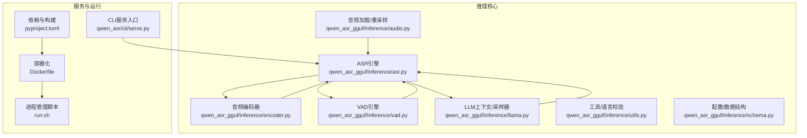
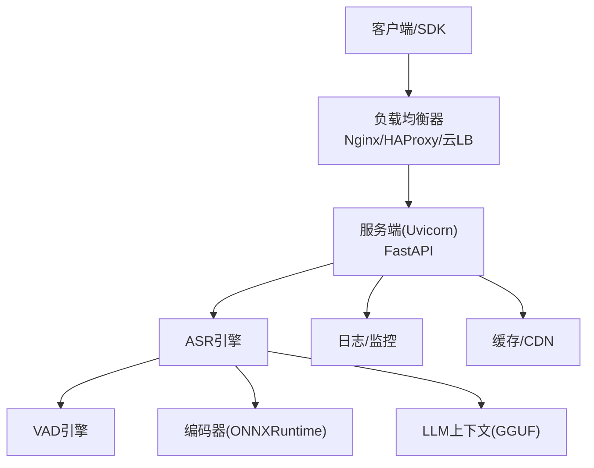
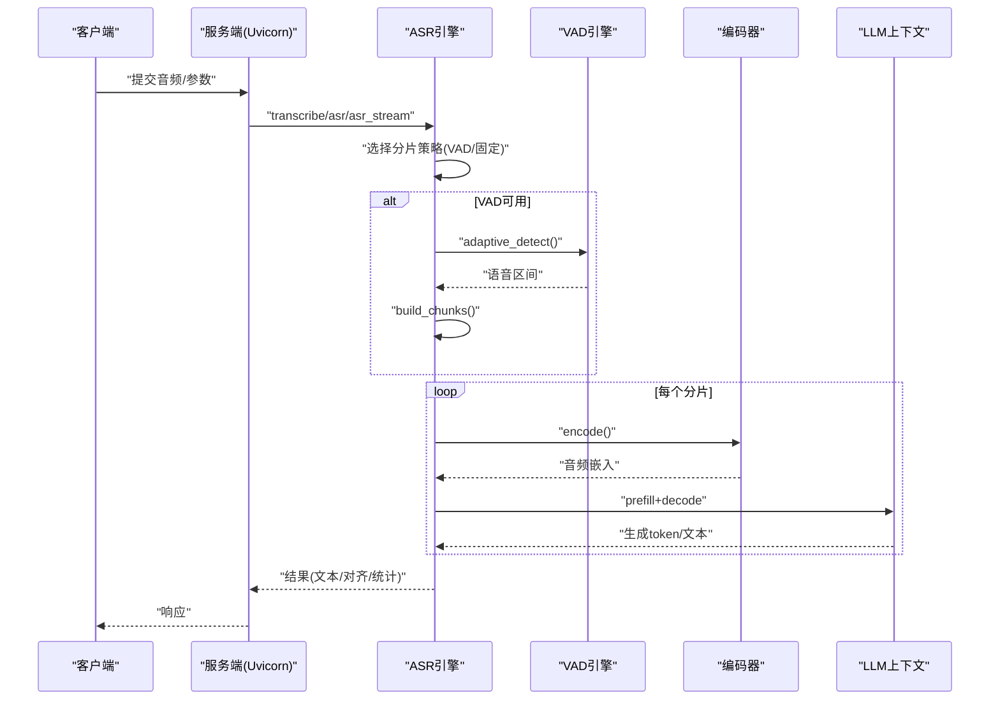
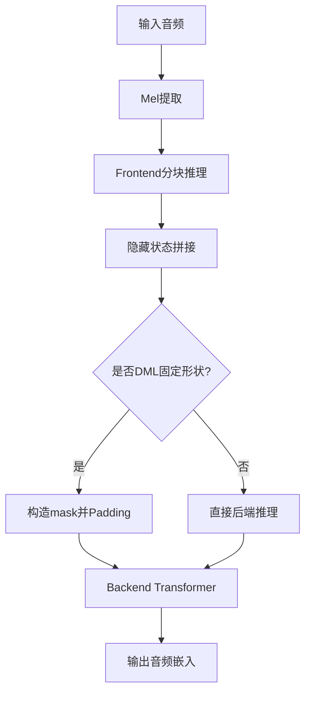
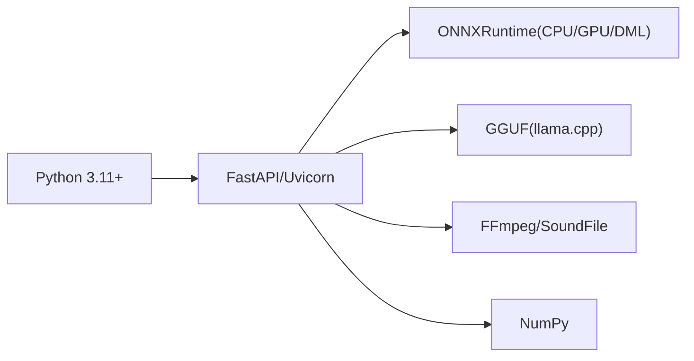

# 生产环境优化

<cite>
**本文档引用的文件**
- [main.py](file://main.py)
- [qwen_asr_gguf/inference/asr.py](file://qwen_asr_gguf/inference/asr.py)
- [qwen_asr_gguf/inference/audio.py](file://qwen_asr_gguf/inference/audio.py)
- [qwen_asr_gguf/inference/utils.py](file://qwen_asr_gguf/inference/utils.py)
- [qwen_asr_gguf/inference/schema.py](file://qwen_asr_gguf/inference/schema.py)
- [qwen_asr_gguf/inference/llama.py](file://qwen_asr_gguf/inference/llama.py)
- [qwen_asr_gguf/inference/encoder.py](file://qwen_asr_gguf/inference/encoder.py)
- [qwen_asr_gguf/inference/vad.py](file://qwen_asr_gguf/inference/vad.py)
- [qwen_asr_gguf/inference/chinese_itn.py](file://qwen_asr_gguf/inference/chinese_itn.py)
- [qwen_asr/cli/serve.py](file://qwen_asr/cli/serve.py)
- [pyproject.toml](file://pyproject.toml)
- [Dockerfile](file://Dockerfile)
- [run.sh](file://run.sh)
</cite>

## 目录
1. [简介](#简介)
2. [项目结构](#项目结构)
3. [核心组件](#核心组件)
4. [架构总览](#架构总览)
5. [详细组件分析](#详细组件分析)
6. [依赖分析](#依赖分析)
7. [性能考量](#性能考量)
8. [故障排查指南](#故障排查指南)
9. [结论](#结论)
10. [附录](#附录)

## 简介
本指南面向Qwen3-ASR GGUF在生产环境的部署与优化，围绕性能调优参数（并发连接数、线程池大小、内存分配）、GPU资源优化（显存管理、批处理大小、推理加速）、负载均衡（Nginx、HAProxy、云负载均衡器）、缓存与CDN策略、监控指标与日志、性能基准测试、容量规划与成本优化、以及高可用配置（多节点、故障转移、备份策略）等方面，结合代码实现给出可落地的建议与最佳实践。

## 项目结构
该项目采用模块化组织，核心推理流水线位于qwen_asr_gguf/inference目录，包含音频预处理、VAD、编码器（ONNXRuntime）、LLM（GGUF via llama.cpp绑定）、以及结果后处理等模块。服务侧通过FastAPI对外提供接口，容器化与依赖管理通过Dockerfile与pyproject.toml完成。

**图表来源**
- [qwen_asr_gguf/inference/asr.py:1-893](file://qwen_asr_gguf/inference/asr.py#L1-L893)
- [qwen_asr_gguf/inference/encoder.py:1-280](file://qwen_asr_gguf/inference/encoder.py#L1-L280)
- [qwen_asr_gguf/inference/vad.py:1-467](file://qwen_asr_gguf/inference/vad.py#L1-L467)
- [qwen_asr_gguf/inference/llama.py:1-992](file://qwen_asr_gguf/inference/llama.py#L1-L992)
- [qwen_asr_gguf/inference/audio.py:1-149](file://qwen_asr_gguf/inference/audio.py#L1-L149)
- [qwen_asr_gguf/inference/utils.py:1-134](file://qwen_asr_gguf/inference/utils.py#L1-L134)
- [qwen_asr_gguf/inference/schema.py:1-235](file://qwen_asr_gguf/inference/schema.py#L1-L235)
- [qwen_asr/cli/serve.py:1-46](file://qwen_asr/cli/serve.py#L1-L46)
- [pyproject.toml:1-102](file://pyproject.toml#L1-L102)
- [Dockerfile:1-66](file://Dockerfile#L1-L66)
- [run.sh:1-63](file://run.sh#L1-L63)

**章节来源**
- [pyproject.toml:1-102](file://pyproject.toml#L1-L102)
- [Dockerfile:1-66](file://Dockerfile#L1-L66)
- [run.sh:1-63](file://run.sh#L1-L63)

## 核心组件
- ASR引擎：负责整体流水线编排，包含VAD动态分片、编码器、LLM解码、对齐与后处理。
- 编码器：Split Frontend/Backend（ONNXRuntime），支持GPU/CPU Provider自动选择与固定/动态形状模式。
- VAD引擎：FireRedVAD封装，提供自适应阈值与分片构建能力。
- LLM上下文与采样器：基于llama.cpp的Python绑定，提供线程、批大小、KV缓存等参数控制。
- 音频处理：FFmpeg/soundfile双通道加载与高质量重采样。
- 配置与数据结构：集中定义ASR引擎、VAD、对齐器的配置项与结果结构。

**章节来源**
- [qwen_asr_gguf/inference/asr.py:1-893](file://qwen_asr_gguf/inference/asr.py#L1-L893)
- [qwen_asr_gguf/inference/encoder.py:1-280](file://qwen_asr_gguf/inference/encoder.py#L1-L280)
- [qwen_asr_gguf/inference/vad.py:1-467](file://qwen_asr_gguf/inference/vad.py#L1-L467)
- [qwen_asr_gguf/inference/llama.py:1-992](file://qwen_asr_gguf/inference/llama.py#L1-L992)
- [qwen_asr_gguf/inference/audio.py:1-149](file://qwen_asr_gguf/inference/audio.py#L1-L149)
- [qwen_asr_gguf/inference/schema.py:1-235](file://qwen_asr_gguf/inference/schema.py#L1-L235)

## 架构总览
下图展示生产环境的关键组件与交互：客户端/网关通过负载均衡接入服务端（Uvicorn+FastAPI），服务端调用ASR引擎，引擎内部协调VAD、编码器与LLM上下文，最终返回转写结果。

[本图为概念性架构示意，不直接映射具体源码文件]

## 详细组件分析

### ASR引擎与推理流水线
- 动态分片策略：长音频启用VAD自适应分片，短音频直接一次性处理；固定分片模式用于边界缓冲与上下文拼接。
- 抗幻觉机制：token级与短语级重复熔断、max_new_tokens上限、KV缓存清理。
- 性能统计：预填充/生成耗时、吞吐、RTF等指标采集。

**图表来源**
- [qwen_asr_gguf/inference/asr.py:602-893](file://qwen_asr_gguf/inference/asr.py#L602-L893)
- [qwen_asr_gguf/inference/vad.py:160-406](file://qwen_asr_gguf/inference/vad.py#L160-L406)
- [qwen_asr_gguf/inference/encoder.py:260-280](file://qwen_asr_gguf/inference/encoder.py#L260-L280)
- [qwen_asr_gguf/inference/llama.py:487-548](file://qwen_asr_gguf/inference/llama.py#L487-L548)

**章节来源**
- [qwen_asr_gguf/inference/asr.py:432-893](file://qwen_asr_gguf/inference/asr.py#L432-L893)

### 编码器（ONNXRuntime）
- Provider选择：优先CUDA/ROCm/TensorRT/DirectML，回退CPU。
- 固定/动态形状：固定形状用于DML优化，动态形状减少冗余计算。
- 前后端流水线：Frontend分块推理+拼接，Backend Transformer+Mask。

**图表来源**
- [qwen_asr_gguf/inference/encoder.py:198-280](file://qwen_asr_gguf/inference/encoder.py#L198-L280)

**章节来源**
- [qwen_asr_gguf/inference/encoder.py:1-280](file://qwen_asr_gguf/inference/encoder.py#L1-L280)

### VAD引擎
- 自适应阈值：基于帧级概率分布计算30%分位数，避免固定阈值在不同信噪比环境下的误判。
- 分片构建：合并邻近语音段、贪心打包、插入静音分片，保证覆盖全时域。

**章节来源**
- [qwen_asr_gguf/inference/vad.py:160-406](file://qwen_asr_gguf/inference/vad.py#L160-L406)

### LLM上下文与采样器（GGUF）
- 线程配置：默认n_threads≈CPU核数/2，n_threads_batch≈CPU核数，可根据CPU/GPU混合场景调整。
- 批大小与ubatch：n_batch/n_ubatch影响吞吐与延迟权衡。
- KV缓存：decode前clear_kv_cache，避免跨请求污染。

**章节来源**
- [qwen_asr_gguf/inference/llama.py:487-548](file://qwen_asr_gguf/inference/llama.py#L487-L548)

### 音频加载与重采样
- FFmpeg优先：支持广泛格式；fallback到soundfile+resample_poly。
- 重采样：polyphase实现，高质量且与scipy对齐度高。

**章节来源**
- [qwen_asr_gguf/inference/audio.py:1-149](file://qwen_asr_gguf/inference/audio.py#L1-L149)

### 配置与数据结构
- ASREngineConfig：模型路径、GPU开关、上下文窗口、分片时长、记忆窗口、VAD阈值等。
- VADConfig：平滑窗口、阈值、最短语音/静音、边界扩展、分片上限等。
- 对齐器配置：前后端模型、上下文窗口、填充策略。

**章节来源**
- [qwen_asr_gguf/inference/schema.py:162-235](file://qwen_asr_gguf/inference/schema.py#L162-L235)

## 依赖分析
- Python运行时与Web框架：FastAPI、Uvicorn。
- 推理后端：GGUF（llama.cpp绑定）、ONNXRuntime（CPU/GPU/DML）。
- 音频处理：FFmpeg、SoundFile、NumPy。
- 可选：Transformers、vLLM（CLI服务入口）。

**图表来源**
- [pyproject.toml:1-23](file://pyproject.toml#L1-L23)
- [Dockerfile:1-66](file://Dockerfile#L1-L66)

**章节来源**
- [pyproject.toml:1-102](file://pyproject.toml#L1-L102)
- [Dockerfile:1-66](file://Dockerfile#L1-L66)

## 性能考量

### 并发连接数与线程池
- Uvicorn工作进程：通过run.sh的--timeout-keep-alive与宿主系统ulimit配合，控制长连接存活与并发上限。
- 线程配置（LLM上下文）：n_threads≈CPU核数/2，n_threads_batch≈CPU核数；GPU场景可适当提高batch线程数。
- ONNXRuntime：SessionOptions禁用spinning，GraphOptimizationLevel设为全开，提升静态图性能。

**章节来源**
- [run.sh:24-28](file://run.sh#L24-L28)
- [qwen_asr_gguf/inference/llama.py:487-548](file://qwen_asr_gguf/inference/llama.py#L487-L548)
- [qwen_asr_gguf/inference/encoder.py:130-136](file://qwen_asr_gguf/inference/encoder.py#L130-L136)

### 内存分配策略
- KV缓存：每次decode前clear_kv_cache，避免跨请求KV累积导致显存/内存膨胀。
- 上下文窗口（n_ctx）：根据音频时长与语言密度设定，避免越界触发断言。
- 批大小（n_batch/n_ubatch）：在吞吐与延迟间折中，大batch提升吞吐但增加首token延迟。

**章节来源**
- [qwen_asr_gguf/inference/llama.py:541-544](file://qwen_asr_gguf/inference/llama.py#L541-L544)
- [qwen_asr_gguf/inference/llama.py:487-502](file://qwen_asr_gguf/inference/llama.py#L487-L502)

### GPU资源优化
- Provider选择：CUDA/ROCm/TensorRT优先，DML用于Windows DirectML；未检测到GPU时自动回退CPU。
- 固定形状优化：DML场景下固定pad_to可减少动态形状带来的额外开销。
- 显存管理：合理设置n_batch与上下文窗口，避免OOM；必要时降低分片时长或温度。

**章节来源**
- [qwen_asr_gguf/inference/encoder.py:137-164](file://qwen_asr_gguf/inference/encoder.py#L137-L164)
- [qwen_asr_gguf/inference/encoder.py:186-196](file://qwen_asr_gguf/inference/encoder.py#L186-L196)

### 批处理大小与推理加速
- 分片策略：长音频启用VAD动态分片，仅对含语音片段进行ASR，显著降低无效计算。
- 边界缓冲：固定分片模式在非末尾分片追加1秒音频，提升边界词完整性。
- 温度与采样：温度升高提升多样性但降低稳定性，建议默认0.0；必要时动态调整。

**章节来源**
- [qwen_asr_gguf/inference/asr.py:666-774](file://qwen_asr_gguf/inference/asr.py#L666-L774)
- [qwen_asr_gguf/inference/llama.py:635-738](file://qwen_asr_gguf/inference/llama.py#L635-L738)

### 负载均衡配置
- Nginx：反向代理至多个Uvicorn实例，启用健康检查与慢日志；静态资源走CDN。
- HAProxy：基于权重的多实例部署，支持动态扩缩容与故障摘除。
- 云负载均衡器：按地域/可用区部署多副本，结合WAF与DDoS防护。

[本节为通用实践说明，不直接映射具体源码文件]

### 缓存策略与CDN
- 缓存：对热点音频/转写结果做短期缓存（Redis/Memcached），Key包含音频指纹与参数。
- CDN：静态模型文件与日志上传OSS/CDN，缩短全球访问延迟。

[本节为通用实践说明，不直接映射具体源码文件]

### 监控指标与日志
- 指标：QPS、P95/P99延迟、RTF、VAD跳过率、编码/解码耗时、OOM/超时次数。
- 日志：按请求ID聚合，区分INFO/WARN/ERROR；接入集中式日志系统（ELK/OTel）。

[本节为通用实践说明，不直接映射具体源码文件]

### 性能基准测试
- 基准集：多语言、多时长、多噪声场景；对比不同分片策略、批大小、线程数。
- 方法：固定随机种子，多次运行取均值与方差；记录首token延迟与总体吞吐。

[本节为通用实践说明，不直接映射具体源码文件]

### 容量规划与成本优化
- CPU/GPU混合：高并发场景优先GPU，CPU场景优化批大小与线程数。
- 成本优化：冷热分离、弹性伸缩、模型量化与蒸馏；按峰值与P95带宽规划。

[本节为通用实践说明，不直接映射具体源码文件]

### 高可用配置
- 多节点：多副本部署，共享存储/对象存储存放模型与日志。
- 故障转移：健康检查失败自动摘除，流量切换至健康节点。
- 备份策略：定期备份模型权重与配置，演练恢复流程。

[本节为通用实践说明，不直接映射具体源码文件]

## 故障排查指南
- VAD加载失败：确认fireredvad安装与模型路径；检查use_gpu与Provider可用性。
- ONNXRuntime Provider不可用：检查CUDA/ROCm/TensorRT/DML驱动与版本；回退CPU。
- LLM上下文初始化失败：检查n_ctx/n_batch/n_threads配置；确认模型文件可读。
- FFmpeg缺失：容器内安装ffmpeg或使用soundfile路径回退。
- OOM/性能抖动：降低n_batch、减小分片时长、清理KV缓存、检查显存占用。

**章节来源**
- [qwen_asr_gguf/inference/vad.py:51-80](file://qwen_asr_gguf/inference/vad.py#L51-L80)
- [qwen_asr_gguf/inference/encoder.py:137-164](file://qwen_asr_gguf/inference/encoder.py#L137-L164)
- [qwen_asr_gguf/inference/llama.py:516-518](file://qwen_asr_gguf/inference/llama.py#L516-L518)
- [qwen_asr_gguf/inference/audio.py:88-96](file://qwen_asr_gguf/inference/audio.py#L88-L96)

## 结论
通过在生产环境中合理配置并发与线程、优化GPU资源与批处理、采用VAD动态分片与缓存策略、完善监控与高可用方案，可显著提升Qwen3-ASR GGUF的吞吐与稳定性。建议结合业务场景进行基准测试与容量规划，持续迭代参数与架构。

## 附录

### 服务与容器化要点
- 容器镜像：基于python:3.11-slim，启用阿里云Debian源与PyPI镜像，提升下载稳定性。
- 依赖安装：uv sync + 指定GPU extras（cu128），再拷贝项目代码。
- 进程管理：run.sh使用nohup与PID文件，支持start/stop/restart。

**章节来源**
- [Dockerfile:1-66](file://Dockerfile#L1-L66)
- [run.sh:1-63](file://run.sh#L1-L63)