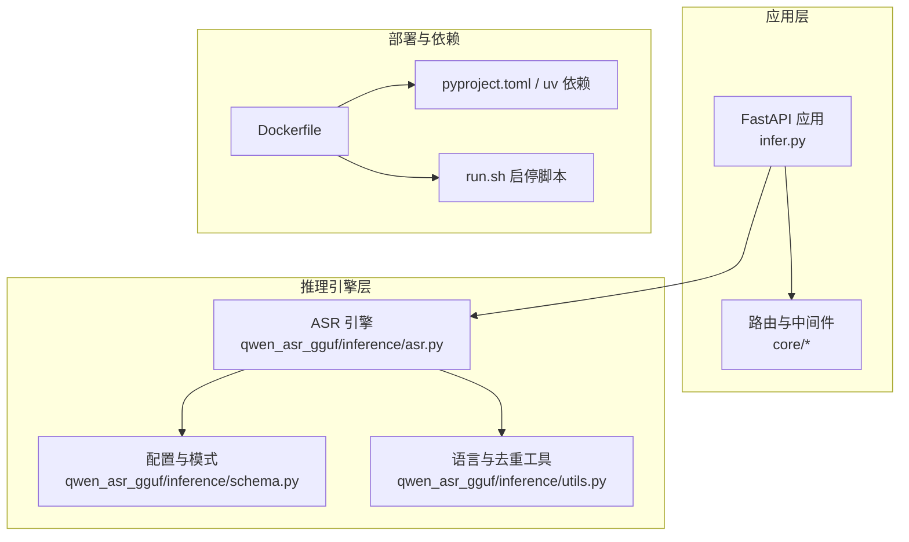
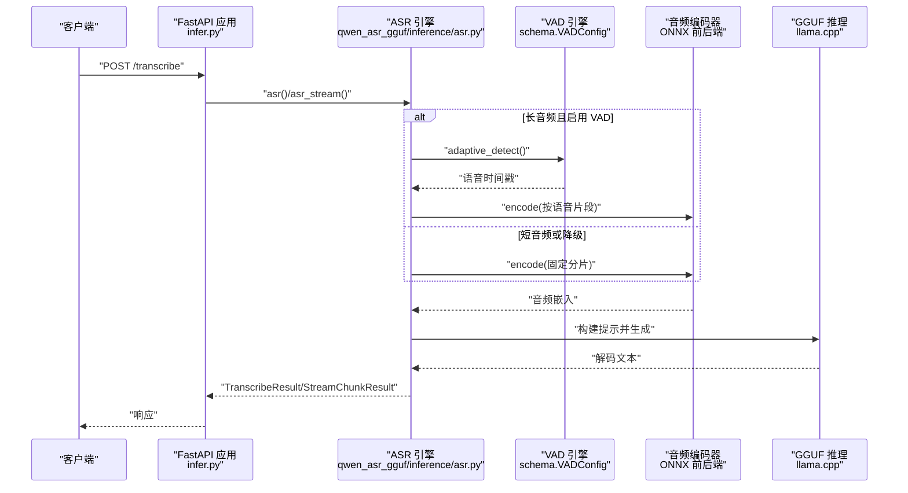
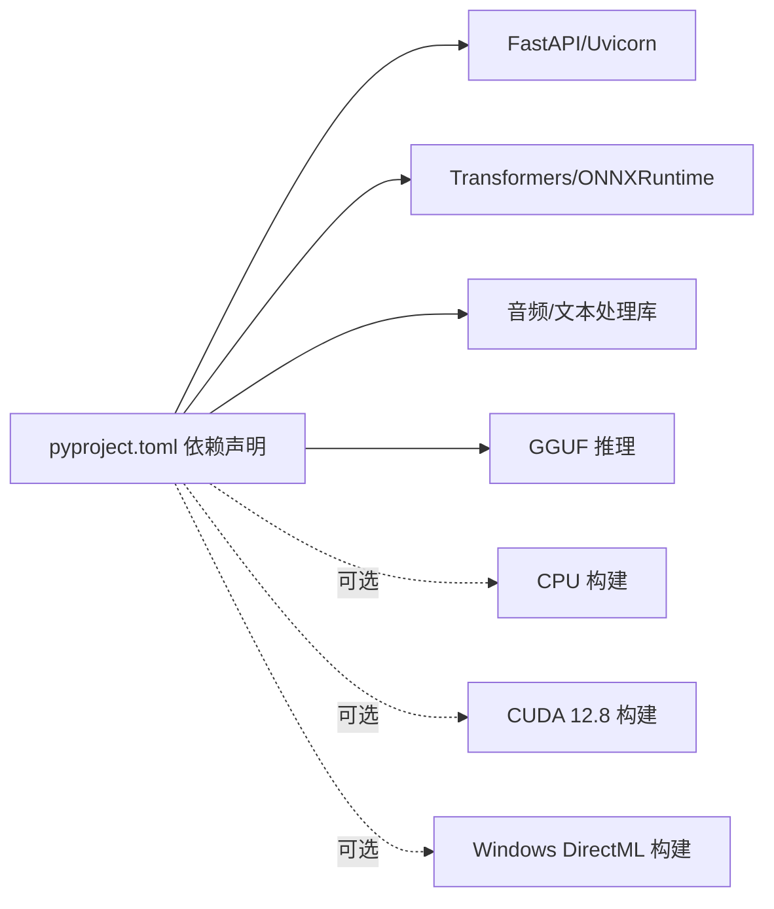

# 部署指南

<cite>
**本文引用的文件**   
- [Dockerfile](file://Dockerfile)
- [pyproject.toml](file://pyproject.toml)
- [run.sh](file://run.sh)
- [infer.py](file://infer.py)
- [main.py](file://main.py)
- [qwen_asr/__main__.py](file://qwen_asr/__main__.py)
- [core/config.py](file://core/config.py)
- [qwen_asr_gguf/inference/asr.py](file://qwen_asr_gguf/inference/asr.py)
- [qwen_asr_gguf/inference/schema.py](file://qwen_asr_gguf/inference/schema.py)
- [qwen_asr_gguf/inference/utils.py](file://qwen_asr_gguf/inference/utils.py)
</cite>

## 目录
1. [简介](#简介)
2. [项目结构](#项目结构)
3. [核心组件](#核心组件)
4. [架构总览](#架构总览)
5. [详细组件分析](#详细组件分析)
6. [依赖分析](#依赖分析)
7. [性能考虑](#性能考虑)
8. [故障排查指南](#故障排查指南)
9. [结论](#结论)
10. [附录](#附录)

## 简介
本指南面向在本地、容器与 Kubernetes 环境中部署 Qwen3-ASR GGUF 的工程团队与运维人员。内容覆盖环境准备（硬件与驱动）、依赖配置、Docker 镜像构建与容器启动、生产级性能调优与资源限制、监控与健康检查、高可用与灾难恢复策略，以及单机、分布式与云原生部署的最佳实践。

## 项目结构
该项目采用“核心服务 + 推理引擎 + 导出与转换工具”的分层组织方式：
- 核心服务层：FastAPI 应用、中间件、配置与异常处理
- 推理引擎层：基于 GGUF 的语音识别与强制对齐实现
- 导出与转换层：HF 模型到 GGUF 的转换脚本与工具
- 部署层：Dockerfile、uv 依赖管理、启动脚本与运行入口

图表来源
- [infer.py:1-123](file://infer.py#L1-L123)
- [qwen_asr_gguf/inference/asr.py:1-800](file://qwen_asr_gguf/inference/asr.py#L1-L800)
- [qwen_asr_gguf/inference/schema.py:1-235](file://qwen_asr_gguf/inference/schema.py#L1-L235)
- [qwen_asr_gguf/inference/utils.py:1-134](file://qwen_asr_gguf/inference/utils.py#L1-L134)
- [Dockerfile:1-66](file://Dockerfile#L1-L66)
- [pyproject.toml:1-102](file://pyproject.toml#L1-L102)
- [run.sh:1-63](file://run.sh#L1-L63)

章节来源
- [Dockerfile:1-66](file://Dockerfile#L1-L66)
- [pyproject.toml:1-102](file://pyproject.toml#L1-L102)
- [run.sh:1-63](file://run.sh#L1-L63)
- [infer.py:1-123](file://infer.py#L1-L123)
- [core/config.py:1-109](file://core/config.py#L1-L109)
- [qwen_asr_gguf/inference/asr.py:1-800](file://qwen_asr_gguf/inference/asr.py#L1-L800)
- [qwen_asr_gguf/inference/schema.py:1-235](file://qwen_asr_gguf/inference/schema.py#L1-L235)
- [qwen_asr_gguf/inference/utils.py:1-134](file://qwen_asr_gguf/inference/utils.py#L1-L134)

## 核心组件
- FastAPI 应用与生命周期：应用在启动时初始化 ASR 服务单例并在关闭时优雅释放资源；注册访问日志、鉴权与请求 ID 中间件；自动加载路由模块。
- ASR 引擎：集成 VAD 动态分片、编码器（ONNX 前后端）、对齐器（可选）与 GGUF LLaMA 推理上下文；支持一次性与流式转写。
- 配置系统：通过命令行参数与 Pydantic Settings 统一管理主机、端口、模型路径、上传目录、VAD/对齐器参数等。
- 依赖与镜像：使用 uv 管理 Python 依赖，Dockerfile 中指定 cu128 可选依赖以启用 CUDA/GPU 加速。

章节来源
- [infer.py:55-82](file://infer.py#L55-L82)
- [infer.py:92-101](file://infer.py#L92-L101)
- [core/config.py:19-47](file://core/config.py#L19-L47)
- [core/config.py:52-109](file://core/config.py#L52-L109)
- [qwen_asr_gguf/inference/asr.py:40-102](file://qwen_asr_gguf/inference/asr.py#L40-L102)
- [qwen_asr_gguf/inference/schema.py:162-210](file://qwen_asr_gguf/inference/schema.py#L162-L210)

## 架构总览
下图展示从客户端到推理引擎的典型调用链路，以及 GPU/CPU 与 ONNXRuntime 的关系。

图表来源
- [infer.py:104-111](file://infer.py#L104-L111)
- [qwen_asr_gguf/inference/asr.py:432-514](file://qwen_asr_gguf/inference/asr.py#L432-L514)
- [qwen_asr_gguf/inference/asr.py:602-774](file://qwen_asr_gguf/inference/asr.py#L602-L774)
- [qwen_asr_gguf/inference/schema.py:88-113](file://qwen_asr_gguf/inference/schema.py#L88-L113)

## 详细组件分析

### 本地部署（Python 环境）
- 环境准备
  - Python 版本要求：项目要求 Python >= 3.11。
  - 依赖安装：使用 uv 管理依赖，支持 cpu、cu128、win 三类可选依赖，分别对应 CPU、CUDA 12.8 与 DirectML（Windows）。
  - GPU 加速：如需 CUDA/GPU，请选择 cu128 可选依赖并确保驱动与 CUDA 运行时匹配。
- 启动方式
  - 直接运行：通过 uvicorn 启动 FastAPI 应用，支持主机、端口与 GPU 开关等参数。
  - 进程管理：run.sh 提供 start/stop/restart，便于后台守护与日志输出。
- 关键配置
  - 主机与端口：可通过命令行参数或环境变量设置。
  - 模型与数据目录：默认 ./models 与 ./datasets，可通过配置项修改。
  - VAD 与对齐器：默认在长音频场景自动启用 VAD，对齐器可按需开启。

章节来源
- [pyproject.toml:6-23](file://pyproject.toml#L6-L23)
- [pyproject.toml:28-48](file://pyproject.toml#L28-L48)
- [pyproject.toml:50-102](file://pyproject.toml#L50-L102)
- [run.sh:9-29](file://run.sh#L9-L29)
- [run.sh:31-41](file://run.sh#L31-L41)
- [core/config.py:19-47](file://core/config.py#L19-L47)
- [core/config.py:52-109](file://core/config.py#L52-L109)

### Docker 容器化部署
- 镜像构建
  - 基础镜像：使用官方 Python slim 镜像，配置阿里云 Debian 源与 CA 证书。
  - 系统依赖：安装 curl、procps、ffmpeg、ca-certificates 等。
  - 依赖安装：使用 uv 安装项目依赖，指定 cu128 可选依赖以启用 CUDA。
  - 工作目录与权限：创建工作目录与日志目录，赋予 run.sh 可执行权限。
  - 端口暴露：FastAPI 默认监听 8001（Dockerfile），实际运行时可通过 run.sh 的 --port 参数覆盖。
- 容器启动
  - CMD：默认执行 bash run.sh start。
  - 端口映射：建议将容器端口 8001 映射到宿主机端口（如 8002）。
  - 卷挂载：建议挂载以下目录：
    - 模型目录：/workspace/models
    - 日志目录：/workspace/logs
    - 数据集目录：/workspace/datasets
    - 上传目录：/workspace/uploads（如需文件上传）
- GPU 支持
  - 若宿主机具备 NVIDIA 驱动与 CUDA 运行时，可在构建时选择 cu128 可选依赖；容器运行时需挂载驱动与 nvidia-cuda 运行时库（由 _setup_nvidia_paths 处理）。

章节来源
- [Dockerfile:1-66](file://Dockerfile#L1-L66)
- [infer.py:27-52](file://infer.py#L27-L52)
- [run.sh:4-7](file://run.sh#L4-L7)

### Kubernetes 集群部署
- 资源对象建议
  - Deployment：定义副本数、容器镜像、端口、环境变量与卷挂载。
  - Service：ClusterIP/LoadBalancer 以暴露服务。
  - ConfigMap：存放运行参数（如 HOST、PORT、MODEL_DIR 等）。
  - Secret：存放敏感配置（如鉴权密钥）。
  - PersistentVolume/PersistentVolumeClaim：为模型与日志目录提供持久化存储。
- 资源限制与探针
  - requests/limits：为 CPU 与内存设定合理配额，GPU 可通过 devicePlugins 与资源名进行限制。
  - livenessProbe/readinessProbe：基于 HTTP GET /，超时与周期可根据服务响应时间调整。
- 高可用与弹性
  - 副本数：至少 2 个以上副本以实现滚动更新与故障切换。
  - PodDisruptionBudget：限制不可用副本数，保障服务可用性。
  - HPA：基于 CPU/内存或自定义指标实现水平扩展。
- 网络与安全
  - Ingress：统一入口与 TLS 终止。
  - NetworkPolicy：限制入站/出站流量。
  - RBAC：最小权限原则授予 Pod。

（本节为概念性部署建议，不直接分析具体文件）

### 性能调优与资源限制
- 推理优化
  - VAD 动态分片：长音频自动启用 VAD，跳过静音片段，显著降低 RTF。
  - 上下文窗口与温度：根据音频时长与稳定性需求调整 n_ctx 与 temperature。
  - 边界缓冲：固定分片模式下对非末尾分片追加 1 秒音频，提升边界词完整性。
- 系统与容器层面
  - CPU/内存：为 uvicorn worker 与模型推理分配足够资源，避免 OOM。
  - GPU：确保驱动与 CUDA 运行时版本匹配；在容器内正确挂载驱动库。
  - I/O：将模型与日志目录挂载到高性能磁盘；避免频繁小文件写入。
- 监控与日志
  - 访问日志：通过自定义中间件输出结构化访问日志。
  - 性能指标：记录预填充与生成阶段耗时、RTF、吞吐量等。

章节来源
- [qwen_asr_gguf/inference/asr.py:602-774](file://qwen_asr_gguf/inference/asr.py#L602-L774)
- [qwen_asr_gguf/inference/asr.py:351-388](file://qwen_asr_gguf/inference/asr.py#L351-L388)
- [infer.py:92-96](file://infer.py#L92-L96)

### 部署验证、健康检查与故障恢复
- 健康检查
  - HTTP 探针：GET / 返回服务元信息，可用于存活/就绪探针。
  - 日志检查：run.sh 输出 app.log，定位启动与运行问题。
- 故障恢复
  - 进程守护：run.sh 基于 PID 文件管理进程，支持 stop/restart。
  - 资源回收：FastAPI lifespan 在关闭时释放 ASR 服务资源。
  - NVIDIA 路径：_setup_nvidia_paths 在动态库路径变更时重启进程以生效。

章节来源
- [infer.py:104-111](file://infer.py#L104-L111)
- [run.sh:9-29](file://run.sh#L9-L29)
- [run.sh:31-41](file://run.sh#L31-L41)
- [infer.py:27-52](file://infer.py#L27-L52)

## 依赖分析
- 语言与框架
  - Python >= 3.11，FastAPI + Uvicorn，Pydantic Settings，loguru。
- 推理与音频
  - librosa、soundfile、sentencepiece、nagisa、srt。
- 模型与后端
  - gguf、onnxruntime（CPU/GPU 可选）、transformers（可选）。
- 可选依赖
  - cpu：torch vision audio + onnxruntime
  - cu128：torch vision audio + onnxruntime-gpu
  - win：torch vision audio + onnxruntime-directml

图表来源
- [pyproject.toml:7-23](file://pyproject.toml#L7-L23)
- [pyproject.toml:28-48](file://pyproject.toml#L28-L48)

章节来源
- [pyproject.toml:1-102](file://pyproject.toml#L1-L102)

## 性能考虑
- 推理路径优化
  - VAD 动态分片：长音频自动启用，跳过静音，降低 RTF。
  - 上下文记忆：保留前 N 片文本作为上下文，避免非连续音频拼接导致的模型混乱。
  - 温度与采样：逐步提高温度重试，缓解重复与幻觉。
- 系统与容器
  - 合理设置 n_ctx、batch 与 max_new_tokens，避免越界与崩溃。
  - GPU/CPU 选择：根据硬件能力选择 cu128 或 cpu 可选依赖。
  - I/O 与网络：减少磁盘写放大，优化网络延迟。

章节来源
- [qwen_asr_gguf/inference/asr.py:212-346](file://qwen_asr_gguf/inference/asr.py#L212-L346)
- [qwen_asr_gguf/inference/asr.py:602-774](file://qwen_asr_gguf/inference/asr.py#L602-L774)

## 故障排查指南
- 启动失败
  - 检查 run.sh 是否成功创建 PID 文件与日志文件。
  - 查看 uvicorn 启动参数与端口占用。
- GPU 相关
  - 确认 _setup_nvidia_paths 是否生效，必要时重启进程。
  - 核对 CUDA 运行时与驱动版本。
- 推理异常
  - 关注 n_ctx 越界保护与重试机制。
  - 检查 VAD 是否可用，必要时降级为固定分片。
- 语言与对齐
  - 确认语言名称归一化与支持列表校验。
  - 对齐器启用后检查模型文件与路径。

章节来源
- [run.sh:9-29](file://run.sh#L9-L29)
- [infer.py:27-52](file://infer.py#L27-L52)
- [qwen_asr_gguf/inference/asr.py:226-238](file://qwen_asr_gguf/inference/asr.py#L226-L238)
- [qwen_asr_gguf/inference/utils.py:38-56](file://qwen_asr_gguf/inference/utils.py#L38-L56)

## 结论
通过本指南，您可以在本地、容器与 Kubernetes 环境中高效部署 Qwen3-ASR GGUF。结合 VAD 动态分片、合理的资源与性能调优策略，以及完善的健康检查与故障恢复流程，可满足从单机到云原生的多样化部署需求。

## 附录

### 环境准备与驱动
- 硬件要求
  - CPU：多核，建议 8 核以上；内存建议 16GB+。
  - GPU（可选）：NVIDIA CUDA 设备，显存建议 8GB+。
- 驱动与运行时
  - Linux：安装 NVIDIA 驱动与 CUDA 运行时（与 cu128 可选依赖匹配）。
  - Windows：DirectML 运行时（win 可选依赖）。
  - 容器：确保宿主机驱动与 nvidia-container-toolkit 正常工作。

（本节为通用指导，不直接分析具体文件）

### 配置清单与最佳实践
- 基础配置
  - HOST/PORT：对外暴露的 IP 与端口。
  - MODEL_DIR/DATA_DIR：模型与数据目录路径。
  - BASE_URL：API 基础路径。
- 性能配置
  - ASR_CHUNK_SIZE：分片时长（秒）。
  - ASR_MEMORY_NUM：上下文记忆分片数量。
  - ASR_DYNAMIC_CHUNK_THRESHOLD：启用 VAD 的音频时长阈值。
- 安全与鉴权
  - WEB_SECRET_KEY：接口请求密钥。
- 卷挂载建议
  - 模型目录：/workspace/models
  - 日志目录：/workspace/logs
  - 数据集目录：/workspace/datasets
  - 上传目录：/workspace/uploads

章节来源
- [core/config.py:52-109](file://core/config.py#L52-L109)