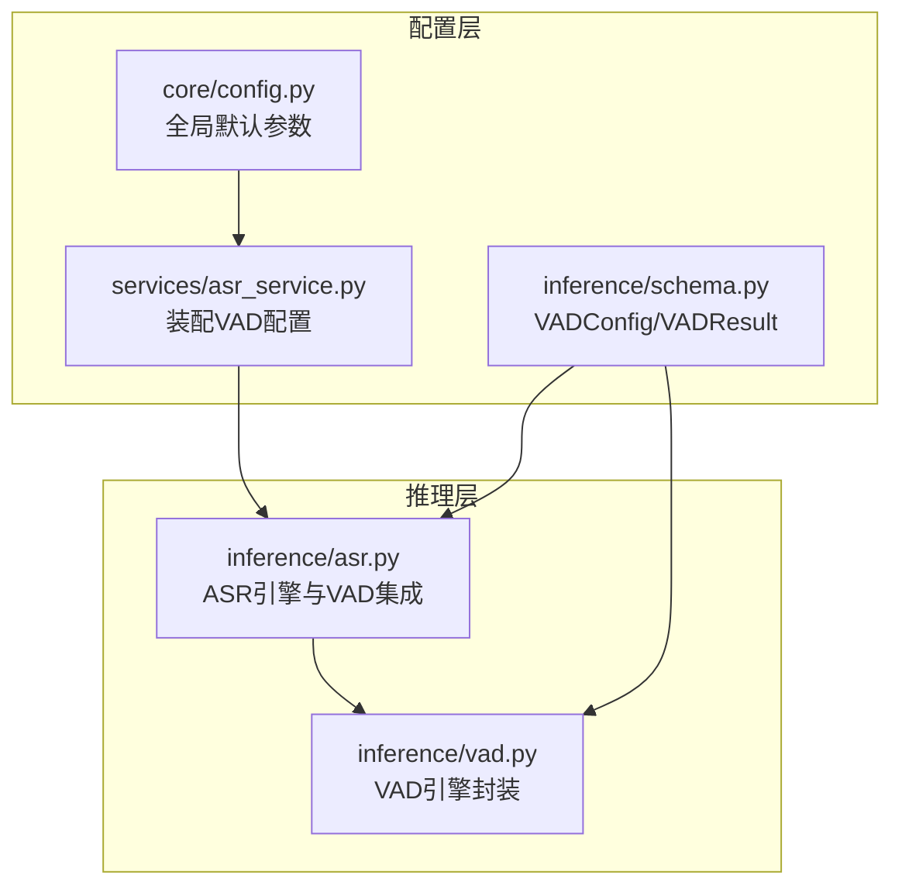
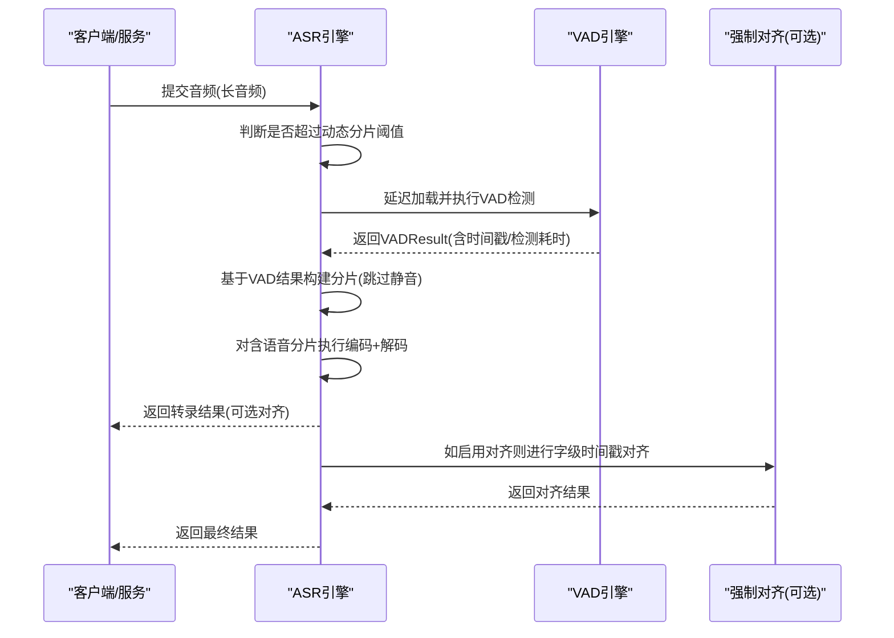
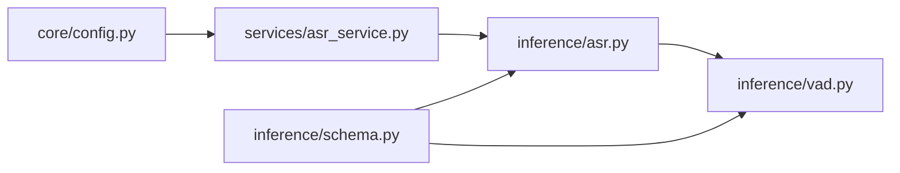

# VAD性能参数

<cite>
**本文引用的文件**
- [vad.py](file://qwen_asr_gguf/inference/vad.py)
- [schema.py](file://qwen_asr_gguf/inference/schema.py)
- [config.py](file://core/config.py)
- [asr_service.py](file://services/asr_service.py)
- [asr.py](file://qwen_asr_gguf/inference/asr.py)
- [README.md](file://README.md)
</cite>

## 目录
1. [简介](#简介)
2. [项目结构](#项目结构)
3. [核心组件](#核心组件)
4. [架构总览](#架构总览)
5. [详细组件分析](#详细组件分析)
6. [依赖关系分析](#依赖关系分析)
7. [性能考量](#性能考量)
8. [故障排查指南](#故障排查指南)
9. [结论](#结论)
10. [附录](#附录)

## 简介
本文件聚焦于语音活动检测（Voice Activity Detection, VAD）在本项目中的性能参数与调优实践，重点解释以下参数：
- VAD_USE_GPU：是否启用GPU加速VAD推理
- VAD_SPEECH_THRESHOLD：初始帧级语音概率阈值（自适应算法会动态调整）
- VAD_MIN_DURATION：启用VAD前置过滤的最小音频时长阈值

同时，本文将阐述这些参数对检测精度与速度的影响，给出不同音频环境下的调优建议，并提供性能监控指标与调试方法，最后总结面向移动设备与服务器等不同平台的优化策略。

## 项目结构
与VAD性能参数直接相关的模块与文件：
- VAD引擎封装与实现：qwen_asr_gguf/inference/vad.py
- VAD配置与结果数据结构：qwen_asr_gguf/inference/schema.py
- 全局配置与默认参数：core/config.py
- 服务层配置装配：services/asr_service.py
- ASR引擎与VAD集成点：qwen_asr_gguf/inference/asr.py
- 文档与环境变量示例：README.md

图表来源
- [config.py:78-91](file://core/config.py#L78-L91)
- [asr_service.py:72-102](file://services/asr_service.py#L72-L102)
- [schema.py:87-131](file://qwen_asr_gguf/inference/schema.py#L87-L131)
- [asr.py:108-135](file://qwen_asr_gguf/inference/asr.py#L108-L135)
- [vad.py:41-80](file://qwen_asr_gguf/inference/vad.py#L41-L80)

章节来源
- [config.py:78-91](file://core/config.py#L78-L91)
- [asr_service.py:72-102](file://services/asr_service.py#L72-L102)
- [schema.py:87-131](file://qwen_asr_gguf/inference/schema.py#L87-L131)
- [asr.py:108-135](file://qwen_asr_gguf/inference/asr.py#L108-L135)
- [vad.py:41-80](file://qwen_asr_gguf/inference/vad.py#L41-L80)

## 核心组件
- VADConfig：定义VAD引擎的配置项，包括use_gpu、smooth_window_size、speech_threshold、min_speech_frame、max_speech_frame、min_silence_frame、merge_silence_frame、extend_speech_frame、chunk_max_frame、vad_min_duration等。
- VADResult：封装单次VAD检测结果，包含是否含语音、语音时间戳、总时长、检测耗时，并提供语音占比属性。
- QwenVADEngine：对FireRedVAD的封装，负责模型加载、检测、自适应阈值、分片构建、静音片段提取等。
- ASREngine：在长音频场景下按需延迟加载VAD，结合VAD结果进行分片与跳过静音段，从而降低RTF并减少幻觉。

章节来源
- [schema.py:87-131](file://qwen_asr_gguf/inference/schema.py#L87-L131)
- [vad.py:29-80](file://qwen_asr_gguf/inference/vad.py#L29-L80)
- [asr.py:108-135](file://qwen_asr_gguf/inference/asr.py#L108-L135)

## 架构总览
VAD在整体ASR流水线中的位置与交互如下：

图表来源
- [asr.py:108-135](file://qwen_asr_gguf/inference/asr.py#L108-L135)
- [vad.py:86-145](file://qwen_asr_gguf/inference/vad.py#L86-L145)
- [schema.py:115-131](file://qwen_asr_gguf/inference/schema.py#L115-L131)

## 详细组件分析

### VAD参数详解与影响
- VAD_USE_GPU
  - 作用：控制VAD模型是否使用GPU推理。VAD模型相对较小，CPU即可满足实时需求；在资源紧张或移动端可设为False。
  - 影响：启用GPU可缩短检测耗时，但VAD本身计算量不大，收益有限；在高并发或GPU显存紧张时，建议保持False以节省资源。
  - 默认值：core/config.py中默认False。
  - 设置方式：通过服务层装配VADConfig.use_gpu传入。

- VAD_SPEECH_THRESHOLD
  - 作用：初始帧级语音概率阈值。VAD内部会基于概率分布做自适应阈值调整，该参数作为初始起点。
  - 影响：阈值越高，越不容易把静音误判为语音（降低漏检风险），但可能漏掉弱语音或远场微弱声音；阈值越低，检测更敏感，但易把噪声误判为语音（增加误检）。
  - 默认值：core/config.py中默认0.35；schema.py中注释说明初始阈值，自适应算法会动态调整。
  - 调优建议：
    - 噪声环境：提高阈值（例如0.4以上）以抑制噪声误检。
    - 清晰人声：维持默认或略降低（例如0.3左右）以提升召回。
    - 多人对话：结合自适应阈值，必要时降低阈值以避免漏检，但需关注误检风险。

- VAD_MIN_DURATION
  - 作用：仅对超过此阈值的音频片段启用VAD前置过滤。短音频（如小于阈值）将直接进入ASR，避免不必要的VAD开销。
  - 影响：阈值越小，越早启用VAD，节省ASR计算；但短音频上VAD开销占比更大，可能得不偿失。阈值越大，短音频跳过VAD，减少VAD调用次数，但长音频上可能错过跳过静音的机会。
  - 默认值：core/config.py中默认10.0秒；schema.py中默认10.0秒。
  - 设置方式：通过VADConfig.vad_min_duration传入。

章节来源
- [config.py:80-83](file://core/config.py#L80-L83)
- [schema.py:104-112](file://qwen_asr_gguf/inference/schema.py#L104-L112)
- [vad.py:61-80](file://qwen_asr_gguf/inference/vad.py#L61-L80)
- [asr_service.py:80-92](file://services/asr_service.py#L80-L92)

### VAD算法与性能影响因素
- 概率平滑与阈值分割
  - 平滑窗口大小：smooth_window_size用于滑动平均，减少概率波动带来的误判。
  - 阈值分割：基于平滑后的帧级概率与阈值生成语音片段，随后进行最小语音段过滤、相邻片段合并、边界扩展等后处理。
- 自适应阈值
  - 通过分析概率分布的分位数（默认30%分位数）并限制在安全区间，动态调整阈值，提升长音频离线转写的鲁棒性。
- 性能权衡
  - 阈值与速度：更高的阈值或更大的平滑窗口会增加计算量，但能提升稳定性；较低阈值或较小窗口更快但更易误检。
  - 分片策略：合理设置min_speech_frame、merge_silence_frame、extend_speech_frame等参数，可在保证语义完整性的同时减少分片数量，降低ASR负担。

章节来源
- [vad.py:160-222](file://qwen_asr_gguf/inference/vad.py#L160-L222)
- [vad.py:224-293](file://qwen_asr_gguf/inference/vad.py#L224-L293)

### 不同音频环境下的调优指南
- 噪声环境（背景音乐、空调、键盘声等）
  - 提高VAD_SPEECH_THRESHOLD（例如0.4~0.5），降低误检。
  - 适当增大smooth_window_size，平滑噪声波动。
  - 适度提高min_silence_frame与merge_silence_frame，避免短停顿被误判为新片段。
- 清晰人声（安静房间、高质量麦克风）
  - 维持默认阈值或略降低，提升召回。
  - 保持较小的平滑窗口，提高响应速度。
- 多人对话（多说话人、交叉语音）
  - 降低VAD_SPEECH_THRESHOLD（例如0.3左右），避免漏检。
  - 合理设置extend_speech_frame，确保词首/词尾被包含。
  - 结合自适应阈值，动态调整以适配不同说话人的信噪比。
- 移动端/低功耗设备
  - VAD_USE_GPU建议设为False，优先CPU推理，降低能耗。
  - 适当提高VAD_MIN_DURATION，减少频繁VAD调用。
- 服务器/高算力环境
  - 可开启VAD_USE_GPU（取决于GPU显存与负载）。
  - 保持默认阈值，利用自适应阈值提升鲁棒性。

章节来源
- [config.py:80-91](file://core/config.py#L80-L91)
- [vad.py:160-222](file://qwen_asr_gguf/inference/vad.py#L160-L222)
- [vad.py:224-293](file://qwen_asr_gguf/inference/vad.py#L224-L293)

### 性能监控指标与调试方法
- 关键指标
  - VAD检测耗时（VADResult.detect_time）：衡量VAD推理速度。
  - 语音占比（VADResult.speech_ratio）：反映音频中有语音的比例，辅助评估VAD效果。
  - 分片数量与长度：结合ASR分片策略，观察是否过度切分或遗漏静音段。
- 日志与调试
  - VAD检测日志：包含检测到的语音片段、时长、语音占比与耗时，便于定位异常。
  - 服务初始化日志：打印当前引擎配置（含VAD相关参数），便于确认参数是否生效。
- 调试步骤
  - 逐步降低VAD_SPEECH_THRESHOLD，观察误检与漏检的变化。
  - 调整smooth_window_size与min_speech_frame，观察分片质量。
  - 在噪声环境下提高阈值并增大平滑窗口，验证误检下降。
  - 对长音频启用自适应阈值，观察离线转写稳定性提升。

章节来源
- [schema.py:115-131](file://qwen_asr_gguf/inference/schema.py#L115-L131)
- [vad.py:132-143](file://qwen_asr_gguf/inference/vad.py#L132-L143)
- [asr_service.py:56-70](file://services/asr_service.py#L56-L70)

### 平台优化策略
- 移动设备
  - VAD_USE_GPU：False（CPU即可满足实时需求）。
  - VAD_MIN_DURATION：适当提高（例如10~20秒），减少频繁VAD调用。
  - 平滑窗口与阈值：保持保守设置，避免误检。
- 服务器
  - VAD_USE_GPU：根据GPU显存与负载决定；若显存充足且并发高，可开启。
  - VAD_MIN_DURATION：维持默认或略降低，以便更早启用VAD跳过静音。
  - 自适应阈值：充分利用，提升长音频离线转写的鲁棒性。

章节来源
- [config.py:80-91](file://core/config.py#L80-L91)
- [asr_service.py:72-102](file://services/asr_service.py#L72-L102)

## 依赖关系分析
- 配置来源
  - core/config.py提供全局默认参数，包括VAD_USE_GPU、VAD_SPEECH_THRESHOLD、VAD_MIN_DURATION等。
  - services/asr_service.py将全局配置装配为VADConfig并传入ASR引擎。
- 引擎实现
  - inference/vad.py封装FireRedVAD，读取VADConfig并执行检测、自适应阈值与分片构建。
  - inference/asr.py在长音频场景下按需延迟加载VAD，并根据VAD结果进行分片与跳过静音。

图表来源
- [config.py:78-91](file://core/config.py#L78-L91)
- [asr_service.py:72-102](file://services/asr_service.py#L72-L102)
- [asr.py:108-135](file://qwen_asr_gguf/inference/asr.py#L108-L135)
- [vad.py:41-80](file://qwen_asr_gguf/inference/vad.py#L41-L80)
- [schema.py:87-131](file://qwen_asr_gguf/inference/schema.py#L87-L131)

章节来源
- [config.py:78-91](file://core/config.py#L78-L91)
- [asr_service.py:72-102](file://services/asr_service.py#L72-L102)
- [asr.py:108-135](file://qwen_asr_gguf/inference/asr.py#L108-L135)
- [vad.py:41-80](file://qwen_asr_gguf/inference/vad.py#L41-L80)
- [schema.py:87-131](file://qwen_asr_gguf/inference/schema.py#L87-L131)

## 性能考量
- VAD_USE_GPU：在本项目中VAD模型较小，CPU即可满足实时需求；在资源紧张或移动端建议关闭GPU，以节省能耗与显存。
- VAD_SPEECH_THRESHOLD：阈值直接影响检测精度与速度。建议在噪声环境中提高阈值，在清晰人声环境中维持默认或略降低。
- VAD_MIN_DURATION：短音频跳过VAD可减少开销，长音频启用VAD可显著节省ASR计算。建议根据业务场景与设备能力综合设置。
- 自适应阈值：在长音频离线转写场景中，自适应阈值能提升鲁棒性，减少人工调参成本。

[本节为通用性能讨论，不直接分析具体文件]

## 故障排查指南
- VAD未初始化或加载失败
  - 现象：延迟加载VAD失败，回退为固定分片。
  - 排查：检查VAD模型路径、依赖安装与环境变量。
- 检测耗时过高
  - 现象：VADResult.detect_time偏大。
  - 排查：降低smooth_window_size、提高VAD_MIN_DURATION、关闭VAD_USE_GPU（移动端）。
- 误检/漏检
  - 现象：静音被误判为语音或弱语音被漏检。
  - 排查：提高/降低VAD_SPEECH_THRESHOLD；调整min_speech_frame与merge_silence_frame；在噪声环境增大平滑窗口。
- 日志定位
  - 查看VAD检测日志与服务初始化日志，确认参数是否生效与检测结果是否符合预期。

章节来源
- [asr.py:108-135](file://qwen_asr_gguf/inference/asr.py#L108-L135)
- [vad.py:132-143](file://qwen_asr_gguf/inference/vad.py#L132-L143)
- [asr_service.py:56-70](file://services/asr_service.py#L56-L70)

## 结论
- VAD_USE_GPU、VAD_SPEECH_THRESHOLD、VAD_MIN_DURATION是影响VAD检测精度与速度的关键参数。
- 在噪声环境与移动端应提高阈值与保守设置，在清晰人声与服务器场景可维持默认或略作调整。
- 自适应阈值与合理的分片策略能显著提升长音频离线转写的稳定性与吞吐。
- 建议结合日志与性能指标持续迭代参数，以获得最佳的用户体验与资源利用率。

[本节为总结性内容，不直接分析具体文件]

## 附录
- 环境变量与示例
  - 文档提供了VAD相关环境变量的示例导出命令，便于在不同场景下快速切换参数。
- 相关实现参考
  - VAD引擎封装、配置与结果数据结构、服务层装配与ASR集成点均在上述文件中实现。

章节来源
- [README.md:233-255](file://README.md#L233-L255)