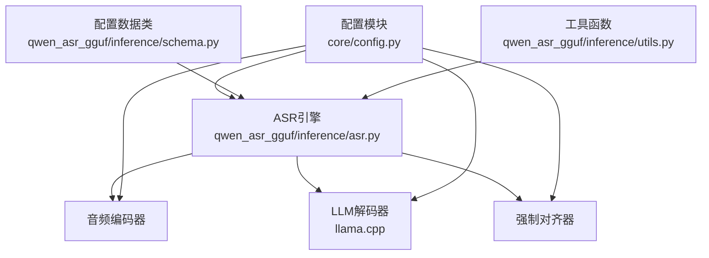
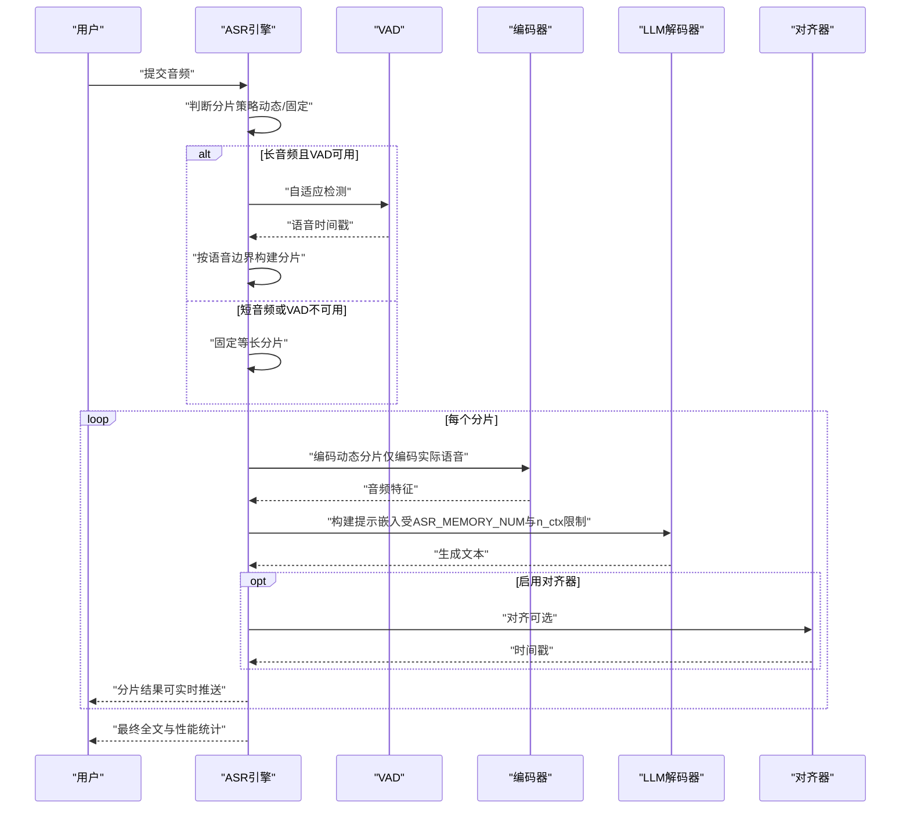
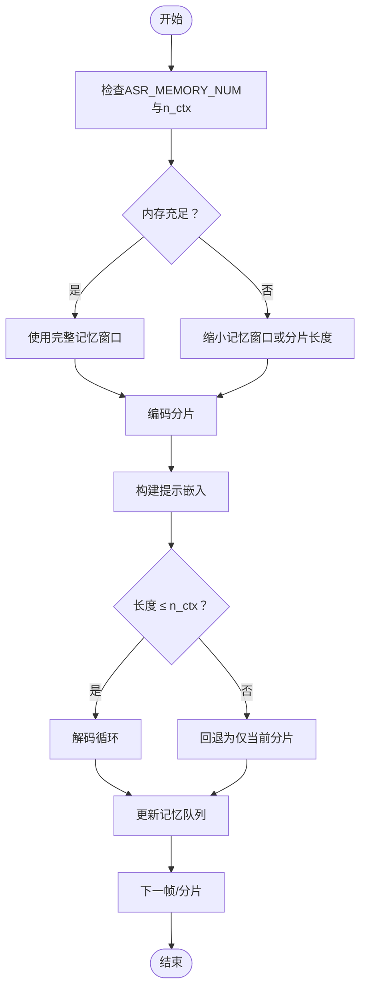
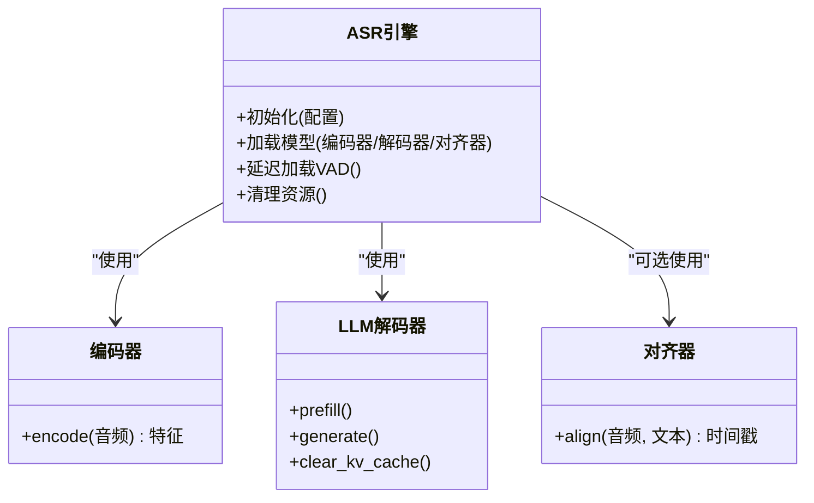
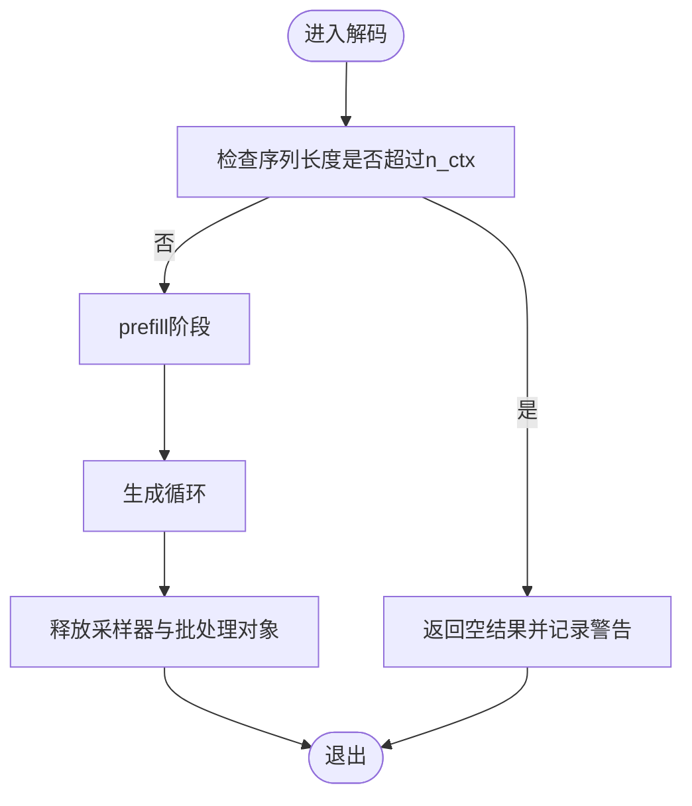
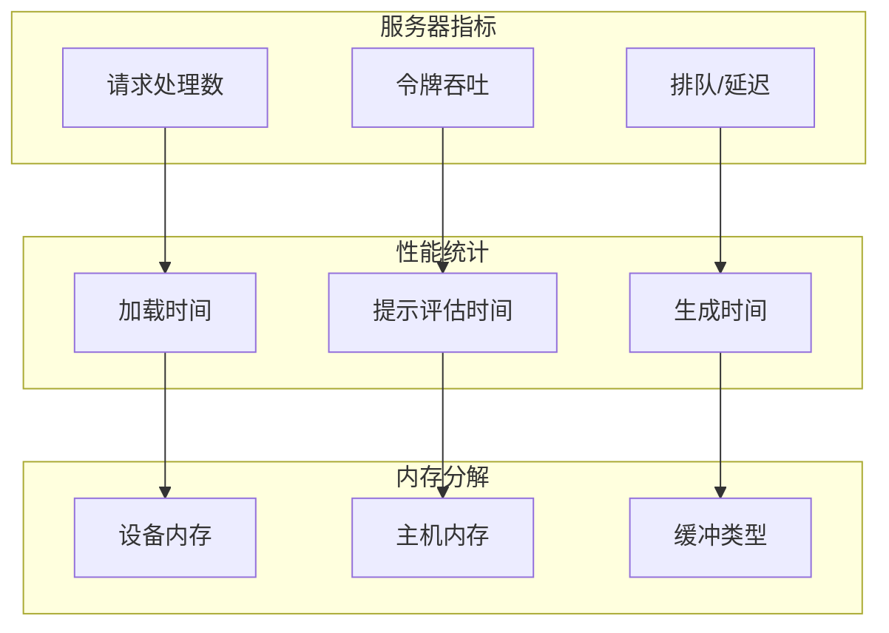
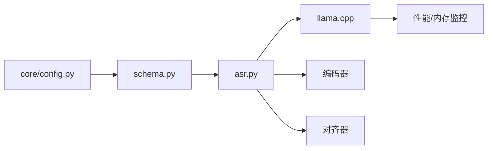

# 内存优化参数

<cite>
**本文引用的文件**
- [core/config.py](file://core/config.py)
- [qwen_asr_gguf/inference/asr.py](file://qwen_asr_gguf/inference/asr.py)
- [qwen_asr_gguf/inference/schema.py](file://qwen_asr_gguf/inference/schema.py)
- [qwen_asr_gguf/inference/utils.py](file://qwen_asr_gguf/inference/utils.py)
- [ref/llama.cpp/src/llama-context.cpp](file://ref/llama.cpp/src/llama-context.cpp)
- [ref/llama.cpp/ggml/src/ggml-vulkan/ggml-vulkan.cpp](file://ref/llama.cpp/ggml/src/ggml-vulkan/ggml-vulkan.cpp)
- [ref/llama.cpp/tools/server/server-context.cpp](file://ref/llama.cpp/tools/server/server-context.cpp)
</cite>

## 目录
1. [简介](#简介)
2. [项目结构](#项目结构)
3. [核心组件](#核心组件)
4. [架构总览](#架构总览)
5. [详细组件分析](#详细组件分析)
6. [依赖分析](#依赖分析)
7. [性能考量](#性能考量)
8. [故障排查指南](#故障排查指南)
9. [结论](#结论)
10. [附录](#附录)

## 简介
本文件聚焦于内存优化参数与内存使用模式，围绕以下关键参数展开：
- ASR_MEMORY_NUM：控制ASR引擎上下文记忆的分片数量，直接影响KV缓存与上下文窗口占用。
- MODEL_DIR：模型文件目录，决定模型加载位置与缓存策略。
- DATA_DIR：数据集与资源目录，影响预处理与缓存路径。

文档将系统阐述模型加载策略、缓存机制、内存回收与泄漏防护，并提供不同内存配置下的性能对比与调参建议，覆盖低内存与高内存硬件场景的最佳实践。

## 项目结构
本项目采用“配置-引擎-推理-工具”分层组织：
- 配置层：集中定义全局参数与默认值，包括内存相关参数。
- 引擎层：ASR推理主流程，包含分片、VAD、编码器、解码器与对齐器。
- 推理层：具体实现ASR流水线，包含内存管理与上下文窗口控制。
- 工具层：性能统计、语言归一化、重复检测等辅助能力。

**图表来源**
- [core/config.py:52-108](file://core/config.py#L52-L108)
- [qwen_asr_gguf/inference/asr.py:40-142](file://qwen_asr_gguf/inference/asr.py#L40-L142)
- [qwen_asr_gguf/inference/schema.py:162-210](file://qwen_asr_gguf/inference/schema.py#L162-L210)

**章节来源**
- [core/config.py:52-108](file://core/config.py#L52-L108)
- [qwen_asr_gguf/inference/asr.py:40-142](file://qwen_asr_gguf/inference/asr.py#L40-L142)
- [qwen_asr_gguf/inference/schema.py:162-210](file://qwen_asr_gguf/inference/schema.py#L162-L210)

## 核心组件
- 内存相关参数
  - ASR_MEMORY_NUM：ASR引擎上下文记忆的分片数量，默认为1。该值控制滑动窗口大小，影响KV缓存与上下文窗口占用。
  - MODEL_DIR：模型文件根目录，默认“./models”。用于定位编码器、解码器与对齐器模型。
  - DATA_DIR：数据集与资源目录，默认“./datasets”。用于存放训练/评估数据与字典等资源。
- 引擎配置
  - ASREngineConfig.memory_num：与ASR_MEMORY_NUM一致，控制记忆窗口。
  - ASREngineConfig.n_ctx：上下文窗口大小，超过该长度将触发越界保护。
  - ASREngineConfig.chunk_size：分片时长（秒），影响每次推理的数据量与内存峰值。
  - ASREngineConfig.dynamic_chunk_threshold：动态分片阈值，超过该时长自动启用VAD动态分片，减少无效计算与内存占用。

**章节来源**
- [core/config.py:58-72](file://core/config.py#L58-L72)
- [qwen_asr_gguf/inference/schema.py:175](file://qwen_asr_gguf/inference/schema.py#L175)
- [qwen_asr_gguf/inference/schema.py:184-186](file://qwen_asr_gguf/inference/schema.py#L184-L186)

## 架构总览
ASR推理流程包含以下关键步骤：
- 音频加载与分片：根据动态阈值选择固定或动态分片策略。
- VAD过滤：长音频自动启用VAD，跳过静音分片，显著降低内存与计算压力。
- 编码器：提取音频特征，动态分片模式下仅处理实际语音长度。
- LLM解码：构建提示嵌入，执行prefill与生成循环，受上下文窗口与分片长度约束。
- 对齐器（可选）：对文本进行强制对齐，生成时间戳。

**图表来源**
- [qwen_asr_gguf/inference/asr.py:602-893](file://qwen_asr_gguf/inference/asr.py#L602-L893)
- [qwen_asr_gguf/inference/schema.py:162-210](file://qwen_asr_gguf/inference/schema.py#L162-L210)

## 详细组件分析

### 内存参数与上下文窗口控制
- ASR_MEMORY_NUM
  - 作用：控制ASR记忆队列的最大长度，即保留的分片数量。在动态分片模式下仅保存文本上下文；在固定分片模式下保存音频特征与文本。
  - 影响：增大该值可提升跨分片连贯性，但会增加KV缓存与上下文窗口占用，可能导致越界保护触发。
- ASREngineConfig.n_ctx
  - 作用：上下文窗口上限，超过该长度将触发越界保护，避免进程崩溃。
  - 影响：与分片长度、记忆窗口共同决定内存峰值与稳定性。
- ASREngineConfig.chunk_size
  - 作用：分片时长，直接影响每次编码与解码的数据规模。
  - 影响：更短分片降低峰值内存，但增加分片数量与VAD开销；更长分片提高吞吐，但内存占用更高。

**图表来源**
- [qwen_asr_gguf/inference/asr.py:643-645](file://qwen_asr_gguf/inference/asr.py#L643-L645)
- [qwen_asr_gguf/inference/asr.py:812-821](file://qwen_asr_gguf/inference/asr.py#L812-L821)

**章节来源**
- [core/config.py:69](file://core/config.py#L69)
- [qwen_asr_gguf/inference/schema.py:175](file://qwen_asr_gguf/inference/schema.py#L175)
- [qwen_asr_gguf/inference/schema.py:184-186](file://qwen_asr_gguf/inference/schema.py#L184-L186)
- [qwen_asr_gguf/inference/asr.py:812-821](file://qwen_asr_gguf/inference/asr.py#L812-L821)

### 模型加载策略与缓存机制
- 模型加载
  - 编码器：在引擎初始化时加载前端与后端ONNX模型，支持动态形状以减少冗余计算。
  - 解码器：加载GGUF格式的LLM模型与嵌入表，初始化上下文与批处理对象。
  - 对齐器：可选加载，按需初始化。
- 缓存机制
  - 音频特征缓存：固定分片模式下缓存音频特征与文本，动态分片模式下仅缓存文本。
  - KV缓存：LLM上下文维护KV缓存，受n_ctx与分片长度限制。
  - VAD延迟加载：仅在长音频超过阈值时按需加载，避免不必要的内存占用。

**图表来源**
- [qwen_asr_gguf/inference/asr.py:49-142](file://qwen_asr_gguf/inference/asr.py#L49-L142)

**章节来源**
- [qwen_asr_gguf/inference/asr.py:64-96](file://qwen_asr_gguf/inference/asr.py#L64-L96)
- [qwen_asr_gguf/inference/asr.py:108-136](file://qwen_asr_gguf/inference/asr.py#L108-L136)

### 内存回收与越界保护
- 越界保护：当序列长度超过n_ctx时，提前拦截并返回空结果，避免崩溃。
- 资源释放：解码完成后显式删除采样器与批处理对象，减少临时内存占用。
- 记忆队列：使用双端队列限制最大长度，超出自动丢弃最旧项，避免无限增长。

**图表来源**
- [qwen_asr_gguf/inference/asr.py:226-238](file://qwen_asr_gguf/inference/asr.py#L226-L238)
- [qwen_asr_gguf/inference/asr.py:292-294](file://qwen_asr_gguf/inference/asr.py#L292-L294)
- [qwen_asr_gguf/inference/asr.py:643](file://qwen_asr_gguf/inference/asr.py#L643)

**章节来源**
- [qwen_asr_gguf/inference/asr.py:226-238](file://qwen_asr_gguf/inference/asr.py#L226-L238)
- [qwen_asr_gguf/inference/asr.py:292-294](file://qwen_asr_gguf/inference/asr.py#L292-L294)
- [qwen_asr_gguf/inference/asr.py:643](file://qwen_asr_gguf/inference/asr.py#L643)

### 内存使用模式与监控
- llama.cpp性能与内存监控
  - 性能统计：提供加载时间、提示评估时间、生成时间等指标。
  - 内存分解：输出各设备与缓冲区类型的内存使用明细。
  - 服务器指标：请求处理数、令牌吞吐、排队与延迟等。
- Vulkan内存日志：记录设备与主机侧缓冲分配与释放，便于定位泄漏。

**图表来源**
- [ref/llama.cpp/src/llama-context.cpp:3684-3705](file://ref/llama.cpp/src/llama-context.cpp#L3684-L3705)
- [ref/llama.cpp/ggml/src/ggml-vulkan/ggml-vulkan.cpp:1587-1606](file://ref/llama.cpp/ggml/src/ggml-vulkan/ggml-vulkan.cpp#L1587-L1606)
- [ref/llama.cpp/tools/server/server-context.cpp:3264-3288](file://ref/llama.cpp/tools/server/server-context.cpp#L3264-L3288)

**章节来源**
- [ref/llama.cpp/src/llama-context.cpp:3684-3705](file://ref/llama.cpp/src/llama-context.cpp#L3684-L3705)
- [ref/llama.cpp/ggml/src/ggml-vulkan/ggml-vulkan.cpp:1587-1606](file://ref/llama.cpp/ggml/src/ggml-vulkan/ggml-vulkan.cpp#L1587-L1606)
- [ref/llama.cpp/tools/server/server-context.cpp:3264-3288](file://ref/llama.cpp/tools/server/server-context.cpp#L3264-L3288)

## 依赖分析
- 配置依赖
  - ASR_MEMORY_NUM与ASREngineConfig.memory_num耦合，共同决定记忆窗口。
  - ASREngineConfig.n_ctx与chunk_size共同决定上下文长度与内存峰值。
- 引擎依赖
  - ASR引擎依赖编码器、LLM解码器与对齐器；VAD按需延迟加载。
- 外部依赖
  - llama.cpp提供上下文、批处理与性能统计能力；Vulkan后端提供内存日志。

**图表来源**
- [core/config.py:52-108](file://core/config.py#L52-L108)
- [qwen_asr_gguf/inference/schema.py:162-210](file://qwen_asr_gguf/inference/schema.py#L162-L210)
- [qwen_asr_gguf/inference/asr.py:49-142](file://qwen_asr_gguf/inference/asr.py#L49-L142)

**章节来源**
- [core/config.py:52-108](file://core/config.py#L52-L108)
- [qwen_asr_gguf/inference/schema.py:162-210](file://qwen_asr_gguf/inference/schema.py#L162-L210)
- [qwen_asr_gguf/inference/asr.py:49-142](file://qwen_asr_gguf/inference/asr.py#L49-L142)

## 性能考量
- 不同内存配置下的性能表现
  - 低内存配置（ASR_MEMORY_NUM=1，n_ctx较小，分片较长）：内存占用最低，但跨分片连贯性较差，可能出现重复或上下文丢失。
  - 中等内存配置（ASR_MEMORY_NUM=2~3，适中n_ctx，分片适中）：平衡连贯性与内存占用，适合大多数场景。
  - 高内存配置（ASR_MEMORY_NUM较大，n_ctx较大，分片较短）：连贯性最佳，但内存峰值较高，需谨慎避免越界。
- 调参建议
  - 优先保证n_ctx安全裕度，避免越界保护触发。
  - 在动态分片模式下，尽量利用VAD跳过静音，减少无效内存占用。
  - 对于长音频，适当缩短分片长度以降低峰值内存。
  - 对于短音频，可适度增大ASR_MEMORY_NUM以提升连贯性。

[本节为通用指导，无需特定文件引用]

## 故障排查指南
- 常见问题
  - 内存不足：通过减小ASR_MEMORY_NUM、缩短分片长度、降低n_ctx缓解。
  - 越界崩溃：检查n_ctx与分片长度，必要时启用越界保护分支逻辑。
  - VAD不可用：确认模型路径与依赖安装，必要时降级为固定分片。
  - 对齐器异常：检查对齐器模型路径与语言设置。
- 监控手段
  - 使用llama.cpp性能统计与内存分解输出，定位瓶颈与泄漏。
  - 启用Vulkan内存日志，跟踪缓冲分配与释放。
  - 服务器指标：关注请求处理数、令牌吞吐与排队延迟。

**章节来源**
- [qwen_asr_gguf/inference/asr.py:226-238](file://qwen_asr_gguf/inference/asr.py#L226-L238)
- [qwen_asr_gguf/inference/asr.py:108-136](file://qwen_asr_gguf/inference/asr.py#L108-L136)
- [ref/llama.cpp/src/llama-context.cpp:3684-3705](file://ref/llama.cpp/src/llama-context.cpp#L3684-L3705)
- [ref/llama.cpp/ggml/src/ggml-vulkan/ggml-vulkan.cpp:1587-1606](file://ref/llama.cpp/ggml/src/ggml-vulkan/ggml-vulkan.cpp#L1587-L1606)

## 结论
- ASR_MEMORY_NUM是控制内存占用与上下文连贯性的关键参数，应结合n_ctx与分片长度综合调优。
- 动态分片与VAD过滤是降低内存峰值的有效手段，建议在长音频场景中充分利用。
- 通过性能统计与内存分解工具，可精准定位内存瓶颈与潜在泄漏，保障系统稳定性。

[本节为总结，无需特定文件引用]

## 附录
- 最佳实践清单
  - 低内存设备：ASR_MEMORY_NUM=1，n_ctx适中，分片较长；启用VAD动态分片。
  - 中等内存设备：ASR_MEMORY_NUM=2~3，n_ctx适中，分片适中；平衡连贯性与内存。
  - 高内存设备：ASR_MEMORY_NUM较大，n_ctx较大，分片较短；注意越界保护与KV缓存上限。
- 监控建议
  - 定期查看llama.cpp性能与内存分解输出。
  - 开启Vulkan内存日志，持续跟踪缓冲生命周期。
  - 服务器指标纳入告警阈值，及时发现异常。

[本节为通用指导，无需特定文件引用]