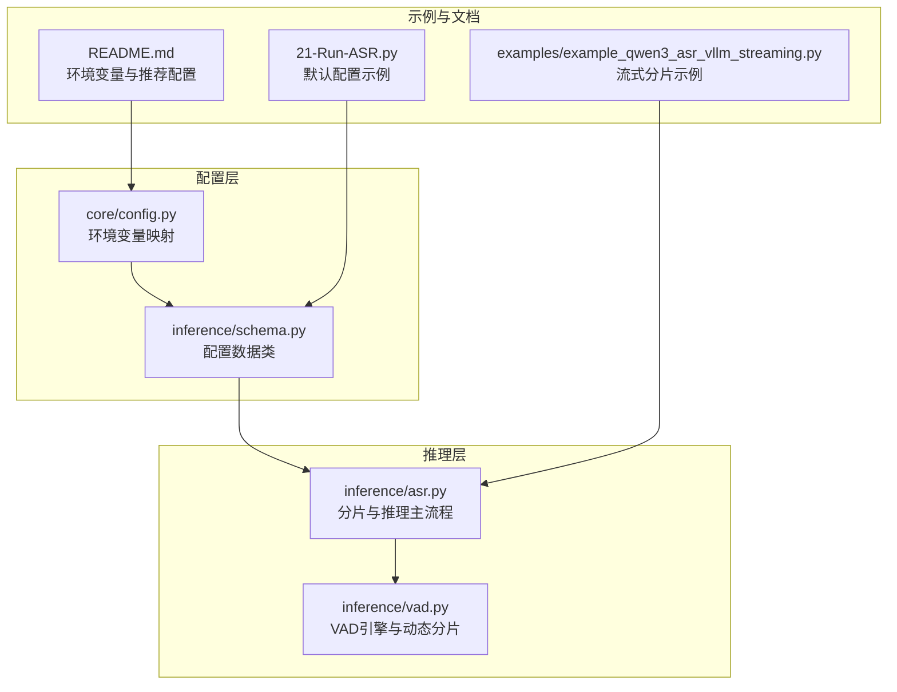
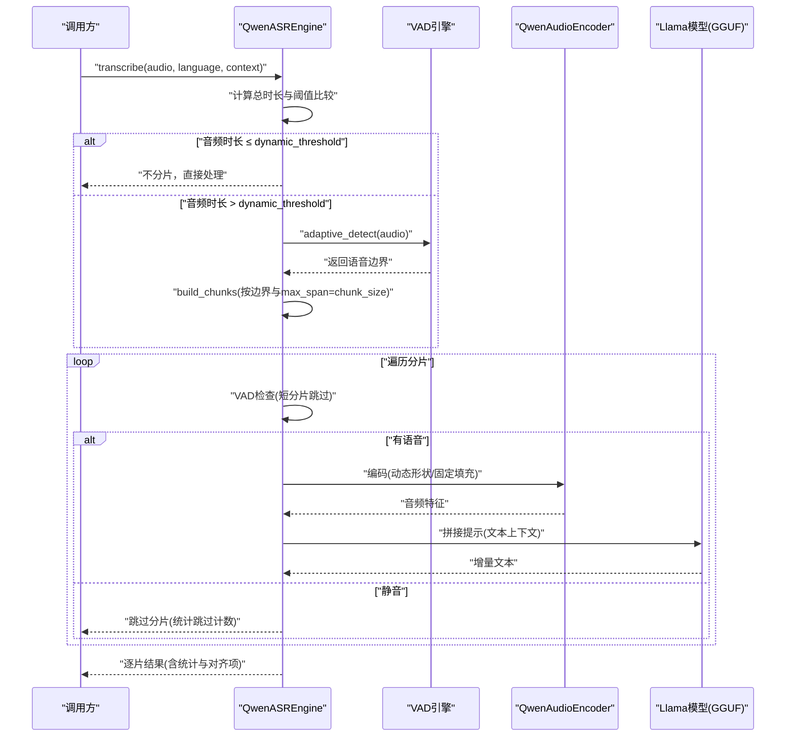
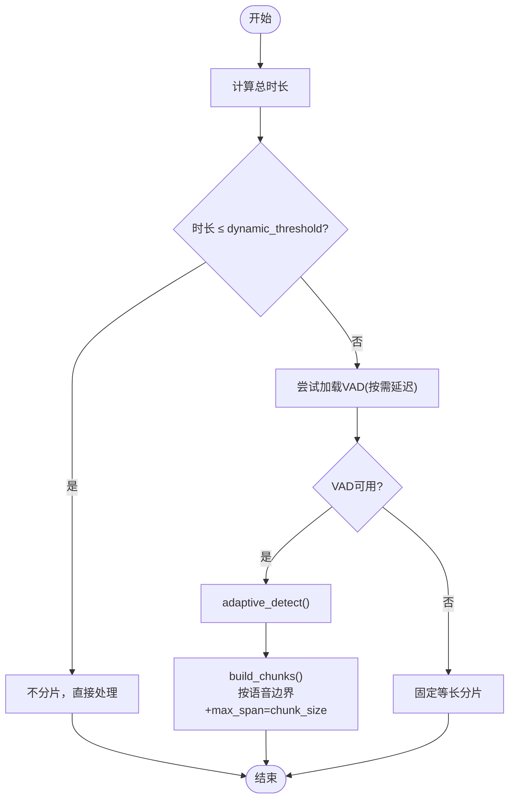
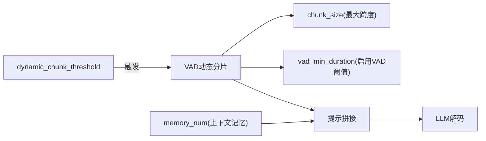

# 分片处理参数

<cite>
**本文引用的文件**
- [core/config.py](file://core/config.py)
- [qwen_asr_gguf/inference/schema.py](file://qwen_asr_gguf/inference/schema.py)
- [qwen_asr_gguf/inference/asr.py](file://qwen_asr_gguf/inference/asr.py)
- [qwen_asr_gguf/inference/vad.py](file://qwen_asr_gguf/inference/vad.py)
- [21-Run-ASR.py](file://21-Run-ASR.py)
- [examples/example_qwen3_asr_vllm_streaming.py](file://examples/example_qwen3_asr_vllm_streaming.py)
- [README.md](file://README.md)
</cite>

## 目录
1. [简介](#简介)
2. [项目结构](#项目结构)
3. [核心组件](#核心组件)
4. [架构总览](#架构总览)
5. [详细组件分析](#详细组件分析)
6. [依赖分析](#依赖分析)
7. [性能考量](#性能考量)
8. [故障排查指南](#故障排查指南)
9. [结论](#结论)
10. [附录](#附录)

## 简介
本文件聚焦于分片处理参数，特别是 ASR_CHUNK_SIZE 与 ASR_DYNAMIC_CHUNK_THRESHOLD 的作用与调优策略。文档将深入解释静态分片与动态分片的工作原理，阐述 VAD 动态分片触发机制，并给出不同音频长度场景下的最优策略与参数调优建议，同时分析分片大小对内存占用与计算性能的影响，以及针对长音频与短音频的实际案例。

## 项目结构
与分片处理直接相关的模块主要集中在以下位置：
- 核心配置与环境变量映射：core/config.py
- 引擎配置数据结构：qwen_asr_gguf/inference/schema.py
- ASR 核心分片与推理流程：qwen_asr_gguf/inference/asr.py
- VAD 引擎与动态分片构建：qwen_asr_gguf/inference/vad.py
- 示例与默认配置：21-Run-ASR.py、examples/example_qwen3_asr_vllm_streaming.py
- 环境变量与推荐配置：README.md

图表来源
- [core/config.py:67-90](file://core/config.py#L67-L90)
- [qwen_asr_gguf/inference/schema.py:162-200](file://qwen_asr_gguf/inference/schema.py#L162-L200)
- [qwen_asr_gguf/inference/asr.py:659-722](file://qwen_asr_gguf/inference/asr.py#L659-L722)
- [qwen_asr_gguf/inference/vad.py:159-170](file://qwen_asr_gguf/inference/vad.py#L159-L170)
- [21-Run-ASR.py:68-95](file://21-Run-ASR.py#L68-L95)
- [examples/example_qwen3_asr_vllm_streaming.py:64-85](file://examples/example_qwen3_asr_vllm_streaming.py#L64-L85)
- [README.md:230-261](file://README.md#L230-L261)

章节来源
- [core/config.py:67-90](file://core/config.py#L67-L90)
- [qwen_asr_gguf/inference/schema.py:162-200](file://qwen_asr_gguf/inference/schema.py#L162-L200)
- [qwen_asr_gguf/inference/asr.py:659-722](file://qwen_asr_gguf/inference/asr.py#L659-L722)
- [qwen_asr_gguf/inference/vad.py:159-170](file://qwen_asr_gguf/inference/vad.py#L159-L170)
- [21-Run-ASR.py:68-95](file://21-Run-ASR.py#L68-L95)
- [examples/example_qwen3_asr_vllm_streaming.py:64-85](file://examples/example_qwen3_asr_vllm_streaming.py#L64-L85)
- [README.md:230-261](file://README.md#L230-L261)

## 核心组件
- ASR_ENGINE_CONFIG.chunk_size：单分片最大时长（秒）。在动态分片模式下，该值作为“最大跨度上限”，实际分片时长由 VAD 动态决定，不超过该上限。
- ASR_ENGINE_CONFIG.dynamic_chunk_threshold：动态分片阈值（秒）。当音频总时长超过该阈值时，自动启用 VAD 动态分片；否则不分片或使用固定等长分片。
- VADConfig.vad_min_duration：启用 VAD 过滤的最小分片时长阈值。短于该阈值的分片不执行 VAD，直接送入 ASR。
- ASR_ENGINE_CONFIG.memory_num：保留前 N 片文本作为上下文，用于动态分片模式下的提示拼接，避免非连续音频拼接带来的干扰。
- ASR_ENGINE_CONFIG.pad_to：Encoder 填充时长（秒）。在固定分片模式下，分片会被补零至该长度；动态分片模式下通常不使用固定填充，以节省计算。

章节来源
- [qwen_asr_gguf/inference/schema.py:174](file://qwen_asr_gguf/inference/schema.py#L174)
- [qwen_asr_gguf/inference/schema.py:184-186](file://qwen_asr_gguf/inference/schema.py#L184-L186)
- [qwen_asr_gguf/inference/schema.py:112](file://qwen_asr_gguf/inference/schema.py#L112)
- [qwen_asr_gguf/inference/schema.py:179](file://qwen_asr_gguf/inference/schema.py#L179)
- [qwen_asr_gguf/inference/schema.py:190-191](file://qwen_asr_gguf/inference/schema.py#L190-L191)

## 架构总览
分片策略在转写主流程中被严格控制：根据音频总时长与阈值选择策略，随后在主循环中按分片推进，结合 VAD 过滤与上下文记忆，最终输出逐片结果。

图表来源
- [qwen_asr_gguf/inference/asr.py:659-722](file://qwen_asr_gguf/inference/asr.py#L659-L722)
- [qwen_asr_gguf/inference/asr.py:725-893](file://qwen_asr_gguf/inference/asr.py#L725-L893)
- [qwen_asr_gguf/inference/vad.py:160-170](file://qwen_asr_gguf/inference/vad.py#L160-L170)

## 详细组件分析

### 分片策略与触发机制
- 静态分片（短音频）：当总时长小于等于阈值时，不分片，直接将整段音频送入 ASR。
- 动态分片（长音频）：当总时长超过阈值时，先执行一次自适应阈值 VAD 检测，再按语音边界构建分片，且每个分片的最大跨度不超过 chunk_size。
- 降级固定分片：当 VAD 无法加载或不可用时，按固定等长分片处理。

图表来源
- [qwen_asr_gguf/inference/asr.py:659-722](file://qwen_asr_gguf/inference/asr.py#L659-L722)
- [qwen_asr_gguf/inference/asr.py:108-135](file://qwen_asr_gguf/inference/asr.py#L108-L135)
- [qwen_asr_gguf/inference/vad.py:160-170](file://qwen_asr_gguf/inference/vad.py#L160-L170)

章节来源
- [qwen_asr_gguf/inference/asr.py:659-722](file://qwen_asr_gguf/inference/asr.py#L659-L722)
- [qwen_asr_gguf/inference/asr.py:108-135](file://qwen_asr_gguf/inference/asr.py#L108-L135)
- [qwen_asr_gguf/inference/vad.py:160-170](file://qwen_asr_gguf/inference/vad.py#L160-L170)

### VAD 动态分片触发与构建
- 触发条件：音频总时长超过 dynamic_chunk_threshold。
- 自适应检测：两遍法，先以初始阈值检测，再根据帧级概率分布自适应调整阈值，提升不同录音环境下的鲁棒性。
- 分片构建：基于 VAD 返回的语音区间，确保不截断句子、不在静音中切割，并以 max_span_sec 作为单分片最大跨度上限。

章节来源
- [qwen_asr_gguf/inference/asr.py:684-706](file://qwen_asr_gguf/inference/asr.py#L684-L706)
- [qwen_asr_gguf/inference/vad.py:160-170](file://qwen_asr_gguf/inference/vad.py#L160-L170)
- [qwen_asr_gguf/inference/vad.py:133-160](file://qwen_asr_gguf/inference/vad.py#L133-L160)

### 分片主循环与上下文记忆
- 分片循环：按构建好的分片依次处理，支持静音跳过、编码、提示拼接、解码与可选对齐。
- 上下文记忆：动态分片模式仅保留前 N 片文本作为上下文，避免非连续音频拼接；固定分片模式可保留音频特征与文本双重记忆，但需注意上下文窗口安全。
- 边界缓冲：固定分片模式下对非末尾分片在尾部追加一定时长的音频，帮助 LLM 在边界处生成更完整的词句。

章节来源
- [qwen_asr_gguf/inference/asr.py:725-893](file://qwen_asr_gguf/inference/asr.py#L725-L893)
- [qwen_asr_gguf/inference/asr.py:744-753](file://qwen_asr_gguf/inference/asr.py#L744-L753)
- [qwen_asr_gguf/inference/asr.py:790-821](file://qwen_asr_gguf/inference/asr.py#L790-L821)

### 配置数据结构与默认值
- ASREngineConfig
  - chunk_size：默认 30.0 秒（动态分片模式下的最大跨度上限）
  - memory_num：默认 1
  - dynamic_chunk_threshold：默认 10.0 秒
  - pad_to：默认与 chunk_size 对齐
- VADConfig
  - vad_min_duration：默认 10.0 秒
  - speech_threshold：默认 0.35（初始阈值，自适应算法会动态调整）

章节来源
- [qwen_asr_gguf/inference/schema.py:162-200](file://qwen_asr_gguf/inference/schema.py#L162-L200)
- [qwen_asr_gguf/inference/schema.py:87-113](file://qwen_asr_gguf/inference/schema.py#L87-L113)
- [core/config.py:67-90](file://core/config.py#L67-L90)

### 示例与默认配置
- 示例脚本默认启用 VAD 动态分片，阈值为 10 秒，分片最大跨度为 30 秒。
- 流式 vLLM 示例展示了更小的分片步长（如 2 秒），适合低延迟场景。

章节来源
- [21-Run-ASR.py:68-95](file://21-Run-ASR.py#L68-L95)
- [examples/example_qwen3_asr_vllm_streaming.py:64-85](file://examples/example_qwen3_asr_vllm_streaming.py#L64-L85)

## 依赖分析
分片处理的关键依赖关系如下：
- ASR_ENGINE_CONFIG.dynamic_chunk_threshold 决定是否启用 VAD 动态分片。
- VADConfig.vad_min_duration 决定是否对分片执行 VAD 过滤。
- ASR_ENGINE_CONFIG.chunk_size 作为动态分片的最大跨度上限。
- ASR_ENGINE_CONFIG.memory_num 控制上下文记忆数量，影响提示拼接长度与上下文窗口占用。

图表来源
- [qwen_asr_gguf/inference/schema.py:184-186](file://qwen_asr_gguf/inference/schema.py#L184-L186)
- [qwen_asr_gguf/inference/schema.py:112](file://qwen_asr_gguf/inference/schema.py#L112)
- [qwen_asr_gguf/inference/schema.py:174](file://qwen_asr_gguf/inference/schema.py#L174)
- [qwen_asr_gguf/inference/schema.py:179](file://qwen_asr_gguf/inference/schema.py#L179)

章节来源
- [qwen_asr_gguf/inference/schema.py:162-200](file://qwen_asr_gguf/inference/schema.py#L162-L200)
- [qwen_asr_gguf/inference/schema.py:87-113](file://qwen_asr_gguf/inference/schema.py#L87-L113)

## 性能考量
- 处理延迟与识别准确率平衡
  - 动态分片：按语音边界切分，避免在静音中浪费计算，提升整体吞吐与准确率；分片越短，延迟越低，但过多分片会增加提示拼接与上下文切换开销。
  - 固定分片：简单稳定，但在静音段也会进行编码与解码，增加无效计算。
- 内存占用
  - 动态分片：通常不进行固定填充，仅编码实际语音长度，显著降低内存占用。
  - 固定分片：需要补零至 pad_to/chunk_size，内存占用更高；memory_num 增大时，上下文窗口扩大，显存压力上升。
- 计算性能
  - 动态分片：VAD 检测带来额外开销，但能跳过大量静音段，总体 RTF 更优。
  - 固定分片：编码与解码路径更直白，但包含无效计算，RTF 相对较低。
- 上下文窗口安全
  - 固定分片模式下，合并记忆后的序列长度超过 n_ctx 时会回退为仅当前分片，避免越界。

章节来源
- [qwen_asr_gguf/inference/asr.py:776-787](file://qwen_asr_gguf/inference/asr.py#L776-L787)
- [qwen_asr_gguf/inference/asr.py:812-821](file://qwen_asr_gguf/inference/asr.py#L812-L821)
- [qwen_asr_gguf/inference/asr.py:790-821](file://qwen_asr_gguf/inference/asr.py#L790-L821)

## 故障排查指南
- VAD 无法加载或不可用
  - 现象：动态分片未启用，自动降级为固定分片。
  - 处理：确认 VAD 模型路径与依赖可用；必要时在配置中显式启用 VAD。
- 分片过多导致上下文越界
  - 现象：提示拼接后序列长度超过 n_ctx，触发回退。
  - 处理：减小 memory_num 或增大 n_ctx（受硬件限制）。
- 静音段仍被处理
  - 现象：分片过短未启用 VAD 过滤。
  - 处理：适当提高 vad_min_duration 或降低 chunk_size 以缩短分片。
- 低延迟场景的分片步长
  - 现象：流式场景对延迟敏感。
  - 处理：参考 vLLM 示例，使用更小的分片步长（如 2 秒）。

章节来源
- [qwen_asr_gguf/inference/asr.py:108-135](file://qwen_asr_gguf/inference/asr.py#L108-L135)
- [qwen_asr_gguf/inference/asr.py:812-821](file://qwen_asr_gguf/inference/asr.py#L812-L821)
- [qwen_asr_gguf/inference/vad.py:437-447](file://qwen_asr_gguf/inference/vad.py#L437-L447)
- [examples/example_qwen3_asr_vllm_streaming.py:64-85](file://examples/example_qwen3_asr_vllm_streaming.py#L64-L85)

## 结论
- ASR_DYNAMIC_CHUNK_THRESHOLD 是动态分片的开关阈值，建议根据业务场景与设备性能设定（默认 10 秒）。
- ASR_CHUNK_SIZE 是动态分片的最大跨度上限，建议在保证准确率的前提下适度增大（默认 30 秒），以减少分片数量与提示拼接开销。
- VAD 的 vad_min_duration 与自适应阈值共同决定静音过滤的效率，合理设置可显著降低无效计算。
- 长音频优先使用动态分片，短音频可考虑不分片或固定分片；流式场景可参考 vLLM 示例的小步长分片策略。

## 附录

### 不同音频长度场景下的最优分片策略
- 短音频（总时长 ≤ dynamic_threshold）
  - 策略：不分片，直接处理。
  - 参数：无需调整，保持默认即可。
- 中等音频（总时长 > dynamic_threshold 且存在静音）
  - 策略：启用动态分片，按语音边界切分，最大跨度不超过 chunk_size。
  - 参数：建议将 dynamic_threshold 设为 10 秒，chunk_size 设为 30 秒，memory_num 设为 1。
- 长音频（总时长较长且静音较多）
  - 策略：动态分片 + VAD 自适应阈值，最大化跳过静音段。
  - 参数：可根据设备性能将 chunk_size 调整为 20–40 秒，memory_num 保持 1。
- 低延迟流式场景
  - 策略：小步长分片（如 2 秒），结合 VAD 过滤。
  - 参数：参考 vLLM 示例，将分片步长设为 2 秒，关闭对齐以降低 RTF。

章节来源
- [qwen_asr_gguf/inference/asr.py:659-722](file://qwen_asr_gguf/inference/asr.py#L659-L722)
- [21-Run-ASR.py:68-95](file://21-Run-ASR.py#L68-L95)
- [examples/example_qwen3_asr_vllm_streaming.py:64-85](file://examples/example_qwen3_asr_vllm_streaming.py#L64-L85)

### 分片大小对内存与性能的影响
- 动态分片：按实际语音长度编码，显著降低内存占用与无效计算。
- 固定分片：需要补零至 pad_to/chunk_size，内存占用更高；分片越多，提示拼接与上下文切换开销越大。
- memory_num：增大 memory_num 会扩大上下文窗口，提升连贯性但增加显存压力。

章节来源
- [qwen_asr_gguf/inference/asr.py:776-787](file://qwen_asr_gguf/inference/asr.py#L776-L787)
- [qwen_asr_gguf/inference/asr.py:790-821](file://qwen_asr_gguf/inference/asr.py#L790-L821)

### 环境变量与推荐配置
- 环境变量映射：ASR_ASR_CHUNK_SIZE、ASR_ASR_MEMORY_NUM、ASR_DYNAMIC_CHUNK_THRESHOLD 等。
- 推荐配置：长音频场景建议启用 VAD，设置 ASR_ASR_CHUNK_SIZE=30，ASR_ASR_MEMORY_NUM=1，ASR_DYNAMIC_CHUNK_THRESHOLD=10。

章节来源
- [README.md:230-261](file://README.md#L230-L261)
- [core/config.py:67-90](file://core/config.py#L67-L90)