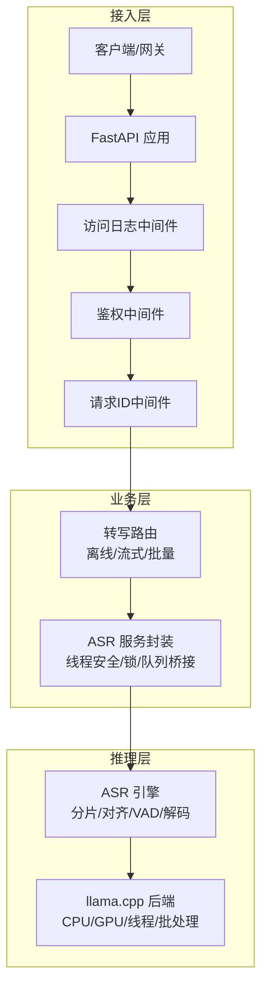
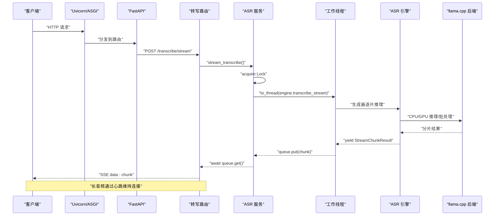
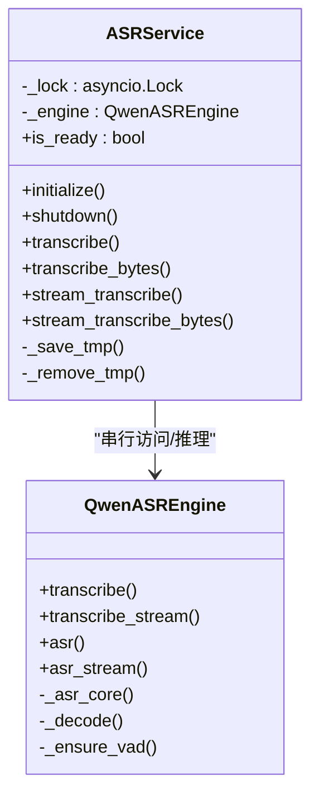
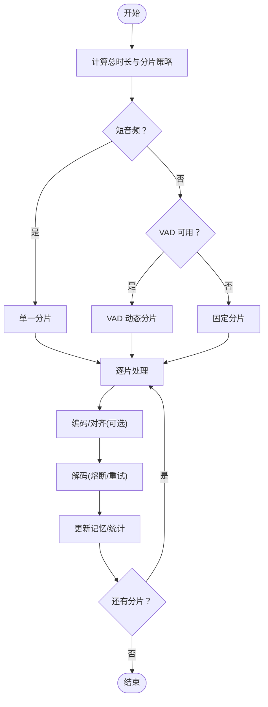

# 并发处理配置

<cite>
**本文引用的文件**   
- [core/config.py](file://core/config.py)
- [routers/transcribe.py](file://routers/transcribe.py)
- [services/asr_service.py](file://services/asr_service.py)
- [qwen_asr_gguf/inference/asr.py](file://qwen_asr_gguf/inference/asr.py)
- [infer.py](file://infer.py)
- [ref/llama.cpp/tools/server/server-queue.cpp](file://ref/llama.cpp/tools/server/server-queue.cpp)
- [ref/llama.cpp/tools/server/server-queue.h](file://ref/llama.cpp/tools/server/server-queue.h)
- [ref/llama.cpp/tools/server/server-context.cpp](file://ref/llama.cpp/tools/server/server-context.cpp)
- [ref/llama.cpp/ggml/src/ggml-threading.cpp](file://ref/llama.cpp/ggml/src/ggml-threading.cpp)
- [ref/llama.cpp/ggml/src/ggml-cpu/ggml-cpu.cpp](file://ref/llama.cpp/ggml/src/ggml-cpu/ggml-cpu.cpp)
- [ref/llama.cpp/ggml/src/ggml-cuda/cp-async.cuh](file://ref/llama.cpp/ggml/src/ggml-cuda/cp-async.cuh)
- [ref/llama.cpp/examples/convert_legacy_llama.py](file://ref/llama.cpp/examples/convert_legacy_llama.py)
</cite>

## 目录
1. [简介](#简介)
2. [项目结构](#项目结构)
3. [核心组件](#核心组件)
4. [架构总览](#架构总览)
5. [详细组件分析](#详细组件分析)
6. [依赖分析](#依赖分析)
7. [性能考虑](#性能考虑)
8. [故障排查指南](#故障排查指南)
9. [结论](#结论)
10. [附录](#附录)

## 简介
本文件聚焦于系统的并发处理配置与实现，围绕以下主题展开：
- HOST、PORT、MAX_FILE_SIZE_MB 等与并发相关的配置参数
- 多线程处理机制：音频分片处理、并行推理与资源调度
- 不同并发模式下的性能测试与调参建议（基于 CPU 核心数与 GPU 能力）
- 负载均衡策略、连接池与超时设置
- 高并发场景下的系统调优与故障处理

## 项目结构
本项目采用“FastAPI + ASGI 服务器 + 自研 ASR 引擎”的分层架构。并发控制的关键点分布在配置层、路由层、服务层与推理引擎层，并辅以 llama.cpp 的底层线程与后端调度能力。

图表来源
- [infer.py:55-123](file://infer.py#L55-L123)
- [routers/transcribe.py:1-383](file://routers/transcribe.py#L1-L383)
- [services/asr_service.py:1-322](file://services/asr_service.py#L1-L322)
- [qwen_asr_gguf/inference/asr.py:1-893](file://qwen_asr_gguf/inference/asr.py#L1-L893)

章节来源
- [infer.py:55-123](file://infer.py#L55-L123)
- [routers/transcribe.py:1-383](file://routers/transcribe.py#L1-L383)
- [services/asr_service.py:1-322](file://services/asr_service.py#L1-L322)
- [qwen_asr_gguf/inference/asr.py:1-893](file://qwen_asr_gguf/inference/asr.py#L1-L893)

## 核心组件
- 配置与参数映射
  - HOST、PORT：服务监听地址与端口，直接影响并发接入规模与反向代理/负载均衡部署
  - MAX_FILE_SIZE_MB：上传文件大小限制，间接影响并发排队与内存占用
- 路由与并发控制
  - 路由层负责请求校验、流式 SSE 心跳、以及将请求委派给服务层
- 服务层并发模型
  - 使用 asyncio.Lock 保证引擎串行访问，避免多线程竞争
  - 使用 asyncio.to_thread 将阻塞推理放入线程池，不阻塞事件循环
  - 流式接口通过 asyncio.Queue + threading.Thread 桥接同步生成器与异步消费者
- 引擎层分片与调度
  - 引擎支持固定分片与 VAD 动态分片两种模式，结合上下文记忆与对齐模块，实现高效推理
  - 解码阶段具备熔断与重试机制，提升鲁棒性

章节来源
- [core/config.py:52-109](file://core/config.py#L52-L109)
- [routers/transcribe.py:77-89](file://routers/transcribe.py#L77-L89)
- [services/asr_service.py:34-115](file://services/asr_service.py#L34-L115)
- [qwen_asr_gguf/inference/asr.py:40-142](file://qwen_asr_gguf/inference/asr.py#L40-L142)

## 架构总览
系统并发由“接入层并发 + 服务层串行 + 引擎层分片”三层协同实现。接入层通过 ASGI 服务器（uvicorn）承载并发连接；服务层通过锁与线程池实现串行推理与异步消费；引擎层通过分片与 VAD 降低单次推理负担，提高吞吐。

图表来源
- [infer.py:114-123](file://infer.py#L114-L123)
- [services/asr_service.py:186-288](file://services/asr_service.py#L186-L288)
- [qwen_asr_gguf/inference/asr.py:468-596](file://qwen_asr_gguf/inference/asr.py#L468-L596)

章节来源
- [infer.py:114-123](file://infer.py#L114-L123)
- [services/asr_service.py:186-288](file://services/asr_service.py#L186-L288)
- [qwen_asr_gguf/inference/asr.py:468-596](file://qwen_asr_gguf/inference/asr.py#L468-L596)

## 详细组件分析

### 配置参数与并发关系
- HOST、PORT
  - HOST/PORT 决定服务暴露范围与接入容量，配合反向代理/负载均衡可水平扩展
  - 在高并发场景下，建议将服务置于反向代理之后，利用其连接复用与队列能力
- MAX_FILE_SIZE_MB
  - 控制上传文件大小，避免单请求占用过多内存与 IO
  - 路由层在接收文件时进行校验，超限直接拒绝，减少无效并发占用

章节来源
- [core/config.py:52-109](file://core/config.py#L52-L109)
- [routers/transcribe.py:77-89](file://routers/transcribe.py#L77-L89)

### 路由层并发与流式处理
- 离线转写：一次性读取文件，调用服务层进行串行推理，返回完整结果
- 批量转写：逐文件读取并校验大小，跳过超限文件，其余按序处理
- 流式转写（SSE）：将二进制写入临时文件，启动异步生成器，周期性发送心跳，避免代理/客户端超时
- 健康检查：返回引擎就绪状态与 GPU 开关状态

章节来源
- [routers/transcribe.py:120-223](file://routers/transcribe.py#L120-L223)
- [routers/transcribe.py:228-370](file://routers/transcribe.py#L228-L370)
- [routers/transcribe.py:372-383](file://routers/transcribe.py#L372-L383)

### 服务层并发模型与资源调度
- 线程安全
  - 使用 asyncio.Lock 保证同一时刻只有一个推理任务运行，避免引擎内部状态竞争
- 线程池与事件循环分离
  - 使用 asyncio.to_thread 将阻塞推理放入线程池，不阻塞 FastAPI 事件循环
- 流式桥接
  - 通过 asyncio.Queue + threading.Thread 将同步生成器产物投递到异步消费端
  - 设置队列最大容量以实现背压，避免长音频导致内存暴涨
- 生命周期
  - 通过 lifespan 在启动时初始化引擎，在关闭时优雅释放

图表来源
- [services/asr_service.py:34-115](file://services/asr_service.py#L34-L115)
- [services/asr_service.py:120-288](file://services/asr_service.py#L120-L288)
- [qwen_asr_gguf/inference/asr.py:40-142](file://qwen_asr_gguf/inference/asr.py#L40-L142)

章节来源
- [services/asr_service.py:34-115](file://services/asr_service.py#L34-L115)
- [services/asr_service.py:120-288](file://services/asr_service.py#L120-L288)
- [qwen_asr_gguf/inference/asr.py:40-142](file://qwen_asr_gguf/inference/asr.py#L40-L142)

### 引擎层分片与并行推理
- 分片策略
  - 短音频：单一分片直接处理
  - 长音频：优先使用 VAD 动态分片，按语音边界组合，避免静音段参与推理
  - 降级：VAD 不可用时采用固定等长分片
- 记忆与上下文
  - VAD 模式：仅记忆文本，避免非连续音频拼接导致的模型混乱
  - 固定模式：保留音频 + 文本双重记忆，但需注意 n_ctx 超限时回退
- 解码与抗幻觉
  - 预填充与生成阶段分别统计耗时
  - 采用熔断与重试、token 级/短语级重复检测、max_new_tokens 上限等手段
- 对齐模块
  - 可选启用，按需对齐，同步执行

图表来源
- [qwen_asr_gguf/inference/asr.py:602-893](file://qwen_asr_gguf/inference/asr.py#L602-L893)

章节来源
- [qwen_asr_gguf/inference/asr.py:602-893](file://qwen_asr_gguf/inference/asr.py#L602-L893)

### 底层线程与后端调度参考
- llama.cpp 线程与批处理
  - CPU 后端提供图计算计划与同步执行接口
  - CUDA 后端提供异步拷贝与等待指令，提升数据传输效率
- 任务队列与槽位调度
  - 任务队列支持延迟与优先级弹出，便于资源回收与重试
  - 槽位调度逻辑在无可用槽位或请求槽位不可用时延迟任务

章节来源
- [ref/llama.cpp/ggml/src/ggml-cpu/ggml-cpu.cpp:189-218](file://ref/llama.cpp/ggml/src/ggml-cpu/ggml-cpu.cpp#L189-L218)
- [ref/llama.cpp/ggml/src/ggml-cuda/cp-async.cuh:48-57](file://ref/llama.cpp/ggml/src/ggml-cuda/cp-async.cuh#L48-L57)
- [ref/llama.cpp/tools/server/server-queue.cpp:71-100](file://ref/llama.cpp/tools/server/server-queue.cpp#L71-L100)
- [ref/llama.cpp/tools/server/server-context.cpp:1702-1718](file://ref/llama.cpp/tools/server/server-context.cpp#L1702-L1718)

## 依赖分析
- 配置依赖
  - 路由层依赖配置中的 HOST、PORT、MAX_FILE_SIZE_MB
  - 服务层依赖配置构建引擎参数（分片大小、记忆数、动态分片阈值、VAD 参数等）
- 运行时依赖
  - ASGI 服务器（uvicorn）承载并发连接
  - 引擎依赖 llama.cpp 后端（CPU/GPU），受硬件资源与批处理能力影响
- 资源耦合
  - 服务层通过锁与队列隔离并发风险
  - 引擎层通过分片与 VAD 降低单次推理压力

图表来源
- [core/config.py:52-109](file://core/config.py#L52-L109)
- [services/asr_service.py:72-102](file://services/asr_service.py#L72-L102)
- [routers/transcribe.py:33-38](file://routers/transcribe.py#L33-L38)

章节来源
- [core/config.py:52-109](file://core/config.py#L52-L109)
- [services/asr_service.py:72-102](file://services/asr_service.py#L72-L102)
- [routers/transcribe.py:33-38](file://routers/transcribe.py#L33-L38)

## 性能考虑
- 并发模式与参数建议
  - 单机单进程（uvicorn 默认）：适合低并发与开发调试
  - 多进程（--workers）：适合 CPU 密集型推理，充分利用多核
  - GPU 推理：优先启用 GPU，合理设置分片大小与记忆数，避免 n_ctx 超限
  - 流式转写：长音频建议开启，配合心跳与队列背压，避免内存峰值
- CPU 与 GPU 调优
  - CPU：增大线程数与批处理大小，注意内存带宽瓶颈
  - GPU：关注显存占用与算力利用率，避免 OOM；必要时减小分片长度
- 超时与连接池
  - keep-alive 超时：长音频流式转写建议延长（服务端已设置）
  - 反向代理：启用连接复用与队列，避免上游超时中断
  - 连接池：针对外部依赖（如数据库/缓存）设置合理池大小与超时

[本节为通用指导，不直接分析具体文件]

## 故障排查指南
- 413 文件过大
  - 现象：上传文件超过 MAX_FILE_SIZE_MB 被拒绝
  - 处理：降低单文件大小或调整配置
- 推理卡死/超时
  - 现象：长时间无响应或 SSE 心跳中断
  - 处理：检查队列背压、锁争用、长音频超时；确认心跳逻辑正常
- GPU OOM
  - 现象：显存不足导致推理失败
  - 处理：减小分片长度、关闭对齐、降低温度或切换 CPU
- VAD 不可用
  - 现象：长音频无法动态分片，退化为固定分片
  - 处理：检查 VAD 模型路径与依赖，或接受固定分片策略

章节来源
- [routers/transcribe.py:77-89](file://routers/transcribe.py#L77-L89)
- [services/asr_service.py:209-257](file://services/asr_service.py#L209-L257)
- [qwen_asr_gguf/inference/asr.py:812-821](file://qwen_asr_gguf/inference/asr.py#L812-L821)

## 结论
本系统通过“接入层并发 + 服务层串行 + 引擎层分片”的组合，实现了稳定高效的并发处理。HOST/PORT/ MAX_FILE_SIZE_MB 等参数直接影响并发接入与资源占用；服务层的锁与队列机制有效隔离了并发风险；引擎层的分片与 VAD 降低了单次推理成本。结合硬件能力与业务场景，合理配置分片大小、记忆数与后端参数，可在 CPU/GPU 环境下获得最佳吞吐与延迟表现。

[本节为总结，不直接分析具体文件]

## 附录
- 配置项速查
  - HOST/PORT：服务监听地址与端口
  - MAX_FILE_SIZE_MB：上传文件大小限制
  - ASR_CHUNK_SIZE/ASR_MEMORY_NUM/ASR_DYNAMIC_CHUNK_THRESHOLD：分片与记忆策略
  - VAD_*：VAD 阈值与窗口参数
  - ALIGNER_USE_GPU/VAD_USE_GPU：后端设备选择
- 参考实现
  - 任务队列与槽位调度：[server-queue.cpp:71-100](file://ref/llama.cpp/tools/server/server-queue.cpp#L71-L100)、[server-context.cpp:1702-1718](file://ref/llama.cpp/tools/server/server-context.cpp#L1702-L1718)
  - 线程与批处理：[ggml-cpu.cpp:189-218](file://ref/llama.cpp/ggml/src/ggml-cpu/ggml-cpu.cpp#L189-L218)
  - CUDA 异步拷贝：[cp-async.cuh:48-57](file://ref/llama.cpp/ggml/src/ggml-cuda/cp-async.cuh#L48-L57)
  - 并发映射示例：[convert_legacy_llama.py:699-721](file://ref/llama.cpp/examples/convert_legacy_llama.py#L699-L721)