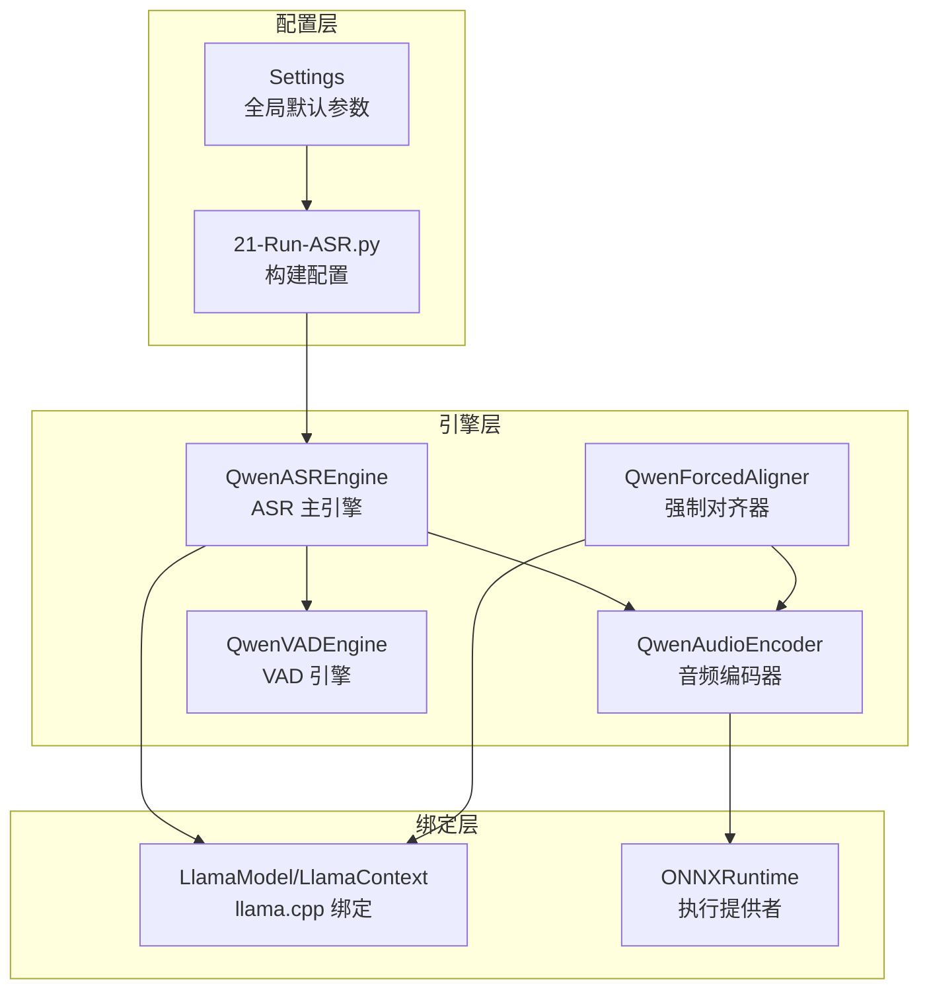
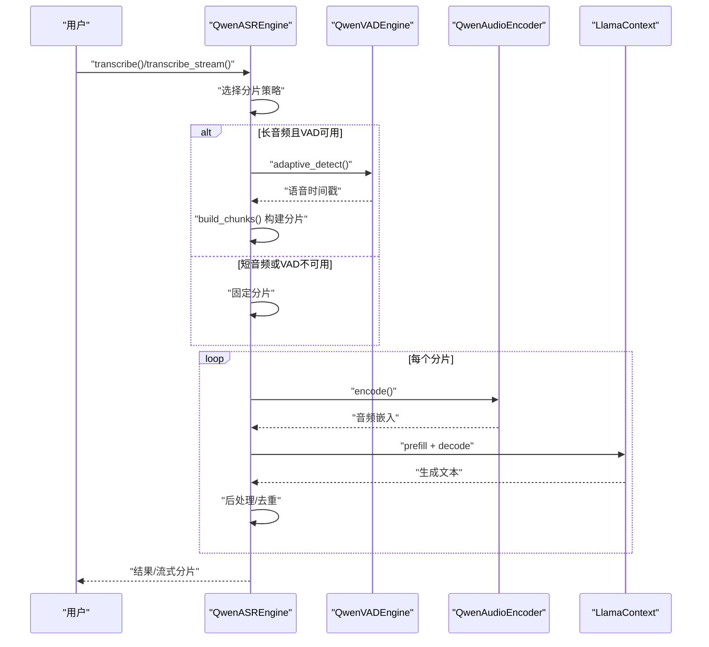
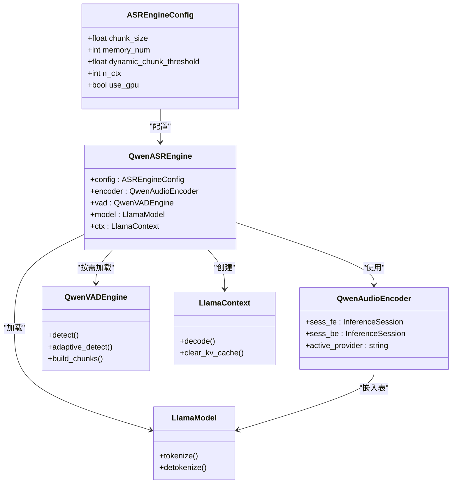

# 性能调优参数

<cite>
**本文档引用的文件**
- [qwen_asr_gguf/inference/schema.py](file://qwen_asr_gguf/inference/schema.py)
- [qwen_asr_gguf/inference/asr.py](file://qwen_asr_gguf/inference/asr.py)
- [qwen_asr_gguf/inference/encoder.py](file://qwen_asr_gguf/inference/encoder.py)
- [qwen_asr_gguf/inference/llama.py](file://qwen_asr_gguf/inference/llama.py)
- [qwen_asr_gguf/inference/vad.py](file://qwen_asr_gguf/inference/vad.py)
- [qwen_asr_gguf/inference/aligner.py](file://qwen_asr_gguf/inference/aligner.py)
- [core/config.py](file://core/config.py)
- [21-Run-ASR.py](file://21-Run-ASR.py)
- [ref/llama.cpp/ggml/src/ggml-vulkan/ggml-vulkan.cpp](file://ref/llama.cpp/ggml/src/ggml-vulkan/ggml-vulkan.cpp)
- [ref/llama.cpp/tools/perplexity/perplexity.cpp](file://ref/llama.cpp/tools/perplexity/perplexity.cpp)
- [ref/llama.cpp/tools/completion/completion.cpp](file://ref/llama.cpp/tools/completion/completion.cpp)
- [ref/llama.cpp/tools/llama-bench/README.md](file://ref/llama.cpp/tools/llama-bench/README.md)
</cite>

## 更新摘要
**变更内容**
- 新增 dynamic_chunk_threshold 参数，实现智能长音频分片策略
- 改进 VAD 性能参数配置，优化语音检测阈值和最小分片时长
- 优化内存管理和并发处理配置，提升整体性能表现
- 增强动态分片模式下的性能调优指南

## 目录
1. [简介](#简介)
2. [项目结构](#项目结构)
3. [核心组件](#核心组件)
4. [架构总览](#架构总览)
5. [详细组件分析](#详细组件分析)
6. [依赖分析](#依赖分析)
7. [性能考量](#性能考量)
8. [故障排查指南](#故障排查指南)
9. [结论](#结论)
10. [附录](#附录)

## 简介
本文件聚焦于本项目的性能调优参数与策略，涵盖 ASR_CHUNK_SIZE、ASR_MEMORY_NUM、SIMILAR_THRESHOLD、dynamic_chunk_threshold、n_ctx、n_batch、n_threads、n_threads_batch、speech_threshold、vad_min_duration 等关键参数。文档从系统架构、组件关系、数据流与处理逻辑入手，结合不同硬件环境（CPU-only、GPU、Vulkan）给出参数调优建议，并提供内存使用优化、并发处理配置与缓存策略，以及性能基准测试与调优工具使用指南。

**更新** 新增 dynamic_chunk_threshold 参数，实现基于音频时长的智能分片策略，显著提升长音频处理效率。

## 项目结构
本项目采用"推理引擎 + 后端绑定 + 配置中心"的分层组织：
- 配置层：集中定义全局默认参数与环境变量映射
- 引擎层：ASR 引擎、VAD 引擎、对齐器、编码器
- 绑定层：llama.cpp Python 绑定与 ONNX Runtime 执行提供者
- 示例与脚本：演示如何构建配置与运行推理

**图表来源**
- [core/config.py:52-109](file://core/config.py#L52-L109)
- [21-Run-ASR.py:68-95](file://21-Run-ASR.py#L68-L95)
- [qwen_asr_gguf/inference/asr.py:40-142](file://qwen_asr_gguf/inference/asr.py#L40-L142)
- [qwen_asr_gguf/inference/encoder.py:119-197](file://qwen_asr_gguf/inference/encoder.py#L119-L197)
- [qwen_asr_gguf/inference/llama.py:443-549](file://qwen_asr_gguf/inference/llama.py#L443-L549)
- [qwen_asr_gguf/inference/vad.py:29-81](file://qwen_asr_gguf/inference/vad.py#L29-L81)
- [qwen_asr_gguf/inference/aligner.py:229-259](file://qwen_asr_gguf/inference/aligner.py#L229-L259)

**章节来源**
- [core/config.py:52-109](file://core/config.py#L52-L109)
- [21-Run-ASR.py:68-95](file://21-Run-ASR.py#L68-L95)

## 核心组件
- ASR 引擎：负责分片策略、VAD 集成、编码、解码、对齐与统计输出
- 编码器：Split 前端/后端 ONNX 模型，支持 CPU/GPU/DML Provider
- VAD 引擎：FireRedVAD 非流式检测，支持自适应阈值与分片构建
- 对齐器：基于 LLM 的强制对齐，支持多语言分词与时间戳修正
- llama.cpp 绑定：模型加载、上下文、批处理、采样器与 KV 缓存

**章节来源**
- [qwen_asr_gguf/inference/asr.py:40-142](file://qwen_asr_gguf/inference/asr.py#L40-L142)
- [qwen_asr_gguf/inference/encoder.py:119-197](file://qwen_asr_gguf/inference/encoder.py#L119-L197)
- [qwen_asr_gguf/inference/vad.py:29-81](file://qwen_asr_gguf/inference/vad.py#L29-L81)
- [qwen_asr_gguf/inference/aligner.py:229-259](file://qwen_asr_gguf/inference/aligner.py#L229-L259)
- [qwen_asr_gguf/inference/llama.py:443-549](file://qwen_asr_gguf/inference/llama.py#L443-L549)

## 架构总览
ASR 主流程：音频加载 → 分片策略（短/动态/固定）→ VAD 过滤 → 编码 → 构建提示 → 解码 → 后处理 → 结果输出。VAD 与对齐器按需加载，提升长音频处理效率。

**图表来源**
- [qwen_asr_gguf/inference/asr.py:602-774](file://qwen_asr_gguf/inference/asr.py#L602-L774)
- [qwen_asr_gguf/inference/vad.py:160-222](file://qwen_asr_gguf/inference/vad.py#L160-L222)
- [qwen_asr_gguf/inference/encoder.py:260-280](file://qwen_asr_gguf/inference/encoder.py#L260-L280)
- [qwen_asr_gguf/inference/llama.py:520-544](file://qwen_asr_gguf/inference/llama.py#L520-L544)

## 详细组件分析

### 参数总览与影响
- ASR_CHUNK_SIZE（秒）：控制分片时长，影响吞吐与延迟权衡。越大吞吐越高但延迟上升，越小延迟越低但分片开销增加。
- ASR_MEMORY_NUM：上下文记忆的分片数量，越大上下文越强但内存占用越高。
- dynamic_chunk_threshold（秒）：**新增** 长音频阈值，超过时启用 VAD 动态分片，显著减少静音处理。
- n_ctx：上下文窗口大小，过大易越界崩溃，过小影响长文本连贯性。
- n_batch/n_ubatch：批处理大小，影响吞吐与显存占用。
- n_threads/n_threads_batch：推理线程数，CPU 密集场景需合理分配。
- speech_threshold：VAD 初始阈值，配合自适应阈值提升鲁棒性。
- vad_min_duration：启用 VAD 的最小分片时长，避免微小片段的 VAD 开销。
- SIMILAR_THRESHOLD：相似度阈值，用于某些后处理/匹配逻辑（如热词/纠错）。

**更新** 新增 dynamic_chunk_threshold 参数，实现基于音频时长的智能分片策略，显著提升长音频处理效率。

**章节来源**
- [qwen_asr_gguf/inference/schema.py:162-210](file://qwen_asr_gguf/inference/schema.py#L162-L210)
- [core/config.py:62-91](file://core/config.py#L62-L91)
- [qwen_asr_gguf/inference/vad.py:86-116](file://qwen_asr_gguf/inference/vad.py#L86-L116)
- [qwen_asr_gguf/inference/asr.py:638-666](file://qwen_asr_gguf/inference/asr.py#L638-L666)

### 参数对性能的影响与调优策略

- ASR_CHUNK_SIZE
  - 影响：增大提升吞吐但增加延迟与显存占用；减小降低延迟但增加分片与调度开销。
  - 建议：默认 30s 适合多数场景；实时流式可降至 10–15s；批量离线可提升至 45–60s。
  - 硬件策略：GPU/CPU 性能相近时，优先保证 n_batch 能容纳至少 2–3 个分片。

- ASR_MEMORY_NUM
  - 影响：记忆越多上下文越强，但队列与嵌入占用越高，且 VAD 模式下仅记忆文本避免非连续音频拼接。
  - 建议：默认 1；高连贯需求可增至 2–3；注意与 n_ctx 协同。

- **dynamic_chunk_threshold（新增）**
  - 影响：长音频启用 VAD 动态分片，显著减少静音处理与 RTF。
  - 建议：默认 10s；短音频场景可下调至 5–8s；长音频场景可上调至 15–20s。
  - 性能优化：该参数直接影响 VAD 延迟加载机制，合理设置可避免不必要的 VAD 初始化开销。

- n_ctx
  - 影响：过小影响长文本连贯，过大易越界；ASR 默认约每秒 20 个 token。
  - 建议：默认 2048；长文本可提升至 4096；严格控制输入长度避免越界。

- n_batch/n_ubatch
  - 影响：批大小影响吞吐与显存；ubatch 控制微批粒度。
  - 建议：GPU 推荐 n_batch=2048~4096；CPU 可适当下调；根据显存/内存峰值调节。

- n_threads/n_threads_batch
  - 影响：线程数影响 CPU 利用率与调度开销。
  - 建议：n_threads≈CPU核心数的一半，n_threads_batch≈CPU核心数；避免过度并发导致抖动。

- **speech_threshold 与 vad_min_duration（改进）**
  - 影响：阈值影响静音/语音判别灵敏度；最小分片时长避免对微小片段启用 VAD。
  - 建议：speech_threshold 默认 0.35；vad_min_duration 10s；复杂噪声环境可略提高阈值。
  - 性能优化：合理的 vad_min_duration 可避免短片段的 VAD 开销，提升整体吞吐。

- SIMILAR_THRESHOLD
  - 影响：相似度阈值用于匹配/纠错等逻辑，过高过低都会影响召回与准确性。
  - 建议：默认 0.6；根据数据分布与任务需求微调。

**更新** 新增 dynamic_chunk_threshold 参数的详细调优策略，改进 VAD 性能参数的配置建议。

**章节来源**
- [qwen_asr_gguf/inference/schema.py:162-210](file://qwen_asr_gguf/inference/schema.py#L162-L210)
- [core/config.py:62-91](file://core/config.py#L62-L91)
- [qwen_asr_gguf/inference/vad.py:86-116](file://qwen_asr_gguf/inference/vad.py#L86-L116)
- [qwen_asr_gguf/inference/asr.py:638-666](file://qwen_asr_gguf/inference/asr.py#L638-L666)

### 不同硬件环境下的调优策略

- CPU-only
  - 降低 ASR_CHUNK_SIZE 与 ASR_MEMORY_NUM，避免过多分片与嵌入堆积
  - 适度降低 n_batch，提升线程亲和性
  - 保持默认 n_threads≈CPU核心数的一半，n_threads_batch≈CPU核心数
  - 关闭或禁用 GPU 相关 Provider（如 CUDA/DML）

- GPU（CUDA/ROCm/TensorRT）
  - 启用 use_gpu，选择合适 Provider（CUDA 优先）
  - 提升 n_batch 与 n_ctx，充分利用显存带宽
  - 合理设置 n_threads 与 n_threads_batch，避免 CPU 竞争
  - 对 ONNX 编码器启用 CUDA Provider，减少 CPU-GPU 传输

- Vulkan
  - 通过环境变量控制设备与特性（如 GGML_VK_VISIBLE_DEVICES、GGML_VK_DISABLE_F16）
  - 在支持 FP16 存储与计算的设备上启用半精度以提升吞吐
  - 注意设备可见性与驱动版本，避免 F16 禁用导致性能下降

**章节来源**
- [qwen_asr_gguf/inference/encoder.py:130-165](file://qwen_asr_gguf/inference/encoder.py#L130-L165)
- [ref/llama.cpp/ggml/src/ggml-vulkan/ggml-vulkan.cpp:5232-5512](file://ref/llama.cpp/ggml/src/ggml-vulkan/ggml-vulkan.cpp#L5232-L5512)

### 内存使用优化
- 编码器动态形状：短音频使用动态形状，避免固定填充带来的冗余计算与内存占用
- KV 缓存清理：每次推理前清理 KV 缓存，避免长期累积导致显存/内存增长
- 分片记忆：仅保留有限数量的历史文本，避免长序列上下文膨胀
- ONNX 预热：在 DML 模式下进行固定长度预热，减少首次推理开销
- **dynamic_chunk_threshold 优化**：合理设置阈值避免不必要的 VAD 初始化，减少内存占用

**更新** 新增 dynamic_chunk_threshold 的内存优化策略。

**章节来源**
- [qwen_asr_gguf/inference/encoder.py:177-196](file://qwen_asr_gguf/inference/encoder.py#L177-L196)
- [qwen_asr_gguf/inference/llama.py:541-544](file://qwen_asr_gguf/inference/llama.py#L541-L544)
- [qwen_asr_gguf/inference/asr.py:643](file://qwen_asr_gguf/inference/asr.py#L643)

### 并发处理配置
- 线程分配：n_threads≈CPU核心数的一半，n_threads_batch≈CPU核心数
- 批处理：n_batch 与 n_ubatch 需与硬件能力匹配，避免过载
- VAD：短分片不启用 VAD，减少不必要的检测开销
- ONNX：按 Provider 选择最优线程池与图优化级别
- **dynamic_chunk_threshold 协调**：与 n_batch 协同，确保长音频分片的并发处理效率

**更新** 新增 dynamic_chunk_threshold 与并发处理的协调策略。

**章节来源**
- [qwen_asr_gguf/inference/llama.py:487-518](file://qwen_asr_gguf/inference/llama.py#L487-L518)
- [qwen_asr_gguf/inference/encoder.py:130-136](file://qwen_asr_gguf/inference/encoder.py#L130-L136)
- [qwen_asr_gguf/inference/vad.py:437-447](file://qwen_asr_gguf/inference/vad.py#L437-L447)

### 缓存策略
- KV 缓存：解码前清理，避免跨样本污染
- 采样器历史：按需维护，避免无限增长
- 编码器预热：固定形状与动态形状分别预热，减少冷启动
- **VAD 缓存优化**：利用 adaptive_detect 的概率缓存，避免重复计算

**更新** 新增 VAD 缓存优化策略。

**章节来源**
- [qwen_asr_gguf/inference/llama.py:541-544](file://qwen_asr_gguf/inference/llama.py#L541-L544)
- [qwen_asr_gguf/inference/encoder.py:186-196](file://qwen_asr_gguf/inference/encoder.py#L186-L196)

### 性能基准测试与调优工具
- llama.cpp 工具链
  - perplexity：计算困惑度，评估模型稳定性与上下文长度影响
  - completion：生成性能评测，支持上下文滑动与批大小对比
  - imatrix：矩阵计算性能分析，辅助批大小与上下文选择
  - **llama-bench**：全面的性能基准测试工具，支持多种测试场景
- 建议流程
  - 固定硬件与模型，逐步调整 n_ctx、n_batch、ASR_CHUNK_SIZE、**dynamic_chunk_threshold**
  - 使用 perplexity 评估 n_ctx 合理性，completion 评估吞吐与延迟
  - 结合 ASR 引擎统计指标（RTF、prefill/decode 速度）综合评估
  - **重点关注 dynamic_chunk_threshold 对长音频处理性能的影响**

**更新** 新增 llama-bench 工具的使用指南和 dynamic_chunk_threshold 的性能评估方法。

**章节来源**
- [ref/llama.cpp/tools/perplexity/perplexity.cpp:330-366](file://ref/llama.cpp/tools/perplexity/perplexity.cpp#L330-L366)
- [ref/llama.cpp/tools/completion/completion.cpp:596-620](file://ref/llama.cpp/tools/completion/completion.cpp#L596-L620)
- [ref/llama.cpp/tools/llama-bench/README.md:96-287](file://ref/llama.cpp/tools/llama-bench/README.md#L96-L287)

## 依赖分析
ASR 引擎依赖关系如下：

**图表来源**
- [qwen_asr_gguf/inference/schema.py:162-210](file://qwen_asr_gguf/inference/schema.py#L162-L210)
- [qwen_asr_gguf/inference/asr.py:40-142](file://qwen_asr_gguf/inference/asr.py#L40-L142)
- [qwen_asr_gguf/inference/encoder.py:119-197](file://qwen_asr_gguf/inference/encoder.py#L119-L197)
- [qwen_asr_gguf/inference/llama.py:443-549](file://qwen_asr_gguf/inference/llama.py#L443-L549)

**章节来源**
- [qwen_asr_gguf/inference/asr.py:40-142](file://qwen_asr_gguf/inference/asr.py#L40-L142)
- [qwen_asr_gguf/inference/encoder.py:119-197](file://qwen_asr_gguf/inference/encoder.py#L119-L197)
- [qwen_asr_gguf/inference/llama.py:443-549](file://qwen_asr_gguf/inference/llama.py#L443-L549)

## 性能考量
- 分片与 VAD：长音频启用 VAD 动态分片可显著降低 RTF 与幻觉风险
- 批处理与线程：合理设置 n_batch 与线程数，避免 CPU/GPU 抖动
- 上下文窗口：n_ctx 与 ASR_CHUNK_SIZE 协同，避免越界与性能退化
- 编码器 Provider：GPU/ROCm/TensorRT/DML 选择影响吞吐与延迟
- KV 缓存与预热：及时清理与预热可减少冷启动与内存碎片
- **dynamic_chunk_threshold 优化**：智能分片策略显著提升长音频处理效率

**更新** 新增 dynamic_chunk_threshold 对性能的影响分析。

## 故障排查指南
- 进程崩溃（上下文越界）
  - 现象：序列长度超过 n_ctx 导致 GGML 断言并终止
  - 处理：缩短 ASR_CHUNK_SIZE 或提升 n_ctx；确保输入长度受控
- VAD 加载失败
  - 现象：缺少 fireredvad 依赖或模型路径错误
  - 处理：安装依赖或检查模型目录；必要时降级为固定分片
- ONNX Provider 不可用
  - 现象：未检测到可用 GPU Provider
  - 处理：回退到 CPUExecutionProvider；检查驱动与版本
- Vulkan 性能异常
  - 现象：F16 禁用或设备不可见
  - 处理：设置 GGML_VK_VISIBLE_DEVICES；确认设备支持 FP16
- **dynamic_chunk_threshold 设置不当**
  - 现象：长音频处理缓慢或 VAD 延迟加载频繁
  - 处理：根据音频时长特点调整阈值，避免过小导致频繁 VAD 初始化

**更新** 新增 dynamic_chunk_threshold 相关的故障排查指南。

**章节来源**
- [qwen_asr_gguf/inference/asr.py:226-238](file://qwen_asr_gguf/inference/asr.py#L226-L238)
- [qwen_asr_gguf/inference/vad.py:51-81](file://qwen_asr_gguf/inference/vad.py#L51-L81)
- [qwen_asr_gguf/inference/encoder.py:137-165](file://qwen_asr_gguf/inference/encoder.py#L137-L165)
- [ref/llama.cpp/ggml/src/ggml-vulkan/ggml-vulkan.cpp:5232-5512](file://ref/llama.cpp/ggml/src/ggml-vulkan/ggml-vulkan.cpp#L5232-L5512)

## 结论
本项目的性能调优围绕"分片策略（VAD/固定）+ 编码器 Provider + llama.cpp 上下文与批处理 + 线程与缓存"展开。通过合理设置 ASR_CHUNK_SIZE、ASR_MEMORY_NUM、**dynamic_chunk_threshold**、n_ctx、n_batch、n_threads、speech_threshold、vad_min_duration 等参数，并结合硬件特性（CPU/GPU/Vulkan），可在延迟与吞吐之间取得最佳平衡。**新增的 dynamic_chunk_threshold 参数实现了智能长音频分片策略，显著提升了长音频处理效率**。建议以基准工具链进行系统性验证，并持续监控 RTF、prefill/decode 速度与内存占用。

**更新** 强调 dynamic_chunk_threshold 参数的重要性和性能提升效果。

## 附录

### 参数对照表
- ASR_CHUNK_SIZE：分片时长（秒）
- ASR_MEMORY_NUM：上下文记忆分片数
- **dynamic_chunk_threshold（新增）**：启用 VAD 的音频时长阈值（秒）
- n_ctx：上下文窗口大小
- n_batch/n_ubatch：批处理与微批大小
- n_threads/n_threads_batch：推理线程数
- **speech_threshold（改进）**：VAD 初始语音概率阈值
- **vad_min_duration（改进）**：启用 VAD 的最小分片时长（秒）
- SIMILAR_THRESHOLD：相似度阈值（用于匹配/纠错）

**更新** 新增 dynamic_chunk_threshold 参数及其改进的 VAD 性能参数。

**章节来源**
- [qwen_asr_gguf/inference/schema.py:162-210](file://qwen_asr_gguf/inference/schema.py#L162-L210)
- [core/config.py:62-91](file://core/config.py#L62-L91)