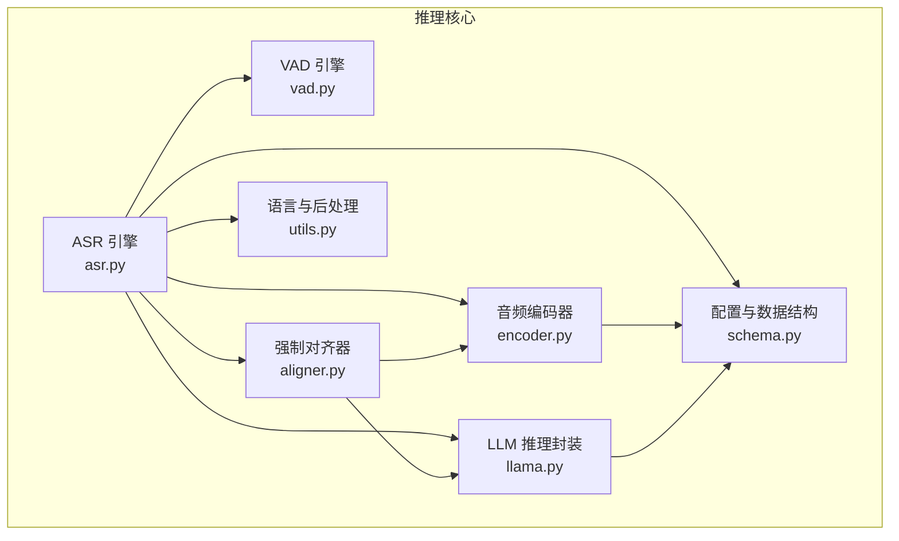
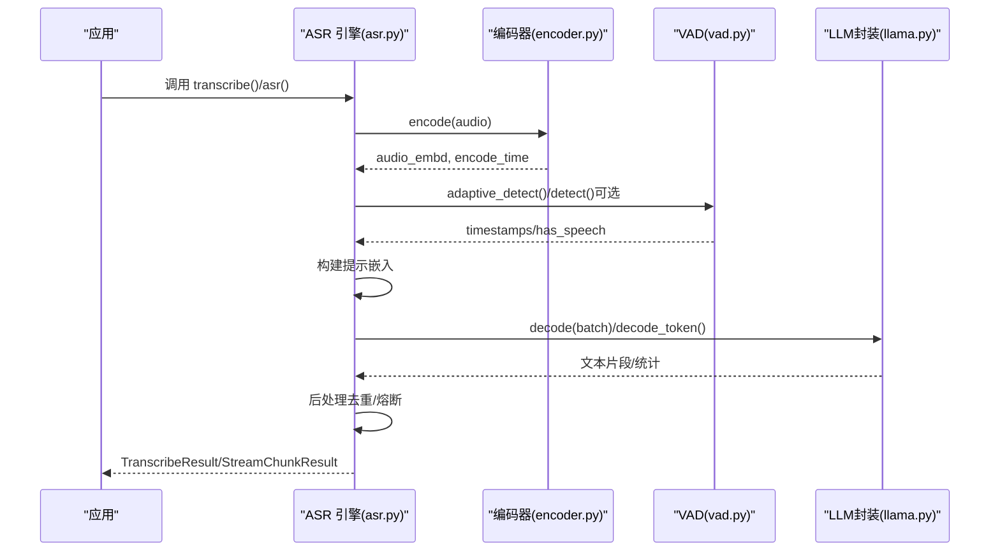
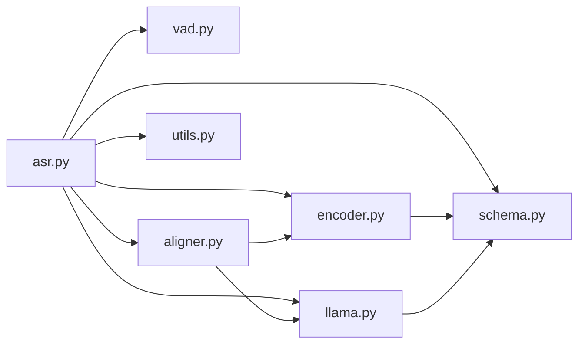

# 模型推理优化

<cite>
**本文引用的文件**
- [qwen_asr_gguf/inference/asr.py](file://qwen_asr_gguf/inference/asr.py)
- [qwen_asr_gguf/inference/llama.py](file://qwen_asr_gguf/inference/llama.py)
- [qwen_asr_gguf/inference/encoder.py](file://qwen_asr_gguf/inference/encoder.py)
- [qwen_asr_gguf/inference/vad.py](file://qwen_asr_gguf/inference/vad.py)
- [qwen_asr_gguf/inference/utils.py](file://qwen_asr_gguf/inference/utils.py)
- [qwen_asr_gguf/inference/schema.py](file://qwen_asr_gguf/inference/schema.py)
- [qwen_asr_gguf/inference/aligner.py](file://qwen_asr_gguf/inference/aligner.py)
- [ref/llama.cpp/tools/llama-bench/README.md](file://ref/llama.cpp/tools/llama-bench/README.md)
</cite>

## 目录
1. [简介](#简介)
2. [项目结构](#项目结构)
3. [核心组件](#核心组件)
4. [架构总览](#架构总览)
5. [详细组件分析](#详细组件分析)
6. [依赖关系分析](#依赖关系分析)
7. [性能考量](#性能考量)
8. [故障排查指南](#故障排查指南)
9. [结论](#结论)
10. [附录](#附录)

## 简介
本文件聚焦于模型推理优化，围绕以下主题展开：
- 推理相关参数：ENABLE_CTC、DEFAULT_LANGUAGE 等（说明其在本仓库中的对应实现与替代方案）
- CTC 解码器的作用与性能影响（结合本项目实际采用的解码策略进行对比说明）
- 不同语言模型的优化策略（基于本项目支持的语言列表与分词策略）
- 模型量化、混合精度等加速技术的应用现状与建议
- GPU/CPU 推理的性能差异与切换策略
- 推理性能基准测试方法与瓶颈分析工具使用指南
- 模型缓存策略与预热机制的最佳实践

## 项目结构
本项目推理优化相关的核心代码集中在 qwen_asr_gguf/inference 目录，主要包含：
- ASR 引擎与流水线：asr.py
- LLM 推理封装：llama.py
- 音频编码器（ONNX 前后端分离）：encoder.py
- VAD（语音活动检测）：vad.py
- 语言与后处理工具：utils.py、aligner.py
- 配置与数据结构：schema.py

图表来源
- [qwen_asr_gguf/inference/asr.py:40-103](file://qwen_asr_gguf/inference/asr.py#L40-L103)
- [qwen_asr_gguf/inference/encoder.py:119-196](file://qwen_asr_gguf/inference/encoder.py#L119-L196)
- [qwen_asr_gguf/inference/llama.py:443-548](file://qwen_asr_gguf/inference/llama.py#L443-L548)
- [qwen_asr_gguf/inference/vad.py:29-81](file://qwen_asr_gguf/inference/vad.py#L29-L81)
- [qwen_asr_gguf/inference/aligner.py:229-259](file://qwen_asr_gguf/inference/aligner.py#L229-L259)
- [qwen_asr_gguf/inference/utils.py:5-36](file://qwen_asr_gguf/inference/utils.py#L5-L36)
- [qwen_asr_gguf/inference/schema.py:162-210](file://qwen_asr_gguf/inference/schema.py#L162-L210)

章节来源
- [qwen_asr_gguf/inference/asr.py:40-103](file://qwen_asr_gguf/inference/asr.py#L40-L103)
- [qwen_asr_gguf/inference/encoder.py:119-196](file://qwen_asr_gguf/inference/encoder.py#L119-L196)
- [qwen_asr_gguf/inference/llama.py:443-548](file://qwen_asr_gguf/inference/llama.py#L443-L548)
- [qwen_asr_gguf/inference/vad.py:29-81](file://qwen_asr_gguf/inference/vad.py#L29-L81)
- [qwen_asr_gguf/inference/aligner.py:229-259](file://qwen_asr_gguf/inference/aligner.py#L229-L259)
- [qwen_asr_gguf/inference/utils.py:5-36](file://qwen_asr_gguf/inference/utils.py#L5-L36)
- [qwen_asr_gguf/inference/schema.py:162-210](file://qwen_asr_gguf/inference/schema.py#L162-L210)

## 核心组件
- ASR 引擎：负责整体流水线编排，包括 VAD 动态分片、编码、提示构建、LLM 解码、后处理与统计输出。
- LLM 推理封装：封装 llama.cpp 的模型、上下文、批处理与采样器，提供解码循环与 KV 缓存管理。
- 音频编码器：Split 前端（ONNX）+ 后端（ONNX）的编码流水线，支持固定/动态形状与 GPU Provider 选择。
- VAD：基于 FireRedVAD 的非流式检测，提供自适应阈值与分片构建能力。
- 强制对齐器：基于编码器与 LLM 的时间戳对齐，支持多语言分词与时间戳修复。
- 工具与配置：语言规范化、重复修复、配置结构体与常量定义。

章节来源
- [qwen_asr_gguf/inference/asr.py:40-103](file://qwen_asr_gguf/inference/asr.py#L40-L103)
- [qwen_asr_gguf/inference/llama.py:443-548](file://qwen_asr_gguf/inference/llama.py#L443-L548)
- [qwen_asr_gguf/inference/encoder.py:119-196](file://qwen_asr_gguf/inference/encoder.py#L119-L196)
- [qwen_asr_gguf/inference/vad.py:29-81](file://qwen_asr_gguf/inference/vad.py#L29-L81)
- [qwen_asr_gguf/inference/aligner.py:229-259](file://qwen_asr_gguf/inference/aligner.py#L229-L259)
- [qwen_asr_gguf/inference/utils.py:5-36](file://qwen_asr_gguf/inference/utils.py#L5-L36)
- [qwen_asr_gguf/inference/schema.py:162-210](file://qwen_asr_gguf/inference/schema.py#L162-L210)

## 架构总览
下图展示推理主干流程：音频加载 → 编码 → VAD（可选）→ 提示构建 → LLM 解码 → 后处理与统计。

图表来源
- [qwen_asr_gguf/inference/asr.py:432-568](file://qwen_asr_gguf/inference/asr.py#L432-L568)
- [qwen_asr_gguf/inference/encoder.py:260-280](file://qwen_asr_gguf/inference/encoder.py#L260-L280)
- [qwen_asr_gguf/inference/vad.py:160-223](file://qwen_asr_gguf/inference/vad.py#L160-L223)
- [qwen_asr_gguf/inference/llama.py:520-544](file://qwen_asr_gguf/inference/llama.py#L520-L544)

## 详细组件分析

### 推理参数与配置
- 推理参数与配置集中于 ASREngineConfig 与 AlignerConfig，关键字段包括：
  - use_gpu：控制编码器与对齐器是否启用 GPU Provider
  - n_ctx：上下文长度
  - chunk_size：分片时长（秒）
  - memory_num：保留的历史分片数量（用于上下文）
  - pad_to：固定形状填充时长（None 时跟随 chunk_size）
  - dynamic_chunk_threshold：启用 VAD 动态分片的阈值
  - enable_aligner/align_config：是否启用对齐器及其配置
  - vad_config：VAD 配置（speech_threshold、min/max_silence_frame 等）

章节来源
- [qwen_asr_gguf/inference/schema.py:162-210](file://qwen_asr_gguf/inference/schema.py#L162-L210)
- [qwen_asr_gguf/inference/schema.py:87-113](file://qwen_asr_gguf/inference/schema.py#L87-L113)
- [qwen_asr_gguf/inference/schema.py:72-85](file://qwen_asr_gguf/inference/schema.py#L72-L85)

### CTC 解码器与本项目实现
- 本项目未使用 CTC 解码器。ASR 流水线采用“音频编码 + LLM 解码”的端到端方案：
  - 编码器将音频映射到隐表示
  - LLM 基于提示模板生成文本
  - 通过后处理（重复检测与修复）抑制幻觉
- CTC 解码器常见于传统声学模型 + 语言模型的流水线，优点是解码速度快、可并行，缺点是对长依赖弱、需外部 LM/AM 对齐。
- 本项目的优势在于端到端学习，无需 CTC；劣势是 LLM 解码成本更高，需配合 KV 缓存与批处理优化。

章节来源
- [qwen_asr_gguf/inference/asr.py:147-206](file://qwen_asr_gguf/inference/asr.py#L147-L206)
- [qwen_asr_gguf/inference/asr.py:212-317](file://qwen_asr_gguf/inference/asr.py#L212-L317)
- [qwen_asr_gguf/inference/utils.py:58-134](file://qwen_asr_gguf/inference/utils.py#L58-L134)

### 语言模型与多语言优化策略
- 支持语言列表：中文、英语、粤语、阿拉伯语、德语、法语、西班牙语、葡萄牙语、印尼语、意大利语、韩语、俄语、泰语、越南语、日语、土耳其语、印地语、马来语、荷兰语、瑞典语、丹麦语、芬兰语、波兰语、捷克语、菲律宾语、波斯语、希腊语、罗马尼亚语、匈牙利语、马其顿语。
- 语言规范化与校验：normalize_language_name 与 validate_language
- 对齐器分词策略：针对日语、韩语与通用分词逻辑，提升多语言对齐精度
- 优化建议：
  - 为不同语言准备合适的分词器与字典（如韩语分词词典）
  - 在提示中显式声明语言，有助于 LLM 更准确生成
  - 对长文本采用动态分片与上下文记忆，避免跨段落混淆

章节来源
- [qwen_asr_gguf/inference/utils.py:5-36](file://qwen_asr_gguf/inference/utils.py#L5-L36)
- [qwen_asr_gguf/inference/utils.py:38-56](file://qwen_asr_gguf/inference/utils.py#L38-L56)
- [qwen_asr_gguf/inference/aligner.py:59-98](file://qwen_asr_gguf/inference/aligner.py#L59-L98)

### 编码器与量化/混合精度
- 编码器采用 Split 前端 + 后端的 ONNX 推理，支持：
  - Provider 选择：CUDA/ROCM/TensorRT/DML/CPU
  - 图优化与会话配置（GraphOptimizationLevel、线程与旋转策略）
  - 输入精度检测（依据前端输入类型 float16/float32）
- 量化与混合精度：
  - ONNX Runtime 侧可通过 FP16/INT8 等量化策略（取决于模型与 Provider）
  - 本项目通过检测前端输入类型自动选择 dtype，有利于在支持的硬件上启用 FP16
- 建议：
  - 在 GPU 可用时优先使用 CUDAExecutionProvider
  - 对于 DML（Windows GPU），在固定形状模式下进行预热以规避首帧延迟

章节来源
- [qwen_asr_gguf/inference/encoder.py:121-196](file://qwen_asr_gguf/inference/encoder.py#L121-L196)
- [qwen_asr_gguf/inference/encoder.py:198-258](file://qwen_asr_gguf/inference/encoder.py#L198-L258)

### LLM 推理与采样
- LLM 封装提供：
  - 模型加载、上下文创建、批处理与解码
  - 采样器链：温度、Top-K、Top-P、Min-P、重复惩罚等
  - KV 缓存清理与内存管理
- 采样与生成循环：
  - 预填充阶段（prefill）与生成阶段（generation）
  - 通过采样器链控制多样性与稳定性
- 优化建议：
  - 合理设置 n_batch/n_ubatch，平衡吞吐与延迟
  - 适当提高 n_threads 与 n_threads_batch（受 CPU 核心数限制）
  - 使用 Flash Attention（如可用）提升注意力计算效率

章节来源
- [qwen_asr_gguf/inference/llama.py:443-548](file://qwen_asr_gguf/inference/llama.py#L443-L548)
- [qwen_asr_gguf/inference/llama.py:635-738](file://qwen_asr_gguf/inference/llama.py#L635-L738)

### VAD 与动态分片
- VAD 提供：
  - 标准检测与自适应阈值检测
  - 将帧级概率转换为语音区间并构建分片
  - 仅对含语音的分片送入 ASR，静音分片直接跳过
- 动态分片策略：
  - 长音频 > 阈值时启用 VAD，按语音边界组合分片
  - 固定分片模式（降级）：按固定时长切分
- 优化建议：
  - 合理设置 vad_min_duration 与阈值，避免短片段误判
  - 在固定分片模式下对非末尾分片追加边界缓冲，提升边界词完整性

章节来源
- [qwen_asr_gguf/inference/vad.py:160-223](file://qwen_asr_gguf/inference/vad.py#L160-L223)
- [qwen_asr_gguf/inference/vad.py:299-406](file://qwen_asr_gguf/inference/vad.py#L299-L406)
- [qwen_asr_gguf/inference/asr.py:602-721](file://qwen_asr_gguf/inference/asr.py#L602-L721)

### 对齐器与时间戳修复
- 对齐器：
  - 使用统一编码器提取音频特征
  - 构建包含时间戳占位符的提示序列
  - 仅对时间戳位置计算 logits，加速解码
  - 通过 DP 方法修复时间戳单调性
- 优化建议：
  - 合理设置 STEP_MS 与时间戳粒度
  - 对齐后进行标点与空格的回填，提升可读性

章节来源
- [qwen_asr_gguf/inference/aligner.py:229-350](file://qwen_asr_gguf/inference/aligner.py#L229-L350)

### 推理性能统计与后处理
- 性能统计：编码耗时、预填充耗时、生成耗时、RTF（实时因子）、VAD 过滤耗时等
- 后处理：重复检测与修复、采样重试与熔断保护
- 优化建议：
  - 通过统计指标定位瓶颈（如预填充慢、生成慢、VAD 成本高）
  - 在温度过高或重复严重时启用重试与熔断

章节来源
- [qwen_asr_gguf/inference/asr.py:351-388](file://qwen_asr_gguf/inference/asr.py#L351-L388)
- [qwen_asr_gguf/inference/asr.py:319-345](file://qwen_asr_gguf/inference/asr.py#L319-L345)

## 依赖关系分析
- 组件耦合：
  - ASR 引擎依赖编码器、VAD、LLM 封装与对齐器
  - 对齐器复用编码器与 LLM 封装
  - 工具模块（语言与后处理）被 ASR 与对齐器共享
- 外部依赖：
  - ONNX Runtime（编码器）
  - llama.cpp（LLM 推理）
  - FireRedVAD（VAD）
  - numpy/soundfile/ffmpeg（音频加载）

图表来源
- [qwen_asr_gguf/inference/asr.py:40-103](file://qwen_asr_gguf/inference/asr.py#L40-L103)
- [qwen_asr_gguf/inference/encoder.py:119-196](file://qwen_asr_gguf/inference/encoder.py#L119-L196)
- [qwen_asr_gguf/inference/llama.py:443-548](file://qwen_asr_gguf/inference/llama.py#L443-L548)
- [qwen_asr_gguf/inference/vad.py:29-81](file://qwen_asr_gguf/inference/vad.py#L29-L81)
- [qwen_asr_gguf/inference/aligner.py:229-259](file://qwen_asr_gguf/inference/aligner.py#L229-L259)
- [qwen_asr_gguf/inference/utils.py:5-36](file://qwen_asr_gguf/inference/utils.py#L5-L36)
- [qwen_asr_gguf/inference/schema.py:162-210](file://qwen_asr_gguf/inference/schema.py#L162-L210)

## 性能考量
- 推理参数与策略
  - use_gpu：优先启用 GPU Provider（CUDA/ROCM/TensorRT/DML），在 CPU 回退时注意性能损失
  - n_ctx：过大可能导致越界保护与崩溃风险，需与输入长度匹配
  - chunk_size 与 memory_num：平衡延迟与上下文连贯性
  - dynamic_chunk_threshold：长音频启用 VAD 动态分片，显著降低无效计算
- 编码器优化
  - 固定形状模式下启用 pad_to，DML 下进行预热
  - GraphOptimizationLevel 启用 ALL，减少冗余计算
- LLM 推理优化
  - n_batch/n_ubatch 与线程数：根据硬件能力调优
  - 采样器参数：温度、Top-K、Top-P、Min-P、重复惩罚
  - KV 缓存：合理清理与复用，避免内存膨胀
- VAD 优化
  - 合理阈值与平滑窗口，避免短片段误判
  - 分片构建时合并近邻语音段，减少分片数量
- 后处理与稳定性
  - 重复检测与修复、采样重试与熔断，提升鲁棒性

## 故障排查指南
- 常见问题与处理
  - 上下文越界：n_ctx 过小导致越界保护，需增大 n_ctx 或缩短输入
  - 温度过高/重复严重：启用重试与熔断，逐步降低温度
  - VAD 不可用：自动降级为固定分片，检查模型与依赖
  - 编码器 GPU 不可用：自动回退 CPU，确认 ONNX Runtime Provider
- 调试建议
  - 开启 verbose 输出，查看各阶段耗时与统计
  - 使用性能统计接口（RTF、预填充/生成速度）定位瓶颈
  - 对齐器时间戳异常：检查分词与时间戳修复逻辑

章节来源
- [qwen_asr_gguf/inference/asr.py:226-238](file://qwen_asr_gguf/inference/asr.py#L226-L238)
- [qwen_asr_gguf/inference/asr.py:319-345](file://qwen_asr_gguf/inference/asr.py#L319-L345)
- [qwen_asr_gguf/inference/encoder.py:137-165](file://qwen_asr_gguf/inference/encoder.py#L137-L165)
- [qwen_asr_gguf/inference/vad.py:51-81](file://qwen_asr_gguf/inference/vad.py#L51-L81)

## 结论
本项目采用“编码器 + LLM”的端到端推理方案，通过 VAD 动态分片、提示构建、采样器链与后处理等手段实现高效稳定的语音转写。量化与混合精度在编码器侧（ONNX Runtime）与 LLM 侧（FP16/INT4 等）均有应用空间；GPU/CPU 切换策略以 Provider 自动选择为主，建议在 GPU 可用时优先启用。性能基准测试可借助 llama-bench 工具，结合本项目的统计接口进行综合评估与优化。

## 附录

### 推理参数对照与建议
- ENABLE_CTC：本仓库未使用 CTC，采用端到端 LLM 解码
- DEFAULT_LANGUAGE：通过语言规范化与校验函数保证输入一致性，建议在提示中显式声明语言以提升准确性

章节来源
- [qwen_asr_gguf/inference/utils.py:38-56](file://qwen_asr_gguf/inference/utils.py#L38-L56)
- [qwen_asr_gguf/inference/asr.py:147-206](file://qwen_asr_gguf/inference/asr.py#L147-L206)

### GPU/CPU 推理切换策略
- Provider 优先级：CUDA > ROCM > TensorRT > DML > CPU
- 自动回退：若无可用 GPU Provider，则回退 CPU
- 建议：在具备 CUDA 的环境中部署，DML 仅在 Windows GPU 场景下启用并进行预热

章节来源
- [qwen_asr_gguf/inference/encoder.py:137-165](file://qwen_asr_gguf/inference/encoder.py#L137-L165)
- [qwen_asr_gguf/inference/encoder.py:186-196](file://qwen_asr_gguf/inference/encoder.py#L186-L196)

### 推理性能基准测试方法
- 使用 llama-bench 工具进行基准测试，支持：
  - 文本生成、提示处理、不同线程数、不同 GPU 层数等测试组合
  - 多种输出格式（CSV/JSON/JSONL/SQL/Markdown）
- 本项目统计接口可与之互补，用于评估编码、解码、VAD 等阶段的耗时

章节来源
- [ref/llama.cpp/tools/llama-bench/README.md:20-69](file://ref/llama.cpp/tools/llama-bench/README.md#L20-L69)
- [ref/llama.cpp/tools/llama-bench/README.md:88-163](file://ref/llama.cpp/tools/llama-bench/README.md#L88-L163)

### 模型缓存策略与预热机制
- 编码器预热：固定形状模式下对 DML 进行预热；动态形状模式对短音频进行预热
- LLM 预热：通过上下文与批处理初始化，减少首 token 延迟
- KV 缓存：在生成循环中清理与复用，避免内存泄漏
- 建议：在服务启动与模型加载后执行一次预热，确保后续推理稳定

章节来源
- [qwen_asr_gguf/inference/encoder.py:186-196](file://qwen_asr_gguf/inference/encoder.py#L186-L196)
- [qwen_asr_gguf/inference/llama.py:541-544](file://qwen_asr_gguf/inference/llama.py#L541-L544)
- [qwen_asr_gguf/inference/asr.py:249-252](file://qwen_asr_gguf/inference/asr.py#L249-L252)