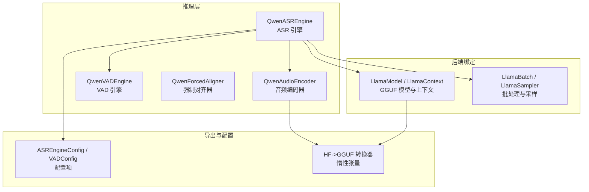
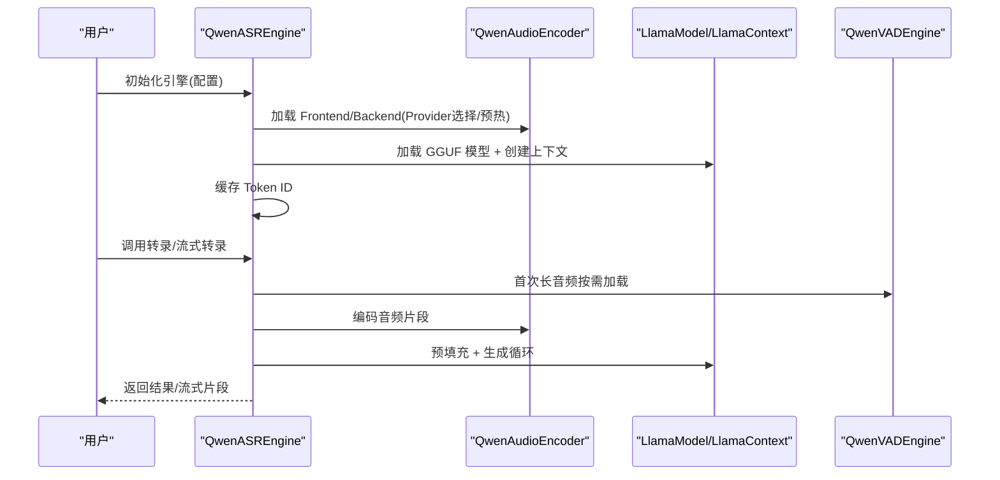
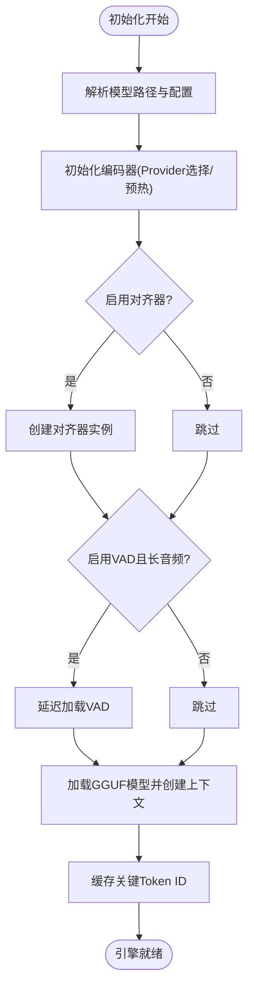
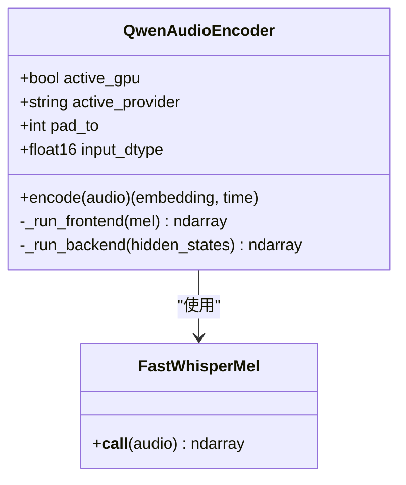
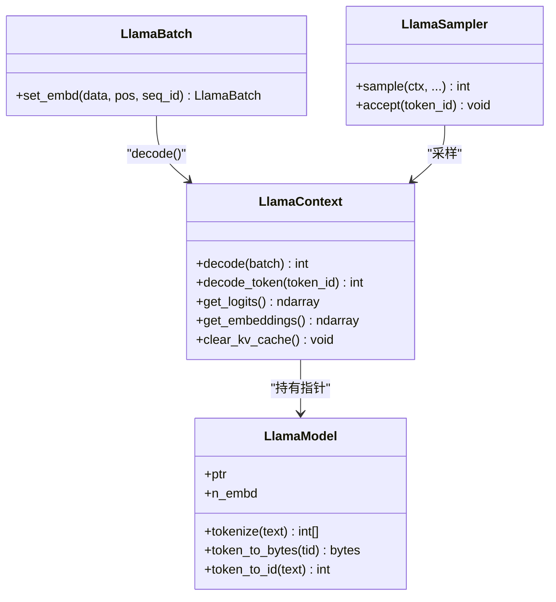
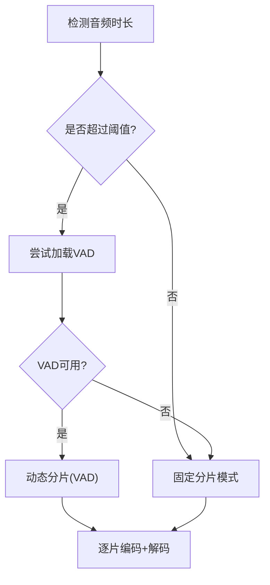
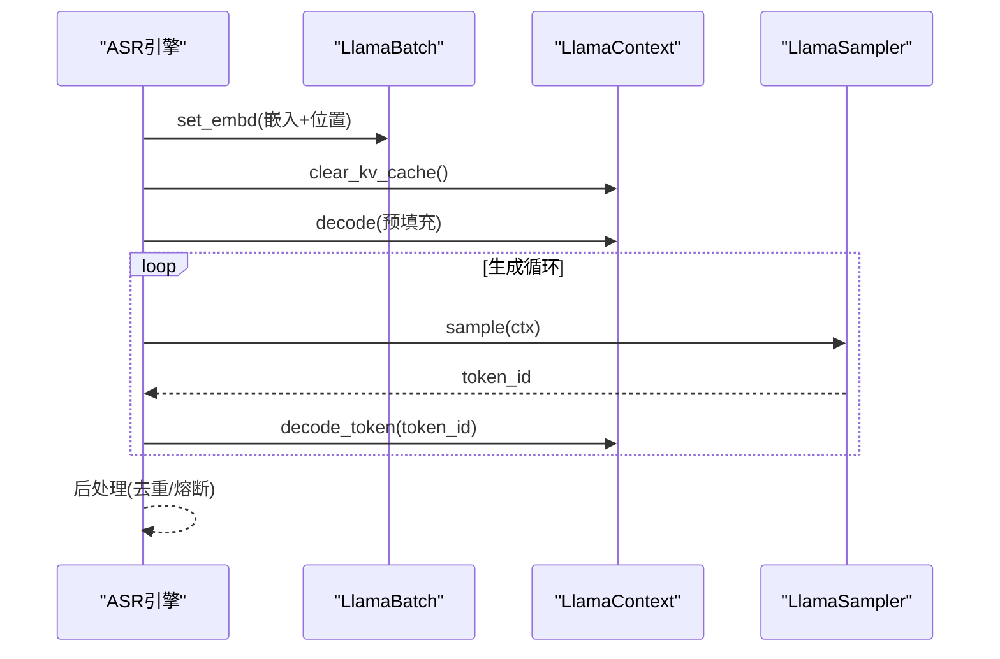
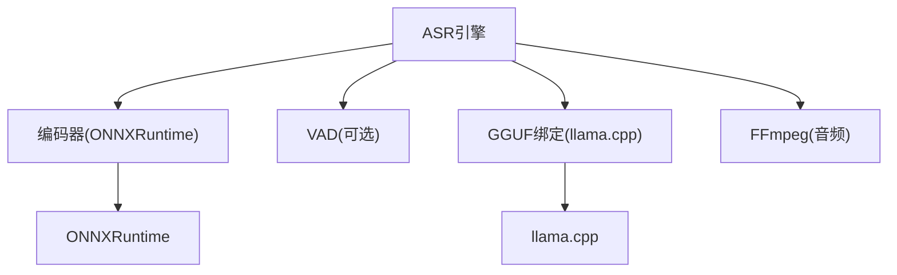

# 模型加载机制

<cite>
**本文档引用的文件**
- [qwen_asr_gguf/inference/asr.py](file://qwen_asr_gguf/inference/asr.py)
- [qwen_asr_gguf/inference/llama.py](file://qwen_asr_gguf/inference/llama.py)
- [qwen_asr_gguf/inference/encoder.py](file://qwen_asr_gguf/inference/encoder.py)
- [qwen_asr_gguf/inference/schema.py](file://qwen_asr_gguf/inference/schema.py)
- [qwen_asr_gguf/inference/audio.py](file://qwen_asr_gguf/inference/audio.py)
- [qwen_asr_gguf/export/convert_hf_to_gguf.py](file://qwen_asr_gguf/export/convert_hf_to_gguf.py)
- [qwen_asr_gguf/export/gguf/lazy.py](file://qwen_asr_gguf/export/gguf/lazy.py)
- [qwen_asr_gguf/__init__.py](file://qwen_asr_gguf/__init__.py)
</cite>

## 目录
1. [简介](#简介)
2. [项目结构](#项目结构)
3. [核心组件](#核心组件)
4. [架构概览](#架构概览)
5. [详细组件分析](#详细组件分析)
6. [依赖关系分析](#依赖关系分析)
7. [性能考虑](#性能考虑)
8. [故障排除指南](#故障排除指南)
9. [结论](#结论)

## 简介
本文件系统性阐述本项目的模型加载机制，涵盖模型初始化流程、缓存策略与内存管理、预加载/懒加载/动态加载的实现方式，以及性能优化与故障排除方法。重点围绕 ASR 引擎的初始化、GGUF 模型加载、ONNX 编码器加载、VAD 延迟加载、KV 缓存与采样器等关键环节展开，并给出热更新与版本切换的实践建议。

## 项目结构
项目采用“推理引擎 + 后端绑定 + 导出转换”的分层组织：
- 推理层：ASR 引擎、编码器、VAD、对齐器
- 后端绑定：llama.cpp 的 Python 绑定封装
- 导出层：HF 模型转换为 GGUF 的工具链与惰性张量机制

**图表来源**
- [qwen_asr_gguf/inference/asr.py:40-103](file://qwen_asr_gguf/inference/asr.py#L40-L103)
- [qwen_asr_gguf/inference/llama.py:443-549](file://qwen_asr_gguf/inference/llama.py#L443-L549)
- [qwen_asr_gguf/inference/encoder.py:119-197](file://qwen_asr_gguf/inference/encoder.py#L119-L197)
- [qwen_asr_gguf/inference/schema.py:162-210](file://qwen_asr_gguf/inference/schema.py#L162-L210)
- [qwen_asr_gguf/export/convert_hf_to_gguf.py:113-168](file://qwen_asr_gguf/export/convert_hf_to_gguf.py#L113-L168)
- [qwen_asr_gguf/export/gguf/lazy.py:76-185](file://qwen_asr_gguf/export/gguf/lazy.py#L76-L185)

**章节来源**
- [qwen_asr_gguf/inference/asr.py:40-103](file://qwen_asr_gguf/inference/asr.py#L40-L103)
- [qwen_asr_gguf/inference/llama.py:159-442](file://qwen_asr_gguf/inference/llama.py#L159-L442)
- [qwen_asr_gguf/inference/encoder.py:119-197](file://qwen_asr_gguf/inference/encoder.py#L119-L197)
- [qwen_asr_gguf/inference/schema.py:162-210](file://qwen_asr_gguf/inference/schema.py#L162-L210)
- [qwen_asr_gguf/export/convert_hf_to_gguf.py:113-168](file://qwen_asr_gguf/export/convert_hf_to_gguf.py#L113-L168)
- [qwen_asr_gguf/export/gguf/lazy.py:76-185](file://qwen_asr_gguf/export/gguf/lazy.py#L76-L185)

## 核心组件
- ASR 引擎：负责整体流水线编排，包括编码、对齐、VAD、解码与统计。
- 编码器：Split Frontend + Backend 的 ONNX 推理，支持 GPU/CPU Provider 自动选择与预热。
- GGUF 后端：llama.cpp 的 Python 绑定，封装模型、上下文、批处理与采样器。
- 配置体系：ASREngineConfig/VADConfig 等，统一管理路径、上下文窗口、分片策略等。
- 导出与惰性机制：HF->GGUF 转换器与惰性张量，支持大模型的延迟加载与内存友好处理。

**章节来源**
- [qwen_asr_gguf/inference/asr.py:40-103](file://qwen_asr_gguf/inference/asr.py#L40-L103)
- [qwen_asr_gguf/inference/encoder.py:119-197](file://qwen_asr_gguf/inference/encoder.py#L119-L197)
- [qwen_asr_gguf/inference/llama.py:443-549](file://qwen_asr_gguf/inference/llama.py#L443-L549)
- [qwen_asr_gguf/inference/schema.py:162-210](file://qwen_asr_gguf/inference/schema.py#L162-L210)
- [qwen_asr_gguf/export/convert_hf_to_gguf.py:113-168](file://qwen_asr_gguf/export/convert_hf_to_gguf.py#L113-L168)
- [qwen_asr_gguf/export/gguf/lazy.py:76-185](file://qwen_asr_gguf/export/gguf/lazy.py#L76-L185)

## 架构概览
ASR 引擎在初始化阶段完成以下关键动作：
- 解析模型路径与配置，准备编码器（可选固定/动态形状）、对齐器与 VAD。
- 加载 GGUF 模型并创建上下文，缓存关键 Token ID。
- VAD 采用延迟加载策略，仅在长音频且超过阈值时按需加载。
- 推理阶段通过编码器将音频转为嵌入，结合提示模板与 KV 缓存进行解码。

**图表来源**
- [qwen_asr_gguf/inference/asr.py:49-103](file://qwen_asr_gguf/inference/asr.py#L49-L103)
- [qwen_asr_gguf/inference/encoder.py:119-197](file://qwen_asr_gguf/inference/encoder.py#L119-L197)
- [qwen_asr_gguf/inference/llama.py:443-549](file://qwen_asr_gguf/inference/llama.py#L443-L549)
- [qwen_asr_gguf/inference/schema.py:162-210](file://qwen_asr_gguf/inference/schema.py#L162-L210)

## 详细组件分析

### 模型初始化与生命周期
- 初始化阶段
  - 路径解析：根据配置定位模型文件与前后端 ONNX 模型。
  - 编码器初始化：自动选择 GPU Provider（CUDA/ROCm/TensorRT/DML），否则回退 CPU；设置会话选项与图优化等级；进行预热。
  - 对齐器与 VAD：对齐器可选启用；VAD 采用延迟加载，仅在长音频且超过阈值时加载。
  - GGUF 模型加载：通过绑定加载模型并创建上下文，缓存关键 Token ID。
- 生命周期管理
  - 引擎提供关闭接口，释放 VAD 资源，避免资源泄漏。

**图表来源**
- [qwen_asr_gguf/inference/asr.py:49-103](file://qwen_asr_gguf/inference/asr.py#L49-L103)
- [qwen_asr_gguf/inference/encoder.py:119-197](file://qwen_asr_gguf/inference/encoder.py#L119-L197)
- [qwen_asr_gguf/inference/llama.py:443-549](file://qwen_asr_gguf/inference/llama.py#L443-L549)

**章节来源**
- [qwen_asr_gguf/inference/asr.py:49-103](file://qwen_asr_gguf/inference/asr.py#L49-L103)
- [qwen_asr_gguf/inference/encoder.py:119-197](file://qwen_asr_gguf/inference/encoder.py#L119-L197)
- [qwen_asr_gguf/inference/llama.py:443-549](file://qwen_asr_gguf/inference/llama.py#L443-L549)

### 编码器加载与预热策略
- Provider 选择优先级：CUDA > ROCm > TensorRT > DML > CPU；若存在非 CPU Provider 则双 Provider 组合。
- 图优化与会话配置：关闭自旋、启用图优化、设置日志级别。
- 预热策略：
  - DML 下固定形状模式：按 pad_to 预热，确保静态形状缓存。
  - 动态形状模式：预热短音频，避免不必要的固定填充。
- 前端/后端流水线：前端按 100 帧分块循环推理，后端根据是否 DML 与固定长度进行注意力掩码与填充。

**图表来源**
- [qwen_asr_gguf/inference/encoder.py:119-280](file://qwen_asr_gguf/inference/encoder.py#L119-L280)

**章节来源**
- [qwen_asr_gguf/inference/encoder.py:119-280](file://qwen_asr_gguf/inference/encoder.py#L119-L280)

### GGUF 模型加载与上下文管理
- 模型加载：绑定加载 GGUF 模型，处理路径与工作目录变更，确保 DLL/库路径正确。
- 上下文创建：设置 n_ctx/n_batch/n_ubatch/线程数等参数，启用 Flash Attention 与 K/V Offload。
- 批处理与采样器：提供嵌入批处理封装与采样链，支持温度、Top-K/Top-P、惩罚等策略。
- KV 缓存：上下文提供清理接口，避免跨请求的 KV 混叠。

**图表来源**
- [qwen_asr_gguf/inference/llama.py:443-738](file://qwen_asr_gguf/inference/llama.py#L443-L738)

**章节来源**
- [qwen_asr_gguf/inference/llama.py:159-442](file://qwen_asr_gguf/inference/llama.py#L159-L442)
- [qwen_asr_gguf/inference/llama.py:443-738](file://qwen_asr_gguf/inference/llama.py#L443-L738)

### VAD 延迟加载与动态分片
- 延迟加载：首次遇到长音频且超过阈值时按需加载 VAD 模型，失败则降级为固定分片。
- 动态分片：基于 VAD 检测的语音区间构建分片，避免静音段与句内截断，提升 RTF 与准确性。
- 固定分片：短音频或 VAD 不可用时，按固定时长切分，必要时在边界追加 1 秒音频以改善词边界。

**图表来源**
- [qwen_asr_gguf/inference/asr.py:666-721](file://qwen_asr_gguf/inference/asr.py#L666-L721)
- [qwen_asr_gguf/inference/asr.py:108-136](file://qwen_asr_gguf/inference/asr.py#L108-L136)

**章节来源**
- [qwen_asr_gguf/inference/asr.py:666-721](file://qwen_asr_gguf/inference/asr.py#L666-L721)
- [qwen_asr_gguf/inference/asr.py:108-136](file://qwen_asr_gguf/inference/asr.py#L108-L136)

### 解码内核与抗幻觉机制
- 预填充与生成：先进行预填充解码，再进入生成循环；采样器支持温度、Top-K/Top-P、惩罚等。
- 抗幻觉：token 级与短语级重复熔断、max_new_tokens 上限、滚动窗口与去重后处理。
- 性能统计：记录预填充/生成耗时、token 数与 RTF，便于监控与优化。

**图表来源**
- [qwen_asr_gguf/inference/asr.py:212-345](file://qwen_asr_gguf/inference/asr.py#L212-L345)
- [qwen_asr_gguf/inference/llama.py:520-738](file://qwen_asr_gguf/inference/llama.py#L520-L738)

**章节来源**
- [qwen_asr_gguf/inference/asr.py:212-345](file://qwen_asr_gguf/inference/asr.py#L212-L345)
- [qwen_asr_gguf/inference/llama.py:520-738](file://qwen_asr_gguf/inference/llama.py#L520-L738)

### 导出与惰性加载机制
- HF->GGUF 转换：自动推断权重类型、量化方案，支持远程 safetensors 与惰性张量。
- 惰性张量：在索引阶段仅保存张量生成器，按需解码为张量，显著降低内存峰值与启动时间。

**图表来源**
- [qwen_asr_gguf/export/convert_hf_to_gguf.py:186-269](file://qwen_asr_gguf/export/convert_hf_to_gguf.py#L186-L269)
- [qwen_asr_gguf/export/gguf/lazy.py:76-185](file://qwen_asr_gguf/export/gguf/lazy.py#L76-L185)

**章节来源**
- [qwen_asr_gguf/export/convert_hf_to_gguf.py:186-269](file://qwen_asr_gguf/export/convert_hf_to_gguf.py#L186-L269)
- [qwen_asr_gguf/export/gguf/lazy.py:76-185](file://qwen_asr_gguf/export/gguf/lazy.py#L76-L185)

## 依赖关系分析
- 组件耦合
  - ASR 引擎依赖编码器、VAD、GGUF 上下文与采样器；耦合集中在初始化与推理主循环。
  - 编码器与 Provider 紧密相关，需注意不同 Provider 的预热与形状约束。
  - GGUF 绑定提供统一的模型/上下文/批处理/采样接口，便于替换后端。
- 外部依赖
  - ONNXRuntime：提供 GPU/CPU Provider 选择与图优化。
  - llama.cpp：提供模型加载、上下文管理、KV 缓存与采样器。
  - FFmpeg：音频读取与重采样（fallback）。

**图表来源**
- [qwen_asr_gguf/inference/asr.py:49-103](file://qwen_asr_gguf/inference/asr.py#L49-L103)
- [qwen_asr_gguf/inference/encoder.py:119-197](file://qwen_asr_gguf/inference/encoder.py#L119-L197)
- [qwen_asr_gguf/inference/llama.py:159-442](file://qwen_asr_gguf/inference/llama.py#L159-L442)
- [qwen_asr_gguf/inference/audio.py:88-149](file://qwen_asr_gguf/inference/audio.py#L88-L149)

**章节来源**
- [qwen_asr_gguf/inference/asr.py:49-103](file://qwen_asr_gguf/inference/asr.py#L49-L103)
- [qwen_asr_gguf/inference/encoder.py:119-197](file://qwen_asr_gguf/inference/encoder.py#L119-L197)
- [qwen_asr_gguf/inference/llama.py:159-442](file://qwen_asr_gguf/inference/llama.py#L159-L442)
- [qwen_asr_gguf/inference/audio.py:88-149](file://qwen_asr_gguf/inference/audio.py#L88-L149)

## 性能考虑
- Provider 选择与预热
  - 优先使用 GPU Provider（CUDA/ROCm/TensorRT/DML），并在 DML 下进行固定形状预热。
  - 动态形状模式下仅预热短音频，减少固定填充带来的冗余计算。
- 线程与批处理
  - 合理设置 n_threads/n_threads_batch 与 n_batch/n_ubatch，避免过度并发导致抖动。
  - 批处理大小与上下文窗口需平衡吞吐与延迟。
- KV 缓存与 Offload
  - 启用 K/V Offload 与 Flash Attention，减少显存占用；及时清理 KV 缓存避免跨请求污染。
- VAD 与分片策略
  - 长音频启用 VAD 动态分片，跳过静音段，显著降低 RTF。
  - 固定分片模式在边界追加 1 秒音频，改善词边界解码质量。
- 量化与惰性加载
  - 使用合适的量化类型与惰性张量，降低内存峰值与启动时间。

[本节为通用指导，无需特定文件引用]

## 故障排除指南
- 模型加载失败
  - 检查模型路径是否存在、权限是否正确；确认 DLL/库路径与工作目录设置。
  - 查看日志输出，定位加载失败的具体原因。
- Provider 不可用或回退
  - 确认系统已安装对应 GPU Provider；若不可用，编码器会自动回退 CPU。
  - DML 下需固定形状预热，否则可能出现形状不匹配。
- VAD 加载失败
  - VAD 延迟加载失败会降级为固定分片；检查依赖与模型目录。
- 解码异常或幻觉
  - 调整温度、Top-K/Top-P、惩罚参数；启用抗重复熔断与后处理去重。
  - 检查上下文窗口与 max_new_tokens 设置，避免越界或过长生成。
- 性能异常
  - 监控预填充/生成耗时与 RTF；调整批处理大小、线程数与 Provider。

**章节来源**
- [qwen_asr_gguf/inference/llama.py:378-418](file://qwen_asr_gguf/inference/llama.py#L378-L418)
- [qwen_asr_gguf/inference/encoder.py:137-197](file://qwen_asr_gguf/inference/encoder.py#L137-L197)
- [qwen_asr_gguf/inference/asr.py:108-136](file://qwen_asr_gguf/inference/asr.py#L108-L136)
- [qwen_asr_gguf/inference/asr.py:212-345](file://qwen_asr_gguf/inference/asr.py#L212-L345)

## 结论
本项目的模型加载机制通过“初始化阶段集中加载 + 推理阶段按需延迟”的策略，实现了高效稳定的 ASR 推理。编码器与 GGUF 后端分别采用 Provider 自动选择与量化/惰性加载，配合 VAD 动态分片与 KV 缓存，兼顾了性能与资源占用。通过合理的配置与监控，可在多种硬件环境下获得稳定的表现。