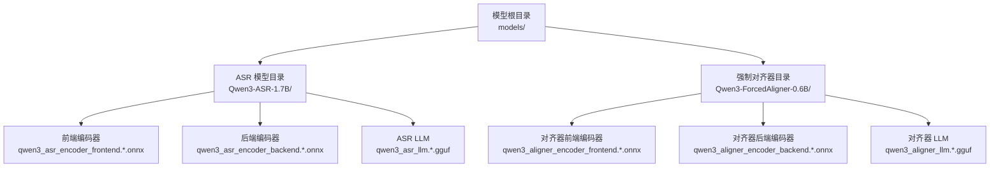
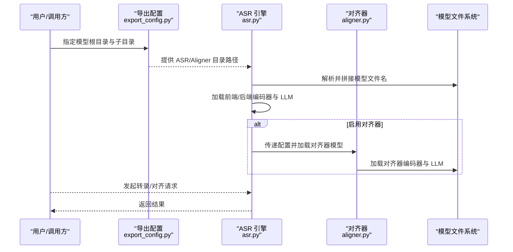
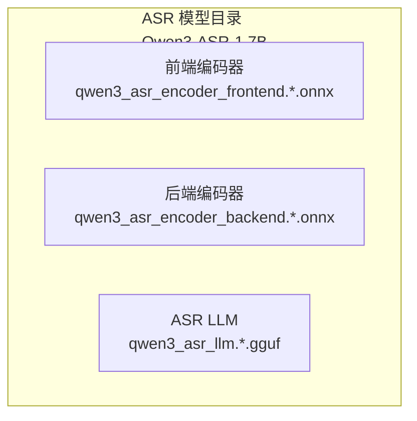
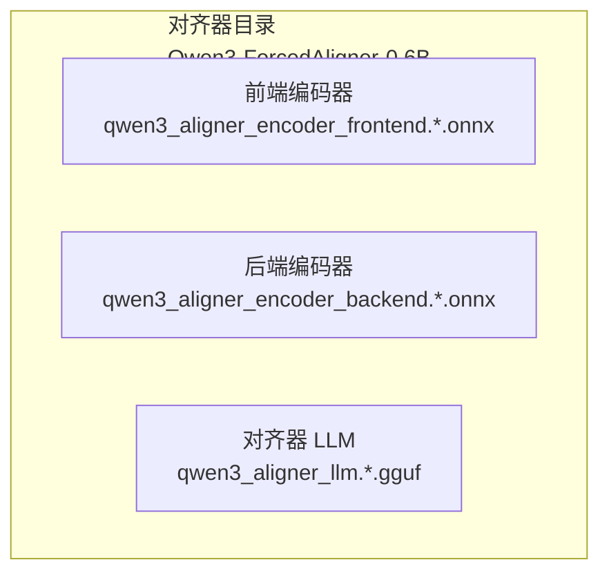
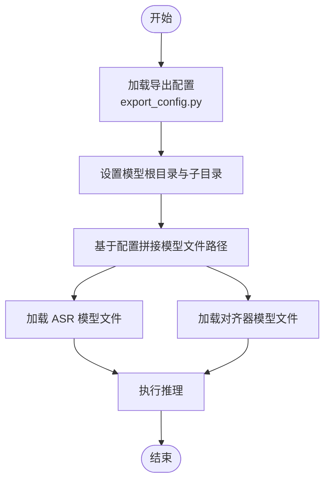
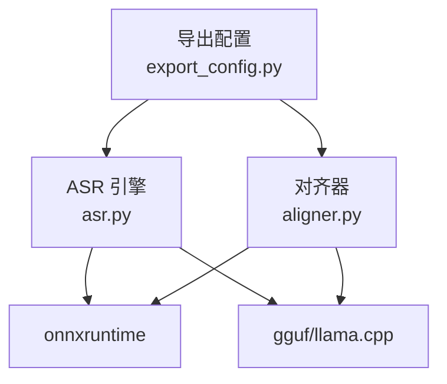

# 模型目录结构

<cite>
**本文档引用的文件**
- [export_config.py](file://export_config.py)
- [qwen_asr_gguf/inference/schema.py](file://qwen_asr_gguf/inference/schema.py)
- [qwen_asr_gguf/inference/asr.py](file://qwen_asr_gguf/inference/asr.py)
- [qwen_asr_gguf/inference/aligner.py](file://qwen_asr_gguf/inference/aligner.py)
- [qwen_asr/cli/demo.py](file://qwen_asr/cli/demo.py)
- [qwen_asr/cli/serve.py](file://qwen_asr/cli/serve.py)
- [examples/example_qwen3_asr_transformers.py](file://examples/example_qwen3_asr_transformers.py)
- [pyproject.toml](file://pyproject.toml)
</cite>

## 目录
1. [简介](#简介)
2. [项目结构概览](#项目结构概览)
3. [核心组件](#核心组件)
4. [架构总览](#架构总览)
5. [详细组件分析](#详细组件分析)
6. [依赖关系分析](#依赖关系分析)
7. [性能考虑](#性能考虑)
8. [故障排除指南](#故障排除指南)
9. [结论](#结论)
10. [附录](#附录)

## 简介
本文件系统性阐述 Qwen3 ASR 项目的模型目录结构与配置策略，重点覆盖以下方面：
- 模型根目录的组织方式与命名规范
- ASR 模型目录（Qwen3-ASR-1.7B）与强制对齐器目录（Qwen3-ForcedAligner-0.6B）的文件布局
- 版本管理策略与存储位置配置
- 最佳实践与路径配置示例（相对路径与绝对路径的选择建议）

## 项目结构概览
项目采用“模块化 + 多后端”的设计，核心模型文件位于仓库根目录下的 `models/` 目录中，按功能拆分为 ASR 与 Aligner 两套子目录。配置层通过集中化的导出配置文件与推理配置类实现路径与文件名的统一管理。

**图表来源**
- [export_config.py:1-12](file://export_config.py#L1-L12)
- [qwen_asr_gguf/inference/schema.py:162-209](file://qwen_asr_gguf/inference/schema.py#L162-L209)

**章节来源**
- [export_config.py:1-12](file://export_config.py#L1-L12)
- [qwen_asr_gguf/inference/schema.py:162-209](file://qwen_asr_gguf/inference/schema.py#L162-L209)

## 核心组件
- 导出配置（export_config.py）：定义模型根目录与各子模型目录的路径，以及导出目标路径。
- 推理配置（schema.py）：定义 ASR 与 Aligner 的配置类，包含模型目录、文件名模板与默认参数。
- ASR 引擎（asr.py）：负责加载 ASR 模型文件，执行编码、解码与对齐流程。
- 强制对齐器（aligner.py）：负责对齐器模型的加载与对齐推理。
- 示例与入口（demo.py、serve.py、example_qwen3_asr_transformers.py）：展示如何指定模型路径与后端配置。

**章节来源**
- [export_config.py:1-12](file://export_config.py#L1-L12)
- [qwen_asr_gguf/inference/schema.py:72-85](file://qwen_asr_gguf/inference/schema.py#L72-L85)
- [qwen_asr_gguf/inference/asr.py:49-96](file://qwen_asr_gguf/inference/asr.py#L49-L96)
- [qwen_asr_gguf/inference/aligner.py:229-259](file://qwen_asr_gguf/inference/aligner.py#L229-L259)
- [qwen_asr/cli/demo.py:140-145](file://qwen_asr/cli/demo.py#L140-L145)
- [qwen_asr/cli/serve.py:18-27](file://qwen_asr/cli/serve.py#L18-L27)
- [examples/example_qwen3_asr_transformers.py:38-39](file://examples/example_qwen3_asr_transformers.py#L38-L39)

## 架构总览
模型目录与加载流程的关键交互如下：

**图表来源**
- [export_config.py:1-12](file://export_config.py#L1-L12)
- [qwen_asr_gguf/inference/asr.py:59-96](file://qwen_asr_gguf/inference/asr.py#L59-L96)
- [qwen_asr_gguf/inference/aligner.py:232-259](file://qwen_asr_gguf/inference/aligner.py#L232-L259)

## 详细组件分析

### ASR 模型目录结构（Qwen3-ASR-1.7B）
- 目录定位：由导出配置文件集中定义，指向模型根目录下的具体子目录。
- 文件组成：
  - 前端编码器：qwen3_asr_encoder_frontend.*.onnx（支持 fp16/fp32/int4/int8 等变体）
  - 后端编码器：qwen3_asr_encoder_backend.*.onnx（支持 fp16/fp32/int4/int8 等变体）
  - ASR LLM：qwen3_asr_llm.*.gguf（支持 f16/q4_k 等量化版本）
- 加载策略：引擎通过配置类中的文件名模板与模型目录拼接，动态定位并加载对应文件。

**图表来源**
- [qwen_asr_gguf/inference/schema.py:162-171](file://qwen_asr_gguf/inference/schema.py#L162-L171)
- [qwen_asr_gguf/inference/asr.py:60-62](file://qwen_asr_gguf/inference/asr.py#L60-L62)

**章节来源**
- [export_config.py:7-8](file://export_config.py#L7-L8)
- [qwen_asr_gguf/inference/schema.py:162-171](file://qwen_asr_gguf/inference/schema.py#L162-L171)
- [qwen_asr_gguf/inference/asr.py:60-62](file://qwen_asr_gguf/inference/asr.py#L60-L62)

### 强制对齐器目录结构（Qwen3-ForcedAligner-0.6B）
- 目录定位：同样由导出配置文件定义，指向模型根目录下的对齐器子目录。
- 文件组成：
  - 对齐器前端编码器：qwen3_aligner_encoder_frontend.*.onnx（支持 fp16/fp32/int4/int8 等变体）
  - 对齐器后端编码器：qwen3_aligner_encoder_backend.*.onnx（支持 fp16/fp32/int4/int8 等变体）
  - 对齐器 LLM：qwen3_aligner_llm.*.gguf（支持 f16/q4_k 等量化版本）
- 加载策略：对齐器配置类与引擎通过文件名模板与模型目录拼接，加载对应文件。

**图表来源**
- [qwen_asr_gguf/inference/schema.py:72-81](file://qwen_asr_gguf/inference/schema.py#L72-L81)
- [qwen_asr_gguf/inference/aligner.py:232-236](file://qwen_asr_gguf/inference/aligner.py#L232-L236)

**章节来源**
- [export_config.py:7-8](file://export_config.py#L7-L8)
- [qwen_asr_gguf/inference/schema.py:72-81](file://qwen_asr_gguf/inference/schema.py#L72-L81)
- [qwen_asr_gguf/inference/aligner.py:232-236](file://qwen_asr_gguf/inference/aligner.py#L232-L236)

### 文件命名规范与版本管理策略
- 命名规范：
  - ASR 模型：qwen3_asr_encoder_frontend/backend.*.onnx、qwen3_asr_llm.*.gguf
  - 对齐器模型：qwen3_aligner_encoder_frontend/backend.*.onnx、qwen3_aligner_llm.*.gguf
  - 量化与精度：*.fp16.onnx、*.fp32.onnx、*.int4.onnx、*.int8.onnx、*.f16.gguf、*.q4_k.gguf
- 版本管理策略：
  - 通过文件后缀区分量化与精度（如 fp16/fp32/int4/int8、f16/q4_k），便于在不同硬件与性能需求下灵活切换。
  - 通过配置类中的文件名模板与模型目录拼接，实现“同一目录下多版本文件并存、按需加载”。

**章节来源**
- [qwen_asr_gguf/inference/schema.py:162-171](file://qwen_asr_gguf/inference/schema.py#L162-L171)
- [qwen_asr_gguf/inference/schema.py:72-81](file://qwen_asr_gguf/inference/schema.py#L72-L81)

### 存储位置配置与路径解析
- 导出配置（export_config.py）：
  - 模型根目录：~/.cache/modelscope/hub/models/Qwen 或 ./models/qwen（示例）
  - ASR 模型目录：Qwen3-ASR-1.7B
  - 对齐器目录：Qwen3-ForcedAligner-0.6B
  - 导出目标路径：./models
- 推理配置（schema.py）：
  - ASREngineConfig 与 AlignerConfig 提供默认文件名模板与模型目录字段，引擎与对齐器通过 os.path.join 拼接路径。
- 示例与入口：
  - CLI 示例展示了如何通过命令行参数指定模型检查点路径（HF 仓库 ID 或本地路径）。
  - 服务入口注册了模型类型与处理器，便于 vLLM 后端加载。

**图表来源**
- [export_config.py:1-12](file://export_config.py#L1-L12)
- [qwen_asr_gguf/inference/asr.py:59-62](file://qwen_asr_gguf/inference/asr.py#L59-L62)
- [qwen_asr_gguf/inference/aligner.py:232-236](file://qwen_asr_gguf/inference/aligner.py#L232-L236)

**章节来源**
- [export_config.py:1-12](file://export_config.py#L1-L12)
- [qwen_asr_gguf/inference/schema.py:162-209](file://qwen_asr_gguf/inference/schema.py#L162-L209)
- [qwen_asr_gguf/inference/asr.py:59-62](file://qwen_asr_gguf/inference/asr.py#L59-L62)
- [qwen_asr_gguf/inference/aligner.py:232-236](file://qwen_asr_gguf/inference/aligner.py#L232-L236)
- [qwen_asr/cli/demo.py:140-145](file://qwen_asr/cli/demo.py#L140-L145)
- [qwen_asr/cli/serve.py:18-27](file://qwen_asr/cli/serve.py#L18-L27)

### 最佳实践与路径配置示例
- 路径选择建议：
  - 绝对路径：适用于多环境共享模型或容器部署，确保路径稳定不变。
  - 相对路径：适用于本地开发与测试，便于项目迁移与团队协作。
- 配置示例（概念性说明）：
  - 将模型根目录设置为项目根目录下的 models/，并在该目录下分别放置 Qwen3-ASR-1.7B 与 Qwen3-ForcedAligner-0.6B 子目录。
  - 在 ASREngineConfig/AlignerConfig 中设置 model_dir 为上述子目录路径，文件名模板保持默认即可。
- 版本选择建议：
  - 推荐优先使用 f16 量化版本以平衡精度与性能；在资源受限环境下可选用 q4_k 等更低量化版本。
  - 编码器文件（frontend/backend）建议与 LLM 文件保持一致的量化级别，避免精度不匹配导致的性能波动。

**章节来源**
- [export_config.py:1-12](file://export_config.py#L1-L12)
- [qwen_asr_gguf/inference/schema.py:162-209](file://qwen_asr_gguf/inference/schema.py#L162-L209)

## 依赖关系分析
- 组件耦合：
  - ASR 引擎与对齐器均依赖统一的配置类（ASREngineConfig/AlignerConfig）与文件名模板，耦合度低、扩展性强。
  - 导出配置文件集中管理路径，避免硬编码散落各处。
- 外部依赖：
  - 依赖 onnxruntime 进行编码器推理，依赖 gguf 与 llama.cpp 进行 LLM 推理。
  - 依赖 librosa/soundfile 等音频处理库进行音频加载与预处理。

**图表来源**
- [export_config.py:1-12](file://export_config.py#L1-L12)
- [qwen_asr_gguf/inference/asr.py:91-95](file://qwen_asr_gguf/inference/asr.py#L91-L95)
- [qwen_asr_gguf/inference/aligner.py:250-252](file://qwen_asr_gguf/inference/aligner.py#L250-L252)

**章节来源**
- [pyproject.toml:7-22](file://pyproject.toml#L7-L22)
- [qwen_asr_gguf/inference/asr.py:91-95](file://qwen_asr_gguf/inference/asr.py#L91-L95)
- [qwen_asr_gguf/inference/aligner.py:250-252](file://qwen_asr_gguf/inference/aligner.py#L250-L252)

## 性能考虑
- 动态分片与 VAD：长音频通过 VAD 自适应分片，显著降低无效推理开销，提升整体吞吐。
- 量化选择：在保证可接受精度的前提下，优先选择 f16 量化以获得更佳的推理速度。
- 编码器与 LLM 的一致性：前端/后端编码器与 LLM 的量化级别保持一致，有助于减少跨组件的数据转换成本。

[本节为通用指导，无需特定文件引用]

## 故障排除指南
- 模型文件缺失：
  - 症状：加载失败或报错提示找不到指定文件。
  - 排查：确认导出配置中的模型根目录与子目录路径正确，且对应文件存在。
- 路径权限问题：
  - 症状：读取模型文件时报权限错误。
  - 排查：检查模型文件所在目录的读权限，必要时调整文件系统权限。
- 量化不匹配：
  - 症状：推理异常或性能下降。
  - 排查：确保编码器与 LLM 的量化级别一致，避免混合量化带来的兼容性问题。

**章节来源**
- [export_config.py:1-12](file://export_config.py#L1-L12)
- [qwen_asr_gguf/inference/schema.py:162-209](file://qwen_asr_gguf/inference/schema.py#L162-L209)

## 结论
本项目通过集中化的导出配置与清晰的模型目录结构，实现了 ASR 与对齐器模型的模块化管理与灵活加载。遵循本文档的命名规范、版本管理策略与路径配置建议，可在不同硬件与部署环境中高效地运行与维护模型。

[本节为总结性内容，无需特定文件引用]

## 附录
- 相关示例与入口：
  - CLI 示例展示了如何通过命令行参数指定模型检查点路径与后端配置。
  - 服务入口注册了模型类型与处理器，便于在 vLLM 后端中加载模型。

**章节来源**
- [qwen_asr/cli/demo.py:140-145](file://qwen_asr/cli/demo.py#L140-L145)
- [qwen_asr/cli/serve.py:18-27](file://qwen_asr/cli/serve.py#L18-L27)
- [examples/example_qwen3_asr_transformers.py:38-39](file://examples/example_qwen3_asr_transformers.py#L38-L39)