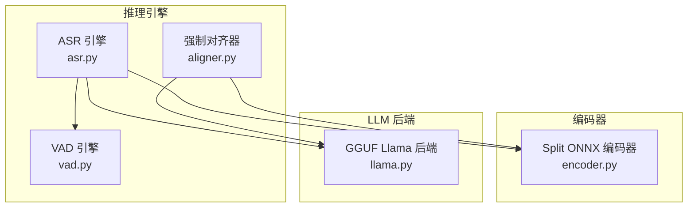
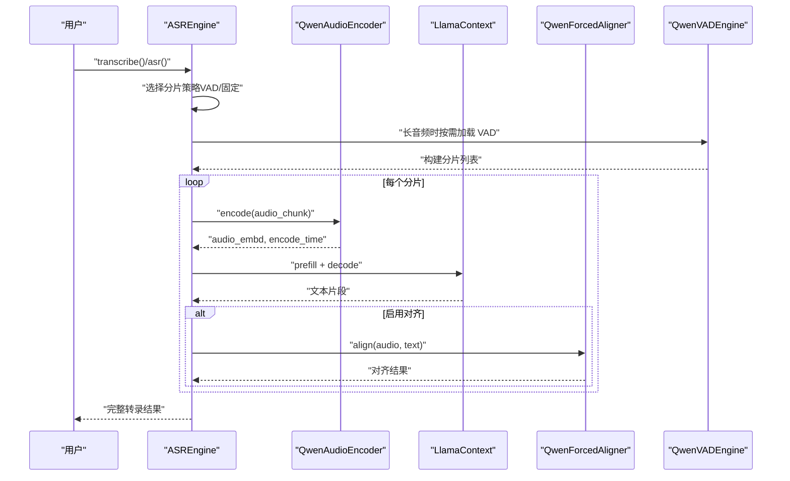
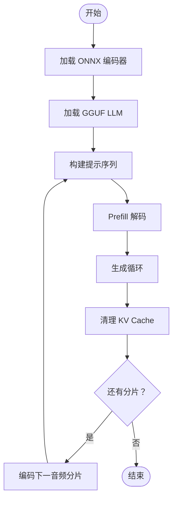
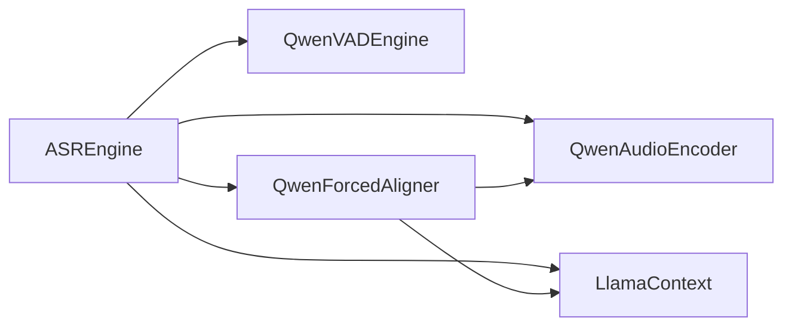

# 模型配置

<cite>
**本文引用的文件**
- [export_config.py](file://export_config.py)
- [schema.py](file://qwen_asr_gguf/inference/schema.py)
- [asr.py](file://qwen_asr_gguf/inference/asr.py)
- [aligner.py](file://qwen_asr_gguf/inference/aligner.py)
- [vad.py](file://qwen_asr_gguf/inference/vad.py)
- [encoder.py](file://qwen_asr_gguf/inference/encoder.py)
- [llama.py](file://qwen_asr_gguf/inference/llama.py)
- [quants.py](file://qwen_asr_gguf/qwen_asr_gguf/export/gguf/quants.py)
- [convert_hf_to_gguf.py](file://qwen_asr_gguf/export/convert_hf_to_gguf.py)
- [configuration_qwen3_asr.py](file://qwen_asr_gguf/export/qwen3_asr_custom/configuration_qwen3_asr.py)
- [modeling_qwen3_asr.py](file://qwen_asr_gguf/export/qwen3_asr_custom/modeling_qwen3_asr.py)
</cite>

## 目录
1. [简介](#简介)
2. [项目结构](#项目结构)
3. [核心组件](#核心组件)
4. [架构总览](#架构总览)
5. [详细组件分析](#详细组件分析)
6. [依赖关系分析](#依赖关系分析)
7. [性能考量](#性能考量)
8. [故障排查指南](#故障排查指南)
9. [结论](#结论)
10. [附录](#附录)

## 简介
本文件系统性梳理 Qwen3 ASR GGUF 项目的模型配置与运行机制，涵盖以下主题：
- 模型目录结构、文件命名规范与存储位置配置
- ASR 模型、VAD 模型、强制对齐模型的配置参数与加载流程
- 设备选择（GPU/CPU）与量化级别（int4、q4_k 等）的映射与影响
- 模型加载机制、缓存策略与内存管理
- 不同配置的性能对比与选择建议
- 版本兼容性与迁移指南

## 项目结构
该项目采用“推理后端 + 前端/后端分离”的混合架构：
- ASR 推理后端：GGUF（llama.cpp）用于 LLM 解码
- ASR 前端/后端：ONNXRuntime（Split 模式）用于音频特征提取与编码
- VAD：FireRedVAD（非流式）用于静音过滤与动态分片
- 强制对齐：ONNXRuntime + GGUF（llama.cpp）联合实现

图表来源
- [asr.py:40-102](file://qwen_asr_gguf/inference/asr.py#L40-L102)
- [aligner.py:229-258](file://qwen_asr_gguf/inference/aligner.py#L229-L258)
- [vad.py:29-81](file://qwen_asr_gguf/inference/vad.py#L29-L81)
- [encoder.py:119-196](file://qwen_asr_gguf/inference/encoder.py#L119-L196)
- [llama.py:443-548](file://qwen_asr_gguf/inference/llama.py#L443-L548)

章节来源
- [asr.py:40-102](file://qwen_asr_gguf/inference/asr.py#L40-L102)
- [aligner.py:229-258](file://qwen_asr_gguf/inference/aligner.py#L229-L258)
- [vad.py:29-81](file://qwen_asr_gguf/inference/vad.py#L29-L81)
- [encoder.py:119-196](file://qwen_asr_gguf/inference/encoder.py#L119-L196)
- [llama.py:443-548](file://qwen_asr_gguf/inference/llama.py#L443-L548)

## 核心组件
- ASREngineConfig：ASR 引擎配置，包含模型目录、前后端模型文件名、上下文窗口、分片大小、记忆窗口、VAD 配置、是否启用对齐等
- VADConfig：VAD 引擎配置，包含模型目录、GPU 开关、平滑窗口、阈值、最小/最大语音段、最小静音段、合并静音段、扩展语音边界、分片最大帧数、启用 VAD 的最小时长等
- AlignerConfig：强制对齐器配置，包含模型目录、前后端 ONNX 文件名、GGUF 解码器文件名、GPU 开关、上下文窗口、填充时长等
- QwenASREngine：ASR 主引擎，负责编码、解码、对齐、VAD 动态分片与统计
- QwenForcedAligner：强制对齐器，负责对齐文本与时间戳
- QwenVADEngine：VAD 引擎，负责语音活动检测与分片构建
- QwenAudioEncoder：Split ONNX 编码器，负责前端/后端两阶段推理
- LlamaModel/LlamaContext/LlamaBatch：GGUF 后端封装，负责模型加载、上下文与批处理

章节来源
- [schema.py:72-235](file://qwen_asr_gguf/inference/schema.py#L72-L235)
- [asr.py:40-102](file://qwen_asr_gguf/inference/asr.py#L40-L102)
- [aligner.py:229-350](file://qwen_asr_gguf/inference/aligner.py#L229-L350)
- [vad.py:29-155](file://qwen_asr_gguf/inference/vad.py#L29-L155)
- [encoder.py:119-280](file://qwen_asr_gguf/inference/encoder.py#L119-L280)
- [llama.py:443-800](file://qwen_asr_gguf/inference/llama.py#L443-L800)

## 架构总览
ASR 推理主流程：
- 音频加载与裁剪
- VAD 动态分片（长音频）或固定分片（短音频）
- 分片送入 QwenAudioEncoder（Split 模式）提取音频嵌入
- 构造提示序列（包含音频嵌入与文本模板），送入 LlamaContext 解码
- 可选：对齐器对文本与音频进行强制对齐
- 统计与输出

图表来源
- [asr.py:432-596](file://qwen_asr_gguf/inference/asr.py#L432-L596)
- [vad.py:160-222](file://qwen_asr_gguf/inference/vad.py#L160-L222)
- [encoder.py:260-280](file://qwen_asr_gguf/inference/encoder.py#L260-L280)
- [aligner.py:260-348](file://qwen_asr_gguf/inference/aligner.py#L260-L348)

章节来源
- [asr.py:432-596](file://qwen_asr_gguf/inference/asr.py#L432-L596)
- [vad.py:160-222](file://qwen_asr_gguf/inference/vad.py#L160-L222)
- [encoder.py:260-280](file://qwen_asr_gguf/inference/encoder.py#L260-L280)
- [aligner.py:260-348](file://qwen_asr_gguf/inference/aligner.py#L260-L348)

## 详细组件分析

### 模型目录结构与文件命名规范
- 模型根目录：通过配置文件定义，默认指向本地缓存目录下的 Qwen 模型集合
- ASR 模型目录：包含 ASR 前端/后端 ONNX 与 LLM GGUF
- 对齐器模型目录：包含对齐器前端/后端 ONNX 与 LLM GGUF
- VAD 模型目录：FireRedVAD 预训练模型目录

文件命名规范（示例）：
- ASR 前端/后端：qwen3_asr_encoder_frontend.{fp16/onnx}、qwen3_asr_encoder_backend.{fp16/onnx}
- ASR LLM：qwen3_asr_llm.{f16/q4_k}.gguf
- 对齐器前端/后端：qwen3_aligner_encoder_frontend.{fp16/onnx}、qwen3_aligner_encoder_backend.{fp16/onnx}
- 对齐器 LLM：qwen3_aligner_llm.{f16/q4_k}.gguf

存储位置配置：
- export_config.py 定义模型根目录与导出目标目录
- ASREngineConfig/AlignerConfig/VADConfig 中的 model_dir 指向具体模型子目录

章节来源
- [export_config.py:1-12](file://export_config.py#L1-L12)
- [schema.py:72-113](file://qwen_asr_gguf/inference/schema.py#L72-L113)
- [schema.py:162-180](file://qwen_asr_gguf/inference/schema.py#L162-L180)
- [schema.py:72-85](file://qwen_asr_gguf/inference/schema.py#L72-L85)

### ASR 模型配置参数
- 模型目录：model_dir
- 前端/后端模型文件名：encoder_frontend_fn、encoder_backend_fn
- LLM 文件名：llm_fn（默认 f16，亦可 q4_k）
- 设备选择：use_gpu（控制 ONNXRuntime Provider 与 GGUF n_gpu_layers）
- 上下文窗口：n_ctx（影响 KV Cache 与解码速度）
- 分片大小：chunk_size（秒）
- 记忆窗口：memory_num（保留前 N 个分片的文本上下文）
- VAD 配置：vad_config、dynamic_chunk_threshold
- 对齐器配置：enable_aligner、align_config

加载流程要点：
- 路径拼接：os.path.join(config.model_dir, config.llm_fn)
- ONNXRuntime Provider 优先级：CUDA/ROCM/TensorRT/DML → CPU
- GGUF 加载：llama.LlamaModel + LlamaContext

章节来源
- [schema.py:162-210](file://qwen_asr_gguf/inference/schema.py#L162-L210)
- [asr.py:49-102](file://qwen_asr_gguf/inference/asr.py#L49-L102)
- [encoder.py:130-165](file://qwen_asr_gguf/inference/encoder.py#L130-L165)
- [llama.py:443-548](file://qwen_asr_gguf/inference/llama.py#L443-L548)

### VAD 模型配置参数
- 模型目录：model_dir（默认 models/FireRedVAD/VAD）
- 设备选择：use_gpu
- 检测参数：smooth_window_size、speech_threshold、min_speech_frame、max_speech_frame、min_silence_frame、merge_silence_frame、extend_speech_frame、chunk_max_frame
- 启用阈值：vad_min_duration（秒）

工作方式：
- 首次检测：获取帧级语音概率
- 自适应阈值：基于概率分布计算新的阈值
- 分片构建：将语音段合并、贪心打包、插入静音分片

章节来源
- [schema.py:87-113](file://qwen_asr_gguf/inference/schema.py#L87-L113)
- [vad.py:41-81](file://qwen_asr_gguf/inference/vad.py#L41-L81)
- [vad.py:160-293](file://qwen_asr_gguf/inference/vad.py#L160-L293)

### 强制对齐模型配置参数
- 模型目录：model_dir
- 前端/后端模型文件名：encoder_frontend_fn、encoder_backend_fn
- LLM 文件名：llm_fn（默认 f16，亦可 q4_k）
- 设备选择：use_gpu
- 上下文窗口：n_ctx
- 填充时长：pad_to

对齐流程：
- 编码：QwenAudioEncoder 提取音频嵌入
- 构造提示：将音频嵌入与文本 token 拼接，插入时间戳占位
- 解码：仅对时间戳位置计算 logits，加速推理
- 后处理：时间戳修复与标点/空格回填

章节来源
- [schema.py:72-85](file://qwen_asr_gguf/inference/schema.py#L72-L85)
- [aligner.py:229-350](file://qwen_asr_gguf/inference/aligner.py#L229-L350)

### 模型加载机制、缓存策略与内存管理
- 模型加载：
  - ASR/对齐器：LlamaModel + LlamaContext（GGUF）
  - 编码器：ONNXRuntime InferenceSession（Split 模式）
- 缓存策略：
  - KV Cache：LlamaContext.clear_kv_cache 控制
  - ONNXRuntime：SessionOptions.graph_optimization_level、provider 选择
  - 动态/固定形状：根据是否启用 VAD 与 pad_to 决定
- 内存管理：
  - llama.cpp：n_ctx 控制上下文长度，避免越界导致崩溃
  - ONNXRuntime：固定形状 DML 下对齐目标长度，动态形状模式下按需填充
  - Batch：LlamaBatch.set_embd 支持直接注入嵌入，减少拷贝

图表来源
- [asr.py:212-317](file://qwen_asr_gguf/inference/asr.py#L212-L317)
- [encoder.py:260-280](file://qwen_asr_gguf/inference/encoder.py#L260-L280)
- [llama.py:541-548](file://qwen_asr_gguf/inference/llama.py#L541-L548)

章节来源
- [asr.py:212-317](file://qwen_asr_gguf/inference/asr.py#L212-L317)
- [encoder.py:260-280](file://qwen_asr_gguf/inference/encoder.py#L260-L280)
- [llama.py:541-548](file://qwen_asr_gguf/inference/llama.py#L541-L548)

### 量化级别与设备选择
- 量化级别映射（GGUF）：
  - f16：半精度浮点（默认）
  - q4_k：Q4_K（块压缩，适合推理加速）
  - 其他：参见 quants.py 中的量化类型定义
- 设备选择：
  - use_gpu：控制 ONNXRuntime Provider 与 GGUF n_gpu_layers
  - ONNXRuntime Provider 优先级：CUDA/ROCM/TensorRT/DML → CPU
  - GGUF：n_gpu_layers=-1 表示尽可能使用 GPU

章节来源
- [schema.py:72-85](file://qwen_asr_gguf/inference/schema.py#L72-L85)
- [encoder.py:137-165](file://qwen_asr_gguf/inference/encoder.py#L137-L165)
- [llama.py:445-446](file://qwen_asr_gguf/inference/llama.py#L445-L446)
- [quants.py:474-496](file://qwen_asr_gguf/qwen_asr_gguf/export/gguf/quants.py#L474-L496)

### 性能对比与选择建议
- f16 vs q4_k：
  - f16：精度高，显存占用较大，解码更快
  - q4_k：显存占用显著降低，解码略慢，适合资源受限场景
- use_gpu：
  - 优先启用 GPU（CUDA/ROCM/TensorRT/DML），若不可用回退 CPU
  - 对于编码器与 LLM 均可受益
- n_ctx：
  - 增大提升上下文能力，但显存与解码时间增加
  - 建议根据音频时长与语言密度调整
- chunk_size：
  - 30s 平衡精度与延迟；长音频建议启用 VAD 动态分片
- memory_num：
  - 保留前 N 个分片文本上下文，有助于连贯性，但增加内存压力
- VAD：
  - 长音频启用可显著减少无效计算，提高 RTF

章节来源
- [schema.py:162-180](file://qwen_asr_gguf/inference/schema.py#L162-L180)
- [asr.py:666-721](file://qwen_asr_gguf/inference/asr.py#L666-L721)
- [encoder.py:137-165](file://qwen_asr_gguf/inference/encoder.py#L137-L165)
- [llama.py:445-446](file://qwen_asr_gguf/inference/llama.py#L445-L446)

### 版本兼容性与迁移指南
- 导出与转换：
  - 使用 convert_hf_to_gguf.py 将 HuggingFace 模型转换为 GGUF
  - 支持多种量化类型与文件类型（mostly_f16/bf16/q8_0 等）
- 配置迁移：
  - 旧版配置字段变更时，优先使用 __post_init__ 自动补齐（如 AlignerConfig、VADConfig）
  - 模型文件名变更时，更新 ASREngineConfig/AlignerConfig 的 llm_fn、encoder_*_fn
- 依赖与后端：
  - ONNXRuntime Provider 变更时，注意固定形状与动态形状的兼容性
  - llama.cpp 后端版本升级时，关注 API 变更与量化类型支持

章节来源
- [convert_hf_to_gguf.py:648-646](file://qwen_asr_gguf/export/convert_hf_to_gguf.py#L648-L646)
- [schema.py:188-210](file://qwen_asr_gguf/inference/schema.py#L188-L210)
- [encoder.py:137-165](file://qwen_asr_gguf/inference/encoder.py#L137-L165)
- [llama.py:159-220](file://qwen_asr_gguf/inference/llama.py#L159-L220)

## 依赖关系分析
- 组件耦合：
  - ASREngine 依赖 QwenAudioEncoder、LlamaContext、QwenForcedAligner、QwenVADEngine
  - QwenForcedAligner 依赖 QwenAudioEncoder 与 LlamaContext
  - QwenVADEngine 依赖 fireredvad（外部库）
- 外部依赖：
  - ONNXRuntime：Split 模式编码器
  - llama.cpp：GGUF 模型加载与推理
  - FireRedVAD：VAD 检测

图表来源
- [asr.py:49-102](file://qwen_asr_gguf/inference/asr.py#L49-L102)
- [aligner.py:229-258](file://qwen_asr_gguf/inference/aligner.py#L229-L258)
- [vad.py:29-81](file://qwen_asr_gguf/inference/vad.py#L29-L81)
- [encoder.py:119-196](file://qwen_asr_gguf/inference/encoder.py#L119-L196)
- [llama.py:487-548](file://qwen_asr_gguf/inference/llama.py#L487-L548)

章节来源
- [asr.py:49-102](file://qwen_asr_gguf/inference/asr.py#L49-L102)
- [aligner.py:229-258](file://qwen_asr_gguf/inference/aligner.py#L229-L258)
- [vad.py:29-81](file://qwen_asr_gguf/inference/vad.py#L29-L81)
- [encoder.py:119-196](file://qwen_asr_gguf/inference/encoder.py#L119-L196)
- [llama.py:487-548](file://qwen_asr_gguf/inference/llama.py#L487-L548)

## 性能考量
- 推理加速
  - 使用 q4_k 等量化级别降低显存占用
  - 启用 use_gpu，优先 CUDA/ROCM/TensorRT
  - 合理设置 n_ctx 与 n_batch，避免越界与过度分配
- I/O 与内存
  - ONNXRuntime graph_optimization_level=ORT_ENABLE_ALL
  - 固定形状 DML 下预热与对齐目标长度，减少重复分配
- 实时性
  - VAD 动态分片减少无效计算
  - 适当降低 memory_num 与 chunk_size 提升响应速度

## 故障排查指南
- 模型加载失败
  - 检查 model_dir 与文件名是否正确
  - 确认 GGUF 量化版本与 llama.cpp 兼容
- 推理崩溃或异常
  - 检查 n_ctx 是否过大，必要时降低
  - 确认 KV Cache 清理逻辑
- VAD 未生效
  - 确认 vad_min_duration 阈值与音频时长
  - 检查 fireredvad 安装与 Provider 可用性
- ONNXRuntime 性能问题
  - 检查 Provider 选择与 graph_optimization_level
  - 固定形状与动态形状切换的影响

章节来源
- [asr.py:226-237](file://qwen_asr_gguf/inference/asr.py#L226-L237)
- [vad.py:51-80](file://qwen_asr_gguf/inference/vad.py#L51-L80)
- [encoder.py:130-165](file://qwen_asr_gguf/inference/encoder.py#L130-L165)
- [llama.py:159-220](file://qwen_asr_gguf/inference/llama.py#L159-L220)

## 结论
本项目通过“Split ONNX 编码器 + GGUF LLM”的混合架构实现了高性能、可扩展的 ASR 推理管线。通过合理的模型配置（目录、文件名、量化、设备）、动态分片与缓存策略，可在精度与效率之间取得良好平衡。建议在资源受限场景优先使用 q4_k 量化与 GPU 推理，并结合 VAD 动态分片以获得最佳 RTF。

## 附录
- 模型配置字段一览
  - ASREngineConfig：model_dir、encoder_frontend_fn、encoder_backend_fn、llm_fn、use_gpu、n_ctx、chunk_size、memory_num、enable_aligner、align_config、pad_to、vad_config、dynamic_chunk_threshold
  - VADConfig：model_dir、use_gpu、smooth_window_size、speech_threshold、min_speech_frame、max_speech_frame、min_silence_frame、merge_silence_frame、extend_speech_frame、chunk_max_frame、vad_min_duration
  - AlignerConfig：model_dir、encoder_frontend_fn、encoder_backend_fn、llm_fn、use_gpu、n_ctx、pad_to
- 量化类型参考
  - f16、q4_k 等，详见 quants.py

章节来源
- [schema.py:72-235](file://qwen_asr_gguf/inference/schema.py#L72-L235)
- [quants.py:474-496](file://qwen_asr_gguf/qwen_asr_gguf/export/gguf/quants.py#L474-L496)